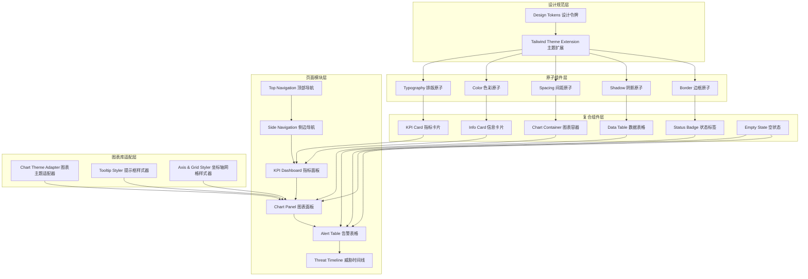
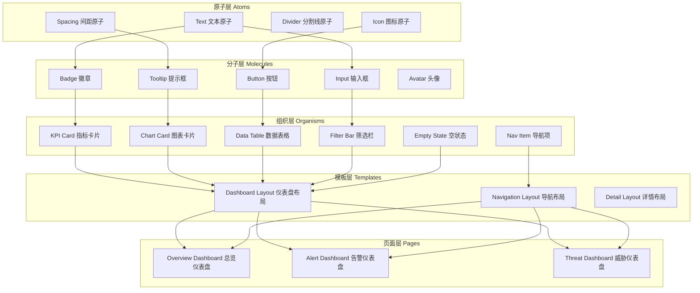
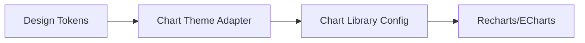
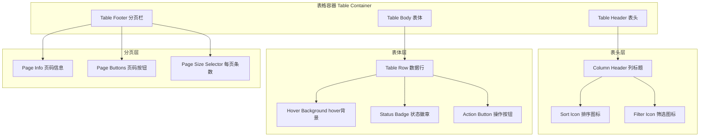
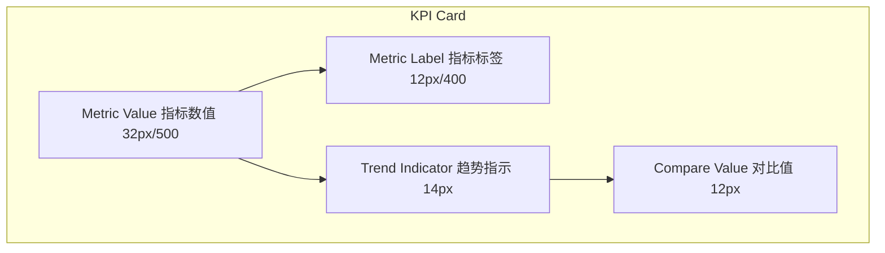
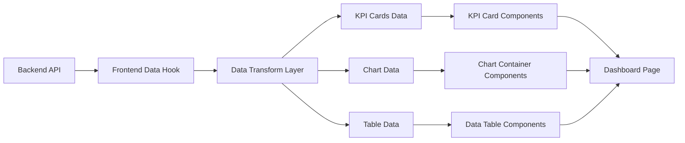

# Dashboard UI 优化技术设计方案

## 1. 架构概述

### 1.1 架构目标

- **可扩展性**：设计令牌系统与组件架构支持未来新增仪表盘模块时无需重复定义视觉规范，通过统一的设计系统即可覆盖新场景
- **高可用性**：设计层面确保关键安全指标在首屏可见，信息层级分明，降低安全分析师的认知负荷与误读概率
- **可维护性**：通过 Tailwind CSS 主题扩展与原子化组件设计，使样式变更集中管理，减少分散的魔法值与硬编码样式

### 1.2 架构原则

- **单一职责原则**：每个设计令牌只负责一种视觉属性，每个组件只负责一种展示模式
- **开闭原则**：主题扩展对新增组件开放，对已有组件的核心定义封闭，新增场景通过组合而非修改实现
- **里氏替换原则**：所有卡片组件、表格组件、图表组件应遵循统一的视觉基类规范，可互相替换而不破坏整体视觉一致性
- **接口隔离原则**：设计令牌按职责分组（颜色、字体、间距、阴影），使用者只依赖所需分组
- **依赖倒置原则**：组件依赖抽象的设计令牌与 Tailwind 工具类，不直接依赖具体色值或尺寸

### 1.3 核心设计方向

- **克制**：减少不必要的装饰，以内容为核心；霓虹灯发光、脉冲动画、过度圆角等效果全部移除
- **清晰**：信息层级分明，一眼获取关键数据；文字、颜色、间距形成明确的视觉层级
- **专业**：传递安全产品的权威感与可信度；消除赛博朋克风格、游戏化界面
- **一致**：全产品视觉语言统一；多种风格混搭、组件不统一的问题通过设计令牌系统解决
- **静谧**：深色模式下沉稳、内敛，不打扰用户；高饱和度荧光色、频繁闪烁提醒全部禁止

---

## 2. 系统架构

### 2.1 整体架构图

### 2.2 架构分层说明

#### 2.2.1 设计规范层

- **设计令牌**：定义颜色、字体、间距、阴影、圆角等基础视觉常量，作为全产品的唯一视觉真相源
- **Tailwind 主题扩展**：将设计令牌注入 Tailwind 配置，使工具类与设计规范保持同步

#### 2.2.2 原子组件层

- 基于 Tailwind 工具类构建的最小不可再分视觉单元，如文字尺寸、行高、字重、颜色工具类
- 原子层不承载业务逻辑，只提供视觉能力

#### 2.2.3 复合组件层

- 由原子组件组合而成的可复用 UI 组件，如 KPI 卡片、数据表格、状态标签等
- 复合组件遵循统一的设计令牌与交互规范，确保视觉一致性

#### 2.2.4 页面模块层

- 由复合组件拼装而成的仪表盘页面区域，如导航栏、指标面板、图表面板、告警表格等
- 页面模块负责布局网格与数据编排，不直接定义样式

#### 2.2.5 图表库适配层

- 独立于 React 组件树之外的主题配置层，负责将设计令牌映射到图表库的配置对象中
- 通过适配器模式将图表库的内部样式系统与设计规范解耦

---

## 3. 设计令牌系统

### 3.1 设计令牌层级

设计令牌分为三个层级：

- **Core Tokens**：平台无关的基础物理值（如色值 hex、尺寸 px、字体名）
- **Semantic Tokens**：带有语义含义的抽象值（如 `danger-bg`、`surface-primary`）
- **Component Tokens**：组件级专用值（如 `card-radius`、`table-row-height`）

### 3.2 颜色令牌

#### 3.2.1 主色板

| 令牌名        | 浅色模式值 | 深色模式值 | 用途               |
| ------------- | ---------- | ---------- | ------------------ |
| `primary-50`  | `#f8fafc`  | `#0f172a`  | 最浅背景           |
| `primary-100` | `#f1f5f9`  | `#1e293b`  | 卡片背景           |
| `primary-200` | `#e2e8f0`  | `#334155`  | 边框、分割线       |
| `primary-300` | `#cbd5e1`  | `#475569`  | 禁用状态、次要边框 |
| `primary-400` | `#94a3b8`  | `#64748b`  | 次要文字           |
| `primary-500` | `#64748b`  | `#94a3b8`  | 辅助文字           |
| `primary-600` | `#475569`  | `#cbd5e1`  | 默认文字           |
| `primary-700` | `#334155`  | `#e2e8f0`  | 强调文字           |
| `primary-800` | `#1e293b`  | `#f1f5f9`  | 深色背景           |
| `primary-900` | `#0f172a`  | `#f8fafc`  | 最深背景           |

主色调采用 Slate 色系，传递沉稳、专业的企业级气质。深色模式不是简单的反色，而是独立映射的层级体系。

#### 3.2.2 语义色板

| 语义 | 令牌名    | 色值      | 浅色背景  | 深色背景  | 文字色                |
| ---- | --------- | --------- | --------- | --------- | --------------------- |
| 成功 | `success` | `#059669` | `#ecfdf5` | `#064e3b` | `#065f46` / `#6ee7b7` |
| 警告 | `warning` | `#d97706` | `#fffbeb` | `#78350f` | `#92400e` / `#fcd34d` |
| 危险 | `danger`  | `#dc2626` | `#fef2f2` | `#7f1d1d` | `#991b1b` / `#fca5a5` |
| 信息 | `info`    | `#2563eb` | `#eff6ff` | `#1e3a8a` | `#1e40af` / `#93c5fd` |

语义色全部采用低饱和度、沉稳的色调，禁止使用高饱和度荧光色（如 `#00FF00`、`#FF00FF`、`#00FFFF`）。

#### 3.2.3 严重程度色板

| 级别     | 令牌名              | 色值      | 背景色                | 文字色                |
| -------- | ------------------- | --------- | --------------------- | --------------------- |
| Critical | `severity-critical` | `#dc2626` | `#fef2f2` / `#7f1d1d` | `#991b1b` / `#fca5a5` |
| High     | `severity-high`     | `#ea580c` | `#fff7ed` / `#7c2d12` | `#c2410c` / `#fdba74` |
| Medium   | `severity-medium`   | `#d97706` | `#fffbeb` / `#78350f` | `#92400e` / `#fcd34d` |
| Low      | `severity-low`      | `#059669` | `#ecfdf5` / `#064e3b` | `#065f46` / `#6ee7b7` |
| Info     | `severity-info`     | `#2563eb` | `#eff6ff` / `#1e3a8a` | `#1e40af` / `#93c5fd` |

严重级别色板与语义色板保持一致，使用同色系的明度变化区分层级，禁止彩虹配色。

#### 3.2.4 背景色层级

| 场景          | 浅色模式  | 深色模式  |
| ------------- | --------- | --------- |
| 页面背景      | `#f8fafc` | `#0f172a` |
| 卡片/面板背景 | `#ffffff` | `#1e293b` |
| 悬浮/下拉背景 | `#f1f5f9` | `#334155` |
| 选中/激活背景 | `#e2e8f0` | `#475569` |
| 输入框背景    | `#ffffff` | `#0f172a` |

深色模式背景使用沉稳的深灰蓝色（`#0f172a`、`#1e293b`），禁止纯黑或发紫的深色背景。

#### 3.2.5 文字色层级

| 层级             | 浅色模式  | 深色模式  | 用途             |
| ---------------- | --------- | --------- | ---------------- |
| `text-primary`   | `#0f172a` | `#f1f5f9` | 页面标题、主文字 |
| `text-secondary` | `#334155` | `#94a3b8` | 模块标题、正文   |
| `text-tertiary`  | `#64748b` | `#64748b` | 辅助文字、描述   |
| `text-disabled`  | `#94a3b8` | `#475569` | 禁用状态         |
| `text-inverse`   | `#f8fafc` | `#0f172a` | 深色背景上的文字 |
| `text-link`      | `#2563eb` | `#60a5fa` | 链接文字         |
| `text-mono`      | `#0f172a` | `#f1f5f9` | IOC 数据等宽字体 |

所有文字与背景对比度符合 WCAG AA 标准（4.5:1 以上）。

### 3.3 字体令牌

#### 3.3.1 字体栈

| 令牌名      | 值                                                                                            | 用途            |
| ----------- | --------------------------------------------------------------------------------------------- | --------------- |
| `font-sans` | `ui-sans-serif, system-ui, -apple-system, BlinkMacSystemFont, 'Segoe UI', Roboto, sans-serif` | 通用界面文字    |
| `font-mono` | `ui-monospace, SFMono-Regular, Menlo, Monaco, 'Cascadia Code', monospace`                     | IOC、代码、日志 |

#### 3.3.2 字号层级

| 令牌名         | 尺寸 | 字重 | 行高 | 用途                   |
| -------------- | ---- | ---- | ---- | ---------------------- |
| `text-display` | 32px | 500  | 1.2  | KPI 大数字、风险评分   |
| `text-h1`      | 24px | 600  | 1.3  | 页面标题               |
| `text-h2`      | 18px | 600  | 1.4  | 模块标题、卡片标题     |
| `text-h3`      | 16px | 500  | 1.5  | 小标题、表格标题       |
| `text-body`    | 14px | 400  | 1.5  | 正文、表格内容         |
| `text-small`   | 12px | 400  | 1.5  | 辅助文字、标签、时间戳 |
| `text-caption` | 11px | 400  | 1.4  | 图表轴标签、徽章文字   |

排版层级至少包含 5 个层级，关键安全指标（如高危告警数）使用 `text-display` 在首屏可见。

### 3.4 间距令牌

间距系统采用 8pt / 4pt 双基础网格：

| 令牌名     | 值   | 用途                   |
| ---------- | ---- | ---------------------- |
| `space-0`  | 0px  | 无间距                 |
| `space-1`  | 4px  | 极紧凑间距、图标内边距 |
| `space-2`  | 8px  | 基础间距、按钮内边距   |
| `space-3`  | 12px | 卡片内小间距           |
| `space-4`  | 16px | 标准间距、卡片内边距   |
| `space-5`  | 20px | 中等间距               |
| `space-6`  | 24px | 大间距、模块间间距     |
| `space-8`  | 32px | 页面模块间距           |
| `space-10` | 40px | 大模块间距             |
| `space-12` | 48px | 页面边距（桌面端）     |
| `space-16` | 64px | 超大间距               |

页面边距、模块间距、元素间距遵循统一规范。Dashboard 模块之间采用 `space-6` 或 `space-8` 的呼吸感间距。

### 3.5 圆角令牌

| 令牌名        | 值     | 用途                           |
| ------------- | ------ | ------------------------------ |
| `radius-none` | 0px    | 表格、数据密集型区域           |
| `radius-sm`   | 4px    | 小按钮、小标签、表格行内徽章   |
| `radius-md`   | 8px    | 标准卡片、输入框、下拉面板     |
| `radius-lg`   | 12px   | 大卡片、模态框                 |
| `radius-full` | 9999px | 头像、圆形图标按钮（极少使用） |

卡片圆角统一为 `radius-md` 或 `radius-lg`，禁止超过 16px 的大圆角。表格、分页器等数据密集型组件使用 `radius-sm` 或 `radius-none`。

### 3.6 阴影令牌

| 令牌名          | 值                                                                     | 用途                   |
| --------------- | ---------------------------------------------------------------------- | ---------------------- |
| `shadow-none`   | none                                                                   | 扁平展示               |
| `shadow-subtle` | `0 1px 2px 0 rgb(0 0 0 / 0.05)`                                        | 导航栏底部、分割线替代 |
| `shadow-sm`     | `0 1px 3px 0 rgb(0 0 0 / 0.1), 0 1px 2px -1px rgb(0 0 0 / 0.1)`        | 卡片默认、下拉面板     |
| `shadow-md`     | `0 4px 6px -1px rgb(0 0 0 / 0.05), 0 2px 4px -2px rgb(0 0 0 / 0.05)`   | 卡片悬浮、模态框       |
| `shadow-lg`     | `0 10px 15px -3px rgb(0 0 0 / 0.08), 0 4px 6px -4px rgb(0 0 0 / 0.08)` | 弹窗、下拉菜单         |

阴影全部使用中性色投影，禁止使用发光阴影（glow）、彩色阴影、glass 阴影、neumorphic 阴影。

### 3.7 边框令牌

| 令牌名           | 值                    | 用途                 |
| ---------------- | --------------------- | -------------------- |
| `border-width`   | 1px                   | 标准边框             |
| `border-subtle`  | `#e2e8f0` / `#334155` | 卡片边框、表格分割线 |
| `border-default` | `#cbd5e1` / `#475569` | 输入框边框、激活状态 |
| `border-focus`   | `#2563eb` / `#60a5fa` | 聚焦状态边框         |

卡片边框使用极细的中性色边框（`border-subtle`），替代或配合阴影使用。深色模式下边框使用半透明白色或深灰色，禁止使用亮色边框。

---

## 4. Tailwind CSS 主题扩展方案

### 4.1 扩展策略

Tailwind 主题扩展基于现有 `tailwind.config.ts` 进行重构，策略如下：

- **保留基础结构**：content 配置、TypeScript 类型定义保持不变
- **扩展 colors**：将 Slate 色系注入为 `slate` 系列，并扩展自定义语义色系列（`semantic-success`、`semantic-danger` 等）
- **扩展 fontSize**：注入自定义字号层级（`display`、`h1`、`h2`、`h3`、`body`、`small`、`caption`）
- **扩展 spacing**：在 8pt 网格基础上补充关键间距值
- **扩展 borderRadius**：限定可用的圆角层级，移除 `2xl` 以上的大圆角
- **扩展 boxShadow**：重新定义阴影体系，移除 `glow`、`glass`、`neumorphic` 等廉价科技感阴影
- **扩展 animation**：仅保留 `fade-in`、`fade-in-up`、`slide-in-right` 等简洁动画，移除 `pulse-soft`、`glow-pulse`、`shimmer`、`wiggle`、`morph` 等花哨动画

### 4.2 移除项清单

以下现有 Tailwind 扩展项必须移除：

| 类别 | 移除项                                                                       | 原因                             |
| ---- | ---------------------------------------------------------------------------- | -------------------------------- |
| 阴影 | `glow`、`glow-success`、`glow-danger`                                        | 发光效果属于霓虹灯风格           |
| 阴影 | `glass`                                                                      | 玻璃拟态效果廉价且干扰数据阅读   |
| 阴影 | `neumorphic`、`neumorphic-inset`、`neumorphic-dark`、`neumorphic-inset-dark` | 拟态风格与专业安全产品气质不符   |
| 动画 | `pulse-soft`                                                                 | 脉冲动画分散注意力               |
| 动画 | `float`                                                                      | 悬浮动画干扰界面稳定性           |
| 动画 | `glow-pulse`                                                                 | 发光脉冲属于霓虹灯风格           |
| 动画 | `shimmer`                                                                    | 闪光效果廉价                     |
| 动画 | `bounce-soft`                                                                | 弹跳动画不专业                   |
| 动画 | `wiggle`                                                                     | 摇晃动画干扰用户                 |
| 动画 | `rotate-slow`                                                                | 旋转动画与数据场景无关           |
| 动画 | `morph`                                                                      | 形态变换动画过于花哨             |
| 动画 | `scale-in`                                                                   | 放大动画在数据场景不必要         |
| 颜色 | 高饱和度的自定义色值（如 `#00FF00` 等）                                      | 高饱和度荧光色传递廉价感         |
| 颜色 | 大面积渐变背景配置                                                           | 彩虹渐变、紫蓝渐变属于廉价科技感 |

### 4.3 保留项清单

以下现有 Tailwind 扩展项予以保留：

| 类别 | 保留项                                      | 调整说明                          |
| ---- | ------------------------------------------- | --------------------------------- |
| 动画 | `fade-in`                                   | 时长调整为 150ms                  |
| 动画 | `fade-in-up`                                | 位移调整为 8px，时长 200ms        |
| 动画 | `slide-in-right`                            | 位移调整为 8px，时长 200ms        |
| 颜色 | `success`、`warning`、`danger`、`info` 系列 | 将色值调整为低饱和度版本          |
| 颜色 | `gray` 系列                                 | 映射为 Slate 色系                 |
| 阴影 | `soft`                                      | 重命名为 `shadow-sm` 并降低透明度 |
| 阴影 | `card`                                      | 重命名为 `shadow-md` 并降低透明度 |
| 阴影 | `elevated`                                  | 重命名为 `shadow-lg` 并降低透明度 |

---

## 5. 组件层级重构

### 5.1 组件分层模型

### 5.2 原子层 Atoms

原子层组件是最小不可再分的视觉单元，不承载业务逻辑：

| 组件    | 职责     | 规范                                                                  |
| ------- | -------- | --------------------------------------------------------------------- |
| Text    | 文字渲染 | 依赖字体令牌中的字号、字重、行高、颜色                                |
| Icon    | 图标渲染 | 统一使用线框风格（stroke-width: 1.5-2px），禁止填充风格图标或彩色图标 |
| Divider | 分割线   | 1px 高度，使用 `border-subtle` 颜色，无阴影                           |
| Spacing | 间距占位 | 使用 `space-*` 令牌，只提供物理间距                                   |

### 5.3 分子层 Molecules

分子层由原子组合而成，提供单一交互能力：

| 组件    | 职责     | 规范                                                                                    |
| ------- | -------- | --------------------------------------------------------------------------------------- |
| Badge   | 状态标签 | 圆角不超过 4px，字号 12px，使用语义色背景+文字色组合                                    |
| Button  | 按钮     | 圆角 8px，hover 仅允许背景色变化或轻微边框变化，点击时短暂按压效果（scale 0.98，100ms） |
| Input   | 输入框   | 圆角 8px，边框 1px，focus 时边框变为 `border-focus`，背景色使用 `input-bg`              |
| Tooltip | 提示框   | 简洁卡片样式，背景色 `surface`，阴影 `shadow-sm`，无边框发光                            |
| Avatar  | 头像     | 圆角 `radius-full`（仅此处允许全圆角），尺寸统一                                        |

### 5.4 组织层 Organisms

组织层是 Dashboard 中可直接复用的功能模块：

| 组件        | 职责         | 关键规范                                                                                                                                |
| ----------- | ------------ | --------------------------------------------------------------------------------------------------------------------------------------- |
| KPI Card    | 展示关键指标 | 圆角 8px 或 12px，阴影 `shadow-sm`，数值使用 `text-display`（28-36px），标签使用 `text-small`（12px），hover 仅允许轻微上移或边框色变化 |
| Chart Card  | 图表容器     | 圆角 8px，内部图表通过适配层渲染，标题使用 `text-h2`，卡片本身不提供图表样式                                                            |
| Data Table  | 数据表格     | 行高 48-52px，行分割线 1px `border-subtle`，hover 行使用极浅背景色（`#f8fafc` / `#1e293b`），状态列使用 Badge 展示                      |
| Nav Item    | 导航项       | 默认状态文字为中性色，hover 状态背景变浅灰/浅蓝灰、文字变主色，active 状态左侧使用 3-4px 宽的主色指示条                                 |
| Filter Bar  | 筛选栏       | 筛选面板样式与整体设计语言一致，使用 `shadow-md` 下拉面板，边框 `border-subtle`                                                         |
| Empty State | 空状态       | 简洁的线框图标 + 中性色文字说明，禁止使用动态插图或鲜艳色彩的装饰元素                                                                   |

---

## 6. 图表库样式配置

### 6.1 图表主题适配器架构

图表库（如 Recharts / ECharts）拥有独立的样式系统，需通过适配器将设计令牌映射到图表库配置对象中，实现设计规范与图表库解耦：

### 6.2 图表配色规范

图表配色从设计令牌中提取，使用同色系明度变化或低饱和度对比色，禁止彩虹配色：

| 图表系列 | 色值      | 用途                     |
| -------- | --------- | ------------------------ |
| Series 1 | `#2563eb` | 主数据系列（蓝）         |
| Series 2 | `#059669` | 对比数据系列（绿）       |
| Series 3 | `#d97706` | 警告数据系列（琥珀）     |
| Series 4 | `#dc2626` | 危险数据系列（红）       |
| Series 5 | `#64748b` | 中性数据系列（灰）       |
| Series 6 | `#7c3aed` | 辅助数据系列（低饱和紫） |

超出 6 个分类的饼图/环形图，将多余分类归为"其他"系列，使用中性灰色。

### 6.3 图表元素规范

| 元素        | 规范                                                                          |
| ----------- | ----------------------------------------------------------------------------- |
| 折线/面积图 | 线条粗细 2px，数据点仅在 hover 时高亮，默认状态下不显示数据点                 |
| 柱状图      | 柱子间距适中，圆角不超过 4px，禁止 3D 柱状图                                  |
| 饼图/环形图 | 最多展示 6 个分类，超出归类为"其他"；禁止使用爆炸式分离效果                   |
| 坐标轴      | 轴线颜色 `#cbd5e1`，刻度文字 11px `#64748b`                                   |
| 网格线      | 使用极浅的中性色（`#e2e8f0` / `#334155`），虚线样式，避免视觉干扰             |
| Tooltip     | 背景色 `surface-primary`，阴影 `shadow-sm`，圆角 8px，内边距 12px，无边框发光 |
| 图例        | 文字 12px，色块 8x8px，圆角 2px，居中对齐                                     |

### 6.4 安全趋势图表规范

| 配置项       | 规范                                                                  |
| ------------ | --------------------------------------------------------------------- |
| 默认时间粒度 | 最近 24 小时 / 最近 7 天                                              |
| 时间轴标签   | 相对简洁格式（如 "14:00"、"周一"）                                    |
| 数据缺失处理 | 连线中断，不补零，不显示空白                                          |
| 高亮区域     | Critical/High 数据使用对应语义色区分，其余使用中性色                  |
| 下钻交互     | 数据柱/区块支持点击，hover 时鼠标变为手型，tooltip 提示"点击查看详情" |

---

## 7. 表格结构设计

### 7.1 表格视觉架构

### 7.2 表格视觉规范

| 元素      | 规范                                                                                                           |
| --------- | -------------------------------------------------------------------------------------------------------------- |
| 表头      | 字号略大于正文（14px 或 15px），字重 500-600，颜色略深（`text-secondary`），底部 1px 分割线（`border-subtle`） |
| 行高      | 统一 48-52px，行与行之间使用极细的分割线（1px `border-subtle`）或斑马纹背景（`#f8fafc` / `#0f172a`）           |
| 行 hover  | 使用极浅的背景色变化（`#f8fafc` / `#1e293b`），禁止行变色、发光等效果                                          |
| 状态列    | 使用带底色的小标签（Badge）展示，Badge 圆角不超过 4px，字号 12px                                               |
| 操作列    | 按钮采用图标+文字或纯图标，图标风格统一（线框风格），hover 时显示文字提示（Tooltip）                           |
| 排序/筛选 | 交互面板样式与整体设计语言一致，使用 `shadow-md` 下拉面板，边框 `border-subtle`                                |
| 分页器    | 样式简洁，页码按钮圆角不超过 4px，当前页使用主色背景+白字，其他页使用中性色                                    |

### 7.3 告警列表表格特殊规范

| 字段     | 展示规范                                    |
| -------- | ------------------------------------------- |
| 告警级别 | 左侧色条指示（2px 宽）+ Severity Badge      |
| 告警类型 | 纯文字，使用 `text-body`                    |
| 来源     | 纯文字或带图标，图标使用线框风格            |
| 时间     | 相对时间（如 "2 小时前"）+ 绝对时间 Tooltip |
| 状态     | 使用 Badge 展示，颜色映射到状态语义色       |
| 操作     | 图标按钮组，hover 时显示 Tooltip 提示       |

---

## 8. 导航架构设计

### 8.1 导航结构

```mermaid
graph TB
    subgraph 顶部导航 Top Navigation
        N1[Logo / Brand]
        N2[Global Search 全局搜索]
        N3[Notification Icon 通知图标]
        N4[User Avatar 用户头像]
    end

    subgraph 侧边导航 Side Navigation
        S1[Menu Group 1 总览]
        S2[Menu Group 2 告警]
        S3[Menu Group 3 资产]
        S4[Menu Group 4 威胁]
        S5[Menu Group 5 运营]
    end

    subgraph 面包屑 Breadcrumbs
        B1[Home]
        B2[Dashboard]
        B3[Current Page]
    end

    N1 --> N2
    N2 --> N3
    N3 --> N4
    S1 --> S2
    S2 --> S3
    S3 --> S4
    S4 --> S5
    B1 --> B2
    B2 --> B3
```

### 8.2 顶部导航规范

| 元素     | 规范                                                              |
| -------- | ----------------------------------------------------------------- |
| 高度     | 统一 56-64px                                                      |
| 背景色   | 纯色（浅色模式白色，深色模式 `#1e293b`），禁止渐变背景            |
| 阴影     | 极微妙的底部投影（`shadow-subtle`），禁止发光阴影                 |
| Logo     | 简洁文字或单色图标，不使用彩色渐变 Logo                           |
| 搜索框   | 圆角 8px，背景色 `#f1f5f9` / `#334155`，无边框发光                |
| 通知图标 | 使用中性色线框图标，hover 时圆形背景变灰（`#f1f5f9` / `#334155`） |
| 用户头像 | 全圆角，尺寸统一，下拉菜单使用 `shadow-md` 面板                   |

### 8.3 侧边导航规范

| 元素       | 规范                                                                                                                                                                               |
| ---------- | ---------------------------------------------------------------------------------------------------------------------------------------------------------------------------------- |
| 宽度       | 固定 240-260px，可折叠至 64px（仅图标）                                                                                                                                            |
| 背景色     | 与页面背景一致或略深（`#f8fafc` / `#0f172a`）                                                                                                                                      |
| 菜单项     | 默认状态文字为中性色（`text-tertiary`），hover 状态背景变浅灰/浅蓝灰（`#f1f5f9` / `#334155`）、文字变主色（`text-primary`），active 状态左侧使用 3-4px 宽的主色指示条（`primary`） |
| 菜单图标   | 统一使用线框风格（stroke-width: 1.5-2px），禁止使用填充风格图标或彩色图标                                                                                                          |
| 菜单组标题 | 12px 大写，颜色 `text-tertiary`，与菜单项之间留 16px 间距                                                                                                                          |
| 展开/折叠  | 使用简洁的 Chevron 图标，过渡动画 150ms ease-out                                                                                                                                   |

### 8.4 面包屑规范

| 元素     | 规范                                         |
| -------- | -------------------------------------------- |
| 字号     | 14px                                         |
| 分隔符   | `/` 或 `>`，颜色为中性灰（`text-tertiary`）  |
| 当前页   | 颜色 `text-primary`，字重 500                |
| 可点击页 | 颜色 `text-link`，hover 时下划线             |
| 位置     | 页面标题上方或导航栏下方，与页面标题间距 8px |

---

## 9. 数据展示组件设计

### 9.1 KPI 指标卡片设计

| 元素     | 规范                                                                    |
| -------- | ----------------------------------------------------------------------- |
| 卡片尺寸 | 宽度自适应网格（4-6 列），高度固定或按内容                              |
| 数值     | 大字号 28-36px，字重 500，颜色 `text-primary`                           |
| 标签     | 小字号 12px，字重 400，颜色 `text-tertiary`，位于数值下方或右侧         |
| 趋势     | 使用箭头图标 + 百分比，上升绿色、下降红色、持平灰色，颜色来自语义色规范 |
| 对比值   | 更小字号 11px，颜色 `text-tertiary`，如 "vs 昨日"                       |
| 卡片排列 | 首屏顶部展示 4-6 个 KPI 卡片，横向排列，间距 `space-4`                  |

### 9.2 风险评分展示设计

| 元素     | 规范                                                                                                                                           |
| -------- | ---------------------------------------------------------------------------------------------------------------------------------------------- |
| 展示形式 | 数字 + 进度条/环形进度                                                                                                                         |
| 数字     | `text-display`（32px），字重 500，颜色随分数变化                                                                                               |
| 进度条   | 高度 4-6px，圆角 `radius-full`，背景色 `border-subtle`，进度色使用语义色                                                                       |
| 环形进度 | 线宽 4-6px，圆角末端，背景色 `border-subtle`，进度色使用语义色                                                                                 |
| 颜色映射 | 低风险=绿（`success`）、中风险=黄（`warning`）、高风险=橙（`warning` 深色系）、严重风险=红（`danger`），颜色必须来自语义色规范，禁止彩虹色渐变 |

### 9.3 时间展示设计

| 场景     | 规范                                                                                           |
| -------- | ---------------------------------------------------------------------------------------------- |
| 告警时间 | 相对时间（如 "2 小时前"）+ 绝对时间 Tooltip（"2024-01-15 14:30:00"）                           |
| 时间粒度 | 默认最近 24 小时 / 7 天，支持切换但默认视图不空白                                              |
| 时间轴   | 图表 X 轴使用简洁时间格式，避免重叠                                                            |
| 时间线   | 威胁事件时间线使用垂直步骤条，已完成步骤使用中性灰或绿色，当前步骤使用主色，未完成步骤使用浅灰 |

### 9.4 IOC 数据展示设计

| 数据类型 | 展示规范                                                                                   |
| -------- | ------------------------------------------------------------------------------------------ |
| IP       | 等宽字体（`font-mono`），背景色 `code-bg`（`#f1f5f9` / `#1e293b`），圆角 4px，支持一键复制 |
| 域名     | 等宽字体，支持一键复制，hover 时下划线                                                     |
| Hash     | 等宽字体，显示前 8 位 + 省略号 + 后 8 位，支持一键复制全值                                 |
| 复制按钮 | 线框复制图标，hover 时颜色变化，点击后短暂显示"已复制"提示                                 |

### 9.5 状态流转展示设计

| 元素     | 规范                                                                                                        |
| -------- | ----------------------------------------------------------------------------------------------------------- |
| 展示形式 | 水平步骤条或垂直时间线                                                                                      |
| 步骤节点 | 圆形，直径 24px，已完成步骤填充中性灰或绿色，当前步骤填充主色，未完成步骤空心浅灰                           |
| 步骤连线 | 1px，已完成步骤为实线，未完成步骤为虚线                                                                     |
| 步骤文字 | 12px，已完成步骤颜色 `text-secondary`，当前步骤颜色 `text-primary` 字重 500，未完成步骤颜色 `text-tertiary` |

### 9.6 空状态设计

| 元素   | 规范                                                                           |
| ------ | ------------------------------------------------------------------------------ |
| 插图   | 简洁的线框图标（Outline style），尺寸 64x64px 或 96x96px，颜色 `text-tertiary` |
| 标题   | 16px，字重 500，颜色 `text-secondary`                                          |
| 描述   | 14px，颜色 `text-tertiary`                                                     |
| 操作   | 可选的按钮，使用主色线框按钮或填充按钮                                         |
| 禁止项 | 禁止使用动态插图、鲜艳色彩的装饰元素、3D 图标、动画角色                        |

---

## 10. 深色模式映射

### 10.1 映射原则

深色模式不是简单的"反色"，而是独立设计的色彩映射体系：

| 浅色模式元素       | 深色模式对应值              | 说明                             |
| ------------------ | --------------------------- | -------------------------------- |
| 页面背景 `#f8fafc` | `#0f172a`                   | 最深的背景色，不发紫、不发蓝过深 |
| 卡片背景 `#ffffff` | `#1e293b`                   | 比页面背景略浅，形成层级         |
| 悬浮背景 `#f1f5f9` | `#334155`                   | 中间层级，用于 hover、下拉       |
| 激活背景 `#e2e8f0` | `#475569`                   | 选中状态、当前导航项             |
| 主文字 `#0f172a`   | `#f1f5f9`                   | 最亮文字，用于标题               |
| 次文字 `#334155`   | `#94a3b8`                   | 正文、描述                       |
| 辅助文字 `#64748b` | `#64748b`                   | 时间戳、标签（保持不变）         |
| 禁用文字 `#94a3b8` | `#475569`                   | 禁用状态                         |
| 边框 `#e2e8f0`     | `#334155`                   | 分割线、边框                     |
| 语义色背景         | 使用对应色系的 900/950 级别 | 如危险背景 `#7f1d1d`             |
| 语义色文字         | 使用对应色系的 300/400 级别 | 如危险文字 `#fca5a5`             |

### 10.2 深色模式切换

- 切换机制通过 CSS 变量或 `dark` 类名在根元素切换
- 图表库适配器需同时监听主题变化，动态更新图表配置
- 所有组件需支持 `dark` 变体，通过 Tailwind 的 `dark:` 前缀实现

---

## 11. 交互规范映射

### 11.1 Hover 状态映射

| 元素类型 | Hover 反馈                              | 禁止项                     |
| -------- | --------------------------------------- | -------------------------- |
| 按钮     | 背景色变浅灰/主色浅背景                 | 发光、放大、颜色剧变       |
| 卡片     | 轻微上移（translateY -2px）或边框色变化 | 霓虹灯发光、放大、阴影变色 |
| 链接     | 颜色变化 + 下划线                       | 闪烁、背景变色             |
| 表格行   | 极浅背景色变化                          | 行变色、发光、放大         |
| 导航项   | 背景变浅灰/浅蓝灰、文字变主色           | 彩色背景、发光指示条       |
| 图标按钮 | 圆形背景变灰                            | 发光、旋转、弹跳           |

### 11.2 点击反馈映射

| 元素类型   | 点击反馈                                | 持续时间        |
| ---------- | --------------------------------------- | --------------- |
| 按钮       | 短暂按压效果（scale 0.98 或背景色变深） | 100ms           |
| 卡片       | 轻微下沉（translateY +1px）或阴影加深   | 100ms           |
| 表格行     | 无额外点击反馈（行本身不触发点击）      | -               |
| 图表数据点 | 数据点高亮显示                          | 持续 hover 状态 |

### 11.3 加载状态映射

| 场景     | 规范                                                                |
| -------- | ------------------------------------------------------------------- |
| 页面加载 | 使用极简的骨架屏（Skeleton），矩形占位块，使用 `border-subtle` 颜色 |
| 数据加载 | 细线型进度条（高度 2px），使用主色                                  |
| 表格加载 | 骨架行，高度与真实行一致（48-52px），无闪烁动画                     |
| 禁止项   | 旋转的菊花 Loading、彩色动画、脉冲发光骨架                          |

### 11.4 过渡动画映射

| 场景       | 动画                           | 持续时间  | 缓动     |
| ---------- | ------------------------------ | --------- | -------- |
| 页面切换   | fade + slight-slide            | 150-200ms | ease-out |
| 下拉展开   | fade + slide-down              | 150ms     | ease-out |
| 模态框出现 | fade + scale(0.98 -> 1)        | 200ms     | ease-out |
| 卡片 hover | translateY(-2px)               | 150ms     | ease-out |
| 导航切换   | 指示条滑动                     | 200ms     | ease-out |
| 禁止项     | 旋转、弹跳、发光脉冲、形态变换 | -         | -        |

---

## 12. 数据流设计

### 12.1 Dashboard 数据流

### 12.2 数据流说明

- **Backend API**：后端提供聚合后的统计数据与趋势数据，接口格式保持不变
- **Frontend Data Hook**：使用 React Query 或 SWR 获取数据，管理缓存与重试
- **Data Transform Layer**：将后端数据转换为组件所需的格式，不负责计算，仅做映射与格式化
- **组件渲染层**：接收格式化后的数据，使用设计令牌与组件规范进行渲染

### 12.3 图表数据适配

图表数据在进入图表库前，需经过 Chart Theme Adapter 进行样式注入：

- 颜色映射：将数据系列映射到设计令牌中的图表色板
- 坐标轴配置：注入字体、颜色、网格线样式
- Tooltip 配置：注入卡片样式、字体、阴影
- 响应式：图表容器监听尺寸变化，图表库重新渲染

---

## 13. 与需求文档的覆盖映射

| 需求 ID | 需求名称     | 设计文档覆盖章节                                         | 覆盖说明                                                   |
| ------- | ------------ | -------------------------------------------------------- | ---------------------------------------------------------- |
| FR-001  | 排版优化     | 3.3 字体令牌、3.4 间距令牌、9.1 KPI 卡片设计             | 8pt/4pt 间距网格、5 级文字层级、首屏 KPI 布局              |
| FR-002  | 颜色系统优化 | 3.2 颜色令牌、10. 深色模式映射                           | 移除荧光色、Slate 色系主色、语义色规范、深色模式独立映射   |
| FR-003  | 卡片组件优化 | 5.4 组织层、9.1 KPI 卡片设计、3.5 圆角令牌、3.6 阴影令牌 | 圆角 8/12px、微妙阴影、边框替代、hover 规范                |
| FR-004  | 图表优化     | 6. 图表库样式配置                                        | 同色系配色、线条/柱状/饼图规范、坐标轴/网格线/Tooltip 样式 |
| FR-005  | 表格优化     | 7. 表格结构设计                                          | 表头/行高/分割线/Badge/操作列/分页器规范                   |
| FR-006  | 导航优化     | 8. 导航架构设计                                          | 顶部/侧边导航高度/背景/阴影/菜单项/图标/面包屑规范         |
| FR-007  | 数据展示优化 | 9. 数据展示组件设计                                      | KPI 卡片、风险评分、时间展示、IOC、状态流转、空状态规范    |

---

## 14. 排除项确认

本设计文档明确不包含以下设计内容，与需求文档第 8 节排除项保持一致：

1. **性能优化设计**：页面加载速度、数据请求优化、虚拟滚动等
2. **安全功能设计**：认证、授权、审计日志等
3. **测试相关设计**：单元测试、视觉回归测试、E2E 测试用例
4. **部署相关设计**：CI/CD、容器化、环境配置
5. **新增业务功能设计**：不新增图表类型、数据维度或业务逻辑
6. **响应式适配设计**：聚焦桌面端（1280px+），移动端不在范围内
7. **国际化设计**：聚焦中文/英文视觉呈现，多语言特殊排版不在范围内
8. **具体代码实现**：仅提供设计规范与架构，不输出具体代码
9. **非功能性设计**：性能指标、安全架构、可扩展性架构未展开
10. **监控和日志设计**：未涉及
11. **数据库优化**：未涉及

---

> **文档说明**：本设计文档基于需求文档 `.cospec/dashboard-optimization/requirements.md` 编制，聚焦 Dashboard UI/UX 视觉与交互层面的技术设计方案。所有设计均围绕"消除廉价科技感、建立企业级专业品质"展开，以安全产品专业场景为核心。
