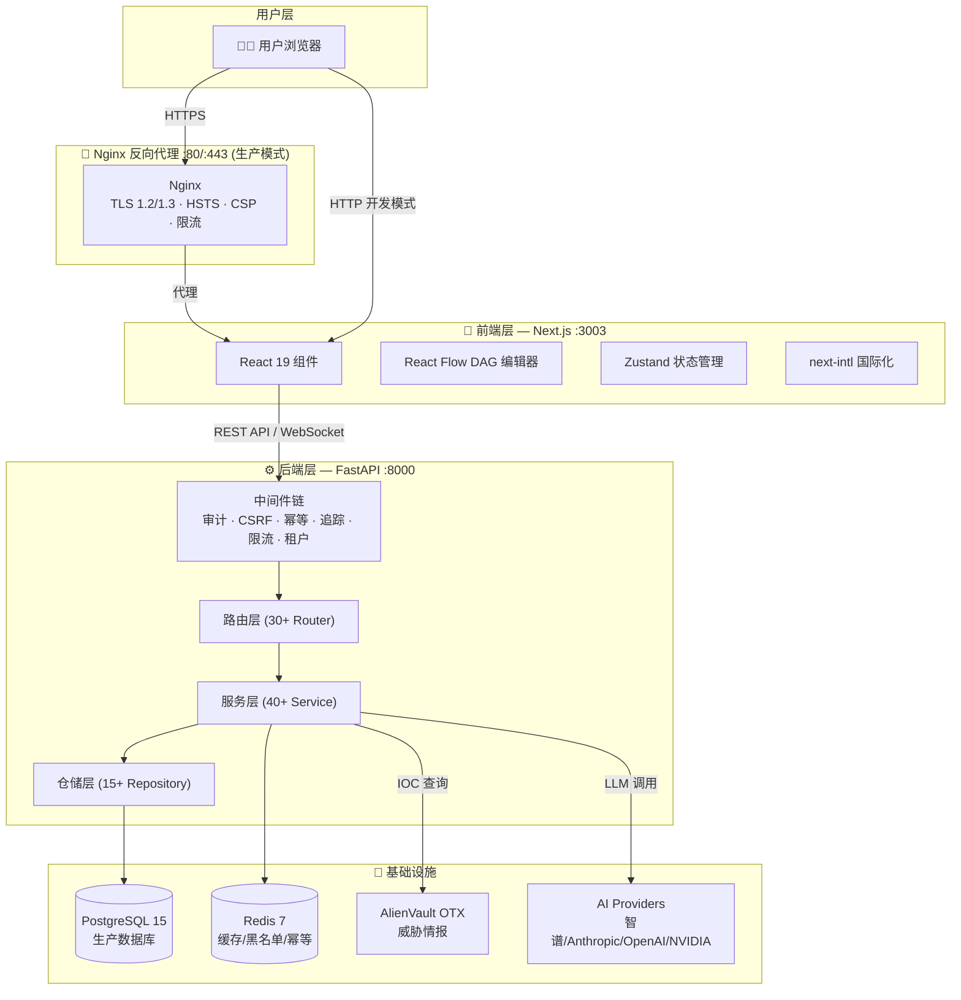
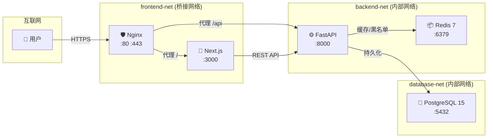
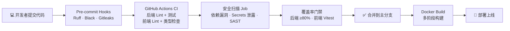

**SOC Copilot** 是一个面向安全运营中心（Security Operations Center）的智能分析工作台，集成了 AI 驱动的告警分析、自动化 Playbook 编排、威胁情报查询、资产管理、用户行为分析等核心 SOC 能力。项目当前版本为 **v0.9.0**，采用 Python FastAPI + Next.js 前后端分离架构，支持 Docker Compose 一键部署，既可作为开发环境快速启动，也可通过 Nginx 反向代理 + PostgreSQL 部署到生产环境。本文档将从全局视角介绍平台定位、核心能力、技术架构与模块划分，帮助你建立对系统的第一性理解。

Sources: [README.md](README.md#L1-L45), [PROJECT_SUMMARY.md](PROJECT_SUMMARY.md#L1-L30)

## 平台定位与核心价值

SOC 团队每天面临数百甚至数千条安全告警，传统手动分析流程耗时且容易遗漏关键威胁。SOC Copilot 的核心设计目标是**将 AI 能力深度嵌入安全运营的每一个关键环节**——从告警接收、IOC 提取、威胁情报关联，到时间线重建、报告生成乃至自动化响应编排——形成一套"告警进来 → AI 分析 → 自动处置 → 报告输出"的完整闭环。

平台的差异化价值体现在三个层面：

| 价值维度 | 具体能力 | 对 SOC 团队的意义 |
|---|---|---|
| **AI 增强** | 支持 6 家 LLM Provider（智谱/Anthropic/OpenAI/NVIDIA/Moonshot/OpenRouter），双引擎 IOC 提取，自动严重性评估 | 降低分析师认知负荷，从数小时分析缩短至分钟级 |
| **自动化编排** | DAG 工作流引擎 + 可视化编辑器 + 5 种内置节点插件 + Webhook/Cron 触发器 | 将重复性响应动作标准化、自动化，减少人为失误 |
| **安全合规** | RBAC 权限控制、Fernet 密钥加密、HTTP 沙箱白名单、JWT 黑名单、审计日志归档 | 满足企业级安全运营合规要求 |

Sources: [README.md](README.md#L13-L45), [backend/core/config.py](backend/core/config.py#L1-L50)

## 核心功能全景

以下表格展示了 SOC Copilot 已实现的全部功能模块及其 API 入口，帮助你快速建立功能边界认知：

| 功能域 | 核心能力 | 主要 API 路径 | 前端页面 |
|---|---|---|---|
| **告警分析** | 9 类事件分类、严重性评估、双引擎 IOC 提取、实体识别、证据提取 | `/api/analyze-alert` | `/alerts` |
| **时间线构建** | 自动事件时间线重建、Top 5 可疑事件排名、调查建议 | `/api/build-timeline` | `/alerts/[id]` |
| **报告生成** | 工单模板、日报模板、事后分析模板 | `/api/generate-report` | `/reports` |
| **资产管理** | 全生命周期 CRUD、批量 JSON 导入、多维搜索、关键性分级 | `/api/assets` | `/assets` |
| **威胁情报** | AlienVault OTX 集成、7 天本地缓存、合规过滤（私有 IP/内部域名） | `/api/threat-intel` | `/threat-intel` |
| **IOC 追踪** | 告警-资产自动关联、手动添加、多维度分析 | `/api/ioc-hits` | 内嵌于告警页 |
| **Playbook 引擎** | DAG 可视化编排、版本管理、执行队列、密钥管理、导入导出 | `/api/playbook-definitions` | `/playbooks` |
| **触发器系统** | Webhook 触发 + Cron 定时任务、幂等性保障 | `/api/triggers` | `/triggers` |
| **审批管理** | 人工审批节点、审批收件箱、通过/拒绝操作 | `/api/playbook/approvals` | `/playbooks/approvals` |
| **AI 助手** | 多轮对话、自然语言查询 SOC 数据、Playbook 推荐 | `/api/ai` | `/ai-assistant` |
| **UEBA** | 基于 ML 的行为异常检测、用户风险画像、自适应基线 | `/api/ueba` | `/ueba` |
| **威胁狩猎** | 假设驱动狩猎、IOC 批量查询、狩猎结果追踪 | `/api/threat-hunting` | `/threat-hunting` |
| **事件关联** | 规则 DSL、时间窗口聚合、加权评分、关联事件图谱 | `/api/correlation` | `/correlation` |
| **Playbook 商城** | 社区共享 Playbook、分类浏览、评分评论、精选推荐 | `/api/marketplace` | `/marketplace` |
| **云原生安全** | 容器扫描、K8s 审计、云事件监控、CIS/NIST 合规检查 | `/api/cloud-native` | `/cloud-native` |
| **实时通信** | WebSocket 频道订阅、连接池管理、离线消息队列 | `/api/ws` | 全局组件 |
| **系统监控** | 健康检查、性能指标、队列状态、审计日志 | `/api/health`, `/api/monitor` | `/admin/health`, `/monitor` |

Sources: [README.md](README.md#L52-L120), [PROJECT_SUMMARY.md](PROJECT_SUMMARY.md#L32-L165), [backend/models/__init__.py](backend/models/__init__.py#L1-L66)

## 系统架构总览

SOC Copilot 采用经典的**三层分离架构**——前端渲染层、后端 API 层、数据持久层——通过 Docker 网络隔离确保安全性。下图展示了从用户浏览器到数据库的完整请求链路：

**架构要点说明**：

**前端层**基于 Next.js 16 App Router 构建，使用 React 19 + TypeScript 5，UI 框架为 Tailwind CSS 3.4 + Lucide 图标库。React Flow 提供 DAG 可视化编排能力，`@tanstack/react-query` 管理服务端状态，Zustand 管理客户端状态。国际化通过 `next-intl` 实现中英双语支持。

**后端层**以 FastAPI 为 Web 框架，采用清晰的**路由 → 服务 → 仓储**三层分离模式。中间件链按优先级顺序处理审计日志、CSRF 防护、幂等性检查、请求追踪、速率限制和多租户隔离。40+ 业务服务覆盖从 AI 分析到 Playbook 执行的全部业务逻辑。

**基础设施层**在生产模式下使用 PostgreSQL 15 作为主数据库（开发模式可用 SQLite），Redis 7 处理缓存、JWT 黑名单和幂等性检查。外部集成包括 AlienVault OTX 威胁情报 API 和多家 LLM Provider。

Sources: [docker-compose.yml](docker-compose.yml#L1-L154), [frontend/package.json](frontend/package.json#L1-L65), [backend/main.py](backend/main.py#L1-L60)

## 后端技术栈详解

后端采用 Python 异步生态，所有 I/O 操作均为 `async/await` 模式，确保在高并发告警处理场景下的吞吐量。

| 技术 | 版本 | 用途 | 关键配置 |
|---|---|---|---|
| **Python** | 3.12+ | 运行时 | 类型注解 100% 覆盖公共 API |
| **FastAPI** | 0.135.1 | Web 框架 | 自动 OpenAPI 文档生成 |
| **SQLAlchemy** | 2.0.47+ | ORM | 异步模式，连接池 20+40 overflow |
| **Pydantic** | 2.9.2 | 数据验证 | Settings 模式管理环境变量 |
| **Alembic** | 1.14.0 | 数据库迁移 | 启动时自动执行 `upgrade head` |
| **python-jose** | 3.3.0 | JWT 认证 | 支持 Token 黑名单与 Redis 分布式 |
| **passlib** | 1.7.4 | 密码加密 | bcrypt 哈希 |
| **croniter** | 3.0.3 | Cron 解析 | Playbook 定时触发器 |
| **cryptography** | 41.0.7 | 密钥加密 | Fernet 对称加密存储 Secrets |
| **OpenTelemetry** | 1.36.0 | 分布式追踪 | gRPC 导出至 Jaeger/Tempo |
| **Prometheus** | 7.0.0 | 指标采集 | FastAPI Instrumentator 集成 |

Sources: [backend/requirements.txt](backend/requirements.txt#L1-L47), [backend/core/config.py](backend/core/config.py#L1-L100)

## 前端技术栈详解

前端基于 Next.js App Router 构建，采用 Server Components + Client Components 混合渲染策略，首屏服务端渲染保证 SEO 和性能，交互组件客户端渲染保证流畅度。

| 技术 | 版本 | 用途 | 项目中的应用 |
|---|---|---|---|
| **Next.js** | 16.2 | React 框架 | App Router 路由、SSR/SSG |
| **React** | 19.0 | UI 库 | 组件化开发、Hooks 模式 |
| **TypeScript** | 5.x | 类型系统 | 全量类型覆盖 |
| **Tailwind CSS** | 3.4.19 | 样式框架 | 原子化 CSS、Design Tokens |
| **React Flow** | 11.11.4 | DAG 可视化 | Playbook 流程编排编辑器 |
| **Recharts** | 3.7.0 | 图表库 | 仪表板、趋势图、分布图 |
| **Zustand** | - | 状态管理 | 认证状态、主题、通知 |
| **React Query** | 5.90+ | 服务端状态 | 数据获取、缓存、乐观更新 |
| **next-intl** | 4.8+ | 国际化 | 中/英双语，命名空间翻译 |
| **Vitest** | 4.0+ | 单元测试 | 组件测试、Hook 测试 |
| **Playwright** | 1.40+ | E2E 测试 | 全流程集成测试 |
| **Sentry** | 10.40+ | 错误监控 | 前端异常追踪 |

Sources: [frontend/package.json](frontend/package.json#L1-L65)

## 项目版本演进

SOC Copilot 从 v0.3.0 的核心告警分析能力起步，经过持续迭代，逐步构建了完整的 SOC 工作台能力。以下梳理了关键版本的里程碑功能：

| 版本 | 核心交付 | 架构意义 |
|---|---|---|
| **v0.3.0** | 资产管理、IOC 追踪、影响分析 | 确立基础数据模型 |
| **v0.4.0** | OTX 威胁情报集成、本地缓存 | 引入外部情报源 |
| **v0.5.0** | SIEM 查询生成（Splunk/Elastic/Sentinel） | 横向扩展分析能力 |
| **v0.6.0** | Playbook 执行引擎、5 种内置步骤 | 建立自动化编排基座 |
| **v0.7.0** | **DAG 引擎**、可视化编辑器、多节点类型 | 从线性到图编排的架构跃迁 |
| **v0.7.1** | Webhook/Cron 触发器、幂等性、Alembic 迁移 | 实现事件驱动自动化 |
| **v0.7.2** | 人工审批节点、Slack 通知、失败告警 | 人机协同与通知闭环 |
| **v0.7.3** | 版本管理、模板变量、运行回放、导入导出 | 企业级 Playbook 生命周期 |
| **v0.7.4** | 节点插件系统、Fernet 密钥加密、执行队列、HTTP 沙箱 | 安全加固与扩展性 |
| **v0.8.0** | 连接池调优、Redis 分布式、DAG 并发控制、审计归档 | 生产级性能与运维 |
| **v0.9.0** | 飞书/Slack/邮件通知、Wazuh SIEM 集成、安全全面加固 | 企业级生态与安全合规 |

Sources: [README.md](README.md#L399-L485), [PROJECT_SUMMARY.md](PROJECT_SUMMARY.md#L1-L20)

## 部署架构：Docker 网络拓扑

SOC Copilot 通过 Docker Compose 定义了三层网络隔离，确保数据库和缓存层不暴露到公网。生产模式下 Nginx 作为唯一入口处理 TLS 终结和安全策略。

**安全隔离策略**：`backend-net` 和 `database-net` 均标记为 `internal: true`，Docker 不为这些网络创建外部路由，PostgreSQL 和 Redis 的端口仅绑定到 `127.0.0.1`。所有容器均配置了 CPU 和内存资源限制（如后端上限 2CPU/2GB），防止单一服务异常影响整体稳定性。

Sources: [docker-compose.yml](docker-compose.yml#L1-L154), [nginx/nginx.conf](nginx/nginx.conf#L1-L1)

## 后端分层架构概览

后端代码遵循严格的**路由 → 服务 → 仓储 → 模型**四层架构，各层职责明确，依赖方向单一（上层依赖下层）。当前后端包含 **30+ 路由模块**、**40+ 服务类**和 **25+ 数据模型**。

```mermaid
graph LR
    subgraph Routers["📡 路由层 (routers/)"]
        R1["auth.py<br/>认证"]
        R2["alert.py<br/>告警"]
        R3["playbook_definitions.py<br/>Playbook"]
        R4["ai.py<br/>AI 助手"]
        R5["threat_intel.py<br/>威胁情报"]
        R6["... 25+ 更多"]
    end

    subgraph Services["⚙️ 服务层 (services/)"]
        S1["alerting/<br/>告警服务族"]
        S2["playbook/<br/>Playbook 引擎族"]
        S3["ai_service.py<br/>AI 服务"]
        S4["notifications/<br/>通知插件族"]
        S5["correlation/<br/>关联引擎"]
        S6["security/<br/>安全服务族"]
    end

    subgraph Repos["💾 仓储层 (repositories/)"]
        RP1["base.py<br/>通用基类"]
        RP2["playbook_*.py<br/>Playbook 仓储"]
        RP3["user_repository.py<br/>用户仓储"]
        RP4["... 12+ 更多"]
    end

    subgraph Models["🗄️ 模型层 (models/)"]
        M1["25+ SQLAlchemy 模型<br/>关系映射"]
    end

    subgraph Schemas["📋 Schema层 (schemas/)"]
        SC1["Pydantic 模型<br/>请求/响应验证"]
    end

    Routers --> Services
    Routers --> Schemas
    Services --> Repos
    Services --> Schemas
    Repos --> Models
```

**层级职责说明**：

- **路由层**（`routers/`）：接收 HTTP 请求，执行参数校验和权限检查，委托服务层处理业务逻辑，返回标准化响应。每个路由文件对应一个功能域，如 `auth.py` 处理登录注册，`playbook_definitions.py` 处理 Playbook 定义管理。
- **服务层**（`services/`）：封装核心业务逻辑，是系统最厚的层。按功能域组织为子目录，如 `alerting/` 包含告警去重、富化、评估、生命周期等 6 个服务；`playbook/` 包含 DAG 编译、调度、版本管理等 9 个服务。
- **仓储层**（`repositories/`）：封装数据库操作，提供统一的 CRUD 接口。继承自 `base.py` 中的通用基类，自动获得分页、过滤、排序能力。
- **模型层**（`models/`）：定义 SQLAlchemy ORM 映射，25+ 模型覆盖用户、告警、Playbook、审计日志、触发器、密钥等全部业务实体。
- **Schema 层**（`schemas/`）：定义 Pydantic 请求/响应模型，确保 API 输入输出的类型安全。

Sources: [backend/main.py](backend/main.py#L42-L95), [backend/models/__init__.py](backend/models/__init__.py#L1-L66)

## 服务生命周期管理

后端通过 `LifecycleManager` 管理所有后台服务的启动和关闭，按优先级（Priority）顺序启动，反序关闭，确保依赖关系正确。这一机制是理解后端启动流程的关键。

| 优先级 | 级别 | 启动顺序 | 服务示例 |
|---|---|---|---|
| 0 | **CRITICAL** | 第一批 | 数据库连接池初始化 |
| 10 | **ESSENTIAL** | 第二批 | 消息队列管理器、Cron 调度器、速率限制器 |
| 20 | **NORMAL** | 第三批 | AI 任务处理器、WebSocket 监控、告警评估器 |
| 30 | **OPTIONAL** | 最后 | 审计日志归档服务 |

每个生命周期服务继承 `LifecycleService` 抽象基类，实现 `start()` 和 `stop()` 方法。`LifecycleManager` 在应用启动时（`lifespan` 上下文管理器）按优先级升序启动所有服务，在应用关闭时按优先级降序关闭，并自动处理启动失败的回滚和错误追踪。

Sources: [backend/core/lifecycle.py](backend/core/lifecycle.py#L1-L120), [backend/main.py](backend/main.py#L140-L200)

## 安全体系总览

SOC Copilot 在 v0.9.0 版本完成了全面的安全加固，从网络安全到应用安全形成了多层防护体系：

| 安全层级 | 防护措施 | 配置位置 |
|---|---|---|
| **网络安全** | 三层 Docker 网络隔离、端口仅绑定 localhost | `docker-compose.yml` |
| **传输安全** | TLS 1.2/1.3、HSTS、CSP、Nginx 限流（5 次/分钟登录） | `nginx/nginx.prod.conf` |
| **认证安全** | JWT 令牌 + Redis 黑名单、API Key bcrypt 哈希、账户锁定（5 次失败锁 30 分钟） | `backend/core/security.py` |
| **授权安全** | RBAC 角色/权限模型、资源级访问控制、Cookie 认证 | `backend/dependencies/` |
| **数据安全** | Fernet 对称加密 Secrets、敏感数据脱敏、密码历史策略 | `backend/services/security/` |
| **执行安全** | Playbook HTTP 沙箱白名单、dry_run 默认模式、步骤级审计 | `backend/core/config.py` |
| **代码安全** | Pre-commit Hooks（Gitleaks/Bandit）、GitHub Actions 每日安全扫描 | `.pre-commit-config.yaml` |

Sources: [README.md](README.md#L487-L546), [SECURITY_OPTIMIZATION_SUMMARY.md](SECURITY_OPTIMIZATION_SUMMARY.md#L1-L1)

## 质量保障体系

项目建立了从代码提交到部署上线的全链路质量保障：

**CI/CD 流水线**（`.github/workflows/ci-cd.yml`）包含 5 个 Job：后端代码检查（Ruff + Black + isort + MyPy）、后端测试（Pytest + PostgreSQL 服务容器）、前端代码检查（ESLint + Prettier + TypeScript 类型检查）、前端测试（Build + Vitest）和安全扫描。后端测试使用真实的 PostgreSQL 容器而非 Mock，确保 SQL 兼容性。

Sources: [.github/workflows/ci-cd.yml](.github/workflows/ci-cd.yml#L1-L100)

## 前端页面导航地图

前端使用 Next.js App Router 的 `[locale]` 动态路由实现国际化，所有页面路径为 `/[locale]/xxx`。以下是完整的页面结构：

| 页面路径 | 功能 | 关键组件 |
|---|---|---|
| `/` | 仪表板首页（告警概览） | DashboardExample |
| `/alerts` | 告警列表 | AlertStatusBadge, AlertWebSocket |
| `/alerts/[id]` | 告警详情 + 时间线 | HistoryPanel |
| `/assets` | 资产管理 | 资产 CRUD |
| `/playbooks` | Playbook 列表 | PlaybookCard |
| `/playbooks/definitions` | Playbook 定义管理 | DAG 编辑器 |
| `/playbooks/approvals` | 审批收件箱 | 审批操作面板 |
| `/triggers` | 触发器管理 | 触发器创建向导 |
| `/ai-assistant` | AI 对话助手 | ChatHistorySidebar |
| `/threat-intel` | 威胁情报查询 | 威胁指标面板 |
| `/threat-hunting` | 威胁狩猎 | 狩猎假设管理 |
| `/ueba` | 用户行为分析 | 风险仪表板 |
| `/correlation` | 事件关联分析 | 关联事件图谱 |
| `/marketplace` | Playbook 商城 | 商城浏览 |
| `/reports` | 报告生成 | 报告模板选择 |
| `/monitor` | 系统监控 | 实时指标 |
| `/admin/users` | 用户管理 | RBAC 管理 |
| `/admin/secrets` | 密钥管理 | Fernet 加密 |
| `/admin/audit` | 审计日志 | 日志查询 |
| `/admin/health` | 健康检查 | 系统状态 |
| `/admin/settings` | 系统设置 | 配置管理 |
| `/settings/api-keys` | API 密钥管理 | 密钥 CRUD |
| `/settings/notifications` | 通知配置 | 通知插件配置 |

Sources: [frontend/app/[locale]/page.tsx](frontend/app/[locale]/page.tsx#L1-L1)

## 推荐阅读路径

根据你的角色和目标，以下是建议的文档阅读路径：

**如果你想快速搭建开发环境**：
1. 当前页面 → [快速启动：环境搭建与首次运行指南](2-kuai-su-qi-dong-huan-jing-da-jian-yu-shou-ci-yun-xing-zhi-nan) → [Docker Compose 一键部署（开发与生产模式）](4-docker-compose-jian-bu-shu-kai-fa-yu-sheng-chan-mo-shi)

**如果你想深入理解系统架构**：
1. 当前页面 → [前后端整体架构与数据流设计](5-qian-hou-duan-zheng-ti-jia-gou-yu-shu-ju-liu-she-ji) → [后端分层架构：路由、服务、仓储与模型](6-hou-duan-fen-ceng-jia-gou-lu-you-fu-wu-cang-chu-yu-mo-xing) → [服务生命周期管理与优先级启动机制](7-fu-wu-sheng-ming-zhou-qi-guan-li-yu-you-xian-ji-qi-dong-ji-zhi)

**如果你想理解核心业务模块**：
1. 当前页面 → [告警分析引擎：双引擎 IOC 提取与 AI 驱动分析](9-gao-jing-fen-xi-yin-qing-shuang-yin-qing-ioc-ti-qu-yu-ai-qu-dong-fen-xi) → [Playbook DAG 工作流引擎：节点插件、状态机与执行队列](10-playbook-dag-gong-zuo-liu-yin-qing-jie-dian-cha-jian-zhuang-tai-ji-yu-zhi-xing-dui-lie) → [AI 服务集成：多 Provider 支持（智谱/Anthropic/OpenAI/NVIDIA）](14-ai-fu-wu-ji-cheng-duo-provider-zhi-chi-zhi-pu-anthropic-openai-nvidia)

**如果你负责运维部署**：
1. 当前页面 → [生产环境配置：Nginx 反向代理、SSL 与安全加固检查清单](27-sheng-chan-huan-jing-pei-zhi-nginx-fan-xiang-dai-li-ssl-yu-an-quan-jia-gu-jian-cha-qing-dan) → [CI/CD 流水线：代码检查、安全扫描与自动化部署](25-ci-cd-liu-shui-xian-dai-ma-jian-cha-an-quan-sao-miao-yu-zi-dong-hua-bu-shu) → [可观测性体系：Prometheus 指标、分布式追踪与结构化日志](20-ke-guan-ce-xing-ti-xi-prometheus-zhi-biao-fen-bu-shi-zhui-zong-yu-jie-gou-hua-ri-zhi)