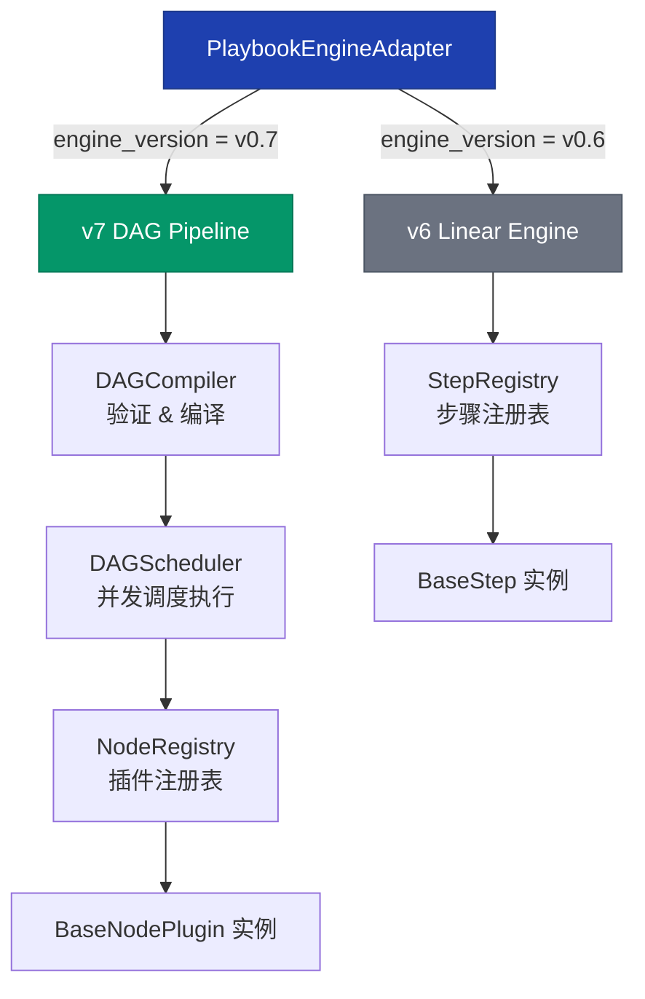
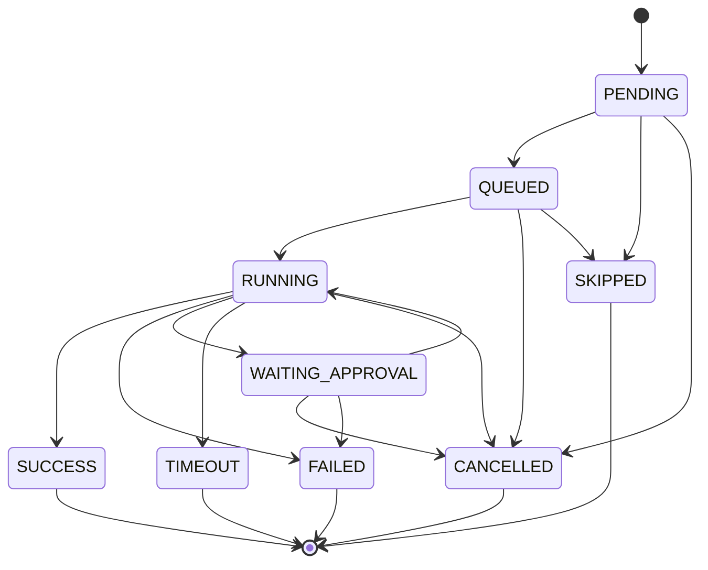
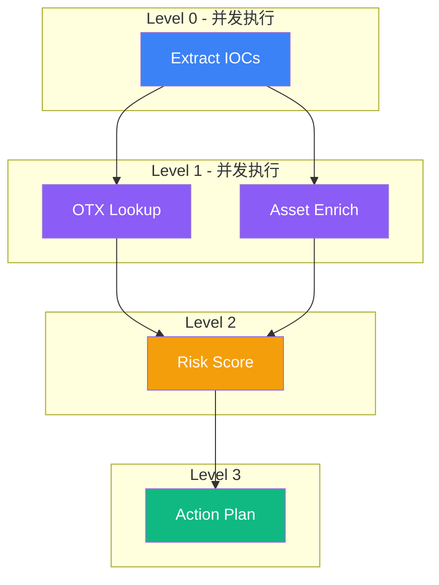

SOC Copilot 的 Playbook DAG 工作流引擎是一套面向安全运营自动化场景的任务编排系统。它从 v0.6 的线性步骤执行模型演进而来，在 v0.7 中引入了完整的 **DAG（有向无环图）执行引擎**，支持节点级并发、插件化节点类型、严格的状态机管理、可配置的重试策略以及队列化并发控制。本文档将从架构层到实现细节，逐层拆解这套引擎的设计哲学与运行机制。

## 整体架构：双引擎兼容与适配器模式

Playbook 引擎采用**双版本并行**策略，通过适配器模式统一入口，同时保持对旧版线性 Playbook 的兼容。`PlaybookEngineAdapter` 根据运行记录中的 `engine_version` 字段自动选择执行路径：`v0.6` 走线性引擎，`v0.7` 走 DAG 引擎。

适配器核心逻辑仅 40 余行：当 `engine_version` 为 `v0.6` 时，从预定义的步骤映射表获取步骤列表并顺序执行；为 `v0.7` 时，则先通过 `DAGCompiler` 编译校验 DAG 定义，再交由 `DAGScheduler` 执行。这种设计确保了版本升级过程中旧 Playbook 无需修改即可继续运行。

Sources: [adapter.py](backend/playbook_engine/adapter.py#L1-L141), [\_\_init\_\_.py](backend/playbook_engine/__init__.py#L1-L13)

## DAG 定义模型：节点、边与编译验证

### 数据结构层

DAG 的核心定义由三层 Pydantic Schema 承载：`NodeSchema`（节点）、`EdgeSchema`（边）和 `DAGSchema`（整体图）。每个节点携带 `type` 字段标识其执行器类型，`config` 字段存储配置参数，以及 v0.7.3 新增的 `inputs_template` 和 `outputs_mapping` 用于上下文变量系统。

Sources: [playbook_dag.py](backend/schemas/playbook_dag.py#L1-L76)

### 数据库持久化层

DAG 定义通过 SQLAlchemy ORM 映射到五张核心表：

| 模型 | 表名 | 职责 |
|------|------|------|
| `PlaybookDefinitionModel` | `playbook_definitions` | 存储 DAG 定义 JSON 及版本管理元数据 |
| `PlaybookNodeModel` | `playbook_nodes` | 节点定义（ID、类型、重试策略、超时、画布坐标） |
| `PlaybookEdgeModel` | `playbook_edges` | 边定义（源节点、目标节点、条件表达式） |
| `PlaybookTriggerModel` | `playbook_triggers` | 触发器配置（Webhook/Cron） |
| `PlaybookRunModel` | `playbook_runs` | 运行记录（含 `execution_mode`、`engine_version`、`failure_strategy`） |

`PlaybookRunModel` 是连接定义与运行实例的枢纽，它同时支持 v0.6 和 v0.7 的运行记录，通过 `engine_version`（`v0.6`/`v0.7`）和 `execution_mode`（`linear`/`dag`）双字段区分执行模式。v0.7.3 新增的 `context_json` 和 `input_context_json` 字段用于上下文变量持久化，`replay_of_run_id` 则支持运行回放链追踪。

Sources: [playbook_definition.py](backend/models/playbook_definition.py#L1-L200), [playbook_run.py](backend/models/playbook_run.py#L1-L142), [v0.7_add_dag_support.sql](backend/migrations/v0.7_add_dag_support.sql#L1-L186)

### DAG 编译器

`DAGCompiler` 在运行前对 DAG 定义执行四项校验：**节点唯一性检查**（拒绝重复 ID）、**类型合法性检查**（限定 14 种内置节点类型）、**边引用完整性检查**（source/target 必须指向已声明节点）和**环检测**（使用 Kahn 算法检测循环依赖，并通过 DFS 回溯具体环路路径）。编译输出包含 `outgoing`/`incoming` 邻接表、根节点列表和叶节点列表的 `compiled_dag` 结构，供调度器直接使用。

Sources: [playbook_dag_compiler.py](backend/services/playbook/playbook_dag_compiler.py#L1-L200)

## 节点插件体系：注册、发现与自动加载

### 插件抽象基类

v7 引擎的节点扩展基于 `BaseNodePlugin` 抽象基类，定义了四个必须实现的属性（`node_id`、`name`、`node_type`、`execute()`）和两个可选钩子（`validate_input()`、`get_required_secrets()`）。每个插件在执行时接收统一的 `NodeExecutionContext`，包含运行 ID、节点 ID、输入数据、执行模式以及已解析的密钥字典。

Sources: [base_node.py](backend/playbook_engine/v7_dag/base_node.py#L1-L89)

### 内置节点插件清单

系统通过自动发现机制加载 `plugins/` 目录下的所有插件，当前内置 **14 种节点类型**：

| 插件 ID | 名称 | 类型 | 安全特性 |
|---------|------|------|----------|
| `builtin_extract_iocs` | Extract Secondary IOCs | action | 从 TI 结果提取二级 IOC（IP/域名/URL/哈希） |
| `builtin_otx_lookup` | OTX Threat Intel Lookup | action | OTX 威胁情报查询 |
| `builtin_asset_enrich` | Asset Enrichment | action | 资产信息富化 |
| `builtin_risk_score` | Risk Score Calculation | action | 风险评分计算 |
| `builtin_action_plan` | Action Plan Generation | action | 处置建议生成 |
| `builtin_timeline_build` | Timeline Construction | action | 事件时间线构建 |
| `builtin_normalize` | Data Normalization | action | 数据标准化 |
| `builtin_generate_report` | Report Generation | action | 报告生成 |
| `builtin_http_request` | HTTP Request | action | **主机名白名单沙箱**，禁止 localhost/元数据服务访问 |
| `builtin_slack_notify` | Slack Notification | action | Slack Webhook 通知（支持密钥引用） |
| `builtin_decision` | Decision | decision | 条件分支（支持比较运算符和 `in` 表达式） |
| `builtin_parse_json` | JSON Parser | action | JSON 数据解析 |
| `builtin_sleep` | Sleep | action | 延迟节点（dry_run 模式跳过实际等待） |
| `builtin_human_approval` | Human Approval | approval | 人工审批节点（暂停执行等待审批） |

Sources: [\_\_init\_\_.py](backend/playbook_engine/v7_dag/plugins/__init__.py#L1-L19), [builtin_http_request.py](backend/playbook_engine/v7_dag/plugins/builtin_http_request.py#L1-L149), [builtin_decision.py](backend/playbook_engine/v7_dag/plugins/builtin_decision.py#L1-L185), [builtin_human_approval.py](backend/playbook_engine/v7_dag/plugins/builtin_human_approval.py#L1-L173), [builtin_extract_iocs.py](backend/playbook_engine/v7_dag/plugins/builtin_extract_iocs.py#L1-L164), [builtin_sleep.py](backend/playbook_engine/v7_dag/plugins/builtin_sleep.py#L1-L69)

### 注册表与自动加载

`NodeRegistry` 采用**类注册**模式（存储类而非实例），每次调用 `get_plugin()` 时创建新实例，避免了插件间的状态污染。自动加载通过 `pkgutil.iter_modules` 扫描插件目录，动态 `importlib.import_module` 后使用 `issubclass(attr, BaseNodePlugin)` 过滤出所有插件子类并注册。

Sources: [registry.py](backend/playbook_engine/v7_dag/registry.py#L1-L157)

## 状态机：节点生命周期的严格约束

每个 DAG 节点在执行期间由一个独立的 `NodeStateMachine` 实例管理其状态转换。状态机定义了 **8 种状态**和**严格的有向转换规则**：

状态机的设计遵循三个核心原则：**不可逆终态**（`SUCCESS`、`FAILED`、`CANCELLED`、`TIMEOUT`、`SKIPPED` 为吸收态，无出边）、**可追溯性**（每次转换记录 `history` 元组列表）、**运行时校验**（`transition_to()` 在非法转换时抛出 `ValueError`）。`WAITING_APPROVAL` 是唯一可回退到 `RUNNING` 的非初态，专门支持人工审批后恢复执行的场景。

Sources: [state_machine.py](backend/playbook_engine/dag/state_machine.py#L1-L158)

## 执行引擎：拓扑排序与层级并发

### DAGExecutionEngine 的核心调度算法

`DAGExecutionEngine` 是整个 DAG 运行时的核心，其执行流程分为五个阶段：

1. **初始化**：为每个节点创建 `NodeStateMachine` 实例，初始化运行上下文
2. **拓扑排序**：使用 **Kahn 算法**（BFS 入度消减）计算线性执行序列，同时检测环路
3. **层级分组**：`_group_by_level()` 将拓扑序列转换为二维列表，同层节点无依赖关系可并发
4. **逐层执行**：对每层节点启动 `asyncio.gather()` 并发任务，受 `asyncio.Semaphore` 限制并发数
5. **失败传播**：单层出现失败后，计算剩余可执行节点集，若无可继续节点则终止

### 并发控制与全局超时

引擎通过两层机制控制并发：**节点级**使用 `asyncio.Semaphore`，默认并发数由 `settings.dag_concurrency_default`（5）控制，上限 `settings.dag_concurrency_max`（10）；**运行级**通过 `DAG_GLOBAL_TIMEOUT_SECONDS`（默认 300 秒，由 `settings.api_timeout_dag_run_ms` 换算）限制整体执行时长。每执行完一层节点后检查已用时间，超时则将剩余节点标记为 `skipped`。

Sources: [engine.py](backend/playbook_engine/dag/engine.py#L1-L978)

### DAGScheduler：基于事件传播的调度模式

除 `DAGExecutionEngine` 的层级并发模式外，系统还提供 `DAGScheduler`——一种基于**事件传播**的异步调度器。它从根节点启动 `asyncio.create_task()`，每个节点完成后再为其下游节点创建新任务。相比层级模式，事件传播模式更灵活，适合节点数量多、依赖关系复杂的 DAG，因为它不需要等待整层完成。

`DAGScheduler` 还额外支持：
- **密钥自动解析**：通过 `_load_secrets()` 从 `SecretRepository` 加载并解密所有密钥，供节点的 `{{secret.xxx}}` 引用
- **条件边评估**：`_evaluate_condition()` 支持 `result == true`、`status == success`、数值比较等简单表达式
- **取消机制**：全局 `cancelled` 标志位 + 运行时注册表 `_running_schedulers`，支持从外部 API 触发取消
- **失败策略**：`fail_fast`（默认，任一节点失败立即终止）或 `continue`（继续执行不依赖失败节点的分支）

Sources: [playbook_dag_scheduler.py](backend/services/playbook/playbook_dag_scheduler.py#L1-L416)

## 上下文变量系统：模板渲染与输出映射

v0.7.3 引入的上下文变量系统解决了 DAG 节点间数据传递的灵活性问题。`PlaybookContextService` 提供四种变量引用语法：

| 语法 | 含义 | 示例 |
|------|------|------|
| `{{context.xxx}}` | 引用运行时动态上下文 | `{{context.ioc}}` |
| `{{input.xxx}}` | 引用初始输入数据 | `{{input.alert_id}}` |
| `{{node.<id>.field}}` | 引用特定节点的输出字段 | `{{node.otx_lookup.pulse_info}}` |
| `{{secret.xxx}}` | 引用密钥库中的密钥 | `{{secret.SLACK_WEBHOOK}}` |

渲染过程递归处理字符串、字典和列表三种类型，通过正则匹配替换变量引用。节点的 `outputs_mapping` 字段定义了输出到上下文的映射规则（JSONPath → 上下文键），引擎在每个节点执行完毕后调用 `merge_node_output()` 将输出写入运行上下文，并持久化到 `playbook_runs.context_json`。

Sources: [playbook_context_service.py](backend/services/playbook/playbook_context_service.py#L1-L396)

## 重试策略：指数退避与抖动

`RetryPolicy` 为每个节点提供可配置的容错能力，核心参数包括 `max_attempts`（最大重试次数，默认 3）、`backoff_base`（退避基数，默认 1 秒）、`backoff_max`（退避上限，默认 60 秒）和 `jitter_enabled`（抖动开关，默认开启）。退避延迟公式为 `min(base × 2^(attempt-1), max) + random(0, delay × 0.1)`，抖动因子有效防止多节点同时重试导致的"惊群效应"。`RetryExecutor` 在每次重试前使用 `asyncio.wait_for()` 施加单次超时限制。

Sources: [retry_policy.py](backend/playbook_engine/dag/retry_policy.py#L1-L166)

## 执行队列：并发控制与幂等防护

### RunQueueManager

`RunQueueManager` 是全局单例服务，管理 Playbook 运行的并发准入。它通过数据库查询统计当前 `running` 状态的运行数，与 `settings.run_queue_max`（默认 3）比较决定是否允许新运行启动。超出的运行被标记为 `queued` 状态，后台轮询任务每 5 秒检查一次队列，按 FIFO 策略选取最早的排队运行启动。

### 幂等性控制

队列管理器内置了两级幂等性检查：**内存缓存**（`_idempotency_cache`，TTL 300 秒）作为快速路径，**数据库查询**作为持久化兜底。幂等键由 `playbook_name`、`trigger_source`、`trigger_id` 和可选的输入数据哈希通过 SHA-256 生成，确保同一触发源在去重窗口内不会重复执行同一 Playbook。

### 孤儿运行恢复

服务器重启后，`recover_runs()` 自动扫描所有 `running` 状态超过 1 小时且无 `finished_at` 的运行记录，将其标记为 `failed` 并记录 `"Run interrupted by server restart"` 错误信息。

Sources: [run_queue_manager.py](backend/services/run_queue_manager.py#L1-L554)

## 异常体系：分类化错误处理

DAG 引擎定义了层级化的异常体系，所有异常继承自 `DAGExecutionError`，携带 `ErrorCategory`（13 种分类）、`ErrorSeverity`（4 级严重度）和 `ErrorContext`（含运行 ID、节点 ID、时间戳、输入输出快照等富上下文）。关键异常类型包括：

| 异常类 | 触发场景 | 可恢复性 |
|--------|----------|----------|
| `DAGDefinitionError` | DAG 结构校验失败 | 不可恢复 |
| `DAGCycleError` | 检测到环路 | 不可恢复 |
| `NodeExecutionError` | 节点执行异常 | 视 `recoverable` 标志 |
| `NodeTimeoutError` | 节点执行超时 | 可重试 |
| `DAGTimeoutError` | 全局超时 | 不可恢复 |

Sources: [exceptions.py](backend/playbook_engine/dag/exceptions.py#L1-L426)

## 人工审批流程

`builtin_human_approval` 插件实现了 **Human-in-the-Loop** 模式：当执行到审批节点时，插件在 `playbook_approvals` 表创建审批记录，将节点状态设为 `waiting_approval`，并返回 `paused: true` 标志暂停该分支的执行。审批记录包含审批人列表、最少通过数、超时配置和超时后的默认行为（`approve`/`reject`/`fail`）。

Sources: [builtin_human_approval.py](backend/playbook_engine/v7_dag/plugins/builtin_human_approval.py#L1-L173)

## 运行回放与版本管理

`PlaybookReplayService` 支持基于历史运行的精确回放：创建新运行记录并复制原运行的 `input_context_json`，支持通过 `override_context` 参数覆盖特定变量。回放链通过 `replay_of_run_id` 外键形成链表结构，`get_replay_chain()` 从根节点遍历整条回放历史。Playbook 定义本身则通过 `PlaybookDefinitionVersionModel` 支持多版本管理，`status` 字段控制 `draft` → `published` → `archived` 的生命周期。

Sources: [playbook_replay_service.py](backend/services/playbook/playbook_replay_service.py#L1-L280)

## 前端可视化：React Flow DAG 编辑器

前端使用 [React Flow](https://reactflow.dev/) 库渲染 DAG 可视化画布。`DAGCanvas` 组件接收 `definition`（节点和边定义）与 `nodeStatuses`（实时执行状态）两个核心 props，通过 `useNodesState`/`useEdgesState` 管理画布状态。`DAGNode` 组件为每种执行状态（pending/running/success/failed/skipped/waiting_approval）定义了独立的配色和图标方案，并支持执行耗时、错误信息和输出预览的内联展示。组件内置了 **P0-2 无限循环防护**（`MAX_UPDATE_ITERATIONS = 100`），通过 `createStatusHash()` 哈希比较避免父组件重渲染导致的级联更新。

Sources: [DAGCanvas.tsx](frontend/components/dag/DAGCanvas.tsx#L1-L200), [DAGNode.tsx](frontend/components/dag/DAGNode.tsx#L1-L132)

## 配置参数速查

| 配置项 | 默认值 | 说明 |
|--------|--------|------|
| `dag_concurrency_default` | 5 | 单次 DAG 运行默认节点并发数 |
| `dag_concurrency_max` | 10 | 节点并发上限 |
| `api_timeout_dag_run_ms` | 300000 (5min) | DAG 运行全局超时 |
| `run_queue_max` | 3 | 最大同时运行 Playbook 数 |
| `run_queue_policy` | `fifo` | 队列策略 |
| `http_allowed_hosts` | (空) | HTTP 节点主机名白名单 |

Sources: [config.py](backend/core/config.py#L66-L91)

## 架构演进方向

当前引擎已具备完整的 DAG 编排能力。若需进一步了解触发器系统（Webhook/Cron）如何驱动 Playbook 自动执行，参阅 [触发器系统：Webhook 与 Cron 定时任务的自动化集成](11-hong-fa-qi-xi-tong-webhook-yu-cron-ding-shi-ren-wu-de-zi-dong-hua-ji-cheng)；若需了解前端 DAG 编辑器的交互设计细节，参阅 [React Flow DAG 可视化编辑器：Playbook 流程编排 UI](23-react-flow-dag-ke-shi-hua-bian-ji-qi-playbook-liu-cheng-bian-pai-ui)；若需了解告警如何触发 Playbook 运行，参阅 [告警分析引擎：双引擎 IOC 提取与 AI 驱动分析](9-gao-jing-fen-xi-yin-qing-shuang-yin-qing-ioc-ti-qu-yu-ai-qu-dong-fen-xi)。