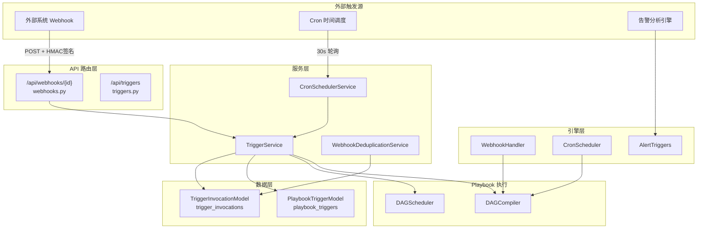
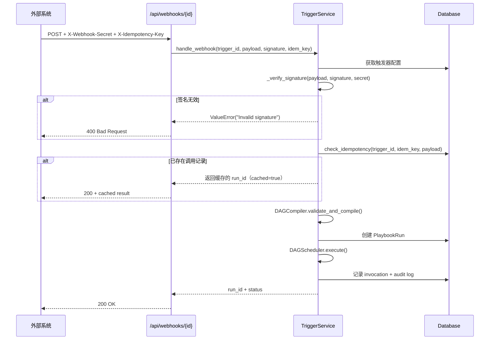
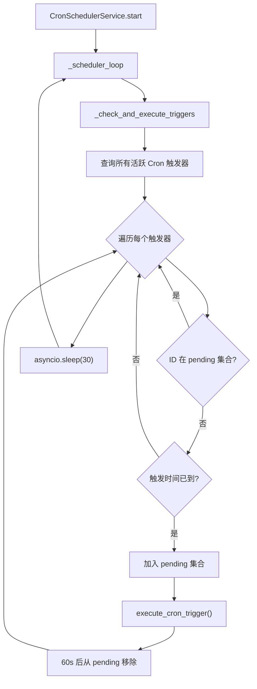
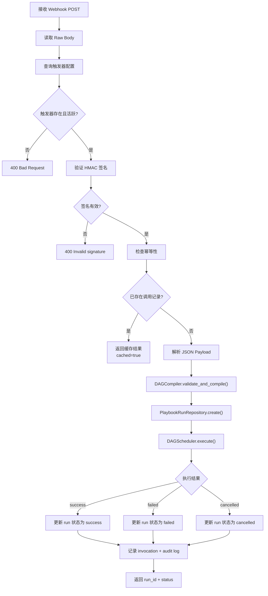

触发器系统是 SOC Copilot **自动化闭环**的关键桥梁——它将外部事件（HTTP 回调、定时调度、告警匹配）转化为 Playbook DAG 的实际执行。本页深入解析触发器的数据模型、两种核心触发类型（Webhook 与 Cron）的完整生命周期，以及幂等性、去重、签名验证等安全机制的设计实现。触发器系统与 [Playbook DAG 工作流引擎：节点插件、状态机与执行队列](10-playbook-dag-gong-zuo-liu-yin-qing-jie-dian-cha-jian-zhuang-tai-ji-yu-zhi-xing-dui-lie) 紧密耦合，通过 DAG 编译器将定义转化为可执行图谱，并依赖 [服务生命周期管理与优先级启动机制](7-fu-wu-sheng-ming-zhou-qi-guan-li-yu-you-xian-ji-qi-dong-ji-zhi) 实现后台调度器的有序启动。

Sources: [trigger_service.py](backend/services/trigger_service.py#L1-L27), [cron_scheduler_service.py](backend/services/cron_scheduler_service.py#L1-L24)

## 系统架构总览

触发器系统遵循后端标准分层架构——路由层处理 HTTP 入口，服务层封装业务逻辑，仓储层管理数据持久化。值得注意的是，系统存在**双轨实现**：`services/` 目录下面向 API 的主流程实现，以及 `playbook_engine/triggers/` 下面向 DAG 引擎的引擎级实现。两套实现在签名验证、去重策略、DAG 执行调度等细节上存在差异，反映了系统从 v0.7 到 v0.8 的演进轨迹。



**关键设计决策**：Cron 调度器采用 **异步轮询**（30 秒间隔）而非传统的操作系统级 cron 守护进程，这使其天然适配 FastAPI 的异步事件循环，无需额外的进程间通信。

Sources: [routers/webhooks.py](backend/routers/webhooks.py#L1-L79), [routers/triggers.py](backend/routers/triggers.py#L1-L30), [playbook_engine/triggers/__init__.py](backend/playbook_engine/triggers/__init__.py#L1-L11)

## 数据模型：触发器与调用记录

触发器系统的持久化层由两张核心表构成——`playbook_triggers` 存储触发器配置，`trigger_invocations` 跟踪每次执行记录并支撑幂等性机制。

### PlaybookTriggerModel —— 触发器配置

`playbook_triggers` 表是触发器的"蓝图"，记录了类型、调度规则、密钥等元数据。每个触发器通过 `definition_id` 外键关联到一个 Playbook 定义。

| 字段 | 类型 | 说明 |
|------|------|------|
| `id` | `String(36)` | 主键，UUID 格式 |
| `definition_id` | `String(36)` | 关联的 Playbook 定义 ID（外键，级联删除） |
| `type` | `String(50)` | 触发类型：`webhook` / `cron` |
| `name` | `String(200)` | 触发器名称（可选） |
| `config_json` | `JSON` | 附加配置（字典结构） |
| `secret` | `String(100)` | Webhook 密钥，格式 `wh_{token_urlsafe(32)}` |
| `cron_expr` | `String(100)` | Cron 表达式，如 `0 */6 * * *` |
| `is_active` | `Boolean` | 启用状态开关 |
| `last_triggered_at` | `DateTime` | 最近一次触发时间 |
| `created_by` | `String(36)` | 创建者用户 ID（外键） |

Sources: [playbook_definition.py](backend/models/playbook_definition.py#L164-L208)

### TriggerInvocationModel —— 调用记录与幂等性

`trigger_invocations` 表服务于两个目的：一是记录触发执行历史用于审计，二是通过 `request_hash` 和 `idempotency_key` 实现请求去重。每条记录默认 24 小时过期（`expires_at`），过期后可被清理任务安全删除。

| 字段 | 类型 | 说明 |
|------|------|------|
| `id` | `String(36)` | 主键 |
| `trigger_id` | `String(36)` | 所属触发器 ID（外键，级联删除） |
| `idempotency_key` | `String(100)` | 客户端提供的幂等键 |
| `run_id` | `String(36)` | 关联的 Playbook 运行 ID |
| `request_hash` | `String(64)` | 请求体的 SHA-256 摘要 |
| `status` | `String(20)` | 状态：`pending` / `success` / `failed` |
| `expires_at` | `DateTime` | 过期时间（创建时间 +24 小时） |

Sources: [trigger.py](backend/models/trigger.py#L1-L56)

## Webhook 触发器：外部事件驱动的自动化

Webhook 触发器允许任何外部系统通过 HTTP POST 请求安全地触发 Playbook 执行。整个流程涉及**密钥生成 → HMAC 签名验证 → 幂等性检查 → DAG 编译执行**四个阶段。

### 创建 Webhook 触发器

创建 Webhook 触发器时，系统自动生成一个格式为 `wh_{secrets.token_urlsafe(32)}` 的密钥。该密钥仅在创建响应中**完整返回一次**，后续查询只能获取到前缀（如 `wh_abc123***`）。API 路由要求 `ADMIN` 或 `ANALYST` 角色。

```python
# 密钥生成逻辑
secret = f"wh_{secrets.token_urlsafe(32)}"
```

创建成功后，响应中包含完整的 `webhook_url`（格式为 `{base_url}/api/webhooks/{trigger_id}`）和一次性明文 `secret`。外部系统需在调用时使用此密钥生成 HMAC-SHA256 签名。

Sources: [trigger_service.py](backend/services/trigger_service.py#L28-L56), [triggers.py](backend/routers/triggers.py#L139-L177)

### HMAC 签名验证

Webhook 接收端通过双重安全机制保护：**签名验证**确保请求未被篡改，**时间戳校验**防止重放攻击。签名生成流程如下：

1. 将 `secret` 编码为 UTF-8 字节
2. 以 `secret` 为密钥，对原始请求体（raw body）计算 HMAC-SHA256
3. 将摘要进行 Base64 编码
4. 调用方将结果放入 `X-Webhook-Secret` 请求头
5. 服务端使用 `hmac.compare_digest()` 进行**恒定时间比较**，避免时序攻击



系统提供了两套签名验证实现：`TriggerService._verify_signature()` 用于主 API 流程（接收 Base64 编码的签名），`playbook_engine/triggers/webhook.py` 中的 `verify_hmac_signature()` 用于引擎级流程（接收 Base64 编码签名）。两者核心逻辑一致，均使用恒定时间比较。

Sources: [trigger_service.py](backend/services/trigger_service.py#L124-L174), [trigger_service.py](backend/services/trigger_service.py#L348-L366), [webhook.py](backend/playbook_engine/triggers/webhook.py#L166-L192)

### 三层幂等性保护

Webhook 触发器实现了**三层幂等性机制**，确保在分布式环境下同一请求不会被重复执行：

| 层次 | 机制 | 存储位置 | TTL |
|------|------|----------|-----|
| **第一层** | 客户端幂等键 `X-Idempotency-Key` | 数据库 `trigger_invocations` | 24 小时 |
| **第二层** | 请求体 SHA-256 摘要去重 | 数据库 `trigger_invocations.request_hash` | 24 小时 |
| **第三层** | Payload 级别去重（引擎层） | Redis / 内存双存储 | 5 分钟（可配置） |

第一层和第二层由 `TriggerRepository.check_idempotency()` 实现——优先通过 `idempotency_key` 查找，若未提供则退回到 `request_hash` 匹配。第三层由 `WebhookDeduplicationStore` 实现，优先使用 Redis（支持分布式部署），回退到进程内内存存储，通过 `asyncio.Lock` 保证并发安全。

Sources: [trigger_repository.py](backend/repositories/trigger_repository.py#L192-L268), [webhook.py](backend/playbook_engine/triggers/webhook.py#L20-L163), [webhook_deduplication.py](backend/services/webhook_deduplication.py#L27-L183)

## Cron 触发器：基于时间的自动化调度

Cron 触发器基于标准 cron 表达式定义执行计划，通过后台轮询服务检测到期触发器并启动 Playbook 执行。

### Cron 表达式安全约束

系统对 cron 表达式施加了严格的安全限制，防止因配置不当导致资源耗尽：

- **长度上限**：表达式不得超过 100 字符
- **最小间隔**：两次执行之间不得少于 **300 秒（5 分钟）**，即 `* * * * *` 被直接拒绝
- **验证方式**：使用 `croniter` 库计算相邻两次执行时间差，确保间隔合规

```python
# 验证逻辑摘要
cron = croniter(cron_expr)
next1 = cron.get_next(datetime)
next2 = cron.get_next(datetime)
min_interval = (next2 - next1).total_seconds()
if min_interval < 300:
    raise ValueError("Cron interval too short")
```

Sources: [trigger_service.py](backend/services/trigger_service.py#L58-L122)

### 调度器架构与生命周期

`CronSchedulerService` 作为 **ESSENTIAL 优先级**的后台服务，在数据库初始化完成后自动启动。其核心是一个 30 秒间隔的异步轮询循环：

| 配置参数 | 值 | 说明 |
|----------|---|------|
| 检查间隔 | 30 秒 | `_check_interval` |
| 待执行超时 | 60 秒 | `_remove_from_pending` 延迟 |
| 最小执行间隔 | 300 秒 | cron 表达式验证限制 |
| 启动优先级 | `ESSENTIAL (10)` | 仅次于 `CRITICAL (0)` 的数据库 |
| 依赖 | `database` | 确保数据库就绪后才启动 |

调度器使用 `_pending_triggers: set[str]` 集合实现**防重入保护**——当某个触发器正在执行时，后续轮询周期会跳过它，直到 60 秒后才允许再次进入。这确保即使单次 DAG 执行耗时超过 30 秒，也不会产生重复触发。



Sources: [cron_scheduler_service.py](backend/services/cron_scheduler_service.py#L1-L200), [cron_scheduler_service.py (lifecycle)](backend/services/lifecycle/cron_scheduler_service.py#L16-L80)

### 到期判断逻辑

调度器通过 `croniter` 库精确判断触发器是否到期，处理了两种场景：

**场景一：已有执行历史**——以 `last_triggered_at` 为基准计算下一次执行时间 `next_run`，若 `next_run <= now` 则执行。

**场景二：首次执行**——以当前时间为基准计算 `prev_run`（上一个计划执行时间），若 `now - prev_run < check_interval * 2`（即 60 秒内），则视为刚错过该计划点，立即执行。

Sources: [cron_scheduler_service.py](backend/services/cron_scheduler_service.py#L66-L140)

## 告警触发器：条件驱动的自动化联动

除了 Webhook 和 Cron 两种显式触发类型，系统还内置了**告警触发器**机制——当告警分析结果满足预定义条件时，自动触发关联的 Playbook。这是一种隐式触发，不需要外部请求或时间调度。

### 预定义告警触发器

告警触发器使用 Pydantic 模型定义条件组合（`TriggerCondition`），支持 9 种操作符（`eq`、`ne`、`in`、`not_in`、`gt`、`gte`、`lt`、`lte`、`contains`），可对告警数据的嵌套字段路径（如 `alert.severity`）进行条件匹配。系统内置了 7 种预定义触发器：

| 触发器 ID | 名称 | 关键条件 | 执行模式 | 优先级 |
|-----------|------|----------|----------|--------|
| `critical_auto_contain` | 高危告警自动遏制 | severity ∈ [critical, high] AND verdict = true_positive AND confidence ≥ 0.7 | auto | 1 |
| `malware_response` | 恶意软件响应 | event_category = malware | dry_run | 2 |
| `phishing_response` | 钓鱼邮件响应 | event_category = phishing | auto | 2 |
| `lateral_movement` | 横向移动检测响应 | event_category = lateral_movement | dry_run | 1 |
| `data_exfiltration` | 数据外泄防护 | event_category = exfiltration | auto | 1 |
| `c2_detection` | C2 通信检测响应 | event_category = command_and_control | auto | 1 |
| `pii_exposure` | 个人信息泄露响应 | contains_pii = true | dry_run | 2 |

执行模式分为三种：**auto**（自动执行）、**dry_run**（模拟执行）、**manual**（需人工审批）。触发器按优先级排序执行，并受到速率限制约束（每告警最多 3 次触发、每小时 50 次、冷却时间 5 分钟）。

Sources: [alert_triggers.py](backend/playbook_engine/triggers/alert_triggers.py#L1-L193)

### 条件评估引擎

告警触发器的评估逻辑通过 `evaluate_condition()` 函数实现，支持嵌套字段路径的点号分隔访问（如 `alert.impact.risk_score`）。`get_matching_triggers()` 函数会遍历所有触发器，返回匹配的触发器列表并按优先级排序。

Sources: [alert_triggers.py](backend/playbook_engine/triggers/alert_triggers.py#L234-L314)

## API 接口全景

触发器系统暴露了两组 API 路由：`/api/triggers` 负责 CRUD 管理操作，`/api/webhooks` 负责外部 Webhook 接收。Webhook 接收端点**不要求用户认证**，而是通过 HMAC 签名验证身份。

### 触发器管理 API

| 方法 | 路径 | 说明 | 权限要求 |
|------|------|------|----------|
| `GET` | `/api/triggers` | 列出触发器（支持类型、状态过滤和分页） | 任何已认证角色 |
| `GET` | `/api/triggers/{id}` | 获取触发器详情（含关联 Playbook 名称） | 任何已认证角色 |
| `POST` | `/api/triggers/webhook` | 创建 Webhook 触发器 | Admin / Analyst |
| `POST` | `/api/triggers/cron` | 创建 Cron 触发器 | Admin / Analyst |
| `PUT` | `/api/triggers/{id}` | 更新触发器（名称、配置、cron 表达式、状态） | Admin / Analyst |
| `DELETE` | `/api/triggers/{id}` | 删除触发器 | Admin / Analyst |
| `POST` | `/api/triggers/{id}/test` | 测试 Webhook 触发器连通性 | 任何已认证角色 |
| `POST` | `/api/triggers/{id}/webhook/regenerate-secret` | 重新生成 Webhook 密钥 | Admin / Analyst |
| `GET` | `/api/triggers/{id}/invocations` | 查询触发器的执行历史 | 任何已认证角色 |
| `POST` | `/api/triggers/cron/cleanup` | 清理过期的调用记录 | Admin / Analyst |

### Webhook 接收 API

| 方法 | 路径 | 说明 | 认证方式 |
|------|------|------|----------|
| `POST` | `/api/webhooks/{trigger_id}` | 接收外部 Webhook 并触发 Playbook | HMAC 签名（`X-Webhook-Secret` 头） |
| `GET` | `/api/webhooks/health` | Webhook 模块健康检查 | 无 |

Sources: [triggers.py](backend/routers/triggers.py#L30-L412), [webhooks.py](backend/routers/webhooks.py#L1-L79)

## 执行流程：从触发到 DAG 完成

无论是 Webhook 还是 Cron 触发器，执行流程都遵循统一的模式：**获取触发器 → 验证状态 → 编译 DAG → 创建运行记录 → 执行 DAG → 记录结果**。以下以 Webhook 为例展示完整执行链路：



关键实现细节：Webhook 触发器的 Playbook 运行以 `trigger_source="webhook"` 和 `execution_mode="dag"` 标记，Cron 触发器则以 `trigger_source="cron"` 标记。两种触发器都使用 `fail_fast` 失败策略——任一节点失败即停止整个 DAG。

Sources: [trigger_service.py](backend/services/trigger_service.py#L124-L346), [trigger_service.py](backend/services/trigger_service.py#L368-L527)

## 安全设计要点

触发器系统在安全层面有四项核心设计：**HMAC 签名验证**、**幂等性保护**、**审计日志**、**密钥轮换**。

### 密钥管理与轮换

Webhook 密钥使用 Python `secrets` 模块生成（`wh_` 前缀 + 32 字节 URL-safe token），提供约 192 位熵值。密钥轮换通过 `POST /api/triggers/{id}/webhook/regenerate-secret` 端点实现，生成全新密钥并**立即替换**旧密钥。系统不保留旧密钥，调用方需在轮换后立即更新外部系统配置。

### 审计追踪

每次触发执行（无论成功或失败）都会创建审计记录，包含完整的上下文信息：

- Webhook 触发：记录 `trigger_type`、`idempotency_key`、`run_id` 及 HTTP 状态码
- Cron 触发：记录 `cron_expr`、`run_id` 及执行结果
- 失败记录：额外包含错误信息（`error` 字段）

Sources: [trigger_service.py](backend/services/trigger_service.py#L289-L346), [trigger_service.py](backend/services/trigger_service.py#L480-L527), [triggers.py](backend/routers/triggers.py#L337-L360), [webhook_deduplication.py](backend/services/webhook_deduplication.py#L361-L422)

## 双轨实现的演进脉络

系统当前存在两套触发器实现，它们在架构层次和功能细节上各有侧重：

| 维度 | `services/` 主流程 | `playbook_engine/triggers/` 引擎层 |
|------|-------------------|----------------------------------|
| 入口 | `TriggerService` | `WebhookHandler` / `CronScheduler` |
| Webhook 签名 | X-Webhook-Secret（Base64） | X-Signature（Base64） |
| 去重策略 | 数据库幂等键 + request_hash | Redis/内存 Payload 去重 |
| DAG 编译 | `DAGCompiler.validate_and_compile()` | `DAGBuilder.from_json()` |
| DAG 执行 | `DAGScheduler`（apply 模式） | `DAGExecutionEngine`（dry_run 模式） |
| Playbook 创建 | 通过 `PlaybookRunRepository.create()` | 直接构造 `PlaybookRunModel` |
| 调度周期 | 30 秒轮询 | 30 秒轮询（可配置） |

主流程实现更为完整——包含完整的 HMAC 验证链、数据库级幂等性、审计日志、密钥轮换等功能；引擎层实现则更轻量，专注于 DAG 执行引擎的集成。这种双轨结构反映了系统从基础引擎能力（v0.7）向完整产品化能力（v0.8）的演进路径。

Sources: [trigger_service.py](backend/services/trigger_service.py#L1-L553), [webhook.py](backend/playbook_engine/triggers/webhook.py#L195-L388), [cron.py](backend/playbook_engine/triggers/cron.py#L16-L252)

## 相关主题

- [Playbook DAG 工作流引擎：节点插件、状态机与执行队列](10-playbook-dag-gong-zuo-liu-yin-qing-jie-dian-cha-jian-zhuang-tai-ji-yu-zhi-xing-dui-lie) —— 了解触发器启动的 DAG 如何执行
- [服务生命周期管理与优先级启动机制](7-fu-wu-sheng-ming-zhou-qi-guan-li-yu-you-xian-ji-qi-dong-ji-zhi) —— Cron 调度器如何作为后台服务启动
- [通知服务：飞书、Slack、邮件的插件化通知架构](15-tong-zhi-fu-wu-fei-shu-slack-you-jian-de-cha-jian-hua-tong-zhi-jia-gou) —— 触发执行结果如何推送给运维人员
- [中间件链：审计、幂等性、请求追踪与异常捕获](19-zhong-jian-jian-lian-shen-ji-mi-deng-xing-qing-qiu-zhui-zong-yu-yi-chang-bu-huo) —— 幂等性中间件的通用设计