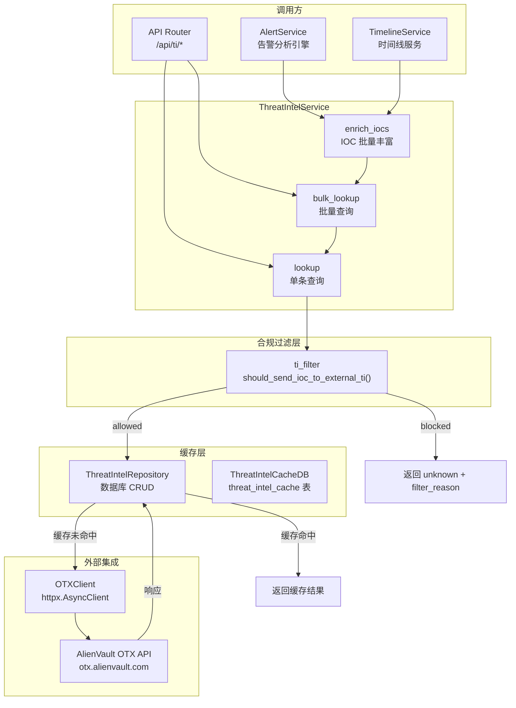

威胁情报服务是 SOC Copilot 的关键外部数据集成层，负责将告警分析过程中提取的 IOC（Indicator of Compromise，入侵指标）自动送入 AlienVault OTX（Open Threat Exchange）进行声誉查询。整个服务围绕三个核心能力构建：**OTX API 对接**（基于 `httpx` 异步客户端的四类指标查询）、**本地数据库缓存**（TTL 驱动的 `threat_intel_cache` 表，默认 7 天过期）、以及**合规过滤器**（确保私有 IP、内部域名等敏感指标不会外泄到第三方服务）。该服务被告警分析引擎和时间线服务共同调用，为安全分析师提供即时的威胁上下文关联。

Sources: [threat_intel_service.py](backend/services/threat_intel_service.py#L1-L24), [otx_client.py](backend/integrations/otx_client.py#L1-L24)

## 架构总览

威胁情报服务遵循后端分层架构，从路由层到集成层形成清晰的调用链路。外部请求经 FastAPI 路由进入 `ThreatIntelService`，后者依次执行**合规过滤 → 缓存命中检查 → OTX 远程查询 → 结果写入缓存**的处理流水线。内部的 `enrich_iocs` 方法则由告警分析服务和时间线服务直接调用，作为分析结果的自动丰富环节。

Sources: [threat_intel_service.py](backend/services/threat_intel_service.py#L51-L79), [alert_service.py](backend/services/alerting/alert_service.py#L12-L74), [timeline_service.py](backend/services/timeline_service.py#L12-L47)

## OTX 客户端集成

`OTXClient` 是与 AlienVault OTX API 交互的底层 HTTP 客户端，使用 `httpx.AsyncClient` 实现异步非阻塞调用。它封装了四类 IOC 指标的查询接口，每类指标对应 OTX API 的不同端点。

### 支持的 IOC 类型与 API 端点映射

| IOC 类型 | OTX API 端点 | 说明 |
|----------|-------------|------|
| `ip` | `/indicators/IPv4/{ip}/general` | IPv4 地址声誉查询 |
| `domain` | `/indicators/domain/{domain}/general` | 域名声誉查询 |
| `url` | `/indicators/url/{encoded_url}/general` | URL 声誉查询（需 URL 编码） |
| `hash` | `/indicators/file/{hash}/general` | 文件哈希查询（MD5/SHA1/SHA256） |

每个查询方法（`lookup_ip`、`lookup_domain`、`lookup_url`、`lookup_hash`）遵循统一的处理模式：发起 HTTP GET 请求 → 成功时调用对应的 `_parse_*_response` 解析器 → 失败时根据 HTTP 状态码返回 `_not_found_response`（404）或 `_error_response`（其他异常）。客户端在构造时接受 `api_key` 和 `timeout`（默认 10 秒），通过 `X-OTX-API-KEY` 请求头进行身份认证。

Sources: [otx_client.py](backend/integrations/otx_client.py#L15-L161)

### 威胁评分算法

`_calculate_score_from_sections` 方法基于 OTX 响应中的 **sections** 字段计算 0-100 的威胁评分。评分采用加权累加策略，不同威胁类别贡献不同分值：

| 威胁类别 | 分值贡献 | 说明 |
|----------|---------|------|
| `malware` | +40 | 恶意软件关联 |
| `exploit kits` | +35 | 漏洞利用套件 |
| `c2` | +30 | 命令控制服务器 |
| `fraud` | +30 | 欺诈活动 |
| `scanning` | +20 | 扫描行为 |
| Pulse 数量 | +min(count×5, 25) | 最多贡献 25 分 |
| 负声誉值 | +abs(reputation) | OTX 负声誉贡献 |

最终分数通过 `min(score, 100)` 截断至上限。评分结果与是否存在威胁标签（`has_tags`）共同决定判定结果（**Verdict**）：

| 条件 | Verdict | 语义 |
|------|---------|------|
| score ≥ 70 | `malicious` | 恶意 |
| score ≥ 40 或 has_tags | `suspicious` | 可疑 |
| score > 0 | `unknown` | 未知 |
| score = 0 且无标签 | `benign` | 良性 |

Sources: [otx_client.py](backend/integrations/otx_client.py#L311-L371)

## 本地缓存机制

为降低对外部 OTX API 的调用频率并提升响应速度，系统在数据库层实现了完整的本地缓存。缓存的实现涉及模型定义、仓储操作和 TTL 过期策略三个层面。

### 缓存表结构

`ThreatIntelCacheDB` 模型映射到 `threat_intel_cache` 数据库表，设计了一个 **三元组唯一约束**（`provider` + `ioc_type` + `ioc_value`），确保同一指标在同一提供商下只保留最新结果。表结构通过 `ix_ti_provider_ioc` 复合索引优化查询性能。

| 字段 | 类型 | 说明 |
|------|------|------|
| `id` | String (UUID) | 主键 |
| `provider` | String | 提供商标识（如 `"otx"`） |
| `ioc_type` | String | IOC 类型（ip/domain/url/hash） |
| `ioc_value` | String | IOC 值 |
| `status` | String | 缓存状态（ok/not_found/error） |
| `response_json` | Text | 完整响应 JSON（含 verdict） |
| `score` | Integer | 威胁评分 0-100 |
| `tags` | Text | 标签 JSON 数组 |
| `pulse_count` | Integer | 关联 Pulse 数量 |
| `expires_at` | DateTime | 过期时间（带索引） |
| `last_seen` | DateTime | 最后出现时间 |

Sources: [threat_intel_cache.py](backend/models/threat_intel_cache.py#L13-L35)

### 缓存查询与写入流程

`ThreatIntelRepository` 提供四个核心操作方法：**`get_by_ioc`** 执行带过期时间检查的查询（`expires_at > now()`），只返回尚未过期的缓存条目；**`create`** 写入新缓存条目，自动根据 `ti_cache_ttl_hours` 配置计算 `expires_at`；**`update`** 刷新已有条目的过期时间；**`delete_expired`** 清理所有过期记录。

缓存命中时的关键行为：服务层从 `response_json` 字段中反序列化出完整的原始响应，从中提取 `verdict`（而非使用 `status` 字段），确保缓存的判定结果与 OTX 原始响应完全一致。

Sources: [threat_intel_repository.py](backend/repositories/threat_intel_repository.py#L16-L96), [threat_intel_service.py](backend/services/threat_intel_service.py#L163-L188)

### 缓存管理 API

路由层提供了一组缓存管理端点，支持从单条失效到全量清理的多级操作：

| 端点 | 方法 | 说明 | 用途 |
|------|------|------|------|
| `/api/ti/cache/{ioc_type}/{ioc_value}` | DELETE | 单条缓存失效 | IOC 在 OTX 中数据更新后强制刷新 |
| `/api/ti/cache/refresh` | POST | 批量缓存失效（上限 100 条） | 高价值 IOC 的每日定期刷新 |
| `/api/ti/cache/expired` | DELETE | 清理所有过期条目 | 手动清理 |
| `/api/ti/cache/all` | DELETE | 全量清空（需 `confirm=true`） | 配置变更后的完全重置 |

Sources: [threat_intel.py](backend/routers/threat_intel.py#L95-L208)

## 合规过滤器

合规过滤器是 v0.4.1 引入的核心安全组件，其设计目标是**防止内部基础设施信息泄露到外部威胁情报服务**。过滤器作为独立工具模块实现，位于 `utils/ti_filter.py`，对每个 IOC 执行多维度的合规性检查。

### 过滤维度与规则

`should_send_ioc_to_external_ti` 函数接收一个 IOC 及一系列配置参数，返回 `FilterDecision` 数据类（包含 `allowed` 布尔值和 `reason` 字符串）。过滤逻辑按 IOC 类型分别处理：

**IP 地址（`ioc_type == "ip"`）**
- 调用 `is_private_ip` 检查是否属于 RFC 1918 私有地址段（10.0.0.0/8、172.16.0.0/12、192.168.0.0/16）、环回地址（127.0.0.0/8）或链路本地地址
- 若为私有 IP 且 `ti_allow_private_ip` 为 `false`（默认），返回 `FilterDecision(False, "private_ip")`

**域名（`ioc_type == "domain"`）**
- `matches_internal_domain`：检查域名是否匹配 `ti_internal_domain_suffixes` 中配置的内部域名后缀（如 `corp.example.com`），匹配则返回 `FilterDecision(False, "internal_domain")`
- `has_blocked_tld`：检查域名的顶级域名（TLD）是否在 `ti_blocked_tlds` 配置列表中（如 `local`、`lan`、`internal`），匹配则返回 `FilterDecision(False, "blocked_tld")`

**URL（`ioc_type == "url"`）**
- 通过 `extract_host_from_url` 提取 URL 中的主机名（支持 `http`/`https` 协议，处理 `userinfo@host` 和端口号）
- 若主机名为 IP 地址，执行私有 IP 检查（受 `ti_allow_url_with_private_host` 控制）
- 若主机名为域名，执行内部域名和 TLD 检查

**文件哈希（`ioc_type == "hash"`）**
- 始终允许通过，因为哈希值不包含基础设施信息

Sources: [ti_filter.py](backend/utils/ti_filter.py#L1-L189)

### 过滤器在服务层的集成

在 `ThreatIntelService.lookup` 方法中，合规过滤是**第一道关卡**——在缓存查询和 OTX 调用之前执行。如果 IOC 被过滤，方法直接返回一个 `Verdict.unknown`、`score=0` 的响应，并在 `skipped_reason` 字段中记录过滤原因（如 `"private_ip"`、`"internal_domain"`），确保前端能够区分"未查询"和"查询后无结果"。

在 `bulk_lookup` 方法中，过滤器在批量操作的最前端执行，将输入的 IOC 列表分为 `allowed_items` 和 `filtered_items` 两个集合。被过滤的 IOC 不会消耗 OTX API 调用额度，也不会进入缓存查询流程。最终响应中的 `filtered_count` 和 `filtered_items` 字段完整记录了所有被合规策略拦截的指标。

Sources: [threat_intel_service.py](backend/services/threat_intel_service.py#L94-L142), [threat_intel_service.py](backend/services/threat_intel_service.py#L263-L382)

## 配置参数参考

所有威胁情报相关配置通过环境变量注入，由 `pydantic-settings` 自动加载到 `Settings` 类。默认配置采用**安全优先**原则——外部 TI 默认关闭，所有合规过滤器默认启用。

| 环境变量 | 默认值 | 说明 |
|----------|--------|------|
| `OTX_API_KEY` | `""`（空） | AlienVault OTX API 密钥 |
| `ALLOW_EXTERNAL_TI` | `false` | 全局开关：是否允许向外部 TI 发送查询 |
| `TI_CACHE_TTL_HOURS` | `168`（7 天） | 缓存条目的存活时间（小时） |
| `TI_MAX_IOCS_PER_REQUEST` | `20` | 单次批量查询的最大 IOC 数量 |
| `TI_ALLOW_PRIVATE_IP` | `false` | 是否允许将私有 IP 发送至外部 TI |
| `TI_INTERNAL_DOMAIN_SUFFIXES` | `""` | 内部域名后缀列表，逗号分隔 |
| `TI_BLOCKED_TLDS` | `""` | 被拦截的顶级域名列表，逗号分隔 |
| `TI_ALLOW_URL_WITH_PRIVATE_HOST` | `false` | 是否允许 URL 中包含私有 IP 主机名 |

`ThreatIntelService.is_enabled` 方法通过检查 `allow_external_ti` 和 `otx_api_key` 两个条件判定服务是否可用。只有两者同时满足时，才会真正发起 OTX 查询。

Sources: [config.py](backend/core/config.py#L26-L39), [threat_intel_service.py](backend/services/threat_intel_service.py#L80-L92)

## 服务层完整处理流程

`ThreatIntelService` 提供三个公开方法，分别服务不同的调用场景。以下是各方法的处理流程与职责边界：

### `lookup` — 单条 IOC 查询

这是最基础的查询入口，同时也是 `bulk_lookup` 的内部调用单元。完整处理流水线为：

1. **合规过滤**：调用 `should_send_ioc_to_external_ti`，被拦截则直接返回 `unknown` 响应
2. **服务可用性检查**：`is_enabled()` 验证 `allow_external_ti` 和 `otx_api_key`
3. **缓存查询**：通过 `repository.get_by_ioc` 查询未过期的缓存条目
4. **OTX 远程查询**：缓存未命中时调用 `_lookup_otx`，根据 `ioc_type` 路由到 `OTXClient` 的对应方法
5. **缓存写入**：将 OTX 响应（含完整 verdict）写入 `threat_intel_cache` 表
6. **降级处理**：任何异常被捕获后返回 `degraded=True` 的降级响应，不影响上层分析流程

Sources: [threat_intel_service.py](backend/services/threat_intel_service.py#L94-L261)

### `bulk_lookup` — 批量 IOC 查询

批量查询在单条查询的基础上增加了**预过滤**和**速率限制**两个处理环节。输入列表首先经过合规过滤分为 `allowed_items` 和 `filtered_items`，然后 `allowed_items` 受 `ti_max_iocs_per_request` 限制，超出的部分标记为 `skipped`（原因 `rate_limit`）。被允许的 IOC 通过 `asyncio.gather` 并发调用 `lookup` 方法，每个 `lookup` 内部仍会独立执行缓存检查和 OTX 查询。

Sources: [threat_intel_service.py](backend/services/threat_intel_service.py#L263-L382)

### `enrich_iocs` — IOC 丰富（告警/时间线集成入口）

这是告警分析引擎和时间线服务的直接调用接口。它接收一个 `dict[str, list[str]]` 格式的 IOC 字典（键为 `ips`/`domains`/`urls`/`hashes`），将其展平为统一的查询列表后委托给 `bulk_lookup`。方法内部会自动将复数键名映射为单数类型（如 `ips` → `ip`），并将批量响应转换为 `ThreatIntelAnalysis` 输出结构。

Sources: [threat_intel_service.py](backend/services/threat_intel_service.py#L384-L477)

## API 端点总览

所有威胁情报端点挂载在 `/api/ti` 前缀下，需要通过 `get_current_user` 依赖进行身份认证：

| 端点 | 方法 | 说明 |
|------|------|------|
| `/api/ti/otx` | GET | 单条 IOC 查询（参数：`ioc_type`、`ioc_value`） |
| `/api/ti/otx/bulk` | POST | 批量 IOC 查询（请求体：`BulkThreatIntelRequest`） |
| `/api/ti/stats` | GET | 缓存统计信息（总量、活跃数、按提供商分布） |
| `/api/ti/cache/{ioc_type}/{ioc_value}` | DELETE | 单条缓存失效 |
| `/api/ti/cache/refresh` | POST | 批量缓存失效（上限 100 条） |
| `/api/ti/cache/expired` | DELETE | 清理过期缓存 |
| `/api/ti/cache/all` | DELETE | 全量清空（需 `confirm=true`） |

Sources: [threat_intel.py](backend/routers/threat_intel.py#L19-L208)

## 与告警分析的集成

威胁情报服务作为告警分析流水线的一个环节被自动调用。`AlertService` 在初始化时创建 `ThreatIntelService` 实例（依赖注入 `AsyncSession`），在 `_enrich_with_threat_intel` 方法中，先将本地双引擎提取的 `IOCs`（`ips`/`domains`/`urls`/`hashes`）组织为字典格式，然后调用 `enrich_iocs` 获取威胁情报分析结果，最终将结果合并到 `AlertAnalysisResponse.threat_intel` 字段中。

降级模式设计：当 `threat_intel_service` 为 `None`（无数据库会话）或 `degraded` 标志为 `True` 时，系统调用 `get_degraded_threat_intel()` 返回一个空的降级响应，确保告警分析流程不会因威胁情报服务不可用而中断。`TimelineService` 采用完全相同的集成模式。

Sources: [alert_service.py](backend/services/alerting/alert_service.py#L260-L287), [timeline_service.py](backend/services/timeline_service.py#L238-L263)

## IOC 提取与数据流

威胁情报的输入来源于 `utils/ioc_extract.py` 中的 `extract_iocs` 函数。该函数使用正则表达式从告警原始日志中提取四类指标：

| 指标类型 | 正则特征 | 说明 |
|----------|---------|------|
| IPv4 地址 | 四组数字，每组 0-255 | 排除回环等特殊地址 |
| 域名 | 多级标签 + 顶级域名 | 过滤纯 IP 格式的误匹配 |
| URL | `http://`/`https://`/`hxxp://` 前缀 | 支持混淆格式自动还原 |
| 文件哈希 | MD5(32位)/SHA1(40位)/SHA256(64位) | 十六进制字符序列 |

提取器还实现了 `_normalize_obfuscation` 预处理，自动还原 `[.]`、`(.)`、`{dot}` 等常见 IOC 混淆手法，确保从安全报告或恶意样本描述中也能准确提取指标。提取结果以 `IOCs` 数据类返回，其 `to_dict()` 方法可直接传递给 `enrich_iocs`。

Sources: [ioc_extract.py](backend/utils/ioc_extract.py#L1-L117)

## 前端展示组件

`ThreatIntelSection` 组件负责在告警详情页中渲染威胁情报结果。组件根据 `ThreatIntelAnalysis` 的状态字段呈现三种视图：

- **disabled 状态**：灰色提示卡片，说明需配置 `ALLOW_EXTERNAL_TI` 和 `OTX_API_KEY`
- **degraded 状态**：黄色警告卡片，显示降级原因
- **正常状态**：IOC 结果列表，每条记录显示类型标签、值、Verdict 徽章（颜色编码：malicious 红色、suspicious 橙色、unknown 灰色、benign 绿色）、评分、Pulse 数量

组件的核心交互特性包括：**点击展开/折叠**（显示 tags 和 references 详情）、**缓存命中标识**、**速率限制提示**、以及 **v0.4.1 新增的合规过滤展示**（紫色区域，可折叠，列出被过滤的 IOC 及过滤原因，明确标注"未发送至外部服务"）。

Sources: [ThreatIntelSection.tsx](frontend/components/threat_intel/ThreatIntelSection.tsx#L1-L270)

## 延伸阅读

- 了解 IOC 提取的双引擎架构（正则引擎 + AI 补充），参阅 [告警分析引擎：双引擎 IOC 提取与 AI 驱动分析](9-gao-jing-fen-xi-yin-qing-shuang-yin-qing-ioc-ti-qu-yu-ai-qu-dong-fen-xi)
- 了解整体后端分层设计，参阅 [后端分层架构：路由、服务、仓储与模型](6-hou-duan-fen-ceng-jia-gou-lu-you-fu-wu-cang-chu-yu-mo-xing)
- 了解事件关联如何与威胁情报协同，参阅 [事件关联引擎：规则 DSL、窗口聚合与加权评分](13-shi-jian-guan-lian-yin-qing-gui-ze-dsl-chuang-kou-ju-he-yu-jia-quan-ping-fen)
- 了解可观测性如何监控 TI 服务的健康状态，参阅 [可观测性体系：Prometheus 指标、分布式追踪与结构化日志](20-ke-guan-ce-xing-ti-xi-prometheus-zhi-biao-fen-bu-shi-zhui-zong-yu-jie-gou-hua-ri-zhi)