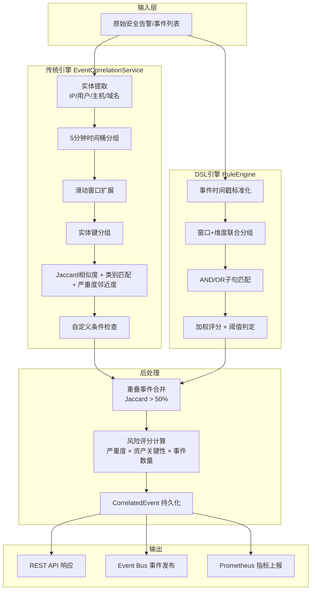
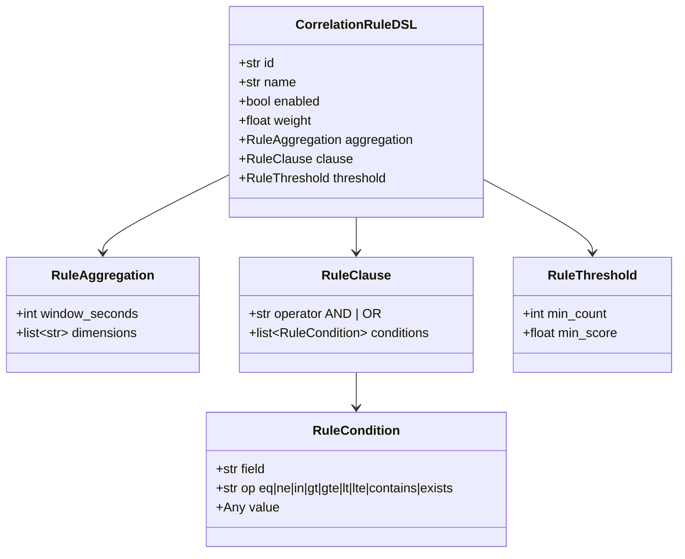
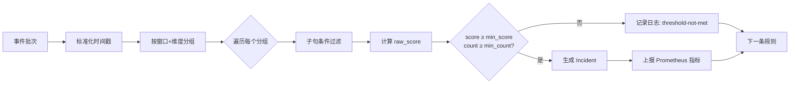

SOC Copilot 的事件关联引擎是一套双架构系统，负责将分散的安全告警聚合为可操作的安全事件。引擎同时维护一套**基于实体/时间/相似度的传统关联服务**（`EventCorrelationService`）和一套**基于 DSL 声明式规则的新一代引擎**（`RuleEngine`），二者共享数据模型并通过统一的 API 端点对外暴露能力。本文将从规则 DSL 的结构设计出发，逐步拆解窗口聚合算法、加权评分机制以及内置规则体系，帮助中级开发者理解引擎的核心架构并具备自定义扩展能力。

Sources: [event_correlation_service.py](backend/services/event_correlation_service.py#L1-L8), [correlation.py](backend/services/correlation/correlation.py#L1-L5), [rule_engine.py](backend/services/correlation/rule_engine.py#L1-L15)

## 整体架构：双引擎并存与协作

引擎的整体数据流遵循"事件输入 → 实体提取 → 窗口分组 → 规则匹配 → 事件合并 → 持久化"的流水线模式。两条引擎路径共享相同的输出模型（`CorrelatedEvent`），但在中间处理逻辑上各有侧重。



**传统引擎**侧重于无规则的自动关联——它从事件中自动提取实体，通过多维度相似度计算判断事件是否属于同一安全事件，适合处理无明确攻击模式告警的泛化关联。**DSL 引擎**则接受完全声明式的规则输入，通过结构化的条件子句、窗口参数和阈值定义来实现精确的模式匹配，适合已知的攻击场景（如暴力破解、端口扫描）。

Sources: [event_correlation_service.py](backend/services/event_correlation_service.py#L42-L88), [rule_engine.py](backend/services/correlation/rule_engine.py#L14-L87), [correlation.py](backend/services/correlation/correlation.py#L15-L24)

## 数据模型：规则与关联事件的持久化

引擎依赖两张核心数据表，分别存储关联规则定义和关联结果事件。

### CorrelationRule — 关联规则模型

规则模型定义了关联的"模板"，包含时间窗口、实体匹配类型、相似度阈值、自定义条件以及触发后的动作类型。

| 字段 | 类型 | 说明 | 默认值 |
|------|------|------|--------|
| `name` | String(200) | 规则名称，唯一标识 | — |
| `time_window_seconds` | Integer | 关联时间窗口（秒） | 300（5分钟） |
| `entity_types` | JSON | 实体匹配开关 `{"ip_address": true, "username": true, "hostname": false}` | — |
| `min_similarity` | Float | 最低相似度阈值（0-1） | 0.7 |
| `conditions` | JSON | 自定义过滤条件（min_event_count、min_severity、category） | null |
| `action` | String(50) | 触发动作：aggregate / suppress / escalate / tag | "aggregate" |
| `priority` | Integer | 优先级，值越高越先执行 | 50 |
| `is_builtin` | Boolean | 是否内置规则（不可修改/删除） | false |

### CorrelatedEvent — 关联事件模型

关联事件是引擎的输出产物，代表多个原始告警聚合后的安全事件。它通过 `rule_id` 外键关联到触发它的规则，并携带丰富的上下文信息。

| 字段 | 说明 |
|------|------|
| `raw_event_ids` / `raw_event_count` | 被聚合的原始事件 ID 列表与数量 |
| `common_entities` | 跨所有事件的公共实体（IP、用户、主机） |
| `confidence_score` | 关联置信度（0-1），源自相似度计算 |
| `risk_score` | 最终风险评分（0-100），基于加权算法 |
| `attack_type` | 攻击类型分类（brute_force、phishing 等） |
| `tactics` / `techniques` | MITRE ATT&CK 映射 |
| `status` | 工作流状态：open → investigating → resolved/false_positive/closed |

此外，系统还维护了一张 `EventSimilarity` 表用于缓存事件对之间的相似度计算结果，支持 jaccard、cosine、embedding、rule_based 四种计算方法，默认 TTL 为 1 小时，避免重复计算。

Sources: [correlation_rule.py](backend/models/correlation_rule.py#L12-L117), [correlated_event.py](backend/models/correlated_event.py#L12-L163), [event_similarity.py](backend/models/event_similarity.py#L12-L55)

## 规则 DSL：声明式关联语言设计

新一代 DSL 引擎通过 Pydantic 模型定义了一套完全声明式的规则语言，使规则可以从 API 直接传入而无需数据库持久化，支持即时的"试运行"模式。

### DSL Schema 层级结构



**`CorrelationRuleDSL`** 是顶层容器，由四个核心组件构成：

- **`aggregation`** 定义时间窗口（`window_seconds`）和聚合维度（`dimensions`），例如按 `source_ip` + `username` 联合分组
- **`clause`** 定义事件过滤条件，支持 AND/OR 逻辑组合，每个 `RuleCondition` 提供 9 种操作符
- **`threshold`** 定义触发门槛：`min_count` 要求最低匹配事件数，`min_score` 要求最低加权分数
- **`weight`** 是每个匹配事件的贡献权重，最终 `score = matched_count × weight`

### 条件操作符一览

| 操作符 | 语义 | 示例 |
|--------|------|------|
| `eq` | 精确相等 | `{"field": "severity", "op": "eq", "value": "high"}` |
| `ne` | 不等于 | `{"field": "status", "op": "ne", "value": "closed"}` |
| `in` | 值在列表中 | `{"field": "event_type", "op": "in", "value": ["auth_failed", "login_failed"]}` |
| `contains` | 字符串包含 | `{"field": "message", "op": "contains", "value": "denied"}` |
| `gt` / `gte` | 大于 / 大于等于 | `{"field": "count", "op": "gt", "value": 10}` |
| `lt` / `lte` | 小于 / 小于等于 | `{"field": "risk_score", "op": "lte", "value": 50}` |
| `exists` | 字段存在且非空 | `{"field": "source_ip", "op": "exists"}` |

引擎内部通过 `_match_clause` 方法处理 AND/OR 逻辑：AND 模式下所有条件必须满足，OR 模式下任一条件满足即可。数值比较通过 `_safe_num` 进行安全转换，非数值统一降级为 0.0。

Sources: [schemas.py](backend/services/correlation/schemas.py#L1-L65), [rule_engine.py](backend/services/correlation/rule_engine.py#L147-L184)

### DSL 示例：暴力破解检测规则

以下是一条完整的 DSL 规则定义，用于检测来自同一 IP 和用户名的高频登录失败：

```json
{
  "id": "rule_failed_login_spike",
  "name": "Failed login spike by host+ip",
  "enabled": true,
  "weight": 2.5,
  "aggregation": {
    "window_seconds": 600,
    "dimensions": ["source_ip", "agent_name", "username"]
  },
  "clause": {
    "operator": "AND",
    "conditions": [
      {"field": "event_type", "op": "in", "value": ["auth_failed", "login_failed"]},
      {"field": "severity", "op": "in", "value": ["high", "critical"]}
    ]
  },
  "threshold": {"min_count": 3, "min_score": 6.0}
}
```

这条规则的含义是：在 600 秒（10 分钟）的窗口内，按 `source_ip + agent_name + username` 三个维度联合分组，如果出现 ≥3 条匹配事件且加权分数 ≥ 6.0（3 条 × 2.5 = 7.5），则触发关联事件。`weight: 2.5` 意味着每条匹配事件的贡献高于默认值，使得少量高严重度事件也能快速触发阈值。

Sources: [rule_engine.py](backend/services/correlation/rule_engine.py#L89-L111)

## 窗口聚合：时间分桶与维度联合分组

窗口聚合是两套引擎共享的核心概念，但实现方式存在差异。

### 传统引擎：固定桶 + 滑动窗口扩展

传统引擎使用**5 分钟固定时间桶**进行初步分组。事件的 `timestamp` 或 `created_at` 字段被截断到最近的 5 分钟边界（`minute // 5 * 5`），生成桶键。随后通过 `_expand_time_windows` 方法进行**滑动窗口扩展**——对每个当前桶，向前回溯最多 3 个相邻桶，将时间差在 `window_seconds` 范围内的事件纳入当前窗口。

```python
# 时间桶计算
bucket = timestamp.replace(second=0, microsecond=0)
bucket = bucket.replace(minute=(bucket.minute // 5) * 5)
bucket_key = bucket.isoformat()
```

这种两阶段策略（先粗粒度分桶，再细粒度扩展）平衡了计算效率与关联精度，确保不会遗漏跨越桶边界的关联事件。

### DSL 引擎：可配置窗口 + 多维度联合分组

DSL 引擎采用更灵活的分组策略。`_group_by_window_and_dimensions` 方法将事件的时间戳转换为以 `window_seconds` 为单位的对齐窗口起点，同时从事件中提取 `dimensions` 指定的字段值，生成 `(window_start, dimension_key)` 联合键。

```python
# 窗口对齐计算
bucket_seconds = int(dt.timestamp()) // window_seconds * window_seconds
window_start = datetime.fromtimestamp(bucket_seconds, tz=UTC)

# 维度键生成
dim_values = [str(event.get(dim, "*")) for dim in dimensions]
dim_key = "|".join(dim_values)
```

例如，当 `dimensions = ["source_ip", "username"]` 时，来自 `192.168.1.100` + `admin` 的所有事件会被归入同一组，而来自同一 IP 但不同用户的事件则分属不同组。维度字段缺失时以通配符 `"*"` 代替，确保分组不会因字段缺失而丢失事件。

Sources: [event_correlation_service.py](backend/services/event_correlation_service.py#L176-L279), [rule_engine.py](backend/services/correlation/rule_engine.py#L127-L145)

## 加权评分：多信号融合的风险量化

引擎的评分体系分为两个层级：**组内相似度计算**（用于判断事件是否应该关联）和**最终风险评分**（用于量化关联后事件的安全影响）。

### 组内相似度计算

传统引擎通过 `_calculate_group_similarity` 方法融合三个独立信号，采用加权平均得到最终相似度：

| 信号 | 权重 | 计算方法 |
|------|------|----------|
| 消息相似度 | 0.5 | Jaccard 系数——将消息分词后计算词集交集/并集比 |
| 类别匹配度 | 0.3 | 完全一致=1.0，完全不同=0.0，部分匹配按比例折算 |
| 严重度邻近度 | 0.2 | 将严重度映射为数值后计算方差，方差越小邻近度越高 |

**Jaccard 消息相似度**采用性能优化策略：当事件数 ≤ 50 时执行完整的 O(n²) 配对计算；超过 50 条时，随机采样 30 条进行估算，避免在大规模事件集上出现性能瓶颈。

```python
# 性能优化：大集合采样
if len(messages) <= MAX_EVENTS_FOR_EXACT:   # 50
    return self._calculate_pairwise_jaccard(messages)
# 采样 30 条避免 O(n²)
sampled_indices = random.sample(range(len(messages)), min(SAMPLE_SIZE, len(messages)))
```

**严重度邻近度**将五个严重度等级映射为 0-4 的数值（info=0, low=1, medium=2, high=3, critical=4），计算标准差后转换为相似度：`proximity = 1.0 - (variance / max_variance)`，其中 `max_variance = 4.0`。当所有事件严重度相同时方差为 0，邻近度为 1.0。

### 最终风险评分计算

通过关联后，每个 `CorrelatedEvent` 会被赋予一个 0-100 的风险评分，由三个因子相乘得出：

```
final_score = min(base_score × criticality_weight × event_multiplier, 100.0)
```

**基础分（base_score）** 直接由严重度映射：

| 严重度 | 基础分 |
|--------|--------|
| critical | 90 |
| high | 70 |
| medium | 50 |
| low | 30 |
| info | 10 |

**资产关键性权重（criticality_weight）** 对基础分进行修正——关键资产上的事件风险更高：

| 资产关键性 | 权重 | 效果 |
|------------|------|------|
| critical | 1.5 | +50% |
| high | 1.3 | +30% |
| medium | 1.0 | 不变 |
| low | 0.8 | -20% |

**事件数量乘数（event_multiplier）** 体现聚合效应——更多关联事件意味着更大威胁，公式为 `min(1.0 + (count - 1) × 0.05, 1.5)`，即每多一条事件增加 5% 的乘数，上限 1.5 倍（对应 10+ 条事件）。

Sources: [event_correlation_service.py](backend/services/event_correlation_service.py#L24-L39), [event_correlation_service.py](backend/services/event_correlation_service.py#L318-L347), [event_correlation_service.py](backend/services/event_correlation_service.py#L525-L559)

## DSL 引擎执行流程

DSL 引擎的 `execute` 方法是整个关联流程的核心入口，它按规则逐一处理事件批次：

1. **事件标准化**：为每条事件解析时间戳，生成统一的 `_dt` 字段
2. **窗口+维度分组**：按规则的 `aggregation` 参数将事件分入 `(window_start, dimension_key)` 组
3. **条件过滤**：对每组事件逐条应用 `clause` 中定义的 AND/OR 条件
4. **评分与阈值判定**：计算 `raw_score = matched_count × weight`，同时检查 `min_count` 和 `min_score` 两个阈值
5. **执行日志记录**：每次规则执行都生成 `RuleExecutionLog`，记录窗口范围、匹配数量、分数和是否触发，便于审计和调试
6. **指标上报**：规则命中时通过 `observe_correlation_rule_hit` 上报 Prometheus 指标



引擎的执行日志（`RuleExecutionLog`）记录了完整的决策过程，包括窗口起止时间、维度键、匹配数量、得分、是否触发以及原因说明，为规则调优提供了数据支撑。

Sources: [rule_engine.py](backend/services/correlation/rule_engine.py#L20-L87), [schemas.py](backend/services/correlation/schemas.py#L52-L65)

## 内置规则体系：10 种预置攻击场景

系统通过 `correlation_rules_builtin.py` 预置了 10 条内置规则，覆盖了 SOC 场景中最常见的攻击模式。这些规则在数据库初始化时自动植入（`is_builtin=True`），不可修改或删除。

| 规则名称 | 时间窗口 | 最低事件数 | 动作 | 优先级 |
|----------|----------|------------|------|--------|
| Brute Force Attack | 5 分钟 | 3 | aggregate | 90 |
| Port Scanning | 2 分钟 | 5 | aggregate | 85 |
| Malware Outbreak | 1 小时 | 2 | escalate | 95 |
| Lateral Movement | 10 分钟 | 3 | aggregate | 90 |
| Data Exfiltration | 5 分钟 | 2 | escalate | 92 |
| Phishing Campaign | 24 小时 | 2 | aggregate | 88 |
| DDoS Attack | 1 分钟 | 50 | escalate | 97 |
| Insider Threat | 7 天 | 3 | aggregate | 80 |
| Web Application Attack | 30 分钟 | 3 | aggregate | 87 |
| Ransomware | 5 分钟 | 5 | escalate（附带自动 playbook） | 99 |

**动作类型**决定了触发后的行为：`aggregate` 将事件聚合为单一事件展示；`escalate` 在聚合基础上自动提升严重度；`suppress` 用于静默低价值重复告警；`tag` 为事件添加标记。Ransomware 规则最为特殊，它在 `action_params` 中配置了 `auto_playbook: "ransomware_response"`，可直接联动 [Playbook DAG 工作流引擎](10-playbook-dag-gong-zuo-liu-yin-qing-jie-dian-cha-jian-zhuang-tai-ji-yu-zhi-xing-dui-lie) 自动执行响应流程。

内置规则通过 `seed_builtin_rules` 函数执行幂等植入——每次启动时检查规则是否已存在（按 `name` 判重），仅创建缺失的规则。

Sources: [correlation_rules_builtin.py](backend/data/correlation_rules_builtin.py#L10-L157), [correlation_rules_builtin.py](backend/data/correlation_rules_builtin.py#L160-L193), [init_correlation_rules.py](backend/init_correlation_rules.py#L20-L53)

## 关联后处理：重叠合并与事件总线发布

### 重叠事件合并

多条规则可能对同一批原始事件产生重复的关联结果。传统引擎通过 `_merge_correlations` 方法检测并合并重叠事件——当两个关联事件的原始事件 ID 集合的 Jaccard 系数 > 0.5（即交集占并集超过一半）时，触发合并。合并策略以包含原始事件最多的关联事件为基准，将所有重叠事件的 ID 和实体聚合到基准事件上，并扩展时间范围至所有事件的最小/最大时间戳。

Sources: [event_correlation_service.py](backend/services/event_correlation_service.py#L581-L668)

### 事件总线集成

关联完成后，路由层会通过统一事件总线（`EventBus`）发布 `correlation.incident.created` 事件，携带事件 ID、规则 ID、严重度和原始事件数量。这使得其他服务（如通知系统、Playbook 触发器）可以订阅并响应新产生的安全事件。

```python
await event_bus.publish(
    event_type="correlation.incident.created",
    source="correlation-engine",
    payload={
        "incident_id": incident.id,
        "rule_id": incident.rule_id,
        "severity": incident.severity,
        "raw_event_count": incident.raw_event_count,
    },
    priority=str(incident.severity).lower(),
)
```

Sources: [correlation.py](backend/routers/correlation.py#L124-L138)

## API 端点全景

关联引擎通过 `/api/correlation` 前缀暴露以下端点，涵盖规则管理、关联执行、事件查询和统计四大功能域。

| 端点 | 方法 | 说明 |
|------|------|------|
| `/correlate` | POST | 提交事件批次，执行传统引擎关联 |
| `/engine/evaluate` | POST | DSL 引擎即时评估（不持久化） |
| `/dsl/example` | GET | 获取 DSL 规则示例 |
| `/test` | POST | 测试指定规则（不持久化） |
| `/rules` | GET | 列出所有规则 |
| `/rules` | POST | 创建自定义规则 |
| `/rules/{id}` | PUT | 更新规则（内置规则不可修改） |
| `/rules/{id}` | DELETE | 删除规则（内置规则不可删除） |
| `/rules/{id}/toggle` | POST | 启用/禁用规则切换 |
| `/incidents` | GET | 查询关联事件（支持 status/severity/attack_type 过滤） |
| `/incidents/{id}` | GET | 获取单个关联事件详情 |
| `/incidents/{id}/status` | PUT | 更新事件状态和负责人 |
| `/stats` | GET | 获取关联统计（事件数/状态分布/规则活跃数） |

**保护机制**：内置规则（`is_builtin=True`）在更新和删除端点中被明确拒绝（返回 403），确保系统预置规则不被意外破坏。事件状态更新端点验证 `status` 必须在 `open / investigating / resolved / false_positive / closed` 五个合法值内。

Sources: [correlation.py](backend/routers/correlation.py#L22-L536)

## 可观测性：指标与监控

每次规则触发时，引擎通过 `observe_correlation_rule_hit(rule_id, tenant_id)` 上报 Prometheus 计数器 `correlation_rule_hit_total`，支持按规则 ID 和租户维度进行聚合分析。结合 [可观测性体系](20-ke-guan-ce-xing-ti-xi-prometheus-zhi-biao-fen-bu-shi-zhui-zong-yu-jie-gou-hua-ri-zhi) 中的 Prometheus + Grafana 监控栈，可以构建规则命中率趋势、引擎吞吐量和事件严重度分布等看板。

Sources: [metrics.py](backend/core/metrics.py#L9-L13), [observability metrics](backend/observability/metrics.py#L166-L167)

## 延伸阅读

- 了解关联规则如何联动自动化响应流程：[Playbook DAG 工作流引擎](10-playbook-dag-gong-zuo-liu-yin-qing-jie-dian-cha-jian-zhuang-tai-ji-yu-zhi-xing-dui-lie)
- 理解告警输入数据的分析处理：[告警分析引擎](9-gao-jing-fen-xi-yin-qing-shuang-yin-qing-ioc-ti-qu-yu-ai-qu-dong-fen-xi)
- 查看关联事件的实时推送机制：[WebSocket 实时通信](21-websocket-shi-shi-tong-xin-lian-jie-guan-li-pin-dao-ding-yue-yu-chi-xian-xiao-xi-dui-lie)
- 监控引擎运行指标：[可观测性体系](20-ke-guan-ce-xing-ti-xi-prometheus-zhi-biao-fen-bu-shi-zhui-zong-yu-jie-gou-hua-ri-zhi)