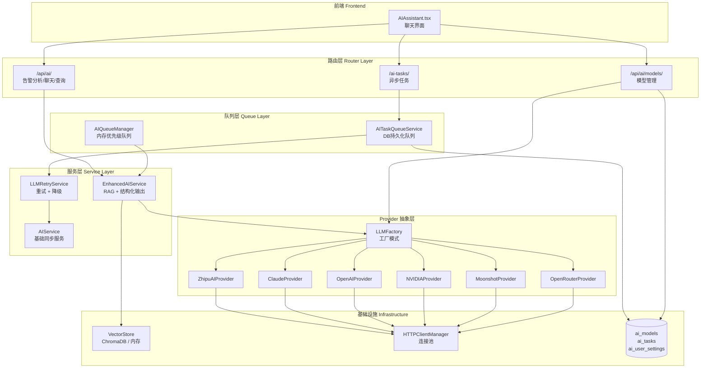
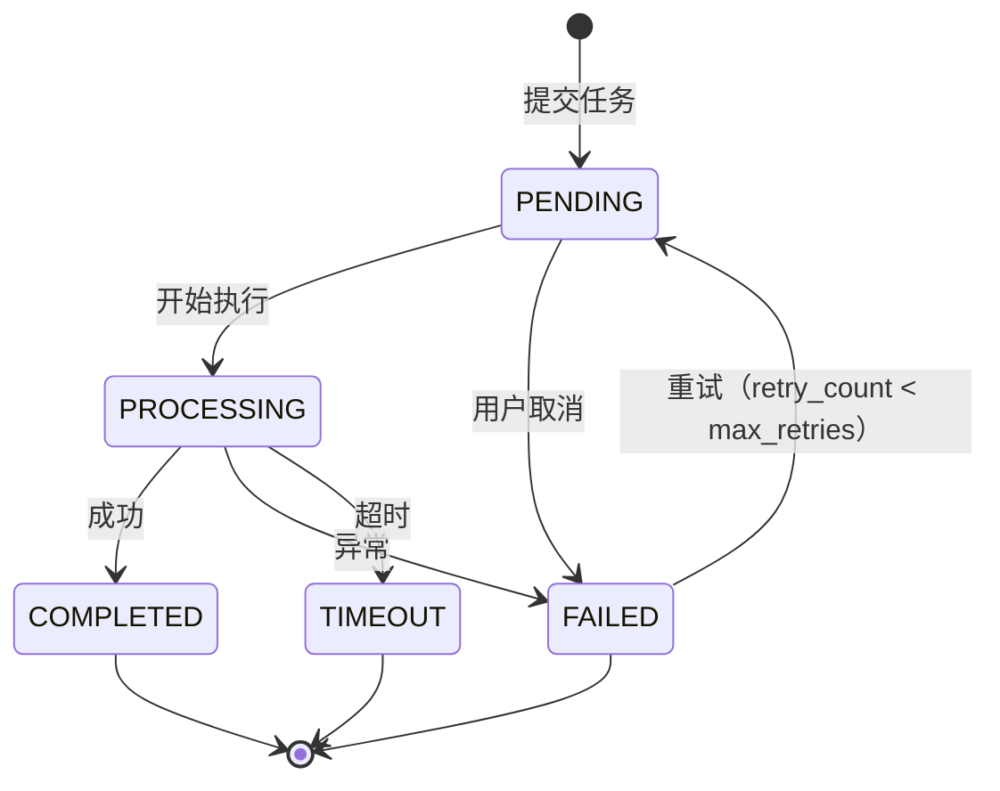

SOC Copilot 的 AI 服务层是一个**可插拔多 Provider 架构**，通过工厂模式将智谱 AI（ZhipuAI）、Anthropic Claude、OpenAI、NVIDIA NIM、Moonshot AI（Kimi）和 OpenRouter 六大 LLM 供应商统一抽象为标准接口。系统提供从同步调用到异步任务队列的多种执行模式，内置重试机制与降级响应策略，并结合 RAG（检索增强生成）能力为安全分析师提供告警研判、自然语言查询、Playbook 推荐和调查报告生成等智能化功能。

Sources: [ai_providers.py](backend/services/ai_providers.py#L1-L565), [ai_service_enhanced.py](backend/services/ai_service_enhanced.py#L1-L500)

## 整体架构概览

AI 服务集成采用**四层分层设计**：Provider 抽象层负责与各 LLM API 的通信协议适配；服务层封装业务逻辑与结构化输出解析；任务队列层管理异步执行与并发控制；路由层暴露 RESTful API 供前端调用。各层之间通过依赖注入和单例模式解耦，便于独立测试和替换。



Sources: [ai_providers.py](backend/services/ai_providers.py#L41-L565), [ai_service_enhanced.py](backend/services/ai_service_enhanced.py#L78-L175), [ai_queue_manager.py](backend/services/ai_queue_manager.py#L20-L116), [ai_task_service.py](backend/services/ai_task_service.py#L28-L91)

## Provider 抽象层：统一接口与工厂模式

### 基类 LLMProvider

所有 Provider 均继承自 `LLMProvider` 基类，该基类定义了两个核心异步方法：`chat_completion` 用于对话补全，`embedding` 用于向量化。每个 Provider 实例持有 API 密钥和基础 URL，并通过全局共享的 `HTTPClientManager` 复用 HTTP 连接池（最大 100 连接、20 keep-alive 连接），避免每次请求创建新连接的开销。

Sources: [ai_providers.py](backend/services/ai_providers.py#L41-L68), [http_client.py](backend/core/http_client.py#L25-L47)

### 六大 Provider 实现对比

系统当前支持六个 Provider 实现，每个 Provider 在协议适配、消息格式转换和默认模型选择上各有差异。下表对比了各 Provider 的核心特征：

| Provider | 类名 | API 端点 | 默认模型 | 协议格式 | Embedding 支持 |
|----------|------|---------|---------|---------|---------------|
| **智谱 AI** | `ZhipuAIProvider` | `open.bigmodel.cn/api/paas/v4` | glm-4 | OpenAI 兼容 | ✅ embedding-2 |
| **Anthropic** | `ClaudeProvider` | `api.anthropic.com/v1/messages` | claude-3-opus-20240229 | Anthropic 原生（system 独立字段） | ❌ 建议使用 OpenAI |
| **OpenAI** | `OpenAIProvider` | `api.openai.com/v1` | gpt-4 | OpenAI 原生 | ✅ text-embedding-ada-002 |
| **NVIDIA** | `NVIDIAProvider` | `integrate.api.nvidia.com/v1` | meta/llama-3.1-405b-instruct | OpenAI 兼容 | ✅ nv-embedqa-e5-v5 |
| **Moonshot** | `MoonshotAIProvider` | `api.moonshot.cn/v1` | moonshot-v1-8k | OpenAI 兼容 | ✅ moonshot-embedding |
| **OpenRouter** | `OpenRouterProvider` | `integrate.api.nvidia.com/v1` | moonshotai/kimi-k2.5 | OpenAI 兼容 | ✅ text-embedding-ada-002 |

值得注意的是，**Anthropic Claude 使用原生消息协议**，其 `system` 消息通过独立字段传递而非混入 messages 数组，因此 `ClaudeProvider` 在 `chat_completion` 中执行了消息格式转换逻辑——将 system 角色消息提取到 `system` 字段，其余消息保持原样传递。而智谱、OpenAI、NVIDIA、Moonshot、OpenRouter 五家 Provider 均采用 OpenAI 兼容协议，统一使用 `/chat/completions` 和 `/embeddings` 端点。

Sources: [ai_providers.py](backend/services/ai_providers.py#L70-L398), [ai_providers.py](backend/services/ai_providers.py#L139-L194)

### LLMFactory 工厂模式

`LLMFactory` 是 Provider 实例化的人口，提供三种创建方式：

1. **`create_provider(provider_type, api_key)`**：最基础的创建方式，仅根据类型和密钥构造 Provider。
2. **`create_provider_for_model(model_id, provider_type)`**：面向"用户选择特定模型"的场景，自动从 `settings` 中读取对应 Provider 的 API Key，并将 `model_id` 注入 Provider 构造函数（智谱、NVIDIA、Moonshot、OpenRouter 需要在构造时指定模型）。
3. **`create_from_config()`**：从全局配置 `settings.ai_provider` 自动选择默认 Provider，读取对应的 API Key 和模型配置。这是系统启动时的默认初始化路径。

Sources: [ai_providers.py](backend/services/ai_providers.py#L460-L565)

## 服务层：从基础到增强

### 双服务架构

系统存在两代 AI 服务实现，通过全局单例向后兼容：

- **`AIService`**（基础版）：直接根据 `settings.ai_provider` 硬编码分支调用智谱或 Anthropic 的 API。它通过 `httpx.AsyncClient` 直接与 Provider 通信，提供 `generate_structured` 方法将 LLM 输出解析为 Pydantic 模型。此服务作为遗留实现保留，被 `LLMRetryService` 内部引用。

- **`EnhancedAIService`**（增强版）：通过 `LLMFactory.create_from_config()` 动态初始化 Provider，支持运行时模型切换。它扩展了基础服务的能力，增加了 RAG 增强的告警分析、自然语言查询解析、Playbook 推荐和调查报告生成四大业务方法。此服务是当前系统的主入口。

Sources: [ai_service.py](backend/services/ai_service.py#L44-L156), [ai_service_enhanced.py](backend/services/ai_service_enhanced.py#L78-L101)

### 结构化输出与 JSON 清洗

两个服务均实现了 `generate_structured` 方法，其核心流程是：将 Pydantic 模型的 JSON Schema 注入 Prompt → 调用 LLM → 清洗响应内容 → 解析 JSON → 类型强转 → 返回 Pydantic 实例。其中 `clean_json_content` 函数处理了 LLM 输出的常见噪声问题：Markdown 代码块包裹（\`\`\`json...\`\`\`）、控制字符残留、以及 JSON 格式不规范。类型强转逻辑特别处理了 LLM 常见的"将整数字段输出为浮点数"和"将数组字段输出为 null"两类错误。

Sources: [ai_service.py](backend/services/ai_service.py#L16-L41), [ai_service_enhanced.py](backend/services/ai_service_enhanced.py#L102-L175)

### LLMRetryService：重试与降级策略

`LLMRetryService` 封装了**两层容错机制**：

1. **自动重试**（最多 2 次）：首次失败后，将验证错误信息和上次输出内容拼接为修正 Prompt（correction prompt），引导 LLM 修正格式错误。这利用了 LLM 的"自我纠错"能力，在 JSON 字段缺失或枚举值错误等场景下有较高的修复成功率。

2. **降级响应**（degraded mode）：所有重试失败后，系统根据业务场景生成最小可用的降级响应。降级响应通过 `_create_degraded_response` 方法针对不同的响应模型类（Alert/Timeline/Report）生成预设的安全默认值，例如告警分析降级时 severity 设为 "low"、confidence 设为 0、IOC 列表置空，同时保留"人工审查"的推荐动作。每个降级响应都携带 `degraded: True` 和 `error_reason` 标记，便于前端区分展示。

Sources: [llm_retry.py](backend/services/llm_retry.py#L17-L175), [llm_retry.py](backend/services/llm_retry.py#L201-L302)

### RAG 增强分析

`EnhancedAIService.analyze_alert_with_rag` 实现了**可选的检索增强生成**：当 `use_rag=True` 时，系统尝试通过 `VectorStore` 检索历史相似告警作为上下文注入 Prompt。向量存储支持 ChromaDB（本地持久化）和内存模式（开发测试），通过 `VectorStoreFactory.create_store` 自动检测可用后端。当前实现中 RAG 上下文以文本提示方式注入，embedding 生成依赖 Provider 的 embedding 接口。

Sources: [ai_service_enhanced.py](backend/services/ai_service_enhanced.py#L177-L252), [vector_store.py](backend/services/vector_store.py#L252-L293)

## 任务队列层：异步执行与并发控制

系统提供了两套任务队列实现，适用于不同的场景需求：

### AIQueueManager（内存优先级队列）

`AIQueueManager` 维护一个内存中的优先级队列和运行任务字典，最大并发数默认为 3。任务提交时按优先级插入队列（高优先级在前），并通过 `asyncio.create_task` 异步执行。每个任务经历 PENDING → PROCESSING → COMPLETED/FAILED 的状态流转，状态变更同步写入数据库。此实现适合轻量级场景，无需额外的基础设施依赖。

Sources: [ai_queue_manager.py](backend/services/ai_queue_manager.py#L20-L116), [ai_queue_manager.py](backend/services/ai_queue_manager.py#L208-L307)

### AITaskQueueService（DB 持久化队列）

`AITaskQueueService` 使用 `asyncio.Queue` 作为分发通道，`AsyncSessionLocal` 作为数据库会话工厂。它在后台启动独立的处理器协程（`_processor_loop`），从队列中取出任务后交由 `_process_task` 执行。处理器协程会在系统启动时通过 `start_ai_task_processor` 函数注册到 FastAPI 的生命周期事件中。任务支持超时控制（默认 300 秒）和自动重试（最多 2 次），超时后任务状态标记为 `TIMEOUT`，异常后检查重试计数决定是否重新入队。

Sources: [ai_task_service.py](backend/services/ai_task_service.py#L28-L91), [ai_task_service.py](backend/services/ai_task_service.py#L168-L238), [ai_task_service.py](backend/services/ai_task_service.py#L281-L329)

### 任务类型与状态机



系统定义了五种任务类型和五种任务状态：

| 任务类型（AITaskType） | 说明 |
|----------------------|------|
| `alert_analysis` | 安全告警 AI 分析 |
| `timeline_analysis` | 事件时间线模式分析 |
| `report_generation` | 安全报告自动生成 |
| `chat_completion` | 通用对话补全 |
| `ioc_analysis` | IOC 指标分析 |

| 任务状态（AITaskStatus） | 说明 |
|------------------------|------|
| `pending` | 等待执行 |
| `processing` | 正在执行 |
| `completed` | 执行成功 |
| `failed` | 执行失败 |
| `timeout` | 执行超时 |

Sources: [ai_task.py](backend/models/ai_task.py#L12-L31), [ai_task.py](backend/models/ai_task.py#L91-L113)

## 数据模型：模型注册与用户偏好

### AIModelModel（模型注册表）

`AIModelModel` 存储所有可用 AI 模型的元信息，包括 Provider 归属、显示名称、能力标签（chat/json/vision/tools）、最大 token 数等。每个模型有一个全局唯一的 `id`（如 `claude-3-5-sonnet-20241022`），`is_default` 字段标记系统级默认模型。模型通过 `init_ai_models.py` 脚本或 `/api/ai/models/refresh` 接口按 Provider API Key 的配置情况自动注册。

Sources: [ai_model.py](backend/models/ai_model.py#L12-L57), [init_ai_models.py](backend/init_ai_models.py#L18-L82)

### AIUserSettingModel（用户偏好）

`AIUserSettingModel` 实现了**用户级模型偏好**：每个用户可以独立设置自己的默认模型（`default_model_id`），此设置不影响全局默认。路由层在处理 `/api/ai/chat` 请求时的模型选择优先级为：用户指定的 `model_id` > 用户偏好默认模型 > 系统全局默认模型 > 服务配置的默认 Provider。

Sources: [ai_user_setting.py](backend/models/ai_user_setting.py#L1-L33), [ai.py](backend/routers/ai.py#L282-L326)

### 模型初始化流程

`init_ai_models.py` 脚本在系统首次部署时执行，根据 `.env` 中配置的各 Provider API Key 动态生成模型注册表。下表展示了初始化脚本注册的全部模型：

| Provider | 模型 ID | 显示名称 | 最大 Token |
|----------|---------|---------|-----------|
| zhipu | `glm-4` | 智谱 GLM-4 | 128,000 |
| zhipu | `glm-4-plus` | 智谱 GLM-4 Plus | 128,000 |
| zhipu | `glm-4-air` | 智谱 GLM-4 Air | 128,000 |
| anthropic | `claude-3-5-sonnet-20241022` | Claude 3.5 Sonnet | 200,000 |
| openai | `gpt-4o` | GPT-4o | 128,000 |
| openai | `gpt-4o-mini` | GPT-4o Mini | 128,000 |
| nvidia | `meta/llama-3.1-405b-instruct` | Llama 3.1 405B | 131,072 |
| nvidia | `minimaxai/minimax-m2.1` | MiniMax M2.1 | 8,192 |
| nvidia | `moonshotai/kimi-k2.5` | Kimi K2.5 | 131,072 |
| moonshot | `moonshot-v1-8k` | Moonshot v1 8K | 32,000 |

Sources: [init_ai_models.py](backend/init_ai_models.py#L84-L234), [ai_models.py](backend/routers/ai_models.py#L311-L424)

## API 端点总览

### AI 功能端点（`/api/ai/`）

| 方法 | 路径 | 功能 | 说明 |
|------|------|------|------|
| POST | `/api/ai/analyze-alert` | 告警 AI 分析 | RAG 增强，返回摘要/根因/建议/置信度 |
| POST | `/api/ai/query` | 自然语言查询 | 解析意图为结构化参数（list_alerts/run_playbook 等） |
| POST | `/api/ai/recommend-playbooks` | Playbook 推荐 | 基于告警特征匹配最佳 Playbook |
| POST | `/api/ai/chat` | AI 对话 | 支持多轮对话，运行时模型选择 |
| POST | `/api/ai/generate-report` | 调查报告生成 | Markdown 格式输出 |
| GET | `/api/ai/status` | AI 服务状态 | 检测 Provider 可用性与功能列表 |

### 模型管理端点（`/api/ai/models/`）

| 方法 | 路径 | 功能 | 权限 |
|------|------|------|------|
| GET | `/api/ai/models` | 列出所有模型 | 认证用户 |
| GET | `/api/ai/models/default` | 获取默认模型 | 认证用户 |
| POST | `/api/ai/models/default` | 设置用户默认模型 | 认证用户 |
| POST | `/api/ai/models/test` | 测试模型连通性 | 认证用户 |
| POST | `/api/ai/models/refresh` | 刷新模型列表 | 管理员 |

### 异步任务端点（`/ai-tasks/`）

| 方法 | 路径 | 功能 | 说明 |
|------|------|------|------|
| POST | `/ai-tasks/submit` | 提交异步任务 | 返回 task_id，支持优先级和超时设置 |
| GET | `/ai-tasks/{task_id}/status` | 查询任务状态 | 含进度百分比估算 |
| GET | `/ai-tasks/{task_id}/result` | 获取任务结果 | 仅 completed 状态可获取 |
| POST | `/ai-tasks/{task_id}/cancel` | 取消任务 | 仅 pending/processing 可取消 |
| GET | `/ai-tasks` | 列出用户任务 | 支持状态/类型筛选与分页 |
| GET | `/ai-tasks/types` | 获取可用任务类型 | 枚举所有 AITaskType |

Sources: [ai.py](backend/routers/ai.py#L24-L453), [ai_models.py](backend/routers/ai_models.py#L30-L465), [ai_tasks.py](backend/routers/ai_tasks.py#L19-L334)

## 配置体系

AI 服务相关的环境变量均在 `core/config.py` 的 `Settings` 类中定义，通过 Pydantic Settings 自动从 `.env` 文件加载。关键配置项如下：

```bash
# ── 全局 Provider 选择 ──
AI_PROVIDER=zhipu          # zhipu | claude | openai | nvidia | moonshot | openrouter

# ── 各 Provider API 密钥（留空则该 Provider 不可用）──
ZHIPU_API_KEY=             # 智谱 AI
ANTHROPIC_API_KEY=         # Anthropic Claude
OPENAI_API_KEY=            # OpenAI
NVIDIA_API_KEY=            # NVIDIA NIM
MOONSHOT_API_KEY=          # Moonshot AI (Kimi)
OPENROUTER_API_KEY=        # OpenRouter

# ── Provider 级模型指定 ──
ZHIPU_MODEL=glm-4                        # 智谱默认模型
NVIDIA_MODEL=meta/llama-3.1-405b-instruct # NVIDIA 默认模型
MOONSHOT_MODEL=moonshot-v1-8k             # Moonshot 默认模型
OPENROUTER_MODEL=moonshotai/kimi-k2.5     # OpenRouter 默认模型

# ── 重试策略 ──
MAX_RETRIES=2               # LLM 调用最大重试次数
```

Sources: [config.py](backend/core/config.py#L9-L24), [.env.example](.env.example#L34-L35)

## Prompt 工程：告警分析模板

系统的告警分析 Prompt 位于 `prompts/alert_analysis.py`，采用**双模板设计**：

- **完整分析模板**（`ALERT_ANALYSIS_USER_PROMPT`）：包含 MITRE ATT&CK 映射、威胁判定（verdict）、IOC 提取（IP/域名/URL/哈希/邮箱/文件路径）、实体识别、证据链、影响评估、根因分析和处置建议共 8 个维度的分析要求。输出严格遵循预定义的 JSON Schema，包含 `analysis_version`、`attack_technique_ids`、`confidence_score` 等结构化字段。

- **快速研判模板**（`QUICK_ANALYSIS_USER_PROMPT`）：精简版本，仅输出威胁判定、严重等级、摘要、首要 IOC 和建议动作，用于低延迟场景。

两个模板的推理参数配置为 `temperature=0.1`（追求确定性输出）、`max_tokens=4096`、`retry_count=3`。

Sources: [alert_analysis.py](backend/prompts/alert_analysis.py#L1-L156)

## 前端集成

前端通过 `AIAssistant.tsx` 组件与 AI 服务交互。该组件实现了**双通道请求策略**：用户消息首先发送到 `/api/ai/query` 进行意图解析；如果意图识别成功（非 "unknown"），直接返回结构化响应并根据意图类型附加操作链接（如跳转到告警列表）；如果意图无法识别，则回退到 `/api/ai/chat` 进行通用对话。组件维护对话历史并取最近 10 条消息作为上下文传递给后端，同时提供四个快捷操作按钮用于常见的分析师操作。

Sources: [AIAssistant.tsx](frontend/components/AIAssistant.tsx#L50-L126)

## 关键设计决策总结

| 设计决策 | 选择 | 理由 |
|---------|------|------|
| Provider 抽象 | 基类 + 工厂模式 | 新增 Provider 只需实现 `chat_completion` 和 `embedding` |
| HTTP 客户端 | 全局单例连接池 | 避免频繁创建/销毁连接，复用 TCP keep-alive |
| 结构化输出 | Prompt 注入 Schema + JSON 清洗 | 不依赖 OpenAI Function Calling 等特定功能，兼容所有 Provider |
| 容错策略 | 重试 + 降级响应 | 确保即使 LLM 不可用，系统仍能返回安全默认值 |
| 任务队列 | 双实现（内存 + DB） | 内存队列适合即时任务，DB 队列适合持久化和恢复 |
| 模型选择 | 三级回退（用户指定 > 用户偏好 > 系统默认） | 平衡灵活性与默认可用性 |

---

**相关阅读**：了解 AI 服务如何被 Playbook 引擎调用，请参阅 [Playbook DAG 工作流引擎：节点插件、状态机与执行队列](10-playbook-dag-gong-zuo-liu-yin-qing-jie-dian-cha-jian-zhuang-tai-ji-yu-zhi-xing-dui-lie)。了解告警分析引擎如何与 AI 服务协作，请参阅 [告警分析引擎：双引擎 IOC 提取与 AI 驱动分析](9-gao-jing-fen-xi-yin-qing-shuang-yin-qing-ioc-ti-qu-yu-ai-qu-dong-fen-xi)。了解可观测性层面的 AI 调用监控，请参阅 [可观测性体系：Prometheus 指标、分布式追踪与结构化日志](20-ke-guan-ce-xing-ti-xi-prometheus-zhi-biao-fen-bu-shi-zhui-zong-yu-jie-gou-hua-ri-zhi)。