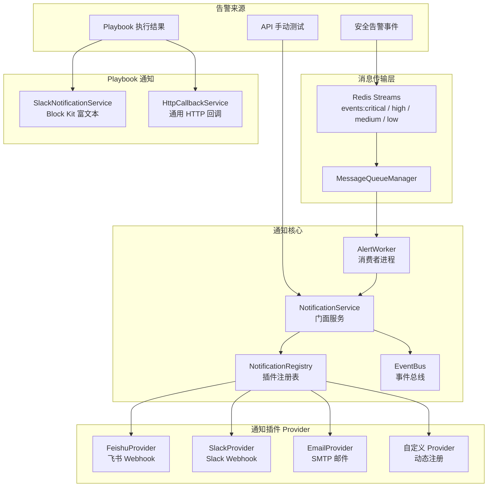
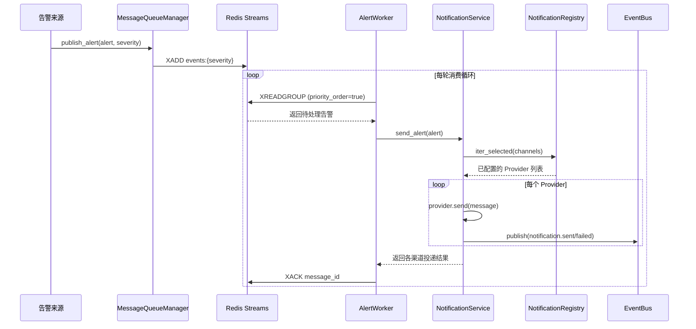
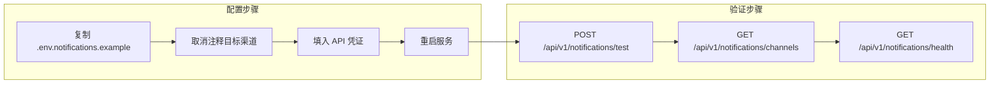

SOC Copilot 的通知系统采用 **插件化注册表架构**，将通知渠道抽象为可插拔的 Provider，通过统一的注册中心管理飞书（Feishu）、Slack、邮件三个内置渠道，并支持运行时动态扩展。该系统与消息队列（Redis Streams）、事件总线、Playbook 引擎深度集成，形成从告警产生到多渠道推送的完整闭环。

Sources: [notification_service.py](backend/services/notification_service.py#L1-L96), [__init__.py](backend/services/notifications/__init__.py#L1-L15)

## 整体架构

通知服务的核心设计遵循三个原则：**插件隔离**（每个渠道独立实现）、**注册中心调度**（统一管理与路由）、**事件驱动**（与消息队列和事件总线联动）。下面的架构图展示了从告警产生到多渠道推送的完整数据流。

Sources: [notification_service.py](backend/services/notification_service.py#L1-L96), [registry.py](backend/services/notifications/registry.py#L1-L33), [alert_worker.py](backend/workers/alert_worker.py#L1-L215)

## 插件契约与抽象基类

所有通知渠道都必须实现 `NotificationProvider` 抽象基类定义的契约。该基类声明了两个核心方法：`is_configured()` 检测渠道是否具备有效的配置凭证，`send()` 执行实际的消息投递。通知内容通过 `NotificationMessage` 数据类统一封装，包含标题、正文、严重级别和原始负载四个字段。

`NotificationMessage` 使用 Python 的 `dataclass(slots=True)` 装饰器，既提供了类型安全的字段约束，又通过 `__slots__` 优化了内存占用——在高频告警场景下，这种设计可以减少每个通知对象的内存分配开销。

Sources: [base.py](backend/services/notifications/base.py#L1-L30)

| 契约成员 | 类型 | 职责 |
|---|---|---|
| `NotificationMessage.title` | `str` | 通知标题，如 `[SOC] 疑似暴力破解` |
| `NotificationMessage.body` | `str` | 通知正文，含告警详情 |
| `NotificationMessage.severity` | `str` | 严重级别：`critical` / `high` / `medium` / `low` |
| `NotificationMessage.payload` | `dict[str, Any]` | 原始告警数据，供渠道自定义格式化 |
| `NotificationProvider.name` | `str` | 渠道标识，如 `"feishu"` / `"slack"` / `"email"` |
| `NotificationProvider.is_configured()` | `bool` | 检查环境变量或构造参数是否完整 |
| `NotificationProvider.send()` | `async bool` | 异步发送通知，返回成功/失败 |

## 注册表：插件发现与调度

`NotificationRegistry` 是通知系统的调度中枢，维护一个从渠道名称到 Provider 实例的映射表。它提供四种核心能力：**注册**（`register`）、**查找**（`get`）、**已配置过滤**（`configured`）、**选择性迭代**（`iter_selected`）。

其中 `iter_selected` 方法是关键的路由逻辑——当调用方指定了目标渠道列表时，它只返回已配置且在列表中的 Provider；当未指定渠道时，自动降级为投递到所有已配置的 Provider。这种"默认全量、按需过滤"的设计确保了新渠道接入时无需修改调用方代码。

Sources: [registry.py](backend/services/notifications/registry.py#L1-L33)

## 内置通知渠道实现

### 飞书（Feishu）渠道

飞书 Provider 通过 Webhook URL 向指定群聊发送文本消息。它从 `FEISHU_WEBHOOK_URL` 环境变量读取配置，使用 `aiohttp` 异步 HTTP 客户端发送 POST 请求。消息格式遵循飞书自定义机器人的 `text` 消息类型协议。

飞书 Provider 集成了 `tenacity` 重试策略：指数退避（初始等待 2 秒，最大 8 秒），最多重试 3 次，仅在遇到 `aiohttp.ClientError` 或 `TimeoutError` 时触发重试。HTTP 超时设置为 8 秒，兼顾了飞书 API 的响应延迟和网络抖动容忍。

Sources: [feishu.py](backend/services/notifications/feishu.py#L1-L44)

### Slack 渠道

Slack Provider 的结构与飞书类似，但消息格式采用了 Slack 的 Attachments 协议。它将通知标题放在顶层 `text` 字段，正文放在 `attachments` 数组中，并为 attachment 设置了红色（`#ff5f56`）边框颜色以在视觉上突出安全告警的紧急性。

重试策略与飞书一致（3 次指数退避），同样通过 `SLACK_WEBHOOK_URL` 环境变量获取入站 Webhook 地址。

Sources: [slack.py](backend/services/notifications/slack.py#L1-L44)

### 邮件（Email）渠道

邮件 Provider 与前两个渠道的技术路线有显著差异——它使用标准库 `smtplib` 通过 SMTP 协议发送邮件，而非 HTTP API。为了避免阻塞异步事件循环，邮件发送通过 `asyncio.to_thread()` 委托到线程池执行。

邮件 Provider 的配置项最多，需要 5 个环境变量协同：`ALERT_EMAIL_TO`（收件人，支持逗号分隔多个地址）、`SMTP_SERVER`（默认 Gmail）、`SMTP_PORT`（默认 587）、`SMTP_USERNAME`、`SMTP_PASSWORD`。所有连接均强制 STARTTLS 加密，超时为 10 秒。

Sources: [email.py](backend/services/notifications/email.py#L1-L44)

| 配置项 | 飞书 | Slack | 邮件 |
|---|---|---|---|
| **必需环境变量** | `FEISHU_WEBHOOK_URL` | `SLACK_WEBHOOK_URL` | `ALERT_EMAIL_TO` + `SMTP_USERNAME` + `SMTP_PASSWORD` |
| **协议** | HTTPS Webhook | HTTPS Webhook | SMTP/TLS |
| **异步实现** | `aiohttp` | `aiohttp` | `smtplib` + `asyncio.to_thread` |
| **重试策略** | 3 次，指数退避 2-8s | 3 次，指数退避 2-8s | 无（单次发送） |
| **消息格式** | `text` 文本 | `attachments` 彩色卡片 | MIME 纯文本邮件 |
| **超时设置** | 8s | 8s | 10s |

## 消息模板渲染

`render_alert_template` 函数负责将原始告警字典转换为标准化的通知内容三元组 `(title, body, severity)`。它从告警中提取 `source`、`title`、`severity`、`event_type`、`created_at` 和 `description` 字段，组装为面向所有渠道的统一文本格式。

这种集中式模板设计确保了不同渠道展示一致的告警信息，同时保留了通过 `NotificationMessage.payload` 传递原始数据的能力——渠道实现可以根据需要从 payload 中提取额外字段进行自定义格式化。

Sources: [templates.py](backend/services/notifications/templates.py#L1-L21)

## NotificationService：门面服务

`NotificationService` 是通知系统的统一入口，扮演 **门面模式（Facade）** 的角色。它在构造函数中完成三项初始化工作：创建 `NotificationRegistry` 实例、注册三个内置 Provider、获取事件总线引用。同时，为了向后兼容旧代码和路由，它将各 Provider 的配置属性暴露为直接访问的实例属性。

`send_alert` 方法是核心调度流程：首先通过 `render_alert_template` 将告警渲染为统一消息，然后遍历目标渠道的 Provider 实例逐个调用 `send()`，并将每个渠道的投递结果收集到字典中返回。每次投递（无论成功或失败）都会通过 `EventBus` 发布 `notification.sent` 或 `notification.failed` 事件，供审计日志和监控系统消费。

该服务采用模块级单例模式（`get_notification_service`），确保整个应用生命周期内只创建一个实例，避免重复注册和资源浪费。

Sources: [notification_service.py](backend/services/notification_service.py#L1-L96)

## 动态插件扩展机制

通知架构支持运行时动态注册新的通知渠道。开发者只需继承 `NotificationProvider` 抽象基类、实现 `is_configured()` 和 `send()` 方法，然后通过 `NotificationService.register_provider()` 即可将新渠道注入注册表。

测试文件中的 `DummyProvider` 展示了这一机制的标准用法——它实现了一个空操作的通知渠道，用于验证动态注册后消息能正确路由到新 Provider。

Sources: [test_notification_plugins.py](backend/tests/test_notification_plugins.py#L1-L38)

扩展一个新通知渠道（如钉钉、企业微信）只需三步：

1. 创建继承 `NotificationProvider` 的新类，实现 `name`、`is_configured()` 和 `send()` 方法
2. 在 `_register_builtin()` 中添加注册调用，或在运行时通过 `register_provider()` 动态注入
3. 添加对应的环境变量到 `.env.notifications.example` 模板文件

Sources: [notification_service.py](backend/services/notification_service.py#L42-L49), [.env.notifications.example](.env.notifications.example#L1-L93)

## 消息队列与 AlertWorker

通知系统通过 Redis Streams 实现告警消息的优先级队列。`MessageQueueManager` 将告警按严重级别路由到四条独立 Stream：`events:critical`、`events:high`、`events:medium`、`events:low`，并支持 Consumer Group 模式的消息确认（ACK）和负确认（NACK）。

`AlertWorker` 是独立的后台消费者进程，从 Redis Streams 按优先级顺序（`priority_order=True`）拉取告警消息，调用 `NotificationService.send_alert` 进行多渠道推送，最后通过 `acknowledge_async` 确认消息处理完成。如果处理失败，消息保留在 Pending 列表中，可被其他 Worker 接管。AlertWorker 支持水平扩展——多个 Worker 实例并行消费同一 Consumer Group，实现高吞吐告警处理。

Sources: [alert_worker.py](backend/workers/alert_worker.py#L1-L215), [message_queue_manager.py](backend/services/message_queue_manager.py#L1-L182)

Sources: [alert_worker.py](backend/workers/alert_worker.py#L69-L160), [message_queue_manager.py](backend/services/message_queue_manager.py#L73-L97)

## Playbook 引擎通知集成

Playbook DAG 引擎拥有独立的通知子系统，与核心通知服务并行存在，专门处理工作流执行过程中的事件通知。它包含两个专用服务：

**SlackNotificationService** 提供 Playbook 生命周期的精细通知：`notify_playbook_started`（启动通知，含 Run ID 和执行模式）、`notify_playbook_completed`（完成通知，含耗时和节点数）、`notify_approval_required`（人工审批请求）以及 `notify_run_failed`（失败告警，含错误信息和失败节点列表）。每个方法都使用 Slack Block Kit 构建富文本消息，包含 header、section、fields 等结构化组件。失败告警受 `ENABLE_RUN_FAILURE_NOTIFY` 环境变量开关控制，避免非预期的告警风暴。

**HttpCallbackService** 是通用的 HTTP 回调通知机制，支持 Playbook 级别和节点级别的事件回调。它实现了自定义的指数退避重试逻辑（`2^(attempt-1)` 秒间隔），可独立于核心通知系统向外部系统推送事件。

Sources: [slack.py](backend/playbook_engine/notifications/slack.py#L1-L403), [http_callback.py](backend/playbook_engine/notifications/http_callback.py#L1-L161)

## API 端点

通知服务通过 `/api/v1/notifications` 路由前缀暴露四个管理端点，覆盖测试验证、状态查询和健康检查三个场景。

| 端点 | 方法 | 功能 | 返回值 |
|---|---|---|---|
| `/api/v1/notifications/test` | POST | 发送测试通知到指定或全部已配置渠道 | `{"feishu": true, "slack": false, ...}` |
| `/api/v1/notifications/channels` | GET | 查看各通知渠道是否已配置 | `{"feishu": true, "slack": true, "email": false}` |
| `/api/v1/notifications/queue/stats` | GET | 查看 Redis Streams 各优先级队列统计 | `{"critical": {"length": 3, "pending": 1, ...}}` |
| `/api/v1/notifications/health` | GET | 通知系统整体健康状态 | `{"redis": true, "streams": true, "channels": {...}}` |

测试端点支持通过请求体 `channels` 字段指定目标渠道（如 `["feishu", "slack"]`），留空则发送到所有已配置渠道。队列统计端点在 Redis 不可用时降级返回全零数据，确保前端页面不会因基础设施故障而整体崩溃。

Sources: [notifications.py](backend/routers/notifications.py#L1-L175)

## 配置指南

通知渠道的配置全部通过环境变量管理，项目提供了 `.env.notifications.example` 模板文件作为参考。飞书渠道仅需 `FEISHU_WEBHOOK_URL`；Slack 渠道仅需 `SLACK_WEBHOOK_URL`；邮件渠道需要完整的 SMTP 五元组。各渠道互不依赖，可以按需开启任意组合。

项目还提供了 `Scripts/setup-feishu.sh` 交互式配置脚本，可引导用户完成飞书机器人创建、Webhook URL 获取、格式验证、配置文件写入和测试消息发送的完整流程。

Sources: [.env.notifications.example](.env.notifications.example#L1-L93), [setup-feishu.sh](Scripts/setup-feishu.sh#L1-L206)

## 事件总线集成

每次通知投递（无论成功或失败）都会通过 `EventBus` 发布事件到消息代理（Message Broker）。成功投递发布 `notification.sent` 事件，失败投递发布 `notification.failed` 事件，事件 payload 包含渠道名称、告警 ID 和投递状态。事件的 `event_id` 由 `{alert_id}:{provider_name}` 组成，确保全局唯一且可追溯。

`EventBus` 底层委托给 `MessageBroker` 抽象（支持 Redis Broker 和 Kafka Broker 两种实现），事件按照告警的严重级别设置优先级，确保 critical 级别的通知事件优先被下游消费者处理。即使事件总线发布失败，通知服务也仅记录警告日志，不会影响通知投递本身的成功返回。

Sources: [notification_service.py](backend/services/notification_service.py#L60-L84), [event_bus.py](backend/services/event_bus.py#L1-L61), [schemas.py](backend/services/message_broker/schemas.py#L1-L67)

---

**相关阅读**：通知系统与消息队列基础设施紧密关联，了解消息代理的多优先级 Stream 和 Consumer Group 设计可参考 [事件关联引擎：规则 DSL、窗口聚合与加权评分](13-shi-jian-guan-lian-yin-qing-gui-ze-dsl-chuang-kou-ju-he-yu-jia-quan-ping-fen)。通知渠道的运行时管理和服务启动顺序可参考 [服务生命周期管理与优先级启动机制](7-fu-wu-sheng-ming-zhou-qi-guan-li-yu-you-xian-ji-qi-dong-ji-zhi)。Playbook 中的审批通知流程可参考 [Playbook DAG 工作流引擎：节点插件、状态机与执行队列](10-playbook-dag-gong-zuo-liu-yin-qing-jie-dian-cha-jian-zhuang-tai-ji-yu-zhi-xing-dui-lie)。