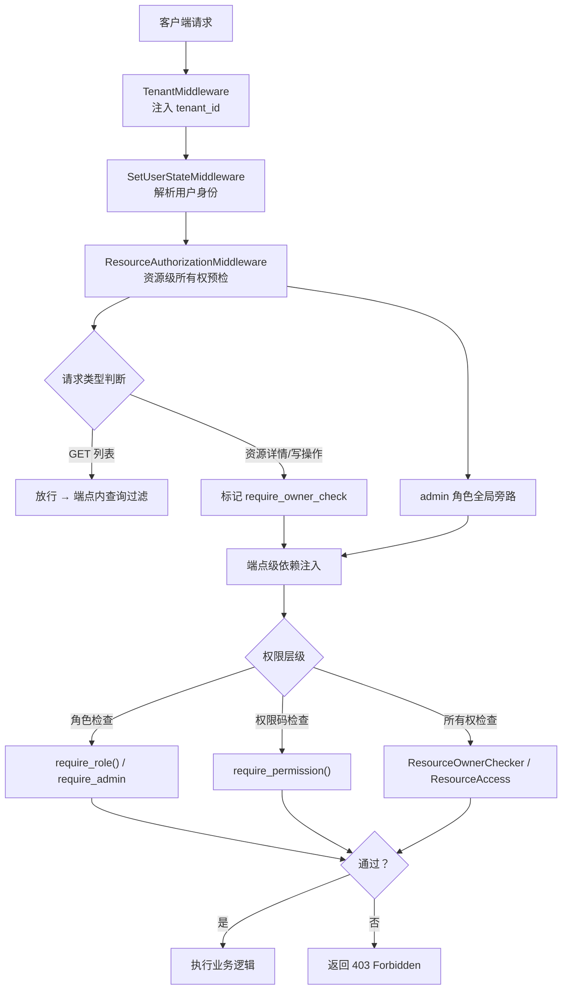
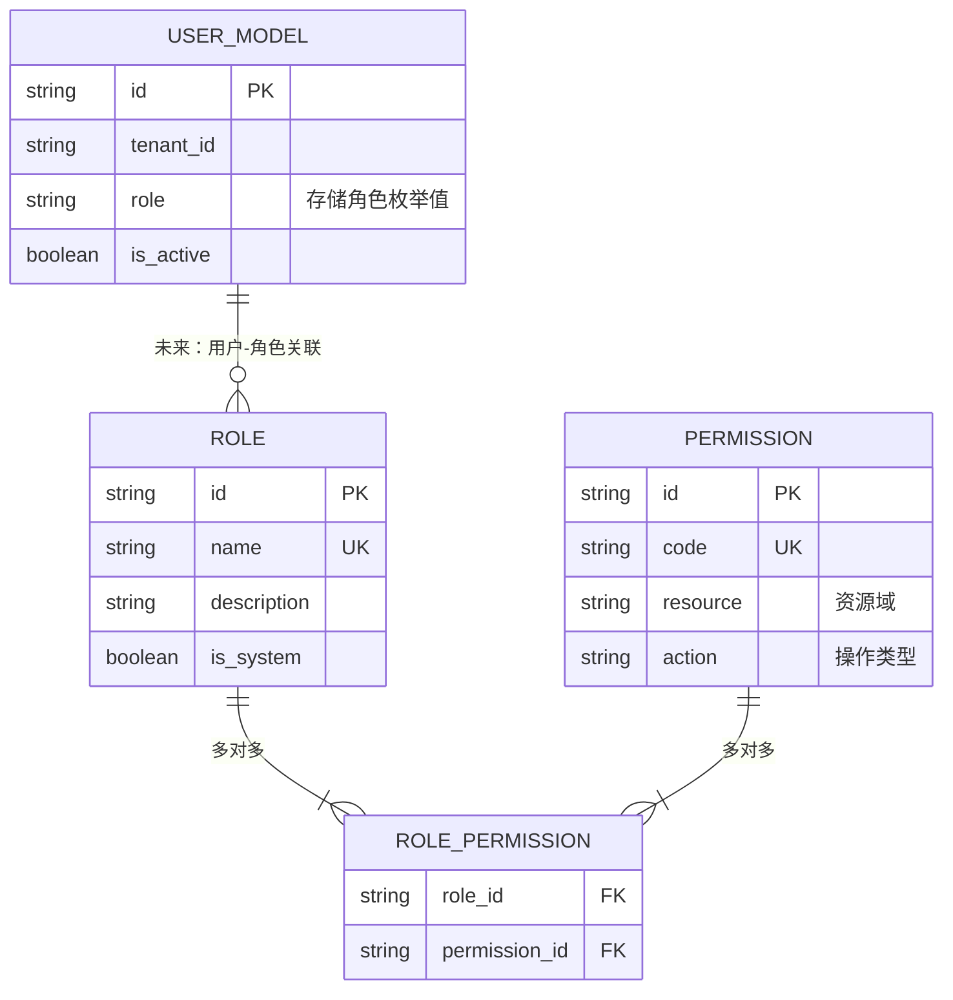
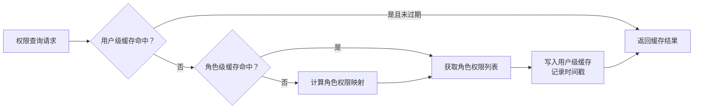
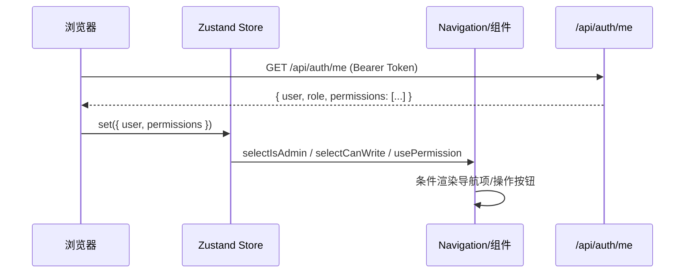
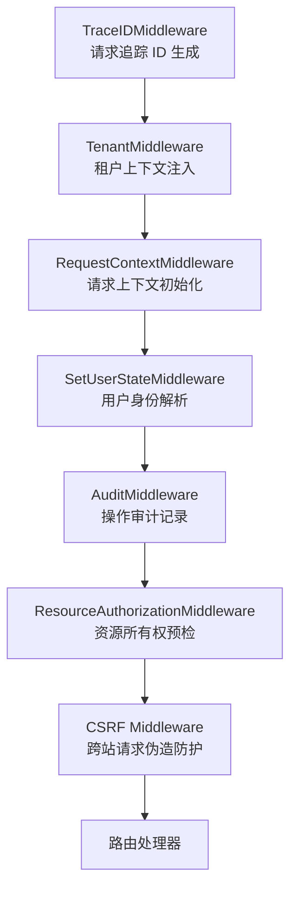

SOC Copilot 实现了一套三层防御的访问控制体系：**基于角色的访问控制（RBAC）** 管理全局能力边界，**资源级所有权校验** 保护多租户下的数据隔离，**前端权限感知层** 在 UI 侧实现零信任渲染。三层协同工作，确保从网络请求到界面呈现的完整安全链路。本文将深入解析每层的模型设计、权限映射规则、缓存策略以及前后端协作机制，帮助开发者理解如何在平台中正确使用和扩展权限控制。

Sources: [models/rbac.py](backend/models/rbac.py#L1-L55), [models/user.py](backend/models/user.py#L1-L57)

## 整体架构概览

权限检查贯穿一个请求的完整生命周期，从中间件层的粗粒度拦截到端点层的细粒度校验，形成漏斗式过滤：



**关键设计原则**：admin 角色在每一层都享有全局旁路（bypass），这意味着管理员永远不需要通过所有权校验——这一约定在中间件层、依赖注入层和前端权限层统一生效。

Sources: [middleware/authorization_middleware.py](backend/middleware/authorization_middleware.py#L1-L109), [main.py](backend/main.py#L420-L434)

## 数据模型：角色与权限

### 用户角色枚举

系统定义了三个内置角色，通过 `UserRole` 枚举严格控制取值范围：

| 角色 | 枚举值 | 定位 | 核心能力 |
|------|--------|------|----------|
| **管理员** | `admin` | 平台运维，全权控制 | 用户管理、所有资源的读写删除、系统配置 |
| **分析师** | `analyst` | 安全运营核心执行者 | 告警分析、Playbook 执行、资产管理、IOC 操作 |
| **审计员** | `auditor` | 只读审计与合规审查 | 告警查看、报告生成、审计日志只读、威胁情报查询 |

`UserModel` 中 `role` 字段以字符串存储（`String(20)`），默认值为 `analyst`。数据库层通过复合索引 `ix_users_role_is_active` 优化按角色+活跃状态的组合查询。

Sources: [models/user.py](backend/models/user.py#L13-L56)

### RBAC 关联模型（预留扩展）

系统定义了 `Role` 和 `Permission` 两张模型表，以及关联表 `role_permissions`，为未来的细粒度权限分配预留了数据库基础设施：



当前阶段，`Permission.code` 遵循 `{resource}:{action}` 命名规范（如 `users:read`、`playbook:run`），`Permission` 表上建立了 `(resource, action)` 复合索引以加速权限查询。`Role.is_system` 字段标记系统内置角色（不可删除），为未来自定义角色功能提供基础。

Sources: [models/rbac.py](backend/models/rbac.py#L12-L54)

## 权限映射规则

### 角色到权限的硬编码映射

当前版本通过 `_get_permissions_by_role()` 函数实现角色到权限码的映射，使用 `@lru_cache(maxsize=32)` 缓存以避免重复计算。以下是完整的权限矩阵：

| 权限码 | 资源域 | 操作 | admin | analyst | auditor |
|--------|--------|------|:-----:|:-------:|:-------:|
| `users:read` | 用户 | 读 | ✅ | ❌ | ❌ |
| `users:write` | 用户 | 写 | ✅ | ❌ | ❌ |
| `users:delete` | 用户 | 删 | ✅ | ❌ | ❌ |
| `api_keys:read` | API Key | 读 | ✅ | ✅ | ❌ |
| `api_keys:write` | API Key | 写 | ✅ | ✅ | ❌ |
| `api_keys:delete` | API Key | 删 | ✅ | ❌ | ❌ |
| `audit_logs:read` | 审计日志 | 读 | ✅ | ❌ | ✅ |
| `assets:read` | 资产 | 读 | ✅ | ✅ | ✅ |
| `assets:write` | 资产 | 写 | ✅ | ✅ | ❌ |
| `assets:delete` | 资产 | 删 | ✅ | ❌ | ❌ |
| `ioc_hits:read` | IOC | 读 | ✅ | ✅ | ✅ |
| `ioc_hits:write` | IOC | 写 | ✅ | ✅ | ❌ |
| `history:read` | 历史记录 | 读 | ✅ | ✅ | ✅ |
| `history:write` | 历史记录 | 写 | ✅ | ✅ | ❌ |
| `history:delete` | 历史记录 | 删 | ✅ | ❌ | ❌ |
| `analyze_alert` | 告警 | 分析 | ✅ | ✅ | ✅ |
| `build_timeline` | 时间线 | 构建 | ✅ | ✅ | ✅ |
| `generate_report` | 报告 | 生成 | ✅ | ✅ | ✅ |
| `playbook:read` | Playbook | 读 | ✅ | ✅ | ✅ |
| `playbook:run` | Playbook | 执行 | ✅ | ✅ | ❌ |
| `playbook:resume` | Playbook | 恢复 | ✅ | ✅ | ❌ |
| `playbook:apply` | Playbook | 应用 | ✅ | ❌ | ❌ |
| `ti:query` | 威胁情报 | 查询 | ✅ | ✅ | ✅ |

权限码遵循三种命名风格：**资源 CRUD 型**（`users:read`）用于标准数据操作，**动作型**（`analyze_alert`）用于业务功能，**域操作型**（`ti:query`）用于跨资源的领域操作。

Sources: [dependencies/auth.py](backend/dependencies/auth.py#L110-L173)

### 双层权限缓存

权限查询经过两层缓存优化，确保高频鉴权不会成为性能瓶颈：

**第一层：角色级缓存**（`@lru_cache`）—— 以角色枚举值为 key，缓存该角色的完整权限元组。由于角色种类有限（当前仅 3 种），缓存命中率为 100%，且在角色-权限映射变更时通过 `cache_clear()` 一次性失效。

**第二层：用户级缓存**（`_user_permission_cache` 字典）—— 以用户 ID 为 key，为每个用户维护权限列表和缓存时间戳，TTL 为 5 分钟（300 秒）。当用户角色被变更时，通过 `invalidate_user_permission_cache(user_id)` 精确失效该用户的缓存，而非清空全量缓存。



权限缓存在以下场景自动失效：管理员修改用户角色时调用 `invalidate_user_permission_cache(user_id)`、角色权限映射变更时调用 `clear_permission_cache()` 清空全部缓存。

Sources: [dependencies/auth.py](backend/dependencies/auth.py#L27-L234), [routers/users.py](backend/routers/users.py#L154-L156)

## 后端访问控制实现

### 角色级依赖注入

FastAPI 的依赖注入系统是权限控制的核心入口。`require_role(*roles)` 工厂函数生成角色校验器，系统预置了四个常用依赖实例：

| 依赖变量 | 允许的角色 | 典型用途 |
|----------|-----------|---------|
| `require_admin` | admin | 用户管理、系统配置、安全漏洞管理 |
| `require_analyst_or_admin` | admin, analyst | 告警操作、Playbook 执行 |
| `require_auditor_or_admin` | admin, auditor | 审计日志访问 |
| `require_analyst` | analyst | （含 admin 隐式通过逻辑） |

使用方式极其简洁——在路由函数参数中声明依赖即可：

```python
# 仅管理员可访问
@router.post("")
async def create_user(
    current_user: UserModel = Depends(require_admin),
):
    ...

# 管理员或分析师可访问
@router.post("")
async def create_trigger(
    current_user: Annotated[UserModel, Depends(require_admin_or_analyst)],
):
    ...
```

Sources: [dependencies/auth.py](backend/dependencies/auth.py#L319-L339), [routers/users.py](backend/routers/users.py#L25-L33)

### 权限码级依赖注入

`require_permission(permission_code)` 提供更细粒度的权限控制。它首先检查用户是否为 admin（admin 全局旁路），然后检查用户的 `permissions` 列表是否包含目标权限码。当前实现保持向后兼容性——admin 角色直接放行，非 admin 用户则通过 `permissions` 属性进行精确匹配：

```python
# 使用示例：要求用户具有 playbooks:delete 权限
@router.delete("/{playbook_id}")
async def delete_playbook(
    _=Depends(require_permission("playbooks:delete")),
):
    ...
```

Sources: [dependencies/rbac.py](backend/dependencies/rbac.py#L10-L33)

### 资源级所有权校验

**资源级访问控制**是 RBAC 之外的第二道防线，确保用户只能操作自己创建的资源（admin 除外）。系统提供三种校验方式：

**方式一：`ResourceOwnerChecker` 工具类** —— 通过 `get_resource_checker` 依赖注入获取，在端点内部对具体资源进行所有权校验：

```python
@router.delete("/{resource_id}")
async def delete_resource(
    resource_id: str,
    checker: ResourceOwnerChecker = Depends(get_resource_checker),
    session: AsyncSession = Depends(get_session),
):
    resource = await get_resource_from_db(session, resource_id)
    checker.require_access(resource.created_by_user_id)  # 非所有者抛 403
    # ... 执行删除
```

**方式二：`ResourceAccess` 类依赖** —— 支持在 `Depends()` 中声明资源类型，语义更清晰：

```python
@router.get("/{resource_id}")
async def get_resource(
    resource_id: str,
    access: ResourceAccess = Depends(ResourceAccess("playbook_runs")),
):
    resource = await get_resource(session, resource_id)
    access.check(resource.created_by_user_id)
    return resource
```

**方式三：`ResourceAuthorizationMiddleware` 中间件** —— 在请求处理管道中自动拦截受保护路径，根据 `RESOURCE_CONFIG` 映射表识别资源类型和所有者字段。中间件的拦截逻辑如下：

1. **排除路径**：`/api/auth`、`/api/health`、`/docs` 等路径直接放行
2. **保护路径**：`/api/playbook-runs`、`/api/triggers`、`/api/secrets` 等 7 类路径进入检查
3. **列表端点放行**：GET 请求的列表端点（无资源 ID）由端点内查询过滤处理
4. **资源端点标记**：对有资源 ID 的请求，在 `request.state` 上标记 `require_owner_check = True`，由端点执行实际校验

Sources: [dependencies/authorization.py](backend/dependencies/authorization.py#L1-L118), [middleware/authorization_middleware.py](backend/middleware/authorization_middleware.py#L14-L109)

### 受保护资源配置

中间件通过 `RESOURCE_CONFIG` 字典声明每种资源的所有者字段名：

| 资源类型 | 所有者字段 | admin 旁路 |
|----------|-----------|:---------:|
| `playbook_runs` | `created_by_user_id` | ✅ |
| `playbook_definitions` | `created_by_user_id` | ✅ |
| `playbook_approvals` | `requester_id` | ✅ |
| `triggers` | `created_by_user_id` | ✅ |
| `webhooks` | `created_by_user_id` | ✅ |
| `api_keys` | `user_id` | ✅ |
| `secrets` | `created_by_user_id` | ✅ |
| `assets` | `created_by_user_id` | ✅ |
| `history` | `user_id` | ✅ |

注意不同资源使用不同的所有者字段名——`api_keys` 使用 `user_id`，`playbook_approvals` 使用 `requester_id`，这与各业务模型的设计语义一致。

Sources: [middleware/authorization_middleware.py](backend/middleware/authorization_middleware.py#L22-L48)

### 独立工具函数

`check_resource_ownership()` 和 `require_resource_ownership()` 是两个独立的纯函数，不依赖 FastAPI 上下文，可在任何需要所有权校验的场景（如后台任务、CLI 脚本）中使用。前者返回布尔值，后者在失败时抛出 `HTTPException(403)`。

Sources: [middleware/authorization_middleware.py](backend/middleware/authorization_middleware.py#L152-L216)

## 前端权限感知层

### 权限数据流

前端通过 `/api/auth/me` 端点获取当前用户信息（包含 `permissions` 列表），存储在 Zustand 状态管理中。`MeResponse` schema 在标准用户信息基础上附加了 `permissions: list[str]` 字段，确保前端掌握完整的权限上下文。



Sources: [schemas/user.py](backend/schemas/user.py#L71-L74), [stores/authStore.ts](frontend/stores/authStore.ts#L9-L16)

### 前端权限工具

前端提供三套权限校验 API，覆盖不同使用场景：

**Zustand Selector（组件内）** —— 适用于 React 组件内的响应式权限判断：

| Selector | 逻辑 | 用途 |
|----------|------|------|
| `selectIsAdmin` | `user.role === "admin"` | 管理员专属 UI |
| `selectCanWrite` | `role === "admin" \|\| role === "analyst"` | 写操作按钮 |
| `selectPermissions` | `user.permissions \|\| []` | 获取完整权限列表 |

**`usePermission` Hook（组件内）** —— 以权限码为参数，通过 `useMemo` 缓存计算结果，admin 角色始终返回 `true`：

```typescript
const canRunPlaybook = usePermission("playbook:run");
// admin → true, analyst → true, auditor → false
```

**`lib/auth.ts` 工具函数（非组件场景）** —— `hasPermission()`、`hasAnyPermission()`、`isAdmin()`、`isAnalystOrAdmin()` 等纯函数，适用于 SSR、中间件、事件处理等无法使用 Hook 的场景。

Sources: [hooks/usePermission.ts](frontend/hooks/usePermission.ts#L1-L13), [stores/authStore.ts](frontend/stores/authStore.ts#L218-L224), [lib/auth.ts](frontend/lib/auth.ts#L324-L365)

### 导航菜单的权限控制

`Navigation` 组件根据用户角色动态渲染导航菜单项。管理员可见仪表盘、系统设置、审计日志和用户管理入口；分析师可见审计日志但看不到用户管理；审计员的导航项则严格限制在只读功能：

```typescript
// 管理员专属
...(isAdmin(user) ? [{ label: t("dashboard"), path: "/admin/dashboard" }] : []),
// 管理员+分析师
...(isAnalystOrAdmin(user) ? [{ label: t("audit"), path: "/audit" }] : []),
// 仅管理员
...(isAdmin(user) ? [{ label: t("users"), path: "/admin/users" }] : []),
```

Sources: [components/Navigation.tsx](frontend/components/Navigation.tsx#L123-L138)

## 多租户隔离

`TenantMiddleware` 通过 `X-Tenant-ID` 请求头注入租户上下文，将 `tenant_id` 写入 `request.state`。数据模型层通过 `TenantMixin` 在需要多租户隔离的模型上统一添加 `tenant_id` 字段（默认值 `"default"`），`UserModel` 也直接包含 `tenant_id` 字段。当前阶段租户隔离处于**预留准备状态**——中间件已就位，但查询层的租户过滤尚未全面启用。

Sources: [middleware/tenant_middleware.py](backend/middleware/tenant_middleware.py#L1-L18), [models/tenant_mixin.py](backend/models/tenant_mixin.py#L1-L11), [models/user.py](backend/models/user.py#L27-L29)

## 中间件注册顺序与安全链路

权限相关中间件在 `main.py` 中按精确顺序注册，确保每一层在正确的时机拦截请求：



**关键依赖关系**：`SetUserStateMiddleware` 必须在 `AuditMiddleware` 和 `ResourceAuthorizationMiddleware` 之前注册，因为后两者依赖 `request.state.user_id` 和 `request.state.user_role`。

Sources: [main.py](backend/main.py#L420-L446)

## 路由级权限分布

以下表格展示了当前各路由模块使用的权限策略：

| 路由模块 | 权限策略 | 保护级别 |
|----------|---------|---------|
| `/api/users` | `require_admin` | 仅管理员 |
| `/api/api-keys` | `require_admin`（管理端点）/ `get_current_user`（列表） | 分级控制 |
| `/api/audit-logs` | `require_role(ADMIN)`（删除）/ `get_current_user`（读取） | 分级控制 |
| `/api/triggers` | 本地 `require_admin_or_analyst` | 管理员+分析师 |
| `/api/security/vulnerabilities` | `require_admin`（部分端点） | 仅管理员 |
| `/api/auth` | `require_admin`（用户管理端点） | 仅管理员 |

Sources: [routers/users.py](backend/routers/users.py#L25-L58), [routers/api_keys.py](backend/routers/api_keys.py#L9-L22), [routers/audit.py](backend/routers/audit.py#L11-L19), [routers/triggers.py](backend/routers/triggers.py#L34-L40), [routers/security_vulnerabilities.py](backend/routers/security_vulnerabilities.py#L12-L31)

## 安全考量与最佳实践

**admin 旁路一致性**：admin 角色在所有层级（中间件、依赖注入、前端 Hook）均享有无条件旁路。开发新功能时，务必在每一层保持这一约定——遗漏任何一层的 admin 旁路都可能导致管理员无法正常使用系统。

**权限缓存与一致性**：用户角色变更后，后端通过 `invalidate_user_permission_cache(user_id)` 精确失效缓存，但前端的权限列表缓存在 `localStorage` 中，需要用户刷新页面或重新登录才能生效。对于高安全要求的场景，建议在角色变更后强制令牌失效。

**前端权限仅为 UX 层**：前端的 `usePermission` 和 `isAdmin` 等函数仅用于界面渲染控制，**不构成安全边界**。真正的权限强制执行完全依赖后端的依赖注入和中间件。任何绕过前端直接调用 API 的行为都会被后端拦截。

**RBAC 扩展路径**：`Role`、`Permission` 和 `role_permissions` 表已经定义就绪，未来可通过以下路径升级为完全动态的 RBAC：(1) 在 `UserModel` 上添加 `roles` 关联关系；(2) 将 `_get_permissions_by_role()` 中的硬编码映射改为数据库查询；(3) 管理后台提供角色-权限分配 UI。

## 延伸阅读

- 认证令牌的生成、验证与黑名单机制详见 [认证体系：JWT 令牌、API Key、CSRF 防护与密码策略](17-ren-zheng-ti-xi-jwt-ling-pai-api-key-csrf-fang-hu-yu-mi-ma-ce-lue)
- 中间件的完整注册链路和请求处理流程详见 [中间件链：审计、幂等性、请求追踪与异常捕获](19-zhong-jian-jian-lian-shen-ji-mi-deng-xing-qing-qiu-zhui-zong-yu-yi-chang-bu-huo)
- 用户管理 API 的完整实现详见 [后端分层架构：路由、服务、仓储与模型](6-hou-duan-fen-ceng-jia-gou-lu-you-fu-wu-cang-chu-yu-mo-xing)