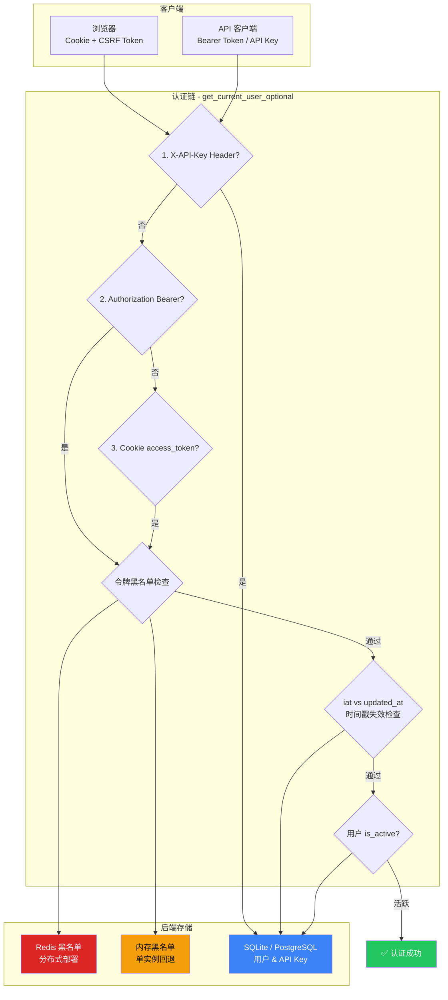
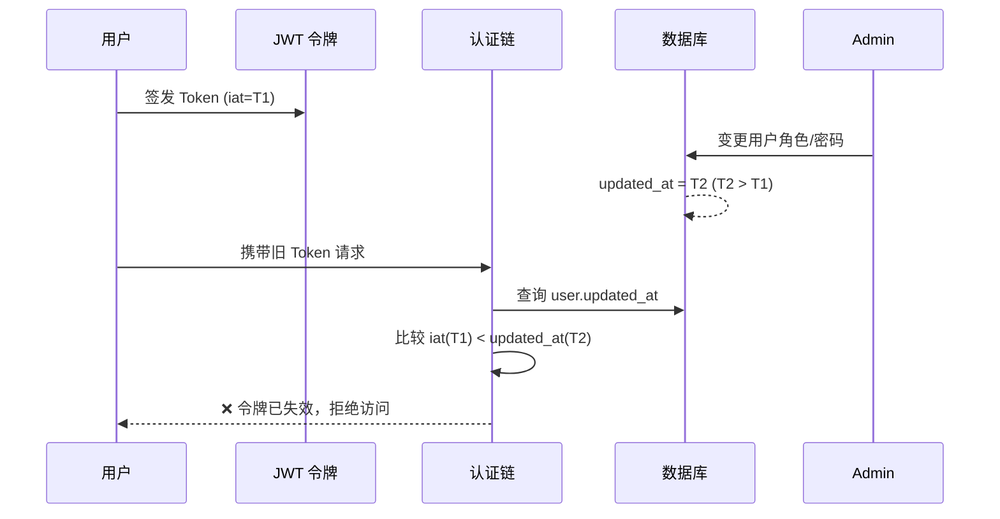
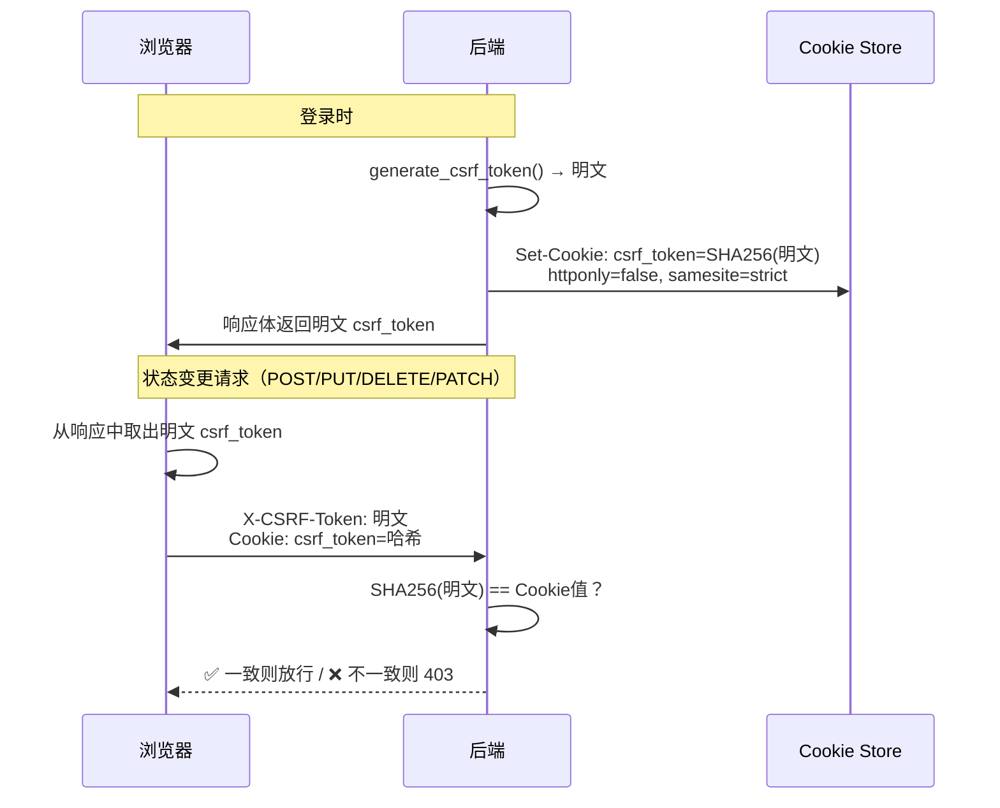
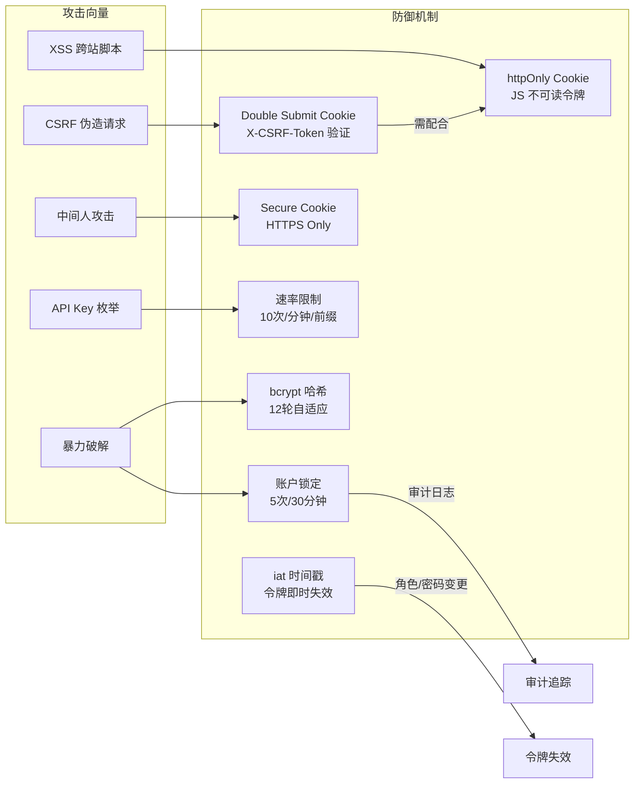

SOC Copilot 的认证体系是一个**多通道、多层次**的安全架构，涵盖 JWT 双令牌机制（Access + Refresh）、httpOnly Cookie 存储、API Key 无状态认证、CSRF 双提交令牌防护以及基于 bcrypt 的密码策略与账户锁定机制。该系统在设计上同时兼顾了**浏览器端安全性**（Cookie + CSRF）和**API 客户端便捷性**（Bearer Token + API Key），并通过 `iat` 时间戳比对和令牌黑名单实现了**双路径令牌失效**，确保用户角色变更、密码修改或账户停用时旧令牌立即失效。

Sources: [security.py](backend/core/security.py#L1-L196), [cookie_auth.py](backend/core/cookie_auth.py#L1-L80), [csrf.py](backend/core/csrf.py#L1-L124)

## 认证架构全景



**认证优先级**为 API Key → Bearer Token → Cookie，在 [get_current_user_optional](backend/dependencies/auth.py#L252-L298) 中以瀑布式依次尝试。每条路径均通过独立的验证逻辑，但共享最终的用户状态检查（`is_active`、时间戳失效）。

Sources: [auth.py](backend/dependencies/auth.py#L252-L298), [auth.py](backend/routers/auth.py#L85-L267)

## JWT 双令牌机制

### 令牌结构与生成

系统采用 **HS256** 算法签发 JWT，令牌载荷包含以下标准化声明：

| 字段 | 类型 | 说明 |
|------|------|------|
| `sub` | string | 用户唯一标识（UUID） |
| `role` | string | 用户角色（admin / analyst / auditor） |
| `iat` | datetime | 令牌签发时间，用于**时间戳失效检测** |
| `exp` | datetime | 令牌过期时间 |
| `type` | string | 令牌类型：`access` 或 `refresh` |

双令牌的过期时间通过配置项控制：

| 令牌类型 | 配置键 | 默认值 | 用途 |
|----------|--------|--------|------|
| Access Token | `jwt_expire_minutes` | 720 分钟（12 小时） | 日常 API 访问 |
| Refresh Token | `jwt_refresh_expire_minutes` | 10080 分钟（7 天） | 无感续签 Access Token |

`create_access_token` 在签发时将 `iat` 纳入载荷，这不是 JWT 标准的默认行为——它是一个**刻意设计的安全声明**：当用户的角色、密码等关键字段发生变更时，系统会更新 `user.updated_at` 时间戳，认证链通过比较 `token.iat < user.updated_at` 来判断令牌是否在变更前签发，从而在不依赖黑名单的情况下实现即时失效。

Sources: [security.py](backend/core/security.py#L45-L96), [config.py](backend/core/config.py#L50-L54)

### 双路径令牌失效机制

系统实现了两条互补的令牌失效路径：

**路径一：iat 时间戳比对（零存储开销）**



`is_token_invalidated_by_user_update` 函数在解析 `iat` 和 `updated_at` 时，同时处理 float 时间戳、ISO 字符串和 datetime 对象三种输入格式，并对解析失败采取**容许放行**策略（避免因时间格式异常导致合法用户被锁定）。无 `iat` 声明的旧版令牌在有 `updated_at` 的场景下被直接拒绝。

Sources: [security.py](backend/core/security.py#L98-L161)

**路径二：令牌黑名单（显式吊销）**

`TokenBlacklist` 模块采用**后端抽象模式**，定义了 `TokenBlacklistBackend` 接口并提供两种实现：

| 后端 | 适用场景 | 数据结构 | 并发安全 |
|------|----------|----------|----------|
| `InMemoryBackend` | 单实例开发/部署 | `dict[str, datetime]` | `asyncio.Lock` |
| `RedisBackend` | 分布式生产部署 | Redis String + TTL | 原子 pipeline |

在 `RedisBackend` 中，令牌先经过 `SHA-256` 截断（前 32 字符）后作为存储键，避免原始令牌泄露。TTL 自动从令牌的 `exp` 声明中计算，最小保留 60 秒。Redis 不可用时自动回退到内存后端，确保认证服务不因外部依赖中断。

Sources: [token_blacklist.py](backend/core/token_blacklist.py#L35-L296)

### 令牌生命周期管理

登录端点 `POST /api/auth/login` 是整个令牌生命周期的起点，其流程如下：

1. **用户查找与验证**：通过 `UserRepository` 查找用户，验证密码
2. **账户锁定检查**：若 `locked_until > now`，返回 `423 LOCKED`
3. **令牌签发**：创建 access token 和 refresh token，载荷包含 `sub`（用户 ID）和 `role`
4. **Cookie 设置**：通过 `set_auth_cookies` 将令牌写入 httpOnly Cookie
5. **CSRF Token 生成**：生成 CSRF 令牌并设置到非 httpOnly 的 Cookie 中
6. **响应返回**：令牌同时存在于响应体中（兼容 Bearer Token 模式）

刷新端点 `POST /api/auth/refresh` 验证 refresh token 的 `type` 声明后重新签发双令牌，实现**无感续签**。注销端点 `POST /api/auth/logout` 清除 Cookie 并可选择性将令牌加入黑名单。

Sources: [auth.py](backend/routers/auth.py#L85-L357), [cookie_auth.py](backend/core/cookie_auth.py#L25-L65)

## Cookie 认证与 XSS 防护

系统采用 **httpOnly Cookie** 作为浏览器端令牌的首选传输通道，与 Bearer Token 并行提供：

| Cookie 配置项 | 值 | 安全意义 |
|---------------|----|----------|
| `httponly` | `True` | JavaScript 无法读取，防御 XSS 窃取令牌 |
| `secure` | 生产环境 `True` | 仅 HTTPS 传输，防止中间人攻击 |
| `samesite` | `"lax"` | 允许外部导航携带，防御 CSRF（配合独立 CSRF 机制） |
| `max_age` (access) | `jwt_expire_minutes * 60` | 与令牌过期时间同步 |
| `max_age` (refresh) | `jwt_refresh_expire_minutes * 60` | 7 天有效期 |

认证链在 [get_current_user_optional](backend/dependencies/auth.py#L252-L298) 中通过 `get_token_from_cookie` 从原始 `Cookie` 头解析令牌，其实现按 `;` 分割后逐个匹配键名，确保在 Cookie 数量较多时仍能准确定位目标令牌。

Sources: [cookie_auth.py](backend/core/cookie_auth.py#L1-L80), [auth.py](backend/dependencies/auth.py#L252-L298)

## API Key 无状态认证

### 密钥格式与哈希策略

API Key 采用 `sk_` 前缀 + 32 字节 URL-safe 随机字符串的格式（共约 48 字符），由 `secrets.token_urlsafe(32)` 生成。存储时仅保留**前 8 字符前缀**（`key_prefix`）用于快速数据库查找，完整密钥经过**双版本哈希**处理后存储：

| 版本 | 算法 | 存储格式 | 特点 |
|------|------|----------|------|
| v1（遗留） | SHA-256 | 原始十六进制摘要 | 快速但无盐 |
| v2（当前） | bcrypt | `v2:{bcrypt_hash}` | 自适应加盐，与密码哈希共用 CryptContext |

`verify_api_key` 函数通过检测 `v2:` 前缀自动选择验证路径，实现**向后兼容**——旧版密钥无需迁移即可继续使用，新版密钥始终采用 bcrypt 哈希。

Sources: [security.py](backend/core/security.py#L163-L196), [api_key.py](backend/models/api_key.py#L1-L48)

### 认证流程与安全防护

API Key 认证的完整流程在 [get_user_by_api_key](backend/dependencies/auth.py#L52-L98) 中实现，分为三个阶段：

1. **前缀查找**：以密钥前 8 字符为条件联合查询 `api_keys` 和 `users` 表，过滤 `is_active = True`
2. **哈希验证**：对匹配的候选密钥逐一执行 `verify_api_key`（bcrypt 验证约 100-250ms/次）
3. **速率限制**：在验证之前通过 `check_api_key_rate_limit` 执行频率检查（默认 10 次/分钟/前缀），防止枚举攻击

速率限制器 `AsyncRateLimiter` 同样采用 Redis 优先 + 内存回退的双后端模式，通过 pipeline 原子操作实现 `INCR` + `EXPIRE`，并在响应头中返回 `X-RateLimit-Limit`、`X-RateLimit-Remaining`、`X-RateLimit-Reset` 等标准限流信息。

API Key 管理端点（`/api/api-keys`）的所有写操作（创建、更新、删除）均验证**密钥所有权**——用户只能管理自己的密钥，`/admin/all` 端点仅限 admin 角色。密钥创建时明文仅返回一次（`APIKeyCreateResponse.key`），之后数据库中仅存储哈希和前缀。

Sources: [auth.py](backend/dependencies/auth.py#L52-L98), [rate_limiter.py](backend/middleware/rate_limiter.py#L332-L365), [api_keys.py](backend/routers/api_keys.py#L61-L111)

## CSRF 双提交令牌防护

### 防护模型

系统采用 **Double Submit Cookie** 模式防御 CSRF 攻击，核心思路是：服务器生成随机令牌，将其哈希值写入 Cookie，同时将原始值返回给前端；前端在每次状态变更请求中通过 `X-CSRF-Token` 头提交原始值，服务器验证头部值与 Cookie 哈希的一致性。



CSRF 令牌通过 `secrets.token_urlsafe(32)` 生成（256 位熵），经 `SHA-256` 哈希后存入 Cookie（`httponly=False`，JavaScript 可读），比对时使用 `secrets.compare_digest` 防止时序攻击。Cookie 设置 `SameSite=Strict`、1 小时过期、生产环境强制 `Secure`。

Sources: [csrf.py](backend/core/csrf.py#L1-L124)

### 中间件层强制执行

CSRF 防护通过两层机制强制执行：

**层一：CSRFMiddleware（中间件级）**

`CSRFMiddleware` 作为 Starlette 中间件挂载在应用层，拦截所有非安全方法（POST、PUT、DELETE、PATCH）的请求。其豁免规则包括：

| 豁免条件 | 原因 |
|----------|------|
| GET / HEAD / OPTIONS / TRACE | 幂等安全方法 |
| `/api/auth/login`、`/api/auth/refresh` | 认证前置端点，尚无 CSRF 令牌 |
| `/api/health`、`/docs`、`/openapi.json` | 无状态公共端点 |
| `/api/webhooks/*` | Webhook 有独立的签名验证机制 |
| `X-API-Key` 头 | API Key 不依赖 Cookie，天然免疫 CSRF |
| `Authorization: Bearer` 头 | Bearer Token 不依赖 Cookie，天然免疫 CSRF |

最后两条规则是关键设计决策：CSRF 攻击的必要前提是浏览器自动携带 Cookie。当请求使用 API Key 或 Bearer Token 认证时，攻击者无法通过跨站请求伪造来附加这些头部，因此 CSRF 检查被合理跳过。

Sources: [csrf_middleware.py](backend/middleware/csrf_middleware.py#L1-L136)

**层二：validate_csrf（函数级）**

`validate_csrf` 函数作为 FastAPI 依赖项提供更细粒度的控制，支持自定义豁免路径集合。该函数同样执行双提交验证逻辑，可用于需要精确控制 CSRF 策略的特定端点。

Sources: [csrf.py](backend/core/csrf.py#L47-L90)

## 密码安全策略

### bcrypt 自适应哈希

密码哈希通过 `passlib.CryptContext` 统一管理，采用 bcrypt 算法并根据环境调整工作因子：

| 环境 | bcrypt rounds | 预估耗时 | 配置位置 |
|------|---------------|----------|----------|
| development | 10 | ~100ms | `bcrypt__rounds=10` |
| production | 12 | ~250ms | `bcrypt__rounds=12` |

工作因子的选择平衡了**安全性与可用性**——生产环境采用 12 轮以抵御暴力破解，开发环境采用 10 轮以加速测试迭代。`CryptContext` 的 `deprecated="auto"` 配置确保哈希算法升级时自动重新哈希。

Sources: [security.py](backend/core/security.py#L15-L21)

### 密码强度验证

`validate_password_strength` 函数执行六层强度检查：

| 检查层 | 规则 | 失败时行为 |
|--------|------|------------|
| 长度下限 | ≥ 8 字符 | 拒绝 |
| 长度上限 | ≤ 128 字符（防 DoS） | 拒绝 |
| 弱密码字典 | 比对 56 个常见密码（如 `password`、`admin123`、`changeme`） | 拒绝 |
| 弱模式匹配 | 11 种正则模式（纯数字、纯字母、重复字符等） | 拒绝 |
| 用户名包含 | 密码不得包含用户名 | 拒绝 |
| 字符多样性 | 至少包含 4 类中的 3 类：小写、大写、数字、特殊字符 | 拒绝 |

此外，`get_password_strength_score` 函数提供 0-100 分的量化评分，综合长度、字符多样性、熵值和弱模式惩罚，分为 Very Strong（≥80）、Strong（≥60）、Moderate（≥40）、Weak（≥20）、Very Weak（<20）五个等级。

Sources: [security_validators.py](backend/core/security_validators.py#L1-L320)

### 账户锁定机制

登录端点实现了**渐进式账户锁定**策略：

- **阈值**：连续 5 次密码验证失败后触发锁定（`MAX_LOGIN_ATTEMPTS = 5`）
- **锁定时长**：30 分钟（`LOCKOUT_DURATION_MINUTES = 30`）
- **自动解锁**：锁定过期后，下次登录自动清除 `failed_login_attempts` 和 `locked_until`
- **手动解锁**：管理员可通过 `POST /api/auth/unlock-user/{username}` 强制解锁
- **成功重置**：登录成功后立即重置失败计数和锁定状态

所有登录事件（成功、失败、账户锁定）均通过 `AuditRepository` 记录审计日志，包含用户 ID、失败原因、尝试次数等详细信息。

Sources: [auth.py](backend/routers/auth.py#L33-L267)

### 密码变更策略

用户通过 `POST /api/auth/change-password` 自助修改密码时，系统执行三重验证：

1. **当前密码验证**：确认操作者身份
2. **新密码一致性**：`new_password` 必须等于 `confirm_password`
3. **新旧密码不同**：新密码不得与当前密码相同

密码更新通过 `UserRepository.update_password` 执行，同时设置 `must_change_password = False`、记录 `password_changed_at` 时间戳。该时间戳与 `user.updated_at` 的变更共同触发令牌的 `iat` 失效机制，确保密码修改后所有已签发令牌立即失效。

Sources: [auth.py](backend/routers/auth.py#L380-L410), [user_repository.py](backend/repositories/user_repository.py#L125-L135)

## 生产环境安全检查

### 配置验证矩阵

系统在启动时通过 Pydantic `field_validator` 和 `run_production_security_checks` 执行一系列安全配置检查：

| 检查项 | 生产环境要求 | 严格模式行为 | 开发环境回退 |
|--------|-------------|-------------|-------------|
| `jwt_secret` | ≥ 32 字符 | 启动失败 | 自动生成随机密钥 |
| `bootstrap_admin_password` | ≥ 12 字符 | 启动失败 | 自动生成 16 字符随机密码（仅输出到 stderr） |
| `secret_encryption_key` | 合法 Fernet 密钥 | 启动失败 | 自动生成 Fernet 密钥 |
| `cors_origins` | 非空 | 警告 | 默认 `["*"]` |
| JWT Secret 熵 | ≥ 16 种唯一字符 | 启动失败 | 警告 |

开发环境的自动生成策略仅输出到 `sys.stderr`（控制台），**不写入日志文件**，防止密码泄露到持久化日志中。严格模式通过 `strict_production_checks = True` 启用，此时任何默认或弱配置将直接导致启动失败。

Sources: [config.py](backend/core/config.py#L122-L280), [security_validators.py](backend/core/security_validators.py#L80-L254)

### 用户模型安全字段

`UserModel` 在标准的身份字段之外，维护了一组安全专用字段：

```
UserModel
├── password_changed_at    # 最近密码修改时间
├── must_change_password   # 强制首次登录修改密码
├── failed_login_attempts  # 连续失败次数
├── locked_until           # 账户锁定截止时间（ISO 字符串）
└── password_history       # 历史密码哈希列表（JSON 数组）
```

其中 `password_history` 字段预留了历史密码比对能力，`updated_at` 字段在每次角色变更、账户停用或密码修改时由 `UserRepository` 自动更新，驱动 `iat` 时间戳失效检测。

Sources: [user.py](backend/models/user.py#L1-L57), [user_repository.py](backend/repositories/user_repository.py#L94-L146)

## 前端认证状态管理

前端通过 Zustand `authStore` 管理认证状态，使用 `persist` 中间件将令牌持久化到 `localStorage`。登录成功后，`access_token` 和 `refresh_token` 同时存储在 localStorage 和 httpOnly Cookie 中，前端通过 `Authorization: Bearer` 头提交令牌。

`fetchUser` 在应用启动时调用 `GET /api/auth/me` 恢复用户状态，若返回 401 则自动触发 `refreshToken`；刷新失败则执行完整注销流程。`must_change_password` 标志触发后自动重定向到密码修改页面。

Sources: [authStore.ts](frontend/stores/authStore.ts#L1-L225)

## 安全机制协同关系



上述防御矩阵展示了各安全机制如何**交叉覆盖**不同的攻击向量。值得注意的是，CSRF 防护与 httpOnly Cookie 并不是互斥的——CSRF 令牌的 Cookie 本身**不是** httpOnly（JavaScript 需要读取它用于设置请求头），而认证令牌的 Cookie 是 httpOnly（JavaScript 不应接触）。两种 Cookie 各司其职，共同构成完整的浏览器端安全防线。

Sources: [security.py](backend/core/security.py#L1-L196), [csrf.py](backend/core/csrf.py#L1-L124), [cookie_auth.py](backend/core/cookie_auth.py#L1-L80), [security_validators.py](backend/core/security_validators.py#L1-L320)

---

**相关阅读**：
- [RBAC 权限模型：角色、权限与资源级访问控制](16-rbac-quan-xian-mo-xing-jiao-se-quan-xian-yu-zi-yuan-ji-fang-wen-kong-zhi) — 了解认证通过后的权限分配机制
- [安全加固：敏感数据脱敏、密钥管理与 HTTP 沙箱](18-an-quan-jia-gu-min-gan-shu-ju-tuo-min-mi-yao-guan-li-yu-http-sha-xiang) — 认证之外的纵深防御层
- [中间件链：审计、幂等性、请求追踪与异常捕获](19-zhong-jian-jian-lian-shen-ji-mi-deng-xing-qing-qiu-zhui-zong-yu-yi-chang-bu-huo) — 认证在中间件链中的位置与协作
- [可观测性体系：Prometheus 指标、分布式追踪与结构化日志](20-ke-guan-ce-xing-ti-xi-prometheus-zhi-biao-fen-bu-shi-zhui-zong-yu-jie-gou-hua-ri-zhi) — 认证事件的监控与追踪