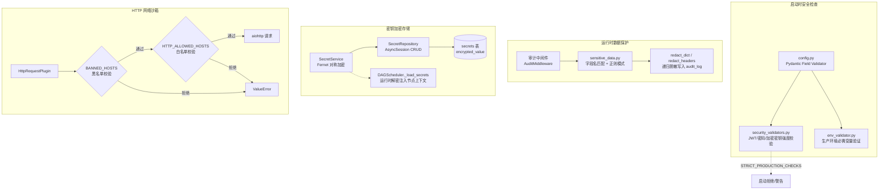
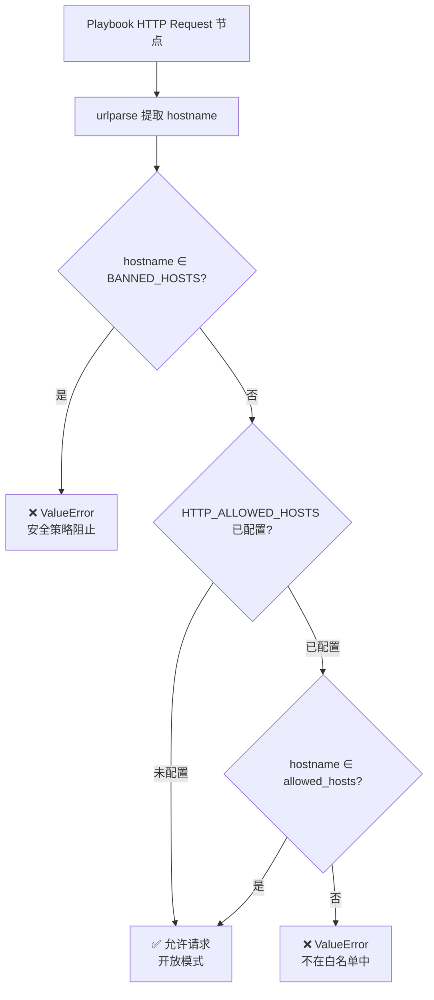

SOC Copilot 的安全加固体系围绕三条防御纵深线展开：**审计日志中的敏感数据自动脱敏**、**基于 Fernet 对称加密的密钥全生命周期管理**，以及 **Playbook HTTP 请求节点的域名白名单沙箱**。三者共同构成从数据出口（日志/响应）到数据入口（外部 HTTP 调用）的完整保护链，确保敏感凭证在任何环节不以明文形式泄露。上一页 [认证体系：JWT 令牌、API Key、CSRF 防护与密码策略](17-ren-zheng-ti-xi-jwt-ling-pai-api-key-csrf-fang-hu-yu-mi-ma-ce-lue) 介绍了认证层的防护机制，本页聚焦其下游的数据保护和网络隔离层。

## 架构总览

安全加固模块分布在四个核心层面：配置验证层（启动时拦截弱密钥）、数据脱敏层（审计中间件自动擦除敏感字段）、加密存储层（Fernet 加密数据库中的 Secret 值）和网络沙箱层（限制 Playbook HTTP 请求的目标主机）。



Sources: [config.py](backend/core/config.py#L9-L280), [security_validators.py](backend/core/security_validators.py#L1-L320), [sensitive_data.py](backend/core/sensitive_data.py#L1-L297), [secret_service.py](backend/services/security/secret_service.py#L1-L151), [builtin_http_request.py](backend/playbook_engine/v7_dag/plugins/builtin_http_request.py#L1-L149)

---

## 敏感数据脱敏体系

### 设计原理

`core/sensitive_data.py` 实现了一套**双层脱敏引擎**：第一层基于**字段名语义匹配**（不区分大小写、统一归一化连字符/下划线/空格），第二层基于**正则模式扫描**检测字符串中的结构化敏感数据（信用卡号、SSN、Bearer Token 等）。两层联合覆盖了 JSON body、URL Query 参数、Form Data、HTTP Header 四种数据载体。

### 敏感字段名字典

系统预定义了 `SENSITIVE_FIELD_NAMES` 集合，包含 35 个标准敏感字段名，分为五大类别：

| 类别 | 典型字段名 | 匹配规则 |
|------|-----------|---------|
| **认证凭证** | `password`, `token`, `api_key`, `secret_key`, `private_key` | 大小写不敏感，`-`/`_`/空格 归一化 |
| **个人身份信息 (PII)** | `ssn`, `credit_card`, `card_number`, `cvv` | 同上 |
| **会话与 Cookie** | `session_id`, `cookie`, `authorization`, `bearer` | 同上 |
| **数据库连接串** | `connection_string`, `db_password`, `database_password` | 同上 |
| **加密密钥** | `encryption_key`, `aes_key`, `rsa_key`, `decrypt_key` | 同上 |

字段名匹配的核心函数 `is_sensitive_field()` 先将输入归一化为纯小写+下划线格式，再查集合。这意味着 `X-Api-Secret`、`api.secret`、`API_SECRET` 都会被正确命中。

Sources: [sensitive_data.py](backend/core/sensitive_data.py#L7-L109)

### 正则模式引擎

当字段名不在字典中时，系统对**值本身**进行正则扫描。`SENSITIVE_PATTERNS` 定义了五个核心模式：

| 模式 | 检测目标 | 替换行为 |
|------|---------|---------|
| `\b\d{4}[-\s]?\d{4}[-\s]?\d{4}[-\s]?\d{4}\b` | 信用卡号 | `****-****-****-****` |
| `\b\d{3}[-\s]?\d{2}[-\s]?\d{4}\b` | SSN | `***-**-****` |
| `\b([a-zA-Z0-9_.+-]+)@([a-zA-Z0-9-]+\.[a-zA-Z0-9-.]+)\b` | 邮箱地址 | `***@domain.com`（保留域名） |
| `Bearer\s+[A-Za-z0-9-._~+/]+=*` | Bearer Token | `Bearer ***` |
| `\b[A-Za-z0-9]{32,}\b` | 长 API Key | `***REDACTED***` |

该引擎通过 `redact_value()` 统一调度：先尝试正则模式匹配，未命中则截断至 `max_length`（默认 100 字符）。

Sources: [sensitive_data.py](backend/core/sensitive_data.py#L52-L94)

### 递归脱敏函数族

脱敏操作通过三个递归函数协作处理任意嵌套结构：

- **`redact_dict(data, depth=0, max_depth=5)`**：递归遍历字典，敏感键直接替换为 `***REDACTED***`，嵌套字典递归处理，其他值调用 `redact_value()`。递归深度超过 5 层时返回 `{_truncated: "max depth exceeded"}`。
- **`redact_list(data, depth=0, max_depth=5)`**：递归处理列表，限制最多处理 50 个元素，超出部分以 `[N more items truncated]` 标注。
- **`redact_json_string(json_str, max_length=10000)`**：先解析 JSON，再按类型分发至 `redact_dict` 或 `redact_list`，最终返回脱敏后的 JSON 字符串。

针对不同请求载体，`redact_request_body()` 实现了多格式分发策略：JSON body 走 `redact_json_string()`，Form Data 走逐字段 `is_sensitive_field()` 检测，二进制数据直接返回 `[binary data]`，超大 body（>100KB）跳过处理。

Sources: [sensitive_data.py](backend/core/sensitive_data.py#L111-L297)

### 审计中间件集成

`AuditMiddleware` 是脱敏引擎的核心消费者。它在请求处理管道中完成三处脱敏：

1. **Query 参数脱敏**：`_sanitize_params()` 调用 `redact_dict(params)` 清理 URL 参数。
2. **请求体脱敏**：`_capture_request_body()` 调用 `redact_request_body(body, content_type)`，对 `/api/auth/login`、`/api/secrets` 等敏感路径完全跳过 body 捕获。
3. **响应头脱敏**：`redact_headers(response_headers)` 清理 `Authorization`、`Set-Cookie` 等敏感响应头。

关键设计决策：**审计日志失败不应阻塞请求**。`_log_audit()` 被 try/except 包裹，确保写入异常仅产生日志警告，不影响正常业务流程。

Sources: [audit_middleware.py](backend/middleware/audit_middleware.py#L1-L270)

---

## 密钥全生命周期管理

### Fernet 加密服务

`SecretService` 基于 Python `cryptography` 库的 **Fernet 对称加密方案**，提供确定论的加解密能力。Fernet 使用 AES-128-CBC 加密 + HMAC-SHA256 认证，保证密文的**机密性**和**完整性**。

服务以**单例模式**运行，初始化时从 `settings.secret_encryption_key` 读取 Fernet Key 并构造 `Fernet` 实例。Key 格式必须为 32 字节 URL-safe Base64 编码字符串，生成命令为：

```bash
python -c "from cryptography.fernet import Fernet; print(Fernet.generate_key().decode())"
```

Sources: [secret_service.py](backend/services/security/secret_service.py#L1-L151)

### 数据模型与仓储层

`SecretModel` 定义了 `secrets` 表的五个字段：

| 字段 | 类型 | 说明 |
|------|------|------|
| `id` | `String(36)` | UUID 主键 |
| `name` | `String(100)` | 唯一索引，密钥逻辑标识 |
| `encrypted_value` | `Text` | Fernet 加密后的密文 |
| `created_by_user_id` | `String(36)` | 创建者外键（`users.id`，ON DELETE SET NULL） |
| `created_at` / `updated_at` | `DateTime(timezone=True)` | 自动时间戳 |

`SecretRepository` 封装了标准 CRUD 操作，并提供两个特殊聚合方法：`get_secret_names()` 返回所有密钥名称列表，`get_secrets_dict()` 返回 `name → encrypted_value` 映射字典供批量解密使用。

Sources: [secret.py](backend/models/secret.py#L1-L36), [secret_repository.py](backend/repositories/secret_repository.py#L1-L176)

### Secrets API 端点

`/api/secrets` 路由提供完整的 CRUD 操作，所有端点**限 Admin 角色**访问：

| 方法 | 路径 | 功能 | 安全特性 |
|------|------|------|---------|
| `POST` | `/api/secrets` | 创建密钥 | 加密后存储，返回遮蔽预览 |
| `GET` | `/api/secrets` | 列表查询 | **永不返回实际值**，`value_preview` 固定为 `****` |
| `GET` | `/api/secrets/key-status` | 加密密钥状态 | 显示是否配置/有效 |
| `GET` | `/api/secrets/{name}` | 单条查询 | 解密后遮蔽显示（前4位+星号） |
| `PATCH` | `/api/secrets/{name}` | 更新值 | 审计日志记录变更 |
| `DELETE` | `/api/secrets/{name}` | 删除 | 警告关联 Playbook 将失败 |

`mask_secret_value(value, visible_chars=4)` 函数实现预览遮蔽：`abcd` → `abcd****************`，短于 4 字符的值完全用星号替代。

Sources: [secrets.py](backend/routers/secrets.py#L1-L285)

### Playbook 运行时密钥注入

`DAGScheduler._load_secrets()` 在 Playbook 执行期间按需加载密钥，注入到节点上下文中供 `{{secret.xxx}}` 模板引用：

1. 从 `SecretRepository` 批量加载所有密钥记录（限 500 条）
2. 逐条调用 `SecretService.decrypt()` 解密，失败时 `warning` 级别日志跳过（不中断执行）
3. 结果缓存到 `_secrets_cache`，避免重复数据库查询

**安全边界**：若 `SECRET_ENCRYPTION_KEY` 未配置，`get_secret_service()` 抛出 `ValueError`，调度器在 `except ValueError` 分支静默降级为空字典，确保 Playbook 仍可运行无密钥依赖的节点。

Sources: [playbook_dag_scheduler.py](backend/services/playbook/playbook_dag_scheduler.py#L97-L121)

---

## HTTP 沙箱：域名黑白名单机制

### 双层防护模型

`HttpRequestPlugin` 是 Playbook DAG 引擎的内置节点插件，为 Playbook 发出的 HTTP 请求实现了**黑名单 + 白名单**双层主机名校验：



### 黑名单（始终生效）

`BANNED_HOSTS` 集合硬编码了**绝对禁止访问**的内部地址，无论白名单配置如何：

| 主机名 | 阻止原因 |
|--------|---------|
| `localhost` | 本地回环 |
| `127.0.0.1` | IPv4 回环 |
| `0.0.0.0` | 所有接口绑定 |
| `::1` | IPv6 回环 |
| `169.254.169.254` | AWS 元数据服务（SSRF 防御） |
| `metadata.google.internal` | GCP 元数据服务（SSRF 防御） |

该黑名单的核心目标是防御 **SSRF（Server-Side Request Forgery）** 攻击：防止恶意 Playbook 通过 HTTP 请求探测云平台元数据接口获取临时凭证。

Sources: [builtin_http_request.py](backend/playbook_engine/v7_dag/plugins/builtin_http_request.py#L13-L21)

### 白名单（可选启用）

通过环境变量 `HTTP_ALLOWED_HOSTS` 配置逗号分隔的允许主机名列表。白名单机制的特点：

- **未配置时开放**：`HTTP_ALLOWED_HOSTS=""` 或未设置时，除黑名单外不做额外限制
- **配置后严格匹配**：请求的 hostname 必须精确匹配列表中的某一项
- **空值清理**：自动过滤分割后的空字符串（如尾部逗号产生的空项）

配置示例：
```bash
# .env
HTTP_ALLOWED_HOSTS=api.example.com,webhook.slack.com,otx.alienvault.com
```

Sources: [builtin_http_request.py](backend/playbook_engine/v7_dag/plugins/builtin_http_request.py#L88-L105), [config.py](backend/core/config.py#L68)

### HTTP 客户端管理器

`HTTPClientManager` 是全局单例连接池管理器，基于 `httpx.AsyncClient` 提供连接复用：

| 参数 | 值 | 说明 |
|------|---|------|
| `connect` timeout | 10s | 连接建立超时 |
| `read` timeout | 90s | 等待响应超时（适配 AI 分析场景） |
| `write` timeout | 30s | 请求体发送超时 |
| `max_connections` | 100 | 总最大连接数 |
| `max_keepalive_connections` | 20 | Keep-alive 连接上限 |
| `keepalive_expiry` | 30s | Keep-alive 过期时间 |
| `follow_redirects` | `True` | 自动跟随重定向 |

**注意**：`HttpRequestPlugin` 使用独立的 `aiohttp.ClientSession`（非共享连接池），每次请求创建新会话，确保沙箱隔离不受全局连接池配置影响。

Sources: [http_client.py](backend/core/http_client.py#L1-L67), [builtin_http_request.py](backend/playbook_engine/v7_dag/plugins/builtin_http_request.py#L110-L143)

---

## 启动时安全校验体系

### Pydantic Field Validator 链

`Settings` 类通过三个 `@field_validator` 在配置加载阶段自动校验安全参数，形成**启动即拦截**的防御层：

| 校验器 | 校验目标 | 生产环境行为 | 开发环境行为 |
|--------|---------|------------|------------|
| `validate_jwt_secret` | JWT 签名密钥 | 必须 ≥32 字符，否则严格模式拒绝启动 | 未设置时自动生成 `token_urlsafe(32)` |
| `validate_admin_password` | 引导管理员密码 | 必须 ≥12 字符，严格模式拒绝弱密码 | 未设置时自动生成 16 位随机密码（仅输出到 stderr） |
| `validate_secret_encryption_key` | Fernet 加密密钥 | 必须为合法 Fernet Key 格式 | 未设置时自动调用 `Fernet.generate_key()` |

开发环境自动生成的密码**仅输出到 `sys.stderr`**（控制台），不写入日志文件，防止凭证通过日志系统泄露。

Sources: [config.py](backend/core/config.py#L122-L280)

### 生产环境综合安全检查

`run_production_security_checks()` 在应用启动时集中执行五项检查，由 `STRICT_PRODUCTION_CHECKS` 环境变量控制行为模式：

| 检查项 | 严格模式 | 宽松模式 |
|--------|---------|---------|
| JWT Secret 强度 | 拒绝启动 | 日志 WARNING |
| Bootstrap 密码强度 | 拒绝启动 | 日志 WARNING |
| CORS 来源配置 | 拒绝启动 | 日志 WARNING |
| SECRET_ENCRYPTION_KEY 配置 | 拒绝启动 | 日志 WARNING |
| CORS 通配符 `*` | 拒绝启动 | 不检查 |

启动流程中，`main.py` 的 `lifespan()` 函数按序调用：`run_production_security_checks()` → `validate_security_env()` → `validate_cors_origins()`，层层递进确保无遗漏。

Sources: [security_validators.py](backend/core/security_validators.py#L221-L254), [main.py](backend/main.py#L253-L273)

### 密码强度评分系统

`get_password_strength_score()` 为密码计算 0-100 分的综合强度评分，评分维度包括：

| 维度 | 加分条件 | 分值 |
|------|---------|------|
| 长度 | ≥8 / ≥12 / ≥16 / ≥20 字符 | 各 +10 |
| 字符多样性 | 小写 / 大写 / 数字 | 各 +10 |
| 特殊字符 | 包含 `!@#$%^&*()_+-=[]{}|;:,.<>?` | +15 |
| 熵值 | 唯一字符 ≥8 / ≥12 / ≥16 | 各 +5 |
| 弱口令命中 | 在 `WEAK_PASSWORDS` 字典中 | -50 |
| 弱模式命中 | 匹配 `WEAK_PATTERNS`（纯字母、纯数字等） | -20 |

评分结果映射为五级标签：**Very Strong** (≥80)、**Strong** (≥60)、**Moderate** (≥40)、**Weak** (≥20)、**Very Weak** (<20)。

Sources: [security_validators.py](backend/core/security_validators.py#L257-L319)

---

## 输入验证与注入防御

### SQL 注入检测

`validate_sql_input()` 实现了**精确模式匹配**而非简单关键字过滤，覆盖 17 类 SQL 注入攻击向量：

- **经典注入**：`' OR '1'='1`、`'; DROP TABLE`、`UNION SELECT`
- **盲注**：`WAITFOR DELAY`、`BENCHMARK()`、`SLEEP()`
- **编码绕过**：`0x...||`、`CHAR()` 编码
- **信息泄露**：`@@version`、`information_schema`、`sys.objects`
- **命令执行**：`xp_cmdshell`、`sp_oacreate`

v0.8.4 版本的关键改进是**移除了简单的关键字检测**（如仅匹配 `SELECT`、`DROP`），改为检测真正的注入模式结构，大幅降低了误判率。

Sources: [validators.py](backend/core/validators.py#L87-L162)

### XSS 与通用清理

`sanitize_string()` 提供 HTML 标签移除和危险事件处理器清理（`onerror=`、`onload=`、`<script>` 标签），并转义单引号防止 SQL 注入。`validate_username()` 限制为 `[a-zA-Z0-9_]`，`validate_email()` 使用标准 RFC 邮箱正则并归一化为小写。

Sources: [validators.py](backend/core/validators.py#L1-L85)

---

## 安全加固配置速查表

| 环境变量 | 用途 | 生产要求 | 生成命令 |
|---------|------|---------|---------|
| `JWT_SECRET` | JWT 签名密钥 | ≥32 字符 | `openssl rand -base64 64` |
| `BOOTSTRAP_ADMIN_PASSWORD` | 初始管理员密码 | ≥12 字符，满足强度要求 | 手动设置 |
| `SECRET_ENCRYPTION_KEY` | Fernet 对称加密密钥 | 合法 Fernet Key | `python -c "from cryptography.fernet import Fernet; print(Fernet.generate_key().decode())"` |
| `HTTP_ALLOWED_HOSTS` | Playbook HTTP 白名单 | 推荐配置 | 逗号分隔域名 |
| `CORS_ORIGINS` | CORS 允许来源 | 必须配置，禁止 `*` | 逗号分隔 URL |
| `DB_PASSWORD` | 数据库密码 | ≥16 字符 | `openssl rand -base64 32` |
| `REDIS_PASSWORD` | Redis 密码 | ≥16 字符 | `openssl rand -base64 32` |
| `STRICT_PRODUCTION_CHECKS` | 严格生产检查 | `true` | — |

Sources: [config.py](backend/core/config.py#L41-L68), [env_validator.py](backend/middleware/env_validator.py#L64-L126), [.env.example](backend/.env.example#L110-L156)

---

## 相关阅读

- **上游**：[认证体系：JWT 令牌、API Key、CSRF 防护与密码策略](17-ren-zheng-ti-xi-jwt-ling-pai-api-key-csrf-fang-hu-yu-mi-ma-ce-lue) — JWT 令牌签发与 CSRF 防护的详细机制
- **下游**：[中间件链：审计、幂等性、请求追踪与异常捕获](19-zhong-jian-jian-lian-shen-ji-mi-deng-xing-qing-qiu-zhui-zong-yu-yi-chang-bu-huo) — 脱敏引擎在中间件管道中的集成方式
- **关联**：[Playbook DAG 工作流引擎：节点插件、状态机与执行队列](10-playbook-dag-gong-zuo-liu-yin-qing-jie-dian-cha-jian-zhuang-tai-ji-yu-zhi-xing-dui-lie) — HTTP 沙箱插件在 DAG 节点体系中的位置