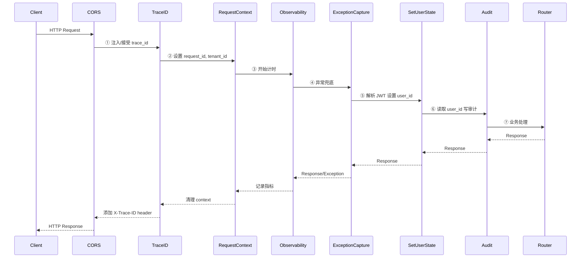
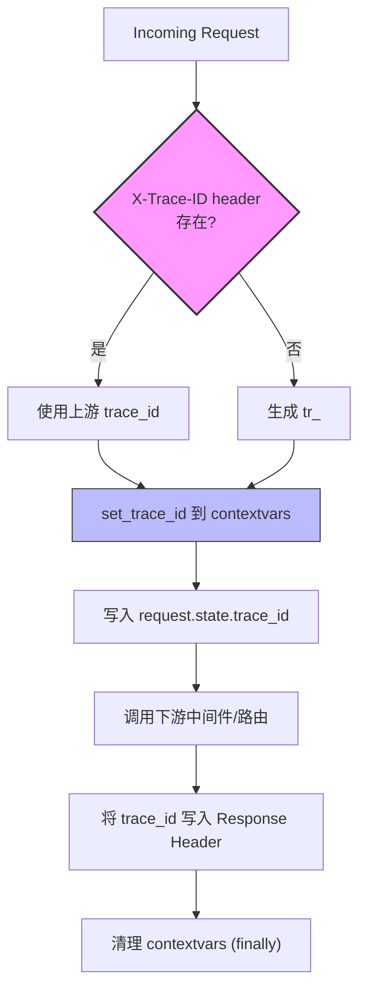
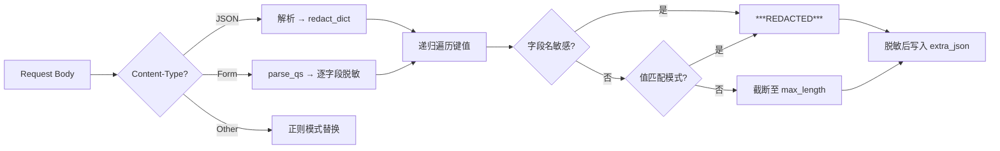
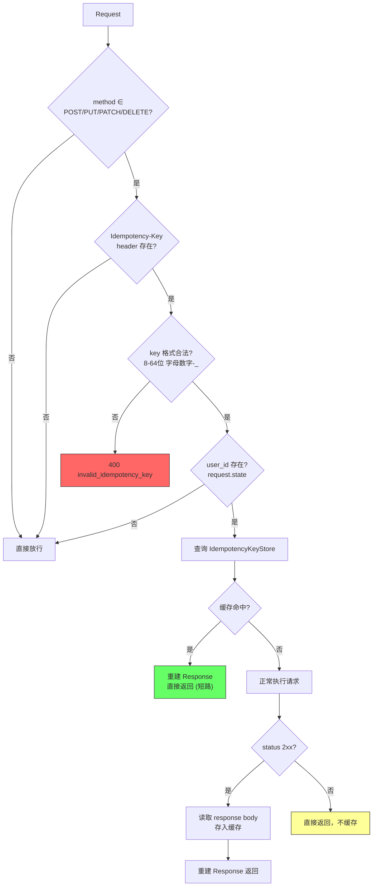
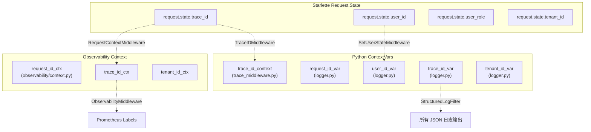

SOC Copilot 的中间件链是整个请求处理管线的核心基础设施，承担着**审计日志记录、幂等性保障、分布式请求追踪、统一异常捕获**四大横切关注点。每一个进入后端的 HTTP 请求都会按照固定顺序穿过这些中间件层，如同穿越一个精密的安全检查站——每一层只负责自己的职责，但所有层协同工作，确保请求的可追溯性、安全性和一致性。本文将深入剖析每个中间件的内部实现机制、它们之间的依赖关系，以及在生产环境中需要注意的调优策略。

Sources: [main.py](backend/main.py#L420-L437), [middleware/__init__.py](backend/middleware/__init__.py#L1-L57)

## 中间件注册顺序与请求流转

理解中间件链的首要原则是：**Starlette 的 `add_middleware` 采用栈式注册**——最后注册的中间件最先执行，最接近路由处理器；最先注册的中间件位于栈底，最先拦截原始请求。在 SOC Copilot 中，`main.py` 的注册顺序如下（从外层到内层）：



中间件的注册代码位于 `main.py`，关键顺序如下（注意：`app.add_middleware` 是**栈式**的，最后添加的最先执行请求，最先添加的最先拦截原始请求）：

| 注册顺序 | 中间件 | 层级 | 核心职责 |
|---------|--------|------|---------|
| 1 | PerformanceMiddleware | 外层（可选） | 慢请求检测、X-Response-Time |
| 2 | TraceIDMiddleware | 外层（必需） | 生成/传播 trace_id |
| 3 | TenantMiddleware | 外层 | 多租户隔离 |
| 4 | RequestContextMiddleware | 中层 | 设置日志与可观测上下文 |
| 5 | ObservabilityMiddleware | 中层 | Prometheus 指标采集 |
| 6 | ExceptionCaptureMiddleware | 中层 | 未处理异常指标记录 |
| 7 | SetUserStateMiddleware | 内层 | 解析 JWT 注入 user_id |
| 8 | AuditMiddleware | 内层 | 写入审计日志 |
| 9 | ResourceAuthorizationMiddleware | 内层 | 资源级权限校验 |

**关键依赖约束**：`TraceIDMiddleware` 必须在 `AuditMiddleware` 之前注册，因为审计日志需要从 `request.state.trace_id` 读取追踪 ID；`SetUserStateMiddleware` 必须在 `AuditMiddleware` 之前注册，因为审计日志需要从 `request.state.user_id` 读取用户身份。违反这些顺序约束会导致审计日志中的 trace_id 和 user_id 字段为空。

Sources: [main.py](backend/main.py#L413-L437), [middleware/__init__.py](backend/middleware/__init__.py#L1-L57)

## 请求追踪：TraceIDMiddleware

**TraceIDMiddleware** 是整条中间件链的信息骨架。它为每个请求生成唯一的 `trace_id`（格式 `tr_` + 24 位十六进制字符），并通过 Python 的 `contextvars` 机制将其注入到整个请求生命周期的任何位置可访问的上下文变量中。这使得下游的日志记录、审计中间件、异常处理器都能无参数传递地获取当前追踪 ID。



**分布式追踪支持**：如果上游服务在请求头中携带了 `X-Trace-ID`，TraceIDMiddleware 会直接使用该值而非重新生成。这意味着在微服务架构中，从前端网关到后端服务的整条调用链可以共享同一个 trace_id，实现跨服务的请求关联。当请求返回时，trace_id 被写入响应头 `X-Trace-ID`，客户端可以用它来追踪问题。

**日志集成**——`TraceIDFilter` 和 `setup_trace_logging()` 是追踪系统的另一半。`TraceIDFilter` 是一个 Python `logging.Filter`，它会自动将 `trace_id_context` 中的值注入到每条日志记录的 `trace_id` 属性中。`setup_trace_logging()` 在应用启动时将此过滤器注册到根 logger 和应用 logger 的所有 handler 上，确保所有日志输出都自动携带 trace_id。

**Contextvars 机制**是整个追踪系统的技术基础。`trace_id_context` 是一个 `contextvars.ContextVar` 实例，它保证了在 asyncio 并发环境下，每个协程只能看到自己请求的 trace_id，不会与其他请求交叉污染。请求结束后，`finally` 块将 context 重置为 `None`，防止上下文泄漏。

Sources: [trace_middleware.py](backend/middleware/trace_middleware.py#L1-L144)

## 审计中间件：AuditMiddleware

**AuditMiddleware** 是 SOC Copilot 安全合规体系的核心组件，它自动拦截所有 API 请求并将操作记录持久化到数据库。审计日志覆盖了请求方法、路径、状态码、用户身份、客户端 IP、User-Agent、响应耗时以及脱敏后的请求体/查询参数等完整信息。

**路径过滤策略**采用两级白名单机制：`EXCLUDED_PATHS` 定义了完全跳过审计的路径（如 `/api/health`、`/metrics`、`/docs` 等基础设施端点），而 `BODY_EXCLUDED_PATHS` 定义了不记录请求体但仍记录其余信息的路径（如 `/api/auth/login`、`/api/auth/change-password`、`/api/secrets` 等高敏感端点）。这种分层过滤确保了审计覆盖面和安全合规之间的平衡——既不会因为审计日志导致敏感信息泄漏，也不会遗漏关键操作记录。

**敏感数据脱敏**是审计中间件的安全基石。请求体在被记录之前会经过 `core/sensitive_data.py` 的多层脱敏处理：字段名匹配（如 `password`、`token`、`api_key` 等预定义的 49 个敏感字段名会被替换为 `***REDACTED***`）和模式匹配（如信用卡号 `****-****-****-****`、SSN `***-**-****`、Bearer Token `Bearer ***`、超长 API Key `***REDACTED***`）。脱敏引擎支持递归嵌套结构处理（最大深度 5 层）和多种内容类型（JSON、表单数据、纯文本模式替换）。



**非阻塞保证**是审计中间件的关键设计原则。在 `_log_audit` 方法中，审计写入操作被独立的 `try-except` 包裹——即使数据库写入失败、连接池耗尽或任何其他异常发生，原始请求也不会被阻塞。这一原则在两个层级生效：正常响应路径中的审计失败仅记录错误日志；异常路径中的审计失败同样不影响异常的重新抛出。审计日志与业务请求完全解耦，确保系统可用性始终优先于审计完整性。

**Action 推导逻辑**将 HTTP 方法与 URL 路径自动映射为语义化的审计动作：`GET /api/alerts` → `alerts:read`、`POST /api/users` → `users:create`、`DELETE /api/playbook/123` → `playbook:delete`。这种自动推导使得审计日志无需业务代码配合即可生成有意义的操作描述。

审计日志通过 `AuditRepository` 写入 `audit_logs` 数据库表，包含 `user_id`（外键关联 users 表，删除时置 NULL）、`action`、`method`、`path`、`status_code`（均建立索引以支持高效查询）、`ip_address`、`user_agent`、`duration_ms` 和 `extra_json`（JSON 类型存储灵活的扩展信息）。

Sources: [audit_middleware.py](backend/middleware/audit_middleware.py#L1-L270), [sensitive_data.py](backend/core/sensitive_data.py#L1-L297), [audit_log.py](backend/models/audit_log.py#L1-L46), [audit_repository.py](backend/repositories/audit_repository.py#L1-L196)

## 幂等性中间件：IdempotencyMiddleware

**IdempotencyMiddleware** 实现了基于 HTTP 头 `Idempotency-Key` 的请求去重机制，防止客户端因网络超时、重试或前端重复提交导致的重复操作。这是分布式系统中保障数据一致性的关键防线——特别是对于创建告警、触发 Playbook 执行等不可逆操作。

**执行流程**遵循经典的"检查-执行-存储"模式：中间件首先验证请求方法是否属于幂等操作集（`POST`、`PUT`、`PATCH`、`DELETE`），然后检查是否携带 `Idempotency-Key` 请求头。对于携带了幂等键的请求，中间件通过 `IdempotencyKeyStore` 查询是否已存在该键对应的响应——如果存在则直接返回缓存的响应（**短路请求**，根本不执行业务逻辑），如果不存在则正常执行请求，并在响应成功（2xx）时将响应存入缓存。



**Key 格式校验**要求幂等键长度为 8-64 个字符，仅允许字母、数字、连字符和下划线。过短的键会增加碰撞风险，过长的键浪费存储空间，格式限制则防止注入攻击。无效的 key 会直接返回 `400 invalid_idempotency_key` 错误，附带 trace_id 便于排查。

**存储后端双轨制**——`IdempotencyKeyStore` 同时支持 Redis 和内存存储。在分布式部署中，Redis 作为主存储确保跨实例的幂等性保证；在单实例开发环境中，自动降级为内存存储（`dict` + `asyncio.Lock`）。存储的键格式为 `idempotency:{user_id}:{key}`，将用户维度纳入键空间以防止不同用户之间的键碰撞。默认 TTL 为 24 小时（86400 秒），响应数据包含 `status_code`、`headers` 和 `body`，重建响应时过滤掉 `content-length` 和 `content-encoding` 等传输层头部。

**设计取舍**：中间件仅缓存 2xx 成功响应，4xx/5xx 响应不会被缓存——这确保了客户端可以在错误发生后修正参数重新提交。此外，非 JSON 响应（如文件下载）也不会被缓存，避免大体积二进制数据占用存储空间。

Sources: [idempotency_middleware.py](backend/middleware/idempotency_middleware.py#L1-L142), [token_blacklist.py](backend/core/token_blacklist.py#L343-L457)

## 异常捕获体系：双层防护

SOC Copilot 的异常处理采用**中间件 + FastAPI Exception Handler**双层架构，分别承担不同维度的异常拦截职责。`ExceptionCaptureMiddleware` 在中间件层面捕获所有穿透业务代码的未处理异常，确保 Prometheus 指标不遗漏任何异常事件；而 `setup_exception_handlers` 注册的五个异常处理器则在 FastAPI 框架层面将异常转换为统一的 JSON 响应格式。

### ExceptionCaptureMiddleware——指标层的异常兜底

`ExceptionCaptureMiddleware` 的实现极其精简（仅 29 行），但其位置至关重要：它位于 `SetUserStateMiddleware` 和 `AuditMiddleware` 之外、`ObservabilityMiddleware` 之内，这意味着即使审计中间件或用户状态解析抛出异常，它也能捕获并记录指标。捕获到异常后，它调用 `observe_exception()` 将异常类型和路径记录到 `soc_exceptions_total` Prometheus Counter，然后**重新抛出异常**，将处理权交给外层的异常处理器和 FastAPI 的默认错误处理。

Sources: [exception_middleware.py](backend/middleware/exception_middleware.py#L1-L29), [metrics.py](backend/observability/metrics.py#L76-L80)

### Exception Handlers——面向客户端的统一错误响应

`setup_exception_handlers()` 注册了五个异常处理器，按异常特异性从高到低排列，形成一条完整的异常转换链：

| 处理器 | 异常类型 | 典型场景 | HTTP 状态码 |
|--------|---------|---------|------------|
| `api_exception_handler` | `APIException` | 业务逻辑错误（带 ErrorCode 枚举） | 由子类决定 |
| `validation_exception_handler` | `RequestValidationError` | Pydantic 请求参数校验失败 | 422 |
| `http_exception_handler` | `HTTPException` | 401/403/404 等标准 HTTP 错误 | 由异常决定 |
| `sqlalchemy_exception_handler` | `SQLAlchemyError` | 数据库连接/查询/约束错误 | 500 |
| `generic_exception_handler` | `Exception` | 所有其他未处理异常 | 500 |

所有异常处理器共享统一的 `ErrorResponse` 响应格式：

```python
{
    "code": "VALIDATION_ERROR",       # 错误码（可程序化处理）
    "message": "Request validation failed",  # 人类可读消息
    "detail": [...],                   # 额外详情（可选）
    "trace_id": "tr_abc123...",         # 请求追踪 ID
    "timestamp": "2026-01-01T00:00:00Z", # UTC 时间戳
    "request_id": "req_abc..."          # 原始请求 ID（可选）
}
```

**`api_exception_handler`** 处理 SOC Copilot 自定义的 `APIException` 体系。`APIException` 基于 `ErrorCode` 枚举而非硬编码字符串，确保错误码在整个系统中具有唯一性和可追溯性。该体系提供了从 `BadRequestException`（400）到 `ServiceUnavailableException`（503）的完整 HTTP 状态码覆盖，以及 `unauthorized()`、`forbidden()`、`not_found()`、`invalid_input()` 等便捷工厂函数。处理时会根据状态码严重程度选择日志级别：5xx 用 `logger.error`，4xx 用 `logger.warning`。

**`validation_exception_handler`** 将 Pydantic 的 `RequestValidationError` 转换为前端友好的字段级错误列表。每个错误包含 `field`（点分隔的字段路径，如 `body.alerts.0.severity`）、`message`（错误描述）和 `type`（验证规则类型），前端可以据此高亮显示具体字段。

**敏感信息过滤**——`sanitize_error_detail()` 函数在错误响应返回前扫描所有错误详情字符串，如果包含 `password`、`secret`、`token`、`api_key` 等关键词，整个详情会被替换为 `"Sensitive information redacted"`。这防止了数据库约束错误（如 `"duplicate key value: api_key=sk-xxx"`）或内部异常消息中的敏感信息泄漏到客户端。

**数据库异常隔离**——`sqlalchemy_exception_handler` 是安全加固的关键一环。数据库异常可能包含表结构、列名、连接字符串等内部信息，因此处理器在日志中记录完整错误（含 traceback），但返回给客户端的始终是通用消息 `"A database error occurred. Please try again later."`，绝不暴露任何数据库细节。

Sources: [exception_handler.py](backend/middleware/exception_handler.py#L1-L316), [exceptions.py](backend/core/exceptions.py#L1-L215), [common.py](backend/schemas/common.py#L135-L172)

## 上下文传播机制

中间件链的协调运作依赖于三层上下文传播机制的协同，它们分别服务于不同的消费者：



**第一层：Starlette `request.state`**——这是中间件之间最直接的通信方式。`TraceIDMiddleware` 将 trace_id 写入 `request.state.trace_id`，`SetUserStateMiddleware` 将 user_id 和 user_role 写入 `request.state.user_id` 和 `request.state.user_role`，下游的 `AuditMiddleware` 和 `ResourceAuthorizationMiddleware` 直接读取这些值。这种方式的限制是只能在持有 `Request` 对象的代码中访问。

**第二层：Python `contextvars`**——`trace_id_context`（定义在 `trace_middleware.py`）和 `request_id_var`/`user_id_var`/`trace_id_var`/`tenant_id_var`（定义在 `core/logger.py`）提供了无需传递 Request 对象即可访问请求上下文的能力。`RequestContextMiddleware` 负责在请求开始时调用 `set_request_context()` 设置所有 ContextVar，在请求结束时调用 `clear_request_context()` 清理。这使得 `get_trace_id()` 可以在任何位置（包括深层的服务层、仓储层代码）被调用，而无需参数传递。

**第三层：Observability Context**——`observability/context.py` 定义了独立的 `request_id_ctx`、`trace_id_ctx`、`tenant_id_ctx` 三个 ContextVar，专门服务于 Prometheus 指标和分布式追踪的标签注入。`RequestContextMiddleware` 同时向日志 ContextVar 和 Observability Context 写入值，确保两个系统对同一请求的标识一致。

Sources: [trace_middleware.py](backend/middleware/trace_middleware.py#L23-L25), [logger.py](backend/core/logger.py#L29-L34), [context.py](backend/observability/context.py#L1-L36), [request_context_middleware.py](backend/middleware/request_context_middleware.py#L1-L55)

## 可观测性与性能监控

### ObservabilityMiddleware

**ObservabilityMiddleware** 是 Prometheus 指标采集的入口。它记录每个请求的方法、路径、状态码、租户 ID 和耗时，分别写入 `soc_api_requests_total`（Counter）和 `soc_api_request_duration_seconds`（Histogram，分桶为 0.01/0.05/0.1/0.2/0.5/1/2/5 秒）。即使请求抛出异常，`finally` 块也会确保指标被记录（异常时状态码记为 500）。指标数据同时写入 `REQUEST_DURATION_HISTOGRAM`，该 Histogram 拥有更细粒度的分桶（0.01 到 10 秒共 12 个桶），被 `PerformanceMiddleware` 共享使用。

Sources: [observability_middleware.py](backend/middleware/observability_middleware.py#L1-L36), [metrics.py](backend/observability/metrics.py#L14-L32)

### PerformanceMiddleware（可选）

**PerformanceMiddleware** 通过配置开关 `PERFORMANCE_MONITORING_ENABLED` 启用，提供慢请求检测和 `X-Response-Time` 响应头注入。当请求耗时超过 `SLOW_REQUEST_THRESHOLD`（默认 200ms）时，会输出包含请求方法、路径、耗时、客户端 IP 和用户 ID 的警告日志。路径归一化逻辑（`_normalize_path`）将 URL 中的 UUID 和数字 ID 替换为 `{uuid}` 和 `{id}` 占位符，防止 Prometheus 高基数标签爆炸。

Sources: [performance.py](backend/middleware/performance.py#L1-L198)

## 生产环境调优指南

| 配置项 | 环境变量 | 默认值 | 调优建议 |
|--------|---------|--------|---------|
| 慢请求阈值 | `SLOW_REQUEST_THRESHOLD` | 0.2s | 生产环境建议 1.0s，避免告警疲劳 |
| 性能监控开关 | `PERFORMANCE_MONITORING_ENABLED` | false | 生产环境建议开启，额外开销 < 1ms/req |
| 幂等键 TTL | 代码内常量 | 86400s (24h) | Webhook 高频场景可缩短至 3600s |
| 审计日志清理 | `AUDIT_LOG_CLEANUP_ENABLED` | false | 建议开启，保留 90 天 |
| 审计跳过路径 | `EXCLUDED_PATHS` | 见代码 | 按需添加高频只读端点 |
| 请求体最大捕获 | `MAX_BODY_SIZE` | 100KB | 超过此大小的 body 仅记录 `[body too large]` |

**关键注意事项**：审计中间件对每个写操作请求都会产生一次数据库写入（通过 `AsyncSessionLocal` 独立会话），在高并发场景下可能成为瓶颈。如果审计写入延迟上升，可以考虑将审计日志改为异步队列（如 Redis Stream）批量写入，但需要权衡数据丢失风险。幂等性中间件在 Redis 不可用时会自动降级为内存存储，单实例部署下行为正确，但多实例部署下会失去跨实例去重能力——因此生产环境强烈建议配置 `REDIS_URL`。

Sources: [audit_middleware.py](backend/middleware/audit_middleware.py#L43), [performance.py](backend/middleware/performance.py#L24), [token_blacklist.py](backend/core/token_blacklist.py#L371-L376), [main.py](backend/main.py#L226-L227)

## 延伸阅读

- 中间件链的追踪数据最终汇入可观测性体系，详见 [可观测性体系：Prometheus 指标、分布式追踪与结构化日志](20-ke-guan-ce-xing-ti-xi-prometheus-zhi-biao-fen-bu-shi-zhui-zong-yu-jie-gou-hua-ri-zhi)
- 审计中间件依赖的 `SetUserStateMiddleware` 的 JWT 解析逻辑属于认证体系，详见 [认证体系：JWT 令牌、API Key、CSRF 防护与密码策略](17-ren-zheng-ti-xi-jwt-ling-pai-api-key-csrf-fang-hu-yu-mi-ma-ce-lue)
- 异常处理体系中的 `APIException` 与 RBAC 权限模型的交互，详见 [RBAC 权限模型：角色、权限与资源级访问控制](16-rbac-quan-xian-mo-xing-jiao-se-quan-xian-yu-zi-yuan-ji-fang-wen-kong-zhi)
- 幂等性控制在 Playbook 执行队列中的应用，详见 [Playbook DAG 工作流引擎：节点插件、状态机与执行队列](10-playbook-dag-gong-zuo-liu-yin-qing-jie-dian-cha-jian-zhuang-tai-ji-yu-zhi-xing-dui-lie)