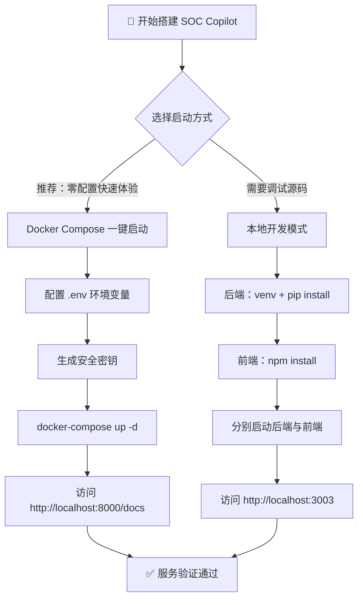
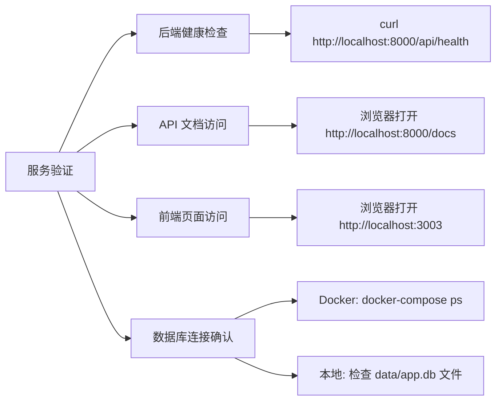

本文档旨在帮助你在 **15 分钟内**完成 SOC Copilot 的本地环境搭建并成功运行全部服务。我们将从前置依赖检查开始，逐步走完「克隆 → 配置 → 启动 → 验证」全流程，并提供两条并行路径——**Docker 一键启动**（推荐）与**本地开发模式**（适合需要热调试的开发者）。

Sources: [QUICKSTART.md](QUICKSTART.md#L1-L68), [README.md](README.md#L114-L162)

---

## 前置条件：你需要准备什么

在开始之前，请确认你的开发机已安装以下工具。表格中标注了每个工具的最低版本与用途说明。

| 工具 | 最低版本 | 用途 | 检查命令 |
|------|----------|------|----------|
| **Docker** | 20.10+ | 容器化运行时（Docker 路径必需） | `docker --version` |
| **Docker Compose** | v2.0+ | 多容器编排（Docker 路径必需） | `docker compose version` |
| **Python** | 3.12+ | 后端运行时（本地开发路径必需） | `python3 --version` |
| **Node.js** | 20+ | 前端运行时（本地开发路径必需） | `node --version` |
| **OpenSSL** | 任意 | 生成安全密钥与 SSL 证书 | `openssl version` |
| **Git** | 2.0+ | 版本控制 | `git --version` |

> 💡 **版本管理建议**：推荐使用 [nvm](https://github.com/nvm-sh/nvm) 管理 Node.js 版本、[pyenv](https://github.com/pyenv/pyenv) 管理 Python 版本，避免全局版本冲突。

Sources: [QUICKSTART.md](QUICKSTART.md#L3-L8), [backend/Dockerfile](backend/Dockerfile#L1), [frontend/Dockerfile](frontend/Dockerfile#L1)

---

## 选择你的启动路径

SOC Copilot 提供两种启动方式，你可以根据需求选择：



两种路径的**关键差异**对比：

| 维度 | Docker Compose | 本地开发模式 |
|------|---------------|-------------|
| **数据库** | PostgreSQL（容器内） | SQLite（本地文件，零配置） |
| **Redis** | 容器内自动启动 | 不需要（可选） |
| **热重载** | 后端代码挂载卷支持 | 原生支持（uvicorn --reload / next dev） |
| **配置复杂度** | 中等（需设置安全密钥） | 低（开发模式自动生成密钥） |
| **适用场景** | 集成测试、团队演示 | 日常开发、断点调试 |

Sources: [docker-compose.yml](docker-compose.yml#L1-L154), [docker-compose.override.yml](docker-compose.override.yml#L1-L50), [backend/db/session.py](backend/db/session.py#L25-L31)

---

## 路径 A：Docker Compose 一键启动

### 第 1 步：克隆项目

```bash
git clone <repository-url>
cd sec
```

### 第 2 步：配置环境变量

从模板复制 `.env` 文件：

```bash
cp .env.example .env
```

然后编辑 `.env`，填写以下**三个必需变量**。你可以用 `openssl` 快速生成安全随机值：

```bash
# 数据库密码（最少 16 字符）
export DB_PASSWORD=$(openssl rand -base64 32)

# JWT 签名密钥（最少 32 字符）
export SECRET_KEY=$(openssl rand -base64 64)

# Redis 密码（最少 16 字符）
export REDIS_PASSWORD=$(openssl rand -base64 32)
```

或者直接写入 `.env` 文件：

```env
DB_PASSWORD=<你生成的密码>
SECRET_KEY=<你生成的密钥>
REDIS_PASSWORD=<你生成的 Redis 密码>
```

`.env` 文件中的完整配置项清单：

| 分类 | 变量名 | 是否必需 | 默认值 | 说明 |
|------|--------|---------|--------|------|
| 数据库 | `DB_USER` | 否 | `soc_copilot` | PostgreSQL 用户名 |
| 数据库 | `DB_PASSWORD` | **是** | 无 | PostgreSQL 密码 |
| 数据库 | `DB_NAME` | 否 | `soc_copilot` | 数据库名称 |
| 缓存 | `REDIS_PASSWORD` | 否 | `changeme_redis` | Redis 密码 |
| 安全 | `SECRET_KEY` | **是** | 无 | JWT 签名密钥 |
| 安全 | `ENVIRONMENT` | 否 | `development` | 环境标识 |
| CORS | `CORS_ORIGINS` | 否 | `http://localhost:3003` | 允许的跨域来源 |
| AI | `AI_PROVIDER` | 否 | `zhipu` | AI 提供商 |
| AI | `ZHIPU_API_KEY` | 否 | 空 | 智谱 AI 密钥 |
| AI | `ANTHROPIC_API_KEY` | 否 | 空 | Claude API 密钥 |

Sources: [.env.example](.env.example#L1-L60), [docker-compose.yml](docker-compose.yml#L9-L66)

### 第 3 步：启动服务

**开发模式**（自动加载 `docker-compose.override.yml`，后端热重载 + 端口映射）：

```bash
docker-compose up -d
```

**生产模式**（启用 Nginx 反向代理 + SSL）：

```bash
# 先生成 SSL 证书
bash generate_ssl_cert.sh

# 启动生产配置
docker-compose -f docker-compose.yml -f docker-compose.prod.yml --profile production up -d
```

启动后，Docker Compose 会自动编排以下容器：

| 容器 | 镜像/构建 | 端口 | 健康检查 |
|------|----------|------|---------|
| `soc-copilot-postgres` | `postgres:15-alpine` | 5432（仅本地） | `pg_isready` |
| `soc-copilot-redis` | `redis:7-alpine` | 6379（仅本地） | `redis-cli ping` |
| `soc-copilot-backend` | 本地构建 | 8000（开发模式暴露） | `curl /api/health` |
| `soc-copilot-frontend` | 本地构建 | 3003（开发模式暴露） | `wget /` |
| `soc-copilot-nginx` | `nginx:alpine` | 80/443（仅生产模式） | — |

> 💡 **开发覆盖配置**：`docker-compose.override.yml` 自动被 Docker Compose 加载，它为后端开启了 `--reload` 热重载、将端口暴露到宿主机、并在 Redis 中去掉了密码要求，简化本地调试体验。

Sources: [docker-compose.yml](docker-compose.yml#L56-L154), [docker-compose.override.yml](docker-compose.override.yml#L1-L50), [generate_ssl_cert.sh](generate_ssl_cert.sh#L1-L40)

---

## 路径 B：本地开发模式

本地开发模式使用 **SQLite 作为默认数据库**，无需额外配置 PostgreSQL 或 Redis，开箱即用。

### 第 1 步：启动后端

```bash
cd backend

# 创建虚拟环境
python3 -m venv venv

# 激活虚拟环境
source venv/bin/activate        # macOS / Linux
# venv\Scripts\activate         # Windows

# 安装依赖
pip install -r requirements.txt

# 启动后端服务（自动热重载）
python -m uvicorn main:app --reload --host 0.0.0.0 --port 8000
```

**首次启动时后端会自动完成以下操作**：

1. **数据库迁移** — 检测 `alembic.ini` 和 `migrations_alembic/` 目录，自动执行 `alembic upgrade head`
2. **Bootstrap 管理员创建** — 检测到无用户时，自动创建初始管理员账号
3. **安全检查** — 在生产环境（`ENVIRONMENT=production`）下验证 JWT 密钥和管理员密码强度
4. **插件加载** — 自动扫描 `playbook_engine/v7_dag/plugins/` 目录，加载 DAG 节点插件
5. **生命周期服务启动** — 按优先级（CRITICAL → ESSENTIAL → NORMAL → OPTIONAL）启动数据库、队列、调度器、AI 处理器等服务

> ⚠️ **关于管理员密码**：本地开发模式下如果未设置 `BOOTSTRAP_ADMIN_PASSWORD`，系统会**自动生成 16 位随机密码并打印到控制台（stderr）**。请查看启动日志获取密码，登录后务必立即修改。

Sources: [backend/main.py](backend/main.py#L94-L291), [backend/core/config.py](backend/core/config.py#L157-L205), [backend/db/session.py](backend/db/session.py#L25-L57), [backend/alembic.ini](backend/alembic.ini#L89)

### 第 2 步：启动前端

**打开新的终端窗口**，执行：

```bash
cd frontend

# 安装依赖
npm install

# 启动开发服务器（端口 3003）
npm run dev
```

前端开发服务器运行在 `http://localhost:3003`，通过 Next.js 的 rewrite 配置自动将 `/api/*` 请求代理到后端 `http://localhost:8000`。

Sources: [frontend/package.json](frontend/package.json#L5-L8), [frontend/next.config.js](frontend/next.config.js#L25-L32)

### 第 3 步（可选）：配置 AI 和威胁情报

如需启用 AI 分析和威胁情报功能，在 `backend/` 目录下创建 `.env` 文件：

```bash
cd backend
cp .env.example .env
```

`backend/.env` 中的核心配置项：

| 配置项 | 说明 | 示例值 |
|--------|------|--------|
| `AI_PROVIDER` | AI 服务提供商 | `openrouter` / `zhipu` / `anthropic` / `nvidia` / `moonshot` |
| `OPENROUTER_API_KEY` | OpenRouter API 密钥（推荐） | `sk-or-v1-...` |
| `OPENROUTER_MODEL` | 使用的模型 | `moonshotai/kimi-k2.5` |
| `OTX_API_KEY` | AlienVault OTX 密钥 | `your_otx_key` |
| `ALLOW_EXTERNAL_TI` | 是否允许外部威胁情报查询 | `false`（默认关闭） |
| `SECRET_ENCRYPTION_KEY` | Fernet 加密密钥（Playbook Secrets 用） | 自动生成（开发模式） |

> 💡 **AI Provider 选择建议**：OpenRouter 是推荐的默认选项，它通过统一接口支持 Kimi、Claude、GPT-4o 等多种模型，无需单独申请多个 API Key。

Sources: [backend/.env.example](backend/.env.example#L1-L21), [backend/core/config.py](backend/core/config.py#L9-L23)

---

## 验证服务是否正常运行

启动完成后，通过以下方式确认所有服务正常：



### 快速验证命令

| 检查项 | 命令 | 预期结果 |
|--------|------|---------|
| 后端健康 | `curl http://localhost:8000/api/health` | 返回 `{"status": "ok"}` 或类似 JSON |
| API 文档 | 浏览器访问 `http://localhost:8000/docs` | 看到 Swagger UI 界面 |
| 前端页面 | 浏览器访问 `http://localhost:3003` | 看到 SOC Copilot 登录页 |
| Docker 容器 | `docker-compose ps` | 所有容器状态为 `healthy` 或 `running` |
| 数据库文件 | `ls -la data/app.db`（本地模式） | 文件存在且大小 > 0 |

### 服务访问地址总览

| 服务 | URL | 说明 |
|------|-----|------|
| 前端界面 | `http://localhost:3003` | 用户界面入口 |
| 后端 API | `http://localhost:8000` | REST API 基地址 |
| API 文档 | `http://localhost:8000/docs` | Swagger UI 交互式文档 |
| WebSocket | `ws://localhost:8000/ws` | 实时告警推送 |

Sources: [QUICKSTART.md](QUICKSTART.md#L56-L68), [backend/Dockerfile](backend/Dockerfile#L32-L33), [frontend/package.json](frontend/package.json#L6)

---

## Makefile 快捷命令速查

项目根目录的 `Makefile` 提供了大量快捷命令，省去重复输入长命令的麻烦：

| 命令 | 作用 | 等效操作 |
|------|------|---------|
| `make dev` | 同时启动前后端 | `npm run dev` |
| `make dev-backend` | 仅启动后端 | `cd backend && uvicorn main:app --reload` |
| `make dev-frontend` | 仅启动前端 | `cd frontend && npm run dev` |
| `make install` | 安装所有依赖 | `npm install` + `pip install` |
| `make docker-up` | Docker 启动 | `docker-compose up -d` |
| `make docker-down` | Docker 停止 | `docker-compose down` |
| `make docker-logs` | 查看 Docker 日志 | `docker-compose logs -f` |
| `make db-migrate` | 执行数据库迁移 | `alembic upgrade head` |
| `make lint` | 代码检查 | 运行所有 linter |
| `make clean` | 清理构建产物 | 删除缓存和编译文件 |

运行 `make help` 可查看完整的命令列表。

Sources: [Makefile](Makefile#L1-L165)

---

## 常见启动问题与排查

| 症状 | 可能原因 | 解决方案 |
|------|---------|---------|
| `ERROR: DB_PASSWORD environment variable is required` | 未设置数据库密码 | `export DB_PASSWORD=$(openssl rand -base64 32)` 后重新启动 |
| `CORS 错误：Origin not allowed` | CORS 白名单未配置 | 在 `.env` 中设置 `CORS_ORIGINS=http://localhost:3003` |
| `could not connect to server` | PostgreSQL 未就绪 | 执行 `docker-compose ps postgres` 检查健康状态 |
| Nginx 启动失败 / SSL 错误 | 缺少 SSL 证书 | 运行 `bash generate_ssl_cert.sh` 生成自签名证书 |
| `ModuleNotFoundError` | Python 依赖未安装 | 确认已激活 venv 并执行 `pip install -r requirements.txt` |
| 前端 `npm install` 失败 | Node.js 版本过低 | 升级到 Node.js 20+，推荐使用 nvm 管理 |
| 管理员密码未知 | 未查看控制台输出 | 本地模式下密码打印在 stderr，Docker 模式请查看 `docker-compose logs backend` |
| `Production security validation failed` | 生产环境缺少安全配置 | 设置 `JWT_SECRET`（≥32字符）和 `BOOTSTRAP_ADMIN_PASSWORD`（≥12字符） |

### Docker 常用排查命令

```bash
# 查看所有容器状态
docker-compose ps

# 查看后端实时日志
docker-compose logs -f backend

# 进入后端容器调试
docker exec -it soc-copilot-backend bash

# 完全重置（包括数据卷）
docker-compose down -v
docker-compose up -d --build
```

Sources: [QUICKSTART.md](QUICKSTART.md#L179-L226), [backend/core/config.py](backend/core/config.py#L122-L155)

---

## 开发环境安全加固建议

即使是本地开发环境，也建议做好以下安全措施：

1. **安装 pre-commit hooks**——在每次 `git commit` 前自动执行代码格式化、lint 检查、私钥泄露检测：

```bash
pip install pre-commit
pre-commit install
```

2. **不要将 `.env` 文件提交到版本控制**——`.gitignore` 已排除 `.env`，请确认你的密钥文件不会被意外提交。

3. **AI API Key 安全**——AI 提供商的 API Key 应仅存储在 `.env` 文件中，不要硬编码在源码里。

4. **生产环境检查**——部署到生产环境时，务必设置 `STRICT_PRODUCTION_CHECKS=true`，它会强制校验所有安全相关配置项。

Sources: [.pre-commit-config.yaml](.pre-commit-config.yaml#L1-L64), [backend/core/config.py](backend/core/config.py#L42-L45)

---

## 下一步

环境搭建完成后，建议按以下顺序继续阅读：

1. **[项目目录结构与模块职责速查](3-xiang-mu-mu-lu-jie-gou-yu-mo-kuai-zhi-ze-su-cha)** —— 了解项目的目录组织方式和各模块的职责划分
2. **[Docker Compose 一键部署（开发与生产模式）](4-docker-compose-jian-bu-shu-kai-fa-yu-sheng-chan-mo-shi)** —— 深入理解 Docker 部署的高级配置选项
3. **[前后端整体架构与数据流设计](5-qian-hou-duan-zheng-ti-jia-gou-yu-shu-ju-liu-she-ji)** —— 从架构层面理解系统如何协同工作