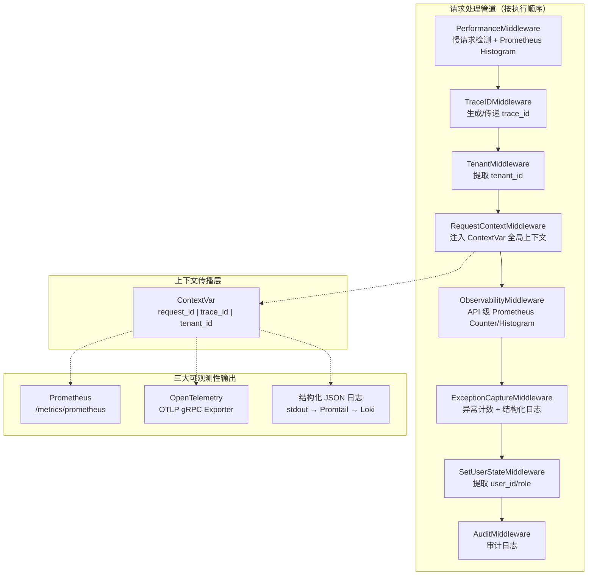
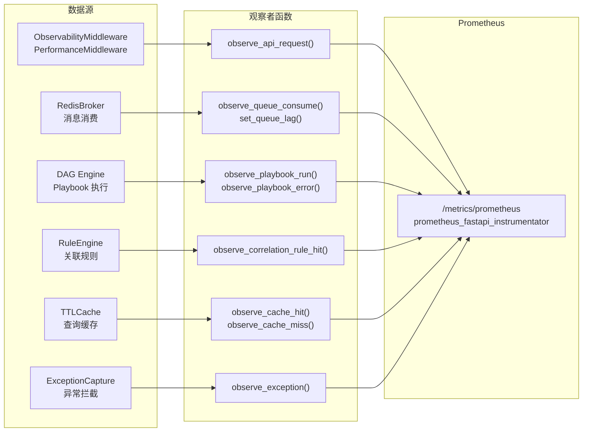
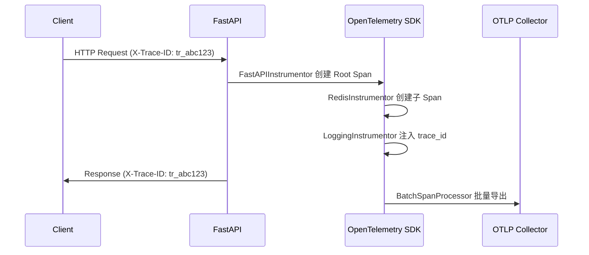
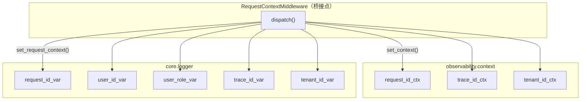
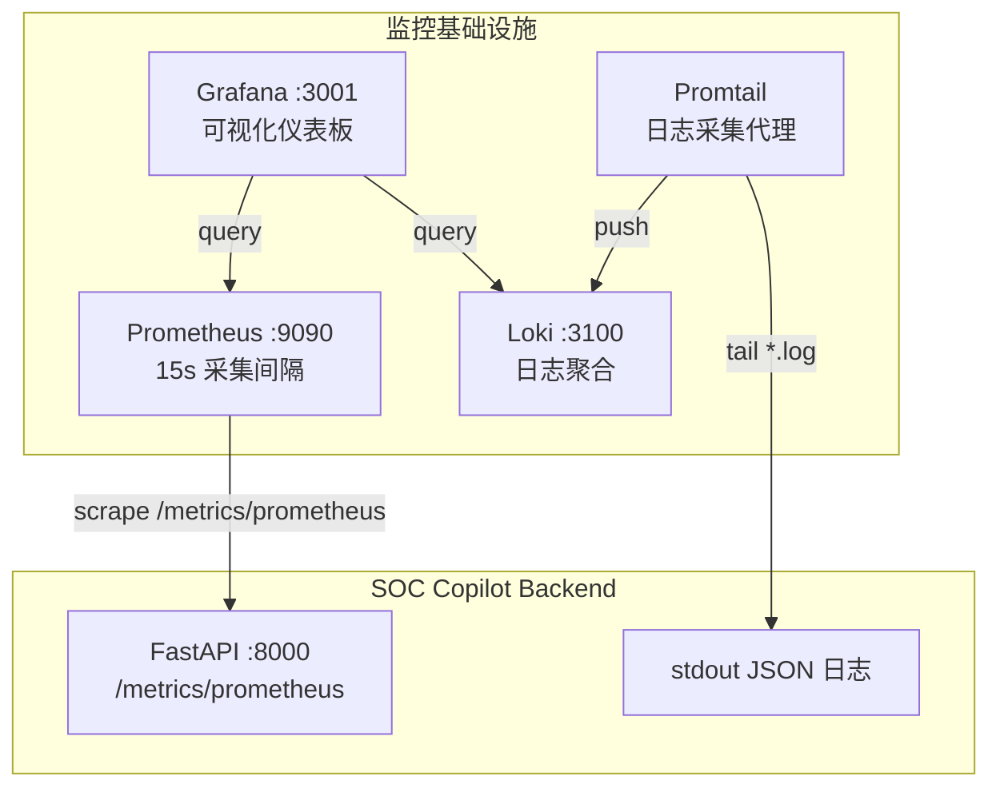

SOC Copilot 的可观测性体系围绕**三大支柱**构建——Prometheus 指标、OpenTelemetry 分布式追踪以及结构化 JSON 日志。这套体系并非独立存在的模块，而是通过 `ContextVar` 驱动的请求上下文传播机制，将 `request_id`、`trace_id`、`tenant_id` 三个核心标识符贯穿中间件链→业务服务→指标采集→日志输出的完整生命周期，实现了从一条 HTTP 请求入口到最终日志落盘的全链路可追踪。本文将深入剖析每一层的设计决策、指标语义、集成模式与运维实践。

Sources: [__init__.py](backend/observability/__init__.py#L1-L8), [context.py](backend/observability/context.py#L1-L36)

## 架构全景

在深入各子系统之前，理解可观测性组件在请求处理管道中的位置至关重要。FastAPI 的中间件以**逆序注册、正序执行**的方式运行——后注册的中间件最先拦截请求，因此中间件注册顺序决定了数据采集的完整度。SOC Copilot 在 `main.py` 中精心编排了中间件栈，确保可观测性数据在最外层就被捕获。



关键设计要点：`TraceIDMiddleware` 在第 420 行率先注册（最外层之一），确保所有下游中间件和业务代码都能通过 `get_trace_id()` 获取到追踪标识。`RequestContextMiddleware` 紧随其后，将 `request_id`、`trace_id`、`tenant_id` 同时写入 `observability.context` 和 `core.logger` 两套 `ContextVar`，使得指标模块和日志模块无需互相依赖即可获取上下文。

Sources: [main.py](backend/main.py#L414-L449), [request_context_middleware.py](backend/middleware/request_context_middleware.py#L1-L55)

## Prometheus 指标体系

### 指标定义与分层

Prometheus 指标集中在 `observability/metrics.py` 中统一管理，按业务领域划分为 **6 个指标族**，每族包含 Counter（计数器）和 Histogram（直方图）两种核心类型。`prometheus_fastapi_instrumentator` 提供了框架级默认指标（请求总数、延迟分布、请求大小等），自定义指标则在此基础上补充业务语义。

| 指标族 | 指标名称 | 类型 | 标签维度 | 语义 |
|--------|----------|------|----------|------|
| **API** | `soc_api_requests_total` | Counter | method, path, status, tenant_id | API 请求总数 |
| **API** | `soc_api_request_duration_seconds` | Histogram | method, path, tenant_id | API 请求延迟（8 桶：10ms~5s） |
| **API** | `http_request_duration_seconds` | Histogram | method, path, status | 兼容性延迟指标（12 桶：10ms~10s） |
| **队列** | `soc_queue_consume_total` | Counter | stream, consumer_group, result | 消息消费尝试（success/error） |
| **队列** | `soc_queue_processing_seconds` | Histogram | stream, consumer_group | 消息处理延迟（7 桶：1ms~2s） |
| **队列** | `soc_queue_lag` | Gauge | stream | 队列积压量（实时） |
| **队列** | `soc_queue_dlq_total` | Counter | stream | 死信队列转储次数 |
| **队列** | `soc_queue_retry_total` | Counter | stream | 消息重试次数 |
| **Playbook** | `soc_playbook_runs_total` | Counter | playbook_name, status, mode, tenant_id | Playbook 执行次数 |
| **Playbook** | `soc_playbook_run_duration_seconds` | Histogram | playbook_name, tenant_id | Playbook 执行耗时（8 桶：1s~600s） |
| **Playbook** | `soc_playbook_errors_total` | Counter | playbook_name, error_type, tenant_id | Playbook 错误分类计数 |
| **关联** | `soc_correlation_rule_hit_total` | Counter | rule_id, tenant_id | 关联规则命中次数 |
| **异常** | `soc_exceptions_total` | Counter | exception_type, path | 未捕获异常计数 |
| **缓存** | `soc_cache_hits_total` | Counter | cache_name | 缓存命中次数 |
| **缓存** | `soc_cache_misses_total` | Counter | cache_name | 缓存未命中次数 |
| **缓存** | `soc_cache_size` | Gauge | cache_name | 当前缓存条目数 |
| **安全告警** | `soc_security_alerts_total` | Counter | source, severity, tenant_id | 安全告警摄入总量 |
| **安全告警** | `soc_security_alerts_by_status` | Gauge | status, tenant_id | 按状态统计的告警数 |

`Histogram` 桶边界的设定体现了精确的性能分级策略——API 延迟使用 `(0.01, 0.05, 0.1, 0.2, 0.5, 1, 2, 5)` 秒，覆盖从「即时响应」到「超时边缘」的完整梯度；Playbook 耗时则使用 `(1, 5, 10, 30, 60, 120, 300, 600)` 秒，适配自动化剧本执行的长时间特征。这种差异化桶边界设计保证了 P95/P99 百分位估算在各自业务场景下的精度。

Sources: [metrics.py](backend/observability/metrics.py#L1-L196), [docs_stage1_observability.md](backend/docs_stage1_observability.md#L1-L38)

### 指标采集链路

指标并非凭空产生，而是通过中间件和服务层的 **观察者函数（observe_\*）** 系统性地注入。每个观察者函数封装了 Counter 的 `.inc()` 和 Histogram 的 `.observe()` 调用，业务代码只需传入语义化的参数即可：



`setup_metrics()` 函数在应用启动时通过 `Instrumentator` 自动注册 `/metrics/prometheus` 端点，并排除了 `/metrics`、`/health/live`、`/health/ready` 等内部路径避免监控探针干扰指标数据。`core/metrics.py` 作为向后兼容的门面层，将所有 `observe_*` 函数重新导出并提供了 `record_playbook_run` / `record_playbook_error` 等更语义化的别名。

Sources: [metrics.py](backend/observability/metrics.py#L112-L131), [core/metrics.py](backend/core/metrics.py#L1-L69), [exception_middleware.py](backend/middleware/exception_middleware.py#L1-L29)

### 常用 PromQL 查询

以下查询表达式覆盖了日常运维中最常见的监控场景，可直接在 Grafana 或 Prometheus 控制台使用：

| 场景 | PromQL 表达式 |
|------|---------------|
| API P95 延迟 | `histogram_quantile(0.95, sum by (le) (rate(soc_api_request_duration_seconds_bucket[5m])))` |
| 队列最大积压 | `max by (stream) (soc_queue_lag)` |
| Top 10 关联规则 | `topk(10, sum by (rule_id) (increase(soc_correlation_rule_hit_total[1h])))` |
| API 5xx 错误率 | `sum(rate(soc_api_requests_total{status=~"5.."}[5m])) / sum(rate(soc_api_requests_total[5m]))` |
| 缓存命中率 | `sum(rate(soc_cache_hits_total[5m])) / (sum(rate(soc_cache_hits_total[5m])) + sum(rate(soc_cache_misses_total[5m])))` |
| Playbook 失败率 | `sum(rate(soc_playbook_runs_total{status="failed"}[5m])) / sum(rate(soc_playbook_runs_total[5m]))` |

Sources: [docs_stage1_observability.md](backend/docs_stage1_observability.md#L30-L38), [prometheus-rules.yml](backend/observability/dashboards/prometheus-rules.yml#L1-L18)

### Prometheus 告警规则

系统预置了两条核心告警规则，定义在 `observability/dashboards/prometheus-rules.yml` 中：

- **HighApiErrorRate**：5xx 错误率超过 5% 持续 10 分钟触发 `warning` 级别告警
- **QueueLagTooHigh**：队列积压超过 1000 条持续 5 分钟触发 `critical` 级别告警

这些规则与 Grafana Alerting 集成后，可通过 Webhook 回调至 SOC Copilot 的 `/api/triggers/webhook` 端点，形成「监控→告警→响应」的闭环。

Sources: [prometheus-rules.yml](backend/observability/dashboards/prometheus-rules.yml#L1-L18)

## 分布式追踪

### OpenTelemetry 集成架构

追踪系统基于 **OpenTelemetry** 标准构建，采用「可选依赖」策略——当 `opentelemetry-*` 包未安装或 `OTEL_EXPORTER_OTLP_ENDPOINT` 环境变量未配置时，追踪功能静默降级，不影响应用正常运行。这种设计确保了开发环境的轻量化和生产环境的可观测性之间的平衡。

`setup_tracing()` 函数完成以下初始化序列：

1. **资源标识**：创建 `TracerProvider`，以 `service.name = "soc-backend"` 标识服务
2. **Span 导出**：配置 `BatchSpanProcessor` + `OTLPSpanExporter`，通过 gRPC 协议批量发送 Span 到 OTLP Collector
3. **自动埋点**：`FastAPIInstrumentor.instrument_app(app)` 自动为每个请求创建 Span；`RedisInstrumentor().instrument()` 捕获 Redis 操作；`LoggingInstrumentor` 将 trace_id 注入日志



Sources: [tracing.py](backend/observability/tracing.py#L1-L49)

### Trace ID 传播机制

`TraceIDMiddleware` 是追踪体系的入口，它实现了两种 trace_id 获取策略：

- **上游传入**：检查请求头 `X-Trace-ID`，若存在则沿用上游服务的追踪标识（跨服务调用场景）
- **自动生成**：若无上游标识，生成格式为 `tr_{uuid4_hex[:24]}` 的唯一追踪 ID

生成的 trace_id 被同时写入三个位置：
1. `contextvars.ContextVar`（`trace_id_context`）——供任意层级的代码通过 `get_trace_id()` 获取
2. `request.state.trace_id` ——供 FastAPI 依赖注入使用
3. 响应头 `X-Trace-ID` ——供下游服务或客户端关联

请求结束后，`TraceIDMiddleware` 在 `finally` 块中清除 ContextVar，防止上下文泄漏。`TraceIDFilter` 作为日志过滤器，自动将 `trace_id` 附加到每条日志记录上，实现日志与追踪的无缝关联。

Sources: [trace_middleware.py](backend/middleware/trace_middleware.py#L46-L120)

## 结构化日志

### 双层日志架构

SOC Copilot 存在两套并行的结构化日志实现，分别服务于不同的集成需求：

| 维度 | `observability/logging.py` | `core/logger.py` |
|------|---------------------------|-------------------|
| **格式化器** | 自定义 `JsonLogFormatter` | `python-json-logger` 的 `JsonFormatter` |
| **上下文字段** | trace_id, request_id, tenant_id | trace_id, request_id, user_id, user_role, tenant_id, environment, duration_ms |
| **上下文来源** | `observability.context` 的 ContextVar | 自有 ContextVar + `StructuredLogFilter` |
| **日志级别** | `LOG_LEVEL` 环境变量 | 环境感知（生产 INFO、测试 WARNING、开发 DEBUG） |
| **自定义 Logger** | 无 | `StructuredLogger`（支持 `info_with_context` 等方法） |
| **典型调用方式** | `setup_json_logging()` 全局初始化 | `get_logger(__name__)` 按模块创建 |

两套系统通过 `RequestContextMiddleware` 实现桥接——该中间件同时调用 `observability.context.set_context()` 和 `core.logger.set_request_context()`，确保无论业务代码使用哪套日志 API，输出中都包含完整的请求上下文。

Sources: [logging.py](backend/observability/logging.py#L1-L49), [logger.py](backend/core/logger.py#L1-L272)

### 日志输出格式

以 `core/logger.py` 的 `StructuredJsonFormatter` 为例，一条完整的结构化日志输出如下：

```json
{
  "timestamp": "2026-03-15T08:30:00.123456+00:00",
  "level": "WARNING",
  "logger": "services.alerting.alert_evaluator",
  "message": "Slow request: POST /api/alerts/analyze took 350.00ms",
  "request_id": "req_a1b2c3d4e5f6g7h8i9j0k1l2",
  "trace_id": "tr_m3n4o5p6q7r8s9t0u1v2w3x4",
  "user_id": "user_42",
  "user_role": "analyst",
  "tenant_id": "tenant_acme",
  "environment": "production",
  "service": "soc-copilot",
  "duration_ms": 350.0,
  "extra": {
    "type": "performance",
    "operation": "alert_analysis"
  }
}
```

日志中 `trace_id` 的存在使得你可以在 Grafana Loki 中通过 `{job="soc-copilot"} |= "tr_m3n4o5p6"` 精确定位某次请求的所有日志，再结合 OpenTelemetry 追踪数据进行关联分析。

Sources: [logger.py](backend/core/logger.py#L58-L97)

### 便捷日志函数

`core/logger.py` 提供了三个领域专用的日志辅助函数，封装了常见的结构化日志模式：

- **`log_api_request()`**：记录 API 请求的方法、路径、状态码和耗时，附加 `type: "api_request"` 标签
- **`log_security_event()`**：记录安全事件，使用 `WARNING` 级别，附加 `type: "security_event"` 和事件详情
- **`log_performance()`**：记录性能指标，当耗时超过阈值（默认 200ms）时自动提升为 `WARNING` 级别

Sources: [logger.py](backend/core/logger.py#L216-L272)

## 请求上下文传播

### ContextVar 桥接机制

请求上下文传播是可观测性体系的基石。SOC Copilot 维护了两套 `ContextVar` 体系，并通过 `RequestContextMiddleware` 在请求入口处统一桥接：



两套 ContextVar 共存的根本原因是 `observability/` 包设计为可独立使用的轻量级可观测性模块，而 `core/logger.py` 则承载了更丰富的上下文信息（`user_id`、`user_role`、`environment`、`duration_ms`）。业务代码通过 `get_logger(__name__)` 获取的日志器自动携带全部上下文字段，而纯指标采集代码通过 `observability.context.get_trace_id()` 获取标识符时则无需引入日志依赖。

请求结束后，`RequestContextMiddleware` 在 `finally` 块中同时调用 `clear_context()` 和 `clear_request_context()`，确保 ContextVar 被正确重置，避免在异步环境中发生上下文泄漏。

Sources: [context.py](backend/observability/context.py#L1-L36), [request_context_middleware.py](backend/middleware/request_context_middleware.py#L16-L55)

## 基础设施集成

### Grafana + Loki + Prometheus 栈

SOC Copilot 提供了 `docker-compose.grafana.yml` 一键部署完整的监控基础设施栈：



| 组件 | 端口 | 职责 |
|------|------|------|
| **Prometheus** | 9090 | 采集和存储时序指标，15 秒抓取间隔 |
| **Grafana** | 3001 | 统一可视化面板（默认账号 admin/admin） |
| **Loki** | 3100 | 日志聚合存储，接收 Promtail 推送的日志流 |
| **Promtail** | — | 日志采集代理，监控 `/var/log/backend/*.log` |

Prometheus 配置中定义了两个抓取任务：`grafana`（监控 Grafana 自身）和 `soc-copilot-backend`（抓取后端指标）。Promtail 配置将日志流标记为 `job: soc-copilot`，便于在 Loki 中按标签过滤查询。

Sources: [docker-compose.grafana.yml](backend/docker-compose.grafana.yml#L1-L62), [prometheus.yml](backend/prometheus.yml#L1-L14), [promtail-config.yml](backend/promtail-config.yml#L1-L18)

### Loki 告警集成

`LokiAlertSender` 服务封装了向 Loki 推送结构化告警的逻辑。每条告警被构建为 Loki 原生的 Stream 格式，包含 `job`、`level`、`event_type`、`agent_id`、`source` 等标签，告警体以 JSON 编码存入 value 字段。`send_alert()` 方法通过 `httpx.AsyncClient` 异步推送，超时设置为 10 秒。

Sources: [loki_alert_sender.py](backend/services/loki_alert_sender.py#L1-L120)

## 性能监控中间件

`PerformanceMiddleware` 是一个独立于 `ObservabilityMiddleware` 的性能分析层，专注于**慢请求检测**。它的核心逻辑包括：

1. **路径过滤**：排除 `/health`、`/metrics`、`/openapi.json` 等内部路径和静态资源路径
2. **耗时计算**：使用 `time.perf_counter()` 高精度计时
3. **阈值告警**：默认 200ms 阈值（通过 `slow_request_threshold` 配置），超阈值请求输出 `WARNING` 级别日志
4. **响应头注入**：添加 `X-Response-Time` 头，便于前端或客户端调试
5. **路径归一化**：将 URL 中的 UUID 和数字 ID 替换为 `{uuid}` / `{id}` 占位符，避免 Prometheus 标签爆炸

该中间件可通过 `settings.performance_monitoring_enabled` 配置项全局开关，默认启用。

Sources: [performance.py](backend/middleware/performance.py#L1-L198)

## 配置参考

以下环境变量控制可观测性行为：

| 环境变量 | 默认值 | 说明 |
|----------|--------|------|
| `LOG_LEVEL` | `INFO` | 全局日志级别 |
| `ENVIRONMENT` | `development` | 环境标识（影响日志级别自动调整） |
| `OTEL_EXPORTER_OTLP_ENDPOINT` | — | OpenTelemetry Collector 地址（未设置则禁用追踪） |
| `PERFORMANCE_MONITORING_ENABLED` | `true` | 性能监控中间件开关 |
| `SLOW_REQUEST_THRESHOLD` | `0.2` | 慢请求阈值（秒） |
| `LOKI_PUSH_URL` | — | Loki 日志推送地址 |

Sources: [config.py](backend/core/config.py#L98-L102), [exporters.py](backend/observability/exporters.py#L1-L13)

---

**延伸阅读**：可观测性中间件的注册顺序和异常捕获逻辑在 [中间件链：审计、幂等性、请求追踪与异常捕获](19-zhong-jian-jian-lian-shen-ji-mi-deng-xing-qing-qiu-zhui-zong-yu-yi-chang-bu-huo) 中有更详细的分析；WebSocket 连接的实时监控指标采集在 [WebSocket 实时通信：连接管理、频道订阅与离线消息队列](21-websocket-shi-shi-tong-xin-lian-jie-guan-li-pin-dao-ding-yue-yu-chi-xian-xiao-xi-dui-lie) 中讨论；生产环境下的 Grafana 部署配置请参考 [生产环境配置：Nginx 反向代理、SSL 与安全加固检查清单](27-sheng-chan-huan-jing-pei-zhi-nginx-fan-xiang-dai-li-ssl-yu-an-quan-jia-gu-jian-cha-qing-dan)。