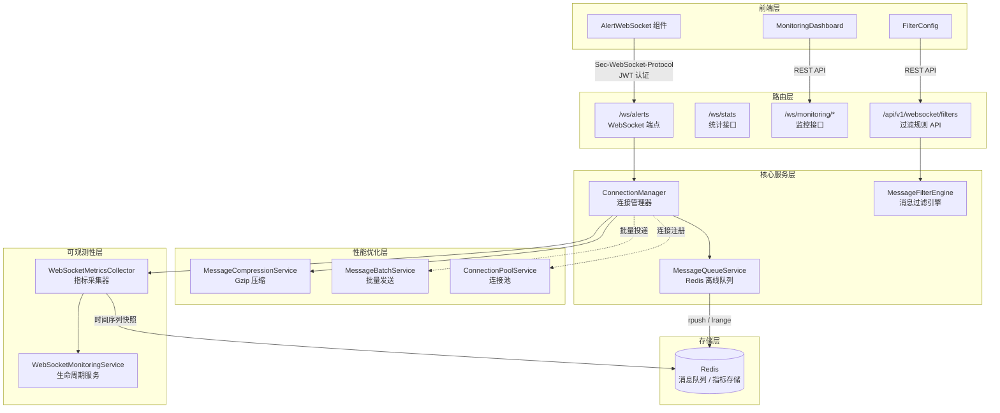
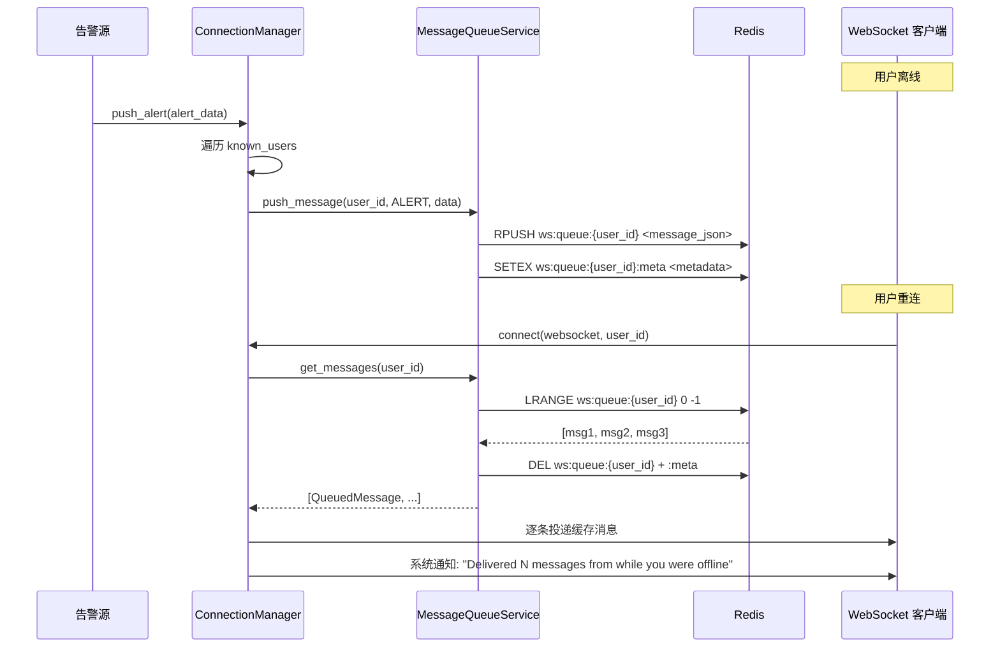

SOC Copilot 的 WebSocket 实时通信层是整个安全运营平台「实时感知」能力的核心基础设施。从安全告警的即时推送到 Playbook 执行状态的实时同步，再到系统通知的广播触达，所有需要低延迟双向通信的场景均由该层承载。本文将从架构设计出发，逐层拆解**连接管理**、**频道订阅**、**离线消息队列**三大核心机制，并延伸至**消息压缩**、**批量发送**、**连接池**等性能优化手段以及**服务端过滤引擎**和**可观测性监控**的完整技术实现。

Sources: [websocket_manager.py](backend/services/websocket_manager.py#L1-L11), [websocket.py](backend/routers/websocket.py#L1-L24)

## 系统架构总览

整个 WebSocket 通信系统由六大子系统协同工作，形成一个从连接建立到消息投递的完整闭环。**ConnectionManager** 作为核心中枢管理所有活跃连接与频道映射；**MessageQueueService** 依托 Redis 为离线用户提供消息暂存；**MessageCompressionService** 和 **MessageBatchService** 分别从单条压缩和批量聚合两个维度优化网络吞吐；**ConnectionPoolService** 提供连接复用与健康检查；**WebSocketMonitoringService** 则以独立生命周期服务的形式采集全链路指标并计算健康分数。

Sources: [websocket_manager.py](backend/services/websocket_manager.py#L41-L64), [main.py](backend/main.py#L489-L490), [websocket_monitoring_service.py](backend/services/lifecycle/websocket_monitoring_service.py#L37-L63)

## 连接管理：ConnectionManager

**ConnectionManager** 是整个 WebSocket 系统的核心状态管理器，采用单例模式（通过 `get_manager()` 全局访问）管理所有活跃连接和用户元数据。它的核心数据结构由三部分组成：

| 数据结构 | 类型 | 用途 |
|---|---|---|
| `active_connections` | `dict[WebSocket, dict]` | 所有活跃 WebSocket 连接及其用户信息（user_id、role、连接时间、订阅频道） |
| `channel_subscriptions` | `dict[str, set[WebSocket]]` | 频道到连接集合的映射，预置 `alerts`、`playbook_runs`、`system` 三个频道 |
| `known_users` | `dict[str, str]` | 包含离线用户在内的已知用户及其最后活跃时间，用于离线消息路由 |

连接建立时，`connect()` 方法执行以下关键流程：首先通过 `websocket.accept()` 接受连接，然后在 **asyncio.Lock** 保护下将连接信息写入 `active_connections` 并注册到对应频道的 `channel_subscriptions`，随后触发监控指标记录、发送系统欢迎消息，最后检查离线消息队列并将缓存消息逐条投递给重连用户。

Sources: [websocket_manager.py](backend/services/websocket_manager.py#L52-L143)

连接断开时，`disconnect()` 方法同样在锁保护下清理 `active_connections` 和所有频道订阅中的连接引用，并记录断连监控指标。值得注意的是，断连时**不会**删除 `known_users` 中的记录——这确保了后续广播消息时仍能为该用户进行离线队列缓存。`known_users` 的清理由后台定时任务 `cleanup_stale_users()` 负责，默认 TTL 为 24 小时，在 [main.py](backend/main.py#L300-L315) 的 `lifespan` 中以每小时一次的频率异步执行。

Sources: [websocket_manager.py](backend/services/websocket_manager.py#L144-L162), [websocket_manager.py](backend/services/websocket_manager.py#L324-L339), [main.py](backend/main.py#L293-L315)

### JWT 认证与安全传输

WebSocket 端点 `/ws/alerts` 的认证采用 **Sec-WebSocket-Protocol** 头传递 JWT 令牌，而非将 token 暴露在 URL 查询参数中。前端通过 `new WebSocket(url, "access_token.<jwt>")` 将令牌嵌入子协议头，后端从 `sec-websocket-protocol` 头中解析前缀 `access_token.` 后的 JWT 并调用 `decode_token()` 验证。同时保留查询参数 `?token=` 作为向后兼容的降级方案。认证失败将返回 WebSocket 关闭码 `4001`。

Sources: [websocket.py](backend/routers/websocket.py#L119-L171), [AlertWebSocket.tsx](frontend/components/AlertWebSocket.tsx#L66-L74)

### 连接保活与超时机制

WebSocket 端点的消息循环采用 `asyncio.wait_for()` 设置 60 秒接收超时。超时后服务器主动发送 `ping` 消息探测连接存活性；客户端收到 `ping` 后自动回复 `pong`。若客户端在无消息交互期间保持静默超过 60 秒，且对 `ping` 无响应，连接将被视为失效并触发断连清理。这种**超时→探测→判定**的三阶段保活策略在不引入额外心跳线程的前提下保证了僵尸连接的及时回收。

Sources: [websocket.py](backend/routers/websocket.py#L191-L266), [AlertWebSocket.tsx](frontend/components/AlertWebSocket.tsx#L96-L101)

## 频道订阅系统

SOC Copilot 的 WebSocket 频道系统采用**发布-订阅**模式，预置三个核心频道：

| 频道名称 | 用途 | 消息类型 |
|---|---|---|
| `alerts` | 安全告警实时推送 | 新告警、告警更新 |
| `playbook_runs` | Playbook 执行状态同步 | 执行进度、节点结果 |
| `system` | 系统通知广播 | 维护通知、版本更新 |

用户在建立 WebSocket 连接时通过 `?channels=alerts,playbook_runs` 查询参数指定初始订阅频道，默认订阅 `alerts`。连接建立后，客户端可在运行时通过发送 `{"type": "subscribe", "channels": ["alerts", "system"]}` 消息**动态切换**订阅频道——后端会先清除该连接在所有频道中的注册，再将其添加到新指定的频道集合中，并返回确认消息。

Sources: [websocket.py](backend/routers/websocket.py#L173-L181), [websocket.py](backend/routers/websocket.py#L214-L241)

### 广播与消息路由

`ConnectionManager` 提供三个高层广播方法——`broadcast_alert()`、`broadcast_playbook_run()`、`broadcast_system_message()`——它们分别构造对应类型的 `WebSocketMessage` 并调用 `broadcast_to_channel()`。广播方法遍历目标频道的所有订阅连接，逐个发送 JSON 消息；发送失败的连接将被自动断开清理。同时，对于已订阅频道但当前未在线的用户，系统会自动将消息推入离线队列。

Sources: [websocket_manager.py](backend/services/websocket_manager.py#L211-L275), [websocket.py](backend/routers/websocket.py#L48-L78)

### 外部推送接口

后端任何模块均可通过导入 `push_alert()`、`push_playbook_run_update()`、`push_system_notification()` 三个异步函数实现向所有连接客户端推送消息。其中 `push_alert()` 和 `push_playbook_run_update()` 会同时执行两步操作：先通过 `broadcast_alert()` / `broadcast_playbook_run()` 向在线用户实时推送，再遍历 `known_users` 中所有当前不在线的用户，将消息写入 Redis 离线队列。

Sources: [websocket.py](backend/routers/websocket.py#L48-L117)

## 离线消息队列

离线消息队列是保障消息可靠投递的关键组件，其设计目标是确保用户在断线期间不丢失任何重要告警。队列服务 **MessageQueueService** 基于 Redis 实现，每用户维护独立的 FIFO 消息队列。

Sources: [message_queue.py](backend/services/message_queue.py#L40-L49), [websocket.py](backend/routers/websocket.py#L48-L78)

### 数据模型与 Redis 键设计

离线队列的核心数据模型是 **QueuedMessage**，包含消息 ID、类型（`MessageType` 枚举）、数据载荷、时间戳、目标频道和 TTL。队列元数据由 **UserQueue** 管理，跟踪每用户队列的消息计数和容量状态。Redis 键命名规范如下：

| Redis 键 | 类型 | 用途 |
|---|---|---|
| `ws:queue:{user_id}` | List | 用户的 FIFO 消息队列 |
| `ws:queue:{user_id}:meta` | String (JSON) | 队列元数据（消息数、容量、更新时间） |

Sources: [message_queue.py](backend/models/message_queue.py#L33-L139)

### 队列容量与生命周期管理

每个用户队列的默认容量上限为 **1000 条消息**，消息默认 TTL 为 **24 小时**（86400 秒）。当队列满时，`push_message()` 返回 `False` 并记录日志，不会丢弃旧消息——这是一种**写保护**策略，确保高频告警场景下不会因队列溢出导致消息乱序。队列的生命周期完全由 Redis TTL 管理：消息入队时通过 `SETEX` 设置元数据过期时间，同时通过 `EXPIRE` 同步队列键的 TTL。

Sources: [message_queue.py](backend/services/message_queue.py#L101-L164), [message_queue.py](backend/models/message_queue.py#L60-L84)

### 消息读取与原子清理

`get_messages()` 方法采用**读取即清除**策略：使用 `LRANGE` 获取全部消息后，立即 `DELETE` 队列键和元数据键。这种设计保证了消息不会被重复投递——一旦用户重连并取走缓存消息，Redis 中的队列即被清空。后台还有 `_cleanup_loop()` 以每小时一次的频率扫描所有队列元数据键，清理已过期的僵尸队列。

Sources: [message_queue.py](backend/services/message_queue.py#L166-L198), [message_queue.py](backend/services/message_queue.py#L282-L316)

### 优雅降级

当 Redis 不可用时，整个消息队列服务自动降级：`is_available()` 返回 `False`，所有队列操作跳过，消息仅投递给在线用户。系统不会因 Redis 故障而阻塞 WebSocket 连接的建立或消息广播。这种 **fail-silent** 策略在不牺牲核心实时通信能力的前提下，将离线缓存作为增强特性而非硬依赖。

Sources: [message_queue.py](backend/services/message_queue.py#L91-L99)

## 性能优化层

WebSocket 通信系统在消息压缩、批量发送和连接池三个维度进行了性能优化，三者均由 `WebSocketMonitoringService` 生命周期服务统一启动管理。

### 消息压缩：MessageCompressionService

压缩服务对超过 **1KB** 的消息自动启用 Gzip 压缩（压缩级别 6），并通过 `max_compression_ratio` 阈值（默认 0.9）跳过压缩效果不佳的消息。压缩后的消息以 `{"_compressed": true, "_data": "<hex>"}` 格式发送，前端需识别 `_compressed` 标志并执行解压。压缩统计通过 `/ws/compression/stats` 端点暴露，支持通过 `/ws/compression/reset-stats` 重置。

| 配置参数 | 默认值 | 说明 |
|---|---|---|
| `min_size_bytes` | 1024 | 触发压缩的最小消息体积 |
| `compression_level` | 6 | Gzip 压缩级别（0-9） |
| `max_compression_ratio` | 0.9 | 压缩率上限，超过则跳过压缩 |

Sources: [websocket_compression.py](backend/services/websocket_compression.py#L26-L161), [websocket_manager.py](backend/services/websocket_manager.py#L164-L209)

### 批量发送：MessageBatchService

批量服务按频道维度聚合消息，当单批次满足以下任一条件时触发 flush：达到最大批次大小（100 条）、达到最小批次大小（5 条）或超过最大等待时间（100ms）。后台 `_flush_loop()` 以配置的 `max_batch_delay_ms` 为周期检查并刷新所有就绪批次。手动 flush 可通过 `/ws/batch/flush` 端点触发。

Sources: [message_batch_service.py](backend/services/message_batch_service.py#L26-L200)

### 连接池：ConnectionPoolService

连接池服务为 WebSocket 连接提供**状态追踪**和**健康检查**能力。每个连接以 `PooledConnection` 包装，状态机包含 IDLE → ACTIVE → CLOSING / UNHEALTHY 等转换。后台健康检查循环以 60 秒为周期扫描所有连接，将空闲超过 300 秒的连接标记为不健康并关闭。当池满（默认上限 1000）时，优先淘汰空闲时间最长的 10% 连接。

Sources: [websocket_connection_pool.py](backend/services/websocket_connection_pool.py#L36-L113), [websocket_connection_pool.py](backend/services/websocket_connection_pool.py#L315-L398)

## 服务端消息过滤引擎

**MessageFilterEngine** 允许用户通过 REST API 配置精细化的消息过滤规则，在服务端拦截不需要的消息，减少不必要的网络传输和客户端处理开销。每条过滤规则（**FilterRule**）支持以下维度：

| 过滤维度 | 类型 | 说明 |
|---|---|---|
| `min_severity` / `max_severity` | SeverityLevel 枚举 | 告警严重级别范围过滤 |
| `event_types` | StringFilter | 事件类型匹配（支持 equals/contains/regex/in 等操作符） |
| `agent_ids` | StringFilter | Agent ID 过滤 |
| `source_ips` | StringFilter | 来源 IP 过滤 |
| `content_search` | StringFilter | 全日志内容搜索 |
| `enable_aggregation` | bool | 是否启用消息聚合 |
| `max_messages_per_minute` | int | 每分钟最大消息数（速率限制） |

规则按 `priority` 降序排列，首条匹配的规则决定消息的去留。`FilterSet` 的 `default_action` 字段控制无规则匹配时的默认行为（`allow` 或 `block`）。过滤引擎采用 **fail-open** 策略——评估过程出错时消息仍被放行，确保不会因过滤逻辑异常而丢失关键告警。

Sources: [message_filter.py](backend/services/message_filter.py#L35-L143), [message_filters.py](backend/models/message_filters.py#L92-L204), [websocket_filters.py](backend/routers/websocket_filters.py#L1-L131)

## 可观测性与监控

### 四维指标体系

WebSocket 监控系统通过 **WebSocketMetricsCollector** 采集四大维度的运行指标：

| 维度 | 模型 | 核心指标 |
|---|---|---|
| **连接** | `ConnectionMetrics` | 活跃连接数、总连接/断连次数、平均/最大/最小连接时长、重连次数 |
| **消息** | `MessageMetrics` | 发送/接收总数、按类型分布、平均消息体积、实时发送/接收速率、广播统计 |
| **错误** | `ErrorMetrics` | 总错误数、严重错误数、按类型分布、最近 100 条错误详情 |
| **性能** | `PerformanceMetrics` | 平均/P50/P95/P99 延迟、最大延迟、每秒消息数和字节数 |

Sources: [websocket_metrics.py](backend/models/websocket_metrics.py#L45-L333)

### 健康分数计算

`AggregatedMetrics.calculate_health_score()` 基于加权评分模型计算 0-100 的健康分数：

- **连接成功率**（权重 0.3）：`total_connections / (total_connections + failures)`
- **错误率倒数**（权重 0.4）：`max(0, 100 - error_rate * 100)`
- **性能评分**（权重 0.3）：P95 延迟 < 100ms 满分，> 1000ms 零分，线性插值

健康状态阈值：≥70 为 **healthy**，≥50 为 **degraded**，< 50 为 **critical**。

Sources: [websocket_metrics.py](backend/models/websocket_metrics.py#L356-L410)

### 时间序列持久化与告警评估

指标采集器以**每秒**频率计算实时速率，以**每分钟**频率将快照持久化到 Redis 时间序列（`ws:metrics:timeline`，保留最近 10000 条，TTL 7 天），同时调用 `AlertEvaluator` 评估告警规则。历史指标可通过 `MetricsQuery` 查询指定时间范围内的快照数据，`generate_report()` 方法还能自动生成包含建议的诊断报告。

Sources: [websocket_monitoring.py](backend/services/observability/websocket_monitoring.py#L103-L298), [websocket_monitoring.py](backend/services/observability/websocket_monitoring.py#L450-L519)

### 监控 API 端点

| 端点 | 方法 | 用途 |
|---|---|---|
| `/ws/stats` | GET | 当前连接数和频道订阅统计 |
| `/ws/monitoring/metrics` | GET | 完整的四维聚合指标 |
| `/ws/monitoring/health` | GET | 健康分数和状态标签 |
| `/ws/monitoring/summary` | GET | 精简监控摘要 |
| `/ws/compression/stats` | GET | 压缩统计 |
| `/ws/batch/stats` | GET | 批量发送统计 |

Sources: [websocket.py](backend/routers/websocket.py#L275-L399)

## 前端集成

### AlertWebSocket 组件

前端通过 **AlertWebSocket** React 组件封装 WebSocket 连接管理，提供以下能力：

- **自动重连**：指数退避策略（初始 1s，最大 30s），最多重试 5 次
- **频道动态切换**：通过 `subscribeChannels()` 方法运行时发送 subscribe 消息
- **消息类型路由**：根据 `type` 字段分发到 `onAlert`、`onPlaybookRun`、`onSystemMessage` 回调
- **状态暴露**：将 `connect`、`disconnect`、`sendMessage`、`subscribeChannels` 方法挂载到 `window.alertWebSocket`，方便外部调用
- **Hook 封装**：`useAlertWebSocket()` Hook 返回 `connectionStatus`、`latestAlert` 和 `AlertWebSocketComponent`

组件通过 `NEXT_PUBLIC_WS_URL` 和 `NEXT_PUBLIC_WS_ALERTS_PATH` 环境变量配置 WebSocket 服务地址，支持灵活部署。

Sources: [AlertWebSocket.tsx](frontend/components/AlertWebSocket.tsx#L29-L225), [AlertWebSocket.tsx](frontend/components/AlertWebSocket.tsx#L228-L268)

### MonitoringDashboard 组件

监控仪表盘组件每 5 秒自动刷新 `/ws/monitoring/metrics` 数据，展示健康分数（带颜色状态标签）、连接指标、消息统计、错误分布和延迟百分位数。支持 1h/6h/24h/7d 时间范围选择和手动刷新。

Sources: [MonitoringDashboard.tsx](frontend/components/websocket/MonitoringDashboard.tsx#L63-L200)

### FilterConfig 组件

过滤规则配置组件提供可视化界面管理服务端消息过滤规则，支持按严重级别、事件类型、Agent ID 等维度创建和删除规则，通过 `/api/v1/websocket/filters` REST API 进行 CRUD 操作。

Sources: [FilterConfig.tsx](frontend/components/websocket/FilterConfig.tsx#L31-L200)

## 服务生命周期集成

WebSocket 相关服务通过 **LifecycleManager** 框架集成到应用启动流程。`WebSocketMonitoringService` 以 `NORMAL` 优先级注册，在数据库（CRITICAL）、队列管理器和速率限制器（ESSENTIAL）启动完成后才启动，负责依次启动监控指标采集器、压缩服务、批量服务和连接池。应用关闭时按逆序停止。

Sources: [websocket_monitoring_service.py](backend/services/lifecycle/websocket_monitoring_service.py#L14-L80), [main.py](backend/main.py#L190-L229)

## 扩展阅读

- 了解 WebSocket 连接如何融入整体应用架构，参见 [前后端整体架构与数据流设计](5-qian-hou-duan-zheng-ti-jia-gou-yu-shu-ju-liu-she-ji)
- 了解 JWT 认证机制的完整实现，参见 [认证体系：JWT 令牌、API Key、CSRF 防护与密码策略](17-ren-zheng-ti-xi-jwt-ling-pai-api-key-csrf-fang-hu-yu-mi-ma-ce-lue)
- 了解可观测性体系如何与 Prometheus 集成，参见 [可观测性体系：Prometheus 指标、分布式追踪与结构化日志](20-ke-guan-ce-xing-ti-xi-prometheus-zhi-biao-fen-bu-shi-zhui-zong-yu-jie-gou-hua-ri-zhi)
- 了解前端 AlertWebSocket 组件在整体前端架构中的定位，参见 [Next.js 前端架构：App Router、i18n 国际化与 Zustand 状态管理](22-next-js-qian-duan-jia-gou-app-router-i18n-guo-ji-hua-yu-zustand-zhuang-tai-guan-li)