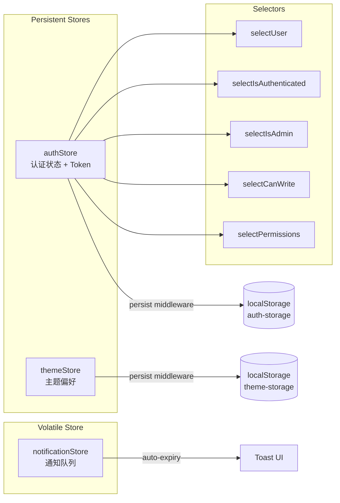
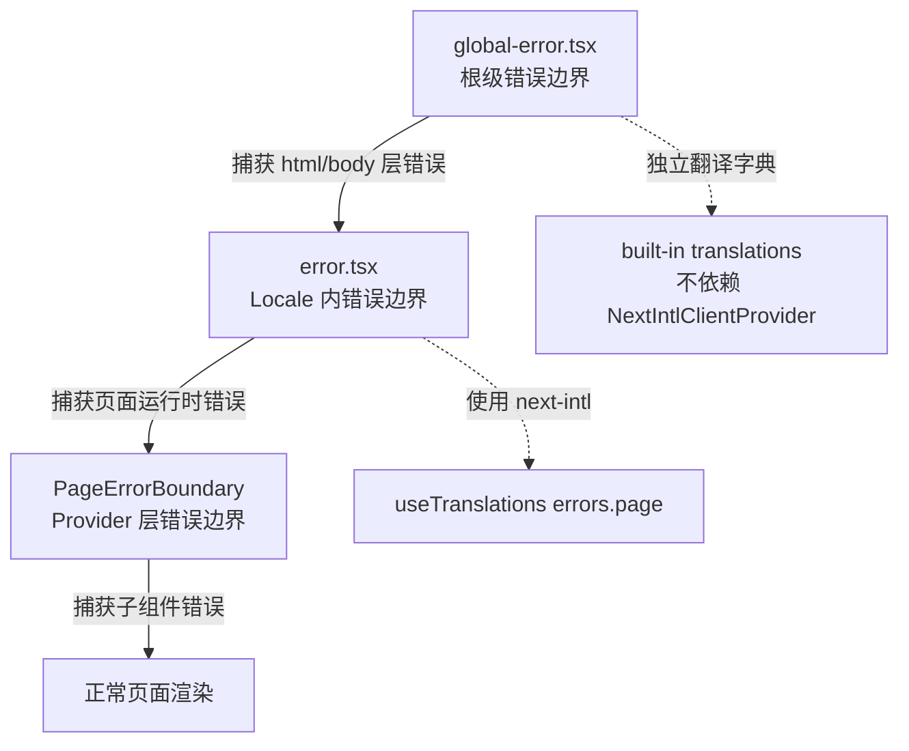

SOC Copilot 前端基于 **Next.js 16 (App Router)** 构建，采用 `next-intl` 实现中英双语国际化，通过 **Zustand** 管理客户端全局状态，并以 **Tailwind CSS** 作为设计系统基础。本文将深入剖析三层核心架构——路由层（App Router + 中间件）、国际化层（next-intl + 命名空间 + 缓存）、状态管理层（Zustand + persist），并阐述它们之间的协作关系与数据流设计。内容面向已具备 React 基础的中级开发者，帮助你理解「为什么这样设计」以及「如何在此基础上扩展」。

Sources: [package.json](frontend/package.json#L1-L64)

## 架构总览：三层协作模型

前端架构的核心设计理念是 **关注点分层**：路由与国际化由 Next.js 服务端/边缘层处理，状态管理与 UI 交互由客户端 Zustand 承载，数据获取通过 React Query + 自定义缓存 Hook 完成。三层之间通过明确的接口契约协作，互不侵入。

```mermaid
graph TB
    subgraph "Edge / Server Layer"
        MW[middleware.ts<br/>Locale Detection & Redirect]
        RL[Root Layout<br/>app/layout.tsx]
        LL[Locale Layout<br/>app/[locale]/layout.tsx]
    end

    subgraph "Client Provider Layer"
        NIC[NextIntlClientProvider<br/>i18n Messages]
        RP[ResponsiveProvider]
        PEB[PageErrorBoundary]
        QP[QueryProvider<br/>React Query]
        TP[ToastProvider]
    end

    subgraph "State Management Layer"
        AS[AuthStore<br/>Zustand + persist]
        TS[ThemeStore<br/>Zustand + persist]
        NS[NotificationStore<br/>Zustand]
    end

    subgraph "Data Fetching Layer"
        AC[api-client.ts<br/>Retry + Token Injection]
        CH[useCachedQuery Hook<br/>TTL Cache + Invalidation]
        API[API Routes<br/>/api/proxy + /api/monitor/stream]
    end

    MW -->|locale param| LL
    RL --> LL
    LL --> NIC --> RP --> PEB --> QP --> TP
    QP -.->|provides queryClient| CH
    CH --> AC --> API
    AS -->|token| AC
    TS -->|dark class| LL
    NS -->|toast events| TP
```

**请求生命周期**：用户访问 URL → Edge Middleware 检测/注入 locale → Locale Layout 加载翻译消息 → Provider 链初始化（React Query、Toast、错误边界）→ 页面组件渲染 → 通过 `api-client` 发起带认证的数据请求 → 响应数据经 `useCachedQuery` 缓存后驱动 UI 更新。

Sources: [middleware.ts](frontend/middleware.ts#L1-L24), [app/[locale]/layout.tsx](frontend/app/[locale]/layout.tsx#L49-L92), [components/ClientLayout.tsx](frontend/components/ClientLayout.tsx#L1-L19)

## App Router 路由架构

### 双层 Layout 设计

项目采用 **根 Layout + Locale Layout** 的双层结构，这是 `next-intl` 在 App Router 下的标准模式：

| 层级 | 文件 | 职责 | 渲染环境 |
|------|------|------|----------|
| 根 Layout | `app/layout.tsx` | 最小化的 HTML 骨架，仅包裹 `<html>` 和 `<body>` | Server |
| Locale Layout | `app/[locale]/layout.tsx` | 加载翻译消息、注入 Provider 链、设置 viewport/themeColor | Server + Client |

根 Layout 被刻意保持极简——它只负责提供 HTML 外壳。所有实质性的初始化逻辑（国际化、主题、错误边界）都下沉到 `app/[locale]/layout.tsx` 中。这种设计确保了 locale 参数在完整组件树中始终可用。

Sources: [app/layout.tsx](frontend/app/layout.tsx#L1-L13), [app/[locale]/layout.tsx](frontend/app/[locale]/layout.tsx#L1-L92)

### Locale Layout 的核心职责

`app/[locale]/layout.tsx` 是整个前端最关键的初始化节点，它依次完成以下工作：

1. **静态参数生成**：通过 `generateStaticParams()` 预生成 `en` 和 `zh` 两个 locale 的静态路径，启用静态渲染优化
2. **Locale 校验**：从 `params` 中取出 locale 并校验，非法值直接触发 `notFound()`
3. **元数据生成**：使用 `getTranslations()` 从翻译文件中读取 `meta.title` 和 `meta.description`，实现 SEO 的国际化
4. **翻译消息注入**：调用 `getMessages()` 获取当前 locale 的完整翻译字典，通过 `NextIntlClientProvider` 分发给所有客户端组件
5. **Provider 链组装**：依次嵌套 `ResponsiveProvider`（响应式布局）、`PageErrorBoundary`（错误边界）、`ClientLayout`（React Query + Toast）

Sources: [app/[locale]/layout.tsx](frontend/app/[locale]/layout.tsx#L14-L92)

### 动态路由结构

`app/[locale]/` 目录下实现了完整的业务路由。所有页面路由都以 locale 为前缀（如 `/en/alerts`、`/zh/playbooks`），确保 URL 本身即是语言标识：

```
app/[locale]/
├── page.tsx                    # 首页仪表盘（告警分析、时间线、报告）
├── login/page.tsx              # 登录页
├── alerts/
│   ├── page.tsx                # 告警列表
│   └── [id]/page.tsx           # 告警详情（动态路由）
├── playbooks/
│   ├── page.tsx                # Playbook 运行列表
│   ├── definitions/page.tsx    # Playbook 定义
│   └── approvals/page.tsx      # 审批管理
├── ai-assistant/               # AI 助手（含独立子组件）
├── audit/                      # 审计日志（含虚拟滚动表格）
├── admin/                      # 管理后台（dashboard/users/settings/secrets/health）
├── settings/                   # 用户设置（AI 模型/API Key/通知）
├── threat-intel/               # 威胁情报
├── triggers/                   # 触发器（webhook/cron）
└── ...                         # 其他业务模块
```

值得注意的是 `app/api/` 目录：它不受 locale 中间件的影响（被 matcher 排除），专门用于 API 代理和 SSE 流转发。

Sources: [app/[locale]/page.tsx](frontend/app/[locale]/page.tsx#L1-L64), [app/[locale]/alerts/page.tsx](frontend/app/[locale]/alerts/page.tsx#L1)

### Edge Middleware：语言检测与重定向

`middleware.ts` 运行在 Edge Runtime，是每个请求的第一个拦截点。它的核心逻辑由 `next-intl/middleware` 提供：

```typescript
// middleware.ts 的核心配置
export default createMiddleware({
  locales: ["en", "zh"],       // 支持的语言
  defaultLocale: "en",         // 默认语言
  localePrefix: "always",      // 始终显示 /en 或 /zh 前缀
  localeDetection: true,       // 自动检测：cookie > Accept-Language
});
```

**语言检测优先级**：Cookie (`NEXT_LOCALE`) > 浏览器 `Accept-Language` 头。`localePrefix: "always"` 策略确保所有 URL 都携带语言前缀，避免内容重复（SEO 友好）。

**路由排除规则**：通过 `matcher` 排除了 API 路由（`/api/*`）、Next.js 内部路径（`_next/*`）、静态资源（图片、favicon 等），确保中间件只处理页面请求。

Sources: [middleware.ts](frontend/middleware.ts#L1-L24)

### API 路由层：BFF 代理模式

前端通过两种机制与后端通信，均遵循 **BFF（Backend for Frontend）** 模式：

**Next.js Rewrites**（声明式）：在 `next.config.js` 中配置，将 `/api/:path*` 静态代理到 `http://localhost:8000/api/:path*`。适用于常规的 REST API 请求。

**Route Handlers**（编程式）：当需要更精细的控制时使用。

| Route Handler | 用途 | 特殊处理 |
|---------------|------|----------|
| `app/api/proxy/[...path]/route.ts` | 全功能 CRUD 代理 | 支持 GET/POST/PUT/DELETE/PATCH，自动转发 Authorization 头 |
| `app/api/monitor/stream/route.ts` | SSE 流代理 | 将后端 `text/event-stream` 透传到前端，处理背压和连接断开 |

代理层的设计动机是 **规避 CORS 限制** 和 **统一认证令牌注入**。前端组件无需关心后端的实际地址，统一通过 `/api/` 前缀访问。

Sources: [next.config.js](frontend/next.config.js#L25-L32), [app/api/proxy/[...path]/route.ts](frontend/app/api/proxy/[...path]/route.ts#L1-L143), [app/api/monitor/stream/route.ts](frontend/app/api/monitor/stream/route.ts#L1-L83)

## i18n 国际化体系

### 技术选型：next-intl v4

项目选用 `next-intl`（v4.8.3）作为国际化方案，它在 Next.js App Router 环境下提供了 **服务端/客户端一体化** 的翻译体验。相比 `next-i18next`（基于 Pages Router），`next-intl` 的核心优势在于：

- 原生支持 App Router 的 Server Components
- 通过 `NextIntlClientProvider` 将翻译消息从服务端传递到客户端，避免重复请求
- 提供 `createNavigation()` 工厂函数，自动处理 locale 前缀的路由跳转

Sources: [package.json](frontend/package.json#L33)

### 配置架构：三文件协作

i18n 配置分散在三个文件中，各司其职：

| 文件 | 职责 | 导出内容 |
|------|------|----------|
| `i18n.ts`（根目录） | `next-intl` 的请求级配置入口，被 `next.config.js` 引用 | `locales`、`defaultLocale`、`getRequestConfig()` |
| `i18n/routing.ts` | 路由级配置，定义 locale 前缀策略和导航工具 | `Link`、`redirect`、`usePathname`、`useRouter` |
| `config/i18n.ts` | 共享配置常量，用于 UI 层的 locale 展示和工具函数 | `i18nConfig`、类型定义、辅助函数 |

**关键设计决策**：`i18n/routing.ts` 通过 `createNavigation(routing)` 重新导出了 `Link`、`useRouter` 等导航 API。这意味着组件中使用 `import { Link } from "@/i18n/routing"` 时，路由跳转自动携带正确的 locale 前缀，无需手动拼接。

Sources: [i18n.ts](frontend/i18n.ts#L1-L23), [i18n/routing.ts](frontend/i18n/routing.ts#L1-L11), [config/i18n.ts](frontend/config/i18n.ts#L1-L136)

### 翻译文件组织：命名空间分离

翻译资源采用 **单文件 + 分文件双轨制**：

- `messages/en.json` 和 `messages/zh.json`：包含所有核心翻译的**聚合文件**，是运行时的主入口
- `messages/en/` 和 `messages/zh/` 目录：按功能模块拆分的**细粒度翻译文件**（共 25 个命名空间），用于按需加载

```
messages/
├── en.json                    # 聚合翻译（运行时加载）
├── zh.json                    # 聚合翻译（运行时加载）
├── en/
│   ├── core.json              # 通用翻译（按钮、标签、操作）
│   ├── home.json              # 首页仪表盘
│   ├── login.json             # 登录页
│   ├── alerts.json            # 告警模块
│   ├── playbooks.json         # Playbook 引擎
│   ├── navigation.json        # 导航菜单
│   ├── audit.json             # 审计日志
│   ├── admin.json             # 管理后台
│   ├── settings.json          # 用户设置
│   ├── triggers.json          # 触发器
│   ├── threat-intel.json      # 威胁情报
│   ├── ai-assistant.json      # AI 助手
│   └── ...（共 25 个命名空间）
└── zh/
    └── ...（与 en 完全对称）
```

`i18n/namespaces.ts` 维护了一份路由到命名空间的映射表 `ROUTE_NAMESPACES`，用于按路由预加载翻译：

```typescript
// 每个路由需要哪些命名空间
export const ROUTE_NAMESPACES: Record<string, string[]> = {
  "/": ["home", "dashboard"],
  "/alerts": ["alerts"],
  "/alerts/[id]": ["alerts", "playbooks"],
  "/playbooks": ["playbooks"],
  // ... 25+ 路由映射
};
```

Sources: [i18n/namespaces.ts](frontend/i18n/namespaces.ts#L1-L79), [messages/en.json](frontend/messages/en.json#L1-L30)

### 翻译使用方式

在组件中使用翻译有两种模式，取决于组件的渲染环境：

**Server Component**（服务端组件）：
```typescript
import { getTranslations } from "next-intl/server";
const t = await getTranslations("home");
// t("title") → "SOC Copilot - Security Operations Center"
```

**Client Component**（客户端组件）：
```typescript
"use client";
import { useTranslations } from "next-intl";
const t = useTranslations("home");
// t("title") → 从 NextIntlClientProvider 注入的 messages 中读取
```

实际案例——首页的翻译使用展示了嵌套命名空间模式：`useTranslations("home")` 获取首页翻译，`useTranslations("stats")` 获取统计数据翻译，两者互不干扰。导航组件 `Navigation` 同时使用了 `useTranslations("navigation")` 和 `useTranslations("common")` 两个命名空间。

Sources: [app/[locale]/page.tsx](frontend/app/[locale]/page.tsx#L5-L42), [components/Navigation.tsx](frontend/components/Navigation.tsx#L37-L38)

### 语言切换：预加载 + 无闪烁

`LanguageSwitcher` 组件实现了一套完整的语言切换优化策略：

1. **后台预加载**：组件挂载时，自动预加载另一种语言的翻译资源（通过 `i18nCache.preloadLocale()`）
2. **Cookie 持久化**：切换时写入 `NEXT_LOCALE` Cookie（有效期 1 年），确保下次访问时 Edge Middleware 能直接匹配
3. **路由跳转**：调用 `router.push(pathname, { locale: newLocale })` 进行无刷新的语言切换
4. **状态指示**：通过绿色圆点标记已预加载的语言，切换中显示 Loading 动画

`i18n-cache.ts` 实现了 **内存 → localStorage → 网络** 的三级缓存架构，缓存有效期 7 天，带有请求去重（`loadingPromises` Map）和命中率统计。

Sources: [components/LanguageSwitcher.tsx](frontend/components/LanguageSwitcher.tsx#L1-L155), [lib/i18n-cache.ts](frontend/lib/i18n-cache.ts#L1-L60)

## Zustand 状态管理

### 为什么选择 Zustand

项目选用了 Zustand 而非 Redux/Context，核心考量如下：

| 维度 | Zustand | Redux | Context |
|------|---------|-------|---------|
| 样板代码 | 极少（单函数定义 store） | 多（actions/reducers/selectors） | 中等（Provider 嵌套） |
| 重渲染控制 | 内置 selector 浅比较 | 需要 `useSelector` + `reselect` | 需手动 memo 或拆分 Context |
| 中间件 | `persist`、`devtools` 开箱即用 | 需配置 middleware 链 | 无原生支持 |
| Bundle 大小 | ~1KB | ~7KB | 0（内置） |
| SSR 兼容 | 支持（需注意 persist hydration） | 支持成熟 | 完全支持 |

Sources: [stores/index.ts](frontend/stores/index.ts#L1-L16)

### Store 架构一览

项目定义了三个独立的 Store，遵循 **单一职责** 原则：



Sources: [stores/authStore.ts](frontend/stores/authStore.ts#L1-L32), [stores/themeStore.ts](frontend/stores/themeStore.ts#L1-L15), [stores/notificationStore.ts](frontend/stores/notificationStore.ts#L1-L29)

### authStore：认证状态管理

`authStore` 是最复杂的 Store，管理着用户的完整认证生命周期。它通过 `zustand/middleware` 的 `persist` 中间件将关键状态持久化到 localStorage，实现刷新页面后自动恢复登录态。

**状态结构**：

| 字段 | 类型 | 说明 |
|------|------|------|
| `user` | `User \| null` | 用户信息（id、username、email、role、permissions） |
| `token` | `string \| null` | JWT Access Token |
| `isAuthenticated` | `boolean` | 是否已认证 |
| `isLoading` | `boolean` | 请求进行中标志 |
| `error` | `string \| null` | 最近一次错误消息 |

**Action 设计**：

- `login(username, password)`：调用 `/api/auth/login`，成功后同时将 token 存入 localStorage（兼容性）和 Zustand state，支持 `must_change_password` 强制改密重定向
- `logout()`：调用 `/api/auth/logout`（容忍失败），清除 localStorage 和 state，重定向到登录页
- `refreshToken()`：用 refresh_token 换取新的 access_token，失败时自动触发 logout
- `fetchUser()`：通过 `/api/auth/me` 校验当前 token 有效性，失败时触发 logout

**持久化策略**：使用 `partialize` 选择性持久化，仅保存 `token`、`user`、`isAuthenticated` 三个字段，避免将 `isLoading`、`error` 等瞬态数据写入磁盘。

**Selector 模式**：导出预定义的 selector 函数（`selectUser`、`selectIsAdmin` 等），组件通过 `useAuthStore(selectIsAdmin)` 的方式使用，确保只有相关状态变化时才触发重渲染。

Sources: [stores/authStore.ts](frontend/stores/authStore.ts#L41-L225)

### themeStore：主题偏好管理

`themeStore` 支持三种主题模式：`light`、`dark`、`system`。核心逻辑：

1. `setTheme(theme)` 更新状态后，立即操作 `document.documentElement.classList` 切换 Tailwind 的 `dark` 类
2. `getEffectiveTheme()` 将 `system` 模式解析为实际的 `light` 或 `dark`（通过 `window.matchMedia` 检测系统偏好）
3. 模块初始化时（非 React 生命周期内），直接从 localStorage 读取存储的主题并应用到 DOM，**避免首屏闪烁**

持久化 key 为 `theme-storage`，通过 `zustand/persist` 自动管理序列化和反序列化。

Sources: [stores/themeStore.ts](frontend/stores/themeStore.ts#L1-L74)

### notificationStore：通知队列

与前两个 Store 不同，`notificationStore` **不使用 persist**——通知是瞬态的。它实现了一个自动过期的通知队列：

- `addNotification()` 创建通知后，通过 `setTimeout` 在指定 `duration`（默认 5 秒）后自动移除
- 每个通知携带 `id`（随机生成）、`type`（success/error/warning/info）、`title`、`message`
- 额外导出 `notify` 便捷对象，支持 `notify.success(title, message)` 的调用方式，**无需在 React 组件内使用**（直接通过 `useNotificationStore.getState()` 访问）

这种「Store 外部访问」模式非常适合在 API 拦截器、WebSocket 回调等非组件场景中弹出通知。

Sources: [stores/notificationStore.ts](frontend/stores/notificationStore.ts#L31-L90)

### 认证架构：双轨策略

项目中存在两套认证工具：`stores/authStore.ts`（Zustand Store）和 `lib/auth.ts`（函数式工具库）。它们服务于不同的使用场景：

| 维度 | `stores/authStore.ts` | `lib/auth.ts` |
|------|----------------------|---------------|
| 架构模式 | Zustand Store（响应式） | 函数式工具（命令式） |
| 状态管理 | 自动触发 React 重渲染 | 手动调用 `loadAuthState()` |
| 存储策略 | Cookie 优先 + localStorage 备选 | Cookie 优先 + localStorage 备选 |
| 适用场景 | 需要响应式更新的组件 | 一次性认证检查（如页面守卫） |
| Token 刷新 | 内置 `refreshToken()` action | 内置于 API 拦截器 |

`lib/auth.ts` 实现了 **存储策略自动检测**（`detectStorageStrategy()`）：优先使用 HttpOnly Cookie（更安全），回退到 localStorage。它提供了 `login()`、`logout()`、`loadAuthState()`、`isAdmin()`、`isAnalystOrAdmin()` 等工具函数，被页面组件中的认证守卫广泛使用。

Sources: [lib/auth.ts](frontend/lib/auth.ts#L1-L60)

## 数据获取与缓存策略

### 双轨数据获取架构

前端同时使用了两套数据获取方案，按场景分工：

**React Query（@tanstack/react-query v5）**：通过 `QueryProvider` 全局注入，提供标准化的缓存管理、后台刷新和 DevTools 支持。`QueryProvider` 还实现了自动清理策略——当页面不可见且过期查询超过 50 个时，自动清理 10 分钟以上的陈旧缓存。

**自定义 `useCachedQuery` Hook**：基于 `lib/cache.ts` 的内存缓存实现，提供 TTL 过期、请求去重和手动失效。适用于 Playbook 运行、威胁情报等需要精细缓存控制的场景。

Sources: [components/providers/QueryProvider.tsx](frontend/components/providers/QueryProvider.tsx#L1-L106), [hooks/useCachedQuery.ts](frontend/hooks/useCachedQuery.ts#L1-L113)

### API Client：重试与认证

`lib/api-client.ts` 封装了全局 HTTP 客户端，核心特性包括：

- **指数退避重试**：最大 3 次重试，基础延迟 1 秒，最大延迟 10 秒，附加随机抖动（0-50%）
- **可重试状态码**：408、429、500、502、503、504
- **自动 Token 注入**：从 Cookie 或 localStorage 读取 access_token，附加到 `Authorization` 头
- **401 自动登出**：收到未授权响应时清除本地认证状态并重定向到登录页

Sources: [lib/api-client.ts](frontend/lib/api-client.ts#L1-L60)

## 错误处理体系

### 三级错误边界



- **`global-error.tsx`**：捕获根 Layout 层面的致命错误。由于它运行在 `NextIntlClientProvider` 之外，内置了一份独立的中英翻译字典，通过 URL 路径和 `localStorage` 检测 locale
- **`error.tsx`**：捕获 locale 范围内的运行时错误，可以使用 `useTranslations("errors.page")` 获取国际化错误消息
- **`PageErrorBoundary`**：包裹在 Provider 链中的 React Error Boundary，捕获业务组件的渲染错误

Sources: [app/global-error.tsx](frontend/app/global-error.tsx#L1-L42), [app/error.tsx](frontend/app/error.tsx#L1-L73)

## 设计系统与样式架构

### Tailwind CSS 配置

项目通过 `tailwind.config.ts` 扩展了完整的 **SOC Copilot 设计系统**：

| 扩展维度 | 内容 |
|----------|------|
| **品牌色** | `soc` 色板（50-950），基于 sky blue 的主色调 |
| **语义色** | `success`（绿）、`warning`（黄）、`danger`（红）、`info`（蓝） |
| **阴影** | `soft`、`card`、`elevated`、`glow` 系列（含 success/danger 变体）、`glass`、`neumorphic` 系列 |
| **动画** | 12 种自定义 keyframes（fadeIn、fadeInUp、slideInRight、shimmer、float 等），含交错延迟变体 |

### CSS 变量 + Design Tokens

`globals.css` 通过 CSS 变量定义了完整的 **亮色/暗色主题** 系统（`--color-surface`、`--color-text-primary` 等），与 `design-tokens.ts` 中的 JS 常量同步。`dark` 类切换（由 `themeStore` 控制）改变所有 CSS 变量的值，实现零闪烁的主题切换。

Sources: [tailwind.config.ts](frontend/tailwind.config.ts#L1-L191), [config/design-tokens.ts](frontend/config/design-tokens.ts#L1-L71), [app/globals.css](frontend/app/globals.css#L1-L74)

## 性能优化与安全加固

### 构建级优化

`next.config.js` 中配置了多项构建优化：

| 配置 | 效果 |
|------|------|
| `output: "standalone"` | 生成独立部署包，适合 Docker 容器化 |
| `experimental.optimizeCss` | 启用 CSS 优化（critters 内联关键 CSS） |
| `optimizePackageImports` | 对 `lucide-react`、`recharts`、`reactflow` 进行 tree-shaking |
| `compiler.removeConsole` | 生产环境移除 console.log（保留 error/warn） |
| 图片格式 | 优先 AVIF，回退 WebP |

### 安全 Headers

全局安全响应头包括：`X-Frame-Options: DENY`、`X-Content-Type-Options: nosniff`、`Content-Security-Policy`（限制 script/style/connect 来源）、`Referrer-Policy`、`Permissions-Policy`。API 路由额外配置了 CORS 头。

### Web Vitals 监控

`WebVitals` 组件自动采集 CLS、INP、LCP、FCP、TTFB 五项核心指标，开发环境输出到控制台，生产环境通过 `navigator.sendBeacon` 发送到 `/api/analytics/vitals`。

### Sentry 集成

当环境变量 `SENTRY_DSN` 存在时，`next.config.js` 自动启用 Sentry：隐藏 Source Map、自动追踪 React 组件名称、通过 `/monitoring` 隧道绕过广告拦截器。

Sources: [next.config.js](frontend/next.config.js#L7-L124), [components/WebVitals.tsx](frontend/components/WebVitals.tsx#L1-L43)

## 扩展指南

### 添加新的业务页面

1. 在 `app/[locale]/new-module/page.tsx` 创建页面组件
2. 在 `messages/en/` 和 `messages/zh/` 中添加对应的翻译命名空间文件
3. 在 `i18n/namespaces.ts` 的 `ROUTE_NAMESPACES` 中注册路由到命名空间的映射
4. 在聚合文件 `messages/en.json` 和 `messages/zh.json` 中追加翻译内容
5. 如需新的全局状态，在 `stores/` 目录创建独立的 Zustand Store

### 添加新的 Store

遵循项目现有模式：定义接口 → 使用 `create()(persist(...))` → 导出 selector → 在 `stores/index.ts` 中统一 re-export。对于不需要持久化的瞬态数据（如通知队列），省略 `persist` 中间件。

Sources: [stores/index.ts](frontend/stores/index.ts#L1-L16), [i18n/namespaces.ts](frontend/i18n/namespaces.ts#L3-L38)

## 延伸阅读

- [前后端整体架构与数据流设计](5-qian-hou-duan-zheng-ti-jia-gou-yu-shu-ju-liu-she-ji) — 理解前端如何与后端 API、WebSocket 协作
- [React Flow DAG 可视化编辑器](23-react-flow-dag-ke-shi-hua-bian-ji-qi-playbook-liu-cheng-bian-pai-ui) — Playbook 流程编排的前端实现细节
- [前端组件体系与自定义 Hooks 设计](24-qian-duan-zu-jian-ti-xi-yu-zi-ding-yi-hooks-she-ji) — UI 组件库和 Hooks 的设计模式
- [测试策略](26-ce-shi-ce-lue-dan-yuan-ce-shi-e2e-ce-shi-yu-playwright-pei-zhi) — 前端 Vitest 单元测试与 Playwright E2E 测试配置