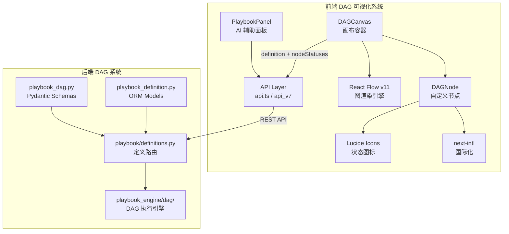
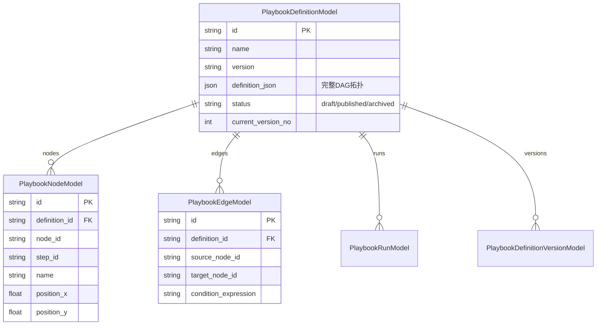

SOC Copilot 前端通过 React Flow 构建了一套 **DAG（有向无环图）可视化编辑器**，用于安全运营 Playbook 的流程编排与实时执行监控。该系统由三个核心组件构成：**DAGCanvas**（画布容器）、**DAGNode**（自定义节点）和 **PlaybookPanel**（AI 辅助面板），并与后端 DAG 引擎通过 REST API 实现完整的定义-执行-回溯闭环。本文将从组件架构、数据流设计、状态同步机制和国际化集成四个维度展开剖析。

Sources: [DAGCanvas.tsx](frontend/components/dag/DAGCanvas.tsx#L1-L26), [DAGNode.tsx](frontend/components/dag/DAGNode.tsx#L1-L16), [PlaybookPanel.tsx](frontend/components/playbook/PlaybookPanel.tsx#L1-L31)

## 组件架构总览

DAG 可视化编辑器采用**分层组件架构**：底层由 React Flow 提供图渲染能力，中间层是 `DAGCanvas` 封装的状态管理引擎，顶层是 `DAGNode` 自定义渲染器和 `PlaybookPanel` 业务面板。整个模块通过 `frontend/components/dag/index.ts` 统一导出，遵循 clean architecture 的依赖隔离原则。

```
┌─────────────────────────────────────────────────────────────┐
│                    页面层 (Page Layer)                        │
│  playbooks/page.tsx  │  playbooks/definitions/page.tsx       │
│  playbooks/approvals/page.tsx  │  alerts/[id]/page.tsx       │
├─────────────────────────────────────────────────────────────┤
│                 业务面板层 (Business Panel)                   │
│              PlaybookPanel (AI查询/修复建议)                   │
├─────────────────────────────────────────────────────────────┤
│                 DAG 可视化层 (DAG Visualization)              │
│  DAGCanvas (画布+状态同步)  │  DAGNode (节点渲染+状态图标)      │
├─────────────────────────────────────────────────────────────┤
│                 基础设施层 (Infrastructure)                   │
│  React Flow v11  │  Lucide Icons  │  next-intl i18n          │
└─────────────────────────────────────────────────────────────┘
```



Sources: [index.ts](frontend/components/dag/index.ts#L1-L4), [DAGCanvas.tsx](frontend/components/dag/DAGCanvas.tsx#L1-L18), [api.ts](frontend/lib/api.ts#L1069-L1097)

## DAGCanvas：画布容器与状态同步引擎

`DAGCanvas` 是整个 DAG 可视化系统的核心容器组件，基于 React Flow 的 `useNodesState` / `useEdgesState` Hook 管理图状态。它最关键的架构特征是**双模式运行**：**只读模式**（readonly=true）用于执行监控，**编辑模式**（readonly=false）用于流程编排。

### Props 接口设计

| Prop | 类型 | 说明 |
|------|------|------|
| `definition` | `{ nodes, edges }` | DAG 定义结构，支持后端原始格式和 ReactFlow Node 格式 |
| `nodeStatuses` | `Record<string, { status, duration, error, output }>` | 节点运行时状态映射 |
| `readonly` | `boolean` | 只读/编辑模式切换，默认 true |
| `onNodesChange` | `(nodes) => void` | 编辑模式下节点变更回调 |
| `onEdgesChange` | `(edges) => void` | 编辑模式下边变更回调 |
| `onConnect` | `(connection) => void` | 编辑模式下连线回调 |

Sources: [DAGCanvas.tsx](frontend/components/dag/DAGCanvas.tsx#L46-L76)

### 数据归一化：双格式适配

后端返回的 DAG 定义与 React Flow 期望的 Node/Edge 格式存在结构差异。`DAGCanvas` 通过 `DefinitionNode` / `DefinitionEdge` 接口实现**运行时格式探测**，自动适配两种数据源。对于后端格式，自动计算网格布局作为默认位置（`x = index % 3 * 300`, `y = floor(index / 3) * 150`），确保无坐标信息的节点也能合理展示。

```typescript
// 格式探测逻辑核心
const isReactFlowNode = "data" in node && "position" in node;
const rfNode = isReactFlowNode ? (node as Node) : null;
const defNode = isReactFlowNode ? null : (node as DefinitionNode);
```

这种**防御式编程**模式让同一组件能无缝处理 `api.getPlaybookDefinition()` 返回的后端数据（含 `step_id`, `position_x` 等字段）和 React Flow 编辑器直接产出的 `Node<NodeData>[]` 数据。

Sources: [DAGCanvas.tsx](frontend/components/dag/DAGCanvas.tsx#L137-L172)

### 幂等状态更新与无限循环防护

`DAGCanvas` 最复杂的设计在于 `nodeStatuses` 的实时同步。由于父组件频繁重新渲染可能产生新的对象引用（即使值未变），组件引入了 **状态哈希（Status Hash）** 机制：通过 `createStatusHash()` 函数将 `nodeStatuses` 的所有值序列化为确定性字符串，仅在哈希值实际变化时触发更新。

```typescript
function createStatusHash(statuses): string {
  return keys.sort()
    .map(key => `${key}:${s.status}:${s.duration ?? ""}:${s.error ?? ""}:${JSON.stringify(s.output ?? {})}`)
    .join("|");
}
```

配合 `useLayoutEffect` 中的**引用级相等性检查**（`return hasChanges ? newNodes : currentNodes`），当无实际变化时返回原始数组引用，避免 React 重新渲染。同时引入 `MAX_UPDATE_ITERATIONS = 100` 硬限制作为**无限循环保护**，在异常情况下主动中断更新链。

Sources: [DAGCanvas.tsx](frontend/components/dag/DAGCanvas.tsx#L82-L97), [DAGCanvas.tsx](frontend/components/dag/DAGCanvas.tsx#L257-L354)

### 边的动态样式

边（Edge）的颜色和动画效果会根据源节点的运行状态**自动变化**：运行中的节点输出边显示蓝色流动动画（`animated: true`），成功的节点输出边变为绿色，失败的为红色，其余保持灰色。这种视觉反馈让运维人员能**一眼识别执行路径和瓶颈**。

Sources: [DAGCanvas.tsx](frontend/components/dag/DAGCanvas.tsx#L318-L353)

## DAGNode：状态驱动的自定义节点

`DAGNode` 是注册到 React Flow 的自定义节点类型（`nodeTypes: { dagNode: DAGNode }`），通过 `statusConfig` 映射表实现了**六种节点状态的视觉差异化渲染**。

### 节点状态与视觉映射

| 状态 | 背景色 | 图标 | 含义 |
|------|--------|------|------|
| `pending` | 灰色 | 无 | 等待执行 |
| `running` | 蓝色 | Loader2 (旋转) | 执行中 |
| `success` | 绿色 | CheckCircle | 执行成功 |
| `failed` | 红色 | XCircle | 执行失败 |
| `skipped` | 灰色 | SkipForward | 已跳过 |
| `waiting_approval` | 黄色 | AlertTriangle | 等待人工审批 |

每个节点渲染区域包含四个信息层：**Header**（标签 + 状态图标）、**Step ID**（步骤标识）、**Duration**（执行耗时，带自动单位转换 ms/s/m）、**Error/Output**（失败时截断显示错误信息，成功时可展开查看 JSON 输出）。节点还配置为 `failed` 时额外展示错误摘要，`success` 时提供可展开的 `output` JSON 预览。

Sources: [DAGNode.tsx](frontend/components/dag/DAGNode.tsx#L17-L129)

### NodeData 类型定义

```typescript
export type NodeData = {
  label: string;           // 节点显示名称
  stepId: string;          // 步骤标识（对应后端 step_id）
  status: "pending" | "running" | "success" | "failed" | "skipped" | "waiting_approval";
  duration?: number;       // 执行耗时（毫秒）
  error?: string;          // 错误信息
  output?: Record<string, any>;  // 输出数据
};
```

该类型通过 `index.ts` 统一导出，供外部页面组件构建 `nodeStatuses` 映射时使用。`stepId` 字段是前后端关联的关键桥梁——后端 `PlaybookNodeRunModel` 的 `step_id` 字段通过 API 返回后，被映射为前端 `NodeData.stepId`。

Sources: [DAGNode.tsx](frontend/components/dag/DAGNode.tsx#L8-L15), [index.ts](frontend/components/dag/index.ts#L1-L4)

## PlaybookPanel：AI 辅助的查询与修复面板

`PlaybookPanel` 是嵌入到告警分析器和时间线构建器中的辅助组件，通过 AI 服务为安全分析师自动生成**多平台查询语句**和**分级修复建议**。它与 DAG 可视化互补：DAGCanvas 负责"编排和监控"，PlaybookPanel 负责"智能建议"。

### 双 Tab 交互模式

| Tab | 功能 | 数据源 | 输出 |
|-----|------|--------|------|
| **Queries** | 基于 IOC 生成平台查询 | `api.generatePlaybookQueries()` | Splunk SPL / Elastic KQL / Sentinel KQL 查询 |
| **Actions** | 基于 historyId 生成修复建议 | `api.generateRemediationActions()` | 分优先级的修复动作（含步骤/验证/回滚） |

Queries 模式支持三个 SIEM 平台（Splunk、Elastic KQL、Sentinel KQL）和三种时间范围（1h/24h/7d），生成的查询结果包含名称、描述、前置条件、期望字段等完整元数据。Actions 模式提供三种安全策略等级（safe/moderate/aggressive），每个修复建议携带风险等级、分类（containment/eradication/recovery）、优先级排序以及完整的回滚方案。

Sources: [PlaybookPanel.tsx](frontend/components/playbook/PlaybookPanel.tsx#L32-L100), [PlaybookPanel.tsx](frontend/components/playbook/PlaybookPanel.tsx#L254-L365)

### 集成位置

`PlaybookPanel` 在两处业务页面中被引用：

- **AlertAnalyzerTab**：告警分析完成后，自动以 `module="analyzer"` 注入面板，分析师可立即基于提取的 IOC 生成查询
- **TimelineBuilderTab**：时间线分析完成后，以 `module="timeline"` 注入，上下文切换为时间线视角

Sources: [AlertAnalyzerTab.tsx](frontend/components/tabs/AlertAnalyzerTab.tsx#L15-L220), [TimelineBuilderTab.tsx](frontend/components/tabs/TimelineBuilderTab.tsx#L12-L174)

## 前后端数据契约

DAG 可视化系统的前后端交互围绕三个核心 API 端点展开，由 `frontend/lib/api.ts` 中的 `api` 对象和 `api_v7` 对象封装。

### API 调用链路

| 前端方法 | 后端端点 | 用途 |
|----------|----------|------|
| `api.getPlaybookDefinition(id)` | `GET /api/playbook-definitions/{id}` | 获取 DAG 定义（含 nodes/edges） |
| `api.executeDAGDefinition(id, mode)` | `POST /api/playbook-definitions/{id}/run` | 执行 DAG |
| `api.getPlaybookRunNodes(runId)` | `GET /api/playbook-definitions/runs/{runId}/nodes` | 获取节点执行状态 |
| `api_v7.listDefinitions()` | `GET /api/playbook-definitions` | 列出所有定义 |
| `api_v7.runDAGPlaybook(id, data)` | `POST /api/playbook-definitions/{id}/run` | v0.7+ 执行接口 |
| `api_v7.getDAGRunNodes(runId)` | `GET /api/playbook-definitions/runs/{runId}/nodes` | v0.7+ 节点详情 |

后端返回的 DAG 定义结构遵循 `DAGSchema`（包含 `NodeSchema[]` 和 `EdgeSchema[]`），每个节点具有 `id`, `name`, `type`, `config`, `inputs_template`, `outputs_mapping` 等字段。前端通过 `definition_json` 兼容字段和 `dag` 主字段的**双字段适配策略**确保向后兼容。

Sources: [api.ts](frontend/lib/api.ts#L969-L1066), [api.ts](frontend/lib/api.ts#L1147-L1256), [playbook_dag.py](backend/schemas/playbook_dag.py#L10-L76), [definitions.py](backend/routers/playbook/definitions.py#L150-L295)

### 后端数据模型映射

后端 `PlaybookDefinitionModel` 通过 `definition_json` JSON 字段存储完整的 DAG 拓扑（nodes + edges），同时通过关联表 `PlaybookNodeModel` 和 `PlaybookEdgeModel` 存储规范化后的节点/边定义（含 `position_x`, `position_y` 坐标）。前端 `DAGCanvas` 的 `definition.nodes` 直接消费这两种数据源。



Sources: [playbook_definition.py](backend/models/playbook_definition.py#L20-L104)

## Playbook 页面体系

DAG 可视化编辑器嵌入在完整的 Playbook 页面体系中，该体系包含四个子页面：

| 页面 | 路由 | 职责 |
|------|------|------|
| **PlaybooksPage** | `/playbooks` | 运行历史列表 + 定义列表（双 Tab） |
| **DefinitionsPage** | `/playbooks/definitions` | 定义 CRUD 管理 |
| **ApprovalsPage** | `/playbooks/approvals` | 人工审批工作流 |
| **Playbook Detail** | `/playbooks/[id]` | 运行详情 + DAG 可视化 |

`PlaybooksPage` 通过自定义 Hook `usePlaybooks` 统一管理数据加载、分页、筛选和自动刷新（每 10 秒轮询队列状态）。它集成了键盘快捷键（`R` 刷新、`/` 聚焦搜索、`1/2` 切换 Tab），体现了安全运营场景下的**效率优先设计**。

Sources: [page.tsx](frontend/app/[locale]/playbooks/page.tsx#L29-L110), [usePlaybooks.ts](frontend/app/[locale]/playbooks/hooks/usePlaybooks.ts#L36-L165), [definitions/page.tsx](frontend/app/[locale]/playbooks/definitions/page.tsx#L40-L111), [approvals/page.tsx](frontend/app/[locale]/playbooks/approvals/page.tsx#L44-L174)

## 国际化集成

所有面向用户的文本均通过 `next-intl` 的 `useTranslations` Hook 实现**命名空间级国际化**。DAG 相关组件使用的翻译命名空间包括：

- **`dag`**：DAG 节点的输出标签（如 `t("output")`）
- **`playbooks`**：Playbook 页面的完整 UI 文案（标题、Tab、状态、筛选器等）
- **`playbookPanel`**：AI 辅助面板的查询和修复建议相关文案
- **`common`**：通用操作（复制、刷新、加载等）

中文翻译示例（摘自 `messages/zh.json`）：
- `playbooks.dag`: "DAG可视化"
- `playbooks.tabs.dag`: "DAG"
- `playbooks.statuses.running`: "运行中"
- `playbookPanel.tabs.queries`: "查询"

Sources: [DAGNode.tsx](frontend/components/dag/DAGNode.tsx#L7-L57), [zh.json](frontend/messages/zh.json#L413-L483), [zh.json](frontend/messages/zh.json#L1492-L1520)

## 动态加载策略

由于 `DAGCanvas` 约 500 行代码且依赖 `reactflow` 库（整个 React Flow 包约 200KB+），项目规划了基于 `next/dynamic` 的**懒加载策略**。该组件仅在 Playbook 编辑/详情页面按需加载，避免对首页和告警列表等高频页面的首屏性能产生影响。

```typescript
const DAGCanvas = dynamic(
  () => import('./dag/DAGCanvas'),
  {
    loading: () => (
      <div className="w-full h-[600px] flex items-center justify-center">
        <Skeleton className="h-[600px] w-full" />
      </div>
    ),
  }
);
```

Sources: [FRONTEND_CODE_SPLITTING_GUIDE.md](frontend/FRONTEND_CODE_SPLITTING_GUIDE.md#L207-L240)

## E2E 测试覆盖

DAG 可视化系统在 `frontend/e2e/playbooks/playbook.spec.ts` 中定义了专门的测试套件 **"Playbook DAG Visualization"**，覆盖三个核心场景：

1. **DAG 画布渲染**：验证 `dag-canvas` 和 `dag-node` 元素正确显示
2. **执行路径高亮**：验证已完成节点的 `data-status="completed"` 标记
3. **缩放与平移**：验证 Zoom in/out/Reset 控件的可操作性

Sources: [playbook.spec.ts](frontend/e2e/playbooks/playbook.spec.ts#L198-L249)

## 延伸阅读

- 要了解 DAG 执行引擎的完整后端实现（节点插件、状态机、重试策略），参阅 [Playbook DAG 工作流引擎：节点插件、状态机与执行队列](10-playbook-dag-gong-zuo-liu-yin-qing-jie-dian-cha-jian-zhuang-tai-ji-yu-zhi-xing-dui-lie)
- 要了解前端整体的架构设计（App Router、Zustand 状态管理），参阅 [Next.js 前端架构：App Router、i18n 国际化与 Zustand 状态管理](22-next-js-qian-duan-jia-gou-app-router-i18n-guo-ji-hua-yu-zustand-zhuang-tai-guan-li)
- 要了解前端组件体系和自定义 Hooks 的设计模式，参阅 [前端组件体系与自定义 Hooks 设计](24-qian-duan-zu-jian-ti-xi-yu-zi-ding-yi-hooks-she-ji)
- 要了解触发器系统如何与 DAG Playbook 定义关联，参阅 [触发器系统：Webhook 与 Cron 定时任务的自动化集成](11-hong-fa-qi-xi-tong-webhook-yu-cron-ding-shi-ren-wu-de-zi-dong-hua-ji-cheng)