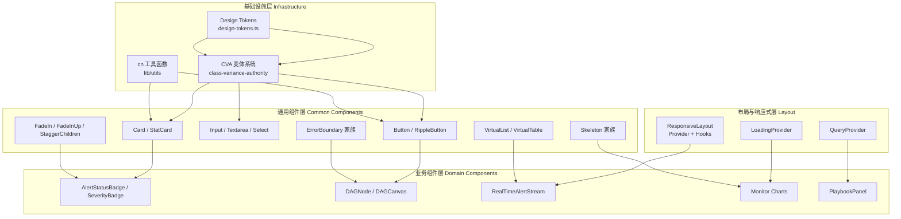
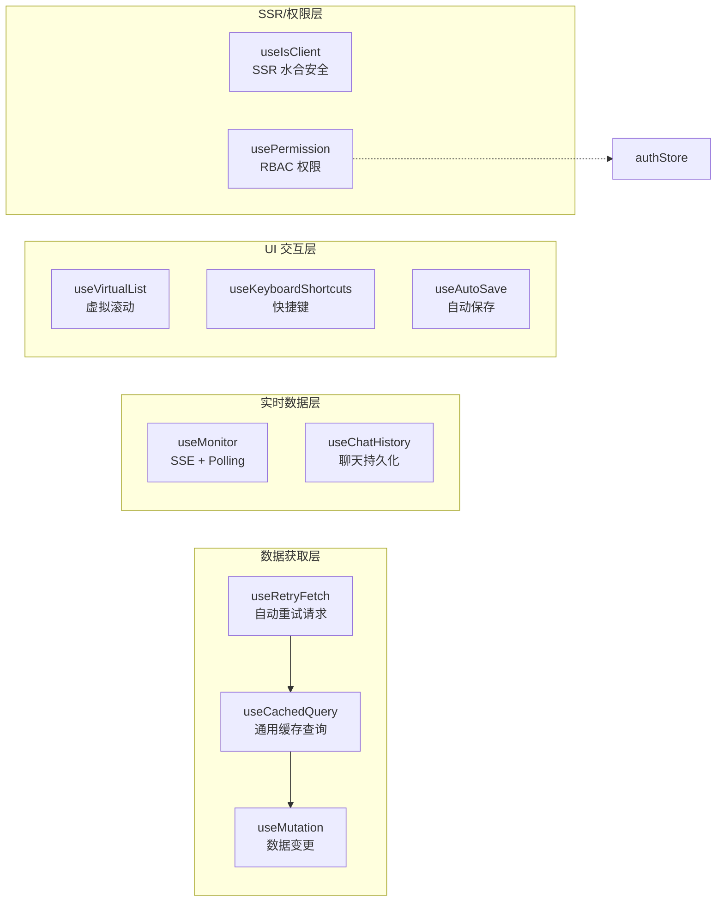
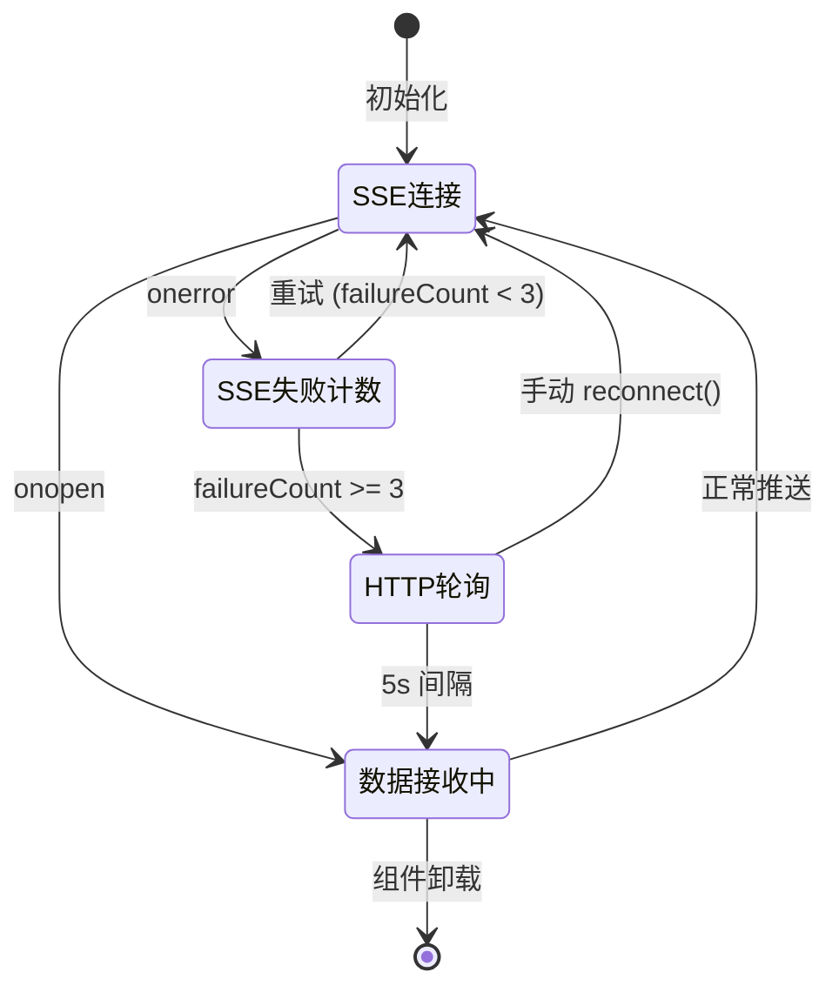

SOC Copilot 前端基于 **分层组件架构 + 领域驱动 Hook** 的设计理念，将 UI 表现层与业务逻辑层彻底解耦。通用组件层提供跨业务复用的基础构建块，领域组件层承载安全运营场景特有的交互逻辑，自定义 Hooks 层封装数据获取、状态管理和副作用控制的核心范式。三者通过统一的导出索引（barrel exports）与类型契约协同工作，形成一套可预测、可测试的前端工程体系。本页将深入剖析每一层的设计动机、实现模式与组合方式，帮助开发者在理解架构全貌的基础上高效参与前端开发。

Sources: [index.ts](frontend/components/common/index.ts#L1-L54), [index.ts](frontend/hooks/index.ts#L1-L17), [index.ts](frontend/stores/index.ts#L1-L16)

## 组件体系总览

前端组件按职责分为四层，从底层基础设施到顶层业务界面逐级构建：



Sources: [design-tokens.ts](frontend/config/design-tokens.ts#L1-L71), [Button.tsx](frontend/components/common/Button.tsx#L14-L41), [Card.tsx](frontend/components/common/Card.tsx#L10-L34)

## 设计系统基础：Design Tokens 与 CVA 变体模式

### 集中式 Design Tokens

设计系统的基石是 `DESIGN_TOKENS` 常量对象，它以 TypeScript `as const` 断言定义了全局统一的圆角、间距、过渡动画、阴影层级、z-index 栈和断点值。所有组件不直接硬编码样式数值，而是通过类型安全的 token 引用保证视觉一致性。

| Token 类别 | 典型值 | 用途示例 |
|---|---|---|
| `borderRadius` | `xs: 0.25rem` ~ `full: 9999px` | 按钮、卡片、徽章的圆角 |
| `spacing` | `xs: 0.25rem` ~ `3xl: 4rem` | 组件内外边距 |
| `transitions` | `fast: 150ms` / `base: 200ms` / `slow: 300ms` | 交互反馈动画时长 |
| `shadows` | `soft` / `card` / `elevated` | 卡片层级视觉表达 |
| `zIndex` | `dropdown: 50` ~ `tooltip: 800` | 弹层堆叠顺序 |
| `breakpoints` | `sm: 640px` ~ `2xl: 1536px` | 响应式布局断点 |

Sources: [design-tokens.ts](frontend/config/design-tokens.ts#L6-L61)

### CVA 变体驱动组件样式

项目采用 **class-variance-authority (CVA)** 作为组件样式的核心范式。每个组件定义一个 `cva()` 调用，声明 `variants`（变体维度）和 `defaultVariants`（默认值），组件 props 通过 `VariantProps<typeof xxxVariants>` 自动推导类型。以 `Button` 为例：

```typescript
const buttonVariants = cva("基础样式类", {
  variants: {
    variant: { primary, secondary, ghost, danger, outline },
    size:    { sm, md, lg },
  },
  defaultVariants: { variant: "primary", size: "md" },
});
```

这种模式将 **样式决策从运行时条件判断转移到编译期类型约束**——开发者在 IDE 中即可获得完整的变体选项提示，而非在 className 字符串中手动拼接。`Card` 组件进一步展示了 CVA 的表达力，支持 `default / outlined / elevated / glass / neumorphic` 五种视觉风格与 `none / sm / md / lg` 四级内边距正交组合。

Sources: [Button.tsx](frontend/components/common/Button.tsx#L14-L41), [Card.tsx](frontend/components/common/Card.tsx#L10-L34)

## 通用组件层详解

### 表单组件族：Input / Textarea / Select

表单组件族共享同一套 `inputVariants` CVA 定义，支持 `default / error / success` 三种校验状态和 `sm / md / lg` 三种尺寸。每个组件通过 `forwardRef` 暴露底层 DOM 引用，支持第三方表单库（如 React Hook Form）的 `ref` 绑定模式。关键设计特征包括：

- **统一的错误处理模式**：`error` prop 同时驱动视觉变体切换（`effectiveVariant`）和 ARIA 无障碍标记（`aria-invalid`）
- **自适应 ID 生成**：未显式传入 `id` 时自动生成随机 ID，确保 `<label>` 的 `htmlFor` 始终有效关联
- **图标插槽**：`leftIcon` / `rightIcon` 通过绝对定位叠加，不影响输入框的 focus 边框计算

Sources: [Input.tsx](frontend/components/common/Input.tsx#L16-L39), [Input.tsx](frontend/components/common/Input.tsx#L57-L112)

### 骨架屏系统：Skeleton 家族

骨架屏组件不是简单的灰色矩形——它是一个 **上下文感知的占位系统**，为每种 UI 模式提供精确的加载预览：

| 组件 | 参数 | 适用场景 |
|---|---|---|
| `Skeleton` | `width`, `height`, `rounded`, `animate` | 基础占位块 |
| `SkeletonText` | `lines`, `lastLineWidth` | 文本段落（末行缩短） |
| `SkeletonAvatar` | `size: sm/md/lg/xl` | 用户头像 |
| `SkeletonCard` | `hasHeader`, `hasAvatar`, `lines` | 信息卡片 |
| `SkeletonTable` | `rows`, `columns`, `hasHeader` | 数据表格 |
| `SkeletonList` | `items`, `hasAvatar`, `hasSecondaryText` | 列表视图 |
| `SkeletonPlaybookRun` | — | Playbook 运行卡片 |
| `SkeletonChart` | `type: bar/line/pie/area` | 图表区域 |
| `SkeletonStatGrid` | `cols` | 统计数据网格 |
| `SkeletonPage` | — | 整页骨架 |

这种分形设计确保了加载态与内容态在视觉结构上的 **一一对应**，避免了传统 loading spinner 导致的布局抖动（CLS）。

Sources: [Skeleton.tsx](frontend/components/common/Skeleton.tsx#L23-L275)

### 错误边界：ErrorBoundary 家族

React 的错误边界（Error Boundary）只能通过类组件实现，因此项目提供了三个层级的边界组件：

- **`ErrorBoundary`**：通用基础组件，接受 `fallback` 自定义 UI 和 `onError` 回调，集成 Sentry 错误上报，开发模式下展示完整错误堆栈
- **`PageErrorBoundary`**：页面级全屏错误展示，提供刷新按钮
- **`CardErrorBoundary`**：卡片级轻量错误，显示 "This section failed to load" 的内联提示

同时提供 `withErrorBoundary` 高阶组件（HOC），用于在不修改组件结构的情况下快速包裹第三方或高风险组件。

Sources: [ErrorBoundary.tsx](frontend/components/common/ErrorBoundary.tsx#L24-L167), [ErrorBoundary.tsx](frontend/components/common/ErrorBoundary.tsx#L172-L222)

### 虚拟滚动：VirtualList 与 VirtualTable

针对安全运营场景中海量告警数据的渲染需求，项目实现了两套虚拟滚动方案。**`VirtualList`** 组件是更高级的实现，支持可变行高（通过 `ResizeObserver` 测量）、二分查找定位可见区间、滚动到底部自动加载更多数据（infinite scroll）以及自定义空状态和加载更多指示器。**`VirtualTable`** 则专注于固定行高的表格场景，以更简洁的计算逻辑换取更高的滚动帧率。

两者的共同设计原则是 **只渲染视口内可见的 DOM 节点**。以 10000 条告警为例，实际 DOM 节点数始终控制在 `可见行数 + 2 × overscan` 的范围内，内存占用从 O(n) 降至 O(1)。

Sources: [VirtualList.tsx](frontend/components/common/VirtualList.tsx#L36-L200), [VirtualTable.tsx](frontend/components/common/VirtualTable.tsx#L23-L145)

### 响应式布局系统

`ResponsiveProvider` 通过 Context API 向整棵组件树注入视口信息（`isMobile / isTablet / isDesktop`、`breakpoint`、`orientation`、`touchDevice`），同时提供了三个声明式布局组件：

- **`ResponsiveWrapper`**：为不同断点渲染不同内容（`mobile` / `tablet` / `desktop` prop）
- **`HideOn`** / **`ShowOn`**：在指定断点隐藏或显示子内容
- **`TouchTarget`**：为触控设备自动添加 44px 最小点击区域

Sources: [ResponsiveLayout.tsx](frontend/components/common/ResponsiveLayout.tsx#L40-L160)

### 动画过渡组件

`FadeIn`、`FadeInUp` 和 `StaggerChildren` 三个组件构成了一套轻量的入场动画系统。通过 `delay` 和 `duration` 参数控制时序，`StaggerChildren` 自动为子元素分配递增延迟，实现错落有致的入场效果。这套组件不依赖 CSS 动画库，纯粹通过 inline style 的 `transition` 属性实现，确保与 SSR 渲染兼容。

Sources: [FadeIn.tsx](frontend/components/common/FadeIn.tsx#L17-L112)

### 重试状态指示器

`RetryIndicator` / `RetryBadge` / `RetryOverlay` 三个组件覆盖了从内联提示到全屏遮罩的重试 UI 需求。它们消费 `useRetryFetch` Hook 产出的 `RetryState` 对象，实时显示剩余重试次数、倒计时和进度条，为网络不稳定场景提供一致的用户反馈。

Sources: [RetryIndicator.tsx](frontend/components/common/RetryIndicator.tsx#L17-L218)

## 自定义 Hooks 设计体系

Hooks 是前端业务逻辑的 **原子化封装单元**。每个 Hook 遵循"单一职责、显式状态、可控副作用"的设计原则，返回值统一为 `{ data, isLoading, error, ...actions }` 的结构化模式。



Sources: [useCachedQuery.ts](frontend/hooks/useCachedQuery.ts#L38-L113), [useRetryFetch.ts](frontend/hooks/useRetryFetch.ts#L51-L157), [usePermission.ts](frontend/hooks/usePermission.ts#L1-L14)

### useCachedQuery：带缓存的通用数据查询

这是前端最核心的数据获取 Hook，实现了类 React Query 的功能但保持了零外部依赖的轻量化：

**核心机制**：

| 特性 | 实现方式 | 默认值 |
|---|---|---|
| TTL 缓存 | `apiCache.getOrFetch(key, fetcher, ttl)` | 5 分钟 |
| 请求去重 | 以 `key` 为粒度，同一 key 并发只发一次请求 | 自动 |
| 初始缓存加载 | `useState(() => apiCache.get(key))` 懒初始化 | 有缓存则跳过 loading |
| 后台刷新 | `refetchInterval` 参数驱动 `setInterval` | 关闭 |
| 缓存失效 | `invalidate()` / `cacheInvalidators` 工具函数 | 按需调用 |

**领域查询 Hook 矩阵**：

基于 `useCachedQuery` 封装了六个面向特定业务的查询 Hook，每个预设了最优的 TTL 和刷新策略：

| Hook | API 端点 | TTL | refetchOnMount |
|---|---|---|---|
| `usePlaybookRuns` | `/playbook/runs` | 30s | ✅ |
| `usePlaybookRun(id)` | `/playbook/runs/:id` | 60s | ❌ |
| `usePlaybookDefinitions` | `/playbook/definitions` | 60s | ✅ |
| `usePlaybookDefinition(id)` | `/playbook/definitions/:id` | 5min | ❌ |
| `useThreatIntel(ioc, type)` | `/threat-intel/:type/:ioc` | 10min | ❌ |
| `useAIModels` | `/ai/models` | 5min | ❌ |
| `useUserSettings` | `/users/me/settings` | 5min | ❌ |

**useMutation** 则作为写操作的对应物，在执行变更后自动调用 `invalidateKeys` 列表中指定的缓存清除，确保查询数据的最终一致性。

Sources: [useCachedQuery.ts](frontend/hooks/useCachedQuery.ts#L38-L246)

### useRetryFetch：带自动重试的请求执行器

`useRetryFetch` 定位于 **命令式请求场景**——与 `useCachedQuery` 的声明式查询不同，它由开发者通过 `execute(url, init)` 手动触发。核心设计考量包括：

- **请求竞态处理**：每次 `execute` 自动 `abort()` 上一次未完成的请求，通过 `AbortController` 管理请求生命周期
- **认证头注入**：自动从 `localStorage` 读取 `access_token` 并注入 `Authorization` 头
- **完整的状态返回**：`{ execute, data, error, isLoading, isRetrying, retryState, reset, cancel }`
- **并行版本**：`useRetryFetchParallel` 同时发起多个请求，独立追踪每个请求的加载和错误状态，最终通过 `Promise.allSettled` 汇总结果

Sources: [useRetryFetch.ts](frontend/hooks/useRetryFetch.ts#L51-L157), [useRetryFetch.ts](frontend/hooks/useRetryFetch.ts#L162-L249)

### useVirtualList：虚拟滚动 Hook

与 `VirtualList` 组件配套的 Hook 版本，提供更灵活的集成方式。核心算法基于 `scrollTop / itemHeight` 计算可见起止索引，加上 `overscan`（默认 5）的缓冲区。通过 `ResizeObserver` 监听容器高度变化，`scrollToIndex` 方法支持平滑滚动定位。返回值包含 `containerRef`、`virtualItems`（含 `style` 定位对象）、`totalHeight` 和 `startIndex / endIndex`，使开发者可以自由选择渲染容器。

Sources: [useVirtualList.ts](frontend/hooks/useVirtualList.ts#L20-L107)

### useAutoSave：表单自动保存

`useAutoSave` 解决了长表单编辑中的数据丢失风险，其防护机制是多层的：

1. **变更检测**：通过 `JSON.stringify` 比较前后数据，检测到变化后标记 `hasUnsavedChanges`
2. **Debounce 本地备份**：变更后延迟 2 秒写入 `localStorage`（key 为 `${key}_backup`），避免高频写入
3. **定时自动保存**：每 30 秒检查是否有未保存变更，有则触发 `saveFunction`
4. **页面关闭拦截**：`beforeunload` 事件在存在未保存变更时弹出浏览器确认对话框
5. **崩溃恢复**：`loadAutoSaveBackup(key)` 工具函数可在组件挂载时恢复上次备份

Sources: [useAutoSave.ts](frontend/hooks/useAutoSave.ts#L29-L168)

### useMonitor：SSE + HTTP 轮询双通道

系统监控场景需要实时数据推送，`useMonitor` 实现了 **SSE 优先、Polling 兜底** 的降级策略：



核心状态包括 `connectionType`（`sse / polling / disconnected`）、`connected`、`error`，以及通过 `fetchHistory(minutes)` 获取的历史时序数据。历史数据同时缓存到 `localStorage`，页面刷新后可即时恢复图表。

Sources: [useMonitor.ts](frontend/hooks/useMonitor.ts#L21-L200)

### useKeyboardShortcuts：全局快捷键

安全运营人员依赖键盘高效操作。`useKeyboardShortcuts` 接受 `Record<string, () => void>` 格式的快捷键映射，自动处理以下边界情况：

- **输入域屏蔽**：在 `<input>` / `<textarea>` / `contentEditable` 元素中不触发快捷键
- **白名单例外**：`Escape` / `Meta+Enter` / `Ctrl+Enter` 在输入域中依然生效
- **修饰键统一**：`Meta+` 前缀在 macOS 上映射为 ⌘，其他系统映射为 Ctrl
- **`COMMON_SHORTCUTS`**：预定义了 `r`(刷新)、`n`(新建)、`e`(编辑)、`/`(搜索)、`Escape`(关闭)、`Meta+k`(命令面板) 等通用快捷键

Sources: [useKeyboardShortcuts.ts](frontend/hooks/useKeyboardShortcuts.ts#L26-L99)

### usePermission：RBAC 权限检查

这是最精简但最关键的 Hook——仅 14 行代码，通过 `useAuthStore` 的 selector 读取当前用户信息，以 `useMemo` 缓存权限判断结果。逻辑清晰：admin 角色直接返回 `true`，否则检查用户 `permissions` 数组是否包含目标权限字符串。这种设计避免了在每个组件中重复编写权限判断逻辑，也确保了权限变更时的自动响应式更新。

Sources: [usePermission.ts](frontend/hooks/usePermission.ts#L1-L14)

### useIsClient：SSR 水合安全

Next.js App Router 的服务端渲染（SSR）环境中，`window`、`document`、`localStorage` 等浏览器 API 不可用。`useIsClient` 通过 `useEffect`（仅在客户端执行）设置标志位，`useClientOnlyValue` 则在此基础上提供双值选择——客户端返回 `clientValue`，服务端返回 `serverValue`，避免水合不匹配（hydration mismatch）警告。

Sources: [useIsClient.ts](frontend/hooks/useIsClient.ts#L5-L18)

### useChatHistory：AI 聊天历史持久化

AI 助手的聊天记录通过 `useChatHistory` 管理在 `localStorage` 中。该 Hook 提供完整的历史管理能力：创建会话、追加消息、加载历史、删除会话、重命名会话，以及基于标题和消息内容的全文搜索。会话数量上限为 50 条（`MAX_CONVERSATIONS`），标题从首条用户消息自动生成。每次操作后同步写入 `localStorage`，页面刷新后通过初始化 `useEffect` 自动恢复。

Sources: [useChatHistory.ts](frontend/hooks/useChatHistory.ts#L29-L200)

## 状态管理层：Zustand Stores

### authStore：认证状态

认证 Store 使用 `zustand/middleware` 的 `persist` 中间件，将 `user` 和 `token` 自动序列化到 `localStorage`。核心 Actions 包括 `login`（登录 + 存储令牌）、`logout`（清除令牌 + 重定向）、`refreshToken`（令牌刷新失败时自动登出）、`fetchUser`（获取当前用户信息）。同时导出 `selectUser`、`selectIsAuthenticated`、`selectIsAdmin`、`selectCanWrite`、`selectPermissions` 五个 selector 函数，供组件按需订阅最小状态切片。

Sources: [authStore.ts](frontend/stores/authStore.ts#L41-L200)

### themeStore：主题管理

支持 `light / dark / system` 三种主题模式，`persist` 中间件持久化用户选择。`getEffectiveTheme()` 方法在 `system` 模式下读取 `prefers-color-scheme` 媒体查询结果。模块初始化时（非组件内）立即读取 `localStorage` 并设置 `document.documentElement` 的 class，确保首屏无闪烁（FOUC-free）。

Sources: [themeStore.ts](frontend/stores/themeStore.ts#L17-L74)

### notificationStore：通知系统

最轻量的 Store，不使用 `persist`（通知无需跨会话保留）。`addNotification` 自动生成随机 ID 并设置定时自动移除（默认 5 秒）。导出的 `notify` 便捷对象提供 `notify.success()` / `notify.error()` / `notify.warning()` / `notify.info()` 四个静态方法，可在任何非组件上下文中直接调用。

Sources: [notificationStore.ts](frontend/stores/notificationStore.ts#L31-L90)

## Provider 层：应用级基础设施

### QueryProvider

基于 `@tanstack/react-query` 的 `QueryClientProvider` 封装，在组件挂载时预取常用查询数据，监听 `visibilitychange` 事件清理过期缓存（stale 超过 10 分钟的查询），订阅全局查询错误日志。

### LoadingProvider

通过 React Context 提供全局 `isLoading` 状态和 `loadingMessage`，配合 `useLoading()` Hook 供任意组件读取和设置加载状态。

Sources: [QueryProvider.tsx](frontend/components/providers/QueryProvider.tsx#L14-L106), [LoadingProvider.tsx](frontend/components/common/LoadingProvider.tsx#L19-L52)

## 业务组件设计模式

### 告警徽章组件：AlertStatusBadge / SeverityBadge

告警是 SOC 平台的核心数据实体。`AlertStatusBadge` 和 `SeverityBadge` 通过 **配置对象 + 泛型映射** 模式将视觉表现与数据解耦：`statusConfig` 和 `severityConfig` 分别定义了每种状态/级别的颜色、图标和样式类。国际化通过 `useTranslations("status")` / `useTranslations("severity")` 按命名空间加载翻译文本。`AlertCard` 组件进一步组合了两个徽章，形成完整的告警卡片。

Sources: [AlertStatusBadge.tsx](frontend/components/AlertStatusBadge.tsx#L20-L200)

### DAG 节点：DAGNode

Playbook DAG 编辑器的自定义节点，基于 React Flow 的 `NodeProps<NodeData>` 接口。`NodeData` 类型定义了 `label`、`stepId`、`status`（六种状态）、`duration`、`error`、`output` 等字段。`statusConfig` 为每种执行状态（`pending / running / success / failed / skipped / waiting_approval`）配置独立的背景色、边框色、文字色和图标。节点内嵌 Handle（连接点）、步骤 ID、耗时显示、错误提示和输出预览（可折叠的 `<details>` 元素）。

Sources: [DAGNode.tsx](frontend/components/dag/DAGNode.tsx#L8-L131)

### 实时告警流：RealTimeAlertStream

这是组件、Hook 和 Store 三层协作的典型范例。`WazuhAlertStream` 组件内部直接管理 WebSocket 连接生命周期（而非通过外部 Hook），使用 `useMemo` 优化过滤和统计计算，引用 `VirtualList` 组件实现大数据量渲染，通过 `useTranslations("wazuh.stream")` 和 `useTranslations("common")` 双命名空间加载国际化文本。整个组件体现了 **"胖组件 + 瘦全局"** 的局部状态管理策略——只有需要跨组件共享的状态才提升到 Store。

Sources: [RealTimeAlertStream.tsx](frontend/components/alerts/RealTimeAlertStream.tsx#L51-L200)

## 组件导出与组合规范

所有通用组件通过 `common/index.ts` 统一 re-export，同时导出 CVA 变体类型（如 `ButtonVariant`、`CardProps`），确保消费方可以：

```typescript
import { Button, type ButtonVariant } from "@/components/common";
```

Hooks 通过 `hooks/index.ts` 统一导出，Stores 通过 `stores/index.ts` 统一导出（含 selector 函数）。领域组件（`dag/`、`alerts/`、`monitor/` 等）各自维护独立的 `index.ts` 导出文件。这种 **桶式导出（barrel export）** 模式简化了导入路径，同时在重构内部结构时保持公共 API 稳定。

Sources: [index.ts](frontend/components/common/index.ts#L1-L54), [index.ts](frontend/hooks/index.ts#L1-L17), [index.ts](frontend/stores/index.ts#L1-L16)

## 组件与 Hooks 选择决策矩阵

面对特定开发需求时，参考以下决策矩阵选择合适的组件或 Hook：

| 场景 | 推荐 | 理由 |
|---|---|---|
| 标准数据展示 | `Card` / `StatCard` | CVA 变体 + 标准化布局 |
| 表单输入 | `Input` / `Textarea` / `Select` | 统一校验 + 错误处理 + forwardRef |
| 加载状态 | `Skeleton*` 家族 | 分形占位，避免 CLS |
| 大数据列表 | `VirtualList` + `useVirtualList` | O(1) DOM 渲染 |
| API 查询 | `useCachedQuery` + 领域 Hook | TTL 缓存 + 去重 + 后台刷新 |
| API 写入 | `useMutation` | 自动缓存失效 |
| 网络不稳定 | `useRetryFetch` + `RetryIndicator` | 自动重试 + UI 反馈 |
| 长表单编辑 | `useAutoSave` | 防丢失 + localStorage 备份 |
| 权限控制 | `usePermission` | 声明式 RBAC 检查 |
| 键盘操作 | `useKeyboardShortcuts` | 输入域屏蔽 + 修饰键适配 |
| SSR 安全渲染 | `useIsClient` + `useClientOnlyValue` | 防水合不匹配 |
| 错误隔离 | `ErrorBoundary` / `PageErrorBoundary` | Sentry 集成 + 降级 UI |

Sources: [useCachedQuery.ts](frontend/hooks/useCachedQuery.ts#L38-L113), [useRetryFetch.ts](frontend/hooks/useRetryFetch.ts#L51-L157), [useAutoSave.ts](frontend/hooks/useAutoSave.ts#L29-L100), [usePermission.ts](frontend/hooks/usePermission.ts#L4-L13)

## 延伸阅读

- 要了解前端架构的整体框架（App Router、i18n、路由设计），参见 [Next.js 前端架构：App Router、i18n 国际化与 Zustand 状态管理](22-next-js-qian-duan-jia-gou-app-router-i18n-guo-ji-hua-yu-zustand-zhuang-tai-guan-li)
- 要了解 DAG 编辑器的可视化编排机制，参见 [React Flow DAG 可视化编辑器：Playbook 流程编排 UI](23-react-flow-dag-ke-shi-hua-bian-ji-qi-playbook-liu-cheng-bian-pai-ui)
- 要了解 WebSocket 实时通信如何为告警流和监控面板提供数据支撑，参见 [WebSocket 实时通信：连接管理、频道订阅与离线消息队列](21-websocket-shi-shi-tong-xin-lian-jie-guan-li-pin-dao-ding-yue-yu-chi-xian-xiao-xi-dui-lie)