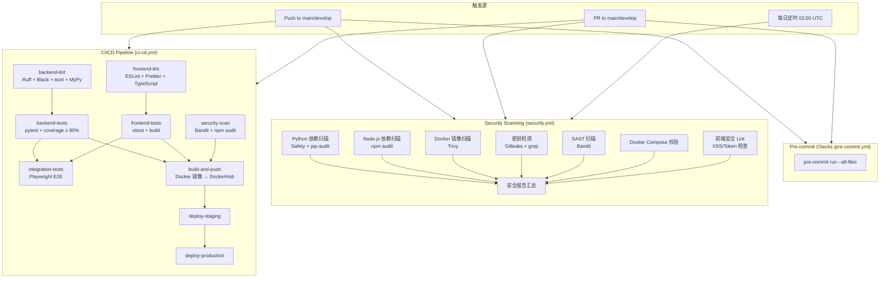
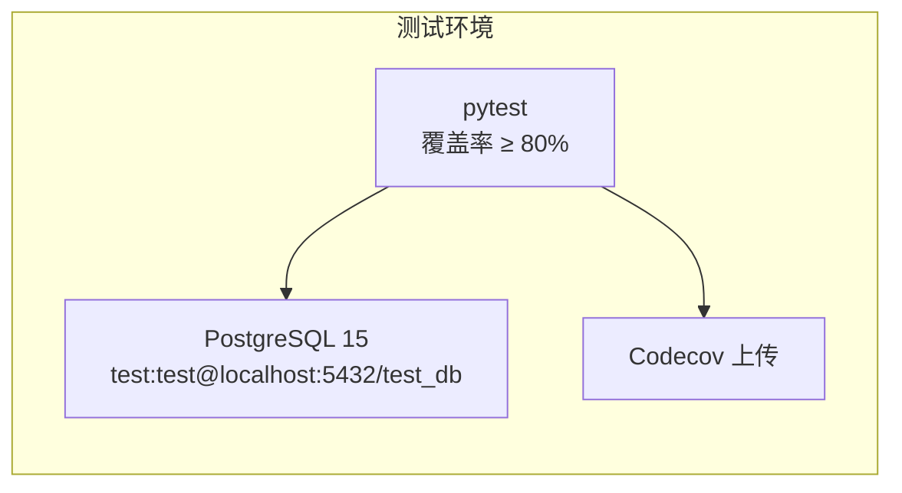
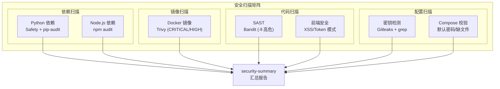
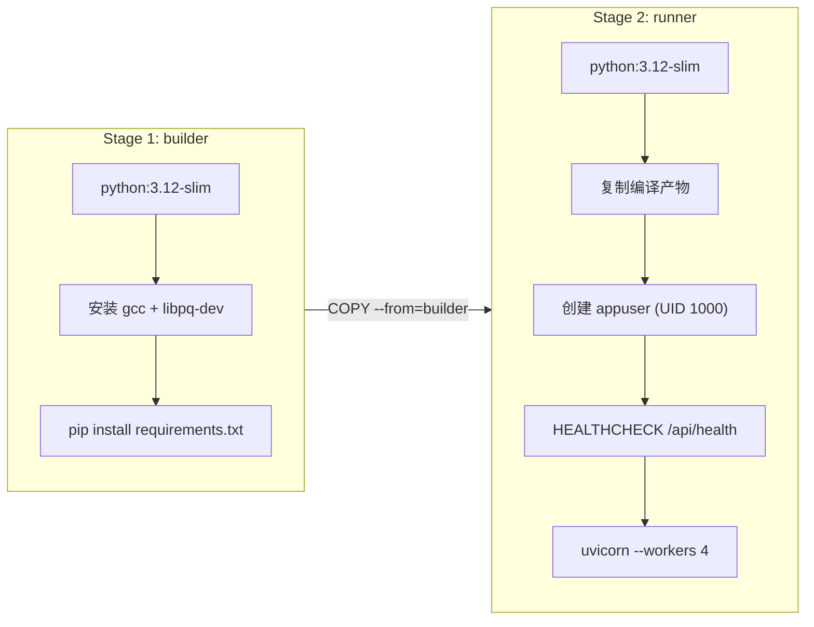

SOC Copilot 的 CI/CD 体系由 **三条 GitHub Actions 工作流**、**两套 pre-commit 钩子**、**多阶段 Docker 构建**以及**分级部署脚本**共同构成一个多层级质量门禁系统。从开发者在本地提交代码的那一刻起，到最终生产环境部署完成，每一环都有明确的检查规则和阻断条件。本文将逐一拆解这些自动化流程的触发机制、检查内容和部署策略，帮助你在日常开发中理解并高效利用这套体系。

Sources: [ci-cd.yml](.github/workflows/ci-cd.yml#L1-L326), [security.yml](.github/workflows/security.yml#L1-L284), [pre-commit.yml](.github/workflows/pre-commit.yml#L1-L38)

## 流水线整体架构

在深入每个细节之前，先建立对整个 CI/CD 管道的宏观认知。以下流程图展示了从代码推送到最终部署的完整路径，包括并行执行的检查阶段和串行依赖的部署阶段。



**阅读此图的关键要点**：三条工作流并行触发、互不阻塞。`ci-cd.yml` 负责代码质量与部署流水线，`security.yml` 负责全方位安全扫描，`pre-commit.yml` 负责在 CI 中复现本地 pre-commit 检查。其中 `ci-cd.yml` 内部存在严格的 Job 依赖链——lint 通过才能跑测试，测试和扫描都通过才能构建镜像，构建成功才能逐步部署。

Sources: [ci-cd.yml](.github/workflows/ci-cd.yml#L1-L326), [security.yml](.github/workflows/security.yml#L1-L284), [pre-commit.yml](.github/workflows/pre-commit.yml#L1-L38)

## 三条工作流的触发策略

每条工作流的触发条件经过精心设计，确保在合适的场景下以合适的频率运行，避免资源浪费的同时不遗漏关键检查。

| 工作流 | 触发条件 | 运行频率 | 目的 |
|--------|---------|---------|------|
| `CI/CD Pipeline` | push 到 `main`/`develop`；PR 到 `main`/`develop` | 每次提交/PR | 代码质量门禁 + 自动部署 |
| `Security Scanning` | push 到 `main`/`develop`；PR 到 `main`；**每日 02:00 UTC** | 每次提交 + 每日定时 | 安全漏洞持续监控 |
| `Pre-commit Checks` | push 到 `main`/`develop`；PR 到 `main`/`develop` | 每次提交/PR | 本地钩子的 CI 兜底 |

**设计要点**：安全扫描工作流额外增加了 `schedule` 定时触发和 `security-events: write` 权限声明，这使得每日凌晨能自动检测新披露的依赖漏洞，即使没有代码变更。而 CI/CD 流水线的 `build-and-push` 和部署阶段仅在 `main` 分支的 push 事件时触发，PR 合并请求只做检查不做部署。

Sources: [ci-cd.yml](.github/workflows/ci-cd.yml#L3-L8), [security.yml](.github/workflows/security.yml#L6-L13), [pre-commit.yml](.github/workflows/pre-commit.yml#L3-L8)

## 代码质量检查（Lint 阶段）

代码质量检查分为**后端 Lint** 和**前端 Lint** 两个并行 Job，各自覆盖从代码风格到类型安全的多个维度。

### 后端 Lint：四道检查关卡

后端 Lint Job 在 `backend-lint` 中依次执行四个检查工具，形成一条严密的代码质量防线：

| 检查工具 | 用途 | 失败时行为 |
|---------|------|-----------|
| **Ruff** | 快速语法检查（pycodestyle、Pyflakes、isort、bugbear 等规则集） | 尝试 `ruff check --fix` 自动修复并发出警告 |
| **Black** | Python 代码格式化（统一代码风格） | 尝试 `black backend/` 自动格式化并发出警告 |
| **isort** | import 语句排序 | 尝试 `isort backend/` 自动排序并发出警告 |
| **MyPy** | 静态类型检查 | 直接失败（不自动修复） |

后端 Lint 的规则配置独立维护在 [ruff.toml](backend/ruff.toml) 中，启用了 `E`（pycodestyle 错误）、`F`（Pyflakes）、`I`（isort）、`B`（bugbear）、`C4`（推导式优化）、`UP`（pyupgrade）等 11 类规则集。对于 FastAPI 常见的未使用参数（如依赖注入函数的 `db` 参数），通过 `ignore` 列表中的 `ARG001`、`ARG002` 进行了合理豁免。

**Ruff 配置的核心规则集一览**：

| 规则代码 | 来源 | 检查内容 |
|---------|------|---------|
| `E` | pycodestyle | 基础语法错误和风格问题 |
| `F` | Pyflakes | 未使用导入、未定义变量等逻辑错误 |
| `I` | isort | import 分组和排序 |
| `B` | flake8-bugbear | 常见编程错误模式（如可变默认参数） |
| `C4` | flake8-comprehensions | 推导式优化建议 |
| `UP` | pyupgrade | Python 版本升级相关的现代化语法 |
| `SIM` | flake8-simplify | 代码简化建议 |
| `TCH` | flake8-type-checking | TYPE_CHECKING 块优化 |
| `RUF` | Ruff 专用 | Ruff 特有的高级检查规则 |

Sources: [ci-cd.yml](.github/workflows/ci-cd.yml#L14-L62), [ruff.toml](backend/ruff.toml#L1-L69)

### 前端 Lint：三道检查关卡

前端 Lint Job 在 `frontend-lint` 中执行三个步骤：

| 检查工具 | 用途 | 失败时行为 |
|---------|------|-----------|
| **ESLint** | JavaScript/TypeScript 语法检查、React Hooks 规则、Next.js 最佳实践 | 尝试 `npm run lint:fix` 自动修复 |
| **Prettier** | 代码格式化（缩进、引号、尾逗号等） | 尝试 `npm run format` 自动格式化 |
| **TypeScript** | 类型检查（`tsc --noEmit`） | 直接失败 |

前端的 ESLint 规则配置在 [.eslintrc.json](frontend/.eslintrc.json) 中，扩展了 `next/core-web-vitals` 和 `next/typescript` 预设，额外启用了严格相等检查（`eqeqeq`）、花括号强制（`curly`）、禁止抛出字面量（`no-throw-literal`）等规则。Prettier 配置在 [.prettierrc](.prettierrc) 中定义了 100 字符行宽、双引号、ES5 尾逗号等统一格式标准。

**ESLint 自定义规则速查**：

| 规则 | 级别 | 说明 |
|------|------|------|
| `@typescript-eslint/no-unused-vars` | error | 禁止未使用变量（`_` 前缀除外） |
| `@typescript-eslint/no-explicit-any` | warn | 警告 `any` 类型使用 |
| `eqeqeq` | error | 强制使用 `===`/`!==` |
| `curly` | error | 强制花括号 |
| `no-throw-literal` | error | 禁止抛出非 Error 对象 |
| `@typescript-eslint/no-floating-promises` | warn | 警告未 await 的 Promise |
| `no-console` | warn | 警告 console 使用（允许 warn/error） |

Sources: [ci-cd.yml](.github/workflows/ci-cd.yml#L124-L167), [.eslintrc.json](frontend/.eslintrc.json#L1-L34), [.prettierrc](.prettierrc#L1-L15)

### 自动修复机制的设计意图

注意到 Ruff、Black、isort、ESLint、Prettier 在检查失败后都会尝试自动修复并发出 `::warning` 警告——这是一个**宽容但可见**的设计策略。CI 不会因为格式问题直接阻塞（自动修复步骤标记为 `if: failure()`），而是将修复后的代码差异展示在 CI 日志中，提醒开发者提交前在本地修复。相比之下，MyPy 和 TypeScript 类型检查不可自动修复，一旦失败直接阻断流水线。

Sources: [ci-cd.yml](.github/workflows/ci-cd.yml#L34-L56)

## 测试阶段：单元测试、覆盖率与 E2E

### 后端测试（backend-tests）

后端测试 Job 依赖 `backend-lint` 通过后才执行，使用 PostgreSQL 15 作为测试数据库服务容器。关键配置如下：



测试执行时注入三个关键环境变量：`DATABASE_URL` 指向测试 PostgreSQL 实例、`SECRET_KEY` 和 `JWT_SECRET` 使用 CI 专用测试值。pytest 命令启用了 `--cov-fail-under=80` 覆盖率阈值——覆盖率低于 80% 会直接导致 CI 失败。测试完成后覆盖率报告上传至 Codecov 服务。

后端测试的本地配置在 [pytest.ini](backend/pytest.ini) 中维护，定义了 9 种测试标记（`unit`、`integration`、`e2e`、`api`、`auth`、`ai`、`ti`、`playbook`、`audit` 等）和 `asyncio_mode = auto` 异步测试模式，覆盖率阈值在本地为 50%（渐进式目标），CI 中提升到 80%。

Sources: [ci-cd.yml](.github/workflows/ci-cd.yml#L64-L122), [pytest.ini](backend/pytest.ini#L1-L55)

### 前端测试（frontend-tests）

前端测试 Job 依赖 `frontend-lint` 通过后执行，包含 **构建验证** 和 **单元测试** 两个步骤。先执行 `npm run build` 确保前端代码能成功编译为生产包，然后使用 Vitest 运行测试。Vitest 配置在 [vitest.config.ts](frontend/vitest.config.ts) 中，使用 jsdom 环境、全局 API 模式，测试文件匹配 `__tests__/**/*.test.{ts,tsx}`。

Sources: [ci-cd.yml](.github/workflows/ci-cd.yml#L168-L194), [vitest.config.ts](frontend/vitest.config.ts#L1-L17)

### 集成测试（integration-tests）

集成测试 Job 在后端测试和前端测试都通过后执行，使用 Docker Compose 拉起完整的测试环境，等待 30 秒服务就绪后运行 Playwright E2E 测试。测试结果（HTML 报告和 JSON 结果）通过 `upload-artifact` 持久化，即使 Job 失败也能下载查看。

Playwright 配置在 [playwright.config.ts](frontend/playwright.config.ts) 中定义了 5 个浏览器项目（Desktop Chrome、Desktop Firefox、Desktop Safari、Mobile Chrome、Mobile Safari），CI 环境下自动启动开发服务器、启用 2 次重试、禁用并行执行，并在首次重试时收集 trace。

Sources: [ci-cd.yml](.github/workflows/ci-cd.yml#L224-L257), [playwright.config.ts](frontend/playwright.config.ts#L1-L90)

## 安全扫描体系

安全扫描是独立于 CI/CD 主流水线的并行工作流，由 **7 个扫描 Job** 和 **1 个汇总 Job** 组成，形成覆盖依赖、镜像、代码、配置和密钥的全方位安全网。



### 七个扫描 Job 详解

| Job | 扫描工具 | 扫描范围 | 严格程度 |
|-----|---------|---------|---------|
| **Python 依赖扫描** | Safety + pip-audit | `backend/requirements.txt` | `continue-on-error`（仅报告） |
| **Node.js 依赖扫描** | npm audit | `frontend/` 全部依赖 | `--audit-level=moderate`，`continue-on-error` |
| **Docker 镜像扫描** | Trivy | `python:3.12-slim` 基础镜像 | 仅报告 CRITICAL/HIGH |
| **密钥检测** | Gitleaks + grep | 全仓库（含完整 Git 历史） | Gitleaks `continue-on-error`；默认密码零容忍 |
| **SAST 扫描** | Bandit | `backend/` 全部 Python 代码 | 仅报告 HIGH/CRITICAL（`-ll`） |
| **Docker Compose 校验** | Shell 脚本 | docker-compose.yml、.dockerignore | 发现默认密码直接 `exit 1` |
| **前端安全 Lint** | ESLint + grep | 前端 TSX/TS 文件 | 检查 `dangerouslySetInnerHTML`、`localStorage` token |

**密钥检测的双重策略**值得特别关注：首先使用 Gitleaks 对完整 Git 历史（`fetch-depth: 0`）进行专业密钥扫描，然后用 grep 进行补充检查——对 `changeme`、`password123`、`admin123` 等常见默认密码零容忍（`exit 1`），对一般的硬编码密码模式仅发出警告。

Docker Compose 校验 Job 会检查 docker-compose.yml 中是否存在 `DB_PASSWORD:-changeme` 或 `SECRET_KEY:-your-secret` 等默认密码回退值，并验证 `.dockerignore` 文件在根目录、backend 和 frontend 三个位置都存在。

Sources: [security.yml](.github/workflows/security.yml#L20-L284)

### 安全报告汇总

所有 7 个扫描 Job 完成后（无论成功还是失败），`security-summary` Job 会生成一份 Markdown 格式的汇总表格，直接输出到 GitHub Actions 的 Step Summary 面板。每个扫描项的 Job 结果（`success`/`failure`/`cancelled`/`skipped`）都会被汇总为直观的状态表。

Sources: [security.yml](.github/workflows/security.yml#L258-L284)

## Pre-commit 钩子：本地第一道防线

SOC Copilot 维护两套 pre-commit 配置文件，分别在代码规范和安全检查两个维度为开发者提供本地即时反馈。

### 通用配置（.pre-commit-config.yaml）

[.pre-commit-config.yaml](.pre-commit-config.yaml) 配置了 6 类共 13 个钩子，覆盖前后端代码规范和通用文件检查：

| 类别 | 钩子 | 说明 |
|------|------|------|
| **Python 格式化** | Black (`python3.12`) | 统一代码格式 |
| **Python Lint** | Ruff (`--fix --exit-non-zero-on-fix`) | 自动修复 + 报错 |
| **Python 排序** | isort (`--profile black`) | import 分组排序 |
| **Python 类型** | MyPy (`--ignore-missing-imports`) | 静态类型检查 |
| **前端格式化** | Prettier (JS/JSX/TS/TSX/JSON/CSS) | 统一前端代码格式 |
| **前端 Lint** | ESLint (JS/JSX/TS/TSX) | 自动修复 |
| **通用** | trailing-whitespace, end-of-file-fixer | 去除行尾空白和添加末尾换行 |
| **通用** | check-yaml, check-json | YAML/JSON 语法检查 |
| **通用** | check-added-large-files (`1000KB`) | 禁止提交大文件 |
| **通用** | check-merge-conflict | 检测未解决的合并冲突标记 |
| **通用** | detect-private-key | 防止私钥文件被提交 |
| **通用** | mixed-line-ending | 统一行尾符 |

Sources: [.pre-commit-config.yaml](.pre-commit-config.yaml#L1-L64)

### 安全配置（.pre-commit-config-security.yaml）

[.pre-commit-config-security.yaml](.pre-commit-config-security.yaml) 是更严格的安全专用配置，增加了三个安全工具和两个自定义检查：

| 钩子 | 说明 | 严格程度 |
|------|------|---------|
| **Gitleaks** | 检测 Git 提交中的密钥泄露 | 扫描暂存区，自动脱敏输出 |
| **Bandit** | Python 安全 Lint（仅 HIGH/CRITICAL） | 排除测试文件和验证脚本 |
| **no-hardcoded-passwords** | 自定义：检测硬编码密码模式 | 排除 test/example 文件 |
| **no-default-credentials** | 自定义：检测 `changeme` 等默认密码 | 零容忍，匹配即失败 |
| **check-dockerignore** | 自定义：验证 .dockerignore 文件存在 | 缺少即失败 |
| **no-commit-to-branch** | 阻止直接提交到 `main` 分支 | 强制走 PR 流程 |

**安装方式**：默认使用通用配置，安全配置需手动激活：

```bash
# 安装通用钩子（推荐所有开发者使用）
pip install pre-commit && pre-commit install

# 切换到安全钩子（安全敏感项目推荐）
pre-commit install --config .pre-commit-config-security.yaml
```

Sources: [.pre-commit-config-security.yaml](.pre-commit-config-security.yaml#L1-L118)

## Docker 多阶段构建与镜像发布

### 后端镜像（多阶段构建）

后端 Dockerfile 采用两阶段构建模式：`builder` 阶段在 `python:3.12-slim` 基础上安装编译工具（`gcc`、`libpq-dev`）并编译依赖，`runner` 阶段仅复制编译产物，最终镜像不包含编译工具链。运行时使用非 root 用户 `appuser`（UID 1000），内置 HEALTHCHECK 每 30 秒探测 `/api/health` 端点，生产模式启动 4 个 uvicorn worker。



Sources: [backend/Dockerfile](backend/Dockerfile#L1-L36)

### 前端镜像（三阶段构建）

前端 Dockerfile 采用更精细的三阶段构建：`deps` 阶段仅安装生产依赖，`builder` 阶段执行 Next.js 构建，`runner` 阶段仅复制 `standalone` 输出和静态资源。运行时使用 `nextjs` 用户（UID 1001），禁用 Next.js 遥测，HEALTHCHECK 通过 `wget` 探测 3000 端口。

Sources: [frontend/Dockerfile](frontend/Dockerfile#L1-L40)

### CI 中的镜像构建与推送

`build-and-push` Job 仅在以下条件**全部满足**时执行：后端测试通过、前端测试通过、安全扫描通过、事件类型为 push、目标分支为 main。构建使用 Docker Buildx 和 GitHub Actions Cache（`cache-from: type=gha`），每个镜像同时打上 commit SHA 和 `latest` 两个标签推送到 DockerHub。

Sources: [ci-cd.yml](.github/workflows/ci-cd.yml#L258-L296)

## 分级部署策略

### 三级环境部署模型

部署流程采用 **Staging → Production** 的串行模式，通过 GitHub Environments 的保护规则实现审批门禁：

| 环境 | 触发条件 | 部署方式 | 特点 |
|------|---------|---------|------|
| **Staging** | main 分支 push + 镜像构建成功 | `deploy-staging` Job | 预发布环境验证 |
| **Production** | Staging 部署成功 + `production` 环境审批 | `deploy-production` Job | 需人工审批确认 |

两个部署 Job 都声明了 `environment: staging/production`，这意味着可以在 GitHub 仓库设置中配置环境保护规则（如必需审批人、等待计时器、部署分支限制等）。

Sources: [ci-cd.yml](.github/workflows/ci-cd.yml#L298-L326)

### 部署脚本详解

项目提供了 [deploy.sh](Scripts/deploy/deploy.sh) 脚本支持三种部署模式的本地执行：

```bash
# 本地开发部署（docker-compose up）
./Scripts/deploy/deploy.sh local

# 预发布环境（docker-compose.prod.yml pull + up）
./Scripts/deploy/deploy.sh staging

# 生产环境（备份 + 部署 + 健康检查）
./Scripts/deploy/deploy.sh production
```

**生产部署的防护措施**：脚本在执行生产部署前会要求手动确认（输入 `yes`），自动创建数据库备份（`pg_dump`），部署后执行健康检查（`curl /api/health`），健康检查失败则整个脚本以非零退出码终止。

Sources: [deploy.sh](Scripts/deploy/deploy.sh#L1-L167)

### 部署验证脚本

项目还提供了两个验证脚本用于部署后的健康检查：

- [check_deployment.sh](Scripts/deploy/check_deployment.sh) 验证 Elasticsearch、Kibana、Wazuh Manager、Wazuh Dashboard 和 SOC Copilot Backend 五个服务的端点可达性
- [final_verification.sh](Scripts/deploy/final_verification.sh) 验证 Grafana 栈（Grafana + Loki）、Docker 容器状态、Backend 集成模块（`loki_alert_sender.py`、`alerts_to_loki.py`）和配置文件完整性

Sources: [check_deployment.sh](Scripts/deploy/check_deployment.sh#L1-L87), [final_verification.sh](Scripts/deploy/final_verification.sh#L1-L125)

### Docker Compose 多配置文件策略

项目使用 Docker Compose 的多文件叠加机制管理不同环境：

| 文件 | 用途 | 特点 |
|------|------|------|
| [docker-compose.yml](docker-compose.yml) | 基础服务定义 | PostgreSQL、Redis、Backend、Frontend、Nginx（production profile） |
| [docker-compose.override.yml](docker-compose.override.yml) | 开发环境覆盖 | 自动加载，启用热重载、暴露端口、添加 CORS 配置 |
| [docker-compose.prod.yml](docker-compose.prod.yml) | 生产环境 | 使用 DockerHub 镜像、3 个 Alert Worker 副本、资源限制 |
| [docker-compose.security.yml](docker-compose.security.yml) | 安全组件 | Wazuh、Elasticsearch、Kibana 等安全服务栈 |

**网络隔离设计**：开发和生产环境的 Docker Compose 都将 `backend-net` 和 `database-net` 设为 `internal: true`，阻止这些网络中的容器被外部直接访问，只有 `frontend-net` 暴露给 Nginx 反向代理。

Sources: [docker-compose.yml](docker-compose.yml#L145-L153), [docker-compose.override.yml](docker-compose.override.yml#L1-L50), [docker-compose.prod.yml](docker-compose.prod.yml#L109-L151)

## 依赖管理与自动更新

### Dependabot 配置

[.github/dependabot.yml](.github/dependabot.yml) 配置了四个生态系统的自动依赖更新：

| 生态系统 | 目录 | 更新频率 | 分组策略 |
|---------|------|---------|---------|
| **npm** | `/frontend` | 每周一 | Next.js 核心组、开发依赖组（@types/vitest/playwright） |
| **pip** | `/backend` | 每周一 | FastAPI 核心组、SQLAlchemy 组 |
| **Docker** | `/` | 每月 | 无分组 |
| **GitHub Actions** | `/` | 每月 | 无分组 |

**分组策略的价值**：将关联紧密的依赖打包更新（如 `next` + `react` + `react-dom`，或 `fastapi` + `uvicorn` + `pydantic`），避免因版本不一致导致的兼容性问题，同时减少 PR 数量。

Sources: [dependabot.yml](.github/dependabot.yml#L1-L70)

### CODEOWNERS 审批控制

[.github/CODEOWNERS](.github/CODEOWNERS) 定义了关键目录的代码审批归属。所有文件默认需要 `@levent` 审批，特别是 `/.github/`、`/docker-compose*.yml`、`/Dockerfile*`、`/Makefile` 等 CI/CD 基础设施的变更都需要明确的代码审查。

Sources: [CODEOWNERS](.github/CODEOWNERS#L1-L13)

## 本地开发工具链：Makefile 集成

[Makefile](Makefile) 将常用的开发命令统一封装为简洁的 `make` 目标，与 CI/CD 流水线保持一致的工具链和检查逻辑：

| 类别 | 命令 | 对应 CI Job |
|------|------|-----------|
| **开发** | `make dev`, `make dev-frontend`, `make dev-backend` | — |
| **构建** | `make build`, `make build-analyze` | `frontend-tests` 中的 build 步骤 |
| **测试** | `make test`, `make test-backend`, `make test-frontend`, `make test-e2e` | `backend-tests`, `frontend-tests`, `integration-tests` |
| **质量** | `make lint`, `make lint-frontend`, `make lint-backend`, `make format`, `make type-check` | `backend-lint`, `frontend-lint` |
| **数据库** | `make db-migrate`, `make db-rollback`, `make db-reset` | 部署脚本中的迁移步骤 |
| **Docker** | `make docker-up`, `make docker-down`, `make docker-reset` | `build-and-push` |
| **清理** | `make clean`, `make reset` | — |

**设计原则**：本地 `make lint` 使用与 CI 完全相同的工具（Ruff、ESLint），确保"本地通过即 CI 通过"。`make format` 自动修复格式问题，`make type-check` 执行 TypeScript 类型检查，与 CI 中的对应步骤一致。

Sources: [Makefile](Makefile#L1-L165)

## 统一编辑器配置

[.editorconfig](.editorconfig) 确保不同编辑器和 IDE 的基本格式约定一致：Python 文件 4 空格缩进，前端/YAML 文件 2 空格缩进，Makefile 使用 Tab 缩进，统一 UTF-8 编码和 LF 行尾。这是 pre-commit 钩子和 CI 检查之前的第零道防线。

Sources: [.editorconfig](.editorconfig#L1-L39)

## GitHub Secrets 配置清单

CI/CD 流水线的正常运行依赖以下 GitHub Secrets，配置路径为 **仓库 Settings → Secrets and variables → Actions**：

| Secret | 用途 | 获取方式 |
|--------|------|---------|
| `DOCKERHUB_USERNAME` | Docker Hub 用户名 | Docker Hub 个人主页 |
| `DOCKERHUB_TOKEN` | Docker Hub 访问令牌 | Docker Hub → Account Settings → Security → New Access Token |
| `GITHUB_TOKEN` | GitHub API 访问（自动提供） | 无需手动配置 |
| `SSH_HOST` | 部署服务器 IP（可选） | 运维提供 |
| `SSH_USERNAME` | SSH 用户名（可选） | 运维提供 |
| `SSH_PRIVATE_KEY` | SSH 私钥（可选） | 本地生成 |

Sources: [GITHUB_ACTIONS_SETUP.md](.github/GITHUB_ACTIONS_SETUP.md#L26-L52)

## 故障排查速查表

| 问题现象 | 可能原因 | 排查方法 |
|---------|---------|---------|
| **Docker 登录失败** | Secrets 未配置或 Token 过期 | 检查 `DOCKERHUB_USERNAME` 和 `DOCKERHUB_TOKEN`，确认 Token 有读写权限 |
| **后端测试失败** | 数据库未就绪或覆盖率不足 | 查看测试日志；本地运行 `cd backend && pytest tests/ -v` 复现 |
| **前端构建失败** | TypeScript 类型错误 | 本地运行 `cd frontend && npm run type-check` 定位 |
| **安全扫描警告** | 依赖漏洞或硬编码密码 | 查看 Bandit/Safety 报告；检查 `grep` 命中结果 |
| **Pre-commit 失败** | 格式或 lint 不通过 | 本地运行 `pre-commit run --all-files` 查看差异 |
| **E2E 测试超时** | 服务启动慢 | 检查 Docker Compose 健康检查；增加 `sleep` 时间 |
| **镜像构建缓存失效** | requirements.txt 变更 | 正常现象，首次构建后缓存恢复 |

**本地调试 CI**：可以使用 [act](https://github.com/nektos/act) 工具在本地模拟 GitHub Actions 运行：

```bash
# 模拟 push 事件的所有 Job
act push

# 模拟特定 Job
act push -j backend-tests
```

Sources: [GITHUB_ACTIONS_SETUP.md](.github/GITHUB_ACTIONS_SETUP.md#L84-L166)

---

**下一步阅读**：CI/CD 流水线中涉及的测试工具和策略在 [测试策略：单元测试、E2E 测试与 Playwright 配置](26-ce-shi-ce-lue-dan-yuan-ce-shi-e2e-ce-shi-yu-playwright-pei-zhi) 中有更详细的展开；生产环境的 Nginx 配置、SSL 证书和安全加固检查清单请参阅 [生产环境配置：Nginx 反向代理、SSL 与安全加固检查清单](27-sheng-chan-huan-jing-pei-zhi-nginx-fan-xiang-dai-li-ssl-yu-an-quan-jia-gu-jian-cha-qing-dan)。