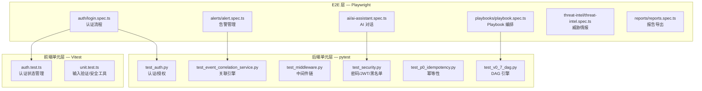
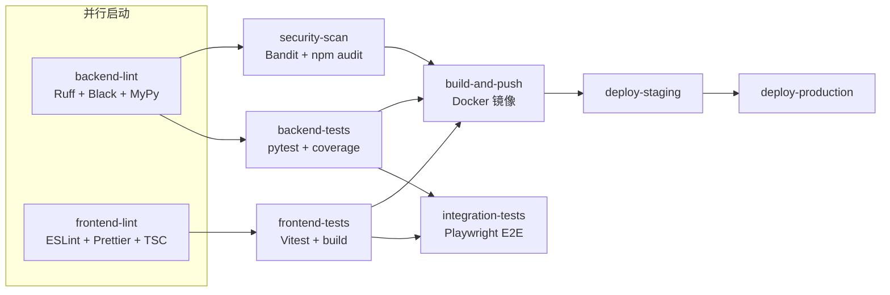

SOC Copilot 项目采用**三层测试金字塔**架构，从后端 Python 单元测试到前端 Vitest 组件测试，再到 Playwright 端到端验证，形成了覆盖全栈的质量保障体系。本文档系统阐述每层测试的配置方法、核心模式、工具链选型，以及如何在 CI/CD 流水线中实现自动化执行与覆盖率门控。

Sources: [pytest.ini](backend/pytest.ini#L1-L55), [vitest.config.ts](frontend/vitest.config.ts#L1-L17), [playwright.config.ts](frontend/playwright.config.ts#L1-L90)

## 测试体系总览

项目的测试基础设施横跨后端与前端两个子系统，各自拥有独立的测试运行器、配置文件和覆盖率工具。在开始深入每层细节之前，理解这三层之间的层次关系和数据依赖至关重要——E2E 测试依赖前后端同时运行，单元测试可以独立执行，而集成测试则处于两者之间。



| 测试层级 | 运行器 | 配置文件 | 覆盖率目标 | 典型执行时间 |
|---|---|---|---|---|
| **后端单元/集成** | pytest + pytest-asyncio | `backend/pytest.ini` | 50%（中间目标），80%（CI 严格） | 10–60 秒 |
| **前端单元** | Vitest + jsdom | `frontend/vitest.config.ts` | 按需生成 | 5–15 秒 |
| **E2E 端到端** | Playwright | `frontend/playwright.config.ts` | N/A（功能覆盖） | 2–10 分钟 |

Sources: [pytest.ini](backend/pytest.ini#L24-L25), [ci-cd.yml](.github/workflows/ci-cd.yml#L107-L115), [vitest.config.ts](frontend/vitest.config.ts#L1-L17)

## 后端测试：pytest 异步测试体系

### 配置与环境隔离

后端测试的配置通过**三层 conftest 文件**实现渐进式环境设置，确保在任何业务代码被导入之前，测试环境变量已经就位。这种分层设计解决了 Python 模块级导入顺序的关键问题——环境变量必须在 `os.environ` 中设置后，业务模块的配置层才能正确读取。

`backend/conftest.py` 作为 pytest 的根级入口，在模块顶层直接设置 `ENVIRONMENT=test`、`JWT_SECRET` 和 `TEST_DB_PATH`，同时通过 `collect_ignore_glob` 排除已归档的测试文件。`backend/tests/conftest.py` 则在此基础上构建了完整的 Fixture 体系，包括异步 HTTP 客户端、认证客户端和业务数据工厂。

Sources: [conftest.py](backend/conftest.py#L1-L37), [tests/conftest.py](backend/tests/conftest.py#L1-L146)

**环境变量隔离链路**的关键实现如下：`pytest.ini` 中的 `env` 配置段设定了基础值，根 `conftest.py` 在导入前通过 `os.environ` 强制覆盖，而 `tests/conftest.py` 的 `pytest_configure` 钩子则作为最终保障，确保在任何配置加载顺序下测试环境始终正确。

| 配置层 | 文件 | 作用域 | 职责 |
|---|---|---|---|
| pytest.ini `env` | `backend/pytest.ini` | 全局 | 声明环境变量默认值 |
| 根 conftest | `backend/conftest.py` | session | 模块顶层覆盖 + 测试 DB 路径 |
| 测试 conftest | `backend/tests/conftest.py` | session/function | `pytest_configure` + Fixture 定义 |
| conftest_setup | `backend/tests/conftest_setup.py` | 模块导入前 | 加密密钥等额外环境变量 |

Sources: [pytest.ini](backend/pytest.ini#L35-L39), [conftest.py](backend/conftest.py#L11-L17), [conftest_setup.py](backend/tests/conftest_setup.py#L1-L18)

### 核心 Fixture 设计

`tests/conftest.py` 提供了四个关键 Fixture，它们构成了后端所有测试的基础设施：

**`client`（session 级异步客户端）**：通过 `asgi_lifespan.LifespanManager` 包裹 FastAPI 应用，使用 `httpx.ASGITransport` 创建内存级 HTTP 客户端，无需实际启动网络端口。session 级别确保整个测试会话共享同一个应用实例，减少重复初始化开销。

**`auth_client`（function 级认证客户端）**：每次测试前通过 `/api/auth/login` 获取新鲜的 JWT Token，注入到共享客户端的 headers 中，测试结束后恢复原始 headers。这种"借用-归还"模式既避免了 session 级客户端的 Token 污染，又无需为每个测试重建整个应用。

**`admin_client`**：与 `auth_client` 结构相同，语义上明确表示管理员权限上下文，便于测试中表达角色意图。

**业务数据工厂**：`sample_playbook_data`、`sample_alert_data`、`sample_asset_data` 三个 Fixture 提供了预构建的测试数据，确保每个测试用例都基于一致的初始状态。

Sources: [tests/conftest.py](backend/tests/conftest.py#L35-L146)

### 测试标记（Markers）体系

`pytest.ini` 定义了 11 个自定义标记，形成了后端测试的**分类标签系统**。通过 `--strict-markers` 强制执行，任何未声明的标记都会导致测试失败，这防止了拼写错误造成的标记遗漏。

| 标记 | 语义 | 典型用例 |
|---|---|---|
| `unit` | 快速、隔离的纯函数测试 | 密码哈希、Token 解码 |
| `integration` | 需要外部服务或数据库的测试 | API 端点完整调用 |
| `e2e` | 全链路系统测试 | 从请求到响应的完整流程 |
| `slow` | 执行时间 > 5 秒的测试 | AI 服务调用、大量数据集 |
| `api` | API 端点级测试 | REST 接口验证 |
| `auth` | 认证/授权相关 | JWT、RBAC、API Key |
| `ai` | AI 服务依赖测试 | LLM 调用 mock |
| `ti` | 威胁情报服务 | OTX 查询、IOC 缓存 |
| `playbook` | Playbook 引擎 | DAG 执行、状态机 |
| `audit` | 审计日志 | 操作记录验证 |
| `redis` / `database` / `network` | 基础设施依赖 | 外部连接测试 |

通过 `pytest -m unit` 或 `pytest -m "not slow"` 可以精准控制测试子集的执行，在开发迭代中只运行相关的快速测试。

Sources: [pytest.ini](backend/pytest.ini#L41-L55)

### 测试模式：以认证模块为例

后端测试遵循**类分组 + 方法命名描述意图**的模式。以 `test_auth.py` 为例，四个测试类各自聚焦一个认证维度：

```python
# test_auth.py 的类结构
class TestAuthentication:          # 基础认证流程
    test_login_success()           # 正常登录 → 200 + token
    test_login_invalid_credentials()  # 错误密码 → 401
    test_login_missing_fields()    # 缺失字段 → 422
    test_token_refresh()           # Token 刷新

class TestAPIKeyAuthentication:    # API Key 认证
    test_create_api_key()          # 创建 → 201
    test_api_key_authentication()  # Key 鉴权 → 200

class TestAuthorization:           # RBAC 授权
    test_admin_only_endpoint_as_admin()     # 管理员 → 200
    test_permission_check()        # 权限列表验证

class TestTokenBlacklist:          # Token 黑名单
    test_blacklisted_token_rejected()  # 黑名单 Token → 401
```

每个异步测试方法使用 `@pytest.mark.asyncio` 装饰器（配合 `asyncio_mode = auto` 配置可省略），通过 `client` 或 `auth_client` Fixture 注入的 HTTP 客户端发起请求，然后使用标准 `assert` 语句验证响应状态码和 JSON 数据结构。

Sources: [test_auth.py](backend/tests/test_auth.py#L1-L200)

### 测试模式：中间件单元测试

中间件测试展示了**纯单元测试**的典型模式——不启动完整应用，而是直接实例化中间件类并构造模拟的 ASGI scope。`test_middleware.py` 通过 `mock_app` 函数创建最小化的 ASGI 应用，然后对 `TraceIDMiddleware`、`AuditMiddleware`、`IdempotencyMiddleware` 等中间件逐一验证其行为。

这种模式的关键在于：**测试的是中间件逻辑本身**，而非 HTTP 传输层。通过直接操作 `scope["state"]` 字典，可以精确验证中间件是否在请求状态中注入了正确的追踪 ID、审计信息或幂等性标记。

Sources: [test_middleware.py](backend/tests/test_middleware.py#L1-L200)

### 覆盖率配置

后端使用 `.coveragerc` 控制覆盖率报告的生成规则。`[run]` 段排除了测试文件自身、数据库迁移脚本和启动入口；`[report]` 段通过 `exclude_lines` 排除了抽象方法、类型检查分支和调试入口等不可测试代码，使覆盖率数据更准确地反映业务逻辑的实际覆盖情况。

`pytest.ini` 中设定 `--cov-fail-under=50` 作为本地开发的宽松门控（50%），而 CI 流水线中的 `--cov-fail-under=80` 则执行更严格的覆盖率要求，确保合并到主分支的代码质量。

Sources: [.coveragerc](backend/.coveragerc#L1-L23), [pytest.ini](backend/pytest.ini#L19-L25), [ci-cd.yml](.github/workflows/ci-cd.yml#L115)

## 前端单元测试：Vitest + jsdom

### 配置与测试环境

前端单元测试基于 **Vitest** 运行器，搭配 `@vitejs/plugin-react` 插件实现 JSX/TSX 转换。测试环境设为 `jsdom`——一个轻量级的浏览器 DOM 模拟器，允许在没有真实浏览器的环境中测试 React 组件和 DOM 操作。

`setup.ts` 文件在所有测试之前执行，模拟了浏览器关键 API：`localStorage`、`sessionStorage` 和 `matchMedia`。这些模拟采用简单的内存对象实现，每个测试结束后通过 `afterEach` 自动清空状态，确保测试间无交叉污染。

Sources: [vitest.config.ts](frontend/vitest.config.ts#L1-L17), [setup.ts](frontend/__tests__/setup.ts#L1-L51)

### 测试结构：认证模块

前端 `auth.test.ts` 展示了 Vitest 测试的典型组织方式——**嵌套 describe 块 + 内联实现函数**。由于前端认证逻辑散布在多个组件和工具函数中，测试文件采用"就近定义"策略，直接在测试文件中重新实现被测逻辑的核心算法，而非导入生产代码。

这种模式在 `loadAuthState`、`saveAuthState`、`isTokenExpired`、`decodeToken` 等函数的测试中均有体现。每个函数的测试覆盖了正常路径、边界条件（空值、损坏数据）和异常处理三个维度。

```
auth.test.ts 测试结构
├── Auth State Management
│   ├── loadAuthState — 无 Token、有 Token、损坏 JSON
│   ├── saveAuthState — 写入 localStorage 验证
│   └── logout — 清除全部认证数据
├── Token Management
│   ├── getAccessToken — 存在/不存在
│   ├── isTokenExpired — 过期/有效/畸形
│   └── decodeToken — 有效 JWT/无效输入
├── Login Flow
│   ├── login — 成功/凭证错误/网络错误/账户锁定
│   └── HTTP 请求 mock 验证
├── Authorization Headers
│   ├── getAuthHeaders — 有/无 Token
│   └── authFetch — 自动注入 Authorization header
└── Role-Based Access Control
    ├── hasRole — 匹配/不匹配/null
    ├── isAdmin — 精确角色判断
    └── isAnalystOrAdmin — 复合角色判断
```

Sources: [auth.test.ts](frontend/__tests__/auth.test.ts#L1-L399)

### 测试结构：通用工具函数

`unit.test.ts` 测试了前端通用的输入验证逻辑，包括邮箱格式校验、密码强度检测、IPv4 地址验证和域名验证。这些测试代表了**纯函数测试**的最高效形式——无外部依赖、无异步操作、无 DOM 交互，执行速度极快。

密码验证测试展示了**多维度断言**模式：对"弱密码"这一个场景，分别测试长度不足、缺少大写、缺少小写、缺少数字四种具体失败原因，确保验证逻辑在每个维度上都正确拦截。

Sources: [unit.test.ts](frontend/__tests__/unit.test.ts#L1-L200)

## E2E 测试：Playwright 多浏览器验证

### Playwright 配置详解

Playwright 配置文件定义了 E2E 测试的完整执行环境。配置的核心决策体现在以下几个维度：

**多浏览器矩阵**：配置了 Chromium、Firefox、WebKit（Safari）三个桌面浏览器和 Pixel 5、iPhone 12 两个移动设备模拟器。这确保了跨浏览器的 UI 兼容性，特别是 WebSocket 连接、SSE 事件流等实时功能在不同浏览器引擎中的行为一致性。

**CI/本地差异化策略**：通过 `process.env.CI` 条件分支，CI 环境下启用重试（`retries: 2`）、单线程执行（`workers: 1`）和自动启动开发服务器；本地开发则零重试、默认并行、依赖已运行的服务。这种差异化避免了本地调试时的冗余等待，同时保障了 CI 的稳定性。

**失败诊断数据**：`trace: "on-first-retry"`、`screenshot: "only-on-failure"`、`video: "retain-on-failure"` 三项配置确保测试失败时自动收集完整的诊断信息——DOM 快照、网络请求日志、控制台输出和截图视频，极大降低了远程 CI 环境中的问题定位成本。

| 配置项 | CI 模式 | 本地模式 | 设计意图 |
|---|---|---|---|
| `retries` | 2 | 0 | 抵消 CI 环境的偶发抖动 |
| `workers` | 1 | 自动（并行） | 避免 CI 资源竞争 |
| `forbidOnly` | true | false | 防止 `test.only` 泄漏到主分支 |
| `webServer` | 自动启动 | undefined | CI 无需手动启动服务 |
| `trace` | on-first-retry | on-first-retry | 统一收集失败诊断 |
| `baseURL` | 环境变量或 localhost:3003 | localhost:3003 | 支持不同部署环境 |

Sources: [playwright.config.ts](frontend/playwright.config.ts#L1-L90)

### 全局设置与健康检查

`e2e/global.setup.ts` 在所有 E2E 测试开始前执行一次，通过 Chromium 启动一个临时浏览器实例，向后端 `/api/health` 端点发送健康检查请求。注意这里采用了**容错策略**——即使后端健康检查失败也继续执行，因为某些测试可能专注于纯前端渲染而不依赖后端 API。

Sources: [global.setup.ts](frontend/e2e/global.setup.ts#L1-L39)

### 测试工具函数架构

E2E 测试的 `utils/` 目录提供了两个核心工具模块，它们将重复的认证操作和数据构造抽象为可复用的函数：

**`auth.ts`** 封装了完整的认证工具链。`login()` 函数通过 `data-testid` 选择器定位表单元素，执行填入-提交-等待导航的标准流程；`logout()` 则同时清理 localStorage 和 Cookies 以确保干净的退出状态。`TEST_USERS` 对象支持通过环境变量覆盖默认测试账号，适配不同部署环境的凭证差异。

**`test-data.ts`** 基于 `@faker-js/faker` 库实现了**测试数据工厂**模式。`generateTestAlert()`、`generateTestIOCs()`、`generateTestPlaybook()` 等函数每次调用都生成结构正确但数据随机化的测试对象，避免了硬编码测试数据的脆弱性。同时提供了 `waitForCondition()` 和 `retry()` 两个异步工具函数，处理 E2E 测试中常见的轮询等待和指数退避重试场景。

```
e2e/utils/
├── auth.ts
│   ├── TEST_USERS — 环境变量驱动的测试账号配置
│   ├── login(page, username, password) — UI 登录流程
│   ├── logout(page) — 清理认证状态
│   ├── isLoggedIn(page) — 检测认证状态
│   └── getAuthToken(username, password, baseUrl) — API 级获取 Token
└── test-data.ts
    ├── generateTestUser() — 随机用户数据
    ├── generateTestAlert() — 随机告警数据
    ├── generateTestIOCs() — 随机 IOC 指标
    ├── generateTestPlaybook() — 随机 Playbook 数据
    ├── waitForCondition() — 轮询等待工具
    └── retry() — 指数退避重试工具
```

Sources: [auth.ts](frontend/e2e/utils/auth.ts#L1-L135), [test-data.ts](frontend/e2e/utils/test-data.ts#L1-L189)

### E2E 测试模块划分

E2E 测试按业务模块组织为独立的 spec 文件，每个文件聚焦一个用户旅程：

| 测试文件 | 测试范围 | 关键验证点 |
|---|---|---|
| `auth/login.spec.ts` | 认证全流程 | 登录/登出/会话持久化/RBAC 路由守卫 |
| `alerts/alert.spec.ts` | 告警管理 | 列表/筛选/详情/状态变更/AI 分析 |
| `ai/ai-assistant.spec.ts` | AI 对话 | 聊天面板/消息收发/上下文分析/快捷操作 |
| `playbooks/playbook.spec.ts` | Playbook 编排 | DAG 创建/执行/状态监控 |
| `threat-intel/threat-intel.spec.ts` | 威胁情报 | IOC 查询/缓存/关联分析 |
| `admin/admin.spec.ts` | 管理后台 | 系统设置/用户管理 |
| `reports/reports.spec.ts` | 报告导出 | 生成/下载/格式验证 |
| `verify.spec.ts` | 冒烟测试 | 首页加载/登录页渲染 |

**认证 E2E 测试**（`auth/login.spec.ts`）采用了 `mode: "serial"` 配置，确保同一 `describe` 块内的测试按顺序执行——因为登录状态是累积的。同时通过 `Role-based Access Control` describe 块验证了管理员、分析师、审计员三种角色的路由访问权限。

**告警 E2E 测试**（`alerts/alert.spec.ts`）展示了 Playwright 的**路由拦截**能力——在 `should show AI analysis error gracefully` 测试中，通过 `page.route()` 拦截 `/api/ai/analyze` 请求并返回 500 错误，验证前端对 AI 服务故障的优雅降级处理。

Sources: [login.spec.ts](frontend/e2e/auth/login.spec.ts#L1-L172), [alert.spec.ts](frontend/e2e/alerts/alert.spec.ts#L1-L200), [ai-assistant.spec.ts](frontend/e2e/ai/ai-assistant.spec.ts#L1-L200), [verify.spec.ts](frontend/e2e/verify.spec.ts#L1-L42)

## CI/CD 流水线中的测试集成

测试在 GitHub Actions CI/CD 流水线中构成了**质量门控链**。后端和前端各自遵循"lint → test → build"的顺序依赖，最终汇聚到集成测试阶段。整个流水线的执行顺序通过 `needs` 关键字严格控制：



后端测试 Job 配置了 PostgreSQL 15 服务容器，通过环境变量 `DATABASE_URL` 连接，确保集成测试在真实的异步 PostgreSQL 驱动下执行。前端测试 Job 先执行 `npm run build` 确保编译通过，再运行 `npm test`。集成测试 Job 在前后端测试都通过后，通过 `docker-compose.test.yml` 启动完整的服务栈，然后执行 Playwright E2E 测试套件。

Sources: [ci-cd.yml](.github/workflows/ci-cd.yml#L64-L257)

## 运行测试：命令速查

### 后端测试命令

```bash
# 运行全部后端测试（含覆盖率报告）
cd backend && pytest

# 仅运行单元测试标记
pytest -m unit

# 排除慢速测试
pytest -m "not slow"

# 运行指定测试文件
pytest tests/test_auth.py -v

# 使用 run_tests.sh 脚本（自动激活 venv + 安装依赖）
cd backend && bash run_tests.sh
```

Sources: [pytest.ini](backend/pytest.ini#L1-L55), [run_tests.sh](backend/run_tests.sh#L1-L61)

### 前端单元测试命令

```bash
# 运行全部前端单元测试
cd frontend && npm test

# 监听模式（开发时使用）
npm run test:watch

# 带覆盖率报告
npm run test:coverage
```

Sources: [package.json](frontend/package.json#L1-L20)

### E2E 测试命令

```bash
# 运行全部 E2E 测试（需前后端服务运行中）
cd frontend && npm run test:e2e

# Playwright UI 模式（可视化调试）
npm run test:e2e:ui

# Debug 模式（逐步执行）
npm run test:e2e:debug

# 查看测试报告
npm run test:e2e:report

# 使用脚本运行（自动检查服务状态 + 按需启动前端）
cd frontend && bash scripts/run-e2e.sh

# 带 grep 过滤运行特定测试
bash scripts/run-e2e.sh --grep "Authentication"
```

Sources: [run-e2e.sh](frontend/scripts/run-e2e.sh#L1-L81), [package.json](frontend/package.json#L1-L20)

### 测试依赖清单

**后端测试依赖**（`requirements-test.txt`）：

| 包 | 版本要求 | 用途 |
|---|---|---|
| `pytest` | ≥ 7.4.0 | 测试运行器 |
| `pytest-asyncio` | ≥ 0.21.0 | 异步测试支持 |
| `pytest-cov` | ≥ 4.1.0 | 覆盖率收集 |
| `httpx` | ≥ 0.25.0 | ASGI 测试客户端 |
| `asgi-lifespan` | ≥ 2.1.0 | FastAPI 生命周期管理 |
| `factory-boy` | ≥ 3.3.0 | 测试数据工厂 |
| `faker` | ≥ 20.0.0 | 随机数据生成 |

**前端测试依赖**（`package.json` devDependencies）：

| 包 | 用途 |
|---|---|
| `vitest` | 测试运行器 |
| `@vitest/coverage-v8` | V8 引擎覆盖率 |
| `@vitejs/plugin-react` | React JSX 转换 |
| `@playwright/test` | E2E 测试框架 |
| `@testing-library/react` | React 组件测试工具 |
| `@faker-js/faker` | 随机测试数据生成 |

Sources: [requirements-test.txt](backend/requirements-test.txt#L1-L9), [package.json](frontend/package.json#L1-L20)

## 测试编写指南

### 后端测试编写规范

编写新的后端测试时，应遵循以下模式：

1. **选择正确的基类和标记**：纯函数测试使用 `@pytest.mark.unit`，需要数据库或 Redis 的测试使用 `@pytest.mark.integration`，涉及外部 API 调用的测试使用 `@pytest.mark.network`
2. **使用 conftest Fixture**：优先复用 `client`、`auth_client`、`admin_client` 等已有 Fixture，避免自行创建 HTTP 客户端
3. **Mock 外部依赖**：AI 服务、OTX API 等外部调用应通过 `unittest.mock.patch` 替换，确保测试可重复执行
4. **测试类命名约定**：使用 `Test{ModuleName}` 格式，方法名以 `test_` 开头并用下划线描述预期行为

### 前端 E2E 测试编写规范

1. **使用 `data-testid` 选择器**：所有 E2E 测试通过 `data-testid` 属性定位元素，避免依赖 CSS 类名或文本内容的脆弱性
2. **通过 utils 复用认证**：所有需要登录的测试统一使用 `../utils/auth.ts` 中的 `login()` 函数，不直接操作表单元素
3. **设置合理的超时**：AI 服务相关测试使用 60 秒超时（LLM 响应较慢），普通页面交互使用默认超时
4. **处理国际化**：通过 `getLocale()` 函数获取当前语言前缀，E2E 测试的 URL 路径包含 `/${locale}/` 前缀

Sources: [login.spec.ts](frontend/e2e/auth/login.spec.ts#L1-L30), [auth.ts](frontend/e2e/utils/auth.ts#L39-L41)

---

**下一步阅读**：了解测试在自动化部署流程中的完整位置，请参阅 [CI/CD 流水线：代码检查、安全扫描与自动化部署](25-ci-cd-liu-shui-xian-dai-ma-jian-cha-an-quan-sao-miao-yu-zi-dong-hua-bu-shu)。若需要生产环境的安全配置与检查清单，请参阅 [生产环境配置：Nginx 反向代理、SSL 与安全加固检查清单](27-sheng-chan-huan-jing-pei-zhi-nginx-fan-xiang-dai-li-ssl-yu-an-quan-jia-gu-jian-cha-qing-dan)。