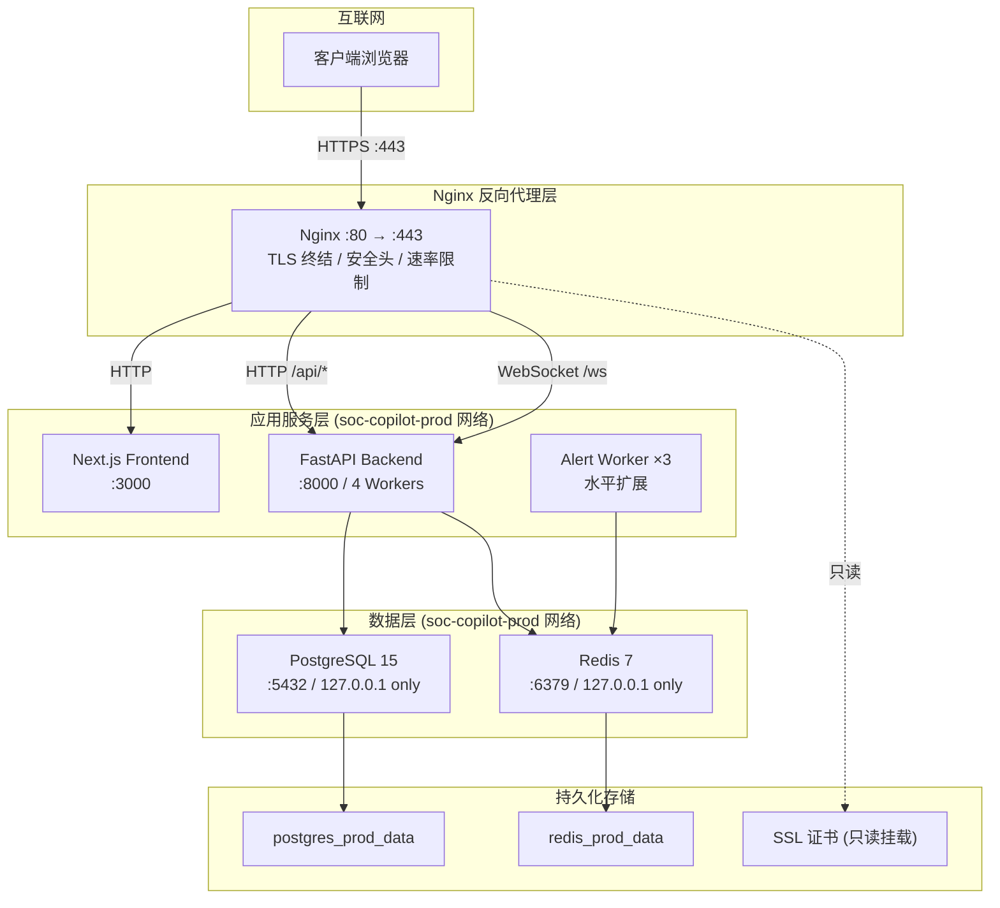
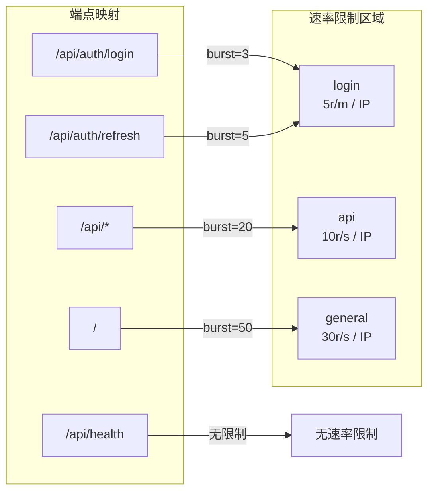
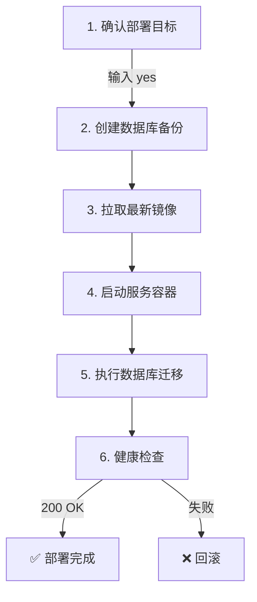

SOC Copilot 的生产部署以 **Nginx 反向代理** 为流量入口，承担 TLS 终结、安全头注入、速率限制与 WebSocket 升级四项核心职责。整个生产栈通过 Docker Compose 编排，后端服务（FastAPI）、前端服务（Next.js）、数据库（PostgreSQL）、缓存（Redis）以及告警 Worker 均以独立容器运行于隔离网络中。本文将逐一拆解每一层的安全配置，并提供可直接执行的检查清单，帮助你在上线前完成系统性安全审计。

Sources: [docker-compose.prod.yml](docker-compose.prod.yml#L1-L151), [nginx/nginx.prod.conf](nginx/nginx.prod.conf#L1-L199)

## 生产部署架构总览



上图展示了生产环境的完整请求流向：所有外部流量均通过 Nginx 443 端口进入，Nginx 根据 URL 路径分发至前端（`/`）、后端 API（`/api/`）或 WebSocket 端点（`/ws`）。数据库和 Redis 的端口仅绑定到 `127.0.0.1`，确保外部不可直接访问。

Sources: [docker-compose.prod.yml](docker-compose.prod.yml#L92-L108), [docker-compose.prod.yml](docker-compose.prod.yml#L7-L32)

## Nginx 配置详解：开发版与生产版对比

项目维护了两个 Nginx 配置文件，分别对应不同的运行环境：

| 配置维度 | `nginx.conf`（开发/通用） | `nginx.prod.conf`（生产） |
|---|---|---|
| **完整程度** | 仅包含 `server` 块 | 包含完整的 `worker_processes`、`events`、`http` 块 |
| **Worker 连接数** | 未指定（使用默认） | `worker_connections 4096`，`worker_rlimit_nofile 65535` |
| **Gzip 压缩** | 未配置 | 启用，`gzip_comp_level 6`，覆盖 JSON/JS/CSS/XML |
| **日志格式** | 默认格式 | 自定义 `main` 格式，包含 `$request_time` |
| **SSL Session** | `ssl_session_timeout 10m` | `ssl_session_timeout 1d`，启用 OCSP Stapling |
| **密码套件** | 4 个 ECDHE 套件 | 6 个套件，额外包含 DHE-RSA 系列 |
| **Refresh Token** | 未单独配置 | 独立 `/api/auth/refresh` location，独立速率限制 |
| **敏感文件屏蔽** | `.env`, `.git`, `.htaccess`, `.gitignore` | 扩展至 `.sql`, `.log`, `.bak`, `.swp` |
| **API Buffering** | 未配置 | `proxy_buffering off`（支持流式响应） |
| **Health Check 日志** | 记录日志 | `access_log off`（减少健康检查噪声） |

生产配置通过 Docker Compose 挂载：`./nginx/nginx.prod.conf:/etc/nginx/nginx.conf:ro`，以只读方式挂载以防止运行时篡改。开发环境的 Nginx 则通过 Docker Compose 的 `profiles: [production]` 机制按需启用。

Sources: [nginx/nginx.conf](nginx/nginx.conf#L1-L159), [nginx/nginx.prod.conf](nginx/nginx.prod.conf#L1-L199), [docker-compose.prod.yml](docker-compose.prod.yml#L95-L98)

## TLS/SSL 配置与证书管理

### TLS 协议与密码套件

生产环境强制使用 TLSv1.2 和 TLSv1.3，禁用了所有旧版协议。密码套件仅允许 AEAD 加密（GCM 系列），排除了存在已知漏洞的 CBC 模式套件：

```
ssl_protocols TLSv1.2 TLSv1.3;
ssl_ciphers 'ECDHE-ECDSA-AES128-GCM-SHA256:ECDHE-RSA-AES128-GCM-SHA256:ECDHE-ECDSA-AES256-GCM-SHA384:ECDHE-RSA-AES256-GCM-SHA384:DHE-RSA-AES128-GCM-SHA256:DHE-RSA-AES256-GCM-SHA384';
```

关键 TLS 参数设计意图：`ssl_session_tickets off` 禁用 Session Ticket 以防止前向保密性被削弱；`ssl_prefer_server_ciphers off`（生产版）允许客户端选择最优套件，在 TLSv1.3 下这是推荐做法；`ssl_stapling on` + `ssl_stapling_verify on` 启用 OCSP Stapling 减少客户端证书验证延迟。

Sources: [nginx/nginx.prod.conf](nginx/nginx.prod.conf#L71-L79)

### HSTS 与 HTTP→HTTPS 强制跳转

HTTP 80 端口的唯一职责是执行 301 永久重定向至 HTTPS，仅保留 `/.well-known/acme-challenge/` 路径用于 Let's Encrypt 证书自动续期。HSTS 头设置了 2 年有效期（`max-age=63072000`），并启用 `includeSubDomains` 和 `preload` 标记，这意味着浏览器会在首次访问后持续拒绝 HTTP 连接：

```
add_header Strict-Transport-Security "max-age=63072000; includeSubDomains; preload" always;
```

Sources: [nginx/nginx.prod.conf](nginx/nginx.prod.conf#L49-L60), [nginx/nginx.prod.conf](nginx/nginx.prod.conf#L82)

### 证书生成与管理

项目提供了 `generate_ssl_cert.sh` 脚本用于开发环境快速生成自签名证书。该脚本使用 OpenSSL 生成 RSA 2048 位证书，有效期 365 天，并设置了正确的文件权限（证书 `644`，私钥 `600`）。**生产环境必须使用 Let's Encrypt 或商业 CA 颁发的证书**，脚本的注释中明确标注了生产环境的命令：

```bash
# 生产环境推荐：
certbot certonly --nginx -d your-domain.com
```

SSL 目录挂载为只读卷（`./nginx/ssl:/etc/nginx/ssl:ro`），防止容器内进程意外修改证书文件。

Sources: [generate_ssl_cert.sh](generate_ssl_cert.sh#L1-L40), [docker-compose.prod.yml](docker-compose.prod.yml#L97)

## 安全响应头配置

Nginx 层注入了完整的安全响应头矩阵，覆盖 XSS、点击劫持、信息泄露和权限控制四大攻击面：

| 响应头 | 值 | 防护目标 |
|---|---|---|
| `X-Frame-Options` | `DENY` | 禁止 iframe 嵌入，防御点击劫持 |
| `X-Content-Type-Options` | `nosniff` | 禁止 MIME 嗅探，防御内容类型混淆攻击 |
| `X-XSS-Protection` | `1; mode=block` | 启用浏览器 XSS 过滤器 |
| `Referrer-Policy` | `strict-origin-when-cross-origin` | 限制 Referer 泄露至第三方站点 |
| `Permissions-Policy` | `camera=(), microphone=(), geolocation=(), payment=(), usb=()` | 禁用不必要的浏览器 API |
| `Content-Security-Policy` | `default-src 'self'; frame-ancestors 'none'; ...` | 限制资源加载来源，防御 XSS 和数据注入 |
| `Strict-Transport-Security` | `max-age=63072000; includeSubDomains; preload` | 强制 HTTPS 连接 |
| `server_tokens` | `off` | 隐藏 Nginx 版本号 |

值得注意的是，生产版的 CSP 头额外添加了 `upgrade-insecure-requests` 指令，指示浏览器将所有 HTTP 资源请求自动升级为 HTTPS。同时 `Permissions-Policy` 比开发版多屏蔽了 `payment` 和 `usb` 两个 API。

Sources: [nginx/nginx.prod.conf](nginx/nginx.prod.conf#L84-L91), [nginx/nginx.conf](nginx/nginx.conf#L49-L58)

## 分层速率限制策略

Nginx 使用 `limit_req_zone` 定义了三个独立的速率限制区域，每个区域按不同的严格程度覆盖不同的端点类型：



| 区域 | 内存分配 | 速率限制 | 适用端点 | burst 值 | 含义 |
|---|---|---|---|---|---|
| `login` | 10MB | 5 次/分钟/IP | `/api/auth/login`, `/api/auth/refresh` | 3/5 | 防暴力破解 |
| `api` | 10MB | 10 次/秒/IP | `/api/*` | 20 | 防 API 滥用 |
| `general` | 10MB | 30 次/秒/IP | `/`（前端） | 50 | 防 DDoS |

所有区域均设置 `nodelay` 参数，超出限制的请求立即返回 429 状态码而非排队等待。健康检查端点 `/api/health` 在生产版中显式排除速率限制（`access_log off`），确保监控系统不会因触发限制而误报。10MB 的内存分配约可存储 160,000 个 IP 地址的计数状态。

Sources: [nginx/nginx.prod.conf](nginx/nginx.prod.conf#L5-L7), [nginx/nginx.prod.conf](nginx/nginx.prod.conf#L93-L196)

## Docker Compose 生产编排安全

### 网络隔离与端口绑定

生产环境采用单一 Bridge 网络（`soc-copilot-prod`）简化服务发现，但通过严格的端口绑定实现同等隔离效果：

| 服务 | 端口暴露策略 | 绑定地址 | 说明 |
|---|---|---|---|
| **Nginx** | `80:80`, `443:443` | `0.0.0.0` | 唯一的外部入口点 |
| **PostgreSQL** | `5432:5432` | `127.0.0.1` | 仅本地管理工具可访问 |
| **Redis** | `6379:6379` | `127.0.0.1` | 仅本地管理工具可访问 |
| **Backend** | 无端口映射 | — | 仅通过 Nginx 代理访问 |
| **Frontend** | 无端口映射 | — | 仅通过 Nginx 代理访问 |

对比开发环境的 `docker-compose.yml`，后者使用了三个独立网络（`frontend-net`、`backend-net`、`database-net`），其中 `backend-net` 和 `database-net` 设置了 `internal: true` 标记，完全禁止容器对外部网络的访问。生产环境简化为单网络但通过端口绑定实现同等效果。

Sources: [docker-compose.prod.yml](docker-compose.prod.yml#L148-L150), [docker-compose.yml](docker-compose.yml#L145-L153)

### 容器安全加固

每个容器都配置了资源限制和安全策略：

**Backend 容器**（[Dockerfile](backend/Dockerfile#L1-L36)）：使用多阶段构建减小镜像体积；创建非 root 用户 `appuser`（UID 1000）并以该用户运行；内置健康检查 `curl -f http://localhost:8000/api/health`，30 秒间隔，3 次失败后标记为不健康。

**Frontend 容器**（[Dockerfile](frontend/Dockerfile#L1-L40)）：三阶段构建（deps → builder → runner）；Next.js standalone 输出模式仅复制必要的运行时文件；非 root 用户 `nextjs`（UID 1001）；禁用 Next.js 遥测（`NEXT_TELEMETRY_DISABLED=1`）。

**Alert Worker**：配置 `deploy.mode: replicated` + `replicas: 3` 实现水平扩展，每个实例限制 CPU 0.5 核 / 内存 256MB，保证资源隔离。

Sources: [backend/Dockerfile](backend/Dockerfile#L27-L35), [frontend/Dockerfile](frontend/Dockerfile#L23-L39), [docker-compose.prod.yml](docker-compose.prod.yml#L109-L142)

### 敏感信息管理

生产 Docker Compose 中所有密码和密钥均通过 `${VARIABLE}` 环境变量注入，不以明文硬编码。开发环境更进一步使用 `${DB_PASSWORD:?ERROR: ...}` 语法实现强制变量检查——如果 `DB_PASSWORD` 未设置，容器将直接拒绝启动并打印错误提示：

```yaml
POSTGRES_PASSWORD: ${DB_PASSWORD:?ERROR: DB_PASSWORD environment variable is required. Generate one using: openssl rand -base64 32}
```

Sources: [docker-compose.yml](docker-compose.yml#L10), [docker-compose.yml](docker-compose.yml#L65)

## 后端安全配置层

### 环境变量校验系统

后端通过 `EnvValidator` 中间件在应用启动阶段执行安全环境检查。在 `ENVIRONMENT=production` 模式下，以下变量必须满足最低安全标准，否则应用将 `sys.exit(1)` 拒绝启动：

| 环境变量 | 最低要求 | 生成命令 |
|---|---|---|
| `DB_PASSWORD` | ≥ 16 字符 | `openssl rand -base64 32` |
| `SECRET_KEY`（即 `jwt_secret`） | ≥ 32 字符 | `openssl rand -base64 64` |
| `REDIS_PASSWORD` | ≥ 16 字符（仅生产） | `openssl rand -base64 32` |
| `BOOTSTRAP_ADMIN_PASSWORD` | ≥ 12 字符 | 自定义强密码 |
| `SECRET_ENCRYPTION_KEY` | 有效 Fernet 密钥 | `python -c "from cryptography.fernet import Fernet; print(Fernet.generate_key().decode())"` |
| `CORS_ORIGINS` | 非空且不含 `*` | 具体域名列表 |

`Settings` 类的 Pydantic 验证器实现了双模式检查：`strict_production_checks=True` 时违规将抛出 `ValueError` 阻止启动；`False` 时仅打印警告但允许继续运行，为渐进式安全加固提供灵活性。`run_production_security_checks()` 函数将所有检查聚合执行，返回错误列表供启动逻辑判断。

Sources: [backend/middleware/env_validator.py](backend/middleware/env_validator.py#L64-L125), [backend/core/config.py](backend/core/config.py#L122-L155), [backend/core/security_validators.py](backend/core/security_validators.py#L221-L254)

### Cookie 安全与 CSRF 防护

认证体系采用 httpOnly Cookie + 双提交 CSRF Token 模式：

**Cookie 安全**（[cookie_auth.py](backend/core/cookie_auth.py#L13-L22)）：生产环境下 Cookie 设置 `secure=True`（仅 HTTPS 传输）、`httponly=True`（禁止 JavaScript 读取，防御 XSS 窃取）、`samesite="lax"`（防御 CSRF 跨站请求伪造）。Access Token 有效期跟随 `jwt_expire_minutes`（默认 12 小时），Refresh Token 跟随 `jwt_refresh_expire_minutes`（默认 7 天）。

**CSRF 防护**（[csrf.py](backend/core/csrf.py#L1-L124)）：使用 SHA-256 哈希的双提交 Cookie 模式。服务端生成随机 CSRF Token，将其 SHA-256 哈希写入 Cookie（非 httpOnly，允许 JS 读取），客户端在发起 POST/PUT/DELETE/PATCH 请求时将原始 Token 放入 `X-CSRF-Token` 请求头。服务端比对请求头中的 Token 哈希值与 Cookie 中的哈希值，使用 `secrets.compare_digest()` 进行时间安全比较。API Key 认证的请求自动跳过 CSRF 校验，因为 API Key 本身已提供足够的安全保障。

Sources: [backend/core/cookie_auth.py](backend/core/cookie_auth.py#L1-L80), [backend/core/csrf.py](backend/core/csrf.py#L1-L124)

### JWT 与密码策略

密码哈希使用 bcrypt，开发环境 10 轮（约 100ms），生产环境 12 轮（约 250ms）。JWT 使用 HS256 算法，令牌中嵌入 `iat`（签发时间）和 `type`（`access` / `refresh`）声明。通过 `is_token_invalidated_by_user_update()` 函数实现无黑名单的令牌失效机制——当用户的角色、密码等关键字段变更时，`updated_at` 时间戳更新，所有 `iat` 早于此时间的令牌自动失效。

密码强度验证器维护了 56 个常见弱密码黑名单和 11 个弱模式正则表达式（纯数字、纯字母、包含 "admin"/"password" 等），要求密码至少包含大小写、数字、特殊字符中的 3 类，且不得包含用户名。

Sources: [backend/core/security.py](backend/core/security.py#L15-L26), [backend/core/security.py](backend/core/security.py#L98-L161), [backend/core/security_validators.py](backend/core/security_validators.py#L131-L183)

### 应用层速率限制

除 Nginx 层面的速率限制外，后端还实现了基于 Redis 的应用层速率限制器 `AsyncRateLimiter`。该组件使用 Redis Pipeline 执行原子 INCR + EXPIRE 操作，支持滑动窗口限流，当 Redis 不可用时自动降级为内存存储。连接池配置最大 20 个连接，每 30 秒执行一次健康检查，超时后自动重连。

Sources: [backend/middleware/rate_limiter.py](backend/middleware/rate_limiter.py#L38-L130)

## WebSocket 安全配置

Nginx 为 `/ws` 路径配置了专门的 WebSocket 代理规则：强制 `proxy_http_version 1.1`、设置 `Upgrade` 和 `Connection` 头实现协议升级。WebSocket 的超时配置远长于普通 API 请求：`proxy_send_timeout 3600s` 和 `proxy_read_timeout 3600s`（1 小时），以支持长时间保持的实时连接。而普通 API 请求的超时仅为 60 秒。

Sources: [nginx/nginx.prod.conf](nginx/nginx.prod.conf#L145-L158)

## 敏感文件与路径屏蔽

Nginx 层配置了正则匹配规则，拦截对敏感文件的直接访问。生产版比开发版覆盖了更多文件类型：

```
# 开发版
location ~* (\.env|\.git|\.htaccess|\.gitignore)

# 生产版（扩展）
location ~* \.(env|git|htaccess|gitignore|sql|log|bak|swp)$
```

隐藏文件（以 `.` 开头）通过 `location ~ /\.` 规则全部拦截，且关闭了访问日志（`access_log off; log_not_found off`），避免攻击者通过日志探测路径是否存在。

Sources: [nginx/nginx.prod.conf](nginx/nginx.prod.conf#L177-L186), [nginx/nginx.conf](nginx/nginx.conf#L139-L148)

## 生产部署流程

部署脚本 `deploy.sh` 支持 `local`、`staging`、`production` 三种环境。生产部署流程包含以下安全关键步骤：



关键安全措施：部署前必须手动输入 `yes` 确认；自动创建数据库快照备份到 `backups/` 目录；部署完成后执行 `/api/health` 健康检查，失败则返回非零退出码。

Sources: [Scripts/deploy/deploy.sh](Scripts/deploy/deploy.sh#L100-L135)

## 生产环境安全加固检查清单

以下检查清单按优先级排序，**P0 为阻断性项**（未通过则不应上线），**P1 为强烈建议项**，**P2 为最佳实践建议**。

### P0：阻断性检查（上线前必须通过）

- [ ] **SSL 证书**：使用 Let's Encrypt 或商业 CA 签发的证书，非自签名证书。验证命令：`openssl s_client -connect your-domain:443 -servername your-domain | openssl x509 -noout -dates`
- [ ] **JWT Secret**：`JWT_SECRET` 已设置且 ≥ 32 字符，验证方式：启动时无 `SECURITY WARNING` 日志。`Sources: [backend/core/config.py](backend/core/config.py#L122-L155)`
- [ ] **管理员密码**：`BOOTSTRAP_ADMIN_PASSWORD` 已设置且 ≥ 12 字符，已通过密码强度校验。`Sources: [backend/core/config.py](backend/core/config.py#L157-L205)`
- [ ] **数据库密码**：`DB_PASSWORD` ≥ 16 字符，非字典词汇。`Sources: [backend/middleware/env_validator.py](backend/middleware/env_validator.py#L79-L85)`
- [ ] **SECRET_ENCRYPTION_KEY**：已设置有效的 Fernet 密钥。`Sources: [backend/core/config.py](backend/core/config.py#L207-L280)`
- [ ] **CORS 配置**：`CORS_ORIGINS` 设置为具体域名列表，不含 `*` 通配符。`Sources: [backend/middleware/env_validator.py](backend/middleware/env_validator.py#L128-L140)`
- [ ] **HTTP→HTTPS 跳转**：访问 `http://your-domain` 被重定向至 `https://`。`Sources: [nginx/nginx.prod.conf](nginx/nginx.prod.conf#L49-L60)`
- [ ] **敏感文件不可访问**：`https://your-domain/.env`、`https://your-domain/.git/config` 返回 404 或被拒绝。`Sources: [nginx/nginx.prod.conf](nginx/nginx.prod.conf#L177-L186)`
- [ ] **Redis 密码**：生产环境 `REDIS_PASSWORD` 已设置且 ≥ 16 字符。`Sources: [backend/middleware/env_validator.py](backend/middleware/env_validator.py#L102-L112)`

### P1：强烈建议检查

- [ ] **HSTS 头**：响应中包含 `Strict-Transport-Security` 头。验证命令：`curl -sI https://your-domain | grep -i strict`
- [ ] **安全响应头完整**：X-Frame-Options、X-Content-Type-Options、CSP 等头均已设置。验证命令：`curl -sI https://your-domain | grep -E 'X-Frame|X-Content|Content-Security'`
- [ ] **Nginx 版本隐藏**：响应头中无 `Server: nginx/x.x.x`。验证命令：`curl -sI https://your-domain | grep -i server`
- [ ] **容器非 root 运行**：Backend 和 Frontend 容器均以非 root 用户运行。`Sources: [backend/Dockerfile](backend/Dockerfile#L27-L28), [frontend/Dockerfile](frontend/Dockerfile#L23-L24)`
- [ ] **SSL 配置强度**：使用 `testssl.sh your-domain` 或 SSLLabs 在线测试，目标等级 A 或以上
- [ ] **数据库端口隔离**：PostgreSQL 端口仅绑定 `127.0.0.1`，外部无法直接连接。`Sources: [docker-compose.prod.yml](docker-compose.prod.yml#L18)`
- [ ] **健康检查正常**：`curl -f https://your-domain/api/health` 返回 200。`Sources: [Scripts/deploy/deploy.sh](Scripts/deploy/deploy.sh#L124-L132)`
- [ ] **资源限制已配置**：所有容器均设置了 CPU 和内存限制。`Sources: [docker-compose.prod.yml](docker-compose.prod.yml#L71-L76)`
- [ ] **速率限制生效**：快速连续请求 `/api/auth/login` 超过 5 次后返回 429。`Sources: [nginx/nginx.prod.conf](nginx/nginx.prod.conf#L95-L98)`

### P2：最佳实践建议

- [ ] **OCSP Stapling 启用**：Nginx 生产配置中 `ssl_stapling on` 已开启，需确保证书链完整。`Sources: [nginx/nginx.prod.conf](nginx/nginx.prod.conf#L78-L79)`
- [ ] **Gzip 压缩启用**：生产配置已启用，验证响应头包含 `Content-Encoding: gzip`。`Sources: [nginx/nginx.prod.conf](nginx/nginx.prod.conf#L29-L33)`
- [ ] **日志轮转配置**：Nginx 日志挂载至宿主机 `./nginx/logs`，建议配置 logrotate 定期轮转。`Sources: [docker-compose.prod.yml](docker-compose.prod.yml#L98)`
- [ ] **`strict_production_checks` 开启**：将环境变量 `STRICT_PRODUCTION_CHECKS=true` 使安全警告升级为启动错误。`Sources: [backend/core/config.py](backend/core/config.py#L43-L45)`
- [ ] **备份自动化**：定期执行数据库备份，保留 ≥ 7 天。`Sources: [Scripts/deploy/deploy.sh](Scripts/deploy/deploy.sh#L113-L114)`
- [ ] **SSL 证书自动续期**：配置 certbot 定时任务 `0 0 * * * certbot renew --quiet`

## 快速验证命令集

以下命令可用于一键验证生产环境的安全配置状态：

```bash
# 1. TLS 版本检查（应仅返回 TLSv1.2 和 TLSv1.3）
openssl s_client -connect your-domain:443 -tls1 2>&1 | grep "Protocol"
openssl s_client -connect your-domain:443 -tls1_2 2>&1 | grep "Protocol"
openssl s_client -connect your-domain:443 -tls1_3 2>&1 | grep "Protocol"

# 2. 安全头检查
curl -sI https://your-domain | grep -E "Strict-Transport|X-Frame|X-Content-Type|Content-Security|X-XSS"

# 3. HTTP 重定向验证（应返回 301）
curl -sI http://your-domain | grep "301"

# 4. 敏感路径访问验证（应返回 403/404）
curl -sI https://your-domain/.env
curl -sI https://your-domain/.git/config

# 5. 速率限制验证（第 6 次请求应返回 429）
for i in {1..8}; do curl -s -o /dev/null -w "%{http_code}\n" -X POST https://your-domain/api/auth/login; done

# 6. Docker 容器健康状态
docker-compose -f docker-compose.prod.yml ps

# 7. 后端安全自检
docker-compose -f docker-compose.prod.yml exec backend python -c "from core.security_validators import run_production_security_checks; errors = run_production_security_checks(); print('PASS' if not errors else '\n'.join(errors))"
```

Sources: [nginx/nginx.prod.conf](nginx/nginx.prod.conf#L1-L199), [backend/core/security_validators.py](backend/core/security_validators.py#L221-L254)

---

**下一步阅读**：了解 CI/CD 流水线如何自动化执行上述安全检查，请参阅 [CI/CD 流水线：代码检查、安全扫描与自动化部署](25-ci-cd-liu-shui-xian-dai-ma-jian-cha-an-quan-sao-miao-yu-zi-dong-hua-bu-shu)；理解安全加固背后的认证与权限体系，请参阅 [认证体系：JWT 令牌、API Key、CSRF 防护与密码策略](17-ren-zheng-ti-xi-jwt-ling-pai-api-key-csrf-fang-hu-yu-mi-ma-ce-lue) 和 [安全加固：敏感数据脱敏、密钥管理与 HTTP 沙箱](18-an-quan-jia-gu-min-gan-shu-ju-tuo-min-mi-yao-guan-li-yu-http-sha-xiang)。