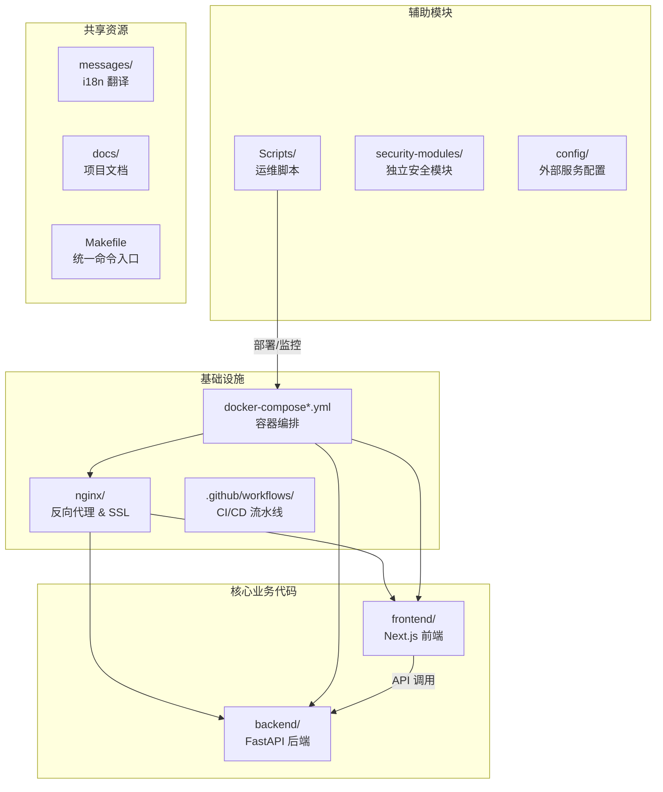
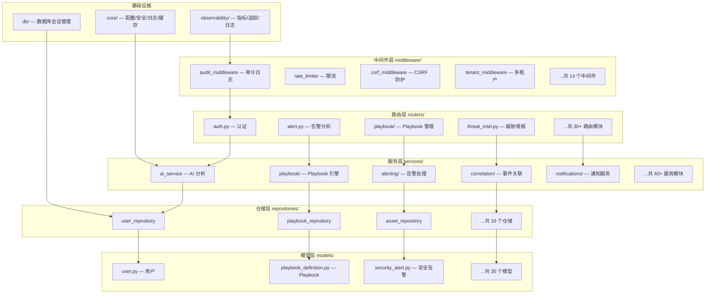

SOC Copilot 采用经典的**前后端分离架构**——后端基于 Python FastAPI，前端基于 Next.js React。整个项目围绕安全运营中心的日常工作流展开，从告警接入、AI 分析、威胁情报查询到 Playbook 自动化编排，形成完整的 SOC 工作闭环。本文档将带你快速了解每个顶层目录与关键子模块的职责定位，帮助你迅速定位「我要改的代码在哪里」。

## 顶层目录全景

先从宏观视角认识整个仓库的骨架。顶层目录可按职能划分为 **核心业务代码**、**基础设施**、**辅助工具** 和 **文档** 四大类：

```
soc-copilot/
├── backend/                 # 🔧 后端服务（Python FastAPI）
├── frontend/                # 🎨 前端应用（Next.js + React）
├── nginx/                   # 🛡️ 生产环境 Nginx 反向代理配置
├── security-modules/        # 🔒 独立安全模块（日志转发器）
├── docker-compose*.yml      # 🐳 容器编排（开发/生产/安全模式）
├── .github/workflows/       # ⚙️ CI/CD 流水线
├── Scripts/                 # 📜 运维脚本（部署/备份/i18n/监控）
├── docs/                    # 📚 项目文档
├── config/                  # ⚙️ 外部服务配置（Wazuh 等）
├── messages/                # 🌐 根级 i18n 翻译文件
├── Makefile                 # 🛠️ 统一开发命令入口
└── data/                    # 💾 运行时数据目录
```

Sources: [README.md](README.md#L286-L363), [docker-compose.yml](docker-compose.yml#L1-L154)

下面的 Mermaid 图展示了四类顶层模块之间的依赖关系与职责边界：



Sources: [Makefile](Makefile#L1-L165), [nginx/nginx.conf](nginx/nginx.conf#L1-L159)

## 顶层目录速查表

| 目录 / 文件 | 职责 | 技术栈 | 入口文件 |
|---|---|---|---|
| `backend/` | 后端 API 服务，承载全部业务逻辑 | Python 3.12+, FastAPI, SQLAlchemy | [backend/main.py](backend/main.py#L1-L20) |
| `frontend/` | 前端 Web 应用，用户交互界面 | Next.js 16, React 19, TypeScript | [frontend/app/layout.tsx](frontend/app/layout.tsx#L1-L10) |
| `nginx/` | 生产环境反向代理、SSL 终结、安全头 | Nginx Alpine | [nginx/nginx.conf](nginx/nginx.conf#L1-L27) |
| `security-modules/` | 独立安全模块（日志转发器等） | Python | [security-modules/log-forwarder/main.py](security-modules/log-forwarder/main.py) |
| `docker-compose.yml` | 容器编排（PostgreSQL + Redis + Backend + Frontend + Nginx） | Docker Compose 3.8 | [docker-compose.yml](docker-compose.yml#L1-L12) |
| `.github/workflows/` | CI/CD 自动化：代码检查、安全扫描、测试 | GitHub Actions | [.github/workflows/ci-cd.yml](.github/workflows/ci-cd.yml#L1-L12) |
| `Scripts/` | 运维辅助脚本（部署、备份、i18n、监控） | Bash / Python | [Scripts/deploy/deploy.sh](Scripts/deploy/deploy.sh) |
| `docs/` | 项目文档（架构设计、API 指南、周报等） | Markdown | [docs/README.md](docs/README.md) |
| `config/` | 外部服务配置文件（Wazuh SIEM 等） | YAML/XML | [config/wazuh/ossec.conf](config/wazuh/ossec.conf) |
| `messages/` | 根级 i18n 翻译文件（en.json / zh.json） | JSON | [messages/en.json](messages/en.json), [messages/zh.json](messages/zh.json) |
| `Makefile` | 统一开发命令入口（dev/test/lint/deploy） | Make | [Makefile](Makefile#L1-L10) |
| `data/` | 运行时数据目录（SQLite 数据库等） | — | — |

Sources: [README.md](README.md#L1-L10), [PROJECT_SUMMARY.md](PROJECT_SUMMARY.md#L1-L22)

## 后端目录详解（`backend/`）

后端采用 **分层架构**，遵循 FastAPI 社区最佳实践，自顶向下分为路由层 → 服务层 → 仓储层 → 模型层。这种分层使得每一层只关注单一职责，方便测试和维护。

Sources: [backend/main.py](backend/main.py#L331-L342)

### 后端分层架构概览



Sources: [backend/main.py](backend/main.py#L39-L76), [backend/main.py](backend/main.py#L413-L446)

### `core/` — 核心基础设施

核心基础设施模块为整个后端提供横切关注点的统一管理，是所有业务模块的底层支撑。

| 文件 | 职责 | 简要说明 |
|---|---|---|
| `config.py` | **全局配置** | 通过 Pydantic Settings 管理 AI Provider、JWT、威胁情报、数据库连接池等全部配置项，支持环境变量注入 |
| `security.py` | **安全工具** | JWT 编解码、密码哈希/校验、Token 黑名单检查 |
| `security_validators.py` | **安全校验器** | 生产环境安全检查（密码强度、密钥配置等） |
| `logger.py` | **日志配置** | 统一的 `get_logger()` 工厂方法，输出结构化日志 |
| `cache.py` | **缓存管理** | 基于 TTL 的内存缓存，用于威胁情报等查询结果缓存 |
| `lifecycle.py` | **服务生命周期** | 定义 `LifecycleService` 基类与 `LifecycleManager`，管理所有后台服务的启动/关闭顺序 |
| `csrf.py` | **CSRF 防护** | 跨站请求伪造防护中间件配置 |
| `token_blacklist.py` | **Token 黑名单** | JWT 令牌撤销/黑名单管理 |
| `http_client.py` | **HTTP 客户端** | 统一的异步 HTTP 客户端封装 |
| `response.py` | **响应工具** | 统一 API 响应格式封装 |
| `sensitive_data.py` | **敏感数据** | 日志脱敏、敏感信息过滤 |
| `validators.py` | **通用校验** | 请求参数校验工具函数 |
| `metrics.py` | **指标配置** | Prometheus 指标注册与暴露 |
| `exceptions.py` | **异常定义** | 全局业务异常类型定义 |
| `enums/` | **枚举定义** | 告警级别、事件类型等枚举常量 |
| `cookie_auth.py` | **Cookie 认证** | 基于 Cookie 的认证方式支持 |

Sources: [backend/core/config.py](backend/core/config.py#L9-L98), [backend/core/lifecycle.py](backend/core/lifecycle.py#L48-L58)

### `models/` — 数据模型层

数据模型层使用 SQLAlchemy ORM 定义数据库表结构。每个模型文件对应一个数据库实体，目前共有 **35 个模型**，覆盖用户、告警、Playbook、审计、威胁情报等全业务域。

| 分类 | 模型文件 | 核心实体 |
|---|---|---|
| **用户与权限** | `user.py`, `rbac.py`, `api_key.py` | 用户、角色权限、API 密钥 |
| **告警体系** | `security_alert.py`, `alert_note.py`, `monitoring_alerts.py` | 安全告警、告警备注、监控告警 |
| **Playbook 引擎** | `playbook_definition.py`, `playbook_run.py`, `playbook_node_run.py`, `playbook_node_attempt.py`, `playbook_output.py`, `playbook_approval.py` | 流程定义、执行记录、节点执行、审批 |
| **威胁情报** | `threat_intel_cache.py`, `ioc_hit.py`, `correlated_event.py`, `event_similarity.py` | TI 缓存、IOC 命中、关联事件 |
| **审计与历史** | `audit_log.py`, `history.py`, `monitor_history.py` | 审计日志、操作历史、监控历史 |
| **资产管理** | `asset.py`, `blocked_ip.py`, `security_vulnerability.py` | 资产、封禁 IP、安全漏洞 |
| **触发器与队列** | `trigger.py`, `message_queue.py`, `message_filters.py` | 触发器配置、消息队列、消息过滤 |
| **AI 相关** | `ai_model.py`, `ai_task.py`, `ai_user_setting.py`, `root_cause_analysis.py` | AI 模型配置、AI 任务、用户设置、根因分析 |
| **安全与密钥** | `secret.py`, `correlation_rule.py` | 加密密钥、关联规则 |

Sources: [backend/models/__init__.py](backend/models/__init__.py), [backend/models/user.py](backend/models/user.py)

### `routers/` — API 路由层

路由层是后端的 HTTP 入口，每个文件对应一组相关 API 端点。FastAPI 自动根据路由注册生成 Swagger 文档（`/docs`）。路由文件只负责参数校验和调用服务层，**不包含业务逻辑**。

| 路由文件 | API 前缀 | 核心功能 |
|---|---|---|
| `auth.py` | `/api/auth` | 登录、注册、刷新 Token |
| `alert.py` | `/api/analyze-alert` | 告警分析（AI 驱动） |
| `timeline.py` | `/api/build-timeline` | 事件时间线构建 |
| `report.py` | `/api/generate-report` | 报告生成（工单/日报/事后分析） |
| `assets.py` | `/api/assets` | 资产管理 CRUD |
| `threat_intel.py` | `/api/threat-intel` | 威胁情报查询（OTX 集成） |
| `playbook/` | `/api/playbook-definitions` | Playbook 定义管理、执行、版本、审批 |
| `triggers.py` | `/api/triggers` | 触发器管理（Webhook + Cron） |
| `secrets.py` | `/api/secrets` | 密钥管理（Fernet 加密存储） |
| `ai.py` | `/api/ai` | AI 对话式助手 |
| `ai_models.py` | `/api/ai-models` | AI 模型配置管理 |
| `ai_tasks.py` | `/api/ai-tasks` | AI 异步任务队列 |
| `correlation.py` | `/api/correlation` | 事件关联分析 |
| `websocket.py` | `/ws` | WebSocket 实时推送 |
| `health.py` | `/api/health` | 健康检查与系统指标 |
| `audit.py` | `/api/audit` | 审计日志查询 |
| `users.py` | `/api/users` | 用户管理 |
| `api_keys.py` | `/api/api-keys` | API 密钥管理 |
| `export.py` | `/api/export` | 数据导出 |
| `notifications.py` | `/api/notifications` | 通知渠道与队列状态 |
| `monitor.py` | `/api/monitor` | 实时监控面板数据 |
| `system_dashboard.py` | `/api/system-dashboard` | 系统运行状态面板 |
| `cloud_native.py` | `/api/cloud-native` | 云原生安全扫描 |
| `marketplace.py` | `/api/marketplace` | Playbook 市场 |
| `ueba.py` | `/api/ueba` | 用户行为分析 |
| `threat_hunting.py` | `/api/threat-hunting` | 威胁狩猎 |
| `security_alerts.py` | `/api/security-alerts` | 外部安全告警接入 |
| `alert_enrichment.py` | `/api/alert-enrichment` | 告警情报富化 |
| `blocked_ips.py` | `/api/blocked-ips` | IP/域名封禁 |
| `history.py` | `/api/history` | 操作历史 |
| `ioc_hits.py` | `/api/ioc-hits` | IOC 命中追踪 |

Sources: [backend/main.py](backend/main.py#L452-L497)

### `services/` — 业务逻辑层

服务层是整个后端最核心也最庞大的模块，包含 **40+ 服务模块**，承载全部业务逻辑。服务之间通过事件总线（`event_bus.py`）解耦协作。

| 子目录 / 文件 | 职责 |
|---|---|
| `ai_service.py` / `ai_service_enhanced.py` / `ai_providers.py` | AI 分析核心：多 Provider 调度（智谱/Anthropic/OpenAI/NVIDIA/Moonshot/OpenRouter） |
| `ai_task_service.py` / `ai_queue_manager.py` | AI 异步任务队列与后台处理 |
| `alerting/` | **告警处理子模块**：告警服务、去重、富化、评估、生命周期管理、实时流推送 |
| `correlation/` | **事件关联子模块**：规则引擎、关联分析、关联 Schema |
| `playbook/` | **Playbook 子模块**：DAG 编译、DAG 调度、DAG 引擎、版本管理、重放、导入导出、上下文变量、运行服务 |
| `playbook_executors/` | **Playbook 节点执行器**：HTTP 请求、OTX 查询、条件判断、人工审批、Slack 通知、IOC 提取、延时等待 |
| `notifications/` | **通知子模块**：飞书、Slack、邮件通知，插件化注册机制 |
| `security/` | **安全服务子模块**：密钥加密存储、安全告警 Schema、安全漏洞服务 |
| `lifecycle/` | **生命周期服务**：数据库、队列管理、Cron 调度、限流器、AI 任务处理、WebSocket 监控、告警评估 |
| `message_broker/` | **消息代理**：支持 Redis 和 Kafka 两种实现，含工厂模式切换 |
| `observability/` | **可观测性**：性能监控、WebSocket 监控 |
| `integration/` | 外部集成服务 |
| `threat_intel_service.py` | 威胁情报查询（OTX 集成、本地缓存、合规过滤） |
| `threat_hunting_service.py` | 威胁狩猎 |
| `ueba_service.py` | 用户行为异常检测（基于 ML） |
| `timeline_service.py` | 事件时间线构建 |
| `report_service.py` | 报告生成 |
| `notification_service.py` | 通知服务总调度 |
| `trigger_service.py` | 触发器管理（Webhook + Cron） |
| `cron_scheduler_service.py` | Cron 定时任务调度 |
| `asset_service.py` | 资产管理 |
| `history_service.py` | 操作历史 |
| `impact_service.py` | 影响分析 |
| `cloud_native_service.py` | 云原生安全 |
| `marketplace_service.py` | Playbook 市场 |
| `websocket_manager.py` | WebSocket 连接管理 |
| `event_bus.py` | 进程内事件总线（解耦服务间通信） |
| `run_queue_manager.py` | Playbook 执行队列（并发控制） |
| `query_cache.py` | 查询缓存 |
| `offline_cache.py` | 离线缓存 |
| `llm_retry.py` | LLM 调用重试策略 |
| `event_correlation_service.py` | 事件关联服务 |
| `message_queue.py` / `message_queue_manager.py` | 消息队列管理 |
| `message_batch_service.py` | 消息批量处理 |
| `message_filter.py` | 消息过滤 |
| `tenant_query.py` | 多租户查询 |
| `vector_store.py` | 向量存储（ChromaDB 集成） |
| `webhook_deduplication.py` | Webhook 去重 |
| `audit_archive_service.py` | 审计日志归档 |
| `loki_alert_sender.py` | Loki 告警发送 |

Sources: [backend/services/__init__.py](backend/services/__init__.py), [backend/main.py](backend/main.py#L189-L229)

### `repositories/` — 数据访问层

仓储层封装了所有数据库操作，每个仓储对应一个模型实体的 CRUD 逻辑。采用泛型基类模式，确保统一的查询、分页、过滤接口。

| 仓储文件 | 对应模型 | 职责 |
|---|---|---|
| `base.py` | — | **泛型基类**，提供通用 CRUD 模板 |
| `user_repository.py` | User | 用户查询、角色过滤 |
| `playbook_repository.py` | PlaybookDefinition | Playbook 定义数据操作 |
| `playbook_run_repository.py` | PlaybookRun | 执行记录查询 |
| `playbook_definition_repository.py` | PlaybookDefinition | 版本管理相关查询 |
| `asset_repository.py` | Asset | 资产多维搜索 |
| `audit_repository.py` | AuditLog | 审计日志写入与查询 |
| `threat_intel_repository.py` | ThreatIntelCache | 威胁情报缓存操作 |
| `api_key_repository.py` | ApiKey | API 密钥验证 |
| `secret_repository.py` | Secret | 加密密钥存储 |
| `trigger_repository.py` | Trigger | 触发器查询 |
| `history_repository.py` | History | 操作历史 |
| `ioc_hit_repository.py` | IocHit | IOC 命中追踪 |
| `ai_model_repository.py` | AiModel | AI 模型配置 |
| `playbook_node_run_repository.py` | PlaybookNodeRun | 节点执行记录 |
| `playbook_node_attempt_repository.py` | PlaybookNodeAttempt | 节点重试记录 |

Sources: [backend/repositories/base.py](backend/repositories/base.py), [backend/repositories/__init__.py](backend/repositories/__init__.py)

### `schemas/` — 请求/响应数据模型

Schema 层使用 **Pydantic v2** 定义 API 请求与响应的数据结构，实现自动参数校验与 OpenAPI 文档生成。每个 Schema 文件通常与对应路由/服务一一配对。

| Schema 文件 | 服务域 | 关键结构 |
|---|---|---|
| `alert.py` | 告警分析 | 告警分析请求/响应、IOC 提取结果 |
| `playbook.py` / `playbook_dag.py` / `playbook_run.py` | Playbook | 定义创建/更新、DAG 节点、执行记录 |
| `user.py` | 用户 | 注册/登录/更新请求、用户响应 |
| `threat_intel.py` | 威胁情报 | 查询请求、缓存条目 |
| `audit.py` | 审计 | 审计日志查询/响应 |
| `trigger.py` | 触发器 | Webhook/Cron 触发器配置 |
| `asset.py` | 资产 | 资产 CRUD |
| `timeline.py` | 时间线 | 事件节点、时间线响应 |
| `report.py` | 报告 | 报告生成请求、模板类型 |
| `common.py` | 通用 | 分页参数、通用响应包装器 |
| `events.py` | 事件 | 安全事件结构 |
| `alert_analysis.py` / `alert_lifecycle.py` / `alert_stream.py` | 告警生命周期 | 分析结果、状态流转、流式推送 |
| `api_key.py` | API 密钥 | 密钥创建/响应 |
| `blocked_ip.py` | 封禁 IP | IP 封禁操作 |
| `impact.py` | 影响分析 | 风险评分、关联资产 |
| `ioc_hit.py` | IOC 命中 | IOC 记录结构 |
| `ai_model.py` | AI 模型 | Provider 配置、模型参数 |
| `security_alert.py` | 安全告警 | 外部告警接入 |

Sources: [backend/schemas/__init__.py](backend/schemas/__init__.py)

### `middleware/` — 中间件层

中间件以**洋葱模型**逐层包裹每个请求，按照注册顺序（从后往前）执行。中间件链负责横切关注点，在请求到达路由之前完成审计、追踪、限流等工作。

| 中间件 | 职责 | 优先级 |
|---|---|---|
| `trace_middleware.py` | 为每个请求分配唯一 Trace ID，贯穿整个请求链路 | 最外层 |
| `tenant_middleware.py` | 多租户隔离，注入租户上下文 | 高 |
| `request_context_middleware.py` | 请求上下文管理（请求级变量） | 高 |
| `observability_middleware.py` | 可观测性数据采集（请求耗时、状态码） | 高 |
| `exception_middleware.py` | 全局异常捕获与统一错误响应 | 高 |
| `SetUserStateMiddleware` | 从 JWT 解析 user_id/user_role 写入 request.state | 中 |
| `audit_middleware.py` | 审计日志自动记录（请求方法、路径、状态码、用户） | 中 |
| `authorization_middleware.py` | 资源级权限校验（RBAC） | 中 |
| `csrf_middleware.py` | CSRF Token 验证 | 中 |
| `performance.py` | 慢请求监控（可配置阈值，默认 200ms） | 外层 |
| `rate_limiter.py` | API 限流（滑动窗口算法） | — |
| `env_validator.py` | 启动时环境变量校验（CORS、安全配置） | 启动阶段 |
| `exception_handler.py` | FastAPI 全局异常处理器注册 | 启动阶段 |

Sources: [backend/main.py](backend/main.py#L413-L449), [backend/middleware/__init__.py](backend/middleware/__init__.py)

### `playbook_engine/` — Playbook 引擎核心

Playbook 引擎是项目的**核心自动化编排系统**，支持两种执行模式：v6 线性引擎和 v7 DAG 引擎。v7 版本引入了**节点插件系统**，支持动态注册自定义节点类型。

```
playbook_engine/
├── adapter.py          # 引擎适配器，统一 v6/v7 调用接口
├── dag/
│   ├── engine.py       # DAG 执行引擎（拓扑排序 + 并发执行）
│   ├── state_machine.py # 节点状态机（pending → running → success/failed）
│   ├── retry_policy.py # 失败重试策略（指数退避）
│   └── exceptions.py   # DAG 专属异常
├── v6_linear/          # v6 线性执行引擎（已弃用，保留兼容）
│   ├── engine.py
│   ├── registry.py
│   └── steps/          # 线性步骤定义
├── v7_dag/             # v7 DAG 插件引擎（当前主版本）
│   ├── base_node.py    # 节点插件基类
│   ├── registry.py     # 节点注册中心（自动扫描 plugins/ 目录）
│   └── plugins/        # 内置插件：HTTP/OTX/Decision/Slack/Approval
├── triggers/           # 触发器模块
│   ├── webhook.py      # Webhook 触发
│   ├── cron.py         # Cron 定时触发
│   └── alert_triggers.py # 告警触发
└── notifications/      # 通知模块
    ├── slack.py        # Slack 通知
    └── http_callback.py # HTTP 回调通知
```

Sources: [backend/playbook_engine/__init__.py](backend/playbook_engine/__init__.py), [backend/main.py](backend/main.py#L283-L291)

### `dependencies/` — FastAPI 依赖注入

依赖注入模块提供可复用的请求级依赖，用于认证鉴权等横切逻辑，避免在每个路由中重复编写。

| 文件 | 职责 |
|---|---|
| `auth.py` | 认证依赖：JWT Token 解析、当前用户获取 |
| `authorization.py` | 权限依赖：角色/权限检查 |
| `rbac.py` | RBAC 权限装饰器 |
| `tenant.py` | 租户上下文注入 |
| `audit.py` | 审计上下文依赖 |

Sources: [backend/dependencies/__init__.py](backend/dependencies/__init__.py)

### 其他后端目录

| 目录 | 职责 |
|---|---|
| `db/session.py` | 异步数据库会话工厂（SQLAlchemy AsyncSession），支持 SQLite/PostgreSQL 双模式 |
| `observability/` | 可观测性基础设施：`metrics.py`（Prometheus 指标）、`tracing.py`（OpenTelemetry 分布式追踪）、`logging.py`（结构化 JSON 日志）、`context.py`（追踪上下文）、`exporters.py`（导出器配置） |
| `integrations/otx_client.py` | AlienVault OTX 外部集成客户端 |
| `utils/` | 工具函数：`ioc_extract.py`（IOC 正则提取）、`retry.py` / `retry_policy.py`（重试策略）、`ti_filter.py`（威胁情报合规过滤） |
| `prompts/` | AI Prompt 模板：`alert_analysis.py`（告警分析提示词）、`root_cause_analysis.md`（根因分析模板） |
| `templates/` | 报告模板：`ticket.md`（工单）、`daily_report.md`（日报）、`postmortem.md`（事后分析） |
| `migrations/` | 手动 SQL 迁移脚本 |
| `migrations_alembic/` | Alembic 版本化迁移框架（自动迁移） |
| `workers/alert_worker.py` | 后台告警处理 Worker |
| `data/` | 初始化数据：内置关联规则、Elasticsearch/Kibana 配置、Wazuh 配置、审计归档 |
| `config/` | 后端专属配置：Elasticsearch、Wazuh 连接配置 |
| `marketplace/` | Playbook 市场初始化数据 |
| `tests/` | 后端测试套件（单元测试 + 集成测试） |

Sources: [backend/db/session.py](backend/db/session.py), [backend/observability/__init__.py](backend/observability/__init__.py), [backend/alembic.ini](backend/alembic.ini)

## 前端目录详解（`frontend/`）

前端基于 **Next.js App Router** 架构，采用 `[locale]` 动态路由实现国际化（中/英双语），页面级代码分割与懒加载确保首屏性能。

Sources: [frontend/package.json](frontend/package.json#L1-L22)

### `app/[locale]/` — 页面路由

Next.js App Router 按目录结构自动映射路由。每个 `[locale]/` 下的子目录对应一个功能页面：

| 路由路径 | 目录 | 页面功能 |
|---|---|---|
| `/` | `page.tsx` | **首页**：告警分析、时间线构建、报告生成、资产管理四大标签页 |
| `/login` | `login/page.tsx` | 登录页 |
| `/alerts` | `alerts/page.tsx` | 告警列表与详情 |
| `/alerts/[id]` | `alerts/[id]/` | 单条告警详情 |
| `/assets` | `assets/page.tsx` | 资产管理 |
| `/playbooks` | `playbooks/page.tsx` | Playbook 管理与 DAG 编辑器 |
| `/playbooks/definitions` | `playbooks/definitions/` | Playbook 定义 CRUD |
| `/playbooks/approvals` | `playbooks/approvals/` | 人工审批收件箱 |
| `/triggers` | `triggers/page.tsx` | 触发器管理（含 Webhook 和 Cron 子页） |
| `/threat-intel` | `threat-intel/page.tsx` | 威胁情报查询 |
| `/threat-intel/dashboard` | `threat-intel/dashboard/` | 威胁情报仪表板 |
| `/threat-hunting` | `threat-hunting/page.tsx` | 威胁狩猎 |
| `/ueba` | `ueba/page.tsx` | 用户行为分析 |
| `/correlation` | `correlation/page.tsx` | 事件关联分析 |
| `/cloud-native` | `cloud-native/page.tsx` | 云原生安全 |
| `/marketplace` | `marketplace/page.tsx` | Playbook 市场 |
| `/reports` | `reports/page.tsx` | 报告生成 |
| `/monitor` | `monitor/page.tsx` | 实时监控面板 |
| `/audit` | `audit/page.tsx` | 审计日志 |
| `/ai-assistant` | `ai-assistant/page.tsx` | AI 对话助手（含聊天历史侧边栏） |
| `/settings` | `settings/page.tsx` | 系统设置 |
| `/settings/ai-models` | `settings/ai-models/` | AI 模型配置 |
| `/settings/api-keys` | `settings/api-keys/` | API 密钥管理 |
| `/settings/notifications` | `settings/notifications/` | 通知渠道配置 |
| `/admin/*` | `admin/` | 管理后台：审计、仪表板、健康检查、密钥、设置、用户管理 |

Sources: [frontend/app/[locale]/layout.tsx](frontend/app/[locale]/layout.tsx#L49-L92), [frontend/app/[locale]/page.tsx](frontend/app/[locale]/page.tsx#L1-L36)

### `components/` — 组件体系

前端组件按功能域组织，分为全局组件和域组件两大类：

| 子目录/文件 | 职责 | 使用场景 |
|---|---|---|
| `Navigation.tsx` | 全局导航栏 | 每个页面共享 |
| `ClientLayout.tsx` | 客户端布局壳（Provider 包装） | 根布局 |
| `GlobalSearch.tsx` | 全局搜索组件 | 导航栏集成 |
| `ThemeToggle.tsx` | 明/暗主题切换 | 导航栏集成 |
| `LanguageSwitcher.tsx` | 中/英语言切换 | 导航栏集成 |
| `BackToTop.tsx` | 回到顶部按钮 | 全局浮动 |
| `Toast.tsx` | 消息提示组件 | 全局通知 |
| `EmptyState.tsx` | 空状态占位符 | 列表页 |
| `Skeleton.tsx` | 骨架屏 | 加载状态 |
| `AIAssistant.tsx` | AI 助手浮窗 | 全局可用 |
| `ChatHistorySidebar.tsx` | 聊天历史侧边栏 | AI 助手页 |
| `KeyboardShortcutsHelp.tsx` | 键盘快捷键帮助 | 全局 |
| `WebVitals.tsx` | Web Vitals 性能监控 | 全局 |
| `AlertWebSocket.tsx` | WebSocket 告警实时推送 | 告警页 |
| `AlertStatusBadge.tsx` | 告警状态徽章 | 告警列表 |
| `HistoryPanel.tsx` | 操作历史侧面板 | 首页 |
| `DashboardExample.tsx` | 仪表板示例组件 | 监控页 |
| **域组件** | | |
| `alert/` | IOC 摘要卡片 | 告警详情 |
| `alerts/` | 告警操作、备注、关联、MITRE 映射、实时流、时间线 | 告警全流程 |
| `dag/` | DAG 可视化画布（React Flow） | Playbook 编辑 |
| `impact/` | 影响分析面板 | 告警分析 |
| `monitor/` | 监控图表（IOC 统计、MITRE 热力图、资源图、严重度分布、趋势图） | 监控页 |
| `playbook/` | Playbook 面板组件 | Playbook 管理 |
| `threat_intel/` | 威胁情报区域组件 | 威胁情报页 |
| `websocket/` | WebSocket 过滤配置、监控面板 | 实时通信 |
| `tabs/` | 首页四大标签页（告警分析、资产、报告、时间线） | 首页 |
| `providers/` | React Query Provider | 全局 |
| `common/` | **通用 UI 组件库**：Button、Card、Input、LoadingSpinner、VirtualList、VirtualTable、ErrorBoundary、Skeleton 等 | 全项目复用 |

Sources: [frontend/components/common/index.ts](frontend/components/common/index.ts), [frontend/app/[locale]/page.tsx](frontend/app/[locale]/page.tsx#L11-L34)

### `hooks/` — 自定义 Hooks

自定义 React Hooks 封装了可复用的状态逻辑，让组件保持简洁。

| Hook | 职责 |
|---|---|
| `useMonitor.ts` | 实时监控数据获取（SSE/WebSocket） |
| `useChatHistory.ts` | AI 对话历史管理 |
| `useCachedQuery.ts` | 基于 React Query 的缓存查询 |
| `usePermission.ts` | 权限检查（RBAC 前端集成） |
| `useAutoSave.ts` | 表单自动保存 |
| `useVirtualList.ts` | 大数据量虚拟滚动列表 |
| `useKeyboardShortcuts.ts` | 键盘快捷键注册 |
| `useIsClient.ts` | SSR/CSR 判断（避免水合不匹配） |
| `useRetryFetch.ts` | 失败重试的 fetch 封装 |

Sources: [frontend/hooks/index.ts](frontend/hooks/index.ts)

### `stores/` — 状态管理

使用 **Zustand** 进行轻量级全局状态管理，替代 Redux 的重模式。

| Store | 管理的状态 |
|---|---|
| `authStore.ts` | 认证状态（Token、用户信息、登录/登出） |
| `themeStore.ts` | 主题状态（明/暗模式切换持久化） |
| `notificationStore.ts` | 通知状态（未读数、消息列表） |

Sources: [frontend/stores/index.ts](frontend/stores/index.ts)

### 其他前端目录

| 目录 / 文件 | 职责 |
|---|---|
| `i18n/` | i18n 配置：`namespaces.ts`（命名空间定义）、`request.ts`（服务端语言检测）、`routing.ts`（语言路由映射） |
| `messages/` | 翻译文件：`en.json` / `zh.json`（前端页面翻译键值对） |
| `config/` | 前端配置：`design-tokens.ts`（设计令牌/色彩系统）、`i18n.ts`（i18n 客户端配置） |
| `types/` | TypeScript 类型定义：`alerts.ts`（告警类型）、`wazuh.ts`（Wazuh 数据类型）、`messages.d.ts`（i18n 类型声明） |
| `providers/` | React Context Providers |
| `e2e/` | Playwright E2E 端到端测试 |
| `__tests__/` | Vitest 单元测试 |
| `scripts/` | 前端构建脚本：i18n 检查、E2E 运行 |
| `public/` | 静态资源 |
| `middleware.ts` | Next.js Edge Middleware（语言重定向） |
| `sentry.client/edge/server.config.ts` | Sentry 错误监控三端配置 |
| `next.config.js` | Next.js 构建配置 |
| `tailwind.config.ts` | Tailwind CSS 配置（自定义 SOC 色彩主题） |
| `playwright.config.ts` | Playwright E2E 测试配置 |
| `vitest.config.ts` | Vitest 单元测试配置 |

Sources: [frontend/i18n/routing.ts](frontend/i18n/routing.ts), [frontend/config/design-tokens.ts](frontend/config/design-tokens.ts), [frontend/tailwind.config.ts](frontend/tailwind.config.ts)

## 基础设施目录

### Docker Compose 编排

项目提供多套 Docker Compose 配置，适配不同部署场景：

| 文件 | 场景 | 核心服务 |
|---|---|---|
| `docker-compose.yml` | **标准开发/部署** | PostgreSQL + Redis + Backend + Frontend + Nginx |
| `docker-compose.prod.yml` | **生产环境覆盖** | 生产级资源限制、日志配置 |
| `docker-compose.override.yml` | **本地开发覆盖** | 热重载、调试端口 |
| `docker-compose.security.yml` | **安全扫描模式** | 安全工具容器 |

Sources: [docker-compose.yml](docker-compose.yml#L1-L12)

### Nginx 反向代理

`nginx/` 目录管理生产环境的反向代理配置：

- `nginx.conf` — 开发/通用配置：TLS 终结、安全头（HSTS/CSP/X-Frame-Options）、API 限流（登录 5r/m、API 10r/s）、WebSocket 代理、敏感路径屏蔽
- `nginx.prod.conf` — 生产环境强化配置
- `ssl/` — SSL 证书目录

Sources: [nginx/nginx.conf](nginx/nginx.conf#L1-L27), [nginx/nginx.conf](nginx/nginx.conf#L48-L56)

### CI/CD 流水线

`.github/workflows/` 包含三条自动化流水线：

| 流水线 | 触发条件 | 执行步骤 |
|---|---|---|
| `ci-cd.yml` | push/PR 到 main/develop | 后端 Lint → 后端测试 → 前端 Lint → 前端测试 → 安全扫描 → 构建验证 |
| `pre-commit.yml` | push/PR | Pre-commit Hook 检查 |
| `security.yml` | push/PR | 安全漏洞扫描 |

Sources: [.github/workflows/ci-cd.yml](.github/workflows/ci-cd.yml#L1-L12)

### 运维脚本（`Scripts/`）

| 脚本 | 用途 |
|---|---|
| `deploy/deploy.sh` | 一键部署脚本 |
| `deploy/check_deployment.sh` | 部署健康检查 |
| `deploy/final_verification.sh` | 部署后最终验证 |
| `backup.sh` / `restore.sh` | 数据备份与恢复 |
| `scale-workers.sh` | Worker 进程扩缩容 |
| `monitor-queues.sh` | 队列状态监控 |
| `setup-feishu.sh` | 飞书集成初始化 |
| `check_i18n_sync.py` / `validate_i18n.py` / `find_missing_translations.py` | i18n 翻译一致性检查 |
| `generate_i18n_types.py` | 自动生成 i18n TypeScript 类型 |
| `merge_and_split_translations.py` / `replace_hardcoded_strings.py` | 翻译文件批量处理 |
| `migrate_to_error_codes.py` | 错误码迁移工具 |

Sources: [Scripts/deploy/deploy.sh](Scripts/deploy/deploy.sh), [Scripts/backup.sh](Scripts/backup.sh)

## 关键配置文件速查

| 文件 | 用途 | 必读 |
|---|---|---|
| `.env.example` | 后端环境变量模板 | ✅ 首次部署必读 |
| `.env.wazuh.example` | Wazuh SIEM 集成配置模板 | 按需 |
| `.env.notifications.example` | 通知服务配置模板 | 按需 |
| `.env.test` | 测试环境变量 | 开发者 |
| `backend/pyproject.toml` | Python 项目配置（ruff 规则等） | 开发者 |
| `backend/ruff.toml` | Ruff Linter 规则配置 | 开发者 |
| `backend/alembic.ini` | 数据库迁移配置 | 开发者 |
| `frontend/next.config.js` | Next.js 构建配置（代理、重写规则） | 开发者 |
| `frontend/tailwind.config.ts` | Tailwind 自定义主题（SOC 色彩体系） | 开发者 |
| `frontend/tsconfig.json` | TypeScript 编译选项 | 开发者 |
| `.pre-commit-config.yaml` | Pre-commit Hook 配置 | 开发者 |
| `.prettierrc` / `.eslintrc.json` | 代码格式化与检查规则 | 开发者 |
| `Makefile` | 统一命令入口（`make dev` / `make test`） | ✅ 每日必用 |

Sources: [.env.example](.env.example), [Makefile](Makefile#L1-L42), [backend/pyproject.toml](backend/pyproject.toml)

## 如何快速定位你要改的代码

根据你的开发任务，参考以下定位指南：

| 我想要… | 去哪个目录 | 关键文件 |
|---|---|---|
| 添加/修改 API 端点 | `backend/routers/` | 对应路由文件 |
| 实现新的业务逻辑 | `backend/services/` | 对应服务文件 |
| 修改数据库表结构 | `backend/models/` + `backend/migrations_alembic/versions/` | 模型文件 + 迁移脚本 |
| 添加新的前端页面 | `frontend/app/[locale]/` | 新建目录 + `page.tsx` |
| 修改现有页面 UI | `frontend/app/[locale]/对应目录/` | `page.tsx` |
| 开发可复用 UI 组件 | `frontend/components/common/` | 新建组件 + `index.ts` 导出 |
| 添加前端状态管理 | `frontend/stores/` | 新建 Store 文件 |
| 封装前端数据请求逻辑 | `frontend/hooks/` | 新建 Hook 文件 |
| 修改 AI 分析行为 | `backend/services/ai_service.py` + `backend/prompts/` | 服务逻辑 + Prompt 模板 |
| 添加 Playbook 节点类型 | `backend/playbook_engine/v7_dag/plugins/` | 新建插件文件 |
| 修改通知行为 | `backend/services/notifications/` | 对应通知渠道文件 |
| 调整中间件行为 | `backend/middleware/` | 对应中间件文件 |
| 修改翻译文本 | `frontend/messages/en.json` / `zh.json` + `messages/en.json` / `zh.json` | JSON 翻译文件 |
| 调整 CI/CD 流程 | `.github/workflows/` | 对应 Workflow 文件 |
| 配置部署环境 | `docker-compose*.yml` + `nginx/` | Compose 文件 + Nginx 配置 |

## 推荐阅读顺序

本文档作为「目录地图」，帮你快速定位代码位置。接下来建议按以下顺序深入学习各模块：

1. **[前后端整体架构与数据流设计](5-qian-hou-duan-zheng-ti-jia-gou-yu-shu-ju-liu-she-ji)** — 理解请求从浏览器到数据库的完整链路
2. **[后端分层架构：路由、服务、仓储与模型](6-hou-duan-fen-ceng-jia-gou-lu-you-fu-wu-cang-chu-yu-mo-xing)** — 深入理解后端四层架构的设计哲学
3. **[Next.js 前端架构：App Router、i18n 国际化与 Zustand 状态管理](22-next-js-qian-duan-jia-gou-app-router-i18n-guo-ji-hua-yu-zustand-zhuang-tai-guan-li)** — 掌握前端工程化体系
4. **[服务生命周期管理与优先级启动机制](7-fu-wu-sheng-ming-zhou-qi-guan-li-yu-you-xian-ji-qi-dong-ji-zhi)** — 了解后端如何优雅地管理服务启停