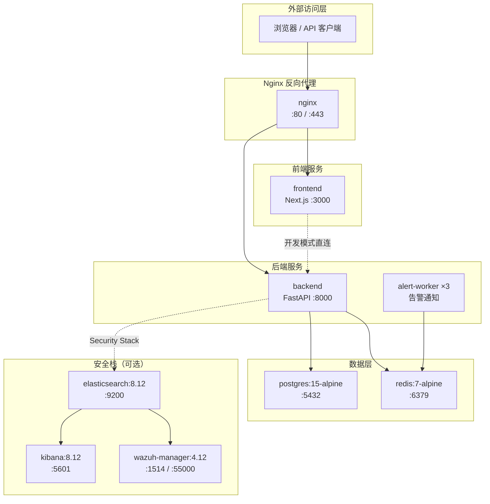
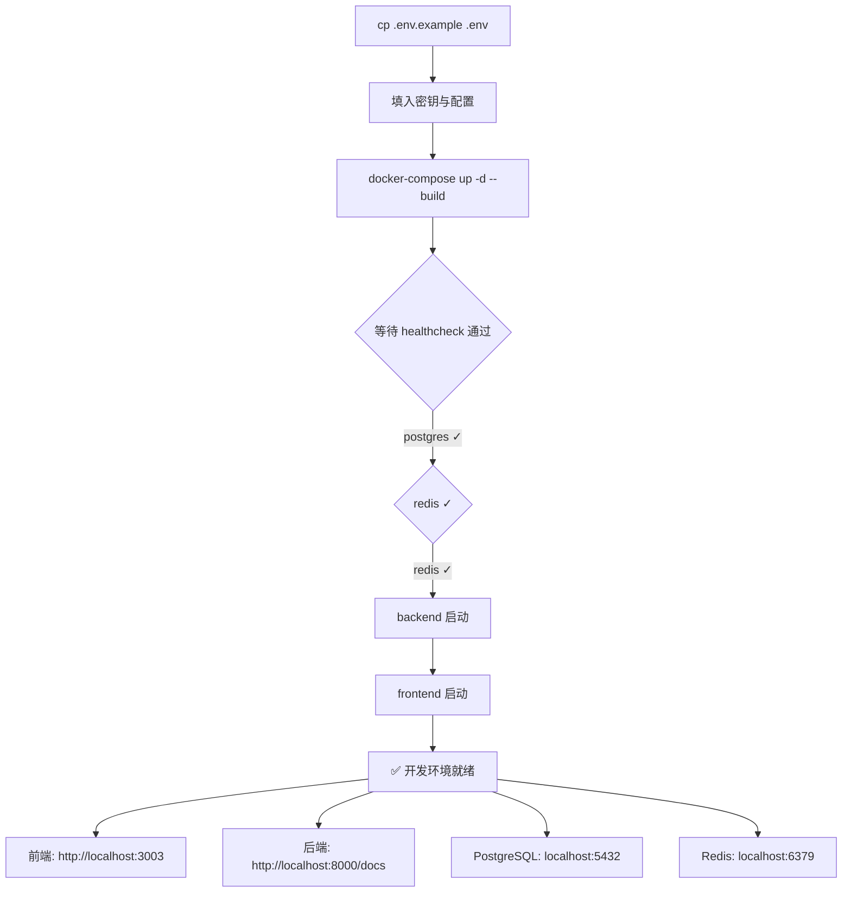

SOC Copilot 采用 **分层 Compose 文件** 策略管理容器化部署，通过 `docker-compose.yml` 定义基础服务拓扑，再以 `override` 和 `prod` 文件差异化注入开发与生产配置。这种设计使得一条 `docker-compose up` 即可启动完整开发环境，而 `docker-compose -f docker-compose.prod.yml up` 则切换至生产模式——无需修改任何代码。本文将完整拆解四种 Compose 文件的职责分工、网络隔离策略、环境变量体系，以及从首次启动到生产上线的全流程操作指南。

Sources: [docker-compose.yml](docker-compose.yml#L1-L154), [docker-compose.override.yml](docker-compose.override.yml#L1-L50), [docker-compose.prod.yml](docker-compose.prod.yml#L1-L151), [docker-compose.security.yml](docker-compose.security.yml#L1-L99)

## 整体架构：四层 Compose 文件体系

SOC Copilot 的容器编排并非单一文件堆砌，而是按 **关注点分离** 原则拆分为四个独立的 Compose 文件，各自承担不同层面的职责：

| 文件 | 用途 | 启动方式 | 镜像来源 |
|---|---|---|---|
| `docker-compose.yml` | **基础拓扑**：定义所有核心服务、网络与卷 | 自动加载 | 本地构建 |
| `docker-compose.override.yml` | **开发覆盖**：热重载、端口暴露、宽松安全 | 自动合并 | 本地构建 |
| `docker-compose.prod.yml` | **生产配置**：预构建镜像、Worker 扩展、资源调优 | `-f` 显式指定 | 远程镜像仓库 |
| `docker-compose.security.yml` | **安全栈**：Elasticsearch + Kibana + Wazuh | 独立启动 | 自定义镜像 |

**关键机制**：Docker Compose 在执行 `up` 时会自动合并同目录下的 `docker-compose.yml` 和 `docker-compose.override.yml`，这意味着开发环境下你只需执行 `docker-compose up -d`，开发覆盖配置会自动生效。而生产环境则需要显式指定 `-f docker-compose.prod.yml` 来跳过 override 文件。

Sources: [docker-compose.yml](docker-compose.yml#L1-L4), [docker-compose.override.yml](docker-compose.override.yml#L1-L4), [docker-compose.prod.yml](docker-compose.prod.yml#L1-L5), [docker-compose.security.yml](docker-compose.security.yml#L1-L7)

### 容器服务拓扑



开发模式与生产模式的核心差异在于 **Nginx 层**：生产环境必须经过 Nginx 反向代理（含 TLS 终止、限流、安全头），而开发模式下前端和后端直接暴露端口供调试使用。

Sources: [docker-compose.yml](docker-compose.yml#L117-L139), [docker-compose.override.yml](docker-compose.override.yml#L7-L24), [docker-compose.prod.yml](docker-compose.prod.yml#L92-L107)

## 网络隔离策略

SOC Copilot 采用三层网络隔离模型，确保数据层与后端层不被外部直接访问：

| 网络 | 用途 | 内部模式 | 挂载服务 |
|---|---|---|---|
| `frontend-net` | 前端↔后端通信 | 否（可外部访问） | frontend, backend, nginx |
| `backend-net` | 后端内部通信 | **是（外部不可达）** | backend, redis |
| `database-net` | 数据库通信 | **是（外部不可达）** | backend, postgres |

`internal: true` 标记是关键安全措施——即使容器端口被意外映射到宿主机，外部流量也无法通过 Docker 网络路由到达 backend-net 和 database-net 上的服务。生产配置（`docker-compose.prod.yml`）则使用统一的 `soc-copilot-prod` 网络并配合 Nginx 严格限制访问入口。

Sources: [docker-compose.yml](docker-compose.yml#L145-L153), [docker-compose.prod.yml](docker-compose.prod.yml#L148-L150)

## 环境变量体系

SOC Copilot 通过多层 `.env` 文件管理环境变量，确保不同场景下配置正确且安全。以下是环境变量文件的完整清单：

| 文件 | 用途 | 必填程度 |
|---|---|---|
| `.env.example` → `.env` | 主配置：数据库、Redis、密钥、AI Provider | **必须** |
| `.env.wazuh.example` → `.env.wazuh` | Wazuh 安全栈配置 | 可选（安全栈需要时） |
| `.env.notifications.example` | 通知渠道：飞书、Slack、邮件 | 可选 |
| `.env.test` | 测试环境配置 | 仅测试用 |

### 必填环境变量

在 `.env.example` 中，有两个变量使用了 Docker Compose 的 **必填校验语法** `${VAR:?ERROR message}`，启动时会强制校验：

```bash
# 必须手动生成，缺失将导致启动失败
DB_PASSWORD=          # openssl rand -base64 32
SECRET_KEY=           # openssl rand -base64 64
```

`docker-compose.yml` 中的校验写法为 `POSTGRES_PASSWORD: ${DB_PASSWORD:?ERROR: DB_PASSWORD environment variable is required}`，当变量未设置时，Docker Compose 会立即报错退出，而非使用空值。

Sources: [.env.example](.env.example#L1-L60), [docker-compose.yml](docker-compose.yml#L9-L10), [docker-compose.yml](docker-compose.yml#L65-L66)

### 快速初始化配置

```bash
# 1. 复制模板文件
cp .env.example .env

# 2. 生成并填入安全密钥（三选一即可）
# 方式 A：openssl
echo "DB_PASSWORD=$(openssl rand -base64 32)" >> .env
echo "SECRET_KEY=$(openssl rand -base64 64)" >> .env
echo "REDIS_PASSWORD=$(openssl rand -base64 32)" >> .env

# 3. 按需配置 AI Provider
# 编辑 .env 中的 AI_PROVIDER, ZHIPU_API_KEY 或 ANTHROPIC_API_KEY
```

Sources: [.env.example](.env.example#L1-L9)

## Dockerfile 多阶段构建

### 后端：Python 双阶段构建

后端 Dockerfile 采用 **builder + runtime** 双阶段构建，确保最终镜像仅包含运行时依赖，不含编译工具链：

| 阶段 | 基础镜像 | 职责 | 产物 |
|---|---|---|---|
| `builder` | `python:3.12-slim` | 安装编译工具（gcc, libpq-dev），编译 C 扩展 | `/root/.local` pip 用户目录 |
| 最终阶段 | `python:3.12-slim` | 仅复制编译产物，创建非 root 用户 | 生产就绪镜像 |

关键安全设计：最终阶段通过 `useradd -m -u 1000 appuser` 创建专用用户并 `USER appuser` 切换，容器内进程不以 root 身份运行。`HEALTHCHECK` 指令配置了对 `/api/health` 端点的自动探测（30 秒间隔，5 秒超时，3 次重试）。

Sources: [backend/Dockerfile](backend/Dockerfile#L1-L36)

### 前端：Next.js 三阶段构建

前端构建更为复杂，采用 **deps → builder → runner** 三阶段：

| 阶段 | 基础镜像 | 职责 |
|---|---|---|
| `deps` | `node:20-alpine` | `npm ci --omit=dev` 安装生产依赖 |
| `builder` | `node:20-alpine` | 复制依赖 + 源码，执行 `npm run build` |
| `runner` | `node:20-alpine` | 仅复制 standalone 产物 + static 资源 |

前端构建依赖 `next.config.js` 中配置的 `output: "standalone"` 选项，该选项让 Next.js 生成一个自包含的 `server.js`，无需完整 `node_modules` 目录，最终镜像体积显著缩小。运行时同样以非 root 用户（`nextjs`, uid 1001）运行。

Sources: [frontend/Dockerfile](frontend/Dockerfile#L1-L40), [frontend/next.config.js](frontend/next.config.js#L11)

## 开发模式部署

### 启动流程

开发模式的核心优势是 **零额外参数**。Docker Compose 会自动合并 `docker-compose.yml` + `docker-compose.override.yml`，后者注入了热重载、端口暴露和宽松安全策略：



### 开发模式的关键覆盖配置

`docker-compose.override.yml` 对基础配置做了以下关键覆盖：

| 配置项 | 基础值 | 开发覆盖值 | 目的 |
|---|---|---|---|
| backend command | `uvicorn --workers 4` | `uvicorn --reload` | 文件变更自动重载 |
| backend ports | 仅 `expose: 8000` | `ports: "8000:8000"` | 直接访问 API 文档 |
| frontend command | `node server.js` | `npm run dev` | Next.js 开发服务器 |
| frontend ports | 仅 `expose: 3000` | `ports: "3003:3003"` | 浏览器访问 |
| redis command | `--requirepass xxx` | 无密码 + `loglevel warning` | 简化调试 |
| backend volumes | `/app/__pycache__` | `./backend:/app` 挂载 | 热重载基础 |
| backend networks | backend-net, database-net | 额外加入 frontend-net | 允许前端直连 |

Sources: [docker-compose.override.yml](docker-compose.override.yml#L1-L50)

### 资源限制

基础 Compose 文件已为每个服务配置了 CPU 和内存限制，防止单个容器耗尽宿主机资源：

| 服务 | CPU 限制 | 内存限制 | CPU 预留 | 内存预留 |
|---|---|---|---|---|
| postgres | 2.0 核 | 2 GB | 0.5 核 | 512 MB |
| redis | 1.0 核 | 512 MB | — | — |
| backend | 2.0 核 | 2 GB | 0.5 核 | 512 MB |
| frontend | 1.0 核 | 1 GB | 0.25 核 | 256 MB |
| nginx | 0.5 核 | 256 MB | — | — |

Sources: [docker-compose.yml](docker-compose.yml#L24-L31), [docker-compose.yml](docker-compose.yml#L50-L54), [docker-compose.yml](docker-compose.yml#L83-L90), [docker-compose.yml](docker-compose.yml#L108-L115)

## 生产模式部署

### 启动流程

生产模式使用独立的 `docker-compose.prod.yml`，不加载 override 文件。它与开发模式有本质区别：使用预构建镜像（Docker Hub）而非本地构建、Nginx 始终启用、Alert Worker 水平扩展。

```bash
# 生产部署标准流程
docker-compose -f docker-compose.prod.yml pull    # 拉取最新镜像
docker-compose -f docker-compose.prod.yml up -d    # 启动所有服务
docker-compose -f docker-compose.prod.yml exec -T backend alembic upgrade head  # 数据库迁移
```

也可使用自动化部署脚本：

```bash
# 自动化脚本支持 local / staging / production 三种环境
./Scripts/deploy/deploy.sh production
```

该脚本会依次执行：Docker 环境检查 → 环境变量加载 → 数据库备份 → 镜像拉取 → 服务启动 → 数据库迁移 → 健康检查。生产环境部署会额外要求手动输入 `yes` 确认。

Sources: [docker-compose.prod.yml](docker-compose.prod.yml#L1-L5), [Scripts/deploy/deploy.sh](Scripts/deploy/deploy.sh#L100-L135)

### 生产与开发模式的核心差异

| 维度 | 开发模式 | 生产模式 |
|---|---|---|
| **镜像来源** | 本地 Dockerfile 构建 | Docker Hub 预构建镜像 |
| **Backend 启动** | `uvicorn --reload`（单 worker） | `uvicorn --workers 4` |
| **Frontend 启动** | `npm run dev`（开发服务器） | `node server.js`（standalone） |
| **Nginx** | 不启动（`profiles: [production]`） | 始终启动，TLS + 限流 |
| **Alert Worker** | 不启动 | 3 副本水平扩展 |
| **PostgreSQL 调优** | 默认配置 | `shared_buffers=256MB, max_connections=200` |
| **Redis 调优** | 无密码 | `maxmemory 512mb, allkeys-lru` 淘汰策略 |
| **重启策略** | `unless-stopped` | `always`（含 Docker 重启自恢复） |
| **端口暴露** | 全部映射到 localhost | 仅 Nginx 的 80/443 |
| **卷挂载** | 源码目录映射（热重载） | 独立命名卷（数据持久化） |

Sources: [docker-compose.yml](docker-compose.yml#L117-L139), [docker-compose.prod.yml](docker-compose.prod.yml#L109-L142)

### Alert Worker 水平扩展

生产配置中最值得注意的设计是 `alert-worker` 服务。它使用 Docker Compose 的 `deploy.mode: replicated` + `replicas: 3` 实现 3 个 Worker 实例并行运行，每个实例从 Redis Streams 消费告警消息并通过多渠道（飞书/Slack/邮件）发送通知：

```yaml
alert-worker:
  deploy:
    mode: replicated
    replicas: 3
    resources:
      limits:
        cpus: '0.5'
        memory: 256M
```

Worker 实现了优雅关闭（SIGTERM/SIGINT 信号处理）和每 60 秒的统计信息打印，支持通过 `WORKER_ID` 环境变量区分不同实例。注意该服务未设置 `container_name`，这是 Docker Compose replicas 模式的要求——多副本实例会自动生成唯一名称。

Sources: [docker-compose.prod.yml](docker-compose.prod.yml#L109-L142), [backend/workers/alert_worker.py](backend/workers/alert_worker.py#L41-L116)

## Nginx 反向代理配置

Nginx 在生产部署中承担 **TLS 终止、限流、安全头注入、WebSocket 代理** 四重职责。项目提供两套 Nginx 配置：

| 文件 | 适用场景 | 特点 |
|---|---|---|
| `nginx/nginx.conf` | 通用配置 | 简洁，适合快速上手 |
| `nginx/nginx.prod.conf` | 生产专用 | 完整 `http {}` 块、Gzip、Worker 调优、OCSP Stapling |

### 三级限流策略

Nginx 定义了三个独立的限流区域，按接口敏感度分级保护：

| 限流区域 | 速率 | 突发容量 | 适用路径 |
|---|---|---|---|
| `login` | 5 次/分钟 | 3 | `/api/auth/login` |
| `api` | 10 次/秒 | 20 | `/api/*` |
| `general` | 30 次/秒 | 50 | `/*`（前端页面） |

登录接口的限流极其严格（5r/m），这是因为暴力破解是安全系统最常面临的攻击向量。`burst=3 nodelay` 组合意味着突发 3 个请求会被立即处理（不排队），超出部分直接返回 429。

Sources: [nginx/nginx.prod.conf](nginx/nginx.prod.conf#L5-L7), [nginx/nginx.prod.conf](nginx/nginx.prod.conf#L93-L104), [nginx/nginx.prod.conf](nginx/nginx.prod.conf#L122-L140)

### WebSocket 代理

Nginx 对 `/ws` 路径配置了 WebSocket 专用代理参数，超时设置为 3600 秒（1 小时），避免长连接被意外断开：

```nginx
location /ws {
    proxy_http_version 1.1;
    proxy_set_header Upgrade $http_upgrade;
    proxy_set_header Connection "upgrade";
    proxy_read_timeout 3600s;
}
```

Sources: [nginx/nginx.prod.conf](nginx/nginx.prod.conf#L145-L158)

### SSL/TLS 配置

开发环境可使用自签名证书快速启动：

```bash
./generate_ssl_cert.sh
# 生成文件：nginx/ssl/fullchain.pem, nginx/ssl/privkey.pem
```

生产环境则强烈建议使用 Let's Encrypt：

```bash
certbot certonly --nginx -d your-domain.com
```

Nginx 生产配置启用了 TLSv1.2 + TLSv1.3、HSTS（2 年有效期 + preload）、OCSP Stapling 等安全特性，并通过 `server_tokens off` 隐藏 Nginx 版本信息。

Sources: [generate_ssl_cert.sh](generate_ssl_cert.sh#L1-L40), [nginx/nginx.prod.conf](nginx/nginx.prod.conf#L67-L79), [nginx/nginx.prod.conf](nginx/nginx.prod.conf#L81-L91)

## 安全栈部署（可选）

安全栈通过 `docker-compose.security.yml` 独立启动，包含 Elasticsearch、Kibana 和 Wazuh Manager 三个核心 SIEM 组件。它使用 `external: true` 的 `soc-copilot-network` 网络，与主 Compose 栈共享网络命名空间：

```bash
# 1. 先确保外部网络存在
docker network create soc-copilot-network 2>/dev/null || true

# 2. 启动主服务栈
docker-compose up -d

# 3. 启动安全栈
docker-compose -f docker-compose.security.yml up -d

# 4. 验证所有服务状态
./Scripts/deploy/check_deployment.sh
```

安全栈各服务的启动依赖链为：Elasticsearch（健康检查通过）→ Kibana + Wazuh Manager 并行启动。Elasticsearch 的 `start_period` 设为 60 秒、Kibana 设为 90 秒，反映了这两个 Java 应用较慢的冷启动特性。

Sources: [docker-compose.security.yml](docker-compose.security.yml#L87-L99), [Scripts/deploy/check_deployment.sh](Scripts/deploy/check_deployment.sh#L1-L87)

## 可观测性栈部署（可选）

可观测性栈通过 `backend/docker-compose.grafana.yml` 提供 Loki（日志聚合）、Promtail（日志采集）、Grafana（可视化）和 Prometheus（指标采集）四个组件：

| 服务 | 端口 | 用途 |
|---|---|---|
| Grafana | `:3001` | 仪表板可视化（admin/admin） |
| Loki | `:3100` | 日志存储与查询 |
| Prometheus | `:9090` | 指标采集与存储 |
| Promtail | — | 日志转发代理 |

```bash
docker-compose -f backend/docker-compose.grafana.yml up -d
```

部署完成后可运行验证脚本确认集成状态：`./Scripts/deploy/final_verification.sh`。

Sources: [backend/docker-compose.grafana.yml](backend/docker-compose.grafana.yml#L1-L62), [Scripts/deploy/final_verification.sh](Scripts/deploy/final_verification.sh#L1-L125)

## Makefile 快捷命令

项目 `Makefile` 提供了一组 Docker 相关的快捷命令，避免手动输入冗长的 docker-compose 指令：

| 命令 | 等效操作 |
|---|---|
| `make docker-up` | `docker-compose up -d` |
| `make docker-down` | `docker-compose down` |
| `make docker-logs` | `docker-compose logs -f` |
| `make docker-reset` | `docker-compose down -v && docker-compose up -d --build` |

`make docker-reset` 是最彻底的重置命令，它会删除所有命名卷（数据库数据、Redis 数据）后重新构建并启动。

Sources: [Makefile](Makefile#L139-L156)

## 备份与恢复

生产环境备份脚本 `Scripts/backup.sh` 支持完整的数据保护：

```bash
# 正式备份
./Scripts/backup.sh

# 预演模式（不实际创建备份）
./Scripts/backup.sh dry-run
```

备份内容包括 PostgreSQL 全量导出（gzip 压缩）、Redis RDB 快照、环境变量文件、Docker Compose 配置、数据库迁移文件，以及 SHA256 校验和文件。脚本默认保留 30 天备份，可通过 `BACKUP_RETENTION_DAYS` 环境变量调整。

Sources: [Scripts/backup.sh](Scripts/backup.sh#L1-L200)

## 常见问题排查

| 问题 | 可能原因 | 解决方案 |
|---|---|---|
| `DB_PASSWORD is required` | .env 文件缺失或未填值 | `cp .env.example .env` 并填入密钥 |
| backend 容器反复重启 | postgres healthcheck 未通过 | 检查 `docker-compose logs postgres`，确认数据库就绪 |
| 前端无法连接后端 | 开发模式下 CORS 配置 | 确认 `.env` 中 `CORS_ORIGINS` 包含前端地址 |
| Nginx 502 Bad Gateway | backend 服务未就绪 | 检查 `docker-compose ps` 确认 backend 为 Up 状态 |
| SSL 证书错误 | 自签名证书不被信任 | 开发环境可忽略；生产环境使用 Let's Encrypt |
| Alert Worker 不发送通知 | 通知渠道未配置 | 参考 `.env.notifications.example` 配置至少一个渠道 |
| 安全栈网络错误 | `soc-copilot-network` 不存在 | `docker network create soc-copilot-network` |

Sources: [docker-compose.yml](docker-compose.yml#L9-L10), [docker-compose.override.yml](docker-compose.override.yml#L17-L18), [.env.notifications.example](.env.notifications.example#L1-L93)

## 推荐阅读

- 如需理解各服务之间的调用关系和数据流向，参阅 [前后端整体架构与数据流设计](5-qian-hou-duan-zheng-ti-jia-gou-yu-shu-ju-liu-she-ji)
- 如需深入 Nginx 安全头、TLS 配置与生产加固检查清单，参阅 [生产环境配置：Nginx 反向代理、SSL 与安全加固检查清单](27-sheng-chan-huan-jing-pei-zhi-nginx-fan-xiang-dai-li-ssl-yu-an-quan-jia-gu-jian-cha-qing-dan)
- 如需了解 CI/CD 流水线如何与 Docker 镜像构建集成，参阅 [CI/CD 流水线：代码检查、安全扫描与自动化部署](25-ci-cd-liu-shui-xian-dai-ma-jian-cha-an-quan-sao-miao-yu-zi-dong-hua-bu-shu)
- 如需快速搭建本地环境而不使用 Docker，参阅 [快速启动：环境搭建与首次运行指南](2-kuai-su-qi-dong-huan-jing-da-jian-yu-shou-ci-yun-xing-zhi-nan)