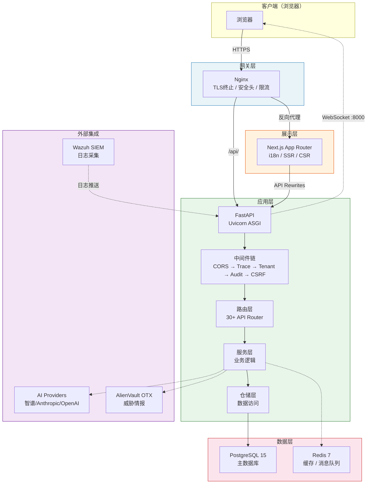
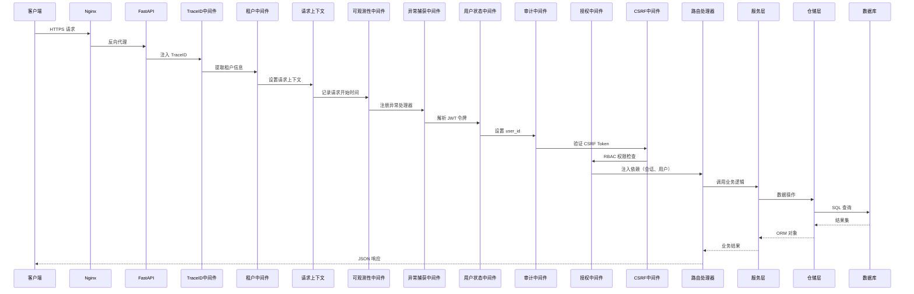
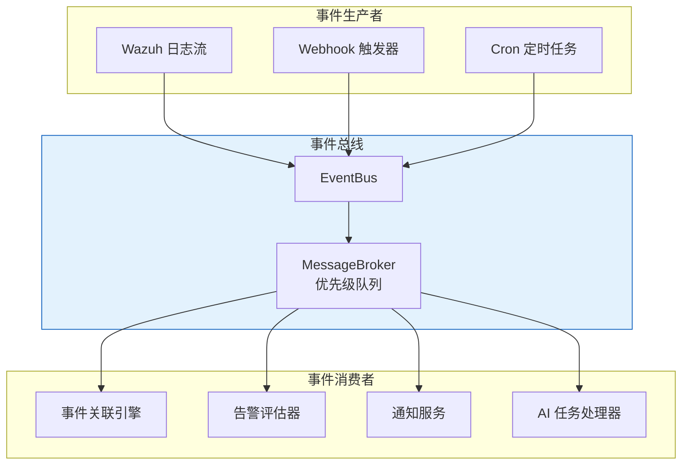

SOC Copilot 是一个面向安全运营中心（SOC）的智能分析平台，采用 **前后端分离** 的经典 B/S 架构，以 Docker Compose 编排多个服务容器为部署单元。后端基于 **FastAPI + SQLAlchemy 异步栈**，前端基于 **Next.js App Router**，两者通过 **REST API** 与 **WebSocket** 双通道协作完成从告警摄入、AI 分析、Playbook 执行到实时推送的完整数据闭环。本文将从宏观到微观，逐一拆解系统的架构分层、网络拓扑、请求生命周期和核心数据流。

Sources: [main.py](backend/main.py#L1-L576), [docker-compose.yml](docker-compose.yml#L1-L154)

## 系统部署拓扑与服务编排

系统通过 Docker Compose 定义了 **四层服务**：数据层（PostgreSQL + Redis）、应用层（Backend API）、展示层（Frontend）、网关层（Nginx）。开发环境通过 `docker-compose.override.yml` 自动叠加端口暴露与热重载配置，生产环境通过 `docker-compose.prod.yml` 增加水平扩展（如 3 副本 Alert Worker）和资源限制。

### 网络隔离设计

平台采用 **三级网络隔离** 策略，从物理层面阻断未授权的跨层访问：

| 网络名称 | 用途 | 访问控制 |
|---|---|---|
| `frontend-net` | Frontend ↔ Backend、Nginx ↔ Frontend/Backend | 外部可达 |
| `backend-net` | Backend ↔ Redis | `internal: true`，禁止外部访问 |
| `database-net` | Backend ↔ PostgreSQL | `internal: true`，禁止外部访问 |

PostgreSQL 和 Redis 均只绑定 `127.0.0.1`，即使在宿主机上也仅限本地连接。生产模式下 Nginx 作为唯一的入口点，统一终止 TLS、设置安全头、实施速率限制。

Sources: [docker-compose.yml](docker-compose.yml#L141-L153), [docker-compose.prod.yml](docker-compose.prod.yml#L1-L151), [nginx.conf](nginx/nginx.conf#L1-L159)

### 服务架构总览

Sources: [docker-compose.yml](docker-compose.yml#L56-L116), [main.py](backend/main.py#L331-L497)

## 前端架构：Next.js App Router 与多通道通信

前端采用 **Next.js 15 App Router** 架构，通过 `[locale]` 动态路由段实现中英文双语支持。`next-intl` 中间件在边缘运行时完成语言检测与重定向，页面组件通过 `NextIntlClientProvider` 注入翻译消息。布局层次为：根布局（`layout.tsx`）→ `ClientLayout`（QueryProvider + ToastProvider + GlobalSearch）→ 具体页面组件。

### 前端通信机制

前端与后端之间有 **三种通信通道**，分别服务于不同的业务场景：

| 通道 | 协议 | 用途 | 实现位置 |
|---|---|---|---|
| **API 代理** | HTTP REST | CRUD 操作、认证、报告生成 | `next.config.js` rewrites |
| **WebSocket** | WS/WSS | 实时告警推送、Playbook 运行状态 | `AlertWebSocket.tsx` |
| **Wazuh 流** | WebSocket | Wazuh SIEM 原始日志实时流 | `alertWebSocket.ts` |

**API 代理模式** 是前端与后端交互的主通道。Next.js 的 `rewrites` 配置将 `/api/*` 请求透明转发到 `http://localhost:8000/api/*`，开发者无需在前端代码中硬编码后端地址。认证令牌（JWT）通过 `Authorization: Bearer` 头自动附加在 `ApiClient` 的每次请求中，令牌存储在 `localStorage`，由 Zustand `authStore` 管理登录/刷新/登出的完整生命周期。

**WebSocket 模式** 用于需要服务器主动推送的场景。前端 `AlertWebSocket` 组件在挂载时建立连接，通过 `Sec-WebSocket-Protocol` 头传递 JWT 令牌以避免令牌出现在 URL 中。连接支持频道订阅（alerts / playbook_runs / system）、指数退避自动重连、心跳保活。后端 `ConnectionManager` 维护活跃连接字典和频道订阅集合，当检测到用户离线时自动将消息入队（Redis），待重连后投递。

Sources: [next.config.js](frontend/next.config.js#L25-L32), [ClientLayout.tsx](frontend/components/ClientLayout.tsx#L1-L19), [AlertWebSocket.tsx](frontend/components/AlertWebSocket.tsx#L48-L74), [alertWebSocket.ts](frontend/lib/alertWebSocket.ts#L53-L80), [authStore.ts](frontend/stores/authStore.ts#L41-L100), [client.ts](frontend/lib/api/client.ts#L4-L105)

### 前端状态管理

前端状态管理采用 **Zustand + React Query** 双轨制。Zustand 负责全局认证状态（用户信息、令牌、登录状态）和主题/通知等轻量级状态，通过 `persist` 中间件自动持久化到 `localStorage`。React Query（通过 `QueryProvider` 注入）负责服务端数据的缓存、轮询和乐观更新，避免重复请求。自定义 Hook 层（`useRetryFetch`、`useCachedQuery`、`useMonitor` 等）在两者之上封装了重试、缓存、超时等横切关注点。

Sources: [authStore.ts](frontend/stores/authStore.ts#L1-L100), [useRetryFetch.ts](frontend/hooks/useRetryFetch.ts#L51-L157), [ClientLayout.tsx](frontend/components/ClientLayout.tsx#L9-L18)

## 后端架构：FastAPI 分层与中间件链

后端遵循 **路由 → 依赖注入 → 服务 → 仓储 → 模型** 的五层架构。每一层职责明确：路由仅负责 HTTP 协议适配和参数校验；依赖注入（`dependencies/`）处理认证、授权和会话管理；服务层封装业务逻辑和外部调用；仓储层隔离数据库操作；模型层定义 ORM 映射。

### 请求生命周期

一个典型的 API 请求从进入后端到返回响应，需要经过以下 **中间件链**（按 Starlette 的栈式执行顺序，最后添加的最先执行）：

Sources: [main.py](backend/main.py#L398-L449), [middleware/__init__.py](backend/middleware/__init__.py#L1-L57)

### 中间件链详解

后端注册了 **10+ 中间件**，按功能可分为三类：

| 类别 | 中间件 | 职责 |
|---|---|---|
| **请求追踪** | `TraceIDMiddleware` | 为每个请求生成唯一 Trace ID，注入日志上下文 |
| **请求追踪** | `RequestContextMiddleware` | 标准化请求元信息（方法、路径、客户端 IP） |
| **安全防护** | `TenantMiddleware` | 多租户场景下隔离数据访问 |
| **安全防护** | `CSRFMiddleware` | 验证状态修改请求的 CSRF Token |
| **安全防护** | `ResourceAuthorizationMiddleware` | 资源级所有权校验 |
| **可观测性** | `AuditMiddleware` | 记录所有 API 操作到审计日志 |
| **可观测性** | `ObservabilityMiddleware` | 采集 Prometheus 指标和分布式追踪 Span |
| **可观测性** | `ExceptionCaptureMiddleware` | 捕获未处理异常并转换为标准错误响应 |
| **性能监控** | `PerformanceMiddleware` | 记录慢请求（默认阈值 200ms） |

中间件的添加顺序遵循 Starlette 的栈式模型：最后添加的 `AuditMiddleware` 最先执行请求阶段、最后执行响应阶段。这意味着审计日志能捕获到完整的请求处理结果，包括异常。

Sources: [main.py](backend/main.py#L414-L449), [core/config.py](backend/core/config.py#L98-L102)

### 服务生命周期管理

后端通过 `LifecycleManager` 实现 **优先级驱动的服务启动与优雅关闭**。所有后台服务继承 `LifecycleService` 基类，声明 `name`、`priority` 和 `dependencies`，由管理器按优先级排序后依次启动，关闭时按逆序停止。

| 优先级 | 级别 | 包含服务 | 启动时机 |
|---|---|---|---|
| `0` | CRITICAL | DatabaseService | 最先启动，其他服务依赖 |
| `10` | ESSENTIAL | QueueManagerService、CronSchedulerService、RateLimiterService | 基础设施就绪后 |
| `20` | NORMAL | AITaskProcessorService、WebSocketMonitoringService、AlertEvaluatorService | 核心业务服务 |
| `30` | OPTIONAL | AuditArchiveService | 最后启动，失败不影响核心功能 |

启动流程：运行数据库迁移 → 校验安全环境变量 → 注册并启动生命周期服务 → 创建引导管理员 → 加载 Playbook 节点插件 → 启动 WebSocket 清理后台任务。任何 CRITICAL 或 ESSENTIAL 服务启动失败将阻止应用就绪。

Sources: [core/lifecycle.py](backend/core/lifecycle.py#L48-L200), [main.py](backend/main.py#L189-L328)

## 核心数据流解析

### 数据流一：告警分析（同步请求-响应）

这是系统最核心的数据流，从用户提交原始日志到获得 AI 驱动的分析结果：

```mermaid
flowchart LR
    A["用户提交<br/>原始日志"] --> B["前端<br/>POST /api/analyze-alert"]
    B --> C["API Rewrite<br/>→ backend:8000"]
    C --> D["中间件链<br/>认证 + 审计"]
    D --> E["AlertRouter<br/>参数校验"]
    E --> F["AlertService<br/>业务编排"]
    F --> G["IOC 提取<br/>双引擎"]
    G --> H["AI Provider<br/>智能分析"]
    H --> I["威胁情报<br/>OTX 查询"]
    I --> J["结果持久化<br/>PostgreSQL"]
    J --> K["JSON 响应<br/>返回前端"]

    style A fill:#fff3e0
    style K fill:#e8f5e9
```

1. **前端发起**：用户在 Alert Analyzer 页面输入原始日志文本，前端通过 `ApiClient.post()` 发送 POST 请求到 `/api/analyze-alert`
2. **API 代理**：Next.js rewrite 规则将请求转发到后端 `http://localhost:8000/api/analyze-alert`
3. **中间件处理**：请求依次经过 TraceID、审计、认证等中间件
4. **路由层**：`AlertRouter` 接收请求，通过 `Depends(get_session)` 获取异步数据库会话
5. **服务层**：`AlertService.analyze()` 编排 IOC 提取 → AI 分析 → 威胁情报查询的完整流程
6. **持久化**：分析结果写入数据库，响应返回给前端

Sources: [routers/alert.py](backend/routers/alert.py#L1-L44), [next.config.js](frontend/next.config.js#L25-L32)

### 数据流二：实时告警推送（WebSocket）

实时告警推送采用 **发布-订阅** 模式，支持离线消息缓存：

1. **连接建立**：前端 `AlertWebSocket` 组件携带 JWT 令牌通过 `Sec-WebSocket-Protocol` 头连接到 `ws://backend:8000/ws/alerts`
2. **认证与订阅**：后端 `websocket.py` 从协议头提取令牌验证用户身份，`ConnectionManager` 将连接注册到指定频道（alerts / playbook_runs / system）
3. **告警触发**：任意后端服务调用 `push_alert()` 向所有在线连接广播告警数据
4. **离线缓存**：对于已知但当前离线的用户，消息通过 `MessageQueueService` 入队到 Redis，待用户重连后自动投递
5. **心跳保活**：前端定期发送 ping，后端响应 pong，超时则触发重连（指数退避，最大 30 秒）

Sources: [routers/websocket.py](backend/routers/websocket.py#L48-L79), [websocket_manager.py](backend/services/websocket_manager.py#L41-L80), [AlertWebSocket.tsx](frontend/components/AlertWebSocket.tsx#L48-L80)

### 数据流三：事件驱动的异步处理

系统通过 `EventBus` + `MessageBroker` 实现 **进程内异步事件处理**，用于告警关联、通知分发等场景。`EventBus` 将事件封装为 `EventEnvelope`（含 event_id、event_type、priority、tenant_id），通过 `MessageBroker` 发布到内存队列。消费者按优先级（critical > high > medium > low）消费事件，支持延迟投递。

Sources: [event_bus.py](backend/services/event_bus.py#L18-L60)

## 数据库与缓存策略

### 双模式数据库

系统支持 **SQLite（开发）与 PostgreSQL（生产）** 双模式。`db/session.py` 通过检测 `DATABASE_URL` 环境变量自动选择数据库引擎：SQLite 使用 `NullPool`（无连接池，避免多线程问题），PostgreSQL 使用 `asyncpg` 驱动配合连接池（默认 20 连接、40 溢出）。数据库迁移通过 Alembic 管理，在应用启动时自动执行 `upgrade head`。

Sources: [db/session.py](backend/db/session.py#L1-L128), [core/config.py](backend/core/config.py#L78-L83)

### Redis 缓存层

Redis 在系统中承担三重角色：

| 角色 | 用途 | 配置 |
|---|---|---|
| **消息队列** | WebSocket 离线消息、事件总线 | `redis://:password@redis:6379/0` |
| **令牌黑名单** | JWT 注销后立即失效 | 通过 `redis_enabled` 开关控制 |
| **幂等性键** | 防止重复请求 | `IdempotencyMiddleware` |

生产模式下 Redis 配置了 512MB 内存上限和 `allkeys-lru` 淘汰策略，确保内存不会无限增长。

Sources: [docker-compose.yml](docker-compose.yml#L34-L54), [docker-compose.prod.yml](docker-compose.prod.yml#L34-L49), [core/config.py](backend/core/config.py#L85-L87)

## 认证与授权数据流

系统采用 **JWT + API Key** 双认证机制。前端登录流程：用户提交凭证 → 后端验证密码 → 生成 access_token（12h 有效）和 refresh_token（7d 有效）→ 令牌同时存入 `localStorage` 和 `HttpOnly Cookie`。后续请求通过 `Authorization: Bearer` 头自动附带令牌。API Key 认证面向自动化场景（Webhook、CI/CD），通过前缀匹配 + bcrypt 哈希验证，并内置速率限制防止枚举攻击。

RBAC 权限模型定义了三种角色（admin / analyst / auditor），权限通过 `_get_permissions_by_role` 函数映射，并使用两级缓存（`lru_cache` 按角色 + TTL 缓存按用户）减少数据库查询。

Sources: [dependencies/auth.py](backend/dependencies/auth.py#L1-L200), [routers/auth.py](backend/routers/auth.py#L1-L80), [authStore.ts](frontend/stores/authStore.ts#L52-L100)

## 生产环境安全加固

生产环境部署时，系统在多个层面实施安全加固：

- **Nginx 层**：TLS 1.2+ 强制、HSTS、安全响应头、登录接口 5次/分钟限流、API 接口 10次/秒限流、WebSocket 1小时超时
- **应用层**：CORS 白名单拒绝通配符 `*`、JWT Secret 最少 32 字符、引导密码最少 12 字符、CSRF Token 验证
- **网络层**：`backend-net` 和 `database-net` 标记为 `internal: true`，PostgreSQL 和 Redis 仅绑定 `127.0.0.1`

Sources: [nginx.conf](nginx/nginx.conf#L1-L159), [main.py](backend/main.py#L376-L405), [core/config.py](backend/core/config.py#L122-L155)

## 架构特征总结

| 维度 | 技术选型 | 设计理念 |
|---|---|---|
| **后端框架** | FastAPI + Uvicorn | 异步非阻塞，高并发支持 |
| **前端框架** | Next.js App Router | SSR + CSR 混合渲染，国际化内置 |
| **数据库** | SQLite / PostgreSQL | 开发零依赖，生产级连接池 |
| **缓存** | Redis 7 | 消息队列 + 令牌黑名单 + 幂等键 |
| **实时通信** | WebSocket + 频道订阅 | 发布-订阅模式，离线消息缓存 |
| **事件驱动** | EventBus + MessageBroker | 优先级队列，延迟投递 |
| **认证** | JWT + API Key | 双通道认证，RBAC 权限控制 |
| **网关** | Nginx | TLS 终止、安全头、速率限制 |
| **部署** | Docker Compose | 三级网络隔离，服务编排 |

---

**推荐阅读路径**：理解整体架构后，建议深入 [后端分层架构：路由、服务、仓储与模型](6-hou-duan-fen-ceng-jia-gou-lu-you-fu-wu-cang-chu-yu-mo-xing) 了解后端每一层的详细设计，或直接跳转到 [中间件链：审计、幂等性、请求追踪与异常捕获](19-zhong-jian-jian-lian-shen-ji-mi-deng-xing-qing-qiu-zhui-zong-yu-yi-chang-bu-huo) 查看中间件的实现细节。