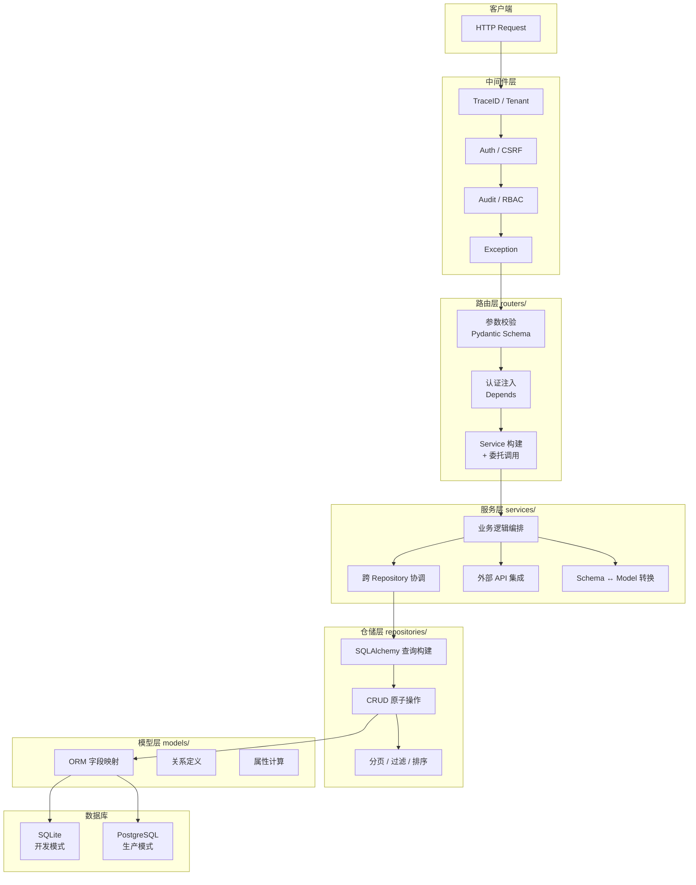
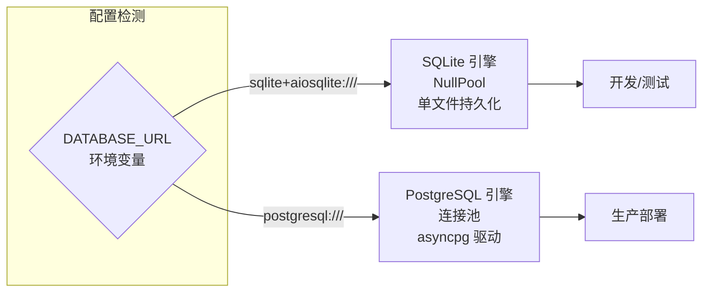
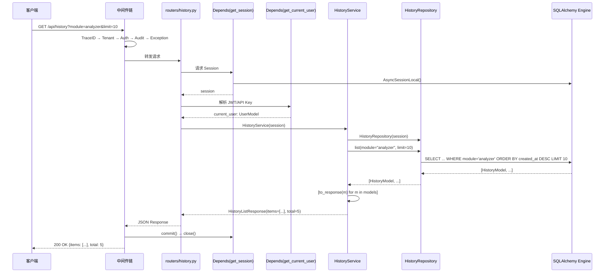

SOC Copilot 后端采用经典的 **四层分离架构**（Router → Service → Repository → Model），基于 FastAPI 框架构建，以 SQLAlchemy ORM 为数据访问基础，实现了关注点分离与可测试性。本文将逐层剖析每一层的职责边界、协作模式和设计约定，帮助你理解请求从 HTTP 入口到数据库持久化的完整生命周期。

## 架构全景：四层协作与数据流



上图展示了请求从客户端到达数据库的完整链路。中间件层处理横切关注点（追踪、认证、审计），路由层负责 HTTP 语义解析与参数校验，服务层承载核心业务逻辑，仓储层封装数据访问细节，模型层定义数据结构与表映射。

Sources: [main.py](backend/main.py#L1-L576), [routers/\_\_init\_\_.py](backend/routers/__init__.py#L1-L63), [services/\_\_init\_\_.py](backend/services/__init__.py#L1-L15), [repositories/\_\_init\_\_.py](backend/repositories/__init__.py#L1-L5), [models/\_\_init\_\_.py](backend/models/__init__.py#L1-L65)

---

## 路由层（Router）：HTTP 接口的守门人

路由层是后端分层架构中最外层的一环，直接面向 HTTP 协议。每个路由模块以 **独立文件** 形式组织在 `backend/routers/` 目录下，通过 FastAPI 的 `APIRouter` 定义端点。路由层的核心职责是：**接收请求、校验参数、注入依赖、委托服务层处理后返回响应**。它不包含任何业务逻辑，仅充当 HTTP 世界与业务逻辑之间的桥梁。

### 路由注册与组织

所有路由模块在 [main.py](backend/main.py#L452-L497) 中统一注册到 FastAPI 应用实例。注册顺序遵循「无认证优先、认证路由其次、业务路由最后」的原则——`health` 路由无需认证，始终优先加载。

Sources: [main.py](backend/main.py#L452-L497)

### 路由定义模式

以 `history` 路由为例，展示了标准路由的完整模式：

```python
# routers/history.py — 典型路由模式
router = APIRouter(prefix="/api/history", tags=["history"])

@router.get("", response_model=HistoryListResponse)
async def list_history(
    module: Annotated[str | None, Query(description="Filter by module")] = None,
    query: Annotated[str | None, Query(description="Search query")] = None,
    limit: Annotated[int, Query(ge=1, le=100)] = 50,
    session: AsyncSession = Depends(get_session),
    current_user: UserModel = Depends(get_current_user),
) -> HistoryListResponse:
    service = HistoryService(session)
    return await service.list_history(module=module, query=query, limit=limit)
```

**关键设计要点**：

| 关注点 | 实现方式 | 说明 |
|--------|---------|------|
| **参数校验** | Pydantic `Query`/`Body` + 类型注解 | FastAPI 自动生成 OpenAPI 校验 |
| **数据库会话** | `Depends(get_session)` | 依赖注入，自动管理事务生命周期 |
| **认证授权** | `Depends(get_current_user)` | JWT/API Key 双模式认证 |
| **服务委托** | `Service(session)` 构造后调用 | 路由不包含业务逻辑 |
| **响应模型** | `response_model=XXXResponse` | 自动序列化与文档生成 |

Sources: [routers/history.py](backend/routers/history.py#L1-L103), [routers/assets.py](backend/routers/assets.py#L1-L118), [routers/alert.py](backend/routers/alert.py#L1-L44)

### 依赖注入体系

路由层通过 FastAPI 的 `Depends` 机制实现依赖注入，形成了清晰的认证与授权管线。核心依赖定义在 `backend/dependencies/` 目录中：

| 依赖函数 | 来源 | 用途 |
|---------|------|------|
| `get_current_user` | [dependencies/auth.py](backend/dependencies/auth.py#L1-L99) | JWT/API Key 认证，返回 `UserModel` |
| `require_admin` | [dependencies/\_\_init\_\_.py](backend/dependencies/__init__.py#L1-L27) | 角色校验，仅 admin 可访问 |
| `require_analyst` | 同上 | analyst 及以上角色可访问 |
| `get_resource_checker` | [dependencies/authorization.py](backend/dependencies/__init__.py#L11-L15) | 资源级访问控制 |
| `get_session` | [db/session.py](backend/db/session.py#L98-L115) | 数据库会话，自动提交/回滚 |

Sources: [dependencies/\_\_init\_\_.py](backend/dependencies/__init__.py#L1-L27), [dependencies/auth.py](backend/dependencies/auth.py#L1-L99), [db/session.py](backend/db/session.py#L98-L115)

---

## 服务层（Service）：业务逻辑的编排中心

服务层是架构的核心引擎，承载所有业务逻辑、跨仓储协调和外部系统集成。它遵循 **「薄路由、厚服务」** 的设计原则——路由仅做参数传递，而服务负责真正的业务编排。服务层通过构造函数注入数据库会话，在其内部创建或组合多个 Repository 实例来完成复杂操作。

### 服务层目录结构

服务层按业务域组织为嵌套子目录，形成了清晰的领域边界：

```
services/
├── alerting/          # 告警分析域（去重、丰富、生命周期、评估）
├── correlation/       # 事件关联域（规则引擎、关联分析）
├── lifecycle/         # 后台服务域（数据库、队列、调度器）
├── message_broker/    # 消息中间件（Redis/Kafka 抽象）
├── notifications/     # 通知渠道（飞书、Slack、邮件）
├── observability/     # 可观测性（性能监控、WS 监控）
├── playbook/          # Playbook 域（DAG 编译、执行、版本管理）
├── playbook_executors/ # 节点执行器（HTTP、IOC 提取、审批等）
├── security/          # 安全域（密钥管理、漏洞服务）
└── user/              # 用户域（Cookie 认证）
```

Sources: [services/ 目录结构](backend/services/)

### 两种服务构造模式

本项目中存在两种服务实例化模式，反映了架构的渐进演进：

**模式一：构造器注入 Session（主流模式）**

```python
# services/history_service.py — 标准模式
class HistoryService:
    def __init__(self, session: AsyncSession) -> None:
        self.repository = HistoryRepository(session)

    async def list_history(self, module, query, limit):
        models = await self.repository.list(module=module, query=query, limit=limit)
        items = [self.repository.to_response(m) for m in models]
        return HistoryListResponse(items=items, total=len(items))
```

路由中每次请求手动构造：`service = HistoryService(session)`。适用于有状态请求（需要数据库会话）的同步服务。

**模式二：多服务组合编排（复杂业务）**

```python
# services/alerting/alert_service.py — 编排模式
class AlertService:
    def __init__(self, session: AsyncSession | None = None) -> None:
        self.session = session
        self.history_service = HistoryService(session) if session else None
        self.llm_service = get_llm_retry_service()      # 单例服务
        self.asset_service = AssetService(session) if session else None
        self.ioc_hits_service = IOCHitsService(session) if session else None
        self.impact_service = ImpactAnalysisService(session) if session else None
        self.threat_intel_service = ThreatIntelService(session) if session else None
```

`AlertService` 是一个典型的**编排服务**：它组合了 6 个子服务，在 `analyze()` 方法中按步骤执行本地 IOC 提取 → LLM 分析 → IOC 合并 → 影响分析 → 威胁情报 → 历史记录，形成了完整的分析管线。

Sources: [services/history_service.py](backend/services/history_service.py#L1-L120), [services/alerting/alert_service.py](backend/services/alerting/alert_service.py#L59-L177)

### 服务层核心职责矩阵

| 职责 | 示例 | 说明 |
|------|------|------|
| **业务规则校验** | `AssetService.create()` 检查 hostname/IP 唯一性 | 在写入前验证业务约束 |
| **跨仓储协调** | `AlertService.analyze()` 协调 History + IOCHits + Asset | 一个业务操作涉及多个数据实体 |
| **外部 API 集成** | `ThreatIntelService` 调用 OTX API | 封装第三方调用与降级策略 |
| **Model → Schema 转换** | `HistoryService` 通过 `repository.to_response()` 转换 | 隔离 ORM 模型与 API 契约 |
| **事务边界管理** | 通过 `session.commit()` 提交 | 服务层不显式管理事务，由 DI 容器管理 |
| **降级策略** | `LLMRetryService` 自动降级到备用模型 | 保证核心功能可用性 |

Sources: [services/asset_service.py](backend/services/asset_service.py#L1-L200), [services/alerting/alert_service.py](backend/services/alerting/alert_service.py#L179-L200)

---

## 仓储层（Repository）：数据访问的抽象屏障

仓储层将所有 SQLAlchemy 查询操作封装在独立的类中，使服务层无需直接操作 ORM 查询语句。这种 **Repository Pattern** 的核心价值在于：将数据访问逻辑与业务逻辑彻底解耦，使服务层的单元测试可以通过 Mock Repository 来避免数据库依赖。

### BaseRepository：通用 CRUD 基类

[base.py](backend/repositories/base.py#L1-L174) 提供了一个基于泛型的通用基类，封装了 8 个标准 CRUD 操作：

```python
class BaseRepository(Generic[ModelType]):
    def __init__(self, session: AsyncSession, model: type[ModelType]):
        self.session = session
        self.model = model

    async def get(self, id: str) -> ModelType | None: ...
    async def get_by_field(self, field_name: str, value: Any) -> ModelType | None: ...
    async def list(self, filters, limit, offset, order_by, ascending) -> list[ModelType]: ...
    async def count(self, filters) -> int: ...
    async def create(self, **kwargs) -> ModelType: ...
    async def update(self, id: str, **kwargs) -> ModelType | None: ...
    async def delete(self, id: str) -> bool: ...
    async def bulk_update(self, filters, **kwargs) -> int: ...
    async def bulk_delete(self, filters) -> int: ...
    async def exists(self, id: str) -> bool: ...
    async def get_or_create(self, filters, defaults) -> tuple[ModelType, bool]: ...
```

**设计特点**：`flush()` 而非 `commit()`——仓储层只做 `flush`（将变更推送到数据库事务），不负责提交。事务的 `commit` 由上层 `get_session()` 依赖在请求结束时统一处理，确保了请求级别的事务一致性。

Sources: [repositories/base.py](backend/repositories/base.py#L1-L174)

### 两种仓储实现风格

项目中存在两种仓储实现风格，它们在构造函数签名和职责划分上存在差异：

| 特征 | 风格 A（HistoryRepository） | 风格 B（AssetRepository） |
|------|---------------------------|--------------------------|
| **构造器** | `__init__(self, session)` | 无 `__init__`，session 作为方法参数 |
| **实例化** | `repo = HistoryRepository(session)` | `repo = AssetRepository()` |
| **方法签名** | `async def create(self, data)` | `async def create(self, session, data)` |
| **继承基类** | 独立实现 | 独立实现 |
| **Model → Schema** | `to_response()` 静态方法 | 由 Service 层转换 |
| **代表文件** | [history_repository.py](backend/repositories/history_repository.py#L1-L121) | [asset_repository.py](backend/repositories/asset_repository.py#L1-L137) |

**风格 A** 将 session 绑定在构造器中，方法签名更简洁，适合在服务层中按请求构造使用。**风格 B** 将 session 作为方法参数传递，更适合需要在同一个仓储实例中切换不同会话的场景（如批量操作）。

### 仓储层的查询能力

以 `AuditRepository` 为例，展示了仓储层的高级查询能力——支持通配符过滤、状态码分类、日期范围等复合条件构建：

```python
# repositories/audit_repository.py — 复杂查询构建
async def list(self, skip, limit, user_id, action, path, status_code, date_from, date_to):
    conditions = []
    if action:
        if action.endswith(":*"):           # 通配符: "login:*" 匹配所有 login 动作
            conditions.append(AuditLogModel.action.like(f"{prefix}:%"))
    if status_code == "success":           # 分类过滤: "2xx"
        conditions.append(AuditLogModel.status_code.between(200, 299))
    if date_from:
        conditions.append(AuditLogModel.created_at >= date_from)
    # ... 分页 + 排序
```

Sources: [repositories/audit_repository.py](backend/repositories/audit_repository.py#L1-L196)

### 缓存扩展仓储

Playbook Definition 的仓储展示了 **缓存装饰扩展模式**——通过继承基础仓储类，添加缓存层：

```python
class PlaybookDefinitionRepositoryCached(PlaybookDefinitionRepository):
    async def get_cached(self, definition_id: str) -> PlaybookDefinitionModel | None:
        cache = get_cache()
        cache_key = f"{CacheKeys.PLAYBOOK_DEFINITION}:{definition_id}"
        cached = await cache.get(cache_key)
        if cached is not None:
            return PlaybookDefinitionModel(**cached)
        entity = await self.get_by_id(definition_id)
        if entity is not None:
            await cache.set(cache_key, entity.__dict__, CacheKeys.PLAYBOOK_TTL)
        return entity
```

这种「基础仓储 + 缓存装饰」的模式允许在不修改原有查询逻辑的前提下透明地引入缓存。

Sources: [repositories/playbook_definition_repository.py](backend/repositories/playbook_definition_repository.py#L165-L200)

---

## 模型层（Model）：数据结构的声明式定义

模型层使用 SQLAlchemy 2.0 的 **Mapped Column** 声明式语法，定义数据库表结构与字段映射。每个模型继承自 `db.session.Base`（SQLAlchemy 的 `declarative_base()`），以 `__tablename__` 指定表名，以 `Mapped[type]` + `mapped_column()` 定义字段。

### 模型定义模式

以 `HistoryModel` 为例，展示了最简洁的模型定义风格：

```python
# models/history.py
class HistoryModel(Base):
    __tablename__ = "history"

    id: Mapped[str] = mapped_column(String(36), primary_key=True, default=lambda: str(uuid.uuid4()))
    module: Mapped[str] = mapped_column(String(50), index=True, nullable=False)
    created_at: Mapped[datetime] = mapped_column(DateTime(timezone=True), default=lambda: datetime.now(), index=True)
    input_text: Mapped[str] = mapped_column(String, nullable=False)
    output_json: Mapped[dict] = mapped_column(JSON, nullable=False)
    extracted_iocs: Mapped[dict] = mapped_column(JSON, nullable=False, default=lambda: {})
    # ...
```

Sources: [models/history.py](backend/models/history.py#L1-L41)

### 模型设计约定

| 约定 | 实现方式 | 示例 |
|------|---------|------|
| **主键策略** | UUID v4，`String(36)` 存储 | `id: Mapped[str] = mapped_column(String(36), primary_key=True, default=lambda: str(uuid.uuid4()))` |
| **时间字段** | `DateTime(timezone=True)` 或 ISO 字符串 | HistoryModel 使用 `DateTime`，UserModel 使用 `String(30)` |
| **JSON 字段** | SQLAlchemy `JSON` 类型 | `output_json`、`extracted_iocs`、`password_history` |
| **索引策略** | 高频查询字段添加 `index=True` | `username`、`email`、`role`、`created_at` |
| **复合索引** | `__table_args__` 定义 | `Index("ix_users_role_is_active", "role", "is_active")` |
| **软删除** | `is_active` 布尔字段 | UserModel.delete() 设置 `is_active=False` |
| **外键约束** | `ForeignKey` + `ondelete` | `user_id: Mapped[str] = mapped_column(String(36), ForeignKey("users.id", ondelete="CASCADE"))` |

Sources: [models/user.py](backend/models/user.py#L1-L57), [models/audit_log.py](backend/models/audit_log.py#L1-L46), [models/api_key.py](backend/models/api_key.py#L1-L48)

### 关系模型与 Playbook 定义体系

Playbook Definition 模型展示了最复杂的关系映射——一个 Definition 拥有 Nodes、Edges、Triggers、Runs 和 Versions 五个关联关系：

```python
class PlaybookDefinitionModel(Base):
    __tablename__ = "playbook_definitions"
    # ... 字段定义 ...

    nodes = relationship("PlaybookNodeModel", back_populates="definition", cascade="all, delete-orphan")
    edges = relationship("PlaybookEdgeModel", back_populates="definition", cascade="all, delete-orphan")
    triggers = relationship("PlaybookTriggerModel", back_populates="definition", cascade="all, delete-orphan")
    runs = relationship("PlaybookRunModel", back_populates="definition", ...)
    versions = relationship("PlaybookDefinitionVersionModel", back_populates="definition", cascade="all, delete-orphan")

    @property
    def can_modify(self) -> bool:
        return self.status == PlaybookDefinitionStatus.DRAFT
```

这里使用了 `cascade="all, delete-orphan"` 策略，确保删除 Definition 时级联清理所有关联数据。同时通过 `@property` 提供业务语义的计算属性（如 `can_modify`、`dag_json`）。

Sources: [models/playbook_definition.py](backend/models/playbook_definition.py#L1-L255)

### 多租户预留：TenantMixin

项目通过 `TenantMixin` 为多租户扩展预留了基础设施。当前所有 `tenant_id` 默认值为 `"default"`，未来启用多租户时只需在中间件层注入租户上下文：

```python
class TenantMixin:
    tenant_id: Mapped[str] = mapped_column(
        String(64), nullable=False, index=True, default="default"
    )
```

`UserModel` 已直接包含了 `tenant_id` 字段，表明多租户架构已在用户域率先落地。

Sources: [models/tenant_mixin.py](backend/models/tenant_mixin.py#L1-L11), [models/user.py](backend/models/user.py#L27-L29)

---

## Schema 层：API 契约的守卫者

虽然 Schema 层不在传统的四层架构中，但它是连接路由层与服务层的关键纽带。Schema 使用 **Pydantic v2** 定义，承担三个核心职责：请求参数校验、响应序列化格式、以及 Model → API 的数据转换屏障。

### Schema 分类体系

```
schemas/
├── common.py         # 通用响应包装（APIResponse、PaginatedData、ErrorResponse）
├── alert.py          # 告警分析请求/响应
├── history.py        # 历史记录创建/响应
├── user.py           # 用户登录/令牌/资料
├── asset.py          # 资产 CRUD
├── playbook.py       # Playbook 相关
└── ...
```

每种业务实体通常定义三类 Schema：

| Schema 类型 | 命名约定 | 用途 | 示例 |
|------------|---------|------|------|
| **Create** | `XxxCreate` | 创建请求体校验 | `HistoryCreate`、`AssetCreate` |
| **Update** | `XxxUpdate` | 更新请求体校验（字段可选） | `AssetUpdate` |
| **Response** | `XxxResponse` | 响应序列化格式 | `HistoryResponse`、`MeResponse` |

Sources: [schemas/history.py](backend/schemas/history.py#L1-L54), [schemas/common.py](backend/schemas/common.py#L1-L200), [schemas/alert.py](backend/schemas/alert.py#L1-L138)

### 统一响应格式

[schemas/common.py](backend/schemas/common.py#L26-L60) 定义了统一的 API 响应包装器，确保所有端点返回结构一致的 JSON：

```python
class APIResponse(BaseModel, Generic[T]):
    code: str = Field(default="SUCCESS")
    message: str = Field(default="OK")
    data: T | None = Field(default=None)
    trace_id: str | None = Field(default=None)
    timestamp: datetime = Field(default_factory=lambda: datetime.now(UTC))
```

值得注意的是，项目中存在两套响应体系（[schemas/common.py](backend/schemas/common.py#L26-L60) 和 [core/response.py](backend/core/response.py#L29-L41)），前者以 `code`/`data` 为核心，后者以 `success`/`error` 为核心。当前大多数路由直接返回 Pydantic Schema 而非包装在 `APIResponse` 中，这是渐进统一过程中的现状。

Sources: [schemas/common.py](backend/schemas/common.py#L26-L119), [core/response.py](backend/core/response.py#L29-L90)

---

## 数据库会话管理：事务生命周期的核心

[db/session.py](backend/db/session.py#L1-L128) 是整个数据访问管线的基础设施，负责引擎创建、会话工厂配置和事务生命周期管理。

### 双模式引擎策略



关键差异在于连接池策略：SQLite 使用 `NullPool`（每次请求新建连接），PostgreSQL 使用配置化的连接池（`pool_size`、`max_overflow`、`pool_pre_ping` 等）。

### 事务自动管理

`get_session()` 依赖注入函数实现了请求级事务管理：

```python
async def get_session() -> AsyncSession:
    session = AsyncSessionLocal()
    try:
        yield session
        await session.commit()     # 请求成功 → 自动提交
    except Exception as e:
        await session.rollback()   # 请求失败 → 自动回滚
        raise
    finally:
        await session.close()      # 请求结束 → 关闭会话
```

这意味着 **服务层和仓储层无需手动调用 `commit()`**——只需 `flush()` 将变更推送到事务中，由框架在请求结束时统一提交。部分仓储（如 `HistoryRepository`、`AuditRepository`）内部调用了 `commit()`，这通常是因为它们需要在请求结束前确保数据已持久化（例如审计日志的即时写入）。

Sources: [db/session.py](backend/db/session.py#L1-L128)

---

## 完整请求流：从 HTTP 到数据库

以「获取历史记录列表」为例，追踪一个请求穿越四层架构的完整路径：



**流程序号说明**：

1. **中间件链**处理横切关注点（TraceID 生成、租户识别、认证校验、审计记录、异常捕获）
2. **路由层**通过 `Depends` 注入数据库会话和当前用户
3. **路由层**构造 `HistoryService(session)`，委托业务调用
4. **服务层**内部创建 `HistoryRepository(session)`，调用 `list()` 方法
5. **仓储层**构建 SQLAlchemy 查询，通过异步引擎执行
6. **服务层**将 `HistoryModel` 列表转换为 `HistoryResponse` Schema 列表
7. **框架层**在响应返回后自动 `commit()` 事务并关闭会话

Sources: [routers/history.py](backend/routers/history.py#L16-L36), [services/history_service.py](backend/services/history_service.py#L82-L100), [repositories/history_repository.py](backend/repositories/history_repository.py#L64-L88), [db/session.py](backend/db/session.py#L98-L115)

---

## 架构模式总结

| 模式 | 实现位置 | 价值 |
|------|---------|------|
| **Repository Pattern** | `repositories/` | 数据访问逻辑集中管理，业务层与 ORM 解耦 |
| **Dependency Injection** | `Depends(get_session)` / `Depends(get_current_user)` | 会话与认证的声明式注入，天然可测试 |
| **Service-Router 分离** | 路由仅做参数校验与委托 | 业务逻辑可复用，路由可替换 |
| **Schema 屏障** | Pydantic Request/Response Schema | API 契约稳定，内部模型变更不影响外部 |
| **泛型基类** | `BaseRepository[ModelType]` | 通用 CRUD 操作零重复 |
| **构造器注入** | `Service(session)` / `Repository(session)` | 依赖显式化，生命周期清晰 |
| **缓存装饰** | `PlaybookDefinitionRepositoryCached` | 透明引入缓存，不侵入基础逻辑 |
| **Session-per-Request** | `get_session()` yield 模式 | 请求级事务自动管理，防止连接泄漏 |

---

## 延伸阅读

理解后端分层架构后，建议按以下顺序深入学习相邻模块：

- [服务生命周期管理与优先级启动机制](7-fu-wu-sheng-ming-zhou-qi-guan-li-yu-you-xian-ji-qi-dong-ji-zhi) — 了解后台服务（队列、调度器、WebSocket）如何随应用启动/关闭
- [数据库设计：SQLite/PostgreSQL 双模式与 Alembic 迁移](8-shu-ju-ku-she-ji-sqlite-postgresql-shuang-mo-shi-yu-alembic-qian-yi) — 深入数据库引擎配置与迁移策略
- [中间件链：审计、幂等性、请求追踪与异常捕获](19-zhong-jian-jian-lian-shen-ji-mi-deng-xing-qing-qiu-zhui-zong-yu-yi-chang-bu-huo) — 理解请求在到达路由之前的中间件处理链
- [认证体系：JWT 令牌、API Key、CSRF 防护与密码策略](17-ren-zheng-ti-xi-xi-jwt-ling-pai-api-key-csrf-fang-hu-yu-mi-ma-ce-lue) — 深入 `get_current_user` 依赖的认证实现细节