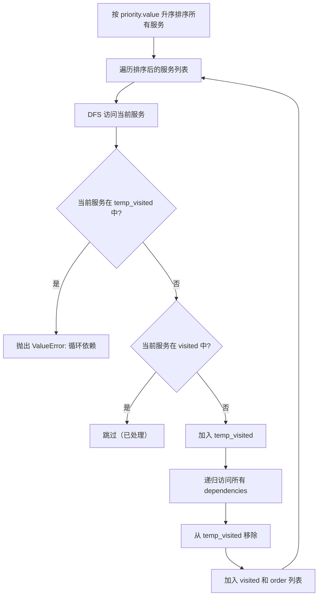
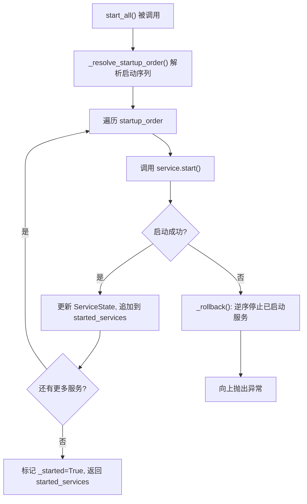
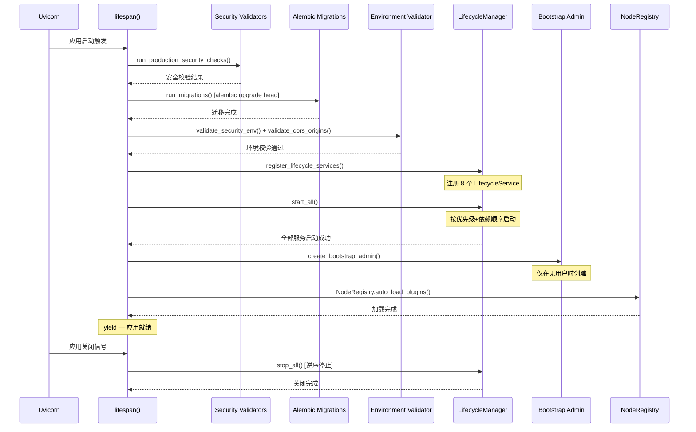

SOC Copilot 后端基于 **FastAPI 的 `lifespan` 异步上下文管理器** 构建了一套结构化的服务生命周期体系。这套体系将数据库连接、消息队列、定时调度器、AI 后台处理器等核心组件统一抽象为 **`LifecycleService`**，由全局单例 **`LifecycleManager`** 负责按优先级排序启动、按依赖拓扑解析顺序、在失败时自动回滚、在关闭时按逆序优雅停止。本文将深入剖析这一机制的设计哲学、核心抽象、启动流程与故障恢复策略。

Sources: [lifecycle.py](backend/core/lifecycle.py#L1-L33), [main.py](backend/main.py#L1-L5)

## 设计动机与核心抽象

在复杂的后端系统中，服务启动顺序往往隐含着依赖关系——队列管理器需要数据库先就绪，AI 处理器需要数据库和缓存先初始化，审计归档则可以在一切就绪后异步启动。如果将这些逻辑散落在 `startup` 事件处理函数中，代码将变得难以测试、难以扩展、难以在启动失败时正确回滚。

SOC Copilot 选择了 **声明式优先级 + 显式依赖声明** 的双轴模型来解决这个问题。每个服务通过两个维度声明自己的启动时机：**`ServicePriority`** 枚举提供粗粒度的四级分组，**`dependencies`** 属性提供细粒度的服务间依赖。`LifecycleManager` 在启动时先按优先级排序，再通过深度优先拓扑排序解析依赖，最终生成一个无冲突的线性启动序列。

Sources: [lifecycle.py](backend/core/lifecycle.py#L48-L59), [lifecycle.py](backend/core/lifecycle.py#L90-L120)

### ServicePriority：四级优先级体系

| 优先级 | 数值 | 语义 | 典型服务 |
|--------|------|------|----------|
| `CRITICAL` | 0 | 基础设施层，必须最先启动，失败直接终止 | DatabaseService |
| `ESSENTIAL` | 10 | 核心支撑层，依赖 CRITICAL 级别 | QueueManagerService, CronSchedulerServiceWrapper, RateLimiterService |
| `NORMAL` | 20 | 业务逻辑层，依赖基础设施和支撑服务 | AITaskProcessorService, WebSocketMonitoringService, AlertEvaluatorService |
| `OPTIONAL` | 30 | 辅助功能层，可条件启用 | AuditArchiveService |

`ServicePriority` 继承自 `IntEnum`，这意味着它天然支持数值比较和排序操作。`LifecycleManager._resolve_startup_order()` 方法首先按 `priority.value` 对所有已注册服务排序，然后对每个服务执行深度优先遍历以解析其 `dependencies` 链。

Sources: [lifecycle.py](backend/core/lifecycle.py#L48-L59)

### ServiceState：运行时状态快照

每个注册的服务都关联一个 `ServiceState` 数据类实例，记录四项关键元数据：`started`（是否已启动）、`error`（启动/停止过程中的异常）、`started_at`（启动时间戳）、`stopped_at`（停止时间戳）。该状态对象通过 `to_dict()` 方法可序列化为字典，供健康检查 API 和运维监控面板消费。

Sources: [lifecycle.py](backend/core/lifecycle.py#L61-L87)

### LifecycleService 抽象基类

`LifecycleService` 是所有受管理服务的基类，定义了五个核心接口：

```python
class LifecycleService(ABC):
    @property
    @abstractmethod
    def name(self) -> str: ...           # 唯一标识，用于依赖声明和日志追踪
    
    @property
    def priority(self) -> ServicePriority:  # 默认 NORMAL，子类可覆盖
        return ServicePriority.NORMAL

    @property
    def dependencies(self) -> list[str]:    # 依赖的服务名列表
        return []

    @abstractmethod
    async def start(self) -> None: ...      # 启动逻辑，失败抛异常触发回滚

    @abstractmethod
    async def stop(self) -> None: ...       # 停止逻辑，不应抛异常

    async def health_check(self) -> bool:   # 可覆盖，默认返回 True
        return True
```

**关键设计决策**：`start()` 被设计为允许抛异常——任何启动失败都会触发已启动服务的逐个回滚。而 `stop()` 被设计为"尽力而为"——即使某个服务停止失败，也不应阻断其他服务的关闭流程。

Sources: [lifecycle.py](backend/core/lifecycle.py#L90-L176)

## LifecycleManager 核心机制

`LifecycleManager` 是整个生命周期体系的中枢控制器。它维护三个核心数据结构：`_services`（名称到服务实例的映射）、`_states`（名称到状态对象的映射）、`_startup_order`（实际启动顺序的记录，用于关闭时的逆序回放）。

Sources: [lifecycle.py](backend/core/lifecycle.py#L178-L215)

### 启动顺序解析：优先级排序 + 拓扑排序

启动顺序的解析分为两个阶段。第一阶段按 `ServicePriority` 数值升序排列所有服务；第二阶段对排序后的服务列表执行**深度优先遍历（DFS）**，确保每个服务的 `dependencies` 在其自身之前被访问。算法同时维护 `visited`（已完成集合）和 `temp_visited`（当前路径集合）来检测循环依赖——如果 DFS 过程中遇到已在 `temp_visited` 中的节点，说明存在循环引用，立即抛出 `ValueError`。



值得注意的是，如果一个服务声明了尚未注册的依赖，系统不会报错终止，而是打印一条警告日志后继续——这体现了**宽松依赖**（soft dependency）的设计哲学，避免因注册顺序问题导致启动失败。

Sources: [lifecycle.py](backend/core/lifecycle.py#L264-L310)

### 启动流程与失败回滚

`start_all()` 方法严格按解析后的顺序逐个启动服务。每启动一个服务成功，立即更新其 `ServiceState`（标记 `started=True`，记录 `started_at` 时间戳），并将服务名追加到 `started_services` 列表。如果任何服务启动失败，`LifecycleManager` 会调用 `_rollback()` 方法，将已启动的服务**按逆序逐一停止**——这确保了资源的完整回收，不会留下半初始化的残留状态。



Sources: [lifecycle.py](backend/core/lifecycle.py#L312-L362)

### 优雅关闭：逆序停止

`stop_all()` 方法沿 `_startup_order` 的逆序逐个调用 `service.stop()`。与启动阶段不同，关闭过程中单个服务的停止异常只会被记录到 `ServiceState.error`，不会中断后续服务的关闭。这种**容错关闭**策略保证了即使在部分服务状态异常的情况下，系统仍能完成最大程度的资源回收。

Sources: [lifecycle.py](backend/core/lifecycle.py#L364-L410)

### 健康检查与全局单例

`LifecycleManager.health_check()` 方法遍历所有已启动的服务，调用各自的 `health_check()` 方法，返回一个 `{服务名: 健康状态}` 的字典。这使得上层路由（如 `/api/health`）能够聚合所有服务的健康状态，输出系统级的健康报告。

`LifecycleManager` 通过模块级全局变量 `_lifecycle_manager` 实现单例模式，由 `get_lifecycle_manager()` 函数延迟创建。`reset_lifecycle_manager()` 函数用于测试环境重置，确保测试间无状态泄漏。

Sources: [lifecycle.py](backend/core/lifecycle.py#L435-L491)

## 已注册服务全景

下表列出了 SOC Copilot v0.8.0 注册到 `LifecycleManager` 的全部 8 个服务，按实际启动顺序排列：

| 序号 | 服务名 | 实现类 | 优先级 | 依赖 | 核心职责 |
|------|--------|--------|--------|------|----------|
| 1 | `database` | `DatabaseService` | CRITICAL (0) | 无 | 建表 (`init_db`) + 关闭连接池 (`engine.dispose`) |
| 2 | `queue_manager` | `QueueManagerService` | ESSENTIAL (10) | database | Playbook 执行队列：恢复未完成运行 + 启动后台处理器 |
| 3 | `cron_scheduler` | `CronSchedulerServiceWrapper` | ESSENTIAL (10) | database | 定时触发器调度：初始化 CronSchedulerService 并启动 |
| 4 | `rate_limiter` | `RateLimiterService` | ESSENTIAL (10) | 无 | Redis 限流器初始化与连接清理 |
| 5 | `ai_task_processor` | `AITaskProcessorService` | NORMAL (20) | database | AI 后台任务处理器启动与优雅停止 |
| 6 | `websocket_monitoring` | `WebSocketMonitoringService` | NORMAL (20) | 无 | WebSocket 监控 + 消息压缩 + 批量服务 + 连接池 |
| 7 | `alert_evaluator` | `AlertEvaluatorService` | NORMAL (20) | 无 | 告警评估引擎启动 |
| 8 | `audit_archive` *(条件注册)* | `AuditArchiveService` | OPTIONAL (30) | 无 | 审计日志定时归档（`asyncio.create_task` 后台协程） |

其中 `AuditArchiveService` 仅在 `settings.audit_log_cleanup_enabled` 为 `True` 时才会注册，体现了**条件性服务注册**模式。

Sources: [main.py](backend/main.py#L189-L229), [\_\_init\_\_.py](backend/services/lifecycle/__init__.py#L1-L66)

### 各服务实现细节

**DatabaseService** 作为唯一的 CRITICAL 级别服务，是整个服务树的根节点。它在 `start()` 中调用 `init_db()` —— 该函数导入所有 SQLAlchemy 模型注册到 `Base.metadata`，然后通过 `engine.begin()` 执行 `create_all` 建表。`stop()` 则调用 `engine.dispose()` 关闭所有数据库连接。它还实现了自定义的 `health_check()` —— 执行 `SELECT 1` 查询验证连接可用性。

Sources: [database_service.py](backend/services/lifecycle/database_service.py#L1-L66), [session.py](backend/db/session.py#L118-L128)

**QueueManagerService** 和 **CronSchedulerServiceWrapper** 是两个 ESSENTIAL 级别服务，都声明了 `["database"]` 依赖。`QueueManagerService` 在启动时创建 `RunQueueManager` 实例，调用 `recover_runs()` 恢复上次异常退出时未完成的 Playbook 运行，然后启动后台处理器。`CronSchedulerServiceWrapper` 创建 `CronSchedulerService` 实例并启动定时任务调度。

Sources: [queue_manager_service.py](backend/services/lifecycle/queue_manager_service.py#L1-L93), [cron_scheduler_service.py](backend/services/lifecycle/cron_scheduler_service.py#L1-L80)

**RateLimiterService** 同为 ESSENTIAL 级别但不声明依赖——它的 Redis 初始化是独立的，不依赖数据库连接。

Sources: [rate_limiter_service.py](backend/services/lifecycle/rate_limiter_service.py#L1-L57)

**WebSocketMonitoringService** 是一个聚合型服务，在其 `start()` 方法中连续启动了四个子服务：WebSocket 监控服务、消息压缩服务、批量消息服务、连接池服务。这种**门面模式**（Facade Pattern）将多个相关的后台服务打包为单一的 `LifecycleService`，简化了注册和管理的复杂度。

Sources: [websocket_monitoring_service.py](backend/services/lifecycle/websocket_monitoring_service.py#L14-L80)

**AuditArchiveService** 采用了 `asyncio.create_task` 模式启动后台归档协程，`stop()` 中通过 `cancel()` + `await` 的组合实现优雅取消。这种模式适用于长期运行的后台周期性任务。

Sources: [websocket_monitoring_service.py](backend/services/lifecycle/websocket_monitoring_service.py#L116-L166)

## 应用启动全景：lifespan 函数

SOC Copilot 的 FastAPI 应用实例通过 `lifespan` 异步上下文管理器将生命周期服务编排串联到框架的启动/关闭钩子中。整个启动过程分为七个阶段：



Sources: [main.py](backend/main.py#L232-L328)

### 第一阶段：生产安全校验

在服务启动之前，`run_production_security_checks()` 会验证 JWT Secret、Bootstrap 管理员密码、CORS 配置和密钥加密密钥等安全关键配置。如果 `settings.strict_production_checks` 为 `True`，校验失败将直接抛出 `RuntimeError` 终止启动；否则仅记录 CRITICAL 级别日志后继续。

Sources: [main.py](backend/main.py#L253-L264), [security_validators.py](backend/core/security_validators.py#L221-L254)

### 第二阶段：数据库迁移

`run_migrations()` 通过子进程调用 `alembic upgrade head`，使用 `asyncio.to_thread` 避免阻塞事件循环。迁移失败不会终止启动——系统假定迁移可能已经应用过（幂等性设计），仅输出警告日志。

Sources: [main.py](backend/main.py#L143-L186)

### 第三阶段：环境变量校验

`validate_security_env()` 和 `validate_cors_origins()` 确认安全相关的环境变量配置正确，特别是生产环境下的 CORS 来源白名单。

Sources: [main.py](backend/main.py#L269-L273)

### 第四阶段：生命周期服务启动

`register_lifecycle_services()` 创建全局 `LifecycleManager` 单例，按优先级分组注册所有 8 个服务，然后调用 `start_all()`。如果任何服务启动失败，已启动的服务会被自动回滚停止，异常向上传播导致应用启动终止。

Sources: [main.py](backend/main.py#L275-L278)

### 第五至七阶段：后置初始化

服务全部启动后，系统执行三项后置初始化：通过 `create_bootstrap_admin()` 在首次部署时创建初始管理员账户；通过 `NodeRegistry.auto_load_plugins()` 从插件目录加载 DAG 节点插件；启动 WebSocket 用户清理的周期性后台任务（每小时执行一次）。

Sources: [main.py](backend/main.py#L280-L315)

### 关闭阶段

当 Uvicorn 接收到关闭信号时，`lifespan` 函数在 `yield` 之后的代码被执行：首先取消 WebSocket 清理后台任务（`cancel()` + `await`），然后调用 `manager.stop_all()` 逆序停止所有生命周期服务。

Sources: [main.py](backend/main.py#L319-L328)

## 扩展指南：添加新的生命周期服务

向 SOC Copilot 添加新的受管理服务需要三步操作：

**第一步**：在 `backend/services/lifecycle/` 下创建新的服务类，继承 `LifecycleService`：

```python
# backend/services/lifecycle/my_new_service.py
from core.lifecycle import LifecycleService, ServicePriority

class MyNewService(LifecycleService):
    @property
    def name(self) -> str:
        return "my_new_service"

    @property
    def priority(self) -> ServicePriority:
        return ServicePriority.NORMAL  # 根据实际需求选择优先级

    @property
    def dependencies(self) -> list[str]:
        return ["database"]  # 声明依赖

    async def start(self) -> None:
        # 初始化逻辑
        pass

    async def stop(self) -> None:
        # 清理逻辑（不应抛异常）
        pass
```

**第二步**：在 `backend/services/lifecycle/__init__.py` 中导出新类并添加到 `__all__` 列表。

**第三步**：在 `backend/main.py` 的 `register_lifecycle_services()` 函数中，按优先级分组调用 `manager.register(MyNewService())`。

选择优先级时应遵循以下原则：如果服务是其他服务的基础设施（如数据库、缓存），使用 `CRITICAL`；如果服务支撑多个业务模块（如队列、调度器），使用 `ESSENTIAL`；如果服务是独立的业务逻辑，使用 `NORMAL`；如果服务是可选的增强功能，使用 `OPTIONAL`。

Sources: [lifecycle.py](backend/core/lifecycle.py#L90-L176), [\_\_init\_\_.py](backend/services/lifecycle/__init__.py#L29-L66), [main.py](backend/main.py#L189-L229)

## 与健康检查体系的协作

`LifecycleManager.health_check()` 提供了服务级别的健康探测能力，而 `backend/routers/health.py` 则在此之上构建了面向 Kubernetes 的三层健康探测端点：`/health/live`（存活探针，不依赖外部组件）、`/health/ready`（就绪探针，检查数据库连通性）、`/api/health`（详细健康报告，聚合数据库、Redis、Token Blacklist 状态）。两层体系互为补充——`LifecycleManager` 关注的是服务启动后的持续健康状态，而 health 路由关注的是请求级别的组件可用性。

Sources: [health.py](backend/routers/health.py#L1-L199), [lifecycle.py](backend/core/lifecycle.py#L435-L455)

## 设计决策总结

| 设计决策 | 选择 | 原因 |
|----------|------|------|
| 启动排序策略 | 优先级 + 拓扑排序 | 粗粒度分组减少配置负担，细粒度依赖保证正确性 |
| 失败策略 | 启动失败立即回滚 | 避免半初始化状态导致运行时不可预测行为 |
| 关闭策略 | 容错关闭，异常不传播 | 最大化资源回收，避免关闭流程被阻塞 |
| 依赖缺失策略 | 警告日志 + 继续启动 | 宽松依赖避免注册顺序耦合 |
| 全局实例 | 模块级单例 | 确保整个应用共享同一个 Manager 状态 |
| 服务注册时机 | 集中在单一函数中 | 一目了然的启动清单，便于审计和维护 |

Sources: [lifecycle.py](backend/core/lifecycle.py#L178-L210)

---

**阅读建议**：理解服务生命周期后，建议继续阅读 [数据库设计：SQLite/PostgreSQL 双模式与 Alembic 迁移](8-shu-ju-ku-she-ji-sqlite-postgresql-shuang-mo-shi-yu-alembic-qian-yi) 以了解 `DatabaseService` 底层的双模式数据库架构，以及 [中间件链：审计、幂等性、请求追踪与异常捕获](19-zhong-jian-jian-lian-shen-ji-mi-deng-xing-qing-qiu-zhui-zong-yu-yi-chang-bu-huo) 以了解 `RateLimiterService` 所支撑的中间件体系。