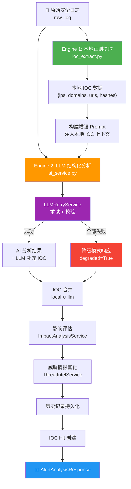
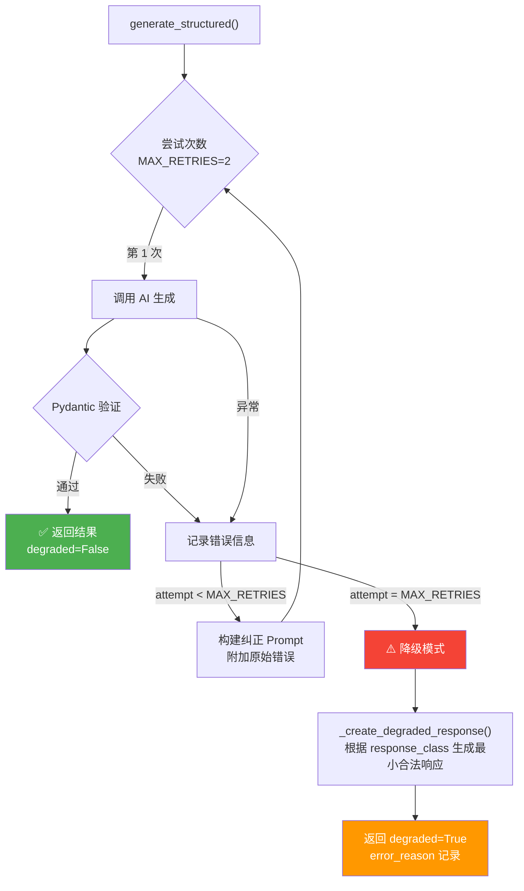
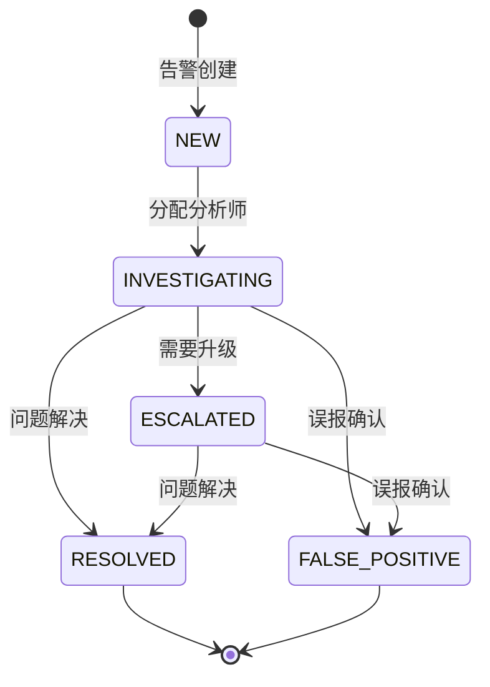

告警分析引擎是 SOC Copilot 平台的核心智能模块，负责将原始安全日志转化为结构化威胁研判结果。该引擎采用**双引擎 IOC 提取架构**——本地正则引擎在毫秒级完成确定性提取，LLM 引擎在此基础上补充语义层面的 IOC 发现，两者通过集合合并策略保证结果的完备性与准确性。整个分析流程覆盖 IOC 提取、AI 结构化分析、影响评估、威胁情报富化、历史记录持久化和 Playbook 触发器联动六大阶段，并通过**降级容错机制**确保在 LLM 不可用时仍能返回可用的分析结果。

Sources: [alert_service.py](backend/services/alerting/alert_service.py#L1-L16)

## 架构总览

在深入各组件实现细节之前，理解告警分析引擎的整体数据流至关重要。下图展示了从原始日志输入到最终分析结果输出的完整处理管线：



**入口点**为 `POST /api/analyze-alert` 路由，接收 `AlertAnalysisRequest`（仅需 `raw_log` 字段），由 `AlertService.analyze()` 方法编排整个六阶段管线。

Sources: [alert.py](backend/routers/alert.py#L17-L43), [alert_service.py](backend/services/alerting/alert_service.py#L76-L177)

## 双引擎 IOC 提取机制

双引擎设计是告警分析的核心架构决策。**本地正则引擎**提供确定性、可重复的 IOC 提取，不受 LLM 输出不确定性影响；**LLM 引擎**则利用语义理解能力补充正则难以捕获的 IOC（如被上下文分割的 URL、变形编码的哈希值等）。两者通过集合合并策略实现互补。

### 引擎一：本地正则提取器

`extract_iocs()` 函数是本地提取的核心，采用六组精心调优的正则表达式，在毫秒级完成对原始日志的扫描：

| IOC 类型 | 正则模式 | 设计考量 |
|---------|---------|---------|
| **IPv4** | 八进制范围约束 `(25[0-5]\|2[0-4]\d\|...)` | 精确匹配有效 IP，拒绝 `999.999.999.999` 等无效地址 |
| **域名** | 标签长度约束 `{0,61}` + TLD 长度 `{2,63}` | 符合 RFC 1035 规范，避免匹配版本号或文件路径 |
| **URL** | 支持 `http://`, `https://`, `hxxp://`, `hxxps://` | 兼容安全社区常见的 URL 脱敏写法 |
| **MD5** | 32 位十六进制 + 前后向否定断言 | 防止匹配 SHA1/SHA256 的子串 |
| **SHA1** | 40 位十六进制 + 前后向否定断言 | 同理防止子串误匹配 |
| **SHA256** | 64 位十六进制 + 前后向否定断言 | 精确匹配完整 SHA256 值 |

提取前会先执行**反混淆预处理**——`_normalize_obfuscation()` 函数将 `hxxps://` 还原为 `https://`，将 `[.]`、`(.)`、`{dot}` 等常见威胁情报脱敏标记还原为实际点号。这一设计确保引擎能处理安全社区常见的 IOC 脱敏格式。

提取结果封装为 `IOCs` 数据类，提供 `to_dict()` 方法用于序列化和 Prompt 注入。`get_ioc_count()` 辅助函数则用于生成各类型 IOC 的统计摘要。

Sources: [ioc_extract.py](backend/utils/ioc_extract.py#L1-L118)

### 引擎二：LLM 语义分析

本地 IOC 提取完成后，引擎将提取结果注入 Prompt 上下文，发送给 LLM 进行结构化分析。Prompt 构建策略如下：

```
Pre-extracted IOCs (Local Regex):
- IPs: 192.168.1.100, 10.0.0.5
- Domains: evil.com
- URLs: None
- Hashes: abc123...

IMPORTANT: These IOCs are pre-extracted from the input.
You may only add NEW IOCs that are actually present in the raw log text above.
DO NOT fabricate any IOCs.
```

这段 Prompt 设计有两个关键约束：第一，明确告知 LLM 已有本地提取结果，LLM **只能补充**新的 IOC，不能替换或忽略已有结果；第二，明确禁止 LLM 编造不存在的 IOC（"DO NOT fabricate any IOCs"）。这一约束有效抑制了 LLM 幻觉问题。

LLM 需要输出的分析维度包括：事件类型分类（`EventType` 枚举）、严重等级、IOC 合并结果、实体识别（用户/主机/进程）、摘要、证据点、推荐处置动作、升级决策和置信度评分。

Sources: [alert_service.py](backend/services/alerting/alert_service.py#L101-L124)

### IOC 合并策略

双引擎提取完成后，`_merge_iocs()` 方法执行集合合并。合并规则是 **local ∪ llm**（并集），本地提取结果优先：

```python
for ioc_type in ["ips", "domains", "urls", "hashes"]:
    local_set = set(local_iocs.__getattribute__(ioc_type))
    llm_set = set(llm_iocs.get(ioc_type, []))
    merged = sorted(local_set | llm_set)
```

最终响应中同时保留三个字段以支持溯源审计：`iocs`（合并结果）、`iocs_local`（纯本地提取）、`iocs_llm`（纯 LLM 补充），加上 `ioc_count` 统计字段。这种三源分离的设计让运维人员可以清楚追溯每个 IOC 的来源。

Sources: [alert_service.py](backend/services/alerting/alert_service.py#L352-L403)

## LLM 服务架构与容错机制

### 多 Provider 支持

系统通过 **工厂模式**（`LLMFactory`）支持六种 LLM Provider，统一抽象为 `LLMProvider` 基类的 `chat_completion()` 和 `embedding()` 接口：

| Provider | 默认模型 | 特点 |
|----------|---------|------|
| **ZhipuAI** | glm-4-plus | 国产模型，中文分析能力强 |
| **Anthropic Claude** | claude-3-5-sonnet | 综合推理能力突出 |
| **OpenAI** | gpt-4 | 通用能力均衡 |
| **NVIDIA** | meta/llama-3.1-405b-instruct | 开源大模型托管 |
| **Moonshot AI** | moonshot-v1-8k | 国产，长上下文支持 |
| **OpenRouter** | moonshotai/kimi-k2.5 | 多模型路由网关 |

`AIService`（基础版）和 `EnhancedAIService`（增强版）均使用同一套 `generate_structured()` 核心方法：将 Pydantic 模型的 JSON Schema 注入 Prompt，要求 LLM 输出严格符合 Schema 的 JSON，然后通过 Pydantic 验证反序列化。响应清洗函数 `clean_json_content()` 负责剥离 Markdown 代码块标记和非法控制字符。

Sources: [ai_providers.py](backend/services/ai_providers.py#L460-L565), [ai_service.py](backend/services/ai_service.py#L44-L156), [ai_service_enhanced.py](backend/services/ai_service_enhanced.py#L78-L175)

### 重试与降级机制

`LLMRetryService` 封装了完整的**重试 + 降级**策略，是保证分析引擎可靠性的关键组件：



重试时的**纠正 Prompt** 会将上次的验证错误信息和原始输出前 500 字符反馈给 LLM，引导其修正格式问题。若全部重试失败，`_create_degraded_response()` 会根据响应模型类型生成最小合法响应——告警分析类降级为 `event_type=unknown, severity=low`，报告类降级为模板占位符。降级响应中 `evidence_points` 会保留 "LLM output validation failed" 和 "Local IOC extraction may still be available" 两条提示，确保分析师知晓分析质量受限但本地 IOC 提取仍然可用。

Sources: [llm_retry.py](backend/services/llm_retry.py#L17-L314)

## 分析管线六阶段详解

`AlertService.analyze()` 方法编排的六阶段管线是一个精心设计的顺序处理流程，每个阶段都相对独立且具备降级能力：

| 阶段 | 方法 | 功能 | 降级策略 |
|------|------|------|---------|
| 1️⃣ 本地 IOC 提取 | `extract_iocs()` | 正则扫描提取 IOC | 无需降级（确定性计算） |
| 2️⃣ LLM 结构化分析 | `llm_service.generate_structured()` | AI 驱动的事件分类、摘要、建议 | 降级为最小响应 |
| 3️⃣ IOC 合并 | `_merge_iocs()` | local ∪ llm 并集合并 | 降级模式下 LLM IOC 为空集 |
| 4️⃣ 影响评估 | `_add_impact_analysis()` | 资产关联、风险评分、业务影响 | 降级为默认低风险 |
| 5️⃣ 威胁情报富化 | `_add_threat_intel()` | OTX 查询、合规过滤 | 降级跳过外部查询 |
| 6️⃣ 持久化 | `history_service.create_history()` | 保存分析结果 + 创建 IOC Hit | 静默失败（不影响响应） |

### 阶段四：影响评估

影响评估服务（`ImpactAnalysisService`）通过加权评分算法计算风险分数（0-100），考虑五个因子：

- **基础分** 20 分
- **IOC 数量**：每个 IOC 加 3 分，上限 20 分
- **资产关键度**：critical 资产每个加 25 分，high 加 15 分
- **IOC 类型权重**：hash + URL 同时出现额外加 15 分，仅 hash 加 10 分
- **核心资产命中**：primary_asset 为 critical 时额外加 20 分

风险分数映射到严重等级的阈值：≥80 为 critical，≥60 为 high，≥40 为 medium，<40 为 low。同时引擎会关联资产库（通过 IP 和主机名匹配），构建受影响资产清单和遏制优先级列表。

Sources: [impact_service.py](backend/services/impact_service.py#L20-L153)

### 阶段五：威胁情报富化与合规过滤

威胁情报富化由 `ThreatIntelService` 实现，核心流程是**合规过滤 → 缓存查询 → OTX 外部查询**三步走。合规过滤器（`should_send_ioc_to_external_ti()`）是 v0.4.1 引入的关键安全组件，确保以下类型的 IOC **不会被发送到外部服务**：

| 过滤规则 | 说明 | 示例 |
|---------|------|------|
| `private_ip` | RFC 1918/链路本地/环回地址 | `10.0.0.1`, `192.168.1.1` |
| `internal_domain` | 匹配内部域后缀 | `server.corp.example.com` |
| `blocked_tld` | 匹配屏蔽的 TLD | `.local`, `.lan`, `.internal` |
| `url_private_ip_host` | URL 中包含私有 IP 主机 | `http://192.168.1.1/admin` |
| `unsupported_type` | 不支持的 IOC 类型 | — |

通过合规过滤的 IOC 会被发送到 AlienVault OTX 进行信誉查询。查询结果通过 `ThreatIntelRepository` 写入数据库缓存，后续相同 IOC 的查询可直接命中缓存，避免重复外部请求。批量查询（`bulk_lookup()`）支持并发查找和速率限制（`ti_max_iocs_per_request`），超限的 IOC 会被标记为 `skipped`。

Sources: [threat_intel_service.py](backend/services/threat_intel_service.py#L51-L261), [ti_filter.py](backend/utils/ti_filter.py#L113-L188)

## 数据模型与 Schema 体系

告警分析引擎涉及两套并行的 Schema 体系，分别服务于不同的分析深度：

### 运行时分析 Schema（`schemas/alert.py`）

用于日常告警分析接口（`/api/analyze-alert`），字段精简、注重实用性：

- **`AlertAnalysisResponse`**：包含事件类型、严重等级、三源 IOC（`iocs`/`iocs_local`/`iocs_llm`）、实体识别、证据点、推荐动作、影响评估、威胁情报、元数据（`request_id`/`model_used`/`degraded`）
- **`EventType`** 枚举：scan / bruteforce / malware / c2 / phishing / abnormal_login / lateral_movement / data_exfil / unknown
- **`RecommendedAction`**：包含 `action`（描述）、`priority`（高/中/低）、`details`（原因）、`verification`（验证步骤）四个字段

### 深度分析 Schema（`schemas/alert_analysis.py`）

用于需要完整 MITRE ATT&CK 映射和根因分析的场景，字段更加丰富：

- **`AlertAnalysisResult`**：392 行完整 Schema，覆盖 MITRE 技术/战术 ID、IOC 统计、时间线、受影响资产、根因分析（`RootCauseAnalysis`）、Playbook 建议、升级决策
- **`Verdict`** 枚举：true_positive / false_positive / benign / needs_investigation
- **`AttackPhase`** 枚举：对应网络杀伤链七个阶段
- **`get_matching_triggers()`** 函数：根据分析结果匹配 Playbook 触发器，例如严重等级为 critical/high 时匹配 `critical_auto_contain`，事件类别为 malware 时匹配 `malware_response`

两套 Schema 的共存是架构演进的产物——运行时 Schema 满足快速分析需求，深度 Schema 则服务于后续的 Playbook 自动化联动和事后复盘。

Sources: [alert.py](backend/schemas/alert.py#L1-L138), [alert_analysis.py](backend/schemas/alert_analysis.py#L222-L392)

## Prompt 工程与安全约束

告警分析引擎的 Prompt 设计体现了严格的**安全边界控制**。系统 Prompt（`SYSTEM_PROMPT`）明确限定 LLM 只能输出防御性建议：

```
IMPORTANT CONSTRAINTS:
- Output MUST be valid JSON only
- Focus on DEFENSIVE actions only
- NEVER suggest: clearing logs, disabling audit, covering tracks, bypassing detection
```

允许的建议类型被限定为：阻断/隔离/隔离威胁、取证证据收集、威胁情报查询、系统加固、监控监视。这一约束通过系统级 Prompt 注入实现，有效防止 LLM 生成攻击性建议。

Prompt 模板系统（`prompts/alert_analysis.py`）提供两种分析模式：

| 模式 | Prompt 模板 | 输出复杂度 | 适用场景 |
|------|-----------|-----------|---------|
| **完整分析** | `ALERT_ANALYSIS_USER_PROMPT` | 完整 JSON（30+ 字段） | 详细告警研判 |
| **快速研判** | `QUICK_ANALYSIS_USER_PROMPT` | 精简 JSON（6 字段） | 快速初步判断 |

根因分析 Prompt（`prompts/root_cause_analysis.md`）采用**思维链**（Chain-of-Thought）方法，要求 LLM 按六步执行：收集事实 → 识别潜在原因 → 评估每个原因 → 确定最可能根因 → 验证步骤 → 修复建议。输出格式要求包含 `reasoning_steps`、`evidence_chain`、`confidence` 等结构化字段。

Sources: [alert_service.py](backend/services/alerting/alert_service.py#L17-L56), [alert_analysis.py](backend/prompts/alert_analysis.py#L1-L156), [root_cause_analysis.md](backend/prompts/root_cause_analysis.md#L1-L127)

## 告警去重与风暴抑制

告警分析引擎的上游还部署了三层告警降噪机制，用于在海量告警场景下减少分析引擎的负载：

**指纹去重器**（`AlertDeduplicator`）通过 SHA-256 哈希生成告警指纹，支持三种粒度策略：

| 策略 | 指纹字段 | 用途 |
|------|---------|------|
| `strict` | source + event_type + source_ip + dest_ip + rule_id + agent | 精确去重 |
| `balanced` | source + event_type + source_ip + rule_id | 平衡去重（默认） |
| `relaxed` | event_type + source_ip | 宽松聚合 |

**告警聚合器**（`AlertAggregator`）将时间窗口内的相似告警合并到主告警记录中，自动更新 `aggregated_count`、`last_seen_at`，并在新告警严重等级更高时升级主告警。

**风暴抑制器**（`AlertStormSuppressor`）为每个严重等级设置告警阈值（critical: 10, high: 20, medium: 50, low: 100），超阈值后对同类型告警进行批量处理，避免告警洪泛淹没分析师。

Sources: [alert_deduplication.py](backend/services/alerting/alert_deduplication.py#L1-L200)

## 告警生命周期管理

分析完成后的告警进入生命周期管理阶段，由 `AlertLifecycleService` 提供完整的告警工作流支持。告警状态遵循以下生命周期：



生命周期 API（`/api/v1/alerts/`）提供完整的 CRUD 操作：状态更新、告警分配、解决确认、升级处理、备注添加。统计端点支持告警趋势分析（按小时/天/周）、Top 威胁源统计和威胁情报统计。每次状态变更都会构建时间线事件，形成完整的审计追踪。

Sources: [alert_lifecycle.py](backend/services/alerting/alert_lifecycle.py#L31-L190), [alerts_lifecycle.py](backend/routers/alerts_lifecycle.py#L1-L195)

## 关键设计决策总结

| 设计决策 | 解决的问题 | 实现方式 |
|---------|-----------|---------|
| **双引擎 IOC 提取** | LLM 幻觉导致虚假 IOC | 本地正则确定性提取 + LLM 补充，并集合并以本地为准 |
| **反混淆预处理** | 威胁情报脱敏格式 | `hxxps://`、`[.]`、`{dot}` 等常见标记自动还原 |
| **降级容错** | LLM 不可用时的服务连续性 | `LLMRetryService` 重试 + `_create_degraded_response()` 最小合法响应 |
| **合规过滤** | 内部 IP/域名泄露到外部 TI 服务 | `ti_filter.py` 多维度过滤，filtered_items 独立记录 |
| **三源 IOC 溯源** | IOC 来源不可追溯 | `iocs` / `iocs_local` / `iocs_llm` 三字段分离 |
| **安全 Prompt 约束** | LLM 可能生成攻击性建议 | 系统级 Prompt 白名单限定仅防御性建议 |

---

**相关阅读**：

- 了解 AI 多 Provider 配置细节：[AI 服务集成：多 Provider 支持（智谱/Anthropic/OpenAI/NVIDIA）](14-ai-fu-wu-ji-cheng-duo-provider-zhi-chi-zhi-pu-anthropic-openai-nvidia)
- 了解威胁情报 OTX 集成与缓存：[威胁情报服务：OTX 集成、本地缓存与合规过滤](12-wei-xie-qing-bao-fu-wu-otx-ji-cheng-ben-di-huan-cun-yu-he-gui-guo-lu)
- 了解告警触发的自动化工作流：[Playbook DAG 工作流引擎：节点插件、状态机与执行队列](10-playbook-dag-gong-zuo-liu-yin-qing-jie-dian-cha-jian-zhuang-tai-ji-yu-zhi-xing-dui-lie)
- 了解实时告警推送机制：[WebSocket 实时通信：连接管理、频道订阅与离线消息队列](21-websocket-shi-shi-tong-xin-lian-jie-guan-li-pin-dao-ding-yue-yu-chi-xian-xiao-xi-dui-lie)