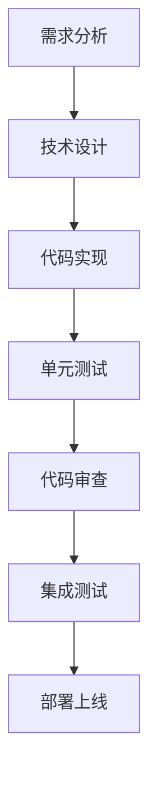
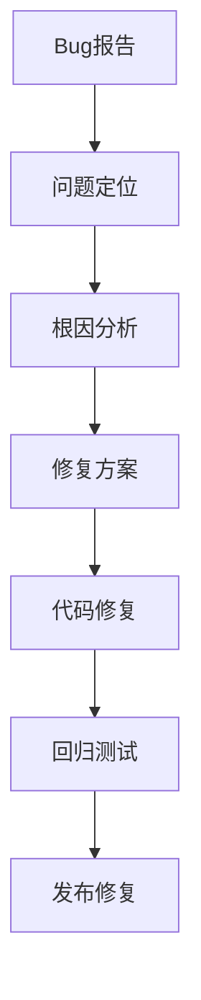

# SOC Copilot - 开发代理指南

## 代理角色定义

### 1. 前端开发代理

**职责范围**:

- React/Next.js 组件开发
- TypeScript 类型定义
- 状态管理 (React Query/Zustand)
- 国际化翻译添加

**必备技能**:

- Next.js App Router 深度理解
- React 19 新特性 (use hook, Suspense)
- Tailwind CSS 实践经验

**工作流程**:

1. 接收组件需求
2. 创建类型定义
3. 实现组件逻辑
4. 添加测试用例
5. 更新文档

### 2. 后端开发代理

**职责范围**:

- FastAPI 路由开发
- SQLAlchemy 模型定义
- 业务逻辑实现
- API 文档维护

**必备技能**:

- Python 异步编程
- Pydantic 数据验证
- 数据库优化经验

**工作流程**:

1. 设计数据模型
2. 创建 API 端点
3. 实现业务逻辑
4. 编写测试用例
5. 更新 OpenAPI 文档

### 3. DevOps 代理

**职责范围**:

- Docker 容器化
- CI/CD 流水线
- 监控告警配置
- 性能优化

**必备技能**:

- Docker/Kubernetes
- GitHub Actions
- Prometheus/Grafana
- Linux 系统管理

### 4. 安全审计代理

**职责范围**:

- 代码安全审查
- 漏洞扫描
- 合规检查
- 安全文档编写

**必备技能**:

- OWASP Top 10
- 安全编码规范
- 渗透测试基础
- 合规标准 (等保/ISO27001)

## 工作流程规范

### 功能开发流程



### Bug 修复流程



## 代码质量标准

### TypeScript

- **类型覆盖率**: ≥ 80%
- **编译错误**: 0
- **ESLint 警告**: 0
- **代码复杂度**: ≤ 15

### Python

- **类型注解**: 100% (公共 API)
- **测试覆盖率**: ≥ 60%
- **代码规范**: Black + isort
- **静态检查**: mypy --strict

## 常见任务执行指南

### 任务: 添加新API端点

**步骤**:

1. 在 `backend/models/` 定义数据模型
2. 在 `backend/services/` 创建业务逻辑
3. 在 `backend/api/v1/` 创建路由
4. 在 `backend/schemas/` 定义请求/响应模型
5. 添加测试用例
6. 更新 API 文档

**示例**:

```python
# 1. Model
class Alert(Base):
    __tablename__ = "alerts"
    id = Column(String(36), primary_key=True)
    title = Column(String(200), nullable=False)

# 2. Service
class AlertService:
    async def create_alert(self, data: AlertCreate) -> Alert:
        alert = Alert(**data.dict())
        self.db.add(alert)
        await self.db.commit()
        return alert

# 3. Router
@router.post("/", response_model=AlertResponse)
async def create_alert(
    data: AlertCreate,
    service: AlertService = Depends(get_alert_service)
):
    return await service.create_alert(data)

# 4. Schema
class AlertCreate(BaseModel):
    title: str
    severity: Literal['low', 'medium', 'high', 'critical']
```

### 任务: 添加前端组件

**步骤**:

1. 在 `frontend/components/` 创建组件文件
2. 定义 Props 类型
3. 实现组件逻辑
4. 添加国际化翻译
5. 编写测试用例

**示例**:

```tsx
// 1. Component File
// frontend/components/AlertFilter.tsx
'use client';

import { useState } from 'react';
import { useTranslations } from 'next-intl';

interface AlertFilterProps {
  onFilterChange: (filters: Filters) => void;
}

export function AlertFilter({ onFilterChange }: AlertFilterProps) {
  const t = useTranslations('alerts');
  const [severity, setSeverity] = useState<string>('all');

  const handleChange = (value: string) => {
    setSeverity(value);
    onFilterChange({ severity: value });
  };

  return (
    <select value={severity} onChange={(e) => handleChange(e.target.value)}>
      <option value="all">{t('allSeverity')}</option>
      <option value="low">{t('severity.low')}</option>
      <option value="medium">{t('severity.medium')}</option>
      <option value="high">{t('severity.high')}</option>
      <option value="critical">{t('severity.critical')}</option>
    </select>
  );
}

// 2. i18n
// frontend/messages/en/alerts.json
{
  "allSeverity": "All Severity",
  "severity": {
    "low": "Low",
    "medium": "Medium",
    "high": "High",
    "critical": "Critical"
  }
}
```

### 任务: 数据库迁移

**步骤**:

1. 创建 Alembic 迁移文件
2. 编写迁移逻辑
3. 测试迁移
4. 更新文档

**示例**:

```bash
# 创建迁移
alembic revision --autogenerate -m "add_alert_tags_table"

# 应用迁移
alembic upgrade head

# 回滚迁移
alembic downgrade -1
```

## 性能优化清单

### 前端优化

- [ ] 代码分割 (dynamic import)
- [ ] 图片优化 (next/image)
- [ ] 字体优化 (next/font)
- [ ] 缓存策略 (React Query)
- [ ] 虚拟列表 (react-window)

### 后端优化

- [ ] 数据库索引
- [ ] 查询优化 (select only needed fields)
- [ ] 缓存策略 (Redis)
- [ ] 异步处理 (background tasks)
- [ ] 连接池优化

### 基础设施优化

- [ ] CDN 配置
- [ ] Gzip 压缩
- [ ] HTTP/2 启用
- [ ] 容器资源限制
- [ ] 自动扩缩容

## 安全检查清单

### 代码审查

- [ ] 输入验证
- [ ] SQL 注入防护
- [ ] XSS 防护
- [ ] CSRF 防护
- [ ] 权限检查

### 配置检查

- [ ] 敏感信息不在代码中
- [ ] 强密码策略
- [ ] HTTPS 强制
- [ ] 安全响应头
- [ ] 错误信息不泄露敏感数据

### 运维检查

- [ ] 定期备份
- [ ] 日志监控
- [ ] 入侵检测
- [ ] 漏洞扫描
- [ ] 应急预案

## 故障排查指南

### 前端故障

#### 问题: 页面白屏

**排查步骤**:

1. 检查浏览器控制台错误
2. 检查网络请求状态
3. 检查路由配置
4. 检查数据加载

#### 问题: 性能慢

**排查步骤**:

1. 使用 React DevTools 分析
2. 检查不必要的渲染
3. 检查网络请求大小
4. 检查 bundle 大小

### 后端故障

#### 问题: API 超时

**排查步骤**:

1. 检查数据库慢查询
2. 检查外部服务调用
3. 检查 CPU/内存使用
4. 检查并发连接数

#### 问题: 内存泄漏

**排查步骤**:

1. 使用内存分析工具
2. 检查缓存清理策略
3. 检查数据库连接释放
4. 检查定时任务清理

## 联系与支持

- **技术问题**: 创建 GitHub Issue
- **紧急问题**: 联系值班工程师
- **安全漏洞**: 发送邮件至 security@example.com
