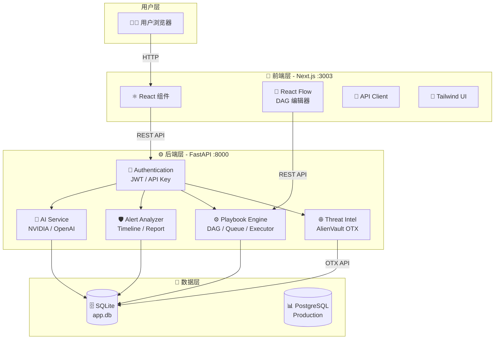
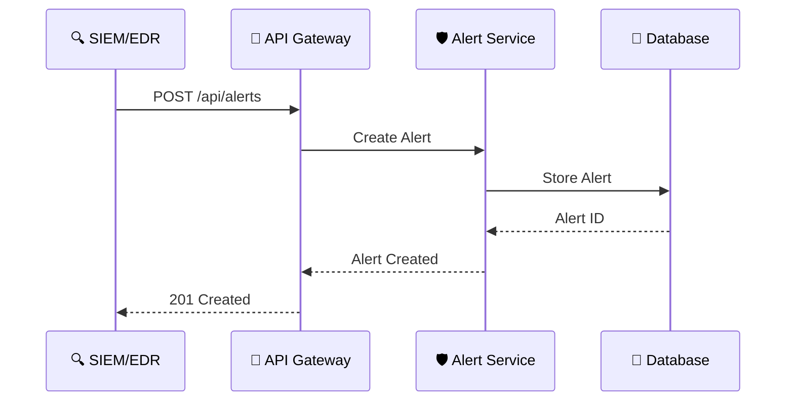
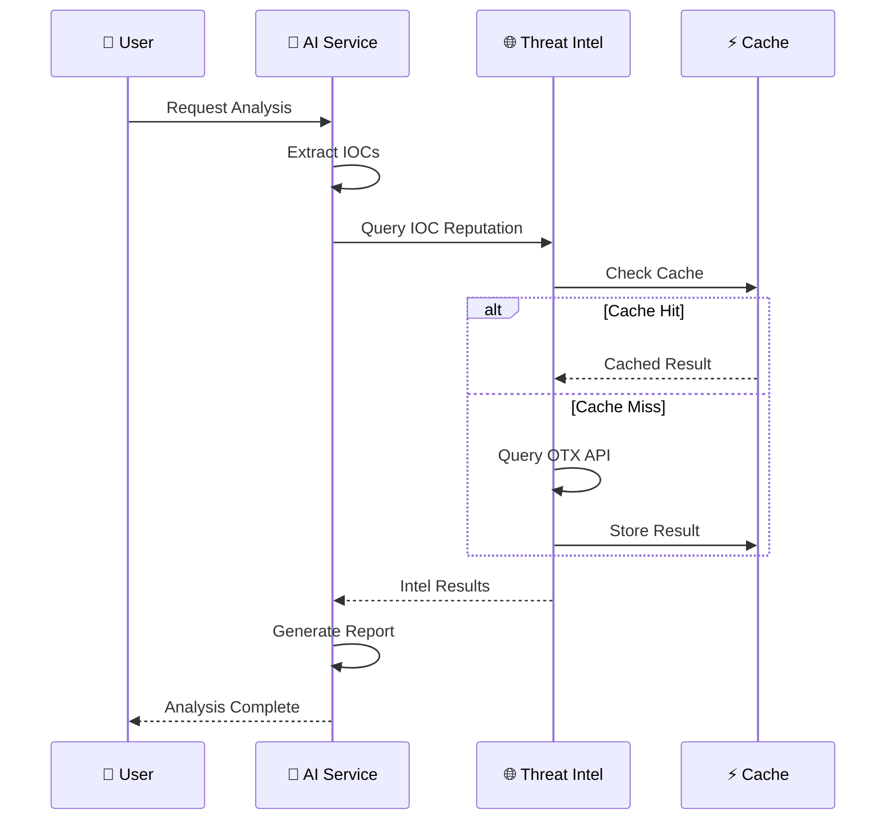
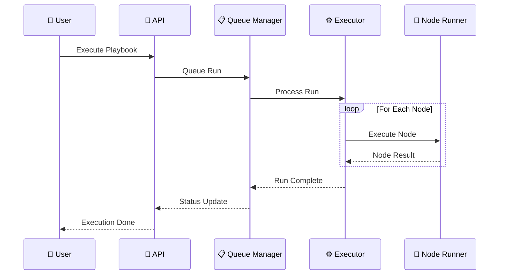
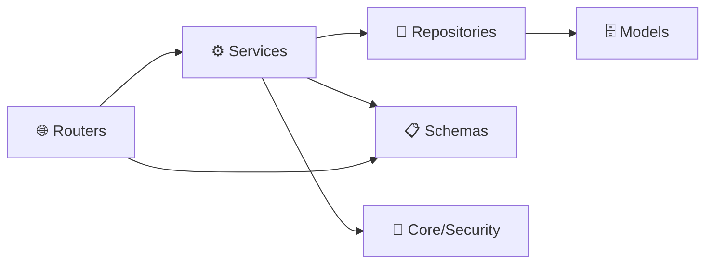
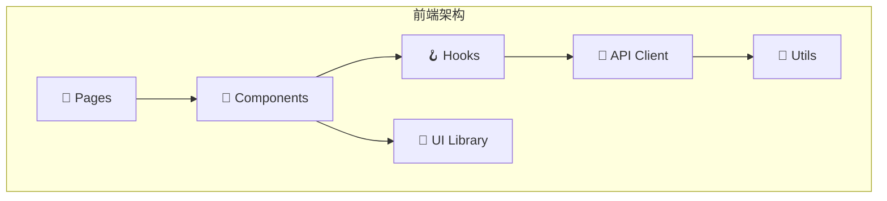

# 🏗️ 架构总览

**理解 SOC Copilot 的整体架构设计、数据流、模块划分**

---

## 📋 目录

- [适用对象](#-适用对象)
- [系统架构](#-系统架构)
- [数据流](#-数据流)
- [后端模块](#-后端模块)
- [前端模块](#-前端模块)
- [技术栈](#-技术栈)

---

## 👥 适用对象

> [!NOTE]
> 👨‍💼 **架构师**、👨‍💻 **开发人员**、以及需要理解系统设计的工程师。

---

## 🎯 目标

理解 SOC Copilot 的整体架构设计、数据流、模块划分。

---

## 🏛️ 系统架构

---

## 🌊 数据流

### 1️⃣ 告警接收流程

---

### 2️⃣ 告警分析流程

---

### 3️⃣ 剧本执行流程

---

## 🖥️ 后端模块

| 📁 目录         | 📝 职责       | 🔑 关键文件                          |
| :-------------- | :------------ | :----------------------------------- |
| `routers/`      | API 路由入口  | `ai.py`, `alert.py`, `playbook*.py`  |
| `services/`     | 业务逻辑      | `ai_service*.py`, `playbook_engine/` |
| `repositories/` | 数据访问层    | `alert_repo.py`, `playbook_repo.py`  |
| `models/`       | ORM 模型      | `alert.py`, `playbook.py`            |
| `schemas/`      | Pydantic 模型 | API 请求/响应定义                    |
| `core/`         | 基础配置      | `config.py`, `security.py`           |

### 模块依赖关系

---

## 💻 前端模块

| 📁 目录       | 📝 职责         | 🔑 关键文件                    |
| :------------ | :-------------- | :----------------------------- |
| `app/`        | 页面路由        | `page.tsx`, `[id]/page.tsx`    |
| `components/` | 复用组件        | `Navigation.tsx`, `dag/`       |
| `lib/`        | 工具函数        | `api.ts` (API 调用封装)        |
| `hooks/`      | 自定义 Hooks    | `useAuth.ts`, `usePlaybook.ts` |
| `types/`      | TypeScript 类型 | `alert.ts`, `playbook.ts`      |

### 前端架构

---

## 🛠️ 技术栈

### 后端技术栈

| 层级        | 技术选型                 | 版本   | 徽章                                                                                                   |
| :---------- | :----------------------- | :----- | :----------------------------------------------------------------------------------------------------- |
| 🚀 后端框架 | FastAPI                  | 0.115+ |  |
| 🗄️ ORM      | SQLAlchemy (Async)       | 2.0+   |                         |
| 💾 数据库   | SQLite / PostgreSQL      | 3.0+   |     |
| 🔐 认证     | JWT / OAuth2             | -      |                    |
| 🤖 AI       | NVIDIA / OpenAI / Claude | -      |     |
| 🌐 威胁情报 | AlienVault OTX           | -      |                                       |

### 前端技术栈

| 层级        | 技术选型         | 版本       | 徽章                                                                                                            |
| :---------- | :--------------- | :--------- | :-------------------------------------------------------------------------------------------------------------- |
| ⚛️ 前端框架 | Next.js          | 15.1       |         |
| 🎨 UI 框架  | React + Tailwind | 19.0 + 3.4 |                 |
| 📊 DAG 编辑 | React Flow       | -          |                                |
| 📝 语言     | TypeScript       | 5.x        |  |
| 🎭 图标     | Lucide React     | -          |                                          |

---

## 📊 系统性能指标

| 指标            | 目标值    | 说明             |
| :-------------- | :-------- | :--------------- |
| ⚡ API 响应时间 | < 200ms   | P95 响应时间     |
| 🔄 并发用户     | 100+      | 同时在线用户     |
| 📈 告警处理     | 1000/小时 | 每小时处理告警数 |
| 🗄️ 数据库       | 10万+     | 支持告警记录数   |
| 🤖 AI 响应      | < 5s      | 典型分析请求     |

---

## 🚀 下一步

| 📖 推荐阅读                          | 🎯 目标           |
| :----------------------------------- | :---------------- |
| [📙 API 文档](02-api-overview.md)    | 了解 API 接口详情 |
| [📕 数据库设计](03-database.md)      | 理解数据模型      |
| [📔 剧本引擎](06-playbook-engine.md) | 学习 DAG 工作流   |

---

**🏗️ 架构设计决定系统的未来**

[⬆️ 返回顶部](#-架构总览)

