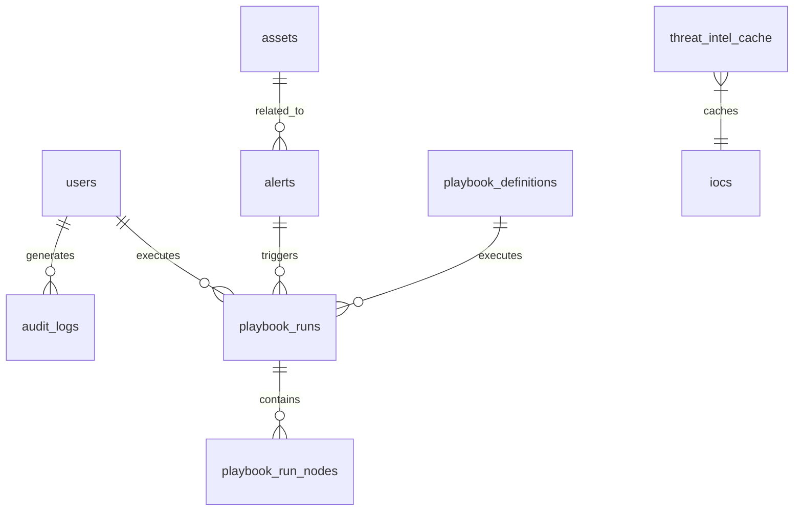

# 数据库与模型

## 适用对象

后端开发人员、DBA、需要理解数据结构的工程师。

## 目标

理解 SOC Copilot 的核心数据模型、表关系、迁移策略。

## 核心表说明

| 表名                   | 说明         | 关键字段                                  |
| ---------------------- | ------------ | ----------------------------------------- |
| `users`                | 用户账户     | `id`, `username`, `password_hash`, `role` |
| `alerts`               | 告警记录     | `id`, `raw_log`, `severity`, `status`     |
| `assets`               | 资产信息     | `id`, `hostname`, `ip`, `criticality`     |
| `playbook_definitions` | 剧本定义     | `id`, `name`, `dag_json`, `status`        |
| `playbook_runs`        | 剧本执行     | `id`, `definition_id`, `status`, `output` |
| `threat_intel_cache`   | 威胁情报缓存 | `ioc`, `result`, `ttl`                    |
| `audit_logs`           | 操作审计     | `id`, `user_id`, `action`, `details`      |

## ERD 图



## 迁移与版本

使用 Alembic 进行数据库迁移：

```bash
# 查看当前版本
alembic current

# 生成迁移脚本
alembic revision -m "add_new_table"

# 执行迁移
alembic upgrade head

# 回滚
alembic downgrade -1
```

迁移文件位于 `migrations_alembic/versions/`。

## 数据初始化

首次启动会自动创建演示数据：

| 数据类型   | 示例                              |
| ---------- | --------------------------------- |
| 管理员账号 | `admin / admin123`                |
| 示例剧本   | Phishing Response, Malware Triage |
| 示例资产   | 5 台服务器，工作站                |
