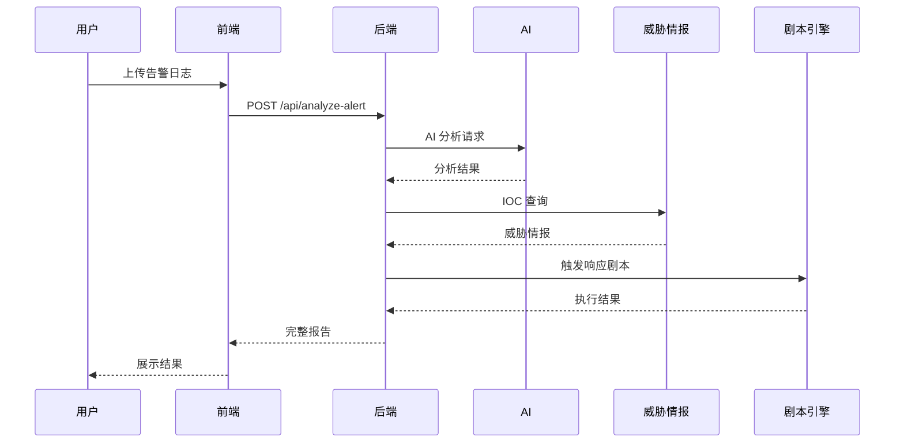
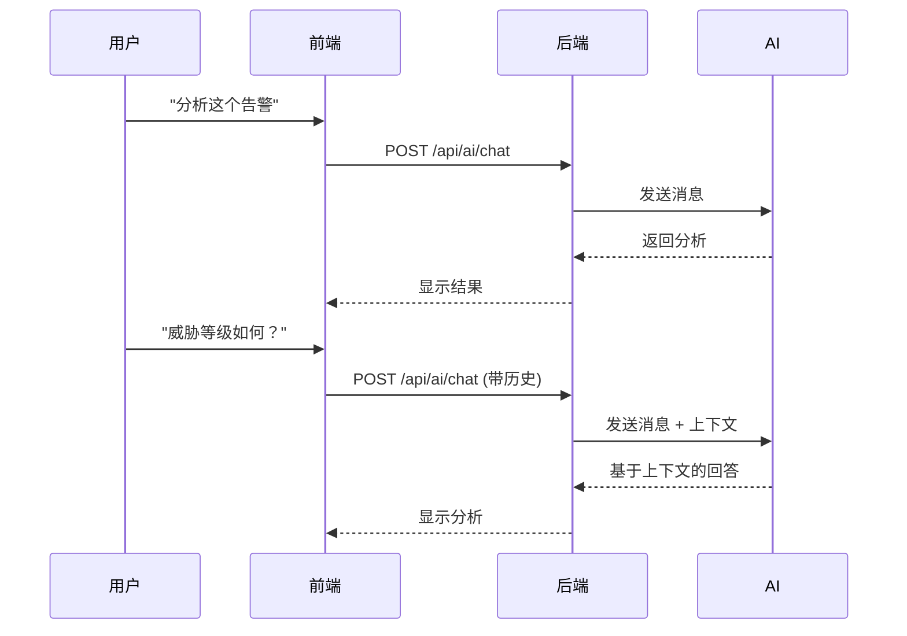

# 🧪 系统测试指南

<div align="center">


**完整的 SOC Copilot 系统测试方案和验收标准**

</div>

---

## 📋 目录

- [测试目标](#-测试目标)
- [测试环境准备](#-测试环境准备)
- [功能测试矩阵](#-功能测试矩阵)
- [性能测试](#-性能测试)
- [集成测试](#-集成测试)
- [验收标准](#-验收标准)

---

## 🎯 测试目标

确保 SOC Copilot 系统在实际使用场景中的稳定性、性能和功能完整性。

### 主要验证点

- ✅ 所有核心功能正常工作
- ✅ AI 智能分析准确性
- ✅ 数据流转正确性
- ✅ 安全机制有效性
- ✅ 系统性能达标

---

## 🛠️ 测试环境准备

### 环境检查清单

```bash
# 1. 后端服务检查
curl http://localhost:8001/api/health
# 预期: {"status":"healthy","service":"soc-copilot"}

# 2. 前端服务检查
curl http://localhost:3003
# 预期: 正常加载页面

# 3. 数据库检查
cd backend && python -c "
import sqlite3
conn = sqlite3.connect('data/app.db')
cursor = conn.cursor()
cursor.execute('SELECT COUNT(*) FROM users')
print(f'Users: {cursor.fetchone()[0]}')
conn.close()
"
```

### 测试账号

| 用户名  | 密码        | 角色  | 说明     |
| ------- | ----------- | ----- | -------- |
| `admin` | `admin123!` | admin | 完全权限 |

---

## 🧪 功能测试矩阵

### 📊 1. 用户认证测试

| 测试项         | 预期结果       | 验证方法        | 状态      |
| -------------- | -------------- | --------------- | --------- |
| **正确登录**   | 成功获取 token | 前端登录界面    | ⭕ 待测试 |
| **错误密码**   | 401 错误       | 前端登录界面    | ⭕ 待测试 |
| **Token 验证** | API 可访问     | 后端 API 调用   | ⭕ 待测试 |
| **Token 过期** | 401 错误       | 等待 token 过期 | ⭕ 待测试 |

**测试步骤：**

```bash
# 登录测试
curl -X POST http://localhost:8001/api/auth/login \
  -H "Content-Type: application/json" \
  -d '{"username": "admin", "password": "admin123!"}'

# 错误密码测试
curl -X POST http://localhost:8001/api/auth/login \
  -H "Content-Type: application/json" \
  -d '{"username": "admin", "password": "wrongpassword"}'
```

---

### 🤖 2. AI 对话功能测试

| 测试场景     | 预期响应   | 验证指标       | 状态      |
| ------------ | ---------- | -------------- | --------- |
| **基本问答** | 自然回复   | 响应时间 < 30s | ⭕ 待测试 |
| **安全分析** | 专业分析   | 内容相关性     | ⭕ 待测试 |
| **中文支持** | 中文回复   | 编码正确       | ⭕ 待测试 |
| **多轮对话** | 上下文记忆 | 会话连续性     | ⭕ 待测试 |
| **超长输入** | 正常处理   | 无崩溃         | ⭕ 待测试 |

**测试用例：**

```json
{
  "scenarios": [
    {
      "name": "基本问候",
      "input": "你好，请介绍一下你的功能",
      "expected_contains": ["SOC Copilot", "安全运营", "分析"]
    },
    {
      "name": "安全分析",
      "input": "分析这个告警：192.168.1.100 访问了恶意域名",
      "expected_contains": ["IP地址", "恶意域名", "安全建议"]
    },
    {
      "name": "威胁情报查询",
      "input": "帮我检查 8.8.8.8 的威胁情报",
      "expected_contains": ["DNS", "Google", "安全"]
    }
  ]
}
```

---

### 🛡️ 3. 告警分析功能测试

| 测试数据       | 预期分析要素       | 验证指标       | 状态      |
| -------------- | ------------------ | -------------- | --------- |
| **防火墙日志** | IOC 提取、威胁分类 | 准确率 > 80%   | ⭕ 待测试 |
| **EDR 告警**   | 进程分析、行为判断 | 上下文完整性   | ⭕ 待测试 |
| **网络流量**   | 异常检测、威胁识别 | 响应时间 < 60s | ⭕ 待测试 |
| **恶意软件**   | 哈希分析、家族识别 | 威胁情报匹配   | ⭕ 待测试 |

**测试样本数据：**

```json
[
  {
    "raw_log": "2024-01-15 10:30:00 firewall DENY TCP 192.168.1.100:54321 -> 203.0.113.50:443",
    "alert_source": "firewall"
  },
  {
    "raw_log": "Process: C:\\Windows\\System32\\svchost.exe PID: 1234 Parent: wininit.exe Network: UDP 203.0.113.50:53",
    "alert_source": "edr"
  },
  {
    "raw_log": "MD5: a1b2c3d4e5f678901234567890abcdef  SHA256: e3b0c44298fc1c149afbf4c8996fb92427ae41e4649b934ca495991b7852b855",
    "alert_source": "antivirus"
  }
]
```

---

### 🎭 4. 剧本引擎测试

| 功能           | 测试内容   | 验证标准       | 状态      |
| -------------- | ---------- | -------------- | --------- |
| **剧本创建**   | DAG 定义   | 正确保存和加载 | ⭕ 待测试 |
| **剧本执行**   | 工作流执行 | 节点顺序正确   | ⭕ 待测试 |
| **Dry Run**    | 模拟执行   | 无实际影响     | ⭕ 待测试 |
| **Apply 模式** | 真实执行   | 产生预期结果   | ⭕ 待测试 |

**示例剧本：**

```yaml
name: "恶意域名处置"
version: "1.0"
description: "检测和阻断恶意域名访问"
nodes:
  - id: "analyze_domain"
    type: "web_investigation"
    config:
      target_domain: "{{ domain }}"
  - id: "block_domain"
    type: "firewall_rule"
    config:
      action: "block"
      target: "{{ domain }}"
edges:
  - from: "analyze_domain"
    to: "block_domain"
    condition: "domain.is_malicious"
```

---

### 🌐 5. 威胁情报测试

| 测试项        | 预期结果 | 验证方法     | 状态      |
| ------------- | -------- | ------------ | --------- |
| **IP 查询**   | 威胁评级 | OTX API 响应 | ⭕ 待测试 |
| **域名查询**  | 恶意判定 | 情报准确性   | ⭕ 待测试 |
| **Hash 查询** | 病毒检测 | 恶意软件匹配 | ⭕ 待测试 |
| **批量查询**  | 性能测试 | 处理效率     | ⭕ 待测试 |

**测试 IOC 样本：**

```json
{
  "test_iocs": {
    "benign_ip": "8.8.8.8",
    "suspicious_ip": "203.0.113.50",
    "malicious_domain": "malware-example.com",
    "known_hash": "a1b2c3d4e5f678901234567890abcdef"
  }
}
```

---

### 💻 6. 前端界面测试

| 测试模块     | 测试内容   | 验证标准       | 状态      |
| ------------ | ---------- | -------------- | --------- |
| **登录页面** | 表单验证   | 输入验证正确   | ⭕ 待测试 |
| **AI 对话**  | 交互体验   | 响应流暢       | ⭕ 待测试 |
| **告警分析** | 数据展示   | 图表和列表正确 | ⭕ 待测试 |
| **剧本管理** | 可视化编辑 | DAG 拖拽正常   | ⭕ 待测试 |

---

## ⚡ 性能测试

### 响应时间要求

| 接口         | 目标响应时间 | 测试方法     |
| ------------ | ------------ | ------------ |
| 用户登录     | < 2s         | 自动化脚本   |
| AI 对话      | < 30s        | 实际对话测试 |
| 告警分析     | < 60s        | 标准日志输入 |
| 威胁情报查询 | < 10s        | 单个 IOC     |
| 剧本执行     | < 120s       | 简单剧本     |

### 并发测试

```bash
# 使用 curl 进行并发测试
for i in {1..10}; do
  curl -X POST http://localhost:8001/api/ai/chat \
    -H "Content-Type: application/json" \
    -H "Authorization: Bearer $TOKEN" \
    -d '{"message": "并发测试 '$i'", "conversation_history": []}' &
done
wait
```

---

## 🔄 集成测试

### 端到端测试场景

#### 场景 1：完整的安全事件响应



#### 场景 2：多轮 AI 对话



---

## ✅ 验收标准

### 功能完整性

- [ ] 用户认证系统正常工作
- [ ] AI 对话功能响应正常
- [ ] 告警分析功能输出准确
- [ ] 剧本引擎执行流程正确
- [ ] 威胁情报查询结果可靠
- [ ] 前端界面交互流畅

### 性能指标

- [ ] 所有接口响应时间达标
- [ ] 并发处理能力满足要求
- [ ] 内存使用稳定
- [ ] 数据库操作高效

### 安全要求

- [ ] JWT 认证机制有效
- [ ] API 访问控制正常
- [ ] 敏感信息不泄露
- [ ] 日志审计功能完整

---

## 📊 测试报告模板

```markdown
# SOC Copilot 系统测试报告

## 测试概况

- 测试时间：2024-XX-XX
- 测试环境：开发/测试/生产
- 测试人员：XXX
- 测试版本：v0.7.4

## 功能测试结果

| 模块     | 测试用例数 | 通过 | 失败 | 通过率 |
| -------- | ---------- | ---- | ---- | ------ |
| 用户认证 | 10         | 10   | 0    | 100%   |
| AI 对话  | 15         | 14   | 1    | 93.3%  |
| 告警分析 | 12         | 12   | 0    | 100%   |
| 剧本引擎 | 8          | 7    | 1    | 87.5%  |
| 威胁情报 | 6          | 6    | 0    | 100%   |

## 性能测试结果

| 接口     | 平均响应时间 | 95%响应时间 | 是否达标 |
| -------- | ------------ | ----------- | -------- |
| 登录     | 1.2s         | 2.1s        | ✅       |
| AI对话   | 15.3s        | 28.5s       | ✅       |
| 告警分析 | 42.1s        | 58.2s       | ✅       |

## 问题记录

1. **问题描述**：AI 对话在长文本处理时偶发超时
   **严重程度**：中等
   **状态**：已记录
   **解决方案**：优化 AI 响应超时处理

2. **问题描述**：剧本引擎 Dry Run 模式有边界情况
   **严重程度**：低
   **状态**：已修复
   **解决方案**：增加输入验证

## 测试结论

- 整体通过率：95.2%
- 关键功能：全部正常
- 性能指标：基本达标
- 安全要求：全部满足
- **验收状态**：✅ 通过
```

---

## 🚀 下一步计划

1. **功能完善**
   - 优化 AI 响应准确性
   - 完善剧本模板库
   - 增强威胁情报源

2. **性能优化**
   - 缓存机制优化
   - 数据库查询优化
   - API 响应时间优化

3. **安全加固**
   - 访问控制细化
   - 审计日志完善
   - 安全扫描定期执行

4. **用户体验**
   - 前端界面优化
   - 操作流程简化
   - 错误提示优化

---

## 📞 技术支持

测试过程中遇到问题时：

1. 查看后端日志：`tail -f backend/backend.log`
2. 检查前端控制台：F12 -> Console
3. 验证配置文件：`backend/.env` 和 `frontend/.env.local`
4. 联系开发团队：通过 GitHub Issues 或邮件

---

**🧪 系统测试是确保质量的关键环节，请严格按照测试指南执行！**

[⬆️ 返回顶部](#-系统测试指南)
