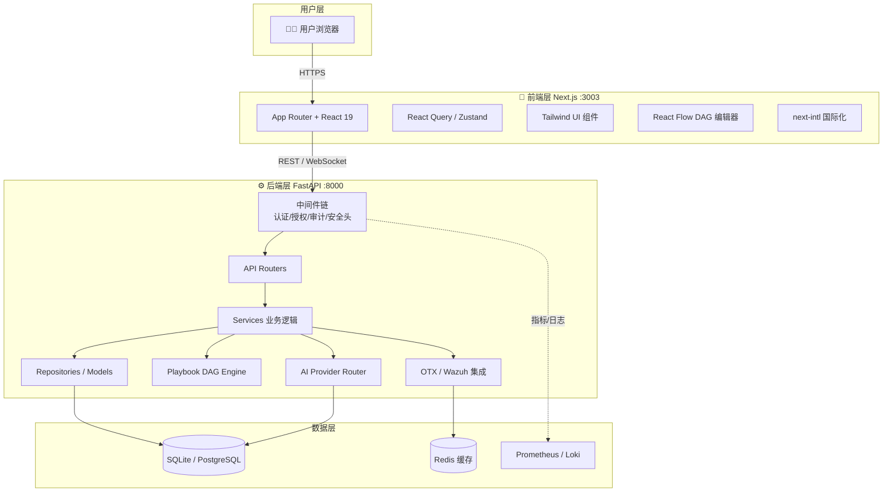
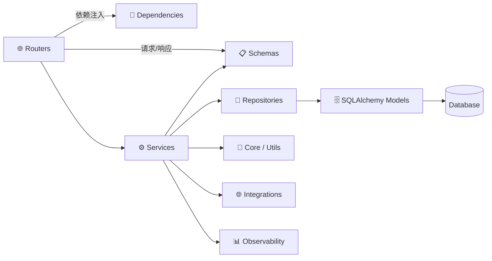
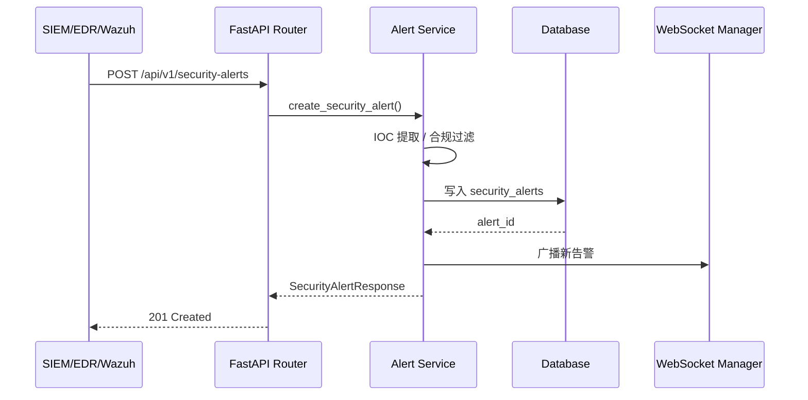
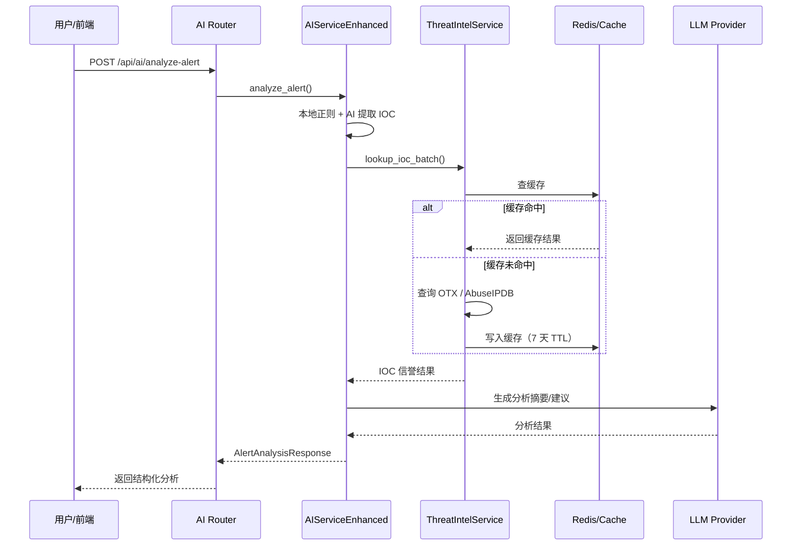
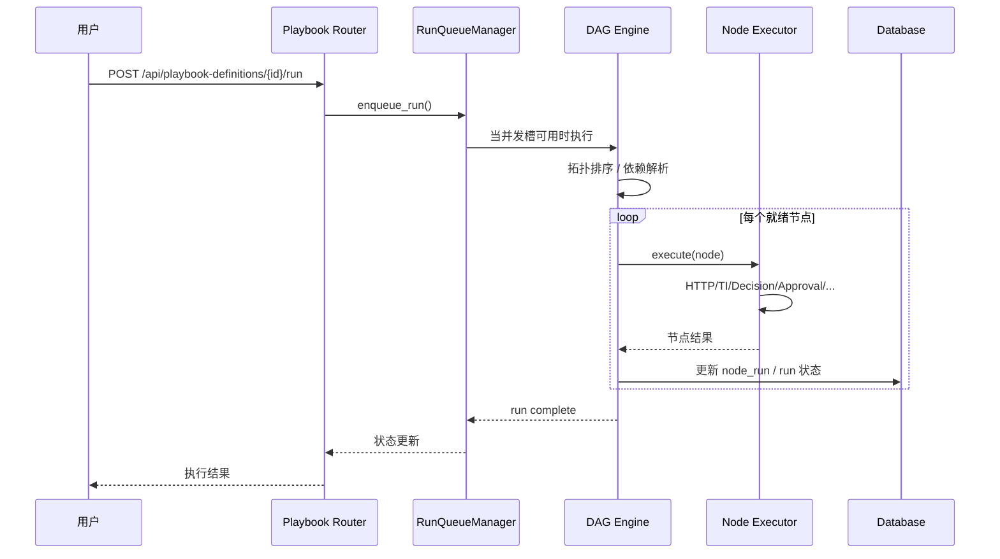
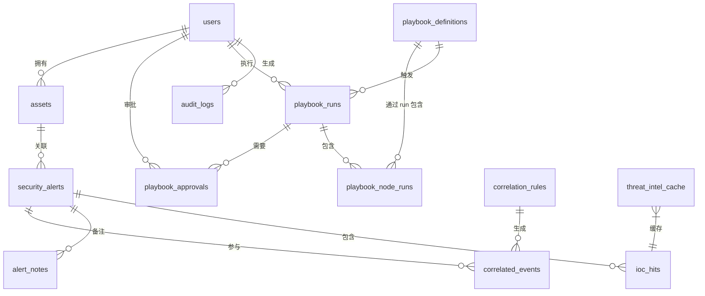

# SOC Copilot - 代码库全景分析

> 分析日期：2026-06-17
> 项目版本：v0.9.0（以 [backend/pyproject.toml](file:///Users/levent/Desktop/Projects/sec/backend/pyproject.toml) 与 [README.md](file:///Users/levent/Desktop/Projects/sec/README.md) 为准）
> 分析范围：完整前后端代码库、数据库模型、API 路由、核心业务模块

---

## 1. 项目扫描 (Project Scan)

### 1.1 项目定位

SOC Copilot 是面向安全运营中心（SOC）团队的智能分析工作台，提供告警分析、事件时间线重建、报告生成、资产管理、威胁情报查询以及**Playbook 自动化编排**能力。

### 1.2 技术栈

| 层级 | 技术 | 版本/说明 | 关键文件 |
|------|------|-----------|----------|
| 后端框架 | FastAPI | 0.135.1 | [backend/main.py](file:///Users/levent/Desktop/Projects/sec/backend/main.py) |
| 后端语言 | Python | >=3.12 | [backend/pyproject.toml](file:///Users/levent/Desktop/Projects/sec/backend/pyproject.toml) |
| 前端框架 | Next.js | 16.2+ (App Router) | [frontend/package.json](file:///Users/levent/Desktop/Projects/sec/frontend/package.json) |
| 前端语言 | TypeScript | 5.x | [frontend/package.json](file:///Users/levent/Desktop/Projects/sec/frontend/package.json) |
| UI 库 | React | 19.x | [frontend/package.json](file:///Users/levent/Desktop/Projects/sec/frontend/package.json) |
| 样式 | Tailwind CSS | 3.4+ | [frontend/package.json](file:///Users/levent/Desktop/Projects/sec/frontend/package.json) |
| ORM | SQLAlchemy 2.0 | 异步 | [backend/db/session.py](file:///Users/levent/Desktop/Projects/sec/backend/db/session.py) |
| 数据库 | SQLite / PostgreSQL | 开发/生产 | [backend/db/session.py](file:///Users/levent/Desktop/Projects/sec/backend/db/session.py) |
| 缓存 | Redis | 7+（可选） | [backend/core/config.py](file:///Users/levent/Desktop/Projects/sec/backend/core/config.py) |
| AI 提供商 | 多厂商 | Zhipu/Claude/OpenAI/NVIDIA/Moonshot/OpenRouter | [backend/core/config.py](file:///Users/levent/Desktop/Projects/sec/backend/core/config.py) |
| 状态管理 | React Query + Zustand | - | 前端 hooks / stores |
| 国际化 | next-intl | en/zh | [frontend/app/[locale]/layout.tsx](file:///Users/levent/Desktop/Projects/sec/frontend/app/[locale]/layout.tsx) |
| 测试 | pytest + Vitest + Playwright | - | [backend/pyproject.toml](file:///Users/levent/Desktop/Projects/sec/backend/pyproject.toml)、[frontend/package.json](file:///Users/levent/Desktop/Projects/sec/frontend/package.json) |
| 代码质量 | ruff + prettier + eslint | - | [backend/ruff.toml](file:///Users/levent/Desktop/Projects/sec/backend/ruff.toml)、[frontend/.eslintrc.json](file:///Users/levent/Desktop/Projects/sec/frontend/.eslintrc.json) |
| 部署 | Docker + Docker Compose | - | [docker-compose.yml](file:///Users/levent/Desktop/Projects/sec/docker-compose.yml) |
| 工作流编排 | DAG Playbook Engine | 自研 | [backend/playbook_engine/dag/engine.py](file:///Users/levent/Desktop/Projects/sec/backend/playbook_engine/dag/engine.py) |

### 1.3 端口与服务

| 服务 | 端口 | 说明 |
|------|------|------|
| 前端 | 3003 | Next.js 开发/生产服务 |
| 后端 API | 8000 | FastAPI + Uvicorn |
| PostgreSQL | 5432 | 生产数据库（Docker） |
| Redis | 6379 | 缓存/Token 黑名单/幂等（Docker） |
| Grafana/Loki | 依配置 | 可选监控与日志 |

### 1.4 项目根目录结构

```
/Users/levent/Desktop/Projects/sec/
├── backend/              # FastAPI 后端
├── frontend/             # Next.js 前端
├── docs/                 # 项目文档（含本分析）
├── Scripts/              # 运维与辅助脚本
├── config/               # 外部工具配置（如 Wazuh）
├── .claude/              # Claude Code 项目指令
├── .github/              # GitHub Actions 工作流
├── docker-compose*.yml   # Docker 编排
├── Makefile              # 常用命令
└── package.json          # 根工作区配置
```

---

## 2. 代码地图 (Code Map)

### 2.1 后端代码地图

```
backend/
├── main.py                   # FastAPI 应用入口、生命周期、路由注册
├── core/                     # 核心基础设施
│   ├── config.py             # Pydantic Settings 配置中心
│   ├── exceptions.py         # 统一异常体系（错误码驱动）
│   ├── logger.py             # 结构化日志
│   ├── security.py           # 密码哈希、JWT
│   ├── security_validators.py# 生产环境安全检查
│   ├── validators.py         # 通用输入校验
│   └── metrics.py            # Prometheus 指标
├── db/
│   └── session.py            # 异步 SQLAlchemy 引擎与会话
├── models/                   # 数据库 ORM 模型
├── schemas/                  # Pydantic 请求/响应模型
├── routers/                  # API 路由（按模块组织）
├── services/                 # 业务逻辑层
│   ├── alerting/             # 告警相关服务
│   ├── correlation/          # 事件关联
│   ├── lifecycle/            # 应用生命周期服务
│   ├── message_broker/       # 消息代理抽象
│   ├── notifications/        # 通知渠道
│   ├── observability/        # 性能与监控
│   ├── playbook/             # Playbook 编排服务
│   ├── playbook_executors/   # Playbook 节点执行器
│   └── security/             # 安全与密钥服务
├── repositories/             # 数据访问层（Repository 模式）
├── middleware/               # FastAPI/Starlette 中间件
├── dependencies/             # 依赖注入（认证、授权、租户）
├── playbook_engine/          # Playbook 引擎（DAG + 插件）
├── integrations/             # 第三方集成（OTX 等）
├── observability/            # OpenTelemetry 日志/追踪/指标
├── workers/                  # 后台工作进程
├── tests/                    # pytest 测试
└── migrations_alembic/       # Alembic 数据库迁移
```

### 2.2 前端代码地图

```
frontend/
├── app/[locale]/             # Next.js App Router（按功能分页面）
│   ├── page.tsx              # 首页/仪表盘
│   ├── login/page.tsx        # 登录页
│   ├── alerts/               # 告警列表与详情
│   ├── assets/               # 资产管理
│   ├── audit/                # 审计日志
│   ├── monitor/              # 实时监控
│   ├── playbooks/            # Playbook 管理
│   ├── ai-assistant/         # AI 助手聊天
│   ├── threat-intel/         # 威胁情报
│   ├── settings/             # 用户设置
│   └── admin/                # 管理员后台
├── components/               # React 组件
│   ├── common/               # 通用 UI 组件
│   ├── alerts/               # 告警相关组件
│   ├── monitor/              # 监控图表组件
│   ├── dag/                  # DAG 编辑器组件
│   ├── playbook/             # Playbook 组件
│   └── providers/            # Context/Provider
├── lib/                      # 工具与 API 客户端
│   ├── api/                  # 按模块封装的 API 调用
│   ├── api-client.ts         # 底层 fetch 封装
│   ├── queryClient.ts        # React Query 配置
│   └── auth.ts               # 认证工具
├── hooks/                    # 自定义 React Hooks
├── stores/                   # Zustand 状态存储
├── messages/                 # next-intl 翻译文件（en/zh）
├── __tests__/                # Vitest 单元测试
└── playwright/               # E2E 测试
```

### 2.3 关键文件索引

| 目的 | 后端路径 | 前端路径 |
|------|----------|----------|
| 应用入口 | [backend/main.py](file:///Users/levent/Desktop/Projects/sec/backend/main.py) | [frontend/app/[locale]/layout.tsx](file:///Users/levent/Desktop/Projects/sec/frontend/app/[locale]/layout.tsx) |
| 配置中心 | [backend/core/config.py](file:///Users/levent/Desktop/Projects/sec/backend/core/config.py) | [frontend/next.config.js](file:///Users/levent/Desktop/Projects/sec/frontend/next.config.js) |
| 数据库会话 | [backend/db/session.py](file:///Users/levent/Desktop/Projects/sec/backend/db/session.py) | - |
| API 客户端 | - | [frontend/lib/api/client.ts](file:///Users/levent/Desktop/Projects/sec/frontend/lib/api/client.ts) |
| 认证 | [backend/dependencies/auth.py](file:///Users/levent/Desktop/Projects/sec/backend/dependencies/auth.py) | [frontend/lib/auth.ts](file:///Users/levent/Desktop/Projects/sec/frontend/lib/auth.ts) |
| Playbook 引擎 | [backend/playbook_engine/dag/engine.py](file:///Users/levent/Desktop/Projects/sec/backend/playbook_engine/dag/engine.py) | [frontend/components/dag/DAGCanvas.tsx](file:///Users/levent/Desktop/Projects/sec/frontend/components/dag/DAGCanvas.tsx) |
| 告警服务 | [backend/services/alerting/alert_service.py](file:///Users/levent/Desktop/Projects/sec/backend/services/alerting/alert_service.py) | [frontend/app/[locale]/alerts/page.tsx](file:///Users/levent/Desktop/Projects/sec/frontend/app/[locale]/alerts/page.tsx) |
| 核心异常 | [backend/core/exceptions.py](file:///Users/levent/Desktop/Projects/sec/backend/core/exceptions.py) | [frontend/lib/errorHandler.ts](file:///Users/levent/Desktop/Projects/sec/frontend/lib/errorHandler.ts) |

---

## 3. 架构 (Architecture)

### 3.1 系统架构图



### 3.2 后端分层架构



### 3.3 请求生命周期

1. **入口**：请求到达 Uvicorn → FastAPI App（[backend/main.py](file:///Users/levent/Desktop/Projects/sec/backend/main.py)）。
2. **中间件链**：
   - `TraceIDMiddleware` → 生成/透传 trace_id
   - `SecurityHeadersMiddleware` → 安全响应头
   - `RequestContextMiddleware` → 请求上下文
   - `TenantMiddleware` → 租户识别
   - `SetUserStateMiddleware` → 设置 user_id / user_role
   - `AuditMiddleware` → 记录审计日志
   - `ResourceAuthorizationMiddleware` → RBAC 权限校验
   - `ExceptionCaptureMiddleware` → 统一异常捕获
   - `PerformanceMiddleware` → 慢请求监控
3. **路由分发**：根据路径进入对应 Router（如 `/api/alerts` → [backend/routers/alert.py](file:///Users/levent/Desktop/Projects/sec/backend/routers/alert.py)）。
4. **依赖注入**：`get_current_user`、`require_role`、`get_db_session` 等通过 `Depends()` 注入。
5. **业务逻辑**：Service 层处理，调用 Repository 或外部集成。
6. **数据持久化**：Repository 使用 SQLAlchemy 异步会话读写数据库。
7. **响应**：Pydantic Schema 序列化 → 统一响应格式 → 客户端。

### 3.4 核心数据流

#### 告警接收流



#### 告警 AI 分析流



#### Playbook 执行流



---

## 4. 数据库分析 (Database Analysis)

### 4.1 数据库配置

- **开发环境**：SQLite + aiosqlite，文件位于 `data/app.db`。
- **测试环境**：`ENVIRONMENT=test` 时使用独立 SQLite 文件或内存数据库。
- **生产环境**：PostgreSQL 15+，通过 `DATABASE_URL` 切换，使用 asyncpg 驱动与连接池。
- **ORM**：SQLAlchemy 2.0，使用 `Mapped` / `mapped_column` 类型注解风格。
- **迁移**：Alembic，迁移脚本位于 [backend/migrations_alembic/](file:///Users/levent/Desktop/Projects/sec/backend/migrations_alembic/)。

### 4.2 核心数据模型

| 模型文件 | 表名 | 主要用途 | 关键字段 |
|----------|------|----------|----------|
| [models/user.py](file:///Users/levent/Desktop/Projects/sec/backend/models/user.py) | `users` | 用户与 RBAC | `id`, `username`, `email`, `hashed_password`, `role`, `tenant_id`, `is_active`, `must_change_password`, `failed_login_attempts` |
| [models/security_alert.py](file:///Users/levent/Desktop/Projects/sec/backend/models/security_alert.py) | `security_alerts` | 外部安全告警 | `source`, `external_event_id`, `event_type`, `severity`, `status`, `source_ip`, `iocs`, `mitre_tactics`, `threat_score` |
| [models/asset.py](file:///Users/levent/Desktop/Projects/sec/backend/models/asset.py) | `assets` | 资产管理 | `hostname`, `ip`, `mac`, `criticality`, `owner`, `business_line`, `tags` |
| [models/playbook_definition.py](file:///Users/levent/Desktop/Projects/sec/backend/models/playbook_definition.py) | `playbook_definitions` | Playbook 定义 | `name`, `definition_json`, `status`, `version`, `execution_engine` |
| [models/playbook_run.py](file:///Users/levent/Desktop/Projects/sec/backend/models/playbook_run.py) | `playbook_runs` | Playbook 运行记录 | `definition_id`, `status`, `input_context`, `output`, `started_at`, `completed_at` |
| [models/playbook_node_run.py](file:///Users/levent/Desktop/Projects/sec/backend/models/playbook_node_run.py) | `playbook_node_runs` | 节点运行记录 | `run_id`, `node_id`, `status`, `output`, `started_at`, `completed_at` |
| [models/audit_log.py](file:///Users/levent/Desktop/Projects/sec/backend/models/audit_log.py) | `audit_logs` | 操作审计 | `user_id`, `action`, `method`, `path`, `status_code`, `target_type`, `extra_json` |
| [models/threat_intel_cache.py](file:///Users/levent/Desktop/Projects/sec/backend/models/threat_intel_cache.py) | `threat_intel_cache` | 威胁情报缓存 | `ioc`, `result`, `expires_at` |
| [models/ioc_hit.py](file:///Users/levent/Desktop/Projects/sec/backend/models/ioc_hit.py) | `ioc_hits` | IOC 命中记录 | `ioc_value`, `ioc_type`, `alert_id`, `verdict`, `confidence` |
| [models/correlation_rule.py](file:///Users/levent/Desktop/Projects/sec/backend/models/correlation_rule.py) | `correlation_rules` | 关联规则 | `name`, `rule_json`, `severity`, `enabled` |
| [models/api_key.py](file:///Users/levent/Desktop/Projects/sec/backend/models/api_key.py) | `api_keys` | API 密钥 | `key_hash`, `name`, `scopes`, `expires_at` |
| [models/secret.py](file:///Users/levent/Desktop/Projects/sec/backend/models/secret.py) | `secrets` | 加密密钥 | `name`, `encrypted_value`, `key_hash` |
| [models/ai_task.py](file:///Users/levent/Desktop/Projects/sec/backend/models/ai_task.py) | `ai_tasks` | AI 后台任务 | `type`, `status`, `input_data`, `result_data`, `retry_count` |
| [models/ai_model.py](file:///Users/levent/Desktop/Projects/sec/backend/models/ai_model.py) | `ai_models` | AI 模型配置 | `provider`, `model_name`, `capabilities`, `is_active` |

### 4.3 模型设计特点

- **租户隔离**：核心表均含 `tenant_id` 字段，通过 [models/tenant_mixin.py](file:///Users/levent/Desktop/Projects/sec/backend/models/tenant_mixin.py) 可复用。
- **UUID 主键**：用户、Playbook 等使用 UUID 字符串主键；告警使用自增整数 ID。
- **JSON 字段**：大量使用 `JSON` 类型存储弹性结构（如 `raw_data`、`iocs`、`definition_json`）。
- **索引策略**：高频查询字段（`source`、`severity`、`status`、`tenant_id`、`source_ip`）均建立索引。
- **审计与生命周期**：`created_at` / `updated_at` 普遍存在；`audit_logs` 支持 90 天自动清理。

### 4.4 ERD 关系概览



---

## 5. API 分析 (API Analysis)

### 5.1 认证方式

1. **JWT Token**：登录后返回 `access_token`，后续请求通过 `Authorization: Bearer <token>` 或 HttpOnly Cookie 携带。
2. **API Key**：部分只读/集成端点支持 `X-API-Key` 头。
3. **RBAC 角色**：`admin`、`analyst`、`auditor`，通过 `dependencies/authorization.py` 控制。

### 5.2 路由清单

| 模块 | 前缀 | 关键端点 | 路由文件 |
|------|------|----------|----------|
| 认证 | `/api/auth` | `POST /login`, `POST /logout`, `POST /refresh` | [backend/routers/auth.py](file:///Users/levent/Desktop/Projects/sec/backend/routers/auth.py) |
| 用户 | `/api/users` | `GET /`, `POST /`, `GET /{id}` | [backend/routers/users.py](file:///Users/levent/Desktop/Projects/sec/backend/routers/users.py) |
| 告警 | `/api/alerts` | `GET /`, `POST /`, `GET /{id}`, `POST /{id}/analyze` | [backend/routers/alert.py](file:///Users/levent/Desktop/Projects/sec/backend/routers/alert.py) |
| 外部告警 | `/api/v1/security-alerts` | `GET /`, `POST /`, `POST /bulk` | [backend/routers/security_alerts.py](file:///Users/levent/Desktop/Projects/sec/backend/routers/security_alerts.py) |
| 告警生命周期 | `/api/v1/alerts` | `PATCH /{id}/status`, `POST /{id}/assign` | [backend/routers/alerts_lifecycle.py](file:///Users/levent/Desktop/Projects/sec/backend/routers/alerts_lifecycle.py) |
| 告警富化 | `/api/v1/alert-enrichment` | `POST /{id}/enrich`, `POST /batch-enrich` | [backend/routers/alert_enrichment.py](file:///Users/levent/Desktop/Projects/sec/backend/routers/alert_enrichment.py) |
| 资产 | `/api/assets` | `GET /`, `POST /`, `POST /import` | [backend/routers/assets.py](file:///Users/levent/Desktop/Projects/sec/backend/routers/assets.py) |
| 威胁情报 | `/api/ti` | `GET /lookup`, `POST /batch` | [backend/routers/threat_intel.py](file:///Users/levent/Desktop/Projects/sec/backend/routers/threat_intel.py) |
| AI | `/api/ai` | `POST /analyze-alert`, `POST /chat`, `POST /query` | [backend/routers/ai.py](file:///Users/levent/Desktop/Projects/sec/backend/routers/ai.py) |
| AI 模型 | `/api/ai/models` | `GET /`, `POST /`, `PATCH /{id}` | [backend/routers/ai_models.py](file:///Users/levent/Desktop/Projects/sec/backend/routers/ai_models.py) |
| AI 任务 | `/ai-tasks` | `GET /`, `POST /`, `GET /{id}/status` | [backend/routers/ai_tasks.py](file:///Users/levent/Desktop/Projects/sec/backend/routers/ai_tasks.py) |
| Playbook | `/api/playbook` | `GET /runs`, `POST /runs/{id}/approve` | [backend/routers/playbook/](file:///Users/levent/Desktop/Projects/sec/backend/routers/playbook/) |
| Playbook 定义 | `/api/playbook-definitions` | `GET /`, `POST /`, `POST /{id}/run` | [backend/routers/playbook_definitions.py](file:///Users/levent/Desktop/Projects/sec/backend/routers/playbook_definitions.py) |
| 触发器 | `/api/triggers` | `GET /`, `POST /`, `POST /{id}/invoke` | [backend/routers/triggers.py](file:///Users/levent/Desktop/Projects/sec/backend/routers/triggers.py) |
| Webhook | `/api/webhooks` | `POST /{trigger_id}` | [backend/routers/webhooks.py](file:///Users/levent/Desktop/Projects/sec/backend/routers/webhooks.py) |
| 审计 | `/api/audit-logs` | `GET /`, `POST /export` | [backend/routers/audit.py](file:///Users/levent/Desktop/Projects/sec/backend/routers/audit.py) |
| 资产关联/时间线 | `/api/timeline` | `GET /`, `POST /` | [backend/routers/timeline.py](file:///Users/levent/Desktop/Projects/sec/backend/routers/timeline.py) |
| 事件关联 | `/api/correlation` | `GET /rules`, `POST /run` | [backend/routers/correlation.py](file:///Users/levent/Desktop/Projects/sec/backend/routers/correlation.py) |
| 通知 | `/api/v1/notifications` | `GET /channels`, `POST /send` | [backend/routers/notifications.py](file:///Users/levent/Desktop/Projects/sec/backend/routers/notifications.py) |
| 系统监控 | `/api/system` | `GET /health`, `GET /metrics` | [backend/routers/system_dashboard.py](file:///Users/levent/Desktop/Projects/sec/backend/routers/system_dashboard.py) |
| 健康检查 | `/health` | `GET /`, `GET /ready`, `GET /live` | [backend/routers/health.py](file:///Users/levent/Desktop/Projects/sec/backend/routers/health.py) |
| WebSocket | `/ws` | `/alerts`, `/filters` | [backend/routers/websocket.py](file:///Users/levent/Desktop/Projects/sec/backend/routers/websocket.py) |
| Wazuh 流 | `/api/v1/wazuh/stream` | `GET /status`, `POST /configure` | [backend/routers/alert_stream.py](file:///Users/levent/Desktop/Projects/sec/backend/routers/alert_stream.py) |
| 导出 | `/export` | `GET /alerts`, `GET /audit` | [backend/routers/export.py](file:///Users/levent/Desktop/Projects/sec/backend/routers/export.py) |

### 5.3 错误响应规范

统一使用错误码体系（[backend/core/enums/error_codes.py](file:///Users/levent/Desktop/Projects/sec/backend/core/enums/error_codes.py)），响应格式：

```json
{
  "code": "ERROR_CODE",
  "message": "错误描述",
  "status_code": 400,
  "timestamp": "2024-01-15T10:30:00Z"
}
```

异常类位于 [backend/core/exceptions.py](file:///Users/levent/Desktop/Projects/sec/backend/core/exceptions.py)：
- `BadRequestException` → 400
- `UnauthorizedException` → 401
- `ForbiddenException` → 403
- `NotFoundException` → 404
- `ConflictException` → 409

---

## 6. 核心业务逻辑 (Core Business)

### 6.1 告警分析与富化

- **入口**：`/api/ai/analyze-alert`、`/api/alerts/{id}/analyze`、`/api/v1/alert-enrichment/{id}/enrich`
- **服务**：
  - [backend/services/alerting/alert_service.py](file:///Users/levent/Desktop/Projects/sec/backend/services/alerting/alert_service.py) — 告警 CRUD、状态流转、分配。
  - [backend/services/alerting/alert_enrichment.py](file:///Users/levent/Desktop/Projects/sec/backend/services/alerting/alert_enrichment.py) — 威胁情报富化。
  - [backend/services/ai_service_enhanced.py](file:///Users/levent/Desktop/Projects/sec/backend/services/ai_service_enhanced.py) — AI 分析主服务。
  - [backend/services/threat_intel_service.py](file:///Users/levent/Desktop/Projects/sec/backend/services/threat_intel_service.py) — OTX 查询与缓存。
- **流程**：
  1. 接收原始日志或告警对象。
  2. 双引擎 IOC 提取：本地正则 + AI 提取 IP/域名/URL/哈希。
  3. 合规过滤：私有 IP、内部域名不发送外部 TI。
  4. 威胁情报查询：先查本地缓存，未命中则调用 OTX/AbuseIPDB。
  5. AI 生成事件分类、严重级别、影响分析、处置建议。
  6. 持久化分析结果并更新告警状态。

### 6.2 Playbook 自动化编排

- **入口**：`/api/playbook-definitions/{id}/run`、`/api/triggers/{id}/invoke`
- **服务**：
  - [backend/playbook_engine/dag/engine.py](file:///Users/levent/Desktop/Projects/sec/backend/playbook_engine/dag/engine.py) — DAG 执行引擎。
  - [backend/services/playbook/playbook_run_service.py](file:///Users/levent/Desktop/Projects/sec/backend/services/playbook/playbook_run_service.py) — 运行管理服务。
  - [backend/services/playbook/playbook_dag_engine.py](file:///Users/levent/Desktop/Projects/sec/backend/services/playbook/playbook_dag_engine.py) — DAG 编译与调度。
  - [backend/services/playbook_executors/](file:///Users/levent/Desktop/Projects/sec/backend/services/playbook_executors/) — 节点执行器。
- **能力**：
  - DAG 拓扑排序、并发节点执行（默认 5，最大 10）。
  - 节点类型：HTTP 请求、OTX 查询、决策、Slack 通知、人工审批、提取 IOC、睡眠。
  - 变量系统：`{{input.xxx}}`、`{{context.xxx}}`、`{{node.<id>.field}}`、`{{secret.xxx}}`。
  - 执行队列：系统级最大并发 3，支持 FIFO/优先级策略。
  - 人工审批节点：执行暂停，等待审批。
  - 重试策略：指数退避、节点超时、全局 DAG 超时。

### 6.3 事件关联

- **入口**：`/api/correlation/run`、`/api/correlation/rules`
- **服务**：
  - [backend/services/correlation/rule_engine.py](file:///Users/levent/Desktop/Projects/sec/backend/services/correlation/rule_engine.py)
  - [backend/services/event_correlation_service.py](file:///Users/levent/Desktop/Projects/sec/backend/services/event_correlation_service.py)
- **能力**：基于内置/自定义规则，对多个安全事件进行关联，生成 `CorrelatedEvent`。

### 6.4 通知系统

- **入口**：`/api/v1/notifications`
- **服务**：
  - [backend/services/notification_service.py](file:///Users/levent/Desktop/Projects/sec/backend/services/notification_service.py)
  - [backend/services/notifications/email.py](file:///Users/levent/Desktop/Projects/sec/backend/services/notifications/email.py)
  - [backend/services/notifications/feishu.py](file:///Users/levent/Desktop/Projects/sec/backend/services/notifications/feishu.py)
  - [backend/services/notifications/slack.py](file:///Users/levent/Desktop/Projects/sec/backend/services/notifications/slack.py)
- **能力**：支持邮件、飞书、Slack 多渠道，可配置模板与渠道注册。

### 6.5 AI 多厂商路由

- **入口**：`/api/ai/*`
- **服务**：
  - [backend/services/ai_providers.py](file:///Users/levent/Desktop/Projects/sec/backend/services/ai_providers.py) — 多提供商统一接口。
  - [backend/services/llm_retry.py](file:///Users/levent/Desktop/Projects/sec/backend/services/llm_retry.py) — LLM 调用重试。
  - [backend/services/ai_task_service.py](file:///Users/levent/Desktop/Projects/sec/backend/services/ai_task_service.py) — 异步 AI 任务队列。
- **能力**：支持 Zhipu、Claude、OpenAI、NVIDIA、Moonshot、OpenRouter；统一重试、降级、超时控制。

### 6.6 实时告警流

- **入口**：WebSocket `/ws/alerts`、`/api/v1/wazuh/stream`
- **服务**：
  - [backend/services/websocket_manager.py](file:///Users/levent/Desktop/Projects/sec/backend/services/websocket_manager.py)
  - [backend/services/alerting/alert_stream_service.py](file:///Users/levent/Desktop/Projects/sec/backend/services/alerting/alert_stream_service.py)
- **能力**：新告警实时推送到前端；Wazuh 告警流自动接收与解析。

---

## 7. 关键模块 (Key Modules)

### 7.1 认证与授权模块

| 文件 | 职责 |
|------|------|
| [backend/dependencies/auth.py](file:///Users/levent/Desktop/Projects/sec/backend/dependencies/auth.py) | JWT 校验、当前用户获取、Cookie/Token 双模式 |
| [backend/dependencies/authorization.py](file:///Users/levent/Desktop/Projects/sec/backend/dependencies/authorization.py) | RBAC 权限校验依赖 |
| [backend/dependencies/rbac.py](file:///Users/levent/Desktop/Projects/sec/backend/dependencies/rbac.py) | 角色与权限定义 |
| [backend/dependencies/tenant.py](file:///Users/levent/Desktop/Projects/sec/backend/dependencies/tenant.py) | 租户上下文解析 |
| [backend/core/security.py](file:///Users/levent/Desktop/Projects/sec/backend/core/security.py) | 密码哈希、JWT 生成/验证 |
| [backend/services/user/cookie_auth.py](file:///Users/levent/Desktop/Projects/sec/backend/services/user/cookie_auth.py) | Cookie 认证辅助 |

### 7.2 安全中间件模块

| 文件 | 职责 |
|------|------|
| [backend/middleware/security_headers.py](file:///Users/levent/Desktop/Projects/sec/backend/middleware/security_headers.py) | CSP、HSTS、X-Frame-Options 等安全头 |
| [backend/middleware/csrf_middleware.py](file:///Users/levent/Desktop/Projects/sec/backend/middleware/csrf_middleware.py) | CSRF Token 校验 |
| [backend/middleware/rate_limiter.py](file:///Users/levent/Desktop/Projects/sec/backend/middleware/rate_limiter.py) | 请求限流 |
| [backend/middleware/audit_middleware.py](file:///Users/levent/Desktop/Projects/sec/backend/middleware/audit_middleware.py) | 操作审计日志 |
| [backend/core/ssrf_protection.py](file:///Users/levent/Desktop/Projects/sec/backend/core/ssrf_protection.py) | SSRF 防护 |
| [backend/core/sensitive_data.py](file:///Users/levent/Desktop/Projects/sec/backend/core/sensitive_data.py) | 敏感数据脱敏 |

### 7.3 Playbook 引擎模块

| 文件 | 职责 |
|------|------|
| [backend/playbook_engine/dag/engine.py](file:///Users/levent/Desktop/Projects/sec/backend/playbook_engine/dag/engine.py) | DAG 拓扑排序、并发执行、状态机 |
| [backend/playbook_engine/dag/registry.py](file:///Users/levent/Desktop/Projects/sec/backend/playbook_engine/dag/registry.py) | 节点类型注册与插件自动加载 |
| [backend/playbook_engine/v7_dag/plugins/](file:///Users/levent/Desktop/Projects/sec/backend/playbook_engine/v7_dag/plugins/) | 内置节点插件 |
| [backend/services/playbook_executors/](file:///Users/levent/Desktop/Projects/sec/backend/services/playbook_executors/) | 节点执行器实现 |
| [backend/services/playbook/playbook_run_service.py](file:///Users/levent/Desktop/Projects/sec/backend/services/playbook/playbook_run_service.py) | 运行生命周期管理 |

### 7.4 可观测性模块

| 文件 | 职责 |
|------|------|
| [backend/observability/logging.py](file:///Users/levent/Desktop/Projects/sec/backend/observability/logging.py) | JSON 结构化日志 |
| [backend/observability/tracing.py](file:///Users/levent/Desktop/Projects/sec/backend/observability/tracing.py) | OpenTelemetry 分布式追踪 |
| [backend/observability/metrics.py](file:///Users/levent/Desktop/Projects/sec/backend/observability/metrics.py) | 指标收集 |
| [backend/middleware/performance.py](file:///Users/levent/Desktop/Projects/sec/backend/middleware/performance.py) | 慢请求监控 |
| [backend/core/metrics.py](file:///Users/levent/Desktop/Projects/sec/backend/core/metrics.py) | Prometheus 指标注册 |

### 7.5 前端核心模块

| 文件 | 职责 |
|------|------|
| [frontend/app/[locale]/layout.tsx](file:///Users/levent/Desktop/Projects/sec/frontend/app/[locale]/layout.tsx) | 根布局、国际化、主题、错误边界 |
| [frontend/lib/api/client.ts](file:///Users/levent/Desktop/Projects/sec/frontend/lib/api/client.ts) | 统一 API 客户端（fetch + 超时 + 认证头） |
| [frontend/lib/queryClient.ts](file:///Users/levent/Desktop/Projects/sec/frontend/lib/queryClient.ts) | React Query 全局配置 |
| [frontend/components/common/index.ts](file:///Users/levent/Desktop/Projects/sec/frontend/components/common/index.ts) | 通用 UI 组件库 |
| [frontend/components/dag/DAGCanvas.tsx](file:///Users/levent/Desktop/Projects/sec/frontend/components/dag/DAGCanvas.tsx) | DAG 可视化编辑器 |
| [frontend/components/alert/RealTimeAlertStream.tsx](file:///Users/levent/Desktop/Projects/sec/frontend/components/alert/RealTimeAlertStream.tsx) | 实时告警流组件 |

---

## 8. 开发指南 (Development Guide)

### 8.1 环境要求

- Python >= 3.12
- Node.js >= 20
- PostgreSQL 15+（生产）
- Redis 7+（生产/可选）

### 8.2 快速启动

```bash
# 安装依赖
make install

# 启动前后端（开发）
make dev
# 或分别启动
make dev-backend   # port 8000
make dev-frontend  # port 3003
```

### 8.3 常用命令

| 任务 | 命令 |
|------|------|
| 运行测试 | `make test` / `make test-backend` / `make test-frontend` |
| 运行 E2E | `make test-e2e` |
| 代码检查 | `make lint` |
| 格式化 | `make format` |
| TypeScript 检查 | `make type-check` |
| 数据库迁移 | `make db-migrate` |
| 数据库回滚 | `make db-rollback` |
| 数据库重置 | `make db-reset` |
| 构建生产前端 | `make build` |

### 8.4 后端开发规范

- **类型注解**：公共 API 必须 100% 类型注解。
- **错误码**：新增错误需添加到 [backend/core/enums/error_codes.py](file:///Users/levent/Desktop/Projects/sec/backend/core/enums/error_codes.py)，通过 `APIException` 抛出。
- **路由**：在 [backend/routers/](file:///Users/levent/Desktop/Projects/sec/backend/routers/) 新建模块，并在 [backend/main.py](file:///Users/levent/Desktop/Projects/sec/backend/main.py) 注册。
- **服务**：业务逻辑写在 [backend/services/](file:///Users/levent/Desktop/Projects/sec/backend/services/)。
- **模型**：数据库模型写在 [backend/models/](file:///Users/levent/Desktop/Projects/sec/backend/models/)，并在 [backend/models/__init__.py](file:///Users/levent/Desktop/Projects/sec/backend/models/__init__.py) 导出。
- **Schema**：Pydantic 模型写在 [backend/schemas/](file:///Users/levent/Desktop/Projects/sec/backend/schemas/)。
- **Repository**：数据访问优先使用 [backend/repositories/](file:///Users/levent/Desktop/Projects/sec/backend/repositories/) 模式。
- **中间件**：新增中间件放在 [backend/middleware/](file:///Users/levent/Desktop/Projects/sec/backend/middleware/)，按优先级在 [backend/main.py](file:///Users/levent/Desktop/Projects/sec/backend/main.py) 注册。
- **测试**：pytest，文件命名 `test_*.py`，使用 markers 分类。

### 8.5 前端开发规范

- **组件**：使用函数组件 + Hooks，文件使用 PascalCase（如 `AlertCard.tsx`）。
- **API 调用**：通过 [frontend/lib/api/](file:///Users/levent/Desktop/Projects/sec/frontend/lib/api/) 下的模块调用后端。
- **状态管理**：服务端状态用 React Query，客户端全局状态用 Zustand。
- **国际化**：文案放到 `messages/en/` 与 `messages/zh/`，避免硬编码。
- **样式**：使用 Tailwind CSS，通用组件在 [frontend/components/common/](file:///Users/levent/Desktop/Projects/sec/frontend/components/common/)。
- **测试**：单元测试用 Vitest，E2E 用 Playwright。

### 8.6 Git 工作流

- 分支：
  - `main`：生产分支，受保护
  - `develop`：开发分支
  - `feature/*`：功能分支
  - `fix/*`：修复分支
- 提交规范：
  - `feat:` 新功能
  - `fix:` 修复
  - `refactor:` 重构
  - `docs:` 文档
  - `test:` 测试
  - `chore:` 构建/工具

### 8.7 新增功能检查清单

- [ ] 后端：模型 → Schema → Service → Router → 注册
- [ ] 前端：页面/组件 → API 调用 → 国际化 → 错误处理
- [ ] 前后端均通过 lint / type-check
- [ ] 新增/修改功能补充测试
- [ ] 涉及数据库变更时创建 Alembic 迁移
- [ ] 涉及权限时更新 RBAC 配置
- [ ] 涉及敏感操作时记录审计日志

### 8.8 安全注意事项

- 生产环境必须设置 `JWT_SECRET`（>=32 字符）和 `bootstrap_admin_password`（>=12 字符）。
- 外部威胁情报默认关闭，需显式开启 `ALLOW_EXTERNAL_TI=true`。
- Playbook HTTP 节点受 `HTTP_ALLOWED_HOSTS` 白名单限制，防止 SSRF。
- 密钥使用 Fernet 加密存储，通过 `{{secret.xxx}}` 在 Playbook 中引用。
- 定期执行 `make lint` 与 `make test`，确保无安全回归。

---

## 附录：版本说明

- 当前代码库版本为 **v0.9.0**（见 [backend/pyproject.toml](file:///Users/levent/Desktop/Projects/sec/backend/pyproject.toml)、[frontend/package.json](file:///Users/levent/Desktop/Projects/sec/frontend/package.json)、[README.md](file:///Users/levent/Desktop/Projects/sec/README.md)）。
- 注意：`.claude/CLAUDE.md` 中仍标注为 v0.8.2，建议后续同步更新。
