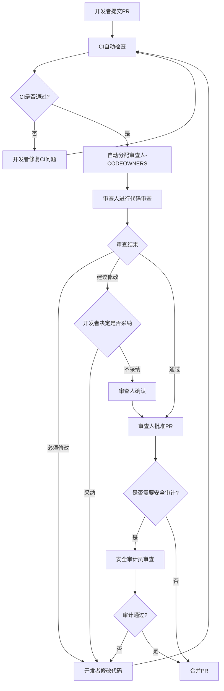

# SOC Copilot 代码审查规范

> 关联需求：FR-002（代码审查流程管理）
> 版本：1.0.0
> 最后更新：2025-01

## 1. 概述

本文档定义了 SOC Copilot 项目的代码审查规范，涵盖审查流程、审查分类、审查清单、审查意见分类及安全相关文件的审查规则。所有代码变更必须通过代码审查后方可合并。

## 2. 审查流程



### 2.1 审查触发条件

| 条件         | 说明                                                     |
| ------------ | -------------------------------------------------------- |
| 所有PR       | 必须经过至少1名审查人批准                                |
| 安全相关文件 | 涉及 auth、security、secret 相关模块需安全审计员参与     |
| 数据库迁移   | 涉及 `migrations_alembic/` 需后端开发 + DevOps工程师审查 |
| K8s配置      | 涉及 `k8s/` 需 DevOps工程师审查                          |
| CI/CD配置    | 涉及 `.github/` 需 DevOps工程师审查                      |

### 2.2 审查人分配

审查人通过 `.github/CODEOWNERS` 文件自动分配，规则如下：

| 目录/文件                                             | 审查人角色              | 说明             |
| ----------------------------------------------------- | ----------------------- | ---------------- |
| `/backend/`                                           | 后端开发                | 后端代码变更     |
| `/frontend/`                                          | 前端开发                | 前端代码变更     |
| `/.github/`                                           | DevOps工程师            | CI/CD流程变更    |
| `/k8s/`                                               | DevOps工程师            | 基础设施变更     |
| `/backend/app/core/security*.py`                      | 安全审计员 + 后端开发   | 安全模块变更     |
| `/backend/app/core/csrf.py`                           | 安全审计员 + 后端开发   | CSRF防护变更     |
| `/backend/app/core/ssrf_protection.py`                | 安全审计员 + 后端开发   | SSRF防护变更     |
| `/backend/app/core/token_blacklist.py`                | 安全审计员 + 后端开发   | Token管理变更    |
| `/backend/app/core/sensitive_data.py`                 | 安全审计员 + 后端开发   | 敏感数据处理变更 |
| `/backend/app/core/security_validators.py`            | 安全审计员 + 后端开发   | 安全验证变更     |
| `/backend/app/core/cookie_auth.py`                    | 安全审计员 + 后端开发   | Cookie认证变更   |
| `/backend/app/models/secret.py`                       | 安全审计员 + 后端开发   | 密钥模型变更     |
| `/backend/app/models/api_key.py`                      | 安全审计员 + 后端开发   | API密钥模型变更  |
| `/backend/app/models/security_alert.py`               | 安全审计员 + 后端开发   | 安全告警模型变更 |
| `/backend/app/models/security_vulnerability.py`       | 安全审计员 + 后端开发   | 漏洞模型变更     |
| `/backend/app/models/rbac.py`                         | 安全审计员 + 后端开发   | RBAC模型变更     |
| `/backend/app/models/audit_log.py`                    | 安全审计员 + 后端开发   | 审计日志模型变更 |
| `/backend/app/dependencies/auth.py`                   | 安全审计员 + 后端开发   | 认证依赖变更     |
| `/backend/app/dependencies/authorization.py`          | 安全审计员 + 后端开发   | 授权依赖变更     |
| `/backend/app/dependencies/rbac.py`                   | 安全审计员 + 后端开发   | RBAC依赖变更     |
| `/backend/app/middleware/security_headers.py`         | 安全审计员 + 后端开发   | 安全头中间件变更 |
| `/backend/app/middleware/csrf_middleware.py`          | 安全审计员 + 后端开发   | CSRF中间件变更   |
| `/backend/app/middleware/authorization_middleware.py` | 安全审计员 + 后端开发   | 授权中间件变更   |
| `/backend/app/middleware/audit_middleware.py`         | 安全审计员 + 后端开发   | 审计中间件变更   |
| `/backend/app/routers/auth.py`                        | 安全审计员 + 后端开发   | 认证路由变更     |
| `/backend/app/routers/secrets.py`                     | 安全审计员 + 后端开发   | 密钥路由变更     |
| `/backend/app/routers/security_alerts.py`             | 安全审计员 + 后端开发   | 安全告警路由变更 |
| `/backend/app/routers/security_vulnerabilities.py`    | 安全审计员 + 后端开发   | 漏洞路由变更     |
| `/backend/app/repositories/secret_repository.py`      | 安全审计员 + 后端开发   | 密钥仓库变更     |
| `/backend/app/migrations_alembic/`                    | 后端开发 + DevOps工程师 | 数据库迁移变更   |

### 2.3 审查时限

| 变更类型 | 期望审查时限 | 说明            |
| -------- | ------------ | --------------- |
| 普通变更 | 24小时内     | 常规功能开发    |
| 紧急修复 | 4小时内      | 生产环境Bug修复 |
| 安全修复 | 2小时内      | 安全漏洞修复    |
| 发布分支 | 4小时内      | 版本发布相关    |

## 3. 审查分类

### 3.1 变更类型分类

PR提交时必须在模板中标注变更类型：

| 类型       | 标识        | 说明               | 审查要求               |
| ---------- | ----------- | ------------------ | ---------------------- |
| 功能新增   | `feat`      | 新功能、新模块     | 完整审查               |
| Bug修复    | `fix`       | 修复已知问题       | 重点审查修复逻辑       |
| 重构       | `refactor`  | 代码重构不改变行为 | 重点审查行为一致性     |
| 安全修复   | `security`  | 安全漏洞修复       | **安全审计员必须参与** |
| 性能优化   | `perf`      | 性能改进           | 需性能基准数据         |
| 文档更新   | `docs`      | 仅文档变更         | 简化审查               |
| 测试补充   | `test`      | 仅测试代码         | 简化审查               |
| 配置变更   | `config`    | 配置文件修改       | DevOps审查             |
| 数据库迁移 | `migration` | 数据库结构变更     | **后端+DevOps审查**    |

### 3.2 影响范围分类

| 范围     | 标识        | 说明           | 审查要求           |
| -------- | ----------- | -------------- | ------------------ |
| 后端     | `backend`   | 仅影响后端     | 后端开发审查       |
| 前端     | `frontend`  | 仅影响前端     | 前端开发审查       |
| 全栈     | `fullstack` | 前后端均有变更 | 前端+后端审查      |
| 基础设施 | `infra`     | K8s/CI/CD配置  | DevOps审查         |
| 安全     | `security`  | 安全相关模块   | **安全审计员参与** |
| 数据库   | `database`  | 数据模型/迁移  | 后端+DevOps审查    |

## 4. 审查检查清单

### 4.1 通用检查项

| #   | 检查类别   | 检查项                                         | 严重程度    |
| --- | ---------- | ---------------------------------------------- | ----------- |
| 1   | 代码风格   | 是否符合 Ruff/Black/isort/ESLint/Prettier 规则 | 🔴 必须修改 |
| 2   | 逻辑正确性 | 业务逻辑是否正确、边界条件是否覆盖             | 🔴 必须修改 |
| 3   | 安全风险   | 是否存在注入、XSS、密钥硬编码等风险            | 🔴 必须修改 |
| 4   | API兼容性  | API变更是否向后兼容、是否需要版本升级          | 🔴 必须修改 |
| 5   | 性能影响   | 是否引入N+1查询、内存泄漏等性能问题            | 🟡 建议修改 |
| 6   | 代码复用   | 是否存在重复代码、是否可提取公共组件           | 🟡 建议修改 |
| 7   | 文档更新   | 是否同步更新了相关文档和类型定义               | 🟡 建议修改 |

### 4.2 后端专项检查项

| #   | 检查类别   | 检查项                                    | 严重程度    |
| --- | ---------- | ----------------------------------------- | ----------- |
| 1   | 类型注解   | 公共API是否有完整类型注解                 | 🔴 必须修改 |
| 2   | 异常处理   | 是否有适当的异常捕获和处理                | 🔴 必须修改 |
| 3   | 数据验证   | Pydantic模型是否完整定义验证规则          | 🔴 必须修改 |
| 4   | SQL安全    | 是否使用参数化查询、是否存在SQL注入风险   | 🔴 必须修改 |
| 5   | 异步正确性 | async/await使用是否正确、是否存在阻塞调用 | 🟡 建议修改 |
| 6   | 日志记录   | 关键操作是否有适当日志记录                | 🟡 建议修改 |
| 7   | 测试覆盖   | 新增代码是否有对应测试用例                | 🟡 建议修改 |

### 4.3 前端专项检查项

| #   | 检查类别       | 检查项                                                | 严重程度    |
| --- | -------------- | ----------------------------------------------------- | ----------- |
| 1   | TypeScript类型 | 组件Props是否有完整类型定义                           | 🔴 必须修改 |
| 2   | XSS防护        | 是否正确转义用户输入、是否使用dangerouslySetInnerHTML | 🔴 必须修改 |
| 3   | 响应式设计     | 是否适配不同屏幕尺寸                                  | 🟡 建议修改 |
| 4   | 可访问性       | 是否符合WCAG 2.2 Level AA标准                         | 🟡 建议修改 |
| 5   | 国际化         | 用户可见文本是否使用i18n翻译                          | 🟡 建议修改 |
| 6   | 状态管理       | 状态是否合理使用React Query/Zustand                   | 🟡 建议修改 |

### 4.4 安全专项检查项

安全相关文件必须额外通过以下检查：

| #   | 检查类别 | 检查项                              | 严重程度    |
| --- | -------- | ----------------------------------- | ----------- |
| 1   | 认证安全 | 认证流程是否安全、Token管理是否规范 | 🔴 必须修改 |
| 2   | 授权安全 | RBAC权限检查是否完整、越权风险      | 🔴 必须修改 |
| 3   | 密钥管理 | 是否有密钥硬编码、密钥轮换是否支持  | 🔴 必须修改 |
| 4   | 输入验证 | 所有用户输入是否经过验证和清洗      | 🔴 必须修改 |
| 5   | 敏感数据 | 敏感数据是否加密存储、日志是否脱敏  | 🔴 必须修改 |
| 6   | CSRF防护 | 状态变更请求是否有CSRF Token验证    | 🔴 必须修改 |
| 7   | SSRF防护 | 外部请求URL是否有白名单/黑名单验证  | 🔴 必须修改 |
| 8   | 审计日志 | 安全相关操作是否有审计日志记录      | 🔴 必须修改 |

## 5. 审查意见分类

### 5.1 意见类型

| 分类     | GitHub标签        | 含义                         | 处理方式                 |
| -------- | ----------------- | ---------------------------- | ------------------------ |
| 必须修改 | `review:must-fix` | 阻塞性问题，不修改不予合并   | 开发者必须修改并重新提交 |
| 建议修改 | `review:suggest`  | 改进性建议，可采纳可不采纳   | 开发者回复采纳或说明理由 |
| 仅评论   | `review:comment`  | 知识分享或疑问，无需代码变更 | 开发者回复即可           |

### 5.2 审查意见格式

审查人在PR中提出意见时，应遵循以下格式：

````
**[必须修改/建议修改/仅评论]** 检查类别

具体问题描述...

建议修改方式（如适用）：
```代码示例```
````

示例：

````
**[必须修改]** 安全风险

第42行存在SQL注入风险，直接拼接用户输入构建查询。

建议修改方式：
```python
# 修改前
query = f"SELECT * FROM alerts WHERE id = '{alert_id}'"

# 修改后
query = select(Alert).where(Alert.id == alert_id)
````

```

## 6. 安全相关文件审查规则

### 6.1 安全文件清单

以下文件被归类为安全相关文件，任何变更都需要安全审计员参与审查：

**核心安全模块** (`backend/app/core/`):
- `security.py` - 核心安全配置
- `security_validators.py` - 安全验证器
- `csrf.py` - CSRF防护
- `ssrf_protection.py` - SSRF防护
- `token_blacklist.py` - Token黑名单
- `sensitive_data.py` - 敏感数据处理
- `cookie_auth.py` - Cookie认证

**安全相关模型** (`backend/app/models/`):
- `secret.py` - 密钥模型
- `api_key.py` - API密钥模型
- `security_alert.py` - 安全告警模型
- `security_vulnerability.py` - 漏洞模型
- `rbac.py` - RBAC模型
- `audit_log.py` - 审计日志模型

**安全相关依赖** (`backend/app/dependencies/`):
- `auth.py` - 认证依赖
- `authorization.py` - 授权依赖
- `rbac.py` - RBAC依赖

**安全相关中间件** (`backend/app/middleware/`):
- `security_headers.py` - 安全响应头
- `csrf_middleware.py` - CSRF中间件
- `authorization_middleware.py` - 授权中间件
- `audit_middleware.py` - 审计中间件

**安全相关路由** (`backend/app/routers/`):
- `auth.py` - 认证路由
- `secrets.py` - 密钥路由
- `security_alerts.py` - 安全告警路由
- `security_vulnerabilities.py` - 漏洞路由

**安全相关仓库** (`backend/app/repositories/`):
- `secret_repository.py` - 密钥仓库

### 6.2 安全审查流程

1. PR涉及安全相关文件时，CODEOWNERS会自动要求安全审计员审查
2. 安全审计员审查时必须完成 4.4 安全专项检查清单
3. 安全审计员发现必须修改项时，PR不可合并
4. 安全修复类PR应优先审查（2小时内）

### 6.3 安全审查通过标准

- [ ] 无密钥硬编码
- [ ] 所有用户输入经过验证
- [ ] 敏感数据加密存储
- [ ] 日志中不包含敏感信息
- [ ] 权限检查完整
- [ ] 认证流程安全
- [ ] 无已知安全漏洞模式

## 7. 审查自动化

### 7.1 CI自动检查

PR提交后自动执行以下检查，全部通过后方可进入人工审查：

| 检查项 | 工具 | 阻断级别 |
|--------|------|---------|
| Python代码风格 | Ruff + Black + isort | 阻断 |
| Python类型检查 | mypy | 阻断 |
| JavaScript/TypeScript风格 | ESLint + Prettier | 阻断 |
| TypeScript类型 | tsc | 阻断 |
| 安全扫描 | Bandit + Gitleaks | 阻断 |
| 依赖安全 | pip-audit + npm audit | 阻断 |
| PR描述完整性 | 自定义脚本 | 提醒 |
| 变更文件审查人匹配 | CODEOWNERS验证 | 提醒 |

### 7.2 PR标题规范检查

PR标题必须遵循 Conventional Commits 格式：

```

<type>(<scope>): <subject>

```

有效类型：`feat`, `fix`, `refactor`, `security`, `perf`, `docs`, `test`, `config`, `migration`

有效范围：`backend`, `frontend`, `infra`, `security`, `database`, `fullstack`

### 7.3 PR大小限制

| 变更规模 | 行数 | 建议 |
|----------|------|------|
| 小型 | < 200行 | 正常审查 |
| 中型 | 200-500行 | 建议拆分，审查人可要求拆分 |
| 大型 | > 500行 | **建议强制拆分**，除非有充分理由 |

## 8. 角色与职责

### 8.1 PR提交者

- 确保CI检查通过后再请求审查
- 填写完整的PR描述和检查清单
- 及时响应审查意见
- 区分必须修改和建议修改

### 8.2 审查人

- 在规定时限内完成审查
- 使用审查意见分类标注意见严重程度
- 提供建设性的修改建议
- 确保审查检查清单各项已覆盖

### 8.3 安全审计员

- 审查安全相关文件变更
- 完成安全专项检查清单
- 对安全风险给出明确的处理建议
- 优先审查安全修复类PR

## 附录

### A. 相关文件

- `.github/CODEOWNERS` - 代码所有者定义
- `.github/PULL_REQUEST_TEMPLATE/code-review.md` - PR模板
- `.github/workflows/pr-review-checks.yml` - PR审查自动化CI
- `AGENTS.md` - 角色定义与职责

### B. 参考标准

- [OWASP Code Review Guide](https://owasp.org/www-project-code-review-guide/)
- [Google Engineering Practices - Code Review](https://google.github.io/eng-practices/review/)
- [Conventional Commits](https://www.conventionalcommits.org/)
```
