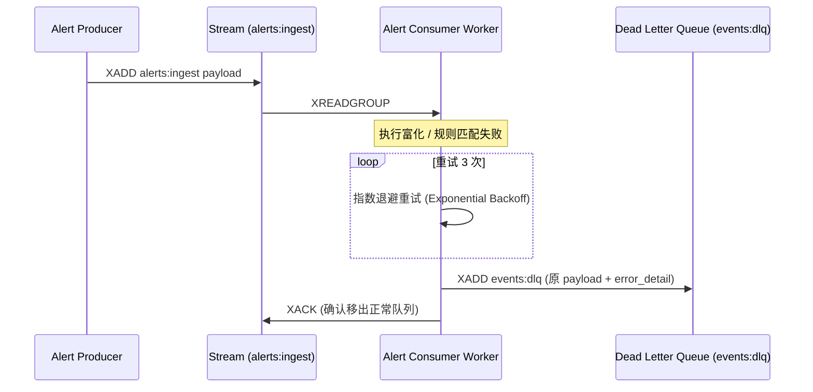

# SOC Copilot SRE Runbook: Redis Streams 死信队列 (DLQ) 积压排查与重放指南

## 1. 适用场景与告警指标
- **告警名称**：`RedisStreamsDLQBacklogHigh` / `AlertPipelineConsumerStalled`
- **队列标识**：`events:dlq` (Redis Stream)
- **触发条件**：重试超过 `max_retries`（默认 3 次）仍失败的异常事件被移入死信队列
- **SLA 目标**：积压事件排查与处置不超过 30 分钟

---

## 2. 死信队列流转链路



---

## 3. 诊断与积压量查询

### 查询当前死信队列长度
```bash
docker exec -it soc-redis redis-cli xlen events:dlq
```

### 查看最新 5 条死信详情与错误堆栈
```bash
docker exec -it soc-redis redis-cli xrevrange events:dlq + - COUNT 5
```

---

## 4. 故障根因分类排查

| 错误特征 (Error Pattern) | 常见根因 (Root Cause) | 处置对策 (Remediation) |
| :--- | :--- | :--- |
| `PayloadValidationError` | 上游 Webhook 格式变更或缺少必填字段 | 修复适配器代码或更新 Pydantic Schema |
| `TIProviderTimeoutError` | 外部威胁情报 API 超时 (OTX/VirusTotal) | 检查配额，动态降低单批次富化并发数 |
| `DBDeadlockDetected` | 关联分析聚合并发写入死锁 | 调整 PostgreSQL 锁重试策略与事务隔离 |

---

## 5. 死信事件批量重放与清理

### 执行重放脚本 (Replay to Ingest Stream)
```python
# scripts/replay_dlq.py
import asyncio
import json
import redis.asyncio as aioredis

async def replay_dlq(limit=100):
    r = await aioredis.from_url("redis://localhost:6379/0", decode_responses=True)
    messages = await r.xrange("events:dlq", count=limit)
    print(f"Replaying {len(messages)} events...")
    
    for msg_id, data in messages:
        payload = json.loads(data["payload"])
        # 重新投入主管道
        await r.xadd("alerts:ingest", {"payload": json.dumps(payload)})
        # 移出死信队列
        await r.xdel("events:dlq", msg_id)
        
    print("Replay completed.")
    await r.aclose()

if __name__ == "__main__":
    asyncio.run(replay_dlq())
```

### 确认重放结果
```bash
# 验证死信队列长度归零
docker exec -it soc-redis redis-cli xlen events:dlq
```
