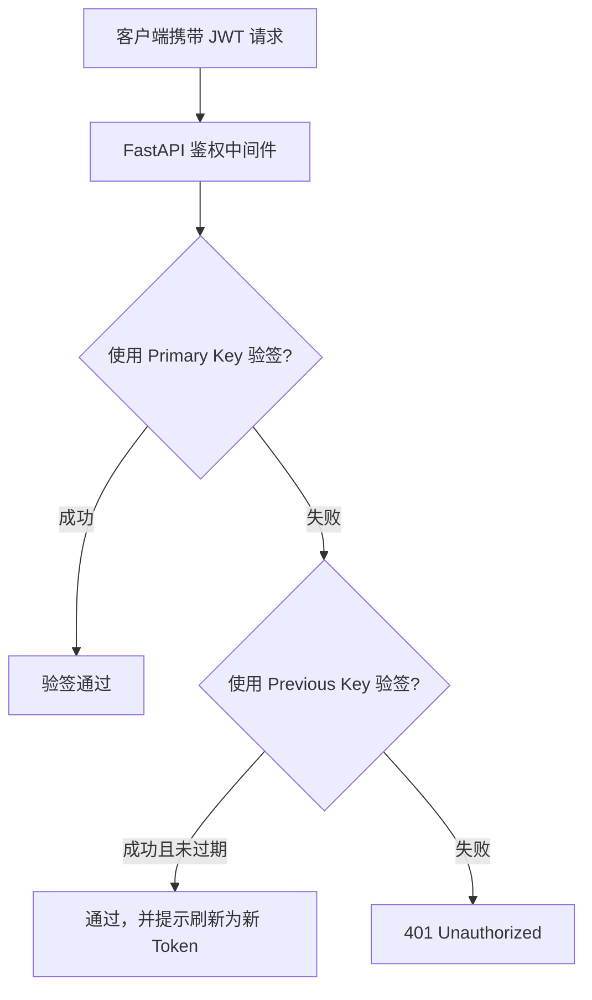

# SOC Copilot SRE Runbook: 生产环境 JWT 密钥紧急轮换 (Zero-Downtime Rotation)

## 1. 适用场景与安全等级
- **安全等级**：**P0 (Critical)**
- **触发场景**：代码泄露、环境变量遭非授权读取、管理员凭据暴露怀疑被滥用
- **核心原则**：**双密钥平滑轮换 (Dual-Key Invalidation)**，既切断泄露密钥的未授权签发，又避免已登录合法用户大面积强制登出造成业务震荡

---

## 2. 双密钥轮换机制设计



---

## 3. 轮换标准操作程序 (SOP)

### 步骤 1: 生成强熵新密钥
```bash
# 生成 32 字节 (256 位) 强随机安全密钥
python3 -c "import secrets; print(secrets.token_urlsafe(32))"
```

### 步骤 2: 配置双密钥环境变量
- 将当前在线生效的 `JWT_SECRET` 移动至 `JWT_SECRET_PREVIOUS`
- 将新生成的随机密钥写入 `JWT_SECRET`

```bash
# Kubernetes ConfigMap / Secret 更新示例
kubectl create secret generic soc-jwt-secret \
  --from-literal=JWT_SECRET="new_highly_secure_token_secret_32_chars..." \
  --from-literal=JWT_SECRET_PREVIOUS="old_compromised_secret_moved_here..." \
  --dry-run=client -o yaml | kubectl apply -f -
```

### 步骤 3: 触发滚动更新
```bash
# 滚动重启后端 Pod
kubectl rollout restart deployment/soc-copilot-backend
```

### 步骤 4: 紧急吊销高危 Token (Token Blacklist)
如果已知特定攻击者 Token 的 `jti`：
```bash
# 调用 Token 吊销 API 或直接在 Redis 黑名单中插入
docker exec -it soc-redis redis-cli set "jwt:blacklist:{compromised_jti}" 1 EX 86400
```

### 步骤 5: 经过 12 小时生命周期后收敛
当所有合法 Token 均已刷新签发为新密钥后：
- 将 `JWT_SECRET_PREVIOUS` 清空或移除
- 此时旧密钥签署的 Token 将全量失效
