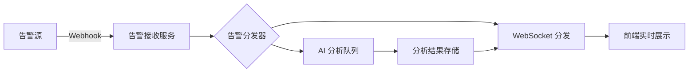

# SOC Copilot v0.8 功能增强提案

> **版本**: v0.8.1 规划  
> **日期**: 2026-02-16  
> **作者**: 架构规划

---

## 概述

本文档基于 SOC Copilot v0.8.0 现有功能，提出 10 个最前沿且可落地的新增能力，并为每个能力提供详细的实现方案、工作量评估和优先级排序。

---

## 当前系统能力回顾

| 模块       | 功能                                             |
| ---------- | ------------------------------------------------ |
| 告警分析   | AI 分类、IOC 提取、严重性评估、时间线构建        |
| Playbook   | DAG 引擎、可视化编辑、版本管理、触发器、秘密管理 |
| UEBA       | 异常检测、风险画像、用户行为基线                 |
| 威胁狩猎   | 假设驱动狩猎、IOC 批量查询                       |
| 资产管理   | CRUD、批量导入、多维度搜索                       |
| 威胁情报   | AlienVault OTX 集成、本地缓存                    |
| 云原生安全 | 容器扫描、K8s 审计                               |
| AI Copilot | 自然语言查询、Playbook 推荐                      |

---

## 10 个新增能力详细规划

### 能力 1: 实时告警流处理与 WebSocket 推送

**用户价值**

- 消除轮询延迟，告警到达即刻推送
- 支持多人协作，告警分配状态实时同步
- 提升 MTTR (Mean Time To Respond)

**实现方案**



- 后端: 新增 `AlertWebSocketManager` 类管理长连接
- 前端: 使用 React 维护 WebSocket 连接，显示实时告警卡片
- 消息队列: 利用现有 Celery/RQ 队列处理告警

**涉及模块**

- `backend/routers/alert.py` - 新增 WebSocket 端点
- `backend/services/alert_service.py` - 集成 WebSocket 推送
- `frontend/components/alert/` - 实时告警卡片组件

**数据结构改动**

```python
# 新增表: alert_notifications
class AlertNotification(Base):
    __tablename__ = "alert_notifications"
    id = Column(String, primary_key=True)
    alert_id = Column(String, ForeignKey("alerts.id"))
    user_id = Column(String, ForeignKey("users.id"))
    status = Column(String)  # unread, read, acknowledged
    created_at = Column(DateTime)
```

**工作量评估**: 5 人日 (后端 3, 前端 2)

---

### 能力 2: AI 告警摘要与自然语言告警查询

**用户价值**

- 告警自动摘要，快速理解告警内容
- 用自然语言搜索历史告警，降低查询门槛

**实现方案**

- 扩展 AI Service，新增 `summarize_alerts()` 方法
- 利用 RAG 技术索引告警内容到 Vector Store
- 前端增加自然语言搜索框

**涉及模块**

- `backend/services/ai_service_enhanced.py`
- `backend/services/vector_store.py`
- `frontend/app/alerts/page.tsx`

**数据结构改动**

```python
# 扩展 alert 表
class AlertModel(Base):
    # 现有字段...
    ai_summary = Column(Text)  # AI 生成的摘要
    embedding = Column(JSON)   # 向量嵌入
```

**工作量评估**: 4 人日

---

### 能力 3: SOAR 剧本模板市场 (增强版)

**用户价值**

- 快速部署行业最佳实践
- 社区贡献激励

**实现方案**

- 新增 `PlaybookTemplate` 模型支持模板元数据
- 扩展 Marketplace 支持模板评分、评论、下载统计
- 前端增加模板预览、安装向导

**涉及模块**

- `backend/models/playbook_template.py` (新建)
- `backend/routers/marketplace.py`
- `frontend/app/marketplace/`

**数据结构改动**

```python
class PlaybookTemplate(Base):
    __tablename__ = "playbook_templates"
    id = Column(String, primary_key=True)
    name = Column(String)
    category = Column(String)
    description = Column(Text)
    definition_json = Column(JSON)
    author = Column(String)
    downloads = Column(Integer, default=0)
    rating = Column(Float, default=0.0)
    tags = Column(JSON)
    is_official = Column(Boolean, default=False)
```

**工作量评估**: 6 人日

---

### 能力 4: 自动化漏洞关联与优先级排序

**用户价值**

- 告警自动关联 CVEs，聚焦真实威胁
- 减少人工研判时间

**实现方案**

- 新增漏洞库同步服务 (NVD API)
- 告警分析时自动关联资产漏洞
- 计算基于漏洞的可利用性优先级

**涉及模块**

- `backend/services/vulnerability_service.py` (新建)
- `backend/services/alert_service.py`
- `backend/routers/vulnerabilities.py` (新建)

**数据结构改动**

```python
class Vulnerability(Base):
    __tablename__ = "vulnerabilities"
    cve_id = Column(String, primary_key=True)
    description = Column(Text)
    cvss_score = Column(Float)
    affected_assets = Column(JSON)  # 关联资产列表
    last_scanned = Column(DateTime)

class AssetVulnerability(Base):
    __tablename__ = "asset_vulnerabilities"
    asset_id = Column(String, ForeignKey("assets.id"))
    vulnerability_id = Column(String, ForeignKey("vulnerabilities.cve_id"))
    status = Column(String)  # open, mitigated, false_positive
```

**工作量评估**: 7 人日

---

### 能力 5: 用户实体行为分析 (UEBA) 增强 - 动态基线

**用户价值**

- 识别偏离正常行为的内部威胁
- 减少误报，提升检测精度

**实现方案**

- 引入统计模型计算用户行为基线
- 检测异常: 登录时间、访问资源、数据下载量
- 前端可视化用户风险评分趋势

**涉及模块**

- `backend/services/ueba_service.py`
- `backend/models/ueba_baseline.py` (新建)
- `frontend/app/ueba/`

**数据结构改动**

```python
class UserBehaviorBaseline(Base):
    __tablename__ = "user_behavior_baselines"
    user_id = Column(String, ForeignKey("users.id"))
    metric_name = Column(String)  # login_time, access_count, etc.
    mean_value = Column(Float)
    std_dev = Column(Float)
    sample_size = Column(Integer)
    last_updated = Column(DateTime)

class UserRiskEvent(Base):
    __tablename__ = "user_risk_events"
    id = Column(String, primary_key=True)
    user_id = Column(String, ForeignKey("users.id"))
    event_type = Column(String)
    risk_score = Column(Float)
    details = Column(JSON)
    created_at = Column(DateTime)
```

**工作量评估**: 8 人日

---

### 能力 6: 自动化威胁狩猎工作流

**用户价值**

- 将人工狩猎经验转化为自动化剧本
- 持续主动发现隐藏威胁

**实现方案**

- 新增 `HuntCampaign` 模型管理狩猎活动
- 支持 IOC 列表批量导入触发自动狩猎
- 狩猎结果自动生成 Playbook 建议

**涉及模块**

- `backend/models/hunt_campaign.py` (新建)
- `backend/services/threat_hunting_service.py`
- `backend/routers/threat_hunting.py`
- `frontend/app/threat-hunting/`

**数据结构改动**

```python
class HuntCampaign(Base):
    __tablename__ = "hunt_campaigns"
    id = Column(String, primary_key=True)
    name = Column(String)
    hypothesis = Column(Text)  # 狩猎假设
    ioc_list = Column(JSON)    # IOC 列表
    status = Column(String)    # running, completed, paused
    results = Column(JSON)     # 狩猎结果
    created_by = Column(String)
    created_at = Column(DateTime)
    completed_at = Column(DateTime)
```

**工作量评估**: 6 人日

---

### 能力 7: 安全知识库 (RAG) 增强

**用户价值**

- 构建组织专属安全知识库
- AI 分析基于组织上下文

**实现方案**

- 扩展 Vector Store 支持知识文档管理
- 支持 PDF/Markdown 文档上传和自动分段
- AI 分析时自动检索相关知识

**涉及模块**

- `backend/services/knowledge_base_service.py` (新建)
- `backend/services/vector_store.py`
- `frontend/app/knowledge/` (新建)

**数据结构改动**

```python
class KnowledgeDocument(Base):
    __tablename__ = "knowledge_documents"
    id = Column(String, primary_key=True)
    title = Column(String)
    content = Column(Text)
    doc_type = Column(String)  # policy, incident, playbook, faq
    embeddings = Column(JSON)
    metadata = Column(JSON)
    uploaded_by = Column(String)
    created_at = Column(DateTime)
```

**工作量评估**: 5 人日

---

### 能力 8: 仪表盘自定义与报告自动化

**用户价值**

- 按角色定制仪表盘
- 自动化生成周期性安全报告

**实现方案**

- 新增 Dashboard 配置模型
- 支持图表组件拖拽布局
- 定时生成 PDF/PPT 报告

**涉及模块**

- `backend/models/dashboard_config.py` (新建)
- `backend/services/report_service.py`
- `frontend/app/dashboard/`

**数据结构改动**

```python
class DashboardConfig(Base):
    __tablename__ = "dashboard_configs"
    id = Column(String, primary_key=True)
    name = Column(String)
    owner_id = Column(String, ForeignKey("users.id"))
    layout = Column(JSON)  # 组件布局配置
    is_default = Column(Boolean)
    created_at = Column(DateTime)

class ScheduledReport(Base):
    __tablename__ = "scheduled_reports"
    id = Column(String, primary_key=True)
    name = Column(String)
    schedule = Column(String)  # cron 表达式
    format = Column(String)    # pdf, pptx, markdown
    recipients = Column(JSON)
    content_template = Column(String)
```

**工作量评估**: 7 人日

---

### 能力 9: 多租户隔离与协作空间

**用户价值**

- 支持多个安全团队使用同一平台
- 团队间数据隔离，跨团队协作

**实现方案**

- 引入 Workspace 概念
- 租户级别数据隔离
- 跨租户告警转发和协作

**涉及模块**

- `backend/models/workspace.py` (新建)
- `backend/core/security.py` - 租户权限检查
- `frontend/app/workspace/` (新建)

**数据结构改动**

```python
class Workspace(Base):
    __tablename__ = "workspaces"
    id = Column(String, primary_key=True)
    name = Column(String)
    owner_id = Column(String, ForeignKey("users.id"))
    plan = Column(String)  # free, pro, enterprise
    settings = Column(JSON)
    created_at = Column(DateTime)

class WorkspaceMember(Base):
    __tablename__ = "workspace_members"
    workspace_id = Column(String, ForeignKey("workspaces.id"))
    user_id = Column(String, ForeignKey("users.id"))
    role = Column(String)  # admin, analyst, viewer
    joined_at = Column(DateTime)
```

**工作量评估**: 10 人日

---

### 能力 10: 集成第三方 SIEM 查询

**用户价值**

- 在 SOC Copilot 中直接查询 Splunk/Elasticsearch
- 统一分析界面

**实现方案**

- 新增 SIEM 连接器框架
- 支持 Splunk SPL 和 Elasticsearch DSL 查询
- 查询结果直接用于告警分析和狩猎

**涉及模块**

- `backend/integrations/siem_connector.py` (新建)
- `backend/services/siem_query_service.py` (新建)
- `frontend/app/siem/` (新建)

**数据结构改动**

```python
class SIEMConnection(Base):
    __tablename__ = "siem_connections"
    id = Column(String, primary_key=True)
    name = Column(String)
    provider = Column(String)  # splunk, elasticsearch
    endpoint = Column(String)
    auth_config = Column(JSON)  # 加密存储
    is_active = Column(Boolean)
    last_verified = Column(DateTime)

class SIEMQuery(Base):
    __tablename__ = "siem_queries"
    id = Column(String, primary_key=True)
    connection_id = Column(String, ForeignKey("siem_connections.id"))
    query = Column(Text)
    time_range = Column(String)
    results = Column(JSON)
    executed_by = Column(String)
    executed_at = Column(DateTime)
```

**工作量评估**: 8 人日

---

## 优先级评估

| 排名 | 能力              | 价值分 | 复杂度 | 优先级 |
| ---- | ----------------- | ------ | ------ | ------ |
| 1    | 实时告警流处理    | 9      | 5      | **高** |
| 2    | AI 告警摘要       | 8      | 4      | **高** |
| 3    | SOAR 剧本模板市场 | 8      | 6      | **高** |
| 4    | 漏洞关联与优先级  | 8      | 7      | 中     |
| 5    | UEBA 动态基线     | 8      | 8      | 中     |
| 6    | 威胁狩猎工作流    | 7      | 6      | 中     |
| 7    | 安全知识库        | 7      | 5      | 中     |
| 8    | 仪表盘自定义      | 7      | 7      | 低     |
| 9    | 多租户隔离        | 6      | 10     | 低     |
| 10   | SIEM 集成         | 6      | 8      | 低     |

---

## v0.8 开发计划 (Top 3)

### 阶段 1: 实时告警流处理 (能力 1)

**时间**: 第 1-2 周

| 任务                 | 负责人 | 预计工时 |
| -------------------- | ------ | -------- |
| WebSocket 服务端实现 | 后端   | 2 人日   |
| 告警推送逻辑         | 后端   | 1 人日   |
| 前端 WebSocket 连接  | 前端   | 1 人日   |
| 实时告警卡片组件     | 前端   | 1 人日   |

### 阶段 2: AI 告警摘要 (能力 2)

**时间**: 第 3 周

| 任务                | 负责人 | 预计工时 |
| ------------------- | ------ | -------- |
| 告警摘要 AI Service | 后端   | 1.5 人日 |
| 向量存储集成        | 后端   | 1 人日   |
| 自然语言搜索 API    | 后端   | 1 人日   |
| 前端搜索界面        | 前端   | 1.5 人日 |

### 阶段 3: SOAR 剧本模板市场 (能力 3)

**时间**: 第 4-5 周

| 任务         | 负责人 | 预计工时 |
| ------------ | ------ | -------- |
| 模板数据模型 | 后端   | 1 人日   |
| 模板市场 API | 后端   | 1.5 人日 |
| 模板安装逻辑 | 后端   | 1.5 人日 |
| 前端市场页面 | 前端   | 2 人日   |

---

## 总工作量

| 阶段     | 工时        |
| -------- | ----------- |
| 阶段 1   | 6 人日      |
| 阶段 2   | 5 人日      |
| 阶段 3   | 6 人日      |
| **总计** | **17 人日** |

---

## 风险与依赖

1. **AI Provider 稳定性**: 依赖外部 AI 服务，需配置降级策略
2. **WebSocket 连接数**: 高并发场景需评估连接数限制
3. **模板安全**: 社区模板需进行代码安全审查

---

## 总结

推荐 v0.8 优先实现以上 3 个能力，它们共同构成**实时智能安全运营**的核心体验:

- 实时告警推送消除信息延迟
- AI 摘要提升告警研判效率
- 模板市场加速响应流程落地

这三个能力相互协同，可以显著提升 SOC 团队的运营效率。
