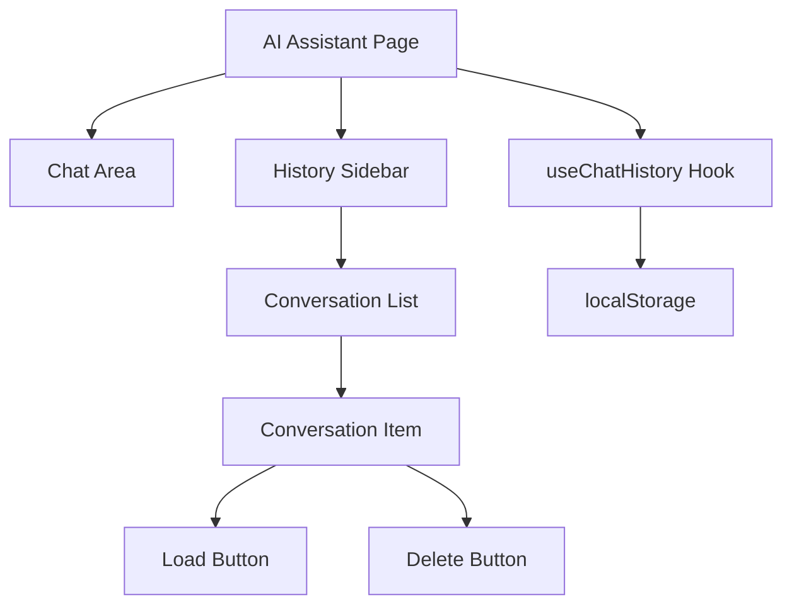

# AI Assistant 历史对话记录功能设计方案

## 1. 功能概述

为 AI Assistant 页面添加历史对话记录功能，允许用户：

- 查看历史对话列表
- 加载历史对话继续聊天
- 删除不需要的对话
- 自动保存当前对话

## 2. 技术方案

### 2.1 数据存储

使用 **localStorage** 进行前端本地存储，原因：

- 简单快速，无需后端改动
- 用户隐私友好（数据不上传）
- 适合个人设备使用场景

### 2.2 数据结构

```typescript
interface ChatMessage {
  role: "user" | "assistant";
  content: string;
  timestamp: string;
}

interface ChatConversation {
  id: string; // 唯一标识
  title: string; // 对话标题（从第一条消息生成）
  messages: ChatMessage[]; // 消息列表
  modelId?: string; // 使用的模型ID
  modelName?: string; // 模型名称
  createdAt: string; // 创建时间
  updatedAt: string; // 最后更新时间
}

interface ChatHistoryStorage {
  conversations: ChatConversation[];
  currentConversationId: string | null;
}
```

### 2.3 组件架构



## 3. 实现步骤

### 3.1 创建 useChatHistory Hook

位置：`frontend/hooks/useChatHistory.ts`

功能：

- `conversations`: 所有对话列表
- `currentConversation`: 当前对话
- `saveConversation`: 保存对话
- `loadConversation`: 加载对话
- `deleteConversation`: 删除对话
- `createNewConversation`: 创建新对话
- `updateCurrentConversation`: 更新当前对话

### 3.2 修改 AI Assistant 页面

修改位置：`frontend/app/[locale]/ai-assistant/page.tsx`

改动：

1. 引入 `useChatHistory` hook
2. 在侧边栏添加历史对话列表
3. 添加新建对话按钮
4. 实现对话切换功能
5. 自动保存当前对话

### 3.3 UI 设计

历史对话侧边栏：

```
┌─────────────────────────┐
│ 📜 历史对话              │
│ [+ 新建对话]             │
├─────────────────────────┤
│ 🔍 [搜索对话...]         │
├─────────────────────────┤
│ 🔵 分析最近告警...       │
│    2024-02-18 14:30     │
│    [加载] [删除]         │
├─────────────────────────┤
│ 🟢 推荐响应剧本...       │
│    2024-02-18 12:15     │
│    [加载] [删除]         │
├─────────────────────────┤
│ 🟣 生成分析报告...       │
│    2024-02-17 16:45     │
│    [加载] [删除]         │
└─────────────────────────┘
```

**搜索功能特性：**

- 实时搜索（输入即搜索）
- 搜索范围：对话标题 + 消息内容
- 高亮匹配关键词
- 显示匹配的消息数量
- 支持清空搜索

### 3.4 国际化支持

需要在 `messages/en.json` 和 `messages/zh.json` 中添加：

```json
{
  "aiAssistant": {
    "history": {
      "title": "Chat History",
      "newChat": "New Chat",
      "load": "Load",
      "delete": "Delete",
      "deleteConfirm": "Delete this conversation?",
      "empty": "No chat history",
      "untitled": "Untitled Chat",
      "messages": "{count} messages"
    }
  }
}
```

## 4. 详细实现

### 4.1 useChatHistory Hook

```typescript
// frontend/hooks/useChatHistory.ts
import { useState, useEffect, useCallback, useMemo } from "react";

const STORAGE_KEY = "ai_chat_history";
const MAX_CONVERSATIONS = 50; // 最多保存50条对话

export function useChatHistory() {
  const [conversations, setConversations] = useState<ChatConversation[]>([]);
  const [currentId, setCurrentId] = useState<string | null>(null);
  const [searchQuery, setSearchQuery] = useState("");

  // 初始化加载
  useEffect(() => {
    const stored = localStorage.getItem(STORAGE_KEY);
    if (stored) {
      try {
        const data = JSON.parse(stored);
        setConversations(data.conversations || []);
        setCurrentId(data.currentConversationId);
      } catch (e) {
        console.error("Failed to load chat history:", e);
      }
    }
  }, []);

  // 保存到 localStorage
  const saveToStorage = useCallback((convs: ChatConversation[], currId: string | null) => {
    localStorage.setItem(
      STORAGE_KEY,
      JSON.stringify({
        conversations: convs,
        currentConversationId: currId,
      })
    );
  }, []);

  // 搜索过滤对话
  const filteredConversations = useMemo(() => {
    if (!searchQuery.trim()) return conversations;

    const query = searchQuery.toLowerCase();
    return conversations.filter(conv => {
      // 搜索标题
      if (conv.title.toLowerCase().includes(query)) return true;
      // 搜索消息内容
      return conv.messages.some(msg => msg.content.toLowerCase().includes(query));
    });
  }, [conversations, searchQuery]);

  // 创建新对话
  const createNewConversation = useCallback(() => {
    const newId = `conv_${Date.now()}`;
    setCurrentId(newId);
    return newId;
  }, []);

  // 保存对话
  const saveConversation = useCallback(
    (messages: ChatMessage[], modelId?: string, modelName?: string) => {
      if (messages.length <= 1) return; // 只有欢迎消息不保存

      const title = generateTitle(messages);
      const now = new Date().toISOString();

      setConversations(prev => {
        const existing = prev.find(c => c.id === currentId);
        let updated: ChatConversation[];

        if (existing) {
          // 更新现有对话
          updated = prev.map(c =>
            c.id === currentId ? { ...c, messages, title, modelId, modelName, updatedAt: now } : c
          );
        } else {
          // 创建新对话
          const newConv: ChatConversation = {
            id: currentId || `conv_${Date.now()}`,
            title,
            messages,
            modelId,
            modelName,
            createdAt: now,
            updatedAt: now,
          };
          updated = [newConv, ...prev].slice(0, MAX_CONVERSATIONS);
        }

        saveToStorage(updated, currentId);
        return updated;
      });
    },
    [currentId, saveToStorage]
  );

  // 加载对话
  const loadConversation = useCallback(
    (id: string) => {
      const conv = conversations.find(c => c.id === id);
      if (conv) {
        setCurrentId(id);
        saveToStorage(conversations, id);
        return conv;
      }
      return null;
    },
    [conversations, saveToStorage]
  );

  // 删除对话
  const deleteConversation = useCallback(
    (id: string) => {
      setConversations(prev => {
        const updated = prev.filter(c => c.id !== id);
        saveToStorage(updated, id === currentId ? null : currentId);
        return updated;
      });
      if (id === currentId) {
        setCurrentId(null);
      }
    },
    [currentId, saveToStorage]
  );

  return {
    conversations,
    filteredConversations,
    currentId,
    searchQuery,
    setSearchQuery,
    createNewConversation,
    saveConversation,
    loadConversation,
    deleteConversation,
  };
}

// 生成对话标题
function generateTitle(messages: ChatMessage[]): string {
  const firstUserMsg = messages.find(m => m.role === "user");
  if (firstUserMsg) {
    const content = firstUserMsg.content;
    return content.length > 30 ? content.slice(0, 30) + "..." : content;
  }
  return "Untitled Chat";
}
```

### 4.2 页面修改要点

1. **引入 Hook**

```typescript
import { useChatHistory } from "@/hooks/useChatHistory";
```

2. **在组件中使用**

```typescript
const {
  conversations,
  currentId,
  createNewConversation,
  saveConversation,
  loadConversation,
  deleteConversation,
} = useChatHistory();
```

3. **自动保存对话**

```typescript
// 当 messages 变化时自动保存
useEffect(() => {
  if (messages.length > 1) {
    saveConversation(messages, selectedModel?.id, selectedModel?.display_name);
  }
}, [messages]);
```

4. **加载历史对话**

```typescript
const handleLoadConversation = (id: string) => {
  const conv = loadConversation(id);
  if (conv) {
    setMessages(conv.messages);
    // 恢复模型选择
    if (conv.modelId) {
      const model = models.find(m => m.id === conv.modelId);
      if (model) setSelectedModel(model);
    }
  }
};
```

## 5. 文件修改清单

| 文件                                          | 操作 | 说明              |
| --------------------------------------------- | ---- | ----------------- |
| `frontend/hooks/useChatHistory.ts`            | 新建 | 历史对话管理 Hook |
| `frontend/app/[locale]/ai-assistant/page.tsx` | 修改 | 集成历史对话功能  |
| `frontend/messages/en.json`                   | 修改 | 添加英文翻译      |
| `frontend/messages/zh.json`                   | 修改 | 添加中文翻译      |

## 6. 注意事项

1. **性能优化**
   - 限制最大保存对话数量（50条）
   - 使用 debounce 避免频繁写入 localStorage

2. **用户体验**
   - 删除前确认提示
   - 加载对话时显示加载状态
   - 新建对话时清空当前消息

3. **数据迁移**
   - 考虑未来可能的后端存储需求
   - 设计可扩展的数据结构
