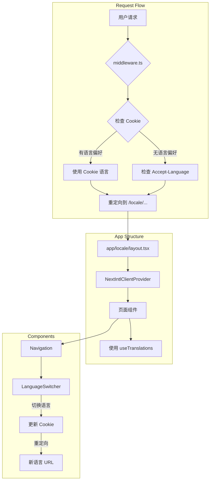

# Next.js 15 i18n 实施计划

## 项目现状分析

### 已有的 i18n 基础设施
- `next-intl` v3.26.5 已安装
- [`i18n.ts`](frontend/i18n.ts) 配置文件已存在
- [`middleware.ts.disabled`](frontend/middleware.ts.disabled) 已存在（需启用和增强）
- [`messages/en.json`](frontend/messages/en.json) 和 [`messages/zh.json`](frontend/messages/zh.json) 已存在（仅包含 monitor 和 theme 部分）
- [`LanguageSwitcher.tsx`](frontend/components/LanguageSwitcher.tsx) 组件已存在

### 需要改造的核心文件
1. [`next.config.js`](frontend/next.config.js) - 添加 next-intl 插件
2. [`middleware.ts`](frontend/middleware.ts) - 启用并增强语言检测
3. [`app/layout.tsx`](frontend/app/layout.tsx) - 迁移到 `[locale]` 目录
4. [`components/Navigation.tsx`](frontend/components/Navigation.tsx) - 添加 i18n 支持
5. [`app/page.tsx`](frontend/app/page.tsx) - 首页迁移
6. [`app/playbooks/page.tsx`](frontend/app/playbooks/page.tsx) - Playbooks 页面迁移

---

## 实施步骤

### 步骤 1: 配置 next-intl 插件

**修改文件**: [`next.config.js`](frontend/next.config.js)

```javascript
const createNextIntlPlugin = require('next-intl/plugin');

const withNextIntl = createNextIntlPlugin();

/** @type {import('next').NextConfig} */
const nextConfig = {
  // ... 现有配置
};

module.exports = withNextIntl(nextConfig);
```

**验证方式**: 运行 `npm run dev` 确认无报错

---

### 步骤 2: 启用并增强 middleware.ts

**新建文件**: [`middleware.ts`](frontend/middleware.ts)（重命名自 `middleware.ts.disabled`）

增强功能：
- 优先读取 cookie 中的语言设置
- 其次读取 Accept-Language header
- 自动重定向到对应的 locale 路径

```typescript
import createMiddleware from 'next-intl/middleware';
import { locales, defaultLocale } from './i18n';
import { NextRequest, NextResponse } from 'next/server';

export default function middleware(request: NextRequest) {
  // 1. 检查 cookie 中的语言偏好
  const cookieLocale = request.cookies.get('NEXT_LOCALE')?.value;
  
  // 2. 如果 cookie 中有有效语言，使用它
  if (cookieLocale && locales.includes(cookieLocale as any)) {
    // 继续使用 next-intl 的中间件处理
    return createMiddleware({
      locales,
      defaultLocale,
      localePrefix: 'always' // 始终显示 /en 或 /zh
    })(request);
  }
  
  // 3. 否则使用默认行为（Accept-Language 检测）
  return createMiddleware({
    locales,
    defaultLocale,
    localePrefix: 'always'
  })(request);
}

export const config = {
  matcher: ['/((?!api|_next|_next/static|_next/image|favicon.ico|.*\\..*).*)']
};
```

**验证方式**: 访问 `/` 自动重定向到 `/en` 或 `/zh`

---

### 步骤 3: 创建 app/[locale] 目录结构

**新建目录和文件**:

```
frontend/app/
├── [locale]/
│   ├── layout.tsx        # 新建 - 包含 NextIntlClientProvider
│   ├── page.tsx          # 迁移自 app/page.tsx
│   └── playbooks/
│       └── page.tsx      # 迁移自 app/playbooks/page.tsx
├── api/                  # 保持原位置（API 路由不需要 i18n）
└── ...其他页面暂时保持原位置
```

---

### 步骤 4: 创建 app/[locale]/layout.tsx

**新建文件**: [`app/[locale]/layout.tsx`](frontend/app/[locale]/layout.tsx)

```typescript
import type { Metadata, Viewport } from "next";
import { NextIntlClientProvider } from 'next-intl';
import { getMessages, setRequestLocale } from 'next-intl/server';
import { notFound } from 'next/navigation';
import "../globals.css";
import BackToTop from "@/components/BackToTop";
import { ResponsiveProvider } from "@/components/common/ResponsiveLayout";
import { locales, type Locale } from '@/i18n';

export const metadata: Metadata = {
  title: "SOC Copilot - Security Operations Console",
  description: "Internal Security Operations Workbench",
};

export const viewport: Viewport = {
  width: "device-width",
  initialScale: 1,
  maximumScale: 5,
  userScalable: true,
  themeColor: [
    { media: "(prefers-color-scheme: light)", color: "#ffffff" },
    { media: "(prefers-color-scheme: dark)", color: "#1f2937" },
  ],
};

export function generateStaticParams() {
  return locales.map((locale) => ({ locale }));
}

export default async function LocaleLayout({
  children,
  params: { locale }
}: {
  children: React.ReactNode;
  params: { locale: string };
}) {
  // 验证 locale
  if (!locales.includes(locale as Locale)) {
    notFound();
  }

  // 启用静态渲染
  setRequestLocale(locale);

  // 获取翻译消息
  const messages = await getMessages();

  return (
    <html lang={locale}>
      <head>
        <meta name="format-detection" content="telephone=no" />
        <meta name="mobile-web-app-capable" content="yes" />
        <meta name="apple-mobile-web-app-capable" content="yes" />
        <meta name="apple-mobile-web-app-status-bar-style" content="default" />
      </head>
      <body className="antialiased min-h-screen bg-slate-50">
        <NextIntlClientProvider messages={messages}>
          <ResponsiveProvider>
            {children}
            <BackToTop />
          </ResponsiveProvider>
        </NextIntlClientProvider>
      </body>
    </html>
  );
}
```

**验证方式**: 页面能正常渲染，无 hydration 错误

---

### 步骤 5: 扩展翻译文件

**修改文件**: [`messages/en.json`](frontend/messages/en.json)

新增 `nav`、`common`、`playbooks` 分组：

```json
{
  "nav": {
    "home": "Home",
    "runs": "Runs",
    "definitions": "Definitions",
    "ai": "AI",
    "ueba": "UEBA",
    "hunting": "Hunting",
    "market": "Market",
    "cloud": "Cloud",
    "dify": "Dify",
    "triggers": "Triggers",
    "settings": "Settings",
    "monitor": "Monitor",
    "users": "Users",
    "exit": "Exit",
    "logout": "Logout",
    "apiStatus": {
      "healthy": "API Connected",
      "checking": "Checking...",
      "error": "API Connection Failed"
    }
  },
  "common": {
    "loading": "Loading...",
    "refresh": "Refresh",
    "filter": "Filter",
    "all": "All",
    "actions": "Actions",
    "viewDetails": "View Details",
    "noData": "No data found",
    "error": "Error"
  },
  "home": {
    "title": "Security Operations Console",
    "subtitle": "Alert analysis, timeline, reports & assets",
    "tabs": {
      "alertAnalyzer": "Alert Analyzer",
      "timelineBuilder": "Timeline Builder",
      "reportWriter": "Report Writer",
      "assets": "Assets"
    },
    "history": "History"
  },
  "playbooks": {
    "title": "Playbook Runs",
    "subtitle": "Execute and monitor automated security playbooks",
    "filters": "Filters",
    "playbook": "Playbook",
    "allPlaybooks": "All Playbooks",
    "status": "Status",
    "allStatuses": "All Statuses",
    "statuses": {
      "running": "Running",
      "success": "Success",
      "failed": "Failed",
      "partial": "Partial"
    },
    "mode": "Mode",
    "started": "Started",
    "duration": "Duration",
    "loading": "Loading playbook runs...",
    "noRuns": "No playbook runs found",
    "availablePlaybooks": "Available Playbooks",
    "steps": "steps",
    "queue": {
      "title": "Run Queue",
      "running": "Running",
      "queued": "Queued",
      "max": "Max"
    }
  },
  "monitor": { ... },
  "theme": { ... },
  "language": { ... }
}
```

**修改文件**: [`messages/zh.json`](frontend/messages/zh.json)

对应的中文翻译：

```json
{
  "nav": {
    "home": "首页",
    "runs": "运行",
    "definitions": "定义",
    "ai": "AI",
    "ueba": "UEBA",
    "hunting": "狩猎",
    "market": "市场",
    "cloud": "云原生",
    "dify": "Dify",
    "triggers": "触发器",
    "settings": "设置",
    "monitor": "监控",
    "users": "用户",
    "exit": "退出",
    "logout": "注销",
    "apiStatus": {
      "healthy": "API 连接正常",
      "checking": "检查中...",
      "error": "API 连接失败"
    }
  },
  "common": {
    "loading": "加载中...",
    "refresh": "刷新",
    "filter": "筛选",
    "all": "全部",
    "actions": "操作",
    "viewDetails": "查看详情",
    "noData": "暂无数据",
    "error": "错误"
  },
  "home": {
    "title": "安全运营控制台",
    "subtitle": "告警分析、时间线、报告和资产",
    "tabs": {
      "alertAnalyzer": "告警分析",
      "timelineBuilder": "时间线构建",
      "reportWriter": "报告撰写",
      "assets": "资产管理"
    },
    "history": "历史记录"
  },
  "playbooks": {
    "title": "剧本运行",
    "subtitle": "执行和监控自动化安全剧本",
    "filters": "筛选条件",
    "playbook": "剧本",
    "allPlaybooks": "所有剧本",
    "status": "状态",
    "allStatuses": "所有状态",
    "statuses": {
      "running": "运行中",
      "success": "成功",
      "failed": "失败",
      "partial": "部分成功"
    },
    "mode": "模式",
    "started": "开始时间",
    "duration": "耗时",
    "loading": "加载剧本运行...",
    "noRuns": "未找到剧本运行记录",
    "availablePlaybooks": "可用剧本",
    "steps": "步骤",
    "queue": {
      "title": "运行队列",
      "running": "运行中",
      "queued": "排队中",
      "max": "最大并发"
    }
  },
  "monitor": { ... },
  "theme": { ... },
  "language": { ... }
}
```

**验证方式**: 翻译文件无 JSON 语法错误

---

### 步骤 6: 改造 Navigation.tsx

**修改文件**: [`components/Navigation.tsx`](frontend/components/Navigation.tsx)

主要改动：
1. 添加 `useTranslations` hook
2. 替换所有硬编码文案为翻译 key
3. 集成 `LanguageSwitcher` 组件
4. 修改路由跳转逻辑以支持 locale 前缀

```typescript
"use client";

import { useRouter, usePathname } from "next/navigation";
import { useTranslations, useLocale } from 'next-intl';
import { loadAuthState, logout, isAdmin, isAnalystOrAdmin } from "@/lib/auth";
import { useState, ReactNode } from "react";
import { Menu, X } from "lucide-react";
import { LanguageSwitcher } from "./LanguageSwitcher";

// ... 其他代码

export default function Navigation({ title, subtitle, apiStatus, actions }: NavigationProps) {
  const t = useTranslations('nav');
  const tCommon = useTranslations('common');
  const locale = useLocale();
  const router = useRouter();
  const pathname = usePathname();
  // ...

  // 导航项使用翻译
  const navItems = [
    { label: t("home"), path: `/${locale}` },
    { label: t("runs"), path: `/${locale}/playbooks` },
    { label: t("definitions"), path: `/${locale}/playbooks/definitions` },
    // ... 其他项
  ];

  // 路由跳转时保持 locale
  const handleNavigation = (path: string) => {
    router.push(path);
  };

  return (
    <nav>
      {/* ... */}
      
      {/* 添加语言切换按钮 */}
      <LanguageSwitcher />
      
      {/* 退出按钮使用翻译 */}
      <button onClick={handleLogout}>
        {t("exit")}
      </button>
      
      {/* ... */}
    </nav>
  );
}
```

**验证方式**: 导航栏显示翻译后的文案，语言切换按钮可用

---

### 步骤 7: 改造首页

**新建文件**: [`app/[locale]/page.tsx`](frontend/app/[locale]/page.tsx)

从 [`app/page.tsx`](frontend/app/page.tsx) 迁移，主要改动：
1. 添加 `useTranslations` hook
2. 替换硬编码文案
3. 更新路由跳转逻辑

```typescript
"use client";

import { useState, useEffect, useCallback } from "react";
import { useRouter } from "next/navigation";
import { useTranslations, useLocale } from 'next-intl';
// ... 其他 imports

export default function HomePage() {
  const t = useTranslations('home');
  const tCommon = useTranslations('common');
  const locale = useLocale();
  // ...

  const tabDefs = [
    { key: "alert", label: t("tabs.alertAnalyzer") },
    { key: "timeline", label: t("tabs.timelineBuilder") },
    { key: "report", label: t("tabs.reportWriter") },
    { key: "assets", label: t("tabs.assets") },
  ];

  return (
    <div>
      <Navigation
        title={t("title")}
        subtitle={t("subtitle")}
        apiStatus={apiStatus === "unhealthy" ? "error" : apiStatus}
      />
      {/* ... */}
    </div>
  );
}
```

**验证方式**: 访问 `/en` 和 `/zh` 显示对应语言的首页

---

### 步骤 8: 改造 Playbooks 页面

**新建文件**: [`app/[locale]/playbooks/page.tsx`](frontend/app/[locale]/playbooks/page.tsx)

从 [`app/playbooks/page.tsx`](frontend/app/playbooks/page.tsx) 迁移，主要改动：
1. 添加 `useTranslations` hook
2. 替换关键按钮/标题文案
3. 更新路由跳转逻辑

```typescript
"use client";

import { useState, useEffect } from "react";
import { useRouter } from "next/navigation";
import { useTranslations, useLocale } from 'next-intl';
// ... 其他 imports

export default function PlaybooksPage() {
  const t = useTranslations('playbooks');
  const tCommon = useTranslations('common');
  const locale = useLocale();
  // ...

  return (
    <div>
      <Navigation 
        title={t("title")} 
        subtitle={t("subtitle")} 
      />
      
      <main>
        {/* 筛选区域 */}
        <div>
          <h2>{t("filters")}</h2>
          <label>{t("playbook")}</label>
          <select>
            <option value="">{t("allPlaybooks")}</option>
            {/* ... */}
          </select>
          
          <label>{t("status")}</label>
          <select>
            <option value="">{t("allStatuses")}</option>
            <option value="running">{t("statuses.running")}</option>
            <option value="success">{t("statuses.success")}</option>
            <option value="failed">{t("statuses.failed")}</option>
            <option value="partial">{t("statuses.partial")}</option>
          </select>
          
          <button>{tCommon("refresh")}</button>
        </div>
        
        {/* 表格 */}
        <table>
          <thead>
            <tr>
              <th>{t("playbook")}</th>
              <th>{t("status")}</th>
              <th>{t("mode")}</th>
              <th>{t("started")}</th>
              <th>{t("duration")}</th>
              <th>{tCommon("actions")}</th>
            </tr>
          </thead>
          {/* ... */}
        </table>
        
        {/* 可用剧本 */}
        <div>
          <h2>{t("availablePlaybooks")}</h2>
          {/* ... */}
        </div>
      </main>
    </div>
  );
}
```

**验证方式**: 访问 `/en/playbooks` 和 `/zh/playbooks` 显示对应语言

---

### 步骤 9: 处理其他页面的兼容性

**策略**: 保持其他页面在原位置，但添加重定向逻辑

**修改文件**: [`app/page.tsx`](frontend/app/page.tsx)（保留作为重定向）

```typescript
// app/page.tsx - 重定向到默认语言
import { redirect } from 'next/navigation';
import { defaultLocale } from '@/i18n';

export default function RootPage() {
  redirect(`/${defaultLocale}`);
}
```

**保留原 layout.tsx**: 作为根布局，但只处理重定向

```typescript
// app/layout.tsx - 简化为最小布局
export default function RootLayout({
  children,
}: {
  children: React.ReactNode;
}) {
  return children;
}
```

**其他页面**: 暂时保持原位置，后续可渐进迁移

---

### 步骤 10: 验证和测试

#### 验收测试清单

| 测试项 | 预期结果 | 验证方式 |
|--------|----------|----------|
| 访问 `/` | 自动重定向到 `/en` 或 `/zh` | 浏览器访问 |
| 访问 `/en` | 显示英文首页 | 浏览器访问 |
| 访问 `/zh` | 显示中文首页 | 浏览器访问 |
| 语言切换按钮 | 点击可切换语言 | 点击测试 |
| 切换后保持路径 | `/en/playbooks` → `/zh/playbooks` | 导航后检查 URL |
| 刷新后语言保持 | Cookie 记住语言偏好 | 刷新页面验证 |
| 导航栏翻译 | 显示对应语言的导航项 | 视觉检查 |
| 首页翻译 | Tab 标签等显示翻译 | 视觉检查 |
| Playbooks 翻译 | 表头、按钮等显示翻译 | 视觉检查 |
| 其他页面可访问 | 未迁移页面仍可正常访问 | 直接访问 URL |
| `npm run dev` | 无报错正常启动 | 终端检查 |

---

## 文件变更清单

### 新建文件
1. [`middleware.ts`](frontend/middleware.ts) - 从 `.disabled` 启用
2. [`app/[locale]/layout.tsx`](frontend/app/[locale]/layout.tsx)
3. [`app/[locale]/page.tsx`](frontend/app/[locale]/page.tsx)
4. [`app/[locale]/playbooks/page.tsx`](frontend/app/[locale]/playbooks/page.tsx)

### 修改文件
1. [`next.config.js`](frontend/next.config.js) - 添加 next-intl 插件
2. [`messages/en.json`](frontend/messages/en.json) - 扩展翻译
3. [`messages/zh.json`](frontend/messages/zh.json) - 扩展翻译
4. [`components/Navigation.tsx`](frontend/components/Navigation.tsx) - 添加 i18n
5. [`components/LanguageSwitcher.tsx`](frontend/components/LanguageSwitcher.tsx) - 更新路由逻辑
6. [`app/layout.tsx`](frontend/app/layout.tsx) - 简化为根布局
7. [`app/page.tsx`](frontend/app/page.tsx) - 改为重定向

### 保留不变
- 所有 API 路由 (`app/api/*`)
- 其他未迁移页面 (`app/admin/*`, `app/settings/*`, 等)
- 所有组件（除 Navigation 和 LanguageSwitcher）

---

## 架构图



---

## 注意事项

1. **渐进迁移**: 只迁移示范模块，其他页面保持可运行
2. **路由兼容**: 确保旧路由（如 `/playbooks`）重定向到新路由（如 `/en/playbooks`）
3. **Cookie 设置**: 语言切换时设置 `NEXT_LOCALE` cookie，有效期 1 年
4. **SSG 支持**: 使用 `generateStaticParams` 支持静态生成
5. **API 路由**: API 路由不受 i18n 影响，保持原位置

---

## 后续扩展

完成本次实施后，可按需渐进迁移其他页面：
- `/admin/*` 页面
- `/settings/*` 页面
- `/triggers/*` 页面
- 其他业务页面
