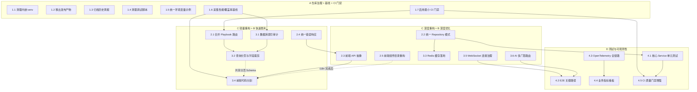

# SOC Copilot 综合治理与优化路线图

> **目标**: 覆盖 A（仓库治理）、B（性能优化）、C（架构重构）、D（测试与可观测性）四大方向，把 v0.9.0 代码库从“可运行”推进到“可长期维护”。
> **版本**: v0.9.0 → v0.9.1/v0.10.0
> **日期**: 2026-06-18
> **作者**: 架构规划
> **分支基线**: `ui/p0-p2-optimizations`

---

## 0. 现状速览

- 后端 Python 文件 200+，前端 TS/TSX 文件 180+。
- 存在内嵌虚拟环境 `Lib/site-packages`、发布产物 `ai-assistant-release*`、历史周报 `docs/week1/2/3` 等噪音。
- Playbook 路由新旧并存：`backend/routers/playbook_definitions.py` 与 `backend/routers/playbook/` 目录。
- 部分 Service 已用 Repository 模式，部分仍直接操作 DB。
- 前端 `app/api/proxy` 直接转发，缺少统一的 API 客户端抽象；根目录散落大量调试脚本。
- 性能基准：首屏 3-5s（目标 <2s），API P99 500-800ms（目标 <200ms）。
- 已有 OpenTelemetry、Prometheus、Grafana 配置，但生产链路完整度待验证。

---

## 1. 优化总览

| 阶段 | 主题 | 预计周期 | 风险 | 产出 |
|---|---|---|---|---|
| Phase 1 | 仓库治理 + 基线采集 + 最小 CI 门禁 | 1 周 | 低 | 干净的代码库、可量化的基线、提交即检查 |
| Phase 2 | 架构重构（轻量）+ 性能快速胜利 | 2 周 | 中 | 统一路由/错误响应、DB 索引/分页、前端代码分割 |
| Phase 3 | 架构重构（深度）+ 缓存/连接/AI 路由 | 2-3 周 | 中 | Repository 模式、Redis 缓存、WebSocket 治理、AI 降级 |
| Phase 4 | 测试与可观测性 | 持续 | 中 | 质量门禁、故障定位能力 |

---

## 1.1 范围与边界说明

本路线图只解决**现有代码库的治理、重构、性能与质量**，不新增业务功能。以下能力由 `plans/SOC_Copilot_v0.8_Enhancement_Proposal.md` 负责，本计划仅做必要的兼容性调整：

- WebSocket 实时告警推送（本计划只做现有连接的治理与稳定性，不做新推送功能）
- RAG / 向量知识库
- SOAR 模板市场增强
- UEBA 动态基线
- 多租户 Workspace
- 第三方 SIEM 连接器

**与 i18n 计划的协同**：`plans/i18n-implementation-plan.md` 正在将页面迁移到 `app/[locale]/`。本计划中的**前端组件目录重构（2.5）**必须在 i18n 迁移合并后进行；在此之前，所有前端优化只改代码不改目录结构。

---

## 2. 依赖与并行关系

**可并行步骤**:
- Phase 1 内部步骤可并行；1.6 与 1.7 可在其他治理任务完成后并行启动。
- Phase 2 中：2.1、2.4、3.1 可并行；3.2 依赖 3.1；3.4 与 3.2 共享分页 Schema，需每周同步。
- Phase 3 中：2.2 与 3.3/3.5/3.6 可并行；2.3 依赖 2.4；2.5 必须在 i18n 迁移完成后执行。
- Phase 4 中：4.3/4.4 可并行；4.1 与 4.2/4.5 可并行。

---

## 3. Phase 1：仓库治理（低风险快速胜利）

### 步骤 1.1：移除内嵌虚拟环境 `Lib/site-packages`

**上下文**: 仓库根目录存在 `Lib/site-packages/`，包含 `dns`、`idna` 等完整 Python 包。这是典型的虚拟环境残留，不应入版本库。

**任务**:
1. 全局搜索 `Lib/site-packages` 是否被代码显式引用（`sys.path`、导入语句、shell 脚本）。
2. 删除工作目录中的 `Lib/site-packages/`。
3. 在根 `.gitignore` 中添加 `Lib/`、`venv/`、`.venv/`、`__pycache__/`、`*.pyc`。
4. 使用 `git filter-repo` 或 BFG Repo-Cleaner 清理 Git 历史中的 `Lib/` 大文件，减小仓库体积。
5. 在 `README.md` / `DEVELOPMENT_GUIDE.md` 中补充虚拟环境创建说明。
6. 验证 `backend` 在独立虚拟环境中可启动。
7. 团队公告：建议所有开发者重新 clone 仓库，避免历史大文件被重新推送。

**涉及文件**:
- `Lib/site-packages/`（删除）
- `.gitignore`
- `README.md`
- `DEVELOPMENT_GUIDE.md`

**验收标准**:
- `git ls-files | grep "^Lib/"` 无输出。
- `git rev-list --objects --all | grep "^Lib/"` 无输出（历史已清理）。
- `python -m venv venv && source venv/bin/activate && pip install -r backend/requirements.txt && uvicorn backend.main:app --port 8000` 成功启动。
- 新 clone 仓库耗时显著下降。

**回滚策略**:
- 删除前将目录打包备份到 `/tmp/soc-copilot-lib-backup.tar.gz`。
- 若历史清理误伤其他文件，使用备份仓库或 `git reflog` 恢复。

---

### 步骤 1.2：移出发布产物 `ai-assistant-release*`

**上下文**: `ai-assistant-release/` 与 `ai-assistant-release-sanitized/` 是外部发布产物，不应与主代码库混放。

**任务**:
1. 确认两个目录的内容与主业务无关。
2. 将其迁移到独立仓库或 GitHub Release Assets。
3. 在主仓库 README 中添加指向发布资产的链接。
4. 删除原目录。

**涉及文件**:
- `ai-assistant-release/`（删除/迁移）
- `ai-assistant-release-sanitized/`（删除/迁移）
- `README.md`

**验收标准**:
- 两个目录不再出现在仓库根目录。
- 原有 README 中的相关链接仍可访问。

---

### 步骤 1.3：归档历史周报 `docs/week1/2/3`

**上下文**: `docs/week1/`、`docs/week2/`、`docs/week3/` 是开发过程中的日报/周报，属于归档资料。

**任务**:
1. 创建 `docs/archive/` 目录。
2. 将 `week1/`、`week2/`、`week3/` 移入 `docs/archive/`。
3. 在 `docs/archive/README.md` 中建立索引。

**涉及文件**:
- `docs/week1/`、`docs/week2/`、`docs/week3/`（移动）
- `docs/archive/README.md`（新建）

**验收标准**:
- `docs/` 根目录只保留当前有效文档。
- 历史资料通过 `docs/archive/README.md` 可检索。

---

### 步骤 1.4：清理前端调试脚本

**上下文**: 前端根目录散落 `debug_*.mjs`、`verify_*.mjs`、`open_monitor.mjs`、`check_history_times.mjs` 等临时脚本。

**任务**:
1. 识别所有临时调试脚本。
2. 将仍需要的脚本移入 `frontend/scripts/debug/`；废弃的删除。
3. 在 `frontend/scripts/debug/README.md` 说明每个脚本的用途和运行方式。

**涉及文件**:
- `frontend/debug_*.mjs`
- `frontend/verify_*.mjs`
- `frontend/open_monitor.mjs`
- `frontend/check_history_times.mjs`
- `frontend/clear_cache.mjs`
- `frontend/preview_monitor.mjs`
- `frontend/scripts/debug/`（新建）

**验收标准**:
- 前端根目录下无 `.mjs` 调试脚本。
- 保留的脚本在 `frontend/scripts/debug/` 中有说明文档。

---

### 步骤 1.5：统一环境变量示例与版本号

**上下文**: 根目录存在多个 `.env.*.example`，根 `package.json` 版本为 `0.8.2`，与前后端 `0.9.0` 不一致。

**任务**:
1. 合并 `.env.example`、`.env.notifications.example`、`.env.wazuh.example` 为单一 `.env.example`，按模块分组注释（Backend / Frontend / Notifications / Wazuh / Security）。
2. 同步根 `package.json` 版本为 `0.9.0`。
3. 检查并同步以下文件中的版本号：`frontend/package.json`、`backend/pyproject.toml`、`README.md`、`.claude/CLAUDE.md`。
4. 删除旧的 `.env.notifications.example` 和 `.env.wazuh.example`。

**涉及文件**:
- `.env.example`
- `.env.notifications.example`（删除）
- `.env.wazuh.example`（删除）
- `package.json`
- `frontend/package.json`
- `backend/pyproject.toml`
- `README.md`
- `.claude/CLAUDE.md`

**验收标准**:
- 只有一个 `.env.example`。
- `package.json`（根）、`frontend/package.json`、`backend/pyproject.toml`、`README.md`、`.claude/CLAUDE.md` 中的版本号一致（统一为 `0.9.0` 或目标版本）。

---

### 步骤 1.6：采集性能与覆盖率基线

**上下文**: 没有量化基线，后续优化效果无法客观评估。

**任务**:
1. 编写脚本 `scripts/benchmark_api.py`，对核心 API（告警分析、告警列表、审计日志、Playbook 列表）进行压测并记录 P50/P95/P99。
2. 使用 `pytest-cov` 统计当前后端核心 Service 覆盖率，记录到 `docs/baselines.md`。
3. 使用 `next-bundle-analyzer` 或 `@next/bundle-analyzer` 记录首屏 JS 体积，截图保存。
4. 记录当前 Lighthouse Performance 分数（桌面 + 移动端）。

**涉及文件**:
- `scripts/benchmark_api.py`（新建）
- `docs/baselines.md`（新建）
- `frontend/next.config.js`

**验收标准**:
- `docs/baselines.md` 包含：API 延迟基线、覆盖率基线、首屏 JS 体积、Lighthouse 分数。
- `scripts/benchmark_api.py` 可独立运行并输出 JSON 报告。

---

### 步骤 1.7：启用最小 CI 质量门禁

**上下文**: 已有 GitHub Actions 与 pre-commit 配置，但需确保每次提交都触发基础检查。

**任务**:
1. 在 `.github/workflows/ci-cd.yml` 中增加一个 `quality-gate` job：
   - `cd backend && ruff check .`
   - `cd frontend && npm run lint && npm run type-check`
2. 确保该 job 在 PR 合并前必须通过。
3. 在 `.pre-commit-config.yaml` 中启用 ruff 与 prettier 钩子（如未启用）。

**涉及文件**:
- `.github/workflows/ci-cd.yml`
- `.pre-commit-config.yaml`

**验收标准**:
- 任何包含 ruff 或 TypeScript 错误的 PR 无法合并。
- CI quality-gate 平均耗时 < 5 分钟。

---

## 4. Phase 2：轻量重构 + 性能快速胜利

> **本阶段执行顺序**（不按文档中的步骤编号）：
> 1. `2.1 合并 Playbook 路由`
> 2. `2.4 统一错误响应与错误码`
> 3. `3.1 数据库索引审计`
> 4. `3.2 查询分页与字段裁剪`（依赖 3.1）
> 5. `2.3 前端 API 抽象层`（依赖 2.4 的错误码规范）
> 6. `3.4 前端代码分割`（与 3.2 共享分页 Schema，需同步）
>
> 步骤编号保留为话题标识，实际依赖关系以第 2 节的依赖图为准。

### 步骤 2.1：合并 Playbook 路由

**上下文**: `backend/routers/playbook_definitions.py` 与 `backend/routers/playbook/` 目录同时存在，后者已按 `definitions.py`、`runs.py`、`versions.py`、`approvals.py`、`queries.py` 拆分。

**任务**:
1. 对比 `playbook_definitions.py` 与 `playbook/definitions.py` 的端点差异。
2. 将唯一端点迁移到 `playbook/` 子模块。
3. 更新 `backend/main.py` 中的导入，移除旧路由。
4. 删除 `backend/routers/playbook_definitions.py`。
5. 更新前端调用路径（如有硬编码旧路径）。

**涉及文件**:
- `backend/routers/playbook_definitions.py`
- `backend/routers/playbook/definitions.py`
- `backend/main.py`
- `frontend/app/[locale]/playbooks/` 相关 hooks

**验收标准**:
- `playbook_definitions.py` 不再存在。
- 所有 Playbook API 测试通过。
- Swagger `/docs` 中 Playbook 端点无重复。

---

### 步骤 2.2：统一 Repository 模式

**上下文**: 目前仅 `asset_repository.py`、`audit_repository.py`、`user_repository.py` 实现了 Repository，大量 Service 直接操作 DB Session。

**任务**:
1. 梳理直接操作 DB 的 Service（优先级：`alert_service`、`playbook_service`、`threat_intel_service`、`history_service`）。
2. 为每个核心模块创建/完善 Repository。
3. Service 通过 Repository 访问数据，不再直接 `db.execute()` 或 `db.query()`。
4. 在 `backend/repositories/base.py` 补充通用 CRUD 与分页方法。

**涉及文件**:
- `backend/repositories/base.py`
- `backend/repositories/alert_repository.py`（新建）
- `backend/repositories/playbook_repository.py`（新建）
- `backend/repositories/threat_intel_repository.py`（新建）
- `backend/services/alerting/alert_service.py`
- `backend/services/playbook/playbook_service.py`
- `backend/services/threat_intel_service.py`

**验收标准**:
- 核心 Service 不再直接导入 `AsyncSessionLocal` 进行写操作。
- 新增 Repository 单元测试，覆盖 CRUD 与分页。

---

### 步骤 2.3：前端 API 抽象层

**上下文**: 前端通过 `app/api/proxy/[...path]/route.ts` 直接转发，业务组件中 fetch 调用分散，错误处理、重试、类型封装不统一。

**前置依赖**: `2.4 统一错误响应与错误码` 必须完成，API Client 才能按统一错误码做国际化提示和 401/403 跳转。

**任务**:
1. 创建 `frontend/lib/api.ts`（或 `frontend/api/client.ts`）。
2. 与后端对齐错误码规范，封装统一的 `api.get / api.post / api.patch / api.delete`，处理：
   - 401/403 自动跳转登录
   - 按 `error_codes.py` 中的 code 做国际化错误提示（对接 `notificationStore`）
   - 请求/响应类型推导
   - 重试策略（幂等请求）
3. 逐步将页面中的直接 fetch 调用迁移到 `apiClient`。

**涉及文件**:
- `frontend/lib/api.ts`（新建）
- `frontend/app/api/proxy/[...path]/route.ts`
- `frontend/hooks/useRetryFetch.ts`
- 各页面 hooks（优先级：`usePlaybooks.ts`、`useAuditLogs.ts`、`useAIChat.ts`）

**验收标准**:
- 新 API 调用全部通过 `apiClient`。
- 单元测试覆盖 401/403/500 处理，且错误提示使用 error code 而非英文 message。

---

### 步骤 2.4：统一错误响应与错误码

**上下文**: `backend/core/enums/error_codes.py` 与 `backend/core/response.py` 已存在，但需确认所有 Router 是否统一使用。

**任务**:
1. 审计所有 Router 的异常处理，替换裸 `HTTPException` 为统一错误响应。
2. 统一使用 `error_codes.py` 中定义的错误码。
3. 前端根据错误码做国际化提示，而非解析英文 message。
4. 清理 `backend/routers/logout_patch.txt` 等临时补丁文件。

**涉及文件**:
- `backend/core/enums/error_codes.py`
- `backend/core/response.py`
- `backend/core/exceptions.py`
- 所有 `backend/routers/*.py`
- `frontend/components/common/ErrorDisplay.tsx`

**验收标准**:
- 所有 API 错误返回统一格式 `{ code, message, detail }`。
- 前端错误提示支持中英文。

---

### 步骤 2.5：前端组件目录重构

**上下文**: 组件同时存在于 `frontend/components/` 和 `frontend/app/[locale]/xxx/components/`，边界模糊。

**任务**:
1. 将通用原子组件保留在 `frontend/components/common/`。
2. 将业务组件按功能域迁移到 `frontend/features/<domain>/components/`：
   - `alerts/`、`playbooks/`、`monitor/`、`audit/`、`ai-assistant/`、`threat-intel/`
3. 每个 feature 目录包含 `components/`、`hooks/`、`types.ts`、`utils.ts`。
4. 更新所有导入路径。

**涉及文件**:
- `frontend/features/`（新建）
- `frontend/components/alerts/`、`playbook/`、`monitor/`、`websocket/`、`threat_intel/`、`chat/`、`impact/`（迁移）
- `frontend/app/[locale]/audit/components/`、`ai-assistant/components/`、`playbooks/hooks/`（迁移）

**验收标准**:
- 业务组件按 feature 组织。
- `frontend/components/` 只保留通用组件。
- `npm run lint` 与 `npm run type-check` 通过。

---

## 5. Phase 3：深度重构 + 深度优化（Repository、缓存、连接治理、AI 路由）

> **本阶段执行顺序**（不按文档中的步骤编号）：
> 1. `2.2 统一 Repository 模式` 与 `3.3 Redis 缓存落地`、`3.5 WebSocket 连接治理`、`3.6 AI 多厂商路由` 可并行。
> 2. `2.3 前端 API 抽象层` 完成后，可深度推进 `3.4 前端代码分割`。
> 3. `2.5 前端组件目录重构` **必须在 i18n 迁移合并后**执行，否则暂停。
>
> 步骤编号保留为话题标识，实际依赖关系以第 2 节的依赖图为准。

### 步骤 3.1：数据库索引审计

**上下文**: `backend/create_indexes.py` 与 Alembic 迁移 `v0_9_0_performance_indexes.py` 可能重复或不同步。

**任务**:
1. 对比 `create_indexes.py` 与所有 Alembic 迁移中的索引定义。
2. 将索引定义统一迁移到 Alembic，删除 `create_indexes.py`。
3. 补充缺失索引：`alerts.created_at`、`alerts.severity`、`audit_log.timestamp`、`playbook_run.status`。
4. **PostgreSQL 在线建索引**：Alembic 迁移中使用 `op.create_index(..., postgresql_concurrently=True)`，并将迁移事务模式设为 `transactional_ddl = False` 或非事务执行，避免生产环境锁表。
5. 对慢查询使用 `EXPLAIN ANALYZE` 验证。

**涉及文件**:
- `backend/create_indexes.py`（删除）
- `backend/migrations_alembic/versions/`
- `backend/models/*.py`

**验收标准**:
- 生产环境 `alembic upgrade head` 自动创建所有索引。
- 核心查询 P99 下降 30% 以上。

---

### 步骤 3.2：查询分页与字段裁剪

**上下文**: 告警列表、审计日志等数据量大，需确保全链路分页与字段裁剪。

**任务**:
1. 审计 `backend/services/` 中所有列表查询，强制使用分页参数。
2. Service 层返回 Pydantic Response Schema，而非完整 ORM 对象。
3. 前端表格使用虚拟列表（`react-window`）+ 服务端分页。
4. 对 `audit_log`、`history`、`monitoring_alerts` 等大表增加默认时间范围过滤。

**涉及文件**:
- `backend/services/alerting/alert_service.py`
- `backend/services/audit_archive_service.py`
- `backend/services/history_service.py`
- `frontend/components/common/VirtualList.tsx`
- `frontend/app/[locale]/audit/components/VirtualAuditTable.tsx`

**验收标准**:
- 所有列表 API 支持 `limit/offset` 或 `cursor`。
- 审计日志 10 万条数据下 P99 < 200ms。

---

### 步骤 3.3：Redis 缓存策略落地

**上下文**: `backend/core/cache.py`、`backend/services/query_cache.py` 已存在，但需确认实际启用范围。

**任务**:
1. 梳理可缓存数据：威胁情报 OTX 结果、AI 摘要、用户权限、资产列表。
2. 统一使用 `core.cache` 封装，统一 key 命名规范（`soc:<tenant>:<module>:<id>`）。
3. 配置合理的 TTL：OTX 7 天、AI 摘要 1 天、权限 5 分钟。
4. 基础缓存防护：缓存空值（cache null）应对缓存穿透；对热点 key 使用 TTL 随机抖动（jitter）降低集中失效风险；**暂不上**布隆过滤器或分布式互斥锁，避免过度工程。

**涉及文件**:
- `backend/core/cache.py`
- `backend/services/query_cache.py`
- `backend/services/threat_intel_service.py`
- `backend/services/ai_service_enhanced.py`
- `backend/dependencies/auth.py`

**验收标准**:
- 重复 OTX 查询命中缓存率 > 80%。
- AI 摘要相同输入在 TTL 内只调用一次 LLM。

---

### 步骤 3.4：前端代码分割

**上下文**: 项目已有 `CODE_SPLITTING_IMPLEMENTATION.md`，但需验证是否覆盖所有重路由。

**任务**:
1. 对 `Dashboard`、`DAGCanvas`、`MonitoringDashboard`、`AIAssistant` 等重组件启用 `dynamic import`。
2. 分析 `next-bundle-analyzer` 输出，识别大依赖。
3. 将 `recharts`、`reactflow` 等大型库按需加载。
4. 优化 `messages/` 加载：按 namespace 拆分，避免一次性加载全部翻译。

**涉及文件**:
- `frontend/next.config.js`
- `frontend/app/[locale]/page.tsx`
- `frontend/app/[locale]/playbooks/page.tsx`
- `frontend/app/[locale]/monitor/page.tsx`
- `frontend/app/[locale]/ai-assistant/page.tsx`
- `frontend/components/dag/DAGCanvas.tsx`

**验收标准**:
- 首屏 JS bundle < 500KB（gzip）。
- LCP < 2.5s。
- Lighthouse Performance 评分 > 75。

---

### 步骤 3.5：WebSocket 连接治理

**上下文**: `backend/services/websocket_connection_pool.py`、`websocket_compression.py`、`websocket_manager.py` 同时存在，职责边界需厘清。

**任务**:
1. 明确 `WebSocketManager` 为统一入口，合并或删除重复模块。
2. 增加连接数限制、心跳检测、断线重连策略。
3. 前端 `AlertWebSocket` 增加退后台暂停、重连指数退避。
4. 对监控流数据进行压缩与采样。

**涉及文件**:
- `backend/services/websocket_manager.py`
- `backend/services/websocket_connection_pool.py`
- `backend/services/websocket_compression.py`
- `frontend/components/AlertWebSocket.tsx`

**验收标准**:
- 单实例 WebSocket 连接数可控（如 < 1000）。
- 断网恢复后 5 秒内自动重连。

---

### 步骤 3.6：AI 多厂商路由与降级

**上下文**: `backend/services/ai_providers.py` 已存在，需确认是否实现自动故障转移。

**任务**:
1. 在 `ai_providers.py` 中实现按优先级路由：主厂商失败自动切换备用厂商。
2. 对 AI 调用增加超时、重试、熔断策略。
3. 关键 AI 分析支持异步队列与结果缓存。
4. 前端显示当前 AI 提供商状态与降级提示。

**涉及文件**:
- `backend/services/ai_providers.py`
- `backend/services/ai_service_enhanced.py`
- `backend/services/llm_retry.py`
- `frontend/app/[locale]/settings/ai-models/page.tsx`

**验收标准**:
- 主 AI 服务异常时 3 秒内切换到备用服务。
- 分析接口可用性 > 99%。

---

## 6. Phase 4：测试与可观测性（质量门禁、故障定位）

### 步骤 4.1：核心 Service 单元测试

**上下文**: 后端测试覆盖密度不均，优先补齐核心逻辑。

**任务**:
1. 为以下 Service 编写单元测试：
   - `alert_service`（告警创建、去重、生命周期）
   - `playbook_run_service`（DAG 执行、重试、取消）
   - `auth` / `cookie_auth`（登录、JWT 失效、权限）
   - `asset_service`（CRUD、批量导入、影响分析）
2. 使用 `pytest-asyncio` + 内存 SQLite / mock Redis。
3. 目标：核心 Service 行覆盖率达到 70%。

**涉及文件**:
- `backend/tests/test_alert_service.py`（新建/扩展）
- `backend/tests/test_playbook_run_service.py`（新建）
- `backend/tests/test_auth.py`（扩展）
- `backend/tests/test_asset_service.py`（新建）

**验收标准**:
- `pytest backend/tests/` 全部通过。
- 核心 Service 覆盖率 ≥ 70%。

---

### 步骤 4.2：E2E 关键路径稳定

**上下文**: 已有 Playwright E2E，但需聚焦关键路径并减少 flaky。

**任务**:
1. 定义关键路径：登录 → 告警分析 → Playbook 执行 → 审批 → 登出。
2. 使用 `global.setup.ts` 完成登录态共享。
3. 为关键路径添加数据准备与清理（API  seeded 数据）。
4. 在 CI 中运行 E2E，失败时自动截图/录像。

**涉及文件**:
- `frontend/e2e/global.setup.ts`
- `frontend/e2e/critical-path.spec.ts`（新建）
- `frontend/e2e/utils/test-data.ts`
- `.github/workflows/ci-cd.yml`

**验收标准**:
- 关键路径 E2E 稳定运行 10 次无失败。
- CI 中 E2E 失败自动上传 artifact。

---

### 步骤 4.3：OpenTelemetry 全链路验证

**上下文**: `backend/observability/` 已存在，但需验证 Trace 是否贯通 Nginx → Next.js → FastAPI → DB/Redis。

**任务**:
1. 验证 FastAPI 自动 instrumentation 是否正确上报。
2. 在 Next.js 中接入 OTel（`@vercel/otel` 或自定义）。
3. 确保 Redis、SQLAlchemy、HTTP Client 都被 instrument。
4. 配置 Jaeger / OTLP Collector，本地可查看完整链路。

**涉及文件**:
- `backend/observability/tracing.py`
- `backend/observability/exporters.py`
- `frontend/sentry.server.config.ts`
- `docker-compose.yml`
- `docker-compose.override.yml`

**验收标准**:
- 任意 API 请求可在 Jaeger 中查看端到端 Trace。
- Trace 包含前端请求、后端处理、DB/Redis 调用三段。

---

### 步骤 4.4：业务指标看板

**上下文**: `backend/core/metrics.py`、`prometheus.yml` 已存在，但需补充业务指标。

**任务**:
1. 定义核心业务指标：
   - 告警处理延迟（P50/P99）
   - Playbook 执行成功率/失败率
   - AI 调用延迟与错误率
   - 活跃 WebSocket 连接数
   - 用户登录失败率
2. 在对应 Service 中埋点。
3. 提供 Grafana Dashboard JSON 文件。

**涉及文件**:
- `backend/core/metrics.py`
- `backend/services/alerting/alert_service.py`
- `backend/services/playbook/playbook_run_service.py`
- `backend/services/ai_service_enhanced.py`
- `grafana/dashboards/`（新建）

**验收标准**:
- Prometheus `/metrics` 可采集到业务指标。
- Grafana 看板能展示核心业务健康度。

---

### 步骤 4.5：CI 质量门禁

**上下文**: 已有 `.github/workflows/` 与 pre-commit 配置，但需确认是否强制阻塞。

**任务**:
1. 在 CI 中添加：
   - `ruff check backend/`
   - `pytest backend/tests/`
   - `cd frontend && npm run lint && npm run type-check && npm run test`
2. 在 PR 合并前强制 E2E 通过（或至少关键路径 E2E）。
3. 增加依赖安全扫描（Dependabot + `pip-audit` / `npm audit`）。
4. 配置 Codecov 或类似工具展示覆盖率趋势。

**涉及文件**:
- `.github/workflows/ci-cd.yml`
- `.github/workflows/pre-commit.yml`
- `.pre-commit-config.yaml`
- `backend/pyproject.toml`
- `frontend/package.json`

**验收标准**:
- 任何不合规 PR 无法合并。
- CI 平均耗时 < 15 分钟。

---

## 7. 风险与缓解

| 风险 | 影响 | 缓解措施 |
|---|---|---|
| 删除 `Lib/site-packages` 后某些脚本失效 | 中 | 删除前全局搜索引用；保留备份 |
| Playbook 路由合并导致 API 路径变化 | 中 | 保持旧路径 302 重定向一个版本 |
| Repository 重构引入回归 | 中 | 每个 Repository 配单元测试；小步提交 |
| Redis 缓存配置错误导致脏数据 | 高 | 先在小范围启用，增加缓存失效开关 |
| 前端目录重构导致导入大量变更 | 低 | 使用 IDE 批量重构 + TypeScript 校验 |
| CI E2E flaky 增加合并阻塞 | 中 | 先稳定关键路径，再扩展覆盖 |

---

## 8. 推荐执行顺序

**第一周（Phase 1）**: 1.1 → 1.2 → 1.3 → 1.4 → 1.5
**第二周（Phase 2 启动）**: 2.1 → 2.4
**第三周（Phase 2 继续）**: 2.2 → 2.3
**第四周（Phase 2 收尾 + Phase 3 启动）**: 2.5 → 3.1 → 3.2
**第五周（Phase 3）**: 3.3 → 3.4
**第六周（Phase 3 + Phase 4）**: 3.5 → 3.6 → 4.1
**第七周起（Phase 4 持续）**: 4.2 → 4.3 → 4.4 → 4.5

---

## 9. 验收总标准

- [ ] 仓库根目录无 `Lib/`、`ai-assistant-release*`、`docs/week*` 噪音。
- [ ] 所有 Playbook 路由统一在 `backend/routers/playbook/`。
- [ ] 核心 Service 通过 Repository 访问数据。
- [ ] 前端存在统一的 `apiClient`，业务组件不再直接 `fetch`。
- [ ] 所有列表 API 分页 + 字段裁剪。
- [ ] OTX / AI 摘要重复查询命中缓存。
- [ ] 首屏 JS < 500KB gzip，LCP < 2.5s，Lighthouse Performance > 75。
- [ ] 核心 Service 单元测试覆盖率 ≥ 70%。
- [ ] 任意请求可在 Jaeger 查看端到端 Trace。
- [ ] CI 阻塞不合规提交，平均耗时 < 15 分钟。

---

## 10. 相关文档

- [../README.md](../README.md)
- [../DEVELOPMENT_GUIDE.md](../DEVELOPMENT_GUIDE.md)
- [../CLAUDE.md](../.claude/CLAUDE.md)
- [../OPTIMIZATION_SUMMARY.md](../OPTIMIZATION_SUMMARY.md)
- [SOC_Copilot_v0.8_Enhancement_Proposal.md](./SOC_Copilot_v0.8_Enhancement_Proposal.md)（功能增强方向，与本优化计划互补）
